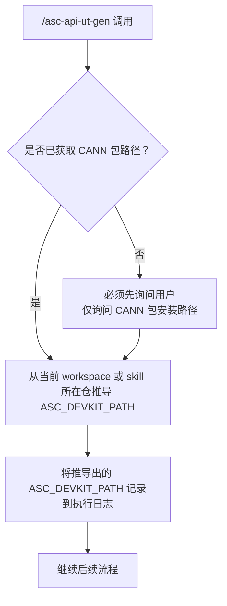
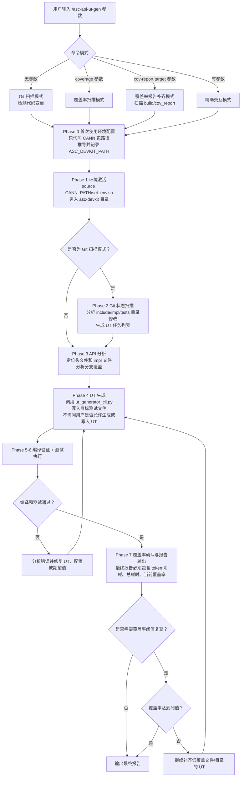
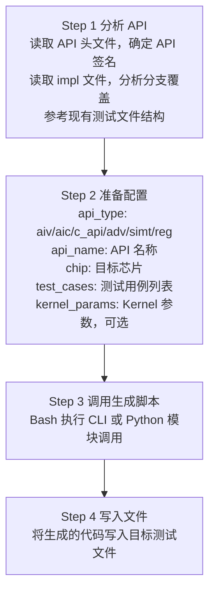

# API 单元测试技能

## 1. 概述

本技能帮助开发者编写 AscendC API 的单元测试（UT），涵盖：
- 测试框架使用（Google Test + mockcpp）
- 环境配置与编译执行
- 高阶API / membase基础API / regbase基础API / C API / SIMT API / 工具类API UT 生成
- 参数化测试设计与精度验证
- 基于 `build/cov_report` 覆盖率报告的低覆盖 UT 补齐与回归验证

### 1.1 UT 代码生成方式

**本技能使用 Python 脚本自动生成 UT 代码**，核心脚本位于 `scripts/` 目录：

| 脚本文件 | 功能 |
|---------|------|
| `ut_generator_cli.py` | CLI 入口，提供命令行接口 |
| `ut_generator.py` | UT 代码生成核心逻辑，包含模板系统和生成器 |

脚本运行时必须加载结构化 reference 约束：

| 约束文件 | 用途 |
|---------|------|
| `../asc-npu-arch/references/npu-arch-facts.json` | 芯片调用名、`__NPU_ARCH__`、SocVersion、测试目录前缀、dtype 大小和通用模板可直接初始化规则 |
| `references/foundations/generation-constraints.json` | API 类型列表及 regbase / SIMT 等生成限制 |

### 1.2 API 类别说明

| API 类别 | 目录位置 | 说明 |
|---------|---------|------|
| **高阶API** | `asc-devkit/include/adv_api` | 高级封装 API，提供常用算子的高级接口 |
| **membase基础API** | `asc-devkit/include/basic_api/`<br>（排除 `reg_compute/` 子目录） | 基于 memory 的基础 API，适用于所有架构 |
| **regbase基础API** | `asc-devkit/include/basic_api/reg_compute/` | 基于 register 的基础 API，仅支持特定架构 |
| **C API** | `asc-devkit/include/c_api` | C 风格 API，底层硬件操作接口 |
| **SIMT API** | `asc-devkit/include/simt_api` | SIMT 编程模型 API |

> **架构限制**：regbase基础API 仅支持 `ascend950pr_9599` (3510)；SIMT API 当前仅支持 `ascend950pr_9599` (3510)。
>
> **统一事实来源**：通用芯片调用名、`__NPU_ARCH__` 映射、基础 dtype 视图、dtype 大小和直接初始化限制统一由 [`../asc-npu-arch/SKILL.md`](../asc-npu-arch/SKILL.md) 和 [`../asc-npu-arch/references/npu-arch-guide.md`](../asc-npu-arch/references/npu-arch-guide.md) 维护；本 skill 只保留 UT 场景特有的限制。

### 1.3 交互模式

| 模式 | 说明 | 使用场景 |
|-----|------|---------|
| **Git 扫描模式** | 扫描代码修改自动生成 UT 任务 | 开发过程中，批量处理 API 变更 |
| **精确交互模式** | 用户指定参数精确生成 UT | 针对特定 API 的 UT 开发 |
| **覆盖率扫描模式** | 扫描接口定义，检测 UT 覆盖情况 | 评估测试完整性，发现缺失 UT |
| **覆盖率报告补齐模式** | 扫描 `build/cov_report` 中的单文件/目录覆盖率，低于阈值时自动补齐 UT 并验证 | 基于现有 UT 做增量补测 |

---

## 2. 首次使用环境配置

**核心原则：首次使用时，只需要确认 CANN 包安装路径。**

1. **CANN 包安装路径** - 用于设置编译环境

asc-devkit 仓路径不再向用户询问。本 skill 已位于 asc-devkit 仓内，`ASC_DEVKIT_PATH` 必须从当前 workspace 或本 skill 所在目录向上定位仓根；推导出的 `ASC_DEVKIT_PATH` 必须记录到执行日志中；无法定位仓根时直接报错，不要求用户输入仓路径。



**禁止行为：**
- ❌ 向用户询问 asc-devkit 仓路径
- ❌ 在 UT 生成阶段询问用户是否允许生成或写入 UT；用户触发本 skill 即代表授权进入生成流程
- ❌ 在未获取 CANN 路径时声称构建、UT 或覆盖率验证已完成
- ❌ 假设默认 CANN 路径
- ❌ 使用缓存的 CANN 路径而不重新确认

---

## 3. 工作流程概览



失败或覆盖率不足时必须进入图中的回路：编译/测试失败回到修复和生成，覆盖率未达阈值回到补齐和验证；不能在未通过验证或未说明原因时直接输出最终报告。

---

## 4. 核心原则：独立 Session 机制

**每生成一个 API 的 UT，必须使用独立的上下文/session，确保不同 API 的 UT 生成互不干扰。**

### 禁止事项

- ❌ 在处理 API_B 时引用 API_A 的分析结果
- ❌ 假设环境路径与上一个 API 相同
- ❌ 使用上一个 session 的缓存文件内容

---

## 5. 精确交互模式

### 5.1 命令格式

不同 Agent 的触发前缀不同，但后续参数序列保持一致：

```text
<芯片版本> <API类型> <API名称> [核心类型]
```

| Agent | 推荐触发方式 |
|------|--------------|
| Codex | `$asc-api-ut-gen <芯片版本> <API类型> <API名称> [核心类型]`；也可在对话中直接点名 `asc-api-ut-gen` 并给出同样参数 |
| OpenCode | 在请求中直接点名 `asc-api-ut-gen` 并给出同样参数；由客户端按需加载 skill |
| Claude Code | 在请求中直接点名 `asc-api-ut-gen` 并给出同样参数；若团队另外维护 `.claude/commands/` 包装命令，再按该包装命令调用 |

本仓只维护 skill 本身，不把客户端命令包装视为 skill 的事实源。下面示例统一使用 slash 形式展示参数顺序；该写法只表示参数结构，不表示所有 Agent 都原生支持同一前缀：

```bash
# slash 参数结构示例
/asc-api-ut-gen <芯片版本> <API类型> <API名称> [核心类型]

# 示例
/asc-api-ut-gen ascend910b1 membase Add aiv      # membase基础API AIV 测试
/asc-api-ut-gen ascend910b1 membase Mmad aic     # membase基础API AIC 测试
/asc-api-ut-gen ascend950pr_9599 regbase RegAdd  # regbase基础API 测试（仅支持 3510）
/asc-api-ut-gen ascend910b1 adv Softmax          # 高阶API，需按目标 API 分析并生成专属 UT
/asc-api-ut-gen ascend950pr_9599 c asc_mmul      # C API 测试
/asc-api-ut-gen ascend950pr_9599 simt vector_add # SIMT API 测试（仅支持 3510）
/asc-api-ut-gen ascend910b1 utils check_align    # 工具类API 测试
```

### 5.2 参数说明

| 参数 | 说明 | 可选值 |
|-----|------|-------|
| 芯片版本 | 目标芯片调用名；统一列表与映射见 `asc-npu-arch` skill | 参考 `../asc-npu-arch/SKILL.md` |
| API 类型 | API 分类 | `membase`, `regbase`, `adv`, `c`, `simt`, `utils` |
| API 名称 | 具体 API 名 | API 类名或函数名 |
| 核心类型 | AIC/AIV | `aic`, `aiv`（可选，仅 membase API 适用） |

> **架构限制**：`regbase` API 仅支持 `ascend950pr_9599` (3510)；`simt` API 当前仅支持 `ascend950pr_9599` (3510)。

### 5.3 芯片架构映射

- `asc-api-ut-gen` 内部的 `chip` 参数、`ChipArch` 枚举、`ARCH_DIR_MAP`、`NPU_ARCH_MAP` 和测试目录推导，必须与 [`../asc-npu-arch/SKILL.md`](../asc-npu-arch/SKILL.md) 中的“统一芯片调用名”保持一致。
- 生成 UT 前，先从 `asc-npu-arch` 确认目标芯片对应的 `__NPU_ARCH__`、`SocVersion` 和类别限制，再映射到具体测试目录。
- 本 skill 不再单独维护完整芯片类型表；仅在 regbase / SIMT 等场景保留类别特有的架构限制说明。

---

## 6. UT 代码生成流程

### 6.1 使用 Python 脚本生成 UT

**生成流程：**



调用方式示例：

```bash
python scripts/ut_generator_cli.py \
    --type aiv \
    --api Add \
    --chip ascend910b1 \
    --output tests/api/.../test_operator_add.cpp
```

```python
from ut_generator import create_generator, UTConfig, TestCase, ApiType, ChipArch

config = UTConfig(
    api_type=ApiType.AIV,
    api_name="Add",
    chip=ChipArch.ASCEND910B1,
    test_cases=[TestCase(...), ...]
)
generator = create_generator(config)
code = generator.generate()
```

### 6.2 CLI 命令参考

```bash
# 从配置文件生成
python scripts/ut_generator_cli.py --config ut_config.json

# 命令行参数生成
python scripts/ut_generator_cli.py --type aiv --api Add --chip ascend910b1

# 指定输出路径
python scripts/ut_generator_cli.py --type aiv --api Add --chip ascend910b1 --output /path/to/test.cpp

# 输出配置文件模板
python scripts/ut_generator_cli.py --template-config

# 列出支持的配置
python scripts/ut_generator_cli.py --list-supported

# 仅验证配置
python scripts/ut_generator_cli.py --config ut_config.json --validate
```

### 6.3 支持的配置

**API 类型：** `aiv`, `aic`, `c_api`, `adv`, `simt`, `reg`

**芯片调用名与映射：** 统一使用 `asc-npu-arch` skill 中的“统一芯片调用名”。

**通用基础数据类型：** 统一使用 `asc-npu-arch` skill 中的“统一数据类型视图”；CLI 只对文档标记为可直接初始化的 dtype 开放通用模板生成。具体 API 的真实支持范围仍以目标 impl 文件、设计文档和 `SupportType` 为准。

---

## 7. 编译与执行命令

执行策略必须以仓内当前 `build.sh`、`tests/test_parts.sh` 和 `tests/**/CMakeLists.txt` 为准。`build.sh --<part>` 会读取 `tests/test_parts.sh` 中对应 target 列表并构建/运行这些 target；`--changed_file` 只判断是否跳过编译测试，不能替代 API UT 分组选择。

每次 API 相关修改都要先从 CMake 的 `add_subdirectory`、target 定义、产品列表和 source glob 确认受影响 target，再反查 `tests/test_parts.sh` 的 part；如果 CMake target 未纳入 build.sh 分片，要在报告中记录缺口。Tensor API 除外，不纳入当前 `asc-api-ut-gen` 的 UT 生成或覆盖闭环。

Basic API 的 `impl/basic_api/**/*.h` 通常是 header-only 实现，会通过 `include/basic_api/*.h` 的公开入口被 NPU/CPU 多形态编译。只要修改会被公开头文件 include，尤其涉及 assert/log 宏、`SupportType`、条件编译、模板签名或跨架构公共路径，必须在对应功能 UT part 之外叠加 `--basic_test_three`，以覆盖 `ascendc_run_all_header_checks`。不要把 gtest 运行通过等同于 header checker 通过。

```bash
# 设置环境
source {CANN_PATH}/set_env.sh
cd {ASC_DEVKIT_PATH}

# 根据 API 类型、目标芯片、核心类型和修改文件选择所有受影响 test part
bash build.sh --basic_test_two -j8    # 示例：多数 membase basic API
bash build.sh --basic_test_three -j8  # 示例：Basic API public/header-only impl 编译检查
bash build.sh --basic_test_five -j8   # 示例：C API / regbase / SIMT
bash build.sh --adv_test -j8          # 示例：非 3510 Advanced API 或 adv 公共变更的一部分
bash build.sh --adv_test_two -j8      # 示例：3510 Advanced API
bash build.sh -t -j8                  # 无法可靠收敛分组时执行全部测试

# 定位到实际可执行文件后，可追加 gtest filter 做问题复现；不能替代上面的 build.sh part
cd {ASC_DEVKIT_PATH}/build/tests/api/basic_api
./ascendc_ut_basic_api_ascend910B1_AIV --gtest_filter="*Add*"
```

详细选择表见 [自动化验证流程](references/workflows/automation-guide.md)。生成或补齐 UT 后，必须运行所有受影响的 part；如果 `tests/test_parts.sh` 未包含目标芯片/target，最终报告必须明确说明未覆盖原因，不能声称已验证。

---

## 8. 分支覆盖分析

**生成 UT 前必须分析 impl 文件中的所有分支，确保 100% 覆盖。**

| 分支类型 | 识别方法 | 覆盖策略 |
|---------|---------|---------|
| 条件编译分支 | `#if __NPU_ARCH__ == xxx` | 每个架构单独生成测试 |
| 模板特化分支 | `if constexpr` | 每个特化版本独立测试 |
| 运行时分支 | `if/else`, `switch/case` | 每个分支路径独立测试 |
| 参数组合分支 | 枚举值、布尔开关 | 使用参数化测试覆盖组合 |

> 详细分析方法请参考 [分支覆盖分析指南](references/foundations/branch-coverage-guide.md)

---

## 9. UT 检查清单

### 9.1 membase基础API 检查

- [ ] 已从目标架构 impl 文件确认数据类型支持 (SupportType)
- [ ] 已确认 Tensor 最小大小约束和 32 字节对齐
- [ ] AIC/AIV 的 SetGCoreType 正确设置
- [ ] **AIC API: Params 结构体使用成员赋值（非花括号初始化）**

### 9.2 regbase基础API 检查

- [ ] 已确认目标架构支持（仅 3510）
- [ ] 已确认数据类型支持
- [ ] 已参考 `tests/api/reg_compute_api/` 下的测试模式

### 9.3 编译验证检查（自动执行）

- [ ] 已设置 CANN 环境变量
- [ ] 编译成功，无错误
- [ ] 或已修复编译错误并重新编译通过

### 9.4 测试执行检查（自动执行）

- [ ] 已执行测试命令
- [ ] 测试全部通过
- [ ] 已读取当前覆盖率；如无法读取，已记录原因
- [ ] 已输出最终验证报告，包含 token 消耗、总耗时和当前覆盖率

---

## 10. 覆盖率相关模式

### 10.1 覆盖率扫描模式

覆盖率扫描模式用于扫描 `include/` 目录下所有 API 接口定义，检查是否都有对应的 UT 测试看护，并生成覆盖率报告。

#### 10.1.1 命令格式

```bash
/asc-api-ut-gen coverage [--arch <架构>] [--type <API类型>] [--output <格式>] [--create-tasks]
```

#### 10.1.2 参数说明

| 参数 | 缩写 | 说明 | 默认值 |
|-----|------|------|-------|
| `--arch` | `-a` | 指定芯片架构扫描 | 全部架构 |
| `--type` | `-t` | 指定 API 类型：membase/regbase/adv/c/simt/utils | 全部类型 |
| `--output` | `-o` | 输出格式：markdown/json/summary | markdown |
| `--create-tasks` | | 为缺失的 API 自动创建 UT 任务 | 否 |

> 详细说明请参考 [覆盖率扫描指南](references/workflows/coverage-scan-guide.md)

### 10.2 覆盖率报告补齐模式

覆盖率报告补齐模式用于读取 `asc-devkit/build/cov_report` 下已有的 UT 覆盖率报告，对单个文件或目录进行扫描；当覆盖率低于阈值（默认 `95%`）时，必须自动补齐 UT，并完成编译、运行和再次验证。

#### 10.2.1 命令格式

```bash
/asc-api-ut-gen cov-report <target> [--threshold <percent>] [--report-dir <path>] [--arch <架构>]
```

#### 10.2.2 参数说明

| 参数 | 说明 | 默认值 |
|-----|------|-------|
| `<target>` | asc-devkit 源码文件路径、源码目录路径，或 `cov_report` 下的 html 报告路径 | 必填 |
| `--threshold` | 触发自动补齐的覆盖率阈值 | `95` |
| `--report-dir` | 覆盖率报告目录 | `{ASC_DEVKIT_PATH}/build/cov_report` |
| `--arch` | 限制扫描架构，如 `ascend910b1`、`ascend950pr_9599` | 自动推断 |

**强制规则：**
- 对单文件扫描时，只要 `Lines` 或 `Functions` 任一项低于 `95%`，就必须补齐 UT。
- 对目录扫描时，不能只看目录汇总百分比；必须继续下钻到子文件，逐个补齐所有低于 `95%` 的文件。
- 补齐完成后，必须重新编译、执行对应 UT，并重新检查 `cov_report`，直到目标达到阈值或明确记录阻塞原因。

> 详细说明请参考 [覆盖率报告补齐指南](references/workflows/coverage-report-backfill-guide.md)

---

## 11. 参考资源

### 11.1 本地参考资料

#### 11.1.1 Reference 目录导航

| 文档 | 说明 |
|------|------|
| [Reference 导航](references/README.md) | `api-guides/`、`workflows/`、`foundations/`、`troubleshooting/` 的职责划分 |

#### 11.1.2 API 类别 UT 指南

| 文档 | 说明 |
|------|------|
| [高阶 API UT 指南](references/api-guides/adv-api-ut-guide.md) | 高阶 API (Advanced API) UT 生成指南 |
| [membase AIV API UT 指南](references/api-guides/membase-api-aiv-ut-guide.md) | membase 基础 API - AIV (Vector 核心) UT 生成指南 |
| [membase AIC API UT 指南](references/api-guides/membase-api-aic-ut-guide.md) | membase 基础 API - AIC (Cube 核心) UT 生成指南 |
| [regbase 基础 API UT 指南](references/api-guides/regbase-api-ut-guide.md) | regbase 基础 API UT 生成指南（仅 3510） |
| [C API UT 指南](references/api-guides/c-api-ut-guide.md) | C API UT 生成指南 |
| [SIMT API UT 指南](references/api-guides/simt-api-ut-guide.md) | SIMT API UT 生成指南（仅 3510） |
| [工具类 API UT 指南](references/api-guides/utils-api-ut-guide.md) | 工具类 API UT 生成指南 |

#### 11.1.3 通用基础资料

| 文档 | 说明 |
|------|------|
| [API 目录映射表](references/foundations/api-directory-map.md) | API 类别、声明目录、实现目录和 UT 目录的仓内实际映射 |
| [分支覆盖分析指南](references/foundations/branch-coverage-guide.md) | 详细说明如何分析 impl 文件中的所有分支 |
| [测试模板参考](references/foundations/test-templates.md) | 通用测试骨架与模板选择索引（供参考，实际生成使用 Python 脚本） |
| [LocalTensor 内存申请指南](references/foundations/local-tensor-memory.md) | LocalTensor 内存申请的关键要点与约束 |
| [生成器结构化约束](references/foundations/generation-constraints.json) | CLI/生成器运行时读取的 API 类型和架构限制 |

#### 11.1.4 工作流与排障

| 文档 | 说明 |
|------|------|
| [自动化验证流程](references/workflows/automation-guide.md) | 编译验证、测试执行、错误处理的详细流程 |
| [覆盖率扫描指南](references/workflows/coverage-scan-guide.md) | 覆盖率扫描模式的详细使用说明 |
| [覆盖率报告补齐指南](references/workflows/coverage-report-backfill-guide.md) | 基于 `build/cov_report` 的单文件/目录扫描、UT 补齐与回归验证流程 |
| [常见问题汇总](references/troubleshooting/faq.md) | 常见问题与解决方案汇总 |

### 11.2 UT 生成脚本

| 脚本 | 说明 |
|------|------|
| `scripts/ut_generator_cli.py` | CLI 入口脚本 |
| `scripts/ut_generator.py` | UT 代码生成核心逻辑，包含模板系统 |

### 11.3 项目资源

- asc-devkit 仓库: `{ASC_DEVKIT_PATH}`
- CANN 包路径: `{CANN_PATH}`
- 环境设置脚本: `{CANN_PATH}/set_env.sh`
- 基础 API 贡献指南: `{ASC_DEVKIT_PATH}/docs/asc_basic_api_contributing.md`
