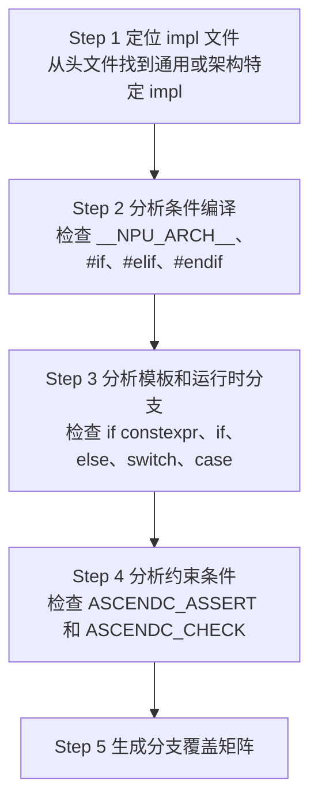

# 分支覆盖分析指南

## 概述

本指南详细说明如何分析 API impl 文件中的所有分支，确保 UT 100% 覆盖。

---

## 分支类型详解

### 1. 条件编译分支

**识别方法**：`#if`, `#ifdef`, `#ifndef`, `#elif`

```cpp
// 示例：架构条件编译
#if __NPU_ARCH__ == 2201
    // 分支 1: ascend910B1 架构
    #include "dav_c220/kernel_operator_fixpipe_impl.h"
#elif __NPU_ARCH__ == 3510
    // 分支 2: ascend950pr_9599 架构
    #include "dav_3510/kernel_operator_fixpipe_impl.h"
#endif
```

**覆盖策略**：每个架构单独生成测试，测试目录对应架构。

### 2. 模板特化分支

**识别方法**：`template<>`, `if constexpr`

```cpp
// 示例：模板参数分支
template <typename T, typename U, const FixpipeConfig& config>
void Fixpipe(...) {
    if constexpr (config.isToUB) {
        // 分支 1: 输出到 UB
        FixpipeL0C2UBImpl(...);
    } else {
        // 分支 2: 输出到 L1
        FixpipeL0C2L1Impl(...);
    }
}
```

**覆盖策略**：每个模板特化版本独立测试。

### 3. 运行时分支

**识别方法**：`if/else`, `switch/case`

```cpp
// 示例：运行时条件分支
if ((GetPhyType((TPosition)dst.GetPosition()) == Hardware::L1)) {
    // 分支 1: 目标在 L1
} else if ((GetPhyType((TPosition)dst.GetPosition()) == Hardware::UB)) {
    // 分支 2: 目标在 UB
}
```

**覆盖策略**：设计测试用例触发每个分支条件。

### 4. 参数组合分支

**识别方法**：枚举值、布尔开关

```cpp
// 示例：QuantMode 参数分支
if (intriParams.quantPre == QuantMode_t::VDEQF16 ||
    intriParams.quantPre == QuantMode_t::VQF322B8_PRE ||
    intriParams.quantPre == QuantMode_t::VREQ8) {
    // 分支：需要 workspace
    Fixpipe(..., cbufWorkspace, ...);
} else {
    // 分支：不需要 workspace
    Fixpipe(...);
}
```

**覆盖策略**：使用参数化测试覆盖所有组合。

### 5. 函数重载分支

**识别方法**：同名函数不同参数

```cpp
// 重载 1: 无 workspace
template <typename T, typename U, const FixpipeConfig& config>
void Fixpipe(const GlobalTensor<T>& dst, const LocalTensor<U>& src,
    const FixpipeParamsV220& intriParams);

// 重载 2: 有 workspace
template <typename T, typename U, const FixpipeConfig& config>
void Fixpipe(const GlobalTensor<T>& dst, const LocalTensor<U>& src,
    const LocalTensor<uint64_t>& cbufWorkspace, const FixpipeParamsV220& intriParams);
```

**覆盖策略**：每个重载版本独立测试。

---

## 分析流程



### Step 1: 定位 impl 文件

```bash
# 从头文件找到 impl 文件
# 头文件: include/basic_api/kernel_operator_xxx_intf.h
# impl 文件: impl/basic_api/kernel_operator_xxx_intf_impl.h
# 或架构特定: impl/basic_api/dav_xxx/kernel_operator_xxx_impl.h
```

### Step 2: 分析条件编译

```bash
grep -n "__NPU_ARCH__\|#if\|#elif\|#endif" impl/basic_api/kernel_operator_xxx_intf_impl.h
```

### Step 3: 分析模板和运行时分支

```bash
grep -n "if constexpr\|if (\|else\|switch\|case" impl/basic_api/kernel_operator_xxx_intf_impl.h
```

### Step 4: 分析约束条件

```bash
grep -n "ASCENDC_ASSERT\|ASCENDC_CHECK" impl/basic_api/kernel_operator_xxx_intf_impl.h
```

### Step 5: 生成分支覆盖矩阵

根据分析结果，生成测试用例覆盖矩阵。

---

## 覆盖矩阵模板

| 分支类型 | 分支条件 | 测试方法 | 测试用例 |
|---------|---------|---------|---------|
| 条件编译 | `__NPU_ARCH__ == 2201` | 目标架构测试 | `test_operator_xxx_2201.cpp` |
| 模板特化 | `config.isToUB == true` | 模板参数配置 | `Fixpipe<..., CFG_UB>` |
| 运行时分支 | `dst.GetPosition() == L1` | 数据路径设计 | 输出到 L1 的测试 |
| 参数组合 | `QuantMode::VDEQF16` | 参数化测试 | `INSTANTIATE_TEST_CASE_P` |

---

## 检查清单

- [ ] 所有条件编译分支已识别
- [ ] 所有模板特化分支已识别
- [ ] 所有运行时分支已识别
- [ ] 所有参数组合分支已识别
- [ ] 所有函数重载已识别
- [ ] 覆盖矩阵已生成
- [ ] 测试用例已覆盖所有分支
