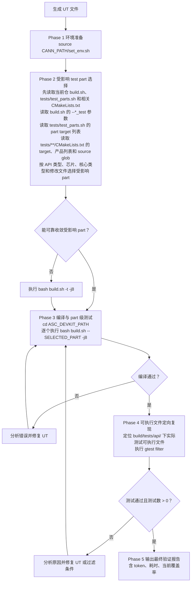
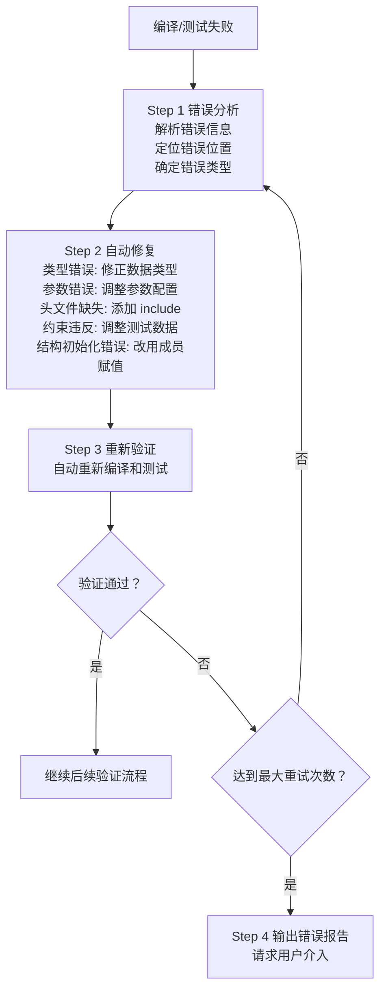

# 自动化验证流程

## 1. UT 生成后的必执行流程

**生成 UT 文件后，必须自动执行以下验证流程：**



---

## 2. test part 选择策略

各 API 场景 guide 不再重复维护编译命令。生成 UT 后统一回到本节，根据 API 类型、目标芯片、核心类型和本地 `tests/test_parts.sh` 选择实际命令。

本节表格只作为导航索引，不能作为唯一事实来源。每次选择 build.sh part 或 CMake target 前，必须先查看当前仓内对应脚本和 CMake 文件；若当前文件与本 reference 不一致，以当前文件为准，并在执行日志中记录已检查的脚本/CMake 路径和差异。

### 2.1 强制规则

- 每次验证前必须先检查当前仓内 `build.sh` 与 `tests/test_parts.sh`，不能只依赖当前 reference、旧记忆或固定 part。
- 每次验证前必须先查看 `tests/CMakeLists.txt`、`tests/api/CMakeLists.txt` 和相关子目录 `CMakeLists.txt`，确定测试可执行 target，再反查它位于哪个 `*_test_targets` 数组。
- 执行日志必须记录已查看的 `build.sh`、`tests/test_parts.sh` 和相关 `CMakeLists.txt` 路径；若发现当前脚本/CMake 与本 reference 表格不一致，报告差异并按当前脚本/CMake 执行。
- CMake 检查必须覆盖 `add_subdirectory`、`add_executable`、`add_custom_target`、`run_llt_test`、`run_python_llt_test`、产品列表和 `file(GLOB ...)` source glob；只看目录名不够。
- `build.sh --<part>` 会把 `tests/test_parts.sh` 中的 target 传给 `cmake --build . --target ...`，并通过 `-DTEST_MOD=...` 传入 CMake；`run_llt_test` 会按 `TEST_MOD` 跳过未选中的 C++ target，Python target 则依赖 build.sh 显式列入 `--target`。
- 一个 API 内容修改可能影响多个 target；必须运行所有命中的 build.sh part。
- `bash build.sh --changed_file=<file>` 只触发 CI 跳过判断；它不会自动选择 API UT 分组，不能作为唯一验证命令。
- `bash build.sh --basic_test_one` 只覆盖 `basic_test_one_targets`，不能作为所有 Basic API 的默认验证命令。
- Basic API 的 `impl/basic_api/**/*.h` 若会被 `include/basic_api/*.h` 公开入口 include，必须按 header-only public surface 处理；涉及 assert/log 宏、`SupportType`、条件编译、模板签名或跨架构公共路径时，功能 UT part 之外必须叠加 `--basic_test_three`。
- Tensor API 除外：`tests/api/tensor_api/` 和 `ascendc_ut_tensor_api_*` 不纳入当前 `asc-api-ut-gen` 的 UT 生成或覆盖闭环；如果改动只属于 Tensor API，报告该 skill 不覆盖，不要把它映射为本 skill 的目标。
- 如果无法从 API 类型、目标芯片、核心类型或文件路径可靠收敛 part，执行 `bash build.sh -t -j8`，并在报告中说明原因。
- 如果目标芯片或 target 在 CMake 中存在但没有纳入 `tests/test_parts.sh`，或在 `tests/test_parts.sh` 中被注释，必须记录 `CMake target 未纳入 build.sh 分片` 缺口；不能声称该目标已由 build.sh part 验证。

### 2.2 CMake 到 build.sh part 闭环

本闭环来自当前 `tests/**/CMakeLists.txt` 与 `tests/test_parts.sh`。Tensor API 按本 skill 边界排除，不在下表展开。

| CMake 入口 | CMake target | build.sh part | 备注 |
|-----------|--------------|---------------|------|
| `tests/api/adv_api/CMakeLists.txt` | `ascendc_ut_adv_api_kernel_*`, `ascendc_ut_adv_api_tiling_*` | `--adv_test`, `--adv_test_two` | 3510 kernel 和 3510 AIV tiling 在 `--adv_test_two`；3510 AIC tiling 在 `--adv_test`。公共 adv 变更通常两者都跑。 |
| `tests/api/basic_api/CMakeLists.txt` | `ascendc_ut_basic_api_*` | `--basic_test_one`, `--basic_test_two`, `--basic_test_four` | 按产品 target 反查分片；target 当前未启用或被注释时要记录缺口。 |
| `tests/api/basic_api/ascendc_header_checker/CMakeLists.txt` | `ascendc_run_all_header_checks` | `--basic_test_three` | 覆盖 CPU/NPU、多头文件/单头文件编译检查；Basic API public/header-only impl 改动必须叠加。 |
| `tests/api/c_api/CMakeLists.txt` | `ascendc_ut_c_api_ascend910B1_AIC`, `ascendc_ut_c_api_ascend910B1_AIV`, `ascendc_ut_c_api_ascend950pr_9599_AIC`, `ascendc_ut_c_api_ascend950pr_9599_AIV` | `--basic_test_five` | C API 公共逻辑影响 2201 和 3510 时确认四个 target 都执行。 |
| `tests/api/reg_compute_api/CMakeLists.txt` | `ascendc_ut_reg_compute_ascend950pr_9599` | `--basic_test_five` | 目录存在不等于已验证，需确认 target 已纳入分片。 |
| `tests/api/simt_api/CMakeLists.txt` | `ascendc_ut_simt_api_ascend950pr_9599` | `--basic_test_five` | 目录存在不等于已验证，需确认 target 已纳入分片。 |
| `tests/api/utils/tiling/CMakeLists.txt` | `ascendc_ut_tiling_utils_*` | `--basic_test_one` | tiling utils 覆盖多产品、多 core type。 |
| `tests/api/utils/tiling/CMakeLists.txt` | `ascendc_ut_tpl_tiling_debug`, `ascendc_ut_tpl_tiling_release` | `--basic_test_three` | template tiling debug/release 独立 target。 |
| `tests/api/utils/std/CMakeLists.txt` | `ascendc_ut_std_api_ascend910B1`, `ascendc_ut_std_api_ascend950pr_9599` | `--basic_test_four` | std API 独立分片。 |
| `tests/api/aicpu_api/CMakeLists.txt` | `ascendc_ut_aicpu_api` | `--basic_test_three` | AICPU API 独立于默认生成类型，但触达时必须验证。 |
| `tests/tools/aclrtc/CMakeLists.txt`, `tests/tools/utils/CMakeLists.txt` | `ascendc_ut_aclrtc`, `ascendc_ut_asc_compile_base`, `ascendc_ut_asc_tikcpp_utest_opbuild`, `ascendc_ut_asc_runtime`, `ascendc_ut_elf_tool`, `ascendc_ut_pack_kernel` | `--basic_test_three` | API 编译、runtime、打包和工具链相关修改触达时纳入。 |
| `tests/python/CMakeLists.txt` | `ascendc_pyut_asc_compile_common`, `ascendc_pyut_asc_op_compiler`, `ascendc_pyut_aclrt_launch_kernel`, `ascendc_pyut_compile_trace_log`, `asc_opc_unittest` | `--basic_test_four` | Python 编译工具链、asc_opc、aclr launch 相关修改触达时纳入。 |

### 2.3 当前 build.sh part 映射

本表来自当前 `tests/test_parts.sh`。更新脚本分组后必须同步更新本节。

| API/修改范围 | 受影响 target | 必跑 build.sh part |
|-------------|---------------|--------------------|
| 高阶 API，非 `ascend950pr_9599` kernel/tiling | `ascendc_ut_adv_api_kernel_*`, `ascendc_ut_adv_api_tiling_*` | `--adv_test` |
| 高阶 API，`ascend950pr_9599` kernel 或 AIV tiling | `ascendc_ut_adv_api_kernel_ascend950pr_9599_AIC`, `ascendc_ut_adv_api_kernel_ascend950pr_9599_AIV`, `ascendc_ut_adv_api_tiling_ascend950pr_9599_AIV` | `--adv_test_two` |
| 高阶 API，`ascend950pr_9599` AIC tiling 或公共 adv 变更无法区分 AIC/AIV | `ascendc_ut_adv_api_tiling_ascend950pr_9599_AIC` 及 3510 adv 相关 target | `--adv_test` 和 `--adv_test_two` |
| membase Basic API：`ascend910`, `ascend310p`, `ascend610`, `ascend310B1`, `ascend910B1_AIC`, `ascend910B1_AIV`, `ascend910B1_AIV_MSTX`, `ascend950pr_9599_AIC` | `ascendc_ut_basic_api_*` 对应 target | `--basic_test_two` |
| membase Basic API：`ascend950pr_9599_AIV_BASIC` | `ascendc_ut_basic_api_ascend950pr_9599_AIV_BASIC` | `--basic_test_four` |
| membase Basic API：`ascend950pr_9599_AIV_FRAMEWORK` | `ascendc_ut_basic_api_ascend950pr_9599_AIV_FRAMEWORK` | `--basic_test_one` |
| Basic API 公开头文件，或会被公开头文件 include 的 `impl/basic_api/**/*.h` header-only 实现修改 | `ascendc_run_all_header_checks` | `--basic_test_three`，并叠加对应功能 UT part |
| Utils tiling/context/platform/stub 相关修改 | `ascendc_ut_tiling_utils_*` | `--basic_test_one` |
| Utils template tiling 修改 | `ascendc_ut_tpl_tiling_debug`, `ascendc_ut_tpl_tiling_release` | `--basic_test_three` |
| Utils std 修改 | `ascendc_ut_std_api_ascend910B1`, `ascendc_ut_std_api_ascend950pr_9599` | `--basic_test_four` |
| C API，`ascend910B1` / `ascend950pr_9599`，AIC/AIV | `ascendc_ut_c_api_ascend910B1_AIC`, `ascendc_ut_c_api_ascend910B1_AIV`, `ascendc_ut_c_api_ascend950pr_9599_AIC`, `ascendc_ut_c_api_ascend950pr_9599_AIV` | `--basic_test_five` |
| regbase API，`ascend950pr_9599` | `ascendc_ut_reg_compute_ascend950pr_9599` | `--basic_test_five` |
| SIMT API，`ascend950pr_9599` | `ascendc_ut_simt_api_ascend950pr_9599` | `--basic_test_five` |
| AICPU API | `ascendc_ut_aicpu_api` | `--basic_test_three` |
| 工具链/API 编译、runtime、pack、aclrtc 相关修改 | `ascendc_ut_aclrtc`, `ascendc_ut_asc_compile_base`, `ascendc_ut_asc_tikcpp_utest_opbuild`, `ascendc_ut_asc_runtime`, `ascendc_ut_elf_tool`, `ascendc_ut_pack_kernel` | `--basic_test_three` |
| Python 编译工具链、asc_opc、aclr launch 相关修改 | `ascendc_pyut_asc_compile_common`, `ascendc_pyut_asc_op_compiler`, `ascendc_pyut_aclrt_launch_kernel`, `ascendc_pyut_compile_trace_log`, `asc_opc_unittest` | `--basic_test_four` |

`basic_test_three` 还包含 `aclrtc`、编译器、runtime、pack、aicpu 等非当前 skill 默认 API 类型 target。仅当 API 修改触达这些模块、public header checker，或会被公开头文件 include 的 Basic API header-only impl 时纳入；否则不要用它替代功能 UT part。

### 2.4 公共或跨架构修改的加严策略

- 修改 `include/adv_api/`、`impl/adv_api/detail/` 或 `impl/adv_api/tiling/` 的公共逻辑时，运行 `--adv_test` 和 `--adv_test_two`。
- 修改 `include/basic_api/` 的公共头文件或 `impl/basic_api/` 中跨产品共享逻辑时，至少运行命中的 Basic API 功能 part；无法判定产品范围时运行 `--basic_test_one`、`--basic_test_two`、`--basic_test_four`。如果修改的是公开头文件，或 `impl/basic_api/**/*.h` 会经公开头文件 include，叠加 `--basic_test_three`。
- 修改 `impl/basic_api/**/*.h` 中的 assert/log 宏调用、`SupportType` dtype 检查、`#if __NPU_ARCH__` 条件编译、模板签名、公开 inline 函数或被 `kernel_*_intf_impl.h` 汇入的架构特定实现时，必须叠加 `--basic_test_three`；gtest target 通过不能替代 `ascendc_run_all_header_checks`。
- 修改 `include/c_api/` 或 `impl/c_api/` 公共逻辑时，运行 `--basic_test_five`；若影响 2201 和 3510，确认四个 C API target 均在输出中执行。
- 修改 `include/basic_api/reg_compute/` 或 `impl/basic_api/reg_compute/` 时，运行 `--basic_test_five`。
- 修改 `include/simt_api/` 或 `impl/simt_api/` 时，运行 `--basic_test_five`。
- 修改 `include/utils/` 或 `impl/utils/` 时，按子目录选择 `--basic_test_one`、`--basic_test_three`、`--basic_test_four`；无法判定子类时三者都跑。
- 修改 `tests/api/common/`、`tests/main.cpp`、`tests/cmake/func.cmake` 或会影响多类 API UT 的公共测试支撑时，按受影响 CMake 入口叠加所有相关 part；无法收敛时执行 `bash build.sh -t -j8`，并说明 Tensor API 属于当前 skill 排除范围。
- 修改 `tests/**/CMakeLists.txt`、`tests/test_parts.sh` 或 `build.sh` 的 target/part 选择逻辑时，必须重新执行 2.2 闭环检查；发现 CMake target 未纳入 build.sh 分片时要记录缺口并更新本 guide。

---

## 3. 编译验证详细步骤

### 3.1 编译命令

```bash
# Step 5: 编译验证（自动执行）

# 5.1 设置 CANN 环境
source {CANN_PATH}/set_env.sh

# 5.2 进入 asc-devkit 目录
cd {ASC_DEVKIT_PATH}

# 5.3 根据 2.x 的映射逐个执行所有受影响 part
bash build.sh --basic_test_two -j8
bash build.sh --basic_test_three -j8
bash build.sh --basic_test_five -j8

# 无法可靠收敛 part 时执行全部测试
bash build.sh -t -j8
```

### 3.2 编译结果检查

```bash
# 成功标志
# Build succeeded

# 失败处理
# 根据错误信息修复 UT 文件
```

### 3.3 编译错误处理

| 错误类型 | 示例 | 修复方法 |
|---------|------|---------|
| 头文件未找到 | `fatal error: kernel_operator.h: No such file` | 检查 include 路径 |
| 类型不支持 | `static_assert failed: SupportType` | 检查数据类型是否在支持列表 |
| 未定义引用 | `undefined reference to vadd` | 检查架构是否正确设置 |
| 模板参数错误 | `template argument deduction failed` | 检查函数调用参数类型 |
| **参数结构初始化失败** | `no matching constructor for initialization of 'FixpipeParamsV220'` | **使用成员赋值替代花括号初始化** |

---

## 4. 测试执行详细步骤

### 4.1 测试执行命令

```bash
# Step 6: 测试执行（自动执行）

# 6.1 build.sh part 已通过 run_llt_test 执行对应 target；确认日志中出现所有目标 target

# 6.2 如需定向复现，进入测试可执行文件目录
cd {ASC_DEVKIT_PATH}/build/tests/api/basic_api

# 6.3 执行测试（使用 gtest 过滤）
# 格式: ./可执行文件 --gtest_filter="*{API_NAME}*"
./ascendc_ut_basic_api_ascend910B1_AIV --gtest_filter="*Add*"

# 6.4 检查测试结果
# [  PASSED  ] X tests. → 成功
# [  FAILED  ] X tests. → 失败，需分析原因
# 若过滤后显示 0 tests，不能记为通过，必须修正过滤条件或确认测试命名

# 6.5 详细输出模式（调试用）
./ascendc_ut_basic_api_ascend910B1_AIV --gtest_filter="*Add*" --gtest_output=xml:test_result.xml
```

### 4.2 测试失败处理

| 失败类型 | 可能原因 | 修复方法 |
|---------|---------|---------|
| 断言失败 | 期望值与实际值不匹配 | 检查测试逻辑和数据初始化 |
| 段错误 | 内存访问越界 | 检查数据大小和对齐 |
| 超时 | 死循环或性能问题 | 检查循环条件 |
| 设备错误 | NPU 设备状态异常 | 检查 SetGCoreType 设置 |
| **核心转储（Core Dump）** | **Stub 函数参数数量不匹配** | **使用类封装，参考已有成功测试** |
| **测试配置崩溃** | **QuantMode 与类型组合错误** | **查表确认类型组合正确性** |

---

## 5. 自动修复机制

### 5.1 自动修复流程



### 5.2 自动修复示例

```
[错误] 编译失败: no matching constructor for initialization of 'FixpipeParamsV220'
[分析] 检测到参数结构体不支持花括号初始化
[修复] 自动改用成员赋值方式
[重试] 重新编译...
[结果] ✓ 编译成功
```

---

## 6. 验证报告模板

生成 UT 后的最终报告必须包含运行指标：

- **Token 消耗**：如果调用环境能提供 LLM usage，记录 prompt / completion / total；如果是本地脚本生成或客户端未暴露 usage，写明 `未提供` 或 `不适用`，不能填 0 冒充真实消耗。
- **耗时**：记录从开始分析/生成到最终报告输出的总耗时；如可拆分，额外记录生成、编译、测试和覆盖率复查耗时。
- **当前覆盖率**：优先记录 `build/cov_report` 中当前 Lines / Functions；若未生成、未刷新或未传入报告路径，必须写明原因，不得声称覆盖率已达标。

```
╔══════════════════════════════════════════════════════════════╗
║              API UT 验证报告                                  ║
╠══════════════════════════════════════════════════════════════╣
║ API 名称:       {API_NAME}                                    ║
║ 架构:           {ARCH} (NPU_ARCH={ARCH_CODE})                 ║
║ 测试文件:       {TEST_FILE_PATH}                              ║
║ 支持数据类型:   {DATA_TYPES}                                  ║
║ Token 消耗:     prompt={PROMPT_TOKENS}, completion={COMPLETION_TOKENS}, total={TOTAL_TOKENS} ║
║ 总耗时:         {TOTAL_ELAPSED}s                               ║
║ 当前覆盖率:     Lines={COVERAGE_LINES}, Functions={COVERAGE_FUNCTIONS} ║
║ 覆盖率来源:     {COVERAGE_SOURCE_OR_UNAVAILABLE_REASON}        ║
╠══════════════════════════════════════════════════════════════╣
║ 编译状态:       [成功/失败]                                    ║
║ 选择依据:       build.sh + tests/test_parts.sh, parts={PARTS} ║
║ 编译命令:       {BUILD_COMMANDS}                              ║
║ 编译耗时:       {COMPILE_TIME}s                               ║
╠══════════════════════════════════════════════════════════════╣
║ 测试状态:       [PASSED/FAILED]                               ║
║ 测试命令:       ./可执行文件 --gtest_filter="*{API}*"         ║
║ 测试用例数:     {TEST_COUNT}                                  ║
║ 通过用例数:     {PASSED_COUNT}                                ║
║ 失败用例数:     {FAILED_COUNT}                                ║
║ 测试耗时:       {TEST_TIME}s                                  ║
╠══════════════════════════════════════════════════════════════╣
║ 问题记录:                                                     ║
║ {ISSUES}                                                      ║
╚══════════════════════════════════════════════════════════════╝
```

---

## 7. 自动化执行检查清单

生成 UT 后，**必须按顺序执行**：

### 7.1 part 选择阶段

- [ ] **Step 4.1**: 读取当前 `build.sh` 支持的 test part 参数
- [ ] **Step 4.2**: 读取当前 `tests/test_parts.sh` 中各 part 的 target 列表
- [ ] **Step 4.3**: 根据 API 类型、目标芯片、核心类型和修改文件列出所有受影响 target
- [ ] **Step 4.4**: 将 target 反查到 build.sh part；无法收敛时选择 `bash build.sh -t -j8`
- [ ] **Step 4.5**: 对未纳入 `tests/test_parts.sh` 的目标记录未覆盖原因

### 7.2 编译阶段

- [ ] **Step 5.1**: 设置 CANN 环境
- [ ] **Step 5.2**: 执行所有选定 build.sh part，例如 `bash build.sh --basic_test_five -j8`
- [ ] **Step 5.3**: 检查编译结果
  - 成功 → 继续 Step 6
  - 失败 → 分析错误 → 修复 UT → 重新编译

### 7.3 测试阶段

- [ ] **Step 6.1**: 执行测试 `./可执行文件 --gtest_filter="*{API}*"`
- [ ] **Step 6.2**: 检查测试结果
  - 通过 → 输出成功报告
  - 失败 → 分析原因 → 修复 UT → 重新编译和测试
- [ ] **Step 6.3**: 重新读取当前覆盖率；若无法读取，记录原因
- [ ] **Step 6.4**: 输出最终验证报告，包含 token 消耗、总耗时和当前覆盖率
