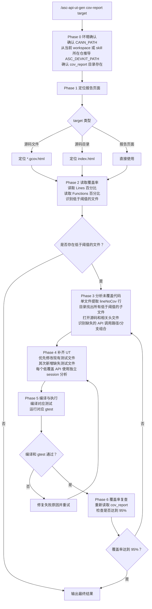

# 基于 cov_report 的 UT 补齐指南

## 1. 概述

本指南用于处理 **已有 UT 已执行、且覆盖率报告已经生成** 的场景。目标不是检查“有没有测试文件”，而是基于 `asc-devkit/build/cov_report` 中的实际覆盖率结果，对 **低覆盖率文件或目录** 自动补齐 UT，并完成编译、运行、复查。

**适用范围：**
- 目标仓为 `asc-devkit`
- 覆盖率报告目录默认位于 `{ASC_DEVKIT_PATH}/build/cov_report`
- 用户希望按 **单文件** 或 **目录** 维度补齐现有 UT
- 覆盖率阈值默认 `95%`

**默认判定规则：**
- `Lines < 95%` → 必须补齐
- `Functions < 95%` → 必须补齐
- 两者都达到 `95%` 以上，才可判定该目标通过

---

## 2. 命令格式

```bash
# 扫描单个源码文件
/asc-api-ut-gen cov-report {ASC_DEVKIT_PATH}/impl/basic_api/dav_3510/kernel_operator_fixpipe_impl.h

# 扫描单个源码目录
/asc-api-ut-gen cov-report {ASC_DEVKIT_PATH}/impl/basic_api/dav_3510

# 指定阈值
/asc-api-ut-gen cov-report {ASC_DEVKIT_PATH}/impl/basic_api/dav_3510 --threshold 95

# 直接扫描 cov_report 下的 html 页面
/asc-api-ut-gen cov-report {ASC_DEVKIT_PATH}/build/cov_report/{ASC_DEVKIT_PATH}/impl/basic_api/dav_3510/index.html

# 指定报告目录
/asc-api-ut-gen cov-report {ASC_DEVKIT_PATH}/impl/basic_api/dav_3510 --report-dir {ASC_DEVKIT_PATH}/build/cov_report
```

---

## 3. 报告定位规则

### 3.1 默认报告目录

```bash
{ASC_DEVKIT_PATH}/build/cov_report
```

典型实例：

```bash
{ASC_DEVKIT_PATH}/build/cov_report
```

### 3.2 源码路径到报告路径的映射

**目录扫描：**

```text
源码目录:
{ASC_DEVKIT_PATH}/impl/basic_api/dav_3510

对应报告:
{ASC_DEVKIT_PATH}/build/cov_report/{ASC_DEVKIT_PATH}/impl/basic_api/dav_3510/index.html
```

**单文件扫描：**

```text
源码文件:
{ASC_DEVKIT_PATH}/impl/basic_api/dav_3510/kernel_operator_fixpipe_impl.h

对应报告:
{ASC_DEVKIT_PATH}/build/cov_report/{ASC_DEVKIT_PATH}/impl/basic_api/dav_3510/kernel_operator_fixpipe_impl.h.gcov.html
```

### 3.3 架构桶页面

对于按架构聚合的实现，也可直接使用 `npu_arch_xxx` 目录：

```text
{ASC_DEVKIT_PATH}/build/cov_report/npu_arch_3510/index.html
{ASC_DEVKIT_PATH}/build/cov_report/npu_arch_3510/vector_compute_impl/index.html
{ASC_DEVKIT_PATH}/build/cov_report/npu_arch_3510/vector_compute_impl/asc_create_iter_reg_impl.h.gcov.html
```

### 3.4 找不到报告页面时的处理

按以下顺序兜底：

1. 检查 `build/cov_report` 是否存在
2. 检查目标文件/目录是否已经出现在 `cov_report/home/...` 镜像路径下
3. 若镜像路径不存在，则在 `cov_report/npu_arch_*` 下按文件名搜索
4. 若仍找不到，说明该目标未被当前覆盖率任务纳入；必须先说明原因，不能伪造覆盖率结论

---

## 4. 扫描流程



---

## 5. 单文件扫描规则

### 5.1 判定标准

打开 `*.gcov.html` 页面后，读取页头中的：
- `Lines`
- `Functions`

任一项低于 `95%`，都必须进入补齐流程。

### 5.2 未覆盖行识别

单文件页面中的未覆盖行通常标记为：

```html
<span class="lineNoCov">0 : ...</span>
```

这类行代表：
- 函数入口未命中
- 某个条件分支未命中
- 某个 return 路径、错误路径、边界路径未命中

### 5.3 单文件补齐要求

- 必须把 `lineNoCov` 对应的源码行映射回实际 API 行为
- 必须继续打开源码文件，确认该行属于哪个函数、哪个分支、哪个参数组合
- 必须优先补到现有 UT 中，不要为单个漏行盲目创建碎片化测试文件
- 仅当现有 UT 文件不存在时，才新增测试文件

---

## 6. 目录扫描规则

### 6.1 目录扫描不是只看汇总值

目录页 `index.html` 中会列出当前目录下的子文件和子目录覆盖率。**即使目录汇总值高于 95%，也必须继续检查每个子文件。**

原因：
- 目录汇总可能被大量高覆盖文件稀释
- 单个关键文件仍可能远低于阈值

### 6.2 目录扫描处理方式

1. 读取目录页所有子项
2. 识别低于阈值的子文件
3. 若子目录低于阈值，继续递归进入
4. 最终以“文件级达标”作为完成条件

### 6.3 实际示例

当前 `cov_report` 中可见：

- `npu_arch_3510/cache_ctrl_impl.h` 的 `Lines=93.6%`、`Functions=93.8%`
- `npu_arch_3510/vector_compute_impl/asc_create_iter_reg_impl.h` 的 `Lines=75.0%`

这两类目标都必须触发 UT 补齐。

---

## 7. 从覆盖率回溯到 UT 的分析规则

### 7.1 先确定“对外 API”，不要只盯内部 impl

覆盖率页面通常落在 `impl/` 或 `instr_impl/` 下，但补 UT 时，必须回溯到对应的：
- `include/basic_api`
- `include/c_api`
- `include/adv_api`
- `include/simt_api`
- `include/utils`

优先测试公开接口，不直接为纯内部 helper 写孤立 UT。

### 7.2 必须做的回溯动作

1. 打开低覆盖 impl 文件
2. 找到未覆盖行所在函数
3. 找到对应的对外头文件/接口声明
4. 找到现有测试文件
5. 确认缺的是哪类输入组合：
   - 数据类型
   - 核类型（AIC/AIV）
   - 掩码/枚举/布尔开关
   - 架构条件编译路径
   - 边界值、异常值、对齐值

### 7.3 补齐策略

- 优先增加参数化 case，避免复制整份测试
- 优先补最小必要场景，直接命中 `lineNoCov`
- 若同一 impl 对应多个公开 API，分 API 建立独立 session 分析
- 不允许为了冲覆盖率而绕过真实公开调用链

---

## 8. 编译、运行与复查

UT 补齐后，必须执行完整验证，不允许只改代码不验证。

### 8.1 编译与运行

编译、执行、报错修复流程统一遵循：

- [自动化验证流程](automation-guide.md)
- 各 API 类型专属指南

### 8.2 最低验证要求

1. 按 [自动化验证流程](automation-guide.md) 从 `tests/**/CMakeLists.txt`、`tests/test_parts.sh` 和 `build.sh` 完成 target 到 part 闭环，Tensor API 除外
2. 所有受影响 build.sh part 编译/运行成功；如果发现 `CMake target 未纳入 build.sh 分片`，必须记录缺口
3. 对应 gtest 过滤运行通过，且过滤结果不是 `0 tests`
4. 如果补齐目标是会被公开头文件 include 的 `impl/basic_api/**/*.h` header-only 实现，或修改涉及 assert/log 宏、`SupportType`、条件编译、模板签名，必须确认 `--basic_test_three` 中的 `ascendc_run_all_header_checks` 通过
5. 重新检查 `build/cov_report`
6. 目标文件或目录下所有目标文件的 `Lines` 和 `Functions` 均达到 `95%`

### 8.3 不达标时的处理

- 若测试通过但覆盖率仍不足：继续补场景
- 若编译失败：先修复编译问题，再重跑
- 若测试失败：先修复逻辑或桩函数问题，再重跑
- 若报告未刷新：明确记录覆盖率流水线未更新，不能直接声称达标

---

## 9. 强制约束

- ❌ 不允许只根据文件名猜测覆盖率结论
- ❌ 不允许只看目录汇总值就结束
- ❌ 不允许跳过编译和测试执行
- ❌ 不允许在覆盖率未复查的情况下宣称“已补齐”
- ❌ 不允许把内部实现 helper 当作最终测试目标而绕开公开 API

---

## 10. 输出结果要求

最终输出至少包含：

- 扫描目标
- 报告路径
- Token 消耗（prompt / completion / total；无法获取时写明原因）
- 总耗时以及生成、编译、测试、覆盖率复查各阶段耗时（能拆分时必须拆分）
- 补齐前覆盖率（Lines / Functions）
- 修改的测试文件
- 编译命令和结果
- 测试命令和结果
- 当前覆盖率 / 补齐后覆盖率（Lines / Functions）及报告刷新时间或未刷新原因
- 仍未达标的阻塞项（如果有）
