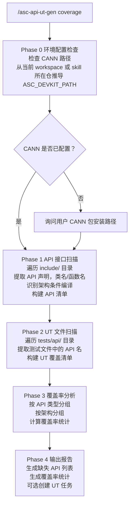
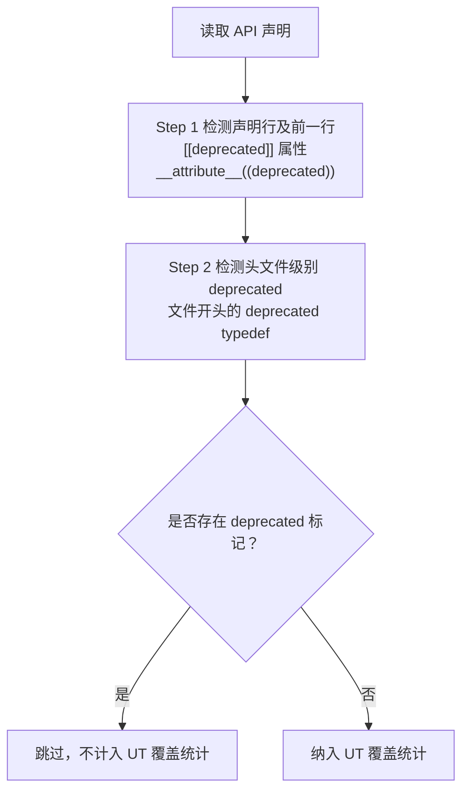
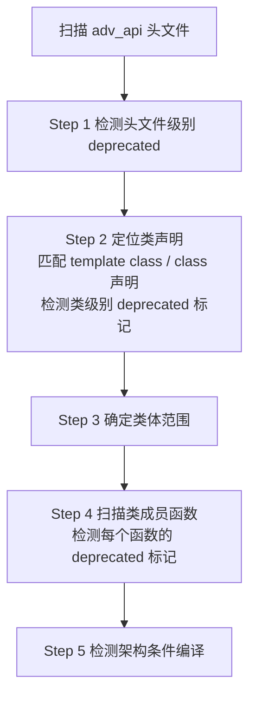
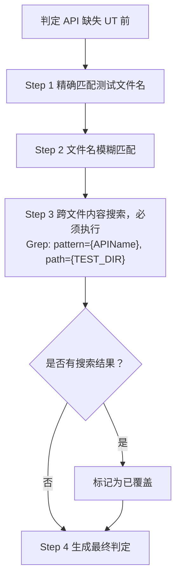
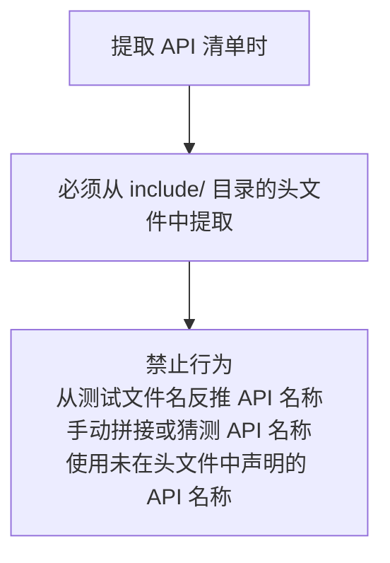

# API UT 覆盖率扫描指南

## 1. 概述

覆盖率扫描模式用于扫描 `include/` 目录下所有 API 接口定义，检查是否都有对应的 UT 测试看护，并生成覆盖率报告。

**核心能力：**
- 扫描高阶API、membase基础API、regbase基础API、C API、SIMT API、工具类API 六种类型的接口
- 识别每个 API 的架构条件编译隔离（`__NPU_ARCH__` 宏）
- 检测跨架构 UT 覆盖差异（如某架构有接口但无 UT）
- 过滤 deprecated 接口（不纳入 UT 补充范围）
- 生成按架构分组的缺失报告

---

## 2. 命令格式与参数说明

### 2.1 命令格式

```bash
# 完整扫描（扫描所有架构、所有 API 类型）
/asc-api-ut-gen coverage

# 指定架构扫描
/asc-api-ut-gen coverage --arch ascend910b1
/asc-api-ut-gen coverage --arch ascend950pr_9599

# 指定 API 类型扫描
/asc-api-ut-gen coverage --type membase
/asc-api-ut-gen coverage --type regbase
/asc-api-ut-gen coverage --type adv
/asc-api-ut-gen coverage --type c
/asc-api-ut-gen coverage --type simt
/asc-api-ut-gen coverage --type utils

# 组合参数
/asc-api-ut-gen coverage --arch ascend910b1 --type membase

# 输出格式控制
/asc-api-ut-gen coverage --output json       # JSON 格式输出
/asc-api-ut-gen coverage --output markdown   # Markdown 格式输出（默认）
/asc-api-ut-gen coverage --output summary    # 简要摘要

# 创建缺失 UT 任务
/asc-api-ut-gen coverage --create-tasks
```

### 2.2 参数说明

| 参数 | 缩写 | 说明 | 默认值 |
|-----|------|------|-------|
| `--arch` | `-a` | 指定芯片架构扫描 | 全部架构 |
| `--type` | `-t` | 指定 API 类型：membase/regbase/adv/c/simt/utils | 全部类型 |
| `--output` | `-o` | 输出格式：markdown/json/summary | markdown |
| `--create-tasks` | | 为缺失的 API 自动创建 UT 任务 | 否 |

---

## 3. 扫描流程



---

## 4. API 提取规则

### 4.1 API 类别提取

| API 类型 | 提取规则 | 头文件位置 |
|---------|---------|-----------|
| **高阶API** | 模板类声明 `template<...> class Name` | `include/adv_api/**/*.h` |
| **membase基础API** | 函数声明 `void FuncName(...)` | `include/basic_api/kernel_operator_*.h`（排除 `reg_compute/`） |
| **regbase基础API** | 函数声明 `void FuncName(...)` | `include/basic_api/reg_compute/**/*.h` |
| **C API** | 函数声明 `void asc_name(...)` | `include/c_api/**/*.h` |
| **SIMT API** | 设备函数 `__device__ ... func(...)` | `include/simt_api/**/*.h` |
| **工具类API** | 类/函数声明 | `include/utils/**/*.h` |

### 4.2 架构条件编译识别

**识别模式：**

```cpp
#if __NPU_ARCH__ == 2201
    // ascend910b1
#elif __NPU_ARCH__ == 3510
    // ascend950pr_9599
#endif

// 多架构判断
#if defined(__NPU_ARCH__) && (__NPU_ARCH__ == 2201 || __NPU_ARCH__ == 3510)
    // 多架构通用代码
#endif
```

> 完整架构映射表请参考主文档 SKILL.md 第 5.3 节

---

## 5. Deprecated 接口过滤

### 5.1 过滤原则

**重要：标记为 deprecated 的接口不需要进行 UT 补充。**

### 5.2 Deprecated 检测模式

#### 模式 1：`[[deprecated]]` 属性（C++14）

```cpp
[[deprecated("Use NewAPI instead")]]
__aicore__ inline void OldFunction(...) { }

// 头文件 deprecated（常见于接口迁移）
[[deprecated(__FILE__ " is deprecated, please use softmax.h instead!")]]
typedef void using_deprecated_header_h;
```

**检测正则：**
```python
pattern = r'\[\[deprecated(?:\s*\([^)]*\))?\]\]'
```

#### 模式 2：`__attribute__((deprecated))`（GCC/Clang）

```cpp
__attribute__((deprecated("Use NewFunc"))) void OldFunc(...);
```

### 5.3 过滤流程



---

## 6. 类及成员函数扫描

### 6.1 Advanced API 类扫描

**类声明识别：**

```python
pattern_class = r'template\s*<[^>]*>\s*class\s+(\w+)'
```

**示例匹配：**

```cpp
template <class A_TYPE, class B_TYPE, class C_TYPE, ...>
class MatmulImpl
{
    // 成员函数...
};
// 提取：MatmulImpl
```

**成员函数识别：**

```python
patterns = [
    r'__aicore__\s+inline\s+(?:void|auto|\w+(?:<[^>]*>)?)\s+(\w+)\s*\([^)]*\)',
    r'template\s*<[^>]*>\s*__aicore__\s+inline\s+\w+\s+(\w+)\s*\(',
]
```

### 6.2 类扫描流程



---

## 7. UT 匹配规则

### 7.1 四级匹配策略

1. **精确匹配**：UT 测试名与 API 名完全匹配
   - `TEST_F(TEST_Fixpipe, ...)` → `Fixpipe`

2. **文件匹配**：测试文件名包含 API 名
   - `test_operator_fixpipe.cpp` → `Fixpipe`

3. **内容匹配**：测试文件内容包含 API 调用
   - 文件内容包含 `Softmax(...)` → `Softmax`

4. **跨文件内容匹配（重要）**：API 可能存在于非对应命名的测试文件中
   - 使用 `Grep` 在整个测试目录搜索 API 名称

### 7.2 跨文件 API 检测流程

**背景**：部分 API 虽然没有独立的测试文件，但其实际调用存在于其他测试文件中。



**典型跨文件覆盖案例：**

| API 名称 | 预期测试文件 | 实际测试文件 |
|---------|-------------|-------------|
| Mull | test_operator_vec_mull.cpp | test_operator_vec_micro_binary.cpp |
| AbsSub | test_operator_vec_abssub.cpp | test_operator_vec_micro_binary.cpp |
| Fill | test_operator_fill.cpp | test_operator_loaddata.cpp |
| Arange | test_operator_reg_compute_arange.cpp | test_operator_reg_compute_creIndex.cpp |

---

## 8. API 名称校验规则

### 8.1 核心规则

**规则 1：API 名称必须来源于头文件声明**



**规则 2：跨文件内容检测必须在判定缺失前执行**

**规则 3：双重校验机制**

```bash
# 校验 API 存在性
Grep -n "{API_NAME}" include/c_api/  # 无结果 = API 不存在

# 校验 UT 覆盖性
Grep -n "{API_NAME}" tests/api/c_api/npu_arch_3510/  # 有结果 = 已覆盖
```

**规则 4：Impl 为空的 API 无需增加 UT**

**识别模式：**

```cpp
// 模式 1: ASCENDC_REPORT_NOT_SUPPORT
ASCENDC_REPORT_NOT_SUPPORT(false, "MrgSort4");

// 模式 2: ASCENDC_ASSERT 断言失败
ASCENDC_ASSERT((false), "VectorPadding is not supported");
```

### 8.2 报告输出格式

| 状态 | 含义 | 是否需要 UT |
|-----|------|------------|
| ✅ 缺失 UT | 有实现但无测试 | 需要 |
| ⚠️ 不支持，无需 UT | impl 为空或不包含有效实现 | 不需要 |
| ❌ 已覆盖 | 已有测试 | 不需要 |

---

## 9. 测试目录结构

```
tests/api/
├── basic_api/                                    # membase基础API 测试
│   ├── ascendc_case_ascend910b1/
│   │   ├── ascendc_case_ascend910b1_aic/         # AIC (Cube 核心)
│   │   └── ascendc_case_ascend910b1_aiv/         # AIV (Vector 核心)
│   └── ascendc_case_ascend950pr_9599/
│
├── adv_api/                                      # 高阶API 测试
│   ├── activation/
│   ├── math/
│   └── normalization/
│
├── c_api/                                        # C API 测试
│   ├── npu_arch_2201/    # ascend910b1
│   └── npu_arch_3510/    # ascend950pr_9599
│
├── reg_compute_api/                              # regbase基础API 测试
│   └── ascendc_case_ascend950pr_9599_reg_compute/
│
├── simt_api/                                     # SIMT API 测试
│   └── ascend950pr_9599/
│
└── utils_api/                                    # 工具类API 测试
```

**关键注意事项：**
- regbase基础API 测试位于 `tests/api/reg_compute_api/`（非 basic_api 目录）
- SIMT API 当前仅支持 ascend950pr_9599

---

## 10. 扫描执行步骤

### 10.1 API 接口扫描

```
# Step 1: 扫描高阶API
Glob: {ASC_DEVKIT_PATH}/include/adv_api/**/*.h
Grep: pattern="template.*class\s+\w+"

# Step 2: 扫描 membase基础API
Glob: {ASC_DEVKIT_PATH}/include/basic_api/kernel_operator_*.h
Grep: pattern="void\s+\w+\s*\("

# Step 3: 扫描 regbase基础API
Glob: {ASC_DEVKIT_PATH}/include/basic_api/reg_compute/**/*.h

# Step 4: 扫描 C API
Glob: {ASC_DEVKIT_PATH}/include/c_api/**/*.h
Grep: pattern="void\s+asc_\w+\s*\("

# Step 5: 扫描 SIMT API
Glob: {ASC_DEVKIT_PATH}/include/simt_api/**/*.h
Grep: pattern="__device__.*\w+\s*\("

# Step 6: 识别架构条件编译
Grep: pattern="#if.*__NPU_ARCH__|#ifdef.*__DAV_"
```

### 10.2 UT 文件扫描与跨文件检测

```
# 扫描现有 UT
Glob: {ASC_DEVKIT_PATH}/tests/api/**/*.cpp

# 对于初步判定为"缺失 UT"的 API，执行跨文件检测
Grep: pattern="{APIName}" path="tests/api/{arch_dir}/"
```

---

## 11. 报告输出格式

### 11.1 Markdown 格式（默认）

```markdown
## 总体覆盖率统计

| API 类型 | 总 API 数 | 已覆盖 | 未覆盖 | 覆盖率 |
|---------|----------|-------|-------|-------|
| 高阶API | 45 | 40 | 5 | 88.9% |
| membase基础API | 100 | 85 | 15 | 85.0% |
| **总计** | **270** | **220** | **50** | **81.5%** |

## 按架构分组 - 缺失 UT 列表

### ascend910b1 缺失
| API 名称 | 类型 | 头文件位置 |
|---------|------|-----------|
| NewAPI | membase | include/basic_api/kernel_operator_new.h |
```

---

## 12. 检查清单

### 12.1 扫描前检查

- [ ] 已获取 CANN 包路径；ASC_DEVKIT_PATH 已从当前 workspace 或 skill 所在仓推导

### 12.2 API 提取检查

- [ ] API 名称**仅从头文件声明中提取**
- [ ] 每个"缺失 UT"的 API 已确认在头文件中存在声明

### 12.3 Deprecated 过滤检查

- [ ] 已检测 `[[deprecated]]` 属性
- [ ] deprecated API 已排除在覆盖率统计外

### 12.4 Impl 实现检查

- [ ] 已检测 `ASCENDC_REPORT_NOT_SUPPORT` 标记
- [ ] impl 为空的 API 已标记为"不支持，无需 UT"

### 12.5 跨文件检测检查

- [ ] 判定缺失 UT 前已执行跨文件 Grep 搜索
- [ ] 每个"缺失 UT"的 API 已确认 impl 有实际实现
