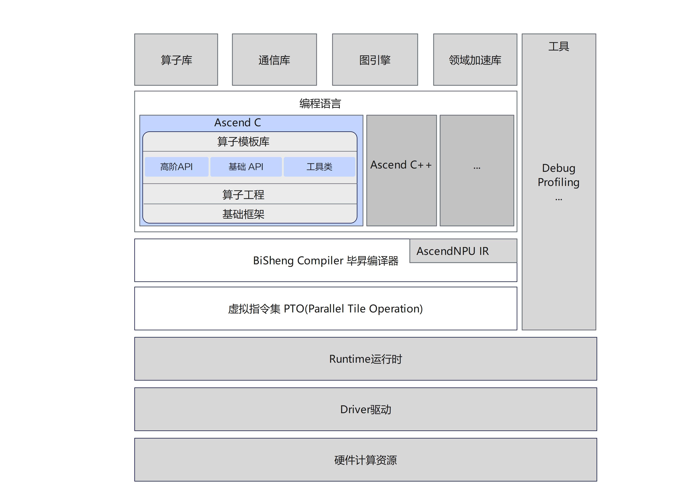

# Ascend C

## 🔥Latest News

- [2025/11] Ascend C项目基于Ascend 910C/Ascend 910B全面开源开放，包含以下新特性：
  - 实现分仓分包，支持分包独立安装部署，包括Ascend C算子开发所需的核心仓asc-devkit、调试工具仓[asc-tools](https://gitcode.com/cann/ascend-c-tools)、Vector算子模板库仓（[atvc](https://gitcode.com/cann/atvc)、[atvos](https://gitcode.com/cann/atvos)）、Python前端仓[pyasc](https://gitcode.com/cann/pyasc)。
  - 编程API能力扩展，基础API新增LocalMemAllocator内存分配接口。
  - 全面支持异构编译与<<<>>> 直调，通过文件后缀名“.asc”或编译选项“-x asc”使能异构编译。
  - 算子编译CMake接口标准化，提供Cmake module接口，支持不同编译场景。
  - 支持CPU&NPU孪生调试的能力一致性，一套代码同时支持CPU和NPU调试。
  - 编程指南全面优化。
  - 新增算子样例。

## 🚀概述

Ascend C是[CANN](https://hiascend.com/software/cann) （Compute Architecture for Neural Networks）推出的昇腾AI处理器专用的算子程序开发语言，原生支持C和C++标准规范。Ascend C主要由类库和语言扩展层构成，提供多层级API，满足多维场景算子开发诉求；总体逻辑架构图如下所示：



- 语言扩展层（未来支持）：纯C接口，开放芯片完备编程能力，支持数组分配内存，一般基于指针编程，提供与业界一致的C语言编程体验。
- 基础API/微指令API（未来支持）/SIMT API（未来支持）：单指令抽象的C++类库API，一般基于Tensor编程，支持Tile编程能力。
- 高阶API：基于单核对常见算法进行抽象和封装，提供公共算法的实现。
- 算子模板库：基于模板提供算子的完整实现参考，简化Tiling开发，支持用户自定义扩展。
- Python前端：PyAsc基于Python原生接口，提供芯片底层完备编程能力，并将逐步支持Tensor Tile编程、SIMT编程等能力，实现基于Python接口开发高性能Ascend C算子。

本仓主要包含Ascend C编程API（基础API、高阶API）和必要的编译脚本，是算子开发所需的核心模块。


## 🔍目录结构说明

本代码仓目录结构如下：

```
├── cmake                               # Ascend C 构建源代码
├── docs                                # 项目文档介绍
├── examples                            # Ascend C API样例工程
├── impl                                # Ascend C API接口实现源代码
│   ├── adv_api                         # Ascend C 高阶API实现源代码
│   ├── basic_api                       # Ascend C 基础API实现源代码
│   └── utils                           # Ascend C 工具类实现源代码
├── include                             # Ascend C API接口声明源代码
│   ├── adv_api                         # Ascend C 高阶API声明源代码
│   ├── basic_api                       # Ascend C 基础API声明源代码
│   └── utils                           # Ascend C 工具类声明源代码
├── scripts                             # 打包相关脚本
├── tests                               # Ascend C API的UT用例
└── tools                               # Ascend C 工具源代码
```

## ⚡️快速入门

若您希望快速体验项目的构建和算子样例的执行，请访问如下文档获取简易教程。

- [编译构建](docs/quick_start.md)：介绍搭建环境、编译执行、本地验证等操作。
- [样例执行](examples/README.md)：提供算子开发样例，介绍端到端执行样例的方式。


## 📖相关文档

若您希望深入体验项目功能，扩展原有API或开发全新API、开发自定义算子，请访问如下文档获取详细教程。
- API开发
  | 文档  |  说明   |
  |---------|--------|
  |[API列表](./docs/api/README.md)|Ascend C API列表。|
  |[API贡献指南](./docs/asc_api_contributing.md)|介绍如何扩展或开发Ascend C API。|
  
- 算子开发
  | 文档  |  说明   |
  |---------|--------|
  |[Ascend C编程指南](https://hiascend.com/document/redirect/CannCommunityOpdevAscendC)|基于昇腾AI硬件，使用Ascend C编写算子程序，开发自定义算子。|
  |[Ascend C最佳实践](https://hiascend.com/document/redirect/CannCommunityAscendCBestPractice) | 基于已完成开发的Ascend C算子，介绍如何进一步优化算子性能。 |

## 📌后续规划
- 新增语言扩展层C API，提供与业界相似的编程体验。
- 基础API新增Tensor Tile API，Tensor扩展Layout支持Tile编程。
- 新增语言扩展层SIMT C API，提供与业界类似的SIMT编程体验。
- 新增微指令C API，支持SIMD/SIMT异构编程，充分发挥SIMD/SIMT各自的优势。


## 📝相关信息

- [贡献指南](CONTRIBUTING.md)
- [安全声明](SECURITY.md)
- [许可证](LICENSE)
