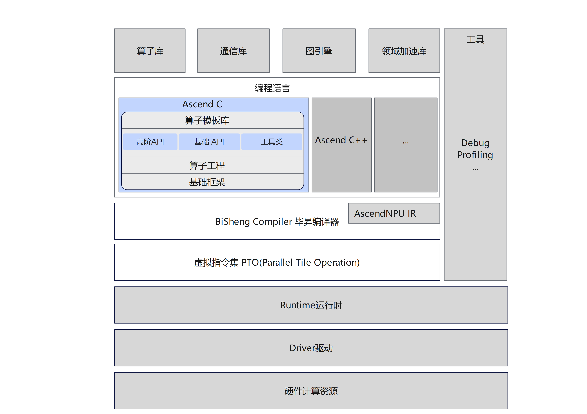

# Ascend C

## 🔥Latest News
- [2026/01] 优化样例、融合编译性能等；
  - 迁移高阶API样例[ascendc-api-adv](https://gitee.com/ascend/ascendc-api-adv)到本仓，并使用[<<<>>>调用方式](./examples/03_libraries)；
  - 联合毕昇编译器，优化融合编译性能；
- [2025/12] Ascend C项目新增对Kirin X90和Kirin 9030处理器的支持。鸿蒙开发者基于Ascend C的实践案例可参考：[cann-recipes-harmony-infer](https://gitcode.com/cann/cann-recipes-harmony-infer)。
- [2025/11] Ascend C项目基于Atlas A3 训练系列产品/Atlas A3 推理系列产品、Atlas A2 训练系列产品/Atlas A2 推理系列产品全面开源开放，包含以下新特性：
  - 实现分仓分包，支持分包独立安装部署，包括Ascend C算子开发所需的核心仓asc-devkit、调试工具仓[asc-tools](https://gitcode.com/cann/asc-tools)、Vector算子模板库仓[atvc](https://gitcode.com/cann/atvc)和[atvoss](https://gitcode.com/cann/atvoss)、Python前端仓[pyasc](https://gitcode.com/cann/pyasc)。
  - 编程API能力扩展
    - 新增语言扩展层C API，提供与业界相似的编程体验。
    - 基础API新增LocalMemAllocator内存分配接口。
  - 全面支持异构编译与<<<>>> 直调，通过文件后缀名“.asc”或编译选项“-x asc”使能异构编译。
  - 算子编译CMake接口标准化，提供Cmake module接口，支持不同编译场景。
  - 支持CPU&NPU孪生调试的能力一致性，一套代码同时支持CPU和NPU调试。
  - 编程指南全面优化。
  - 新增算子样例。

## 🚀概述

[Ascend C](https://www.hiascend.com/cann/ascend-c)是CANN（Compute Architecture for Neural Networks）推出的昇腾AI处理器专用的算子程序开发语言，原生支持C和C++标准规范。作为一门面向多场景的编程语言，Ascend C不仅致力于**开放芯片完备编程能力支撑实现极致性能**，同时通过多层级编程API设计，让您能够根据项目需求、团队技能与性能目标，灵活选择最合适的API，在开发效率与运行性能之间取得最佳平衡。

### 设计目标

Ascend C的设计目标可概括为 **“高性能、完备性、易编程、可调试和兼容性”**。其通过对C/C++语言标准进行最小化扩展，既支持基于指针的C语言开发习惯，也支持基于Tensor的C++编程范式，在支撑昇腾算子高效开发的同时，实现与现有生态的无缝衔接，保障开发体验的一致性。

我们秉持以下核心理念：
- **没有银弹**：不同场景对性能、开发效率的要求各异，单一接口无法最优适配所有场景；
- **渐进式学习**：新手可从易用性接口入手快速验证算法；专家则可向下钻取、精细调优，借助复杂接口特性充分挖掘硬件潜能。

### API层级
Ascend C提供三类接口，均可实现底层的完备编程能力：

| API层级 | 语言  | 特点 | 目标用户 | 主要用途 |
|----------|----------|----------|----------|----------|
| **Tpipe/Tque框架编程API** |  **C++** |基于**Tensor**编程<br>通过Tpipe/Tque框架统一管理内存与同步| 算子库开发者| 基于框架自动管理同步与内存，<br>提升编程易用性|
| **基础API** | **C++** |基于**Tensor**编程，提供**C++基础完备编程能力**<br>通过MakeTensor/LocalMemoryAllocator分配Tensor，自主管理同步| 算子库开发者|自主管理同步与内存<br>匹配C++Tensor开发习惯，支撑实现极致性能|
| **语言扩展层<br>SIMD&SIMT API** |**C**|基于**指针**编程，提供**C基础完备编程能力**<br>通过数组[]分配内存，自主管理同步|算子库开发者 |自主管理同步与内存<br>匹配C语言开发习惯，支撑实现极致性能|


此外，Ascend C提供高阶API和算子模板库以便提升算子开发效率。

| API层级 |  目标用户 | 主要用途 |
|----------|----------|----------|
| **算子模板库 (CATLASS/ATVOSS等)** |  算法开发人员 | 基于典型算子实现进行自定义扩展，满足特定场景高性能需求 | 
| **高阶API** |算法开发人员 | 复用通用单核算法，快速完成算法验证 |


其总体逻辑架构图如下所示：



- **语言扩展层C API**：纯C接口，支持数组分配内存、基于指针的计算接口，提供与业界一致的C语言编程体验，并开放芯片完备编程能力。Atlas A2/A3支持SIMD的纯C接口；Ascend 950PR/Ascend 950DT将支持与业界类似的SIMT编程能力、SIMD/SIMT混合编程能力；
- **基础API**：单指令抽象的C++类库API，一般基于Tensor编程；逐步基于Layout完善Tensor编程能力；
- **高阶API**：基于单核对常见算法进行抽象和封装，提供公共算法的实现；
- **算子模板库**：基于模板提供算子的完整实现参考，简化Tiling开发，支持用户自定义扩展；
- **Python前端PyAsc**：PyAsc基于Python前端，提供芯片底层完备编程能力，并将逐步基于Layout完善Tensor编程能力，新增SIMT编程等能力，实现基于Python接口开发高性能算子；

### 如何选择多层级API进行算子开发
- **基于C/C++语言开发**：详细请参考[Ascend C多级API选择指南](./docs/asc_how_to_choose_api.md)
- **基于Python语言开发，支撑完备编程能力，实现极致性能**：推荐选用Ascend C Python前端[PyAsc](https://gitcode.com/cann/pyasc)
- **基于Python语言开发，快速开发验证，易用性优先**：推荐选用 [PyPTO](https://gitcode.com/cann/pypto)


## 🔍目录结构说明
本仓主要包含Ascend C编程API和必要的cmake编译脚本，是算子开发所需的核心模块，其目录结构如下：

```
├── cmake                               # Ascend C 构建源代码
├── docs                                # 项目文档介绍
├── examples                            # Ascend C API样例工程
├── impl                                # Ascend C API接口实现源代码
│   ├── adv_api                         # Ascend C 高阶API实现源代码
│   ├── aicpu_api                       # Ascend C AI CPU API实现源代码
│   ├── basic_api                       # Ascend C 基础API实现源代码
│   ├── c_api                           # Ascend C 语言扩展层C API实现源代码
│   ├── experimental                    # Ascend C TENSOR API实现源代码
│   ├── simt_api                        # Ascend C SIMT API实现源代码
│   └── utils                           # Ascend C 工具类实现源代码
├── include                             # Ascend C API接口声明源代码
│   ├── adv_api                         # Ascend C 高阶API声明源代码
│   ├── aicpu_api                       # Ascend C AI CPU API声明源代码
│   ├── basic_api                       # Ascend C 基础API声明源代码
│   ├── c_api                           # Ascend C 语言扩展层C API声明源代码
│   ├── experimental                    # Ascend C TENSOR API声明源代码
│   ├── simt_api                        # Ascend C SIMT API声明源代码
│   └── utils                           # Ascend C 工具类声明源代码
├── scripts                             # 打包相关脚本
├── tests                               # Ascend C API的UT用例
└── tools                               # Ascend C 工具源代码
```

## ⚡️快速入门

若您希望快速体验项目的构建和算子样例的执行，请访问如下文档获取简易教程。

- [编译构建](docs/quick_start.md)：介绍搭建环境、编译执行、本地验证等操作。
- [样例执行](examples/README.md)：提供算子开发样例，介绍端到端执行样例的方式。

## 🧰clangd/IDE 支持

- 安装 clangd（推荐 15+，以Ubuntu操作系统为例）以及VSCode插件clangd

  ```bash
  sudo apt install -y clangd-15
  ```

- 配置本地VSCode的`settings.json`（示例）

  ```json
  {
    "clangd.path": "/usr/bin/clangd",
    "clangd.arguments": [
        "--background-index=0",
        "--clang-tidy=0"
    ],
    "C_Cpp.intelliSenseEngine": "disabled"
  }
  ```

- 在项目根目录下配置 `.clangd`（示例）完整 `.clangd`文件在本目录下给出，其中涉及 CANN 头文件目录需自行替换实际安装位置，`.clangd`中默认为`/usr/local/Ascend`.

  ```yaml
  CompileFlags:
    Add:
      - "-std=c++17"
      - "-stdlib=libstdc++"
      - "-D__NPU_ARCH__=2201"
      - "-DASCENDC_CPU_DEBUG=1"
      ...

  ---
  If:
    PathMatch: ".*\\.(asc|aicpu)$"
  CompileFlags:
    CompilationDatabase: None
    Add:
      - "-x"
      - "c++"
  Diagnostics:
    Suppress:
      - "attributes_not_allowed"
      - "decomp_decl_template"
      - "ignored_attributes"
      - "unknown_type_name"
      - "undeclared_var_use"
      - "invalid_token_after_toplevel_declarator"
      - "missing_type_specifier"
      - "typename_nested_not_found"
      - "redefinition"
  ```

- 重启clangd（VSCode: Command Palette -> "Clangd: Restart language server"）

- 💡 关于 ASC 语言语法高亮、代码跳转的支持，如有任何建议或改进意见，欢迎社区开发者积极反馈！

## 📖相关文档

若您希望深入体验项目功能，扩展原有API或开发全新API、开发自定义算子，请访问如下文档获取详细教程。
- API开发
  | 文档  |  说明   |
  |---------|--------|
  |[API列表](./docs/api/README.md)|Ascend C API列表。|
  |[API贡献指南](./CONTRIBUTING.md)|介绍如何扩展或开发Ascend C API。|

- 算子开发
  | 文档  |  说明   |
  |---------|--------|
  |[Ascend C编程指南](https://hiascend.com/document/redirect/CannCommunityOpdevAscendC)|基于昇腾AI硬件，使用Ascend C编写算子程序，开发自定义算子。|
  |[Ascend C最佳实践](https://hiascend.com/document/redirect/CannCommunityAscendCBestPractice) | 基于已完成开发的Ascend C算子，介绍如何进一步优化算子性能。 |
  |[Ascend C编程指南（鸿蒙）](https://gitcode.com/cann/cann-recipes-harmony-infer/blob/master/docs/ascendc_develop_guide.md)|基于麒麟AI硬件，使用Ascend C编写算子程序，开发自定义算子。|

## 📌后续规划

- 基于Altas A2/A3发布语言扩展层纯C接口，提供基于数组分配内存能力，支持基于指针的计算接口，实现与业界类似的纯C编程体验；
- Ascend 950PR/Ascend 950DT将支持SIMT编程、SIMD与SIMT混合编程，并通过Layout进一步强化Tensor编程能力；
- 持续丰富语言扩展层C API(含SIMD、SIMT)和基础API的关键特性介绍，并基于融合编译与 <<<>>>调用完善样例；

## 📝相关信息

- [贡献指南](CONTRIBUTING.md)
- [安全声明](SECURITY.md)
- [许可证](LICENSE)