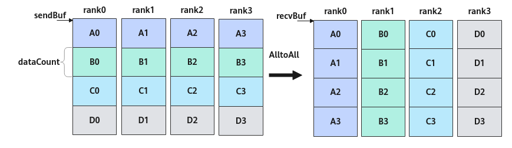

# AlltoAll<a name="ZH-CN_TOPIC_0000002051907845"></a>

## 产品支持情况<a name="section1586581915393"></a>

<a name="table169596713360"></a>
<table><thead align="left"><tr id="row129590715369"><th class="cellrowborder" valign="top" width="57.99999999999999%" id="mcps1.1.3.1.1"><p id="p17959971362"><a name="p17959971362"></a><a name="p17959971362"></a><span id="ph895914718367"><a name="ph895914718367"></a><a name="ph895914718367"></a>产品</span></p>
</th>
<th class="cellrowborder" align="center" valign="top" width="42%" id="mcps1.1.3.1.2"><p id="p89594763612"><a name="p89594763612"></a><a name="p89594763612"></a>是否支持</p>
</th>
</tr>
</thead>
<tbody><tr id="row18959157103612"><td class="cellrowborder" valign="top" width="57.99999999999999%" headers="mcps1.1.3.1.1 "><p id="p13959117193618"><a name="p13959117193618"></a><a name="p13959117193618"></a><span id="ph9959117173614"><a name="ph9959117173614"></a><a name="ph9959117173614"></a><term id="zh-cn_topic_0000001312391781_term1253731311225"><a name="zh-cn_topic_0000001312391781_term1253731311225"></a><a name="zh-cn_topic_0000001312391781_term1253731311225"></a>Atlas A3 训练系列产品</term>/<term id="zh-cn_topic_0000001312391781_term12835255145414"><a name="zh-cn_topic_0000001312391781_term12835255145414"></a><a name="zh-cn_topic_0000001312391781_term12835255145414"></a>Atlas A3 推理系列产品</term></span></p>
</td>
<td class="cellrowborder" align="center" valign="top" width="42%" headers="mcps1.1.3.1.2 "><p id="p1095914793613"><a name="p1095914793613"></a><a name="p1095914793613"></a>√</p>
</td>
</tr>
<tr id="row89591478362"><td class="cellrowborder" valign="top" width="57.99999999999999%" headers="mcps1.1.3.1.1 "><p id="p7959157163619"><a name="p7959157163619"></a><a name="p7959157163619"></a><span id="ph1995997193619"><a name="ph1995997193619"></a><a name="ph1995997193619"></a><term id="zh-cn_topic_0000001312391781_term11962195213215"><a name="zh-cn_topic_0000001312391781_term11962195213215"></a><a name="zh-cn_topic_0000001312391781_term11962195213215"></a>Atlas A2 训练系列产品</term>/<term id="zh-cn_topic_0000001312391781_term1551319498507"><a name="zh-cn_topic_0000001312391781_term1551319498507"></a><a name="zh-cn_topic_0000001312391781_term1551319498507"></a>Atlas A2 推理系列产品</term></span></p>
</td>
<td class="cellrowborder" align="center" valign="top" width="42%" headers="mcps1.1.3.1.2 "><p id="p149598793615"><a name="p149598793615"></a><a name="p149598793615"></a>√</p>
</td>
</tr>
</tbody>
</table>

## 功能说明<a name="section618mcpsimp"></a>

集合通信AlltoAll的任务下发接口，返回该任务的标识handleId给用户。AlltoAll的功能为：每张卡向通信域内所有卡发送相同数据量的数据，并从所有卡接收相同数据量的数据。结合原型中的参数，描述接口功能，具体为，第j张卡接收到来自第i张卡的sendBuf中第j块数据，并将该数据存放到本卡recvBuf中第i块的位置。


## 函数原型<a name="section620mcpsimp"></a>

```
template <bool commit = false>
__aicore__ inline HcclHandle AlltoAll(GM_ADDR sendBuf, GM_ADDR recvBuf, uint64_t dataCount, HcclDataType dataType, uint64_t strideCount = 0, uint8_t repeat = 1);
```

## 参数说明<a name="section622mcpsimp"></a>

**表 1**  模板参数说明

<a name="table149053404318"></a>
<table><thead align="left"><tr id="zh-cn_topic_0000001952285369_zh-cn_topic_0235751031_row27598891"><th class="cellrowborder" valign="top" width="17.77%" id="mcps1.2.4.1.1"><p id="zh-cn_topic_0000001952285369_zh-cn_topic_0235751031_p20917673"><a name="zh-cn_topic_0000001952285369_zh-cn_topic_0235751031_p20917673"></a><a name="zh-cn_topic_0000001952285369_zh-cn_topic_0235751031_p20917673"></a>参数名</p>
</th>
<th class="cellrowborder" valign="top" width="11.799999999999999%" id="mcps1.2.4.1.2"><p id="zh-cn_topic_0000001952285369_zh-cn_topic_0235751031_p16609919"><a name="zh-cn_topic_0000001952285369_zh-cn_topic_0235751031_p16609919"></a><a name="zh-cn_topic_0000001952285369_zh-cn_topic_0235751031_p16609919"></a>输入/输出</p>
</th>
<th class="cellrowborder" valign="top" width="70.43%" id="mcps1.2.4.1.3"><p id="zh-cn_topic_0000001952285369_zh-cn_topic_0235751031_p59995477"><a name="zh-cn_topic_0000001952285369_zh-cn_topic_0235751031_p59995477"></a><a name="zh-cn_topic_0000001952285369_zh-cn_topic_0235751031_p59995477"></a>描述</p>
</th>
</tr>
</thead>
<tbody><tr id="zh-cn_topic_0000001952285369_row42461942101815"><td class="cellrowborder" valign="top" width="17.77%" headers="mcps1.2.4.1.1 "><p id="zh-cn_topic_0000001952285369_p163481714145518"><a name="zh-cn_topic_0000001952285369_p163481714145518"></a><a name="zh-cn_topic_0000001952285369_p163481714145518"></a>commit</p>
</td>
<td class="cellrowborder" valign="top" width="11.799999999999999%" headers="mcps1.2.4.1.2 "><p id="zh-cn_topic_0000001952285369_p33487148556"><a name="zh-cn_topic_0000001952285369_p33487148556"></a><a name="zh-cn_topic_0000001952285369_p33487148556"></a>输入</p>
</td>
<td class="cellrowborder" valign="top" width="70.43%" headers="mcps1.2.4.1.3 "><p id="zh-cn_topic_0000001952285369_p186182538493"><a name="zh-cn_topic_0000001952285369_p186182538493"></a><a name="zh-cn_topic_0000001952285369_p186182538493"></a>bool类型。参数取值如下：</p>
<a name="zh-cn_topic_0000001952285369_ul77246714401"></a><a name="zh-cn_topic_0000001952285369_ul77246714401"></a><ul id="zh-cn_topic_0000001952285369_ul77246714401"><li>true：在调用Prepare接口时，Commit同步通知服务端可以执行该通信任务。</li><li>false：在调用Prepare接口时，不通知服务端执行该通信任务。</li></ul>
</td>
</tr>
</tbody>
</table>

**表 2**  接口参数说明

<a name="table180119381514"></a>
<table><thead align="left"><tr id="row148011835158"><th class="cellrowborder" valign="top" width="17.77%" id="mcps1.2.4.1.1"><p id="p1280114381517"><a name="p1280114381517"></a><a name="p1280114381517"></a>参数名</p>
</th>
<th class="cellrowborder" valign="top" width="11.799999999999999%" id="mcps1.2.4.1.2"><p id="p380111321517"><a name="p380111321517"></a><a name="p380111321517"></a>输入/输出</p>
</th>
<th class="cellrowborder" valign="top" width="70.43%" id="mcps1.2.4.1.3"><p id="p28014351520"><a name="p28014351520"></a><a name="p28014351520"></a>描述</p>
</th>
</tr>
</thead>
<tbody><tr id="row17761811191614"><td class="cellrowborder" valign="top" width="17.77%" headers="mcps1.2.4.1.1 "><p id="p167771011181619"><a name="p167771011181619"></a><a name="p167771011181619"></a>sendBuf</p>
</td>
<td class="cellrowborder" valign="top" width="11.799999999999999%" headers="mcps1.2.4.1.2 "><p id="p377721181614"><a name="p377721181614"></a><a name="p377721181614"></a>输入</p>
</td>
<td class="cellrowborder" valign="top" width="70.43%" headers="mcps1.2.4.1.3 "><p id="p1477711161611"><a name="p1477711161611"></a><a name="p1477711161611"></a>源数据buffer地址。</p>
</td>
</tr>
<tr id="row131931448115213"><td class="cellrowborder" valign="top" width="17.77%" headers="mcps1.2.4.1.1 "><p id="p108351551175216"><a name="p108351551175216"></a><a name="p108351551175216"></a>recvBuf</p>
</td>
<td class="cellrowborder" valign="top" width="11.799999999999999%" headers="mcps1.2.4.1.2 "><p id="p168351351175216"><a name="p168351351175216"></a><a name="p168351351175216"></a>输出</p>
</td>
<td class="cellrowborder" valign="top" width="70.43%" headers="mcps1.2.4.1.3 "><p id="p118351751115215"><a name="p118351751115215"></a><a name="p118351751115215"></a>目的数据buffer地址，集合通信结果输出到此buffer中。</p>
</td>
</tr>
<tr id="row17902814191610"><td class="cellrowborder" valign="top" width="17.77%" headers="mcps1.2.4.1.1 "><p id="p2090218149169"><a name="p2090218149169"></a><a name="p2090218149169"></a>dataCount</p>
</td>
<td class="cellrowborder" valign="top" width="11.799999999999999%" headers="mcps1.2.4.1.2 "><p id="p0902714111616"><a name="p0902714111616"></a><a name="p0902714111616"></a>输入</p>
</td>
<td class="cellrowborder" valign="top" width="70.43%" headers="mcps1.2.4.1.3 "><p id="p4950134519413"><a name="p4950134519413"></a><a name="p4950134519413"></a>本卡向通信域内其它每张卡收发的数据量，单位为sizeof(dataType)。</p>
<p id="p10483133811344"><a name="p10483133811344"></a><a name="p10483133811344"></a>例如，通信域内共4张卡，每张卡的sendBuf中均有4个fp16的数据，那么dataCount=1。</p>
</td>
</tr>
<tr id="row48213177160"><td class="cellrowborder" valign="top" width="17.77%" headers="mcps1.2.4.1.1 "><p id="p158219172167"><a name="p158219172167"></a><a name="p158219172167"></a>dataType</p>
</td>
<td class="cellrowborder" valign="top" width="11.799999999999999%" headers="mcps1.2.4.1.2 "><p id="p118152714175"><a name="p118152714175"></a><a name="p118152714175"></a>输入</p>
</td>
<td class="cellrowborder" valign="top" width="70.43%" headers="mcps1.2.4.1.3 "><p id="p98211178163"><a name="p98211178163"></a><a name="p98211178163"></a>AlltoAll操作的数据类型，目前支持HcclDataType包含的全部数据类型，HcclDataType详细可参考<a href="HCCL使用说明.md#table116710585514">表1</a>。</p>
</td>
</tr>
<tr id="row131614543510"><td class="cellrowborder" valign="top" width="17.77%" headers="mcps1.2.4.1.1 "><p id="p1431610541359"><a name="p1431610541359"></a><a name="p1431610541359"></a>strideCount</p>
</td>
<td class="cellrowborder" valign="top" width="11.799999999999999%" headers="mcps1.2.4.1.2 "><p id="p1431695411517"><a name="p1431695411517"></a><a name="p1431695411517"></a>输入</p>
</td>
<td class="cellrowborder" valign="top" width="70.43%" headers="mcps1.2.4.1.3 "><p id="p1069416101131"><a name="p1069416101131"></a><a name="p1069416101131"></a>多轮切分场景下，一次AlltoAll任务中，每张卡内参与通信的数据块间的间隔。默认值为0，表示数据块内存连续。</p>
<a name="ul114787324310"></a><a name="ul114787324310"></a><ul id="ul114787324310"><li>strideCount=0，每张卡内参与通信的数据块内存连续。卡rank_j收到来自卡rank_i的sendBuf中第j块数据，且数据块间的偏移数据量为j*dataCount，并将该数据存放于本卡recvBuf中第i块的位置，且偏移数据量为i*dataCount。</li><li>strideCount&gt;0，每张卡内参与通信的相邻数据块的起始地址偏移数据量为strideCount。卡rank_j收到来自卡rank_i的sendBuf中第j块数据，且数据块间的偏移数据量为j*strideCount，并将该数据存放于本卡recvBuf中第i块的位置，且偏移数据量为i*strideCount。</li></ul>
<p id="p793674412241"><a name="p793674412241"></a><a name="p793674412241"></a>注意：上述的偏移数据量为数据个数，单位为sizeof(dataType)。</p>
</td>
</tr>
<tr id="row165671519176"><td class="cellrowborder" valign="top" width="17.77%" headers="mcps1.2.4.1.1 "><p id="p17656215111710"><a name="p17656215111710"></a><a name="p17656215111710"></a>repeat</p>
</td>
<td class="cellrowborder" valign="top" width="11.799999999999999%" headers="mcps1.2.4.1.2 "><p id="p38942811174"><a name="p38942811174"></a><a name="p38942811174"></a>输入</p>
</td>
<td class="cellrowborder" valign="top" width="70.43%" headers="mcps1.2.4.1.3 "><p id="p32565356014"><a name="p32565356014"></a><a name="p32565356014"></a>一次下发的AlltoAll通信任务个数。repeat取值≥1，默认值为1。当repeat&gt;1时，每轮AlltoAll任务的sendBuf和recvBuf地址由服务端更新，每一轮任务i的更新公式如下：</p>
<p id="p91522315916"><a name="p91522315916"></a><a name="p91522315916"></a>sendBuf[i] = sendBuf + dataCount * sizeof(datatype) * i, i∈[0, repeat)</p>
<p id="p19310955081"><a name="p19310955081"></a><a name="p19310955081"></a>recvBuf[i] = recvBuf + dataCount * sizeof(datatype) * i, i∈[0, repeat)</p>
<p id="p777292611013"><a name="p777292611013"></a><a name="p777292611013"></a>注意：当设置repeat&gt;1时，须与strideCount参数配合使用，规划通信数据地址。</p>
</td>
</tr>
</tbody>
</table>

## 返回值说明<a name="section640mcpsimp"></a>

返回该任务的标识handleId，handleId大于等于0。调用失败时，返回 -1。

## 约束说明<a name="section633mcpsimp"></a>

-   调用本接口前确保已调用过[InitV2](InitV2.md)和[SetCcTilingV2](SetCcTilingV2.md)接口。
-   若HCCL对象的[config模板参数](HCCL模板参数.md#table884518212555)未指定下发通信任务的核，该接口只能在AI Cube核或者AI Vector核两者之一上调用。若HCCL对象的[config模板参数](HCCL模板参数.md#table884518212555)中指定了下发通信任务的核，则该接口可以在AI Cube核和AI Vector核上同时调用，接口内部会根据指定的核的类型，只在AI Cube核、AI Vector核二者之一下发该通信任务。
-   对于Atlas A2 训练系列产品/Atlas A2 推理系列产品，一个通信域内，所有Prepare接口的总调用次数不能超过63。
-   对于Atlas A3 训练系列产品/Atlas A3 推理系列产品，一个通信域内，所有Prepare接口和InterHcclGroupSync接口的总调用次数不能超过63。
-   对于Atlas A3 训练系列产品/Atlas A3 推理系列产品，一个通信域内，最大支持128卡通信。

## 调用示例<a name="section1665082013318"></a>

-   非多轮切分场景

    4张卡执行AlltoAll通信任务。非多轮切分场景下，每张卡上的数据块和数据量一致，如下图中每张卡的A\\B\\C\\D数据块，数据量均为dataCount。

    **图 1**  非多轮切分场景下4卡AlltoAll通信<a name="fig247714503515"></a>  
    

    ```
    extern "C" __global__ __aicore__ void alltoall_custom(GM_ADDR xGM, GM_ADDR yGM, GM_ADDR workspaceGM, GM_ADDR tilingGM) {
        constexpr uint64_t dataCount = 128U; // 数据量
        auto sendBuf = xGM;  // xGM为AlltoAll的输入GM地址
        auto recvBuf = yGM;  // yGM为AlltoAll的输出GM地址
        REGISTER_TILING_DEFAULT(AllToAllCustomTilingData); //AllToAllCustomTilingData为对应算子头文件定义的结构体
        GET_TILING_DATA_WITH_STRUCT(AllToAllCustomTilingData, tilingData, tilingGM);
    
        Hccl hccl;
        GM_ADDR contextGM = AscendC::GetHcclContext<0>();  // AscendC自定义算子kernel中，通过此方式获取HCCL context
    
        if (AscendC::g_coreType == AIV) {  // 指定AIV核通信   
            hccl.InitV2(contextGM, &tilingData);
            auto ret = hccl.SetCcTilingV2(offsetof(AllToAllCustomTilingData, alltoallCcTiling));
    	if (ret != HCCL_SUCCESS) {
    	    return;
    	}
    	HcclHandle handleId = hccl.AlltoAll<true>(sendBuf, recvBuf, dataCount, HcclDataType::HCCL_DATA_TYPE_FP16);   
    	hccl.Wait(handleId);   
    	AscendC::SyncAll<true>();  // AIV核全同步，防止0核执行过快，提前调用hccl.Finalize()接口，导致其他核Wait卡死   
    	hccl.Finalize();
        }
    }
    ```

-   多轮切分场景

    使能多轮切分，等效处理上述非多轮切分示例的通信。在每张卡的数据均分成4块（A\\B\\C\\D）的基础上，将每一块继续切分若干块。本例中继续切分3块，如下图所示，被继续切分成的3块数据包括，2个数据量为tileLen的数据块，1个数据量为tailLen的尾块。切分后，需要分3轮进行AlltoAll通信任务，将等效上述非多轮切分的通信结果。

    **图 2**  3轮切分场景下4卡AlltoAll通信<a name="fig118912192116"></a>  
    

    具体实现为，第1轮通信，每个rank上0-0\\1-0\\2-0\\3-0数据块进行AlltoAll处理；同一个卡上，参与通信的相邻数据块的间隔为参数strideCount的取值。第2轮通信，每个rank上0-1\\1-1\\2-1\\3-1数据块进行AlltoAll处理。第3轮通信，每个rank上0-2\\1-2\\2-2\\3-2数据块进行AlltoAll处理。第1轮通信的图示及代码示例如下。

    **图 3**  第一轮4卡AlltoAll示意图<a name="fig1477775323516"></a>  
    

    ```
    extern "C" __global__ __aicore__ void alltoall_custom(GM_ADDR xGM, GM_ADDR yGM, GM_ADDR workspaceGM, GM_ADDR tilingGM) {
        constexpr uint32_t tileNum = 2U;   // 首块数量
        constexpr uint64_t tileLen = 128U; // 首块数据个数
        constexpr uint32_t tailNum = 1U;   // 尾块数量
        constexpr uint64_t tailLen = 100U; // 尾块数据个数
        auto sendBuf = xGM;  // xGM为AlltoAll的输入GM地址
        auto recvBuf = yGM;  // yGM为AlltoAll的输出GM地址
        REGISTER_TILING_DEFAULT(AllToAllCustomTilingData); //AllToAllCustomTilingData为对应算子头文件定义的结构体
        GET_TILING_DATA_WITH_STRUCT(AllToAllCustomTilingData, tilingData, tilingGM);
    
        Hccl hccl;
        GM_ADDR contextGM = AscendC::GetHcclContext<0>();  // AscendC自定义算子kernel中，通过此方式获取HCCL context
    
        if (AscendC::g_coreType == AIV) {  // 指定AIV核通信   
            hccl.InitV2(contextGM, &tilingData);
            auto ret = hccl.SetCcTilingV2(offsetof(AllToAllCustomTilingData, alltoallCcTiling));
            if (ret != HCCL_SUCCESS) {
              return;
            }
            uint64_t strideCount = tileLen * tileNum + tailLen * tailNum;
            // 2个首块处理
            HcclHandle handleId1 = hccl.AlltoAll<true>(sendBuf, recvBuf, tileLen, HcclDataType::HCCL_DATA_TYPE_FP16, strideCount, tileNum);
            // 1个尾块处理
            constexpr uint32_t kSizeOfFloat16 = 2U;
            sendBuf += tileLen * tileNum * kSizeOfFloat16;
            recvBuf += tileLen * tileNum * kSizeOfFloat16;
            HcclHandle handleId2 = hccl.AlltoAll<true>(sendBuf, recvBuf, tailLen, HcclDataType::HCCL_DATA_TYPE_FP16, strideCount, tailNum);
            
            for (uint8_t i=0; i<tileNum; i++) {
                hccl.Wait(handleId1);
            }
            hccl.Wait(handleId2);  
            AscendC::SyncAll<true>();  // 全AIV核同步，防止0核执行过快，提前调用hccl.Finalize()接口，导致其他核Wait卡死   
            hccl.Finalize();
        }
    }
    ```

