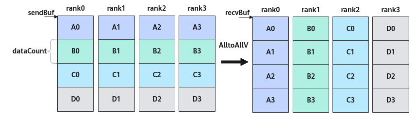

# AlltoAllV<a name="ZH-CN_TOPIC_0000002016995714"></a>

## AI处理器支持情况<a name="section1586581915393"></a>

<a name="table169596713360"></a>
<table><thead align="left"><tr id="row129590715369"><th class="cellrowborder" valign="top" width="57.99999999999999%" id="mcps1.1.3.1.1"><p id="p17959971362"><a name="p17959971362"></a><a name="p17959971362"></a><span id="ph895914718367"><a name="ph895914718367"></a><a name="ph895914718367"></a>AI处理器类型</span></p>
</th>
<th class="cellrowborder" align="center" valign="top" width="42%" id="mcps1.1.3.1.2"><p id="p89594763612"><a name="p89594763612"></a><a name="p89594763612"></a>是否支持</p>
</th>
</tr>
</thead>
<tbody><tr id="row18959157103612"><td class="cellrowborder" valign="top" width="57.99999999999999%" headers="mcps1.1.3.1.1 "><p id="p13959117193618"><a name="p13959117193618"></a><a name="p13959117193618"></a><span id="ph9959117173614"><a name="ph9959117173614"></a><a name="ph9959117173614"></a><term id="zh-cn_topic_0000001312391781_term1253731311225"><a name="zh-cn_topic_0000001312391781_term1253731311225"></a><a name="zh-cn_topic_0000001312391781_term1253731311225"></a>Ascend 910C</term></span></p>
</td>
<td class="cellrowborder" align="center" valign="top" width="42%" headers="mcps1.1.3.1.2 "><p id="p1095914793613"><a name="p1095914793613"></a><a name="p1095914793613"></a>√</p>
</td>
</tr>
<tr id="row89591478362"><td class="cellrowborder" valign="top" width="57.99999999999999%" headers="mcps1.1.3.1.1 "><p id="p7959157163619"><a name="p7959157163619"></a><a name="p7959157163619"></a><span id="ph1995997193619"><a name="ph1995997193619"></a><a name="ph1995997193619"></a><term id="zh-cn_topic_0000001312391781_term11962195213215"><a name="zh-cn_topic_0000001312391781_term11962195213215"></a><a name="zh-cn_topic_0000001312391781_term11962195213215"></a>Ascend 910B</term></span></p>
</td>
<td class="cellrowborder" align="center" valign="top" width="42%" headers="mcps1.1.3.1.2 "><p id="p149598793615"><a name="p149598793615"></a><a name="p149598793615"></a>x</p>
</td>
</tr>
</tbody>
</table>

## 功能说明<a name="section618mcpsimp"></a>

集合通信AlltoAllV的任务下发接口，返回该任务的标识handleId给用户。AlltoAll是AlltoAllV的一个子集，AlltoAll要求所有卡的收发数据量相同，AlltoAllV则不需要数据量相同，使用上更加灵活。

AlltoAllV的功能为：通信域内的卡互相发送和接收数据，并且定制每张卡给其它卡发送的数据量和从其它卡接收的数据量，以及定制发送和接收的数据在内存中的偏移。结合原型中的参数，描述接口功能，具体为：第i张卡发送sendBuf内存中第j块数据到第j张卡，该块数据在sendBuf中偏移为sdispls\[j\]的位置，且数据量为sendCounts\[j\]，第j张卡将该数据存放到本卡recvBuf中偏移为rdispls\[i\]的位置，接收数据量为recvCounts\[i\]，这里的sendCounts\[j\]与recvCounts\[i\]需要相等。注意：这里的偏移和数据量均为数据的个数，单位为sizeof\(sendType\)。


## 函数原型<a name="section620mcpsimp"></a>

```
template <bool commit = false>
__aicore__ inline HcclHandle AlltoAllV(GM_ADDR sendBuf, void *sendCounts, void *sdispls, HcclDataType sendType, GM_ADDR recvBuf, void *recvCounts, void *rdispls, HcclDataType recvType, uint8_t repeat = 1);
```

## 参数说明<a name="section622mcpsimp"></a>

**表 1**  模板参数说明

<a name="table149053404318"></a>
<table><thead align="left"><tr id="zh-cn_topic_0000001952285369_zh-cn_topic_0235751031_row27598891"><th class="cellrowborder" valign="top" width="17.77%" id="mcps1.2.4.1.1"><p id="zh-cn_topic_0000001952285369_zh-cn_topic_0235751031_p20917673"><a name="zh-cn_topic_0000001952285369_zh-cn_topic_0235751031_p20917673"></a><a name="zh-cn_topic_0000001952285369_zh-cn_topic_0235751031_p20917673"></a>参数名</p>
</th>
<th class="cellrowborder" valign="top" width="11.799999999999999%" id="mcps1.2.4.1.2"><p id="zh-cn_topic_0000001952285369_zh-cn_topic_0235751031_p16609919"><a name="zh-cn_topic_0000001952285369_zh-cn_topic_0235751031_p16609919"></a><a name="zh-cn_topic_0000001952285369_zh-cn_topic_0235751031_p16609919"></a>输入/输出</p>
</th>
<th class="cellrowborder" valign="top" width="70.43%" id="mcps1.2.4.1.3"><p id="zh-cn_topic_0000001952285369_zh-cn_topic_0235751031_p59995477"><a name="zh-cn_topic_0000001952285369_zh-cn_topic_0235751031_p59995477"></a><a name="zh-cn_topic_0000001952285369_zh-cn_topic_0235751031_p59995477"></a>描述</p>
</th>
</tr>
</thead>
<tbody><tr id="zh-cn_topic_0000001952285369_row42461942101815"><td class="cellrowborder" valign="top" width="17.77%" headers="mcps1.2.4.1.1 "><p id="zh-cn_topic_0000001952285369_p163481714145518"><a name="zh-cn_topic_0000001952285369_p163481714145518"></a><a name="zh-cn_topic_0000001952285369_p163481714145518"></a>commit</p>
</td>
<td class="cellrowborder" valign="top" width="11.799999999999999%" headers="mcps1.2.4.1.2 "><p id="zh-cn_topic_0000001952285369_p33487148556"><a name="zh-cn_topic_0000001952285369_p33487148556"></a><a name="zh-cn_topic_0000001952285369_p33487148556"></a>输入</p>
</td>
<td class="cellrowborder" valign="top" width="70.43%" headers="mcps1.2.4.1.3 "><p id="zh-cn_topic_0000001952285369_p186182538493"><a name="zh-cn_topic_0000001952285369_p186182538493"></a><a name="zh-cn_topic_0000001952285369_p186182538493"></a>bool类型。参数取值如下：</p>
<a name="zh-cn_topic_0000001952285369_ul77246714401"></a><a name="zh-cn_topic_0000001952285369_ul77246714401"></a><ul id="zh-cn_topic_0000001952285369_ul77246714401"><li>true：在调用Prepare接口时，Commit同步通知服务端可以执行该通信任务。</li><li>false：在调用Prepare接口时，不通知服务端执行该通信任务。</li></ul>
</td>
</tr>
</tbody>
</table>

**表 2**  接口参数说明

<a name="table180119381514"></a>
<table><thead align="left"><tr id="row148011835158"><th class="cellrowborder" valign="top" width="17.77%" id="mcps1.2.4.1.1"><p id="p1280114381517"><a name="p1280114381517"></a><a name="p1280114381517"></a>参数名</p>
</th>
<th class="cellrowborder" valign="top" width="11.799999999999999%" id="mcps1.2.4.1.2"><p id="p380111321517"><a name="p380111321517"></a><a name="p380111321517"></a>输入/输出</p>
</th>
<th class="cellrowborder" valign="top" width="70.43%" id="mcps1.2.4.1.3"><p id="p28014351520"><a name="p28014351520"></a><a name="p28014351520"></a>描述</p>
</th>
</tr>
</thead>
<tbody><tr id="row17761811191614"><td class="cellrowborder" valign="top" width="17.77%" headers="mcps1.2.4.1.1 "><p id="p167771011181619"><a name="p167771011181619"></a><a name="p167771011181619"></a>sendBuf</p>
</td>
<td class="cellrowborder" valign="top" width="11.799999999999999%" headers="mcps1.2.4.1.2 "><p id="p377721181614"><a name="p377721181614"></a><a name="p377721181614"></a>输入</p>
</td>
<td class="cellrowborder" valign="top" width="70.43%" headers="mcps1.2.4.1.3 "><p id="p1477711161611"><a name="p1477711161611"></a><a name="p1477711161611"></a>源数据buffer地址。</p>
</td>
</tr>
<tr id="row98411158123817"><td class="cellrowborder" valign="top" width="17.77%" headers="mcps1.2.4.1.1 "><p id="p78421658173815"><a name="p78421658173815"></a><a name="p78421658173815"></a>sendCounts</p>
</td>
<td class="cellrowborder" valign="top" width="11.799999999999999%" headers="mcps1.2.4.1.2 "><p id="p19487144113910"><a name="p19487144113910"></a><a name="p19487144113910"></a>输入</p>
</td>
<td class="cellrowborder" valign="top" width="70.43%" headers="mcps1.2.4.1.3 "><p id="p1779721603916"><a name="p1779721603916"></a><a name="p1779721603916"></a>本卡向通信域内其它每张卡发送的数据量，sendCounts[i]表示本卡发送到第i张卡rank_i的数据量，单位是sizeof(sendType)。</p>
<p id="p19528649134813"><a name="p19528649134813"></a><a name="p19528649134813"></a>sendCounts是一个uint64_t类型的数组，数组长度必须为通信域内总rank数。</p>
<p id="p1279711161390"><a name="p1279711161390"></a><a name="p1279711161390"></a>例如：sendBuf内数据的数据类型为fp16，sendCounts[0]=1，sendCounts[1]=2，表示本rank给rank0发送1个fp16数据，给rank1发送2个fp16数据。</p>
</td>
</tr>
<tr id="row26131054154215"><td class="cellrowborder" valign="top" width="17.77%" headers="mcps1.2.4.1.1 "><p id="p1861365414217"><a name="p1861365414217"></a><a name="p1861365414217"></a>sdispls</p>
</td>
<td class="cellrowborder" valign="top" width="11.799999999999999%" headers="mcps1.2.4.1.2 "><p id="p661365410429"><a name="p661365410429"></a><a name="p661365410429"></a>输入</p>
</td>
<td class="cellrowborder" valign="top" width="70.43%" headers="mcps1.2.4.1.3 "><p id="p66131554134216"><a name="p66131554134216"></a><a name="p66131554134216"></a>本卡向其它卡发送的数据在sendBuf中的偏移，sdispls[i]=n表示本卡发送给rank_i的数据块在sendBuf中的偏移数据量为n。</p>
<p id="p959561504910"><a name="p959561504910"></a><a name="p959561504910"></a>sdispls是一个uint64_t类型的数组，数组长度必须为通信域内总rank数。</p>
</td>
</tr>
<tr id="row1237435617415"><td class="cellrowborder" valign="top" width="17.77%" headers="mcps1.2.4.1.1 "><p id="p9375185624119"><a name="p9375185624119"></a><a name="p9375185624119"></a>sendType</p>
</td>
<td class="cellrowborder" valign="top" width="11.799999999999999%" headers="mcps1.2.4.1.2 "><p id="p2375256124119"><a name="p2375256124119"></a><a name="p2375256124119"></a>输入</p>
</td>
<td class="cellrowborder" valign="top" width="70.43%" headers="mcps1.2.4.1.3 "><p id="p2375756204115"><a name="p2375756204115"></a><a name="p2375756204115"></a>sendBuf内数据的数据类型，目前支持HcclDataType包含的全部数据类型，HcclDataType详细可参考<a href="HCCL使用说明.md#table116710585514">表1</a>。</p>
</td>
</tr>
<tr id="row131931448115213"><td class="cellrowborder" valign="top" width="17.77%" headers="mcps1.2.4.1.1 "><p id="p108351551175216"><a name="p108351551175216"></a><a name="p108351551175216"></a>recvBuf</p>
</td>
<td class="cellrowborder" valign="top" width="11.799999999999999%" headers="mcps1.2.4.1.2 "><p id="p168351351175216"><a name="p168351351175216"></a><a name="p168351351175216"></a>输出</p>
</td>
<td class="cellrowborder" valign="top" width="70.43%" headers="mcps1.2.4.1.3 "><p id="p118351751115215"><a name="p118351751115215"></a><a name="p118351751115215"></a>目的数据buffer地址，集合通信结果输出到此buffer中。</p>
</td>
</tr>
<tr id="row17902814191610"><td class="cellrowborder" valign="top" width="17.77%" headers="mcps1.2.4.1.1 "><p id="p2090218149169"><a name="p2090218149169"></a><a name="p2090218149169"></a>recvCounts</p>
</td>
<td class="cellrowborder" valign="top" width="11.799999999999999%" headers="mcps1.2.4.1.2 "><p id="p0902714111616"><a name="p0902714111616"></a><a name="p0902714111616"></a>输入</p>
</td>
<td class="cellrowborder" valign="top" width="70.43%" headers="mcps1.2.4.1.3 "><p id="p10483133811344"><a name="p10483133811344"></a><a name="p10483133811344"></a>本卡从其它卡接收的数据量，recvCounts[i]表示本rank接收到的来自rank_i的数据个数，单位是sizeof(recvType)。</p>
<p id="p16222735165018"><a name="p16222735165018"></a><a name="p16222735165018"></a>recvCounts是一个uint64_t类型的数组，数组长度必须为通信域内总rank数。</p>
<p id="p14456184817506"><a name="p14456184817506"></a><a name="p14456184817506"></a>例如：recvBuf内数据的数据类型为fp16，recvCounts[0]=1，recvCounts[1]=2，表示本rank接收到rank0的1个fp16数据，接收到rank1的2个fp16数据。</p>
</td>
</tr>
<tr id="row985284765111"><td class="cellrowborder" valign="top" width="17.77%" headers="mcps1.2.4.1.1 "><p id="p17852447165112"><a name="p17852447165112"></a><a name="p17852447165112"></a>rdispls</p>
</td>
<td class="cellrowborder" valign="top" width="11.799999999999999%" headers="mcps1.2.4.1.2 "><p id="p1973614118529"><a name="p1973614118529"></a><a name="p1973614118529"></a>输入</p>
</td>
<td class="cellrowborder" valign="top" width="70.43%" headers="mcps1.2.4.1.3 "><p id="p1922701235314"><a name="p1922701235314"></a><a name="p1922701235314"></a>本卡接收的数据存放在recvBuf中的偏移，rdispls[i]=n表示本卡接收到的rank_i的数据块在recvBuf中的偏移数据量为n。</p>
<p id="p0321111895616"><a name="p0321111895616"></a><a name="p0321111895616"></a>rdispls是一个uint64_t类型的数组，数组长度必须为通信域内总rank数。</p>
</td>
</tr>
<tr id="row48213177160"><td class="cellrowborder" valign="top" width="17.77%" headers="mcps1.2.4.1.1 "><p id="p158219172167"><a name="p158219172167"></a><a name="p158219172167"></a>recvType</p>
</td>
<td class="cellrowborder" valign="top" width="11.799999999999999%" headers="mcps1.2.4.1.2 "><p id="p118152714175"><a name="p118152714175"></a><a name="p118152714175"></a>输入</p>
</td>
<td class="cellrowborder" valign="top" width="70.43%" headers="mcps1.2.4.1.3 "><p id="p08124342412"><a name="p08124342412"></a><a name="p08124342412"></a>recvBuf内数据的数据类型，目前支持HcclDataType包含的全部数据类型，HcclDataType详细可参考<a href="HCCL使用说明.md#table116710585514">表1</a>。</p>
<p id="p8297115817522"><a name="p8297115817522"></a><a name="p8297115817522"></a>注意：recvType和sendType必须一致。</p>
</td>
</tr>
<tr id="row165671519176"><td class="cellrowborder" valign="top" width="17.77%" headers="mcps1.2.4.1.1 "><p id="p17656215111710"><a name="p17656215111710"></a><a name="p17656215111710"></a>repeat</p>
</td>
<td class="cellrowborder" valign="top" width="11.799999999999999%" headers="mcps1.2.4.1.2 "><p id="p38942811174"><a name="p38942811174"></a><a name="p38942811174"></a>输入</p>
</td>
<td class="cellrowborder" valign="top" width="70.43%" headers="mcps1.2.4.1.3 "><p id="p32565356014"><a name="p32565356014"></a><a name="p32565356014"></a>一次下发的AlltoAllV通信任务个数。repeat取值≥1，默认值为1。当repeat&gt;1时，每个AlltoAllV任务的sendBuf\sendCounts\recvBuf\recvCounts参数不变，sdispls和rdispls由服务端更新，每一轮任务i的更新公式如下：</p>
<p id="p294644316020"><a name="p294644316020"></a><a name="p294644316020"></a>sdispls[i] = sdispls[i] + sendCounts[i], i∈[0, sdispls.size())</p>
<p id="p19310955081"><a name="p19310955081"></a><a name="p19310955081"></a>rdispls[i] = rdispls[i] + recvCounts[i], i∈[0, rdispls.size())</p>
<p id="p777292611013"><a name="p777292611013"></a><a name="p777292611013"></a>注意：当设置repeat&gt;1时，须根据此计算公式，规划通信内存。</p>
</td>
</tr>
</tbody>
</table>

## 返回值说明<a name="section640mcpsimp"></a>

返回该任务的标识handleId，handleId大于等于0。调用失败时，返回 -1。

## 约束说明<a name="section633mcpsimp"></a>

-   调用本接口前确保已调用过[InitV2](InitV2.md)和[SetCcTilingV2](SetCcTilingV2.md)接口。
-   若HCCL对象的[config模板参数](HCCL模板参数.md#table884518212555)未指定下发通信任务的核，该接口只能在AI Cube核或者AI Vector核两者之一上调用。若HCCL对象的[config模板参数](HCCL模板参数.md#table884518212555)中指定了下发通信任务的核，则该接口可以在AI Cube核和AI Vector核上同时调用，接口内部会根据指定的核的类型，只在AI Cube核、AI Vector核二者之一下发该通信任务。
-   一个通信域内，所有Prepare接口和InterHcclGroupSync接口的总调用次数不能超过63。
-   每张卡发送给卡rank\_j的数据量sendCounts\[j\]，与rank\_j接收对应卡rank\_i的数据量recvCounts\[i\]，必须相等。
-   对于Ascend 910C，一个通信域内，最大支持128卡通信。

## 调用示例<a name="section1665082013318"></a>

-   使用AlltoAllV接口等效实现4卡间的AlltoAll通信

    4张卡调用AlltoAllV接口。非多轮切分场景下，每张卡上的数据块和数据量一致，如下图中每张卡的A\\B\\C\\D数据块，数据量均为dataCount。

    **图 1**  非切分场景下4卡AlltoAllV图示<a name="fig148434181676"></a>  
    

    ```
    extern "C" __global__ __aicore__ void alltoallv_custom(GM_ADDR xGM, GM_ADDR yGM, GM_ADDR workspaceGM, GM_ADDR tilingGM) {
        constexpr uint32_t rankNum = 4U;	
        constexpr uint32_t dataCount = 10U;   // 假设图中A\B\C\D数据块的个数均为10个
        uint64_t sendCounts[rankNum] = {0};
        uint64_t sDisplacements[rankNum] = {0};
        uint64_t recvCounts[rankNum] = {0};
        uint64_t rDisplacements[rankNum] = {0};
        for (uint32_t i = 0U; i < rankNum; ++i) {
            sendCounts[i] = dataCount;
            sDisplacements[i] = i * dataCount;
            recvCounts[i] = dataCount;
            rDisplacements[i] = i * dataCount;
        }	
        auto sendBuf = xGM;  // xGM为AlltoAllV的输入GM地址
        auto recvBuf = yGM;  // yGM为AlltoAllV的输出GM地址
        auto dtype = HcclDataType::HCCL_DATA_TYPE_FP16;
        REGISTER_TILING_DEFAULT(AllToAllVCustomTilingData); //AllToAllVCustomTilingData为对应算子头文件定义的结构体
        GET_TILING_DATA_WITH_STRUCT(AllToAllVCustomTilingData, tilingData, tilingGM);
    
        Hccl hccl;
        GM_ADDR contextGM = AscendC::GetHcclContext<0>();  // AscendC自定义算子kernel中，通过此方式获取HCCL context
    
        if (AscendC::g_coreType == AIV) {  // 指定AIV核通信   
            hccl.InitV2(contextGM, &tilingData);
            auto ret = hccl.SetCcTilingV2(offsetof(AllToAllVCustomTilingData, alltoallvCcTiling));
            if (ret != HCCL_SUCCESS) {
              return;
            }
            auto handleId1 = hccl.AlltoAllV<true>(sendBuf, sendCounts, sDisplacements, dtype, 
                                                   recvBuf, recvCounts, rDisplacements, dtype);
    
            hccl.Wait(handleId1);    
            AscendC::SyncAll<true>();  // 全AIV核同步，防止0核执行过快，提前调用hccl.Finalize()接口，导致其他核Wait卡死   
            hccl.Finalize();
        }
    }
    ```

-   使用AlltoAllV接口实现4卡间不同数据量的数据收发

    如下图所示，每个rank下的方格中数字表示发送或接收的数据个数，以rank1为例进行说明：rank1分别向rank0、rank1、rank2、rank3发送2、2、3、2个数据，并分别从rank0、rank1、rank2、rank3接收3、2、4、3个数据，对应的代码示例如下。

    **图 2**  非切分场景下4卡不均匀收发<a name="fig1112512230712"></a>  
    

    ```
    extern "C" __global__ __aicore__ void alltoallv_custom(GM_ADDR xGM, GM_ADDR yGM, GM_ADDR workspaceGM, GM_ADDR tilingGM) {
        constexpr uint32_t rankNum = 4U;	
        uint64_t sendCounts[rankNum] = {0};
        uint64_t sDisplacements[rankNum] = {0};
        uint64_t recvCounts[rankNum] = {0};
        uint64_t rDisplacements[rankNum] = {0};
        auto sendBuf = xGM;  // xGM为AlltoAllV的输入GM地址
        auto recvBuf = yGM;  // yGM为AlltoAllV的输出GM地址
        auto dtype = HcclDataType::HCCL_DATA_TYPE_FP16;
        REGISTER_TILING_DEFAULT(AllToAllVCustomTilingData); //AllToAllVCustomTilingData为对应算子头文件定义的结构体
        GET_TILING_DATA_WITH_STRUCT(AllToAllVCustomTilingData, tilingData, tilingGM);
    
        Hccl hccl;
        GM_ADDR contextGM = AscendC::GetHcclContext<0>();  // AscendC自定义算子kernel中，通过此方式获取HCCL context
    
        if (AscendC::g_coreType == AIV) {  // 指定AIV核通信   
            hccl.InitV2(contextGM, &tilingData);
            auto ret = hccl.SetCcTilingV2(offsetof(AllToAllVCustomTilingData, alltoallvCcTiling));
            if (ret != HCCL_SUCCESS) {
              return;
            }
            if(hccl.GetRankId() == 0) {
                sendCounts[0] = 3; sendCounts[1] = 3; sendCounts[2] = 3; sendCounts[3] = 3;
                sDisplacements[1] = 3; sDisplacements[2] = 6; sDisplacements[2] = 9;
                recvCounts[0] = 3; recvCounts[1] = 2; recvCounts[2] = 1; recvCounts[3] = 3;
                rDisplacements[1] = 3; rDisplacements[2] = 5; rDisplacements[3] = 6;
            } else if(hccl.GetRankId() == 1) {
                sendCounts[0] = 2; sendCounts[1] = 2; sendCounts[2] = 3; sendCounts[3] = 2;
                sDisplacements[1] = 2; sDisplacements[2] = 4; sDisplacements[2] = 7;
                recvCounts[0] = 3; recvCounts[1] = 2; recvCounts[2] = 4; recvCounts[3] = 3;
                rDisplacements[1] = 3; rDisplacements[2] = 5; rDisplacements[3] = 9;
            } else if(hccl.GetRankId() == 2) {
                sendCounts[0] = 1; sendCounts[1] = 4; sendCounts[2] = 4; sendCounts[3] = 4;
                sDisplacements[1] = 1; sDisplacements[2] = 5; sDisplacements[2] = 9;
                recvCounts[0] = 3; recvCounts[1] = 3; recvCounts[2] = 4; recvCounts[3] = 3;
                rDisplacements[1] = 3; rDisplacements[2] = 6; rDisplacements[3] = 10;
            } else if(hccl.GetRankId() == 3) {
                sendCounts[0] = 3; sendCounts[1] = 3; sendCounts[2] = 3; sendCounts[3] = 3;
                sDisplacements[1] = 3; sDisplacements[2] = 6; sDisplacements[2] = 9;
                recvCounts[0] = 3; recvCounts[1] = 2; recvCounts[2] = 4; recvCounts[3] = 3;
                rDisplacements[1] = 3; rDisplacements[2] = 5; rDisplacements[3] = 9;
            }
            auto handleId = hccl.AlltoAllV<true>(sendBuf, sendCounts, sDisplacements, dtype, 
                                                   recvBuf, recvCounts, rDisplacements, dtype);
    
            hccl.Wait(handleId);    
            AscendC::SyncAll<true>();  // 全AIV核同步，防止0核执行过快，提前调用hccl.Finalize()接口，导致其他核Wait卡死   
            hccl.Finalize();
        }
    }
    ```

