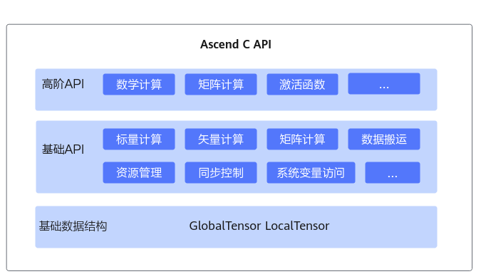

# Ascend C API列表

Ascend C提供一组类库API，开发者使用标准C++语法和类库API进行编程。Ascend C编程类库API示意图如下所示，分为：

-   Kernel API：用于实现算子核函数的API接口。包括：
    -   **基本数据结构**：kernel API中使用到的基本数据结构，比如GlobalTensor和LocalTensor。
    -   **基础API**：实现对硬件能力的抽象，开放芯片的能力，保证完备性和兼容性。标注为ISASI（Instruction Set Architecture Special Interface，硬件体系结构相关的接口）类别的API，不能保证跨硬件版本兼容。
    -   **高阶API**：实现一些常用的计算算法，用于提高编程开发效率，通常会调用多种基础API实现。高阶API包括数学库、Matmul、Softmax等API。高阶API可以保证兼容性。

-   **算子调测API**：用于算子调测的API，包括孪生调试，性能调测等。

进行Ascend C算子Host侧编程时，需要使用基础数据结构和API；完成算子开发后，需要使用Runtime API完成算子的调用。

## 基本数据结构列表

**表 1**  基本数据结构列表

<table><thead align="left"><tr id="row11268657105518"><th class="cellrowborder" valign="top" width="40.37%" id="mcps1.2.3.1.1">
接口名

</th>
<th class="cellrowborder" valign="top" width="59.63%" id="mcps1.2.3.1.2">
功能描述

</th>
</tr>
</thead>
<tbody><tr id="row102681557105520"><td class="cellrowborder" valign="top" width="40.37%" headers="mcps1.2.3.1.1 ">
<a href="LocalTensor.md">LocalTensor</a>

</td>
<td class="cellrowborder" valign="top" width="59.63%" headers="mcps1.2.3.1.2 ">
LocalTensor用于存放AI Core中Local Memory（内部存储）的数据，支持逻辑位置<a href="TPosition.md">TPosition</a>为VECIN、VECOUT、VECCALC、A1、A2、B1、B2、CO1、CO2。

</td>
</tr>
<tr id="row026925718557"><td class="cellrowborder" valign="top" width="40.37%" headers="mcps1.2.3.1.1 ">
<a href="GlobalTensor.md">GlobalTensor</a>

</td>
<td class="cellrowborder" valign="top" width="59.63%" headers="mcps1.2.3.1.2 ">
GlobalTensor用来存放Global Memory（外部存储）的全局数据。

</td>
</tr>
<tr id="row132691757135514"><td class="cellrowborder" valign="top" width="40.37%" headers="mcps1.2.3.1.1 ">
<a href="ShapeInfo.md">ShapeInfo</a>

</td>
<td class="cellrowborder" valign="top" width="59.63%" headers="mcps1.2.3.1.2 ">
ShapeInfo用来存放LocalTensor或GlobalTensor的shape信息。

</td>
</tr>
<tr id="row1726925715514"><td class="cellrowborder" valign="top" width="40.37%" headers="mcps1.2.3.1.1 ">
<a href="ListTensorDesc.md">ListTensorDesc</a>

</td>
<td class="cellrowborder" valign="top" width="59.63%" headers="mcps1.2.3.1.2 ">
ListTensorDesc用来解析符合以下内存排布格式的数据， 并在kernel侧根据索引获取储存对应数据的地址及shape信息。

</td>
</tr>
<tr id="row826925718552"><td class="cellrowborder" valign="top" width="40.37%" headers="mcps1.2.3.1.1 ">
<a href="TensorDesc.md">TensorDesc</a>

</td>
<td class="cellrowborder" valign="top" width="59.63%" headers="mcps1.2.3.1.2 ">
TensorDesc用于储存<a href="ListTensorDesc.md">ListTensorDesc</a>.GetDesc()中根据index获取对应的Tensor描述信息。

</td>
</tr>
<tr id="row32691573557"><td class="cellrowborder" valign="top" width="40.37%" headers="mcps1.2.3.1.1 ">
<a href="Coordinate.md">Coordinate</a>

</td>
<td class="cellrowborder" valign="top" width="59.63%" headers="mcps1.2.3.1.2 ">
Coordinate本质上是一个元组（tuple），用于表示张量在不同维度的位置信息，即坐标值。

</td>
</tr>
<tr id="row926915745510"><td class="cellrowborder" valign="top" width="40.37%" headers="mcps1.2.3.1.1 ">
<a href="Layout.md">Layout</a>

</td>
<td class="cellrowborder" valign="top" width="59.63%" headers="mcps1.2.3.1.2 ">
Layout&lt;Shape, Stride&gt;数据结构是描述多维张量内存布局的基础模板类，通过编译时的形状（Shape）和步长（Stride）信息，实现逻辑坐标空间到一维内存地址空间的映射，为复杂张量操作和硬件优化提供基础支持。

</td>
</tr>
<tr id="row97101411165713"><td class="cellrowborder" valign="top" width="40.37%" headers="mcps1.2.3.1.1 ">
<a href="TensorTrait.md">TensorTrait</a>

</td>
<td class="cellrowborder" valign="top" width="59.63%" headers="mcps1.2.3.1.2 ">
TensorTrait数据结构是描述Tensor相关信息的基础模板类，包含Tensor的数据类型、逻辑位置和Layout内存布局。

</td>
</tr>
<tr id="row1462001485710"><td class="cellrowborder" valign="top" width="40.37%" headers="mcps1.2.3.1.1 ">
<a href="UnaryRepeatParams.md">UnaryRepeatParams</a>

</td>
<td class="cellrowborder" valign="top" width="59.63%" headers="mcps1.2.3.1.2 ">
UnaryRepeatParams为用于控制操作数地址步长的数据结构。结构体内包含操作数相邻迭代间相同DataBlock的地址步长，操作数同一迭代内不同DataBlock的地址步长等参数。

</td>
</tr>
<tr id="row15620181775713"><td class="cellrowborder" valign="top" width="40.37%" headers="mcps1.2.3.1.1 ">
<a href="BinaryRepeatParams.md">BinaryRepeatParams</a>

</td>
<td class="cellrowborder" valign="top" width="59.63%" headers="mcps1.2.3.1.2 ">
BinaryRepeatParams为用于控制操作数地址步长的数据结构。结构体内包含操作数相邻迭代间相同DataBlock的地址步长，操作数同一迭代内不同DataBlock的地址步长等参数。

</td>
</tr>
</tbody>
</table>

## 基础API

**表 2**  标量计算API列表

<table><thead align="left"><tr id="row1539063572010"><th class="cellrowborder" valign="top" width="40.37%" id="mcps1.2.3.1.1">
接口名

</th>
<th class="cellrowborder" valign="top" width="59.63%" id="mcps1.2.3.1.2">
功能描述

</th>
</tr>
</thead>
<tbody><tr id="row839013512016"><td class="cellrowborder" valign="top" width="40.37%" headers="mcps1.2.3.1.1 ">
<a href="ScalarGetCountOfValue.md">ScalarGetCountOfValue</a>

</td>
<td class="cellrowborder" valign="top" width="59.63%" headers="mcps1.2.3.1.2 ">
获取一个uint64_t类型数字的二进制中0或者1的个数。

</td>
</tr>
<tr id="row5390935132010"><td class="cellrowborder" valign="top" width="40.37%" headers="mcps1.2.3.1.1 ">
<a href="ScalarCountLeadingZero.md">ScalarCountLeadingZero</a>

</td>
<td class="cellrowborder" valign="top" width="59.63%" headers="mcps1.2.3.1.2 ">
计算一个uint64_t类型数字前导0的个数（二进制从最高位到第一个1一共有多少个0）。

</td>
</tr>
<tr id="row187241145152620"><td class="cellrowborder" valign="top" width="40.37%" headers="mcps1.2.3.1.1 ">
<a href="ScalarCast.md">ScalarCast</a>

</td>
<td class="cellrowborder" valign="top" width="59.63%" headers="mcps1.2.3.1.2 ">
将一个scalar的类型转换为指定的类型。

</td>
</tr>
<tr id="row129095914341"><td class="cellrowborder" valign="top" width="40.37%" headers="mcps1.2.3.1.1 ">
<a href="CountBitsCntSameAsSignBit.md">CountBitsCntSameAsSignBit</a>

</td>
<td class="cellrowborder" valign="top" width="59.63%" headers="mcps1.2.3.1.2 ">
计算一个uint64_t类型数字的二进制中，从最高数值位开始与符号位相同的连续比特位的个数。

</td>
</tr>
<tr id="row944019598346"><td class="cellrowborder" valign="top" width="40.37%" headers="mcps1.2.3.1.1 ">
<a href="ScalarGetSFFValue.md">ScalarGetSFFValue</a>

</td>
<td class="cellrowborder" valign="top" width="59.63%" headers="mcps1.2.3.1.2 ">
获取一个uint64_t类型数字的二进制中第一个0或1出现的位置。

</td>
</tr>
<tr id="row1566175913418"><td class="cellrowborder" valign="top" width="40.37%" headers="mcps1.2.3.1.1 ">
<a href="ToBfloat16.md">ToBfloat16</a>

</td>
<td class="cellrowborder" valign="top" width="59.63%" headers="mcps1.2.3.1.2 ">
float类型标量数据转换成bfloat16_t类型标量数据。

</td>
</tr>
<tr id="row13704105910340"><td class="cellrowborder" valign="top" width="40.37%" headers="mcps1.2.3.1.1 ">
<a href="ToFloat.md">ToFloat</a>

</td>
<td class="cellrowborder" valign="top" width="59.63%" headers="mcps1.2.3.1.2 ">
bfloat16_t类型标量数据转换成float类型标量数据。

</td>
</tr>
</tbody>
</table>

**表 3**  矢量计算API列表

<table><thead align="left"><tr id="row1372812592319"><th class="cellrowborder" valign="top" width="15.590000000000002%" id="mcps1.2.4.1.1">
分类

</th>
<th class="cellrowborder" valign="top" width="24.64%" id="mcps1.2.4.1.2">
接口名

</th>
<th class="cellrowborder" valign="top" width="59.77%" id="mcps1.2.4.1.3">
功能描述

</th>
</tr>
</thead>
<tbody><tr id="row1972815510234"><td class="cellrowborder" rowspan="18" valign="top" width="15.590000000000002%" headers="mcps1.2.4.1.1 ">
基础算术

</td>
<td class="cellrowborder" valign="top" width="24.64%" headers="mcps1.2.4.1.2 ">
<a href="Exp.md">Exp</a>

</td>
<td class="cellrowborder" valign="top" width="59.77%" headers="mcps1.2.4.1.3 ">
按元素取自然指数。

</td>
</tr>
<tr id="row77297582318"><td class="cellrowborder" valign="top" headers="mcps1.2.4.1.1 ">
<a href="Ln.md">Ln</a>

</td>
<td class="cellrowborder" valign="top" headers="mcps1.2.4.1.2 ">
按元素取自然对数。

</td>
</tr>
<tr id="row095531611435"><td class="cellrowborder" valign="top" headers="mcps1.2.4.1.1 ">
<a href="Abs.md">Abs</a>

</td>
<td class="cellrowborder" valign="top" headers="mcps1.2.4.1.2 ">
按元素取绝对值。

</td>
</tr>
<tr id="row1698614591910"><td class="cellrowborder" valign="top" headers="mcps1.2.4.1.1 ">
<a href="Reciprocal.md">Reciprocal</a>

</td>
<td class="cellrowborder" valign="top" headers="mcps1.2.4.1.2 ">
按元素取倒数。

</td>
</tr>
<tr id="row204721719184318"><td class="cellrowborder" valign="top" headers="mcps1.2.4.1.1 ">
<a href="Sqrt.md">Sqrt</a>

</td>
<td class="cellrowborder" valign="top" headers="mcps1.2.4.1.2 ">
按元素做开方。

</td>
</tr>
<tr id="row1263518197432"><td class="cellrowborder" valign="top" headers="mcps1.2.4.1.1 ">
<a href="Rsqrt.md">Rsqrt</a>

</td>
<td class="cellrowborder" valign="top" headers="mcps1.2.4.1.2 ">
按元素做开方后取倒数。

</td>
</tr>
<tr id="row11951420124314"><td class="cellrowborder" valign="top" headers="mcps1.2.4.1.1 ">
<a href="Relu.md">Relu</a>

</td>
<td class="cellrowborder" valign="top" headers="mcps1.2.4.1.2 ">
按元素做线性整流Relu。

</td>
</tr>
<tr id="row687313439911"><td class="cellrowborder" valign="top" headers="mcps1.2.4.1.1 ">
<a href="Add.md">Add</a>

</td>
<td class="cellrowborder" valign="top" headers="mcps1.2.4.1.2 ">
按元素求和。

</td>
</tr>
<tr id="row1874810244362"><td class="cellrowborder" valign="top" headers="mcps1.2.4.1.1 ">
<a href="Sub.md">Sub</a>

</td>
<td class="cellrowborder" valign="top" headers="mcps1.2.4.1.2 ">
按元素求差。

</td>
</tr>
<tr id="row1291015249364"><td class="cellrowborder" valign="top" headers="mcps1.2.4.1.1 ">
<a href="Mul.md">Mul</a>

</td>
<td class="cellrowborder" valign="top" headers="mcps1.2.4.1.2 ">
按元素求积。

</td>
</tr>
<tr id="row81121256363"><td class="cellrowborder" valign="top" headers="mcps1.2.4.1.1 ">
<a href="Div.md">Div</a>

</td>
<td class="cellrowborder" valign="top" headers="mcps1.2.4.1.2 ">
按元素求商。

</td>
</tr>
<tr id="row152552025153613"><td class="cellrowborder" valign="top" headers="mcps1.2.4.1.1 ">
<a href="Max.md">Max</a>

</td>
<td class="cellrowborder" valign="top" headers="mcps1.2.4.1.2 ">
按元素求最大值。

</td>
</tr>
<tr id="row104017250363"><td class="cellrowborder" valign="top" headers="mcps1.2.4.1.1 ">
<a href="Min.md">Min</a>

</td>
<td class="cellrowborder" valign="top" headers="mcps1.2.4.1.2 ">
按元素求最小值。

</td>
</tr>
<tr id="row14127182319571"><td class="cellrowborder" valign="top" headers="mcps1.2.4.1.1 ">
<a href="Adds.md">Adds</a>

</td>
<td class="cellrowborder" valign="top" headers="mcps1.2.4.1.2 ">
矢量内每个元素与标量求和。

</td>
</tr>
<tr id="row107601527165713"><td class="cellrowborder" valign="top" headers="mcps1.2.4.1.1 ">
<a href="Muls.md">Muls</a>

</td>
<td class="cellrowborder" valign="top" headers="mcps1.2.4.1.2 ">
矢量内每个元素与标量求积。

</td>
</tr>
<tr id="row1277082912579"><td class="cellrowborder" valign="top" headers="mcps1.2.4.1.1 ">
<a href="Maxs.md">Maxs</a>

</td>
<td class="cellrowborder" valign="top" headers="mcps1.2.4.1.2 ">
源操作数矢量内每个元素与标量相比，如果比标量大，则取源操作数值，比标量的值小，则取标量值。

</td>
</tr>
<tr id="row33851439175710"><td class="cellrowborder" valign="top" headers="mcps1.2.4.1.1 ">
<a href="Mins.md">Mins</a>

</td>
<td class="cellrowborder" valign="top" headers="mcps1.2.4.1.2 ">
源操作数矢量内每个元素与标量相比，如果比标量大，则取标量值，比标量的值小，则取源操作数值。

</td>
</tr>
<tr id="row547912419575"><td class="cellrowborder" valign="top" headers="mcps1.2.4.1.1 ">
<a href="LeakyRelu.md">LeakyRelu</a>

</td>
<td class="cellrowborder" valign="top" headers="mcps1.2.4.1.2 ">
按元素做带泄露线性整流Leaky ReLU。

</td>
</tr>
<tr id="row64233134354"><td class="cellrowborder" rowspan="5" valign="top" width="15.590000000000002%" headers="mcps1.2.4.1.1 ">
逻辑计算

</td>
<td class="cellrowborder" valign="top" width="24.64%" headers="mcps1.2.4.1.2 ">
<a href="Not.md">Not</a>

</td>
<td class="cellrowborder" valign="top" width="59.77%" headers="mcps1.2.4.1.3 ">
按元素做按位取反。

</td>
</tr>
<tr id="row855712515365"><td class="cellrowborder" valign="top" headers="mcps1.2.4.1.1 ">
<a href="And.md">And</a>

</td>
<td class="cellrowborder" valign="top" headers="mcps1.2.4.1.2 ">
针对每对元素执行按位与运算。

</td>
</tr>
<tr id="row19695152573617"><td class="cellrowborder" valign="top" headers="mcps1.2.4.1.1 ">
<a href="Or.md">Or</a>

</td>
<td class="cellrowborder" valign="top" headers="mcps1.2.4.1.2 ">
针对每对元素执行按位或运算。

</td>
</tr>
<tr id="row20711575584"><td class="cellrowborder" valign="top" headers="mcps1.2.4.1.1 ">
<a href="ShiftLeft.md">ShiftLeft</a>

</td>
<td class="cellrowborder" valign="top" headers="mcps1.2.4.1.2 ">
对源操作数中的每个元素进行左移操作，左移的位数由输入参数scalarValue决定。

</td>
</tr>
<tr id="row17751175445811"><td class="cellrowborder" valign="top" headers="mcps1.2.4.1.1 ">
<a href="ShiftRight.md">ShiftRight</a>

</td>
<td class="cellrowborder" valign="top" headers="mcps1.2.4.1.2 ">
对源操作数中的每个元素进行右移操作，右移的位数由输入参数scalarValue决定。

</td>
</tr>
<tr id="row1413722319810"><td class="cellrowborder" rowspan="11" valign="top" width="15.590000000000002%" headers="mcps1.2.4.1.1 ">
复合计算

</td>
<td class="cellrowborder" valign="top" width="24.64%" headers="mcps1.2.4.1.2 ">
<a href="Axpy.md">Axpy</a>

</td>
<td class="cellrowborder" valign="top" width="59.77%" headers="mcps1.2.4.1.3 ">
源操作数中每个元素与标量求积后和目的操作数中的对应元素相加。

</td>
</tr>
<tr id="row167541318782"><td class="cellrowborder" valign="top" headers="mcps1.2.4.1.1 ">
<a href="CastDeq.md">CastDeq</a>

</td>
<td class="cellrowborder" valign="top" headers="mcps1.2.4.1.2 ">
对输入做量化并进行精度转换。

</td>
</tr>
<tr id="row15953122533617"><td class="cellrowborder" valign="top" headers="mcps1.2.4.1.1 ">
<a href="AddRelu.md">AddRelu</a>

</td>
<td class="cellrowborder" valign="top" headers="mcps1.2.4.1.2 ">
按元素求和，结果和0对比取较大值。

</td>
</tr>
<tr id="row16141192653616"><td class="cellrowborder" valign="top" headers="mcps1.2.4.1.1 ">
<a href="AddReluCast.md">AddReluCast</a>

</td>
<td class="cellrowborder" valign="top" headers="mcps1.2.4.1.2 ">
按元素求和，结果和0对比取较大值，并根据源操作数和目的操作数Tensor的数据类型进行精度转换。

</td>
</tr>
<tr id="row977016176378"><td class="cellrowborder" valign="top" headers="mcps1.2.4.1.1 ">
<a href="AddDeqRelu.md">AddDeqRelu</a>

</td>
<td class="cellrowborder" valign="top" headers="mcps1.2.4.1.2 ">
依次计算按元素求和、结果进行deq量化后再进行relu计算（结果和0对比取较大值）。

</td>
</tr>
<tr id="row17935161713713"><td class="cellrowborder" valign="top" headers="mcps1.2.4.1.1 ">
<a href="SubRelu.md">SubRelu</a>

</td>
<td class="cellrowborder" valign="top" headers="mcps1.2.4.1.2 ">
按元素求差，结果和0对比取较大值。

</td>
</tr>
<tr id="row138841816370"><td class="cellrowborder" valign="top" headers="mcps1.2.4.1.1 ">
<a href="SubReluCast.md">SubReluCast</a>

</td>
<td class="cellrowborder" valign="top" headers="mcps1.2.4.1.2 ">
按元素求差，结果和0对比取较大值，并根据源操作数和目的操作数Tensor的数据类型进行精度转换。

</td>
</tr>
<tr id="row132241218193712"><td class="cellrowborder" valign="top" headers="mcps1.2.4.1.1 ">
<a href="MulAddDst.md">MulAddDst</a>

</td>
<td class="cellrowborder" valign="top" headers="mcps1.2.4.1.2 ">
按元素将src0Local和src1Local相乘并和dstLocal相加，将最终结果存放进dstLocal中。

</td>
</tr>
<tr id="row117041522154616"><td class="cellrowborder" valign="top" headers="mcps1.2.4.1.1 ">
<a href="MulCast.md">MulCast</a>

</td>
<td class="cellrowborder" valign="top" headers="mcps1.2.4.1.2 ">
按元素求积，并根据源操作数和目的操作数Tensor的数据类型进行精度转换。

</td>
</tr>
<tr id="row193701818163720"><td class="cellrowborder" valign="top" headers="mcps1.2.4.1.1 ">
<a href="FusedMulAdd.md">FusedMulAdd</a>

</td>
<td class="cellrowborder" valign="top" headers="mcps1.2.4.1.2 ">
按元素将src0Local和dstLocal相乘并加上src1Local，最终结果存放入dstLocal。

</td>
</tr>
<tr id="row1075883983914"><td class="cellrowborder" valign="top" headers="mcps1.2.4.1.1 ">
<a href="FusedMulAddRelu.md">FusedMulAddRelu</a>

</td>
<td class="cellrowborder" valign="top" headers="mcps1.2.4.1.2 ">
按元素将src0Local和dstLocal相乘并加上src1Local，将结果和0作比较，取较大值，最终结果存放进dstLocal中。

</td>
</tr>
<tr id="row187959172211"><td class="cellrowborder" rowspan="5" valign="top" width="15.590000000000002%" headers="mcps1.2.4.1.1 ">
比较与选择

</td>
<td class="cellrowborder" valign="top" width="24.64%" headers="mcps1.2.4.1.2 ">
<a href="Compare.md">Compare</a>

</td>
<td class="cellrowborder" valign="top" width="59.77%" headers="mcps1.2.4.1.3 ">
逐元素比较两个tensor大小，如果比较后的结果为真，则输出结果的对应比特位为1，否则为0。

</td>
</tr>
<tr id="row1314575919229"><td class="cellrowborder" valign="top" headers="mcps1.2.4.1.1 ">
<a href="Compare（结果存入寄存器）.md">Compare（结果存放入寄存器）</a>

</td>
<td class="cellrowborder" valign="top" headers="mcps1.2.4.1.2 ">
逐元素比较两个tensor大小，如果比较后的结果为真，则输出结果的对应比特位为1，否则为0。Compare接口需要mask参数时，可以使用此接口。计算结果存放入寄存器中。

</td>
</tr>
<tr id="row31514186404"><td class="cellrowborder" valign="top" headers="mcps1.2.4.1.1 ">
<a href="CompareScalar.md">CompareScalar</a>

</td>
<td class="cellrowborder" valign="top" headers="mcps1.2.4.1.2 ">
逐元素比较一个tensor中的元素和另一个Scalar的大小，如果比较后的结果为真，则输出结果的对应比特位为1，否则为0。

</td>
</tr>
<tr id="row1798081810408"><td class="cellrowborder" valign="top" headers="mcps1.2.4.1.1 ">
<a href="Select.md">Select</a>

</td>
<td class="cellrowborder" valign="top" headers="mcps1.2.4.1.2 ">
给定两个源操作数src0和src1，根据selMask（用于选择的Mask掩码）的比特位值选取元素，得到目的操作数dst。选择的规则为：当selMask的比特位是1时，从src0中选取，比特位是0时从src1选取。

</td>
</tr>
<tr id="row1214111974012"><td class="cellrowborder" valign="top" headers="mcps1.2.4.1.1 ">
<a href="GatherMask.md">GatherMask</a>

</td>
<td class="cellrowborder" valign="top" headers="mcps1.2.4.1.2 ">
以内置固定模式对应的二进制或者用户自定义输入的Tensor数值对应的二进制为gather mask（数据收集的掩码），从源操作数中选取元素写入目的操作数中。

</td>
</tr>
<tr id="row1095112164319"><td class="cellrowborder" valign="top" width="15.590000000000002%" headers="mcps1.2.4.1.1 ">
精度转换指令

</td>
<td class="cellrowborder" valign="top" width="24.64%" headers="mcps1.2.4.1.2 ">
<a href="Cast.md">Cast</a>

</td>
<td class="cellrowborder" valign="top" width="59.77%" headers="mcps1.2.4.1.3 ">
根据源操作数和目的操作数Tensor的数据类型进行精度转换。

</td>
</tr>
<tr id="row1651510211434"><td class="cellrowborder" rowspan="11" valign="top" width="15.590000000000002%" headers="mcps1.2.4.1.1 ">
归约计算

</td>
<td class="cellrowborder" valign="top" width="24.64%" headers="mcps1.2.4.1.2 ">
<a href="ReduceMax.md">ReduceMax</a>

</td>
<td class="cellrowborder" valign="top" width="59.77%" headers="mcps1.2.4.1.3 ">
在所有的输入数据中找出最大值及最大值对应的索引位置。

</td>
</tr>
<tr id="row196635294315"><td class="cellrowborder" valign="top" headers="mcps1.2.4.1.1 ">
<a href="ReduceMin.md">ReduceMin</a>

</td>
<td class="cellrowborder" valign="top" headers="mcps1.2.4.1.2 ">
在所有的输入数据中找出最小值及最小值对应的索引位置。

</td>
</tr>
<tr id="row77918244313"><td class="cellrowborder" valign="top" headers="mcps1.2.4.1.1 ">
<a href="ReduceSum.md">ReduceSum</a>

</td>
<td class="cellrowborder" valign="top" headers="mcps1.2.4.1.2 ">
对所有的输入数据求和。

</td>
</tr>
<tr id="row79421217439"><td class="cellrowborder" valign="top" headers="mcps1.2.4.1.1 ">
<a href="WholeReduceMax.md">WholeReduceMax</a>

</td>
<td class="cellrowborder" valign="top" headers="mcps1.2.4.1.2 ">
每个repeat内所有数据求最大值以及其索引index。

</td>
</tr>
<tr id="row1961802720599"><td class="cellrowborder" valign="top" headers="mcps1.2.4.1.1 ">
<a href="WholeReduceMin.md">WholeReduceMin</a>

</td>
<td class="cellrowborder" valign="top" headers="mcps1.2.4.1.2 ">
每个repeat内所有数据求最小值以及其索引index。

</td>
</tr>
<tr id="row2928152965915"><td class="cellrowborder" valign="top" headers="mcps1.2.4.1.1 ">
<a href="WholeReduceSum.md">WholeReduceSum</a>

</td>
<td class="cellrowborder" valign="top" headers="mcps1.2.4.1.2 ">
每个repeat内所有数据求和。

</td>
</tr>
<tr id="row157712324319"><td class="cellrowborder" valign="top" headers="mcps1.2.4.1.1 ">
<a href="BlockReduceMax.md">BlockReduceMax</a>

</td>
<td class="cellrowborder" valign="top" headers="mcps1.2.4.1.2 ">
对每个repeat内所有元素求最大值。

</td>
</tr>
<tr id="row17211133134315"><td class="cellrowborder" valign="top" headers="mcps1.2.4.1.1 ">
<a href="BlockReduceMin.md">BlockReduceMin</a>

</td>
<td class="cellrowborder" valign="top" headers="mcps1.2.4.1.2 ">
对每个repeat内所有元素求最小值。

</td>
</tr>
<tr id="row193401338432"><td class="cellrowborder" valign="top" headers="mcps1.2.4.1.1 ">
<a href="BlockReduceSum.md">BlockReduceSum</a>

</td>
<td class="cellrowborder" valign="top" headers="mcps1.2.4.1.2 ">
对每个repeat内所有元素求和。源操作数相加采用二叉树方式，两两相加。

</td>
</tr>
<tr id="row250213184316"><td class="cellrowborder" valign="top" headers="mcps1.2.4.1.1 ">
<a href="PairReduceSum.md">PairReduceSum</a>

</td>
<td class="cellrowborder" valign="top" headers="mcps1.2.4.1.2 ">
PairReduceSum：相邻两个（奇偶）元素求和。

</td>
</tr>
<tr id="row5812182116350"><td class="cellrowborder" valign="top" headers="mcps1.2.4.1.1 ">
<a href="RepeatReduceSum.md">RepeatReduceSum</a>

</td>
<td class="cellrowborder" valign="top" headers="mcps1.2.4.1.2 ">
每个repeat内所有数据求和。和<a href="WholeReduceSum.md">WholeReduceSum</a>接口相比，不支持mask逐bit模式。建议使用功能更全面的<a href="WholeReduceSum.md">WholeReduceSum</a>接口。

</td>
</tr>
<tr id="row109261892541"><td class="cellrowborder" rowspan="2" valign="top" width="15.590000000000002%" headers="mcps1.2.4.1.1 ">
数据转换

</td>
<td class="cellrowborder" valign="top" width="24.64%" headers="mcps1.2.4.1.2 ">
<a href="Transpose.md">Transpose</a>

</td>
<td class="cellrowborder" valign="top" width="59.77%" headers="mcps1.2.4.1.3 ">
可实现16*16的二维矩阵数据块的转置和[N,C,H,W]与[N,H,W,C]互相转换。

</td>
</tr>
<tr id="row476616718548"><td class="cellrowborder" valign="top" headers="mcps1.2.4.1.1 ">
<a href="TransDataTo5HD.md">TransDataTo5HD</a>

</td>
<td class="cellrowborder" valign="top" headers="mcps1.2.4.1.2 ">
数据格式转换，一般用于将NCHW格式转换成NC1HWC0格式。特别的，也可以用于二维矩阵数据块的转置。

</td>
</tr>
<tr id="row86261631104316"><td class="cellrowborder" rowspan="3" valign="top" width="15.590000000000002%" headers="mcps1.2.4.1.1 ">
数据填充

</td>
<td class="cellrowborder" valign="top" width="24.64%" headers="mcps1.2.4.1.2 ">
<a href="Duplicate.md">Duplicate</a>

</td>
<td class="cellrowborder" valign="top" width="59.77%" headers="mcps1.2.4.1.3 ">
将一个变量或一个立即数，复制多次并填充到向量。

</td>
</tr>
<tr id="row17641318431"><td class="cellrowborder" valign="top" headers="mcps1.2.4.1.1 ">
<a href="Brcb.md">Brcb</a>

</td>
<td class="cellrowborder" valign="top" headers="mcps1.2.4.1.2 ">
给定一个输入张量，每一次取输入张量中的8个数填充到结果张量的8个datablock（32Bytes）中去，每个数对应一个datablock。

</td>
</tr>
<tr id="row173409456360"><td class="cellrowborder" valign="top" headers="mcps1.2.4.1.1 ">
<a href="CreateVecIndex.md">CreateVecIndex</a>

</td>
<td class="cellrowborder" valign="top" headers="mcps1.2.4.1.2 ">
以firstValue为起始值创建向量索引。

</td>
</tr>
<tr id="row161901532124317"><td class="cellrowborder" valign="top" width="15.590000000000002%" headers="mcps1.2.4.1.1 ">
数据分散/数据收集

</td>
<td class="cellrowborder" valign="top" width="24.64%" headers="mcps1.2.4.1.2 ">
<a href="Gather.md">Gather</a>

</td>
<td class="cellrowborder" valign="top" width="59.77%" headers="mcps1.2.4.1.3 ">
给定输入的张量和一个地址偏移张量，Gather指令根据偏移地址将输入张量按元素收集到结果张量中。

</td>
</tr>
<tr id="row16331932164312"><td class="cellrowborder" rowspan="4" valign="top" width="15.590000000000002%" headers="mcps1.2.4.1.1 ">
掩码操作

</td>
<td class="cellrowborder" valign="top" width="24.64%" headers="mcps1.2.4.1.2 ">
<a href="SetMaskCount.md">SetMaskCount</a>

</td>
<td class="cellrowborder" valign="top" width="59.77%" headers="mcps1.2.4.1.3 ">
设置mask模式为Counter模式。该模式下，不需要开发者去感知迭代次数、处理非对齐的尾块等操作，可直接传入计算数据量，实际迭代次数由Vector计算单元自动推断。

</td>
</tr>
<tr id="row1678513323437"><td class="cellrowborder" valign="top" headers="mcps1.2.4.1.1 ">
<a href="SetMaskNorm.md">SetMaskNorm</a>

</td>
<td class="cellrowborder" valign="top" headers="mcps1.2.4.1.2 ">
设置mask模式为Normal模式。该模式为系统默认模式，支持开发者配置迭代次数。

</td>
</tr>
<tr id="row1393713216436"><td class="cellrowborder" valign="top" headers="mcps1.2.4.1.1 ">
<a href="SetVectorMask.md">SetVectorMask</a>

</td>
<td class="cellrowborder" valign="top" headers="mcps1.2.4.1.2 ">
用于在矢量计算时设置mask。

</td>
</tr>
<tr id="row15756339433"><td class="cellrowborder" valign="top" headers="mcps1.2.4.1.1 ">
<a href="ResetMask.md">ResetMask</a>

</td>
<td class="cellrowborder" valign="top" headers="mcps1.2.4.1.2 ">
恢复mask的值为默认值（全1），表示矢量计算中每次迭代内的所有元素都将参与运算。

</td>
</tr>
<tr id="row743516194407"><td class="cellrowborder" valign="top" width="15.590000000000002%" headers="mcps1.2.4.1.1 ">
量化设置

</td>
<td class="cellrowborder" valign="top" width="24.64%" headers="mcps1.2.4.1.2 ">
<a href="SetDeqScale.md">SetDeqScale</a>

</td>
<td class="cellrowborder" valign="top" width="59.77%" headers="mcps1.2.4.1.3 ">
设置DEQSCALE寄存器的值。

</td>
</tr>
</tbody>
</table>

**表 4**  数据搬运API列表

<table><thead align="left"><tr id="row69936217246"><th class="cellrowborder" valign="top" width="40.37%" id="mcps1.2.3.1.1">
接口名

</th>
<th class="cellrowborder" valign="top" width="59.63%" id="mcps1.2.3.1.2">
功能描述

</th>
</tr>
</thead>
<tbody><tr id="row19994142132410"><td class="cellrowborder" valign="top" width="40.37%" headers="mcps1.2.3.1.1 ">
<a href="DataCopy.md">DataCopy</a>

</td>
<td class="cellrowborder" valign="top" width="59.63%" headers="mcps1.2.3.1.2 ">
数据搬运接口，包括普通数据搬运、增强数据搬运、切片数据搬运、随路格式转换。

</td>
</tr>
<tr id="row29942216241"><td class="cellrowborder" valign="top" width="40.37%" headers="mcps1.2.3.1.1 ">
<a href="Copy.md">Copy</a>

</td>
<td class="cellrowborder" valign="top" width="59.63%" headers="mcps1.2.3.1.2 ">
VECIN、VECCALC、VECOUT之间的搬运指令，支持mask操作和DataBlock间隔操作。

</td>
</tr>
</tbody>
</table>

**表 5**  资源管理API列表

<table><thead align="left"><tr id="row15676154310267"><th class="cellrowborder" valign="top" width="40.37%" id="mcps1.2.3.1.1">
接口名

</th>
<th class="cellrowborder" valign="top" width="59.63%" id="mcps1.2.3.1.2">
功能描述

</th>
</tr>
</thead>
<tbody><tr id="row367664312619"><td class="cellrowborder" valign="top" width="40.37%" headers="mcps1.2.3.1.1 ">
<a href="TPipe.md">TPipe</a>

</td>
<td class="cellrowborder" valign="top" width="59.63%" headers="mcps1.2.3.1.2 ">
TPipe是用来管理全局内存等资源的框架。通过TPipe类提供的接口可以完成内存等资源的分配管理操作。

</td>
</tr>
<tr id="row1867604312262"><td class="cellrowborder" valign="top" width="40.37%" headers="mcps1.2.3.1.1 ">
<a href="GetTPipePtr.md">GetTPipePtr</a>

</td>
<td class="cellrowborder" valign="top" width="59.63%" headers="mcps1.2.3.1.2 ">
获取框架当前管理全局内存的TPipe指针，用户获取指针后，可进行TPipe相关的操作。

</td>
</tr>
<tr id="row1381344122816"><td class="cellrowborder" valign="top" width="40.37%" headers="mcps1.2.3.1.1 ">
<a href="TBufPool.md">TBufPool</a>

</td>
<td class="cellrowborder" valign="top" width="59.63%" headers="mcps1.2.3.1.2 ">
TPipe可以管理全局内存资源，而TBufPool可以手动管理或复用Unified Buffer/L1 Buffer物理内存，主要用于多个stage计算中Unified Buffer/L1 Buffer物理内存不足的场景。

</td>
</tr>
<tr id="row1032714367308"><td class="cellrowborder" valign="top" width="40.37%" headers="mcps1.2.3.1.1 ">
<a href="TQue.md">TQue</a>

</td>
<td class="cellrowborder" valign="top" width="59.63%" headers="mcps1.2.3.1.2 ">
提供入队出队等接口，通过队列（Queue）完成任务间同步。

</td>
</tr>
<tr id="row6569103614302"><td class="cellrowborder" valign="top" width="40.37%" headers="mcps1.2.3.1.1 ">
<a href="TQueBind.md">TQueBind</a>

</td>
<td class="cellrowborder" valign="top" width="59.63%" headers="mcps1.2.3.1.2 ">
TQueBind绑定源逻辑位置和目的逻辑位置，根据源位置和目的位置，来确定内存分配的位置 、插入对应的同步事件，帮助开发者解决内存分配和管理、同步等问题。

</td>
</tr>
<tr id="row106614368306"><td class="cellrowborder" valign="top" width="40.37%" headers="mcps1.2.3.1.1 ">
<a href="TBuf.md">TBuf</a>

</td>
<td class="cellrowborder" valign="top" width="59.63%" headers="mcps1.2.3.1.2 ">
使用Ascend C编程的过程中，可能会用到一些临时变量。这些临时变量占用的内存可以使用TBuf数据结构来管理。

</td>
</tr>
<tr id="row158561936163012"><td class="cellrowborder" valign="top" width="40.37%" headers="mcps1.2.3.1.1 ">
<a href="InitSpmBuffer.md">InitSpmBuffer</a>

</td>
<td class="cellrowborder" valign="top" width="59.63%" headers="mcps1.2.3.1.2 ">
初始化SPM Buffer。

</td>
</tr>
<tr id="row324173716309"><td class="cellrowborder" valign="top" width="40.37%" headers="mcps1.2.3.1.1 ">
<a href="WriteSpmBuffer.md">WriteSpmBuffer</a>

</td>
<td class="cellrowborder" valign="top" width="59.63%" headers="mcps1.2.3.1.2 ">
将需要溢出暂存的数据拷贝到SPM Buffer中。

</td>
</tr>
<tr id="row1515119377302"><td class="cellrowborder" valign="top" width="40.37%" headers="mcps1.2.3.1.1 ">
<a href="ReadSpmBuffer.md">ReadSpmBuffer</a>

</td>
<td class="cellrowborder" valign="top" width="59.63%" headers="mcps1.2.3.1.2 ">
从SPM Buffer读回到local数据中。

</td>
</tr>
<tr id="row1550403614616"><td class="cellrowborder" valign="top" width="40.37%" headers="mcps1.2.3.1.1 ">
<a href="GetUserWorkspace.md">GetUserWorkspace</a>

</td>
<td class="cellrowborder" valign="top" width="59.63%" headers="mcps1.2.3.1.2 ">
获取用户使用的workspace指针。

</td>
</tr>
<tr id="row15918536184616"><td class="cellrowborder" valign="top" width="40.37%" headers="mcps1.2.3.1.1 ">
<a href="SetSysWorkSpace.md">SetSysWorkSpace</a>

</td>
<td class="cellrowborder" valign="top" width="59.63%" headers="mcps1.2.3.1.2 ">
在进行融合算子编程时，由于框架通信机制需要使用到workspace，也就是系统workspace，所以在该场景下，开发者要调用该接口，设置系统workspace的指针。

</td>
</tr>
<tr id="row196011374465"><td class="cellrowborder" valign="top" width="40.37%" headers="mcps1.2.3.1.1 ">
<a href="GetSysWorkSpacePtr.md">GetSysWorkSpacePtr</a>

</td>
<td class="cellrowborder" valign="top" width="59.63%" headers="mcps1.2.3.1.2 ">
获取系统workspace指针。

</td>
</tr>
</tbody>
</table>

**表 6**  同步API列表

<table><thead align="left"><tr id="row975619311161"><th class="cellrowborder" valign="top" width="40.37%" id="mcps1.2.3.1.1">
接口名

</th>
<th class="cellrowborder" valign="top" width="59.63%" id="mcps1.2.3.1.2">
功能描述

</th>
</tr>
</thead>
<tbody><tr id="row1021262515169"><td class="cellrowborder" valign="top" width="40.37%" headers="mcps1.2.3.1.1 ">
<a href="TQueSync.md">TQueSync</a>

</td>
<td class="cellrowborder" valign="top" width="59.63%" headers="mcps1.2.3.1.2 ">
TQueSync类提供同步控制接口，开发者可以使用这类API来自行完成同步控制。

</td>
</tr>
<tr id="row1821272513168"><td class="cellrowborder" valign="top" width="40.37%" headers="mcps1.2.3.1.1 ">
<a href="IBSet.md">IBSet</a>

</td>
<td class="cellrowborder" valign="top" width="59.63%" headers="mcps1.2.3.1.2 ">
当不同核之间操作同一块全局内存且可能存在读后写、写后读以及写后写等数据依赖问题时，通过调用该函数来插入同步语句来避免上述数据依赖时可能出现的数据读写错误问题。调用IBSet设置某一个核的标志位，与IBWait成对出现配合使用，表示核之间的同步等待指令，等待某一个核操作完成。

</td>
</tr>
<tr id="row121219258161"><td class="cellrowborder" valign="top" width="40.37%" headers="mcps1.2.3.1.1 ">
<a href="IBWait.md">IBWait</a>

</td>
<td class="cellrowborder" valign="top" width="59.63%" headers="mcps1.2.3.1.2 ">
当不同核之间操作同一块全局内存且可能存在读后写、写后读以及写后写等数据依赖问题时，通过调用该函数来插入同步语句来避免上述数据依赖时可能出现的数据读写错误问题。IBWait与IBSet成对出现配合使用，表示核之间的同步等待指令，等待某一个核操作完成。

</td>
</tr>
<tr id="row1121220254168"><td class="cellrowborder" valign="top" width="40.37%" headers="mcps1.2.3.1.1 ">
<a href="SyncAll.md">SyncAll</a>

</td>
<td class="cellrowborder" valign="top" width="59.63%" headers="mcps1.2.3.1.2 ">
当不同核之间操作同一块全局内存且可能存在读后写、写后读以及写后写等数据依赖问题时，通过调用该函数来插入同步语句来避免上述数据依赖时可能出现的数据读写错误问题。目前多核同步分为硬同步和软同步，硬件同步是利用硬件自带的全核同步指令由硬件保证多核同步，软件同步是使用软件算法模拟实现。

</td>
</tr>
<tr id="row92121225191611"><td class="cellrowborder" valign="top" width="40.37%" headers="mcps1.2.3.1.1 ">
<a href="InitDetermineComputeWorkspace.md">InitDetermineComputeWorkspace</a>

</td>
<td class="cellrowborder" valign="top" width="59.63%" headers="mcps1.2.3.1.2 ">
初始化GM共享内存的值，完成初始化后才可以调用<a href="WaitPreBlock.md">WaitPreBlock</a>和<a href="NotifyNextBlock.md">NotifyNextBlock</a>。

</td>
</tr>
<tr id="row16213425171615"><td class="cellrowborder" valign="top" width="40.37%" headers="mcps1.2.3.1.1 ">
<a href="WaitPreBlock.md">WaitPreBlock</a>

</td>
<td class="cellrowborder" valign="top" width="59.63%" headers="mcps1.2.3.1.2 ">
通过读GM地址中的值，确认是否需要继续等待，当GM的值满足当前核的等待条件时，该核即可往下执行，进行下一步操作。

</td>
</tr>
<tr id="row152131825131610"><td class="cellrowborder" valign="top" width="40.37%" headers="mcps1.2.3.1.1 ">
<a href="NotifyNextBlock.md">NotifyNextBlock</a>

</td>
<td class="cellrowborder" valign="top" width="59.63%" headers="mcps1.2.3.1.2 ">
通过写GM地址，通知下一个核当前核的操作已完成，下一个核可以进行操作。

</td>
</tr>
<tr id="row52131925101618"><td class="cellrowborder" valign="top" width="40.37%" headers="mcps1.2.3.1.1 ">
<a href="SetNextTaskStart.md">SetNextTaskStart</a>

</td>
<td class="cellrowborder" valign="top" width="59.63%" headers="mcps1.2.3.1.2 ">
在SuperKernel的子Kernel中调用，调用后的指令可以和后续其他的子Kernel实现并行，提升整体性能。

</td>
</tr>
<tr id="row162135257162"><td class="cellrowborder" valign="top" width="40.37%" headers="mcps1.2.3.1.1 ">
<a href="WaitPreTaskEnd.md">WaitPreTaskEnd</a>

</td>
<td class="cellrowborder" valign="top" width="59.63%" headers="mcps1.2.3.1.2 ">
在SuperKernel的子Kernel中调用，调用前的指令可以和前序其他的子Kernel实现并行，提升整体性能。

</td>
</tr>
</tbody>
</table>

**表 7**  缓存处理API列表

<table><thead align="left"><tr id="row32541018135711"><th class="cellrowborder" valign="top" width="40.27%" id="mcps1.2.3.1.1">
接口名

</th>
<th class="cellrowborder" valign="top" width="59.730000000000004%" id="mcps1.2.3.1.2">
功能描述

</th>
</tr>
</thead>
<tbody><tr id="row1325501835712"><td class="cellrowborder" valign="top" width="40.27%" headers="mcps1.2.3.1.1 ">
<a href="DataCachePreload.md">DataCachePreload</a>

</td>
<td class="cellrowborder" valign="top" width="59.730000000000004%" headers="mcps1.2.3.1.2 ">
从源地址所在的特定DDR地址预加载数据到data cache中。

</td>
</tr>
<tr id="row5255181815720"><td class="cellrowborder" valign="top" width="40.27%" headers="mcps1.2.3.1.1 ">
<a href="DataCacheCleanAndInvalid.md">DataCacheCleanAndInvalid</a>

</td>
<td class="cellrowborder" valign="top" width="59.730000000000004%" headers="mcps1.2.3.1.2 ">
该接口用来刷新Cache，保证Cache的一致性。

</td>
</tr>
</tbody>
</table>

**表 8**  系统变量访问API列表

<table><thead align="left"><tr id="row15672134518304"><th class="cellrowborder" valign="top" width="40.37%" id="mcps1.2.3.1.1">
接口名

</th>
<th class="cellrowborder" valign="top" width="59.63%" id="mcps1.2.3.1.2">
功能描述

</th>
</tr>
</thead>
<tbody><tr id="row967212454304"><td class="cellrowborder" valign="top" width="40.37%" headers="mcps1.2.3.1.1 ">
<a href="GetBlockNum.md">GetBlockNum</a>

</td>
<td class="cellrowborder" valign="top" width="59.63%" headers="mcps1.2.3.1.2 ">
获取当前任务配置的Block数，用于代码内部的多核逻辑控制等。

</td>
</tr>
<tr id="row1967224513011"><td class="cellrowborder" valign="top" width="40.37%" headers="mcps1.2.3.1.1 ">
<a href="GetBlockIdx.md">GetBlockIdx</a>

</td>
<td class="cellrowborder" valign="top" width="59.63%" headers="mcps1.2.3.1.2 ">
获取当前core的index，用于代码内部的多核逻辑控制及多核偏移量计算等。

</td>
</tr>
<tr id="row11672104593014"><td class="cellrowborder" valign="top" width="40.37%" headers="mcps1.2.3.1.1 ">
<a href="GetDataBlockSizeInBytes.md">GetDataBlockSizeInBytes</a>

</td>
<td class="cellrowborder" valign="top" width="59.63%" headers="mcps1.2.3.1.2 ">
获取当前芯片版本一个datablock的大小，单位为byte。开发者根据datablock的大小来计算API指令中待传入的repeatTime 、DataBlock Stride、Repeat Stride等参数值。

</td>
</tr>
<tr id="row3672445153011"><td class="cellrowborder" valign="top" width="40.37%" headers="mcps1.2.3.1.1 ">
<a href="GetArchVersion.md">GetArchVersion</a>

</td>
<td class="cellrowborder" valign="top" width="59.63%" headers="mcps1.2.3.1.2 ">
获取当前AI处理器架构版本号。

</td>
</tr>
</tbody>
</table>

**表 9**  原子操作接口列表

<table><thead align="left"><tr id="row12958043173211"><th class="cellrowborder" valign="top" width="40.089999999999996%" id="mcps1.2.3.1.1">
接口名

</th>
<th class="cellrowborder" valign="top" width="59.91%" id="mcps1.2.3.1.2">
功能描述

</th>
</tr>
</thead>
<tbody><tr id="row1077235835018"><td class="cellrowborder" valign="top" width="40.089999999999996%" headers="mcps1.2.3.1.1 ">
<a href="SetAtomicAdd.md">SetAtomicAdd</a>

</td>
<td class="cellrowborder" valign="top" width="59.91%" headers="mcps1.2.3.1.2 ">
设置接下来从VECOUT到GM，L0C到GM，L1到GM的数据传输是否进行原子累加，可根据参数不同设定不同的累加数据类型。

</td>
</tr>
<tr id="row139588436327"><td class="cellrowborder" valign="top" width="40.089999999999996%" headers="mcps1.2.3.1.1 ">
<a href="SetAtomicType.md">SetAtomicType</a>

</td>
<td class="cellrowborder" valign="top" width="59.91%" headers="mcps1.2.3.1.2 ">
通过设置模板参数来设定原子操作不同的数据类型。

</td>
</tr>
<tr id="row595874313218"><td class="cellrowborder" valign="top" width="40.089999999999996%" headers="mcps1.2.3.1.1 ">
<a href="SetAtomicNone.md">SetAtomicNone</a>

</td>
<td class="cellrowborder" valign="top" width="59.91%" headers="mcps1.2.3.1.2 ">
原子操作函数，清空原子操作的状态。

</td>
</tr>
</tbody>
</table>

**表 10**  调试接口列表

<table><thead align="left"><tr id="row530154201012"><th class="cellrowborder" valign="top" width="37.71%" id="mcps1.2.3.1.1">
接口名

</th>
<th class="cellrowborder" valign="top" width="62.29%" id="mcps1.2.3.1.2">
功能描述

</th>
</tr>
</thead>
<tbody><tr id="row4220222125515"><td class="cellrowborder" valign="top" width="37.71%" headers="mcps1.2.3.1.1 ">
<a href="DumpTensor.md">DumpTensor</a>

</td>
<td class="cellrowborder" valign="top" width="62.29%" headers="mcps1.2.3.1.2 ">
基于算子工程开发的算子，可以使用该接口Dump指定Tensor的内容。

</td>
</tr>
<tr id="row153018215552"><td class="cellrowborder" valign="top" width="37.71%" headers="mcps1.2.3.1.1 ">
<a href="printf.md">printf</a>

</td>
<td class="cellrowborder" valign="top" width="62.29%" headers="mcps1.2.3.1.2 ">
基于算子工程开发的算子，可以使用该接口实现CPU侧/NPU侧调试场景下的格式化输出功能。

</td>
</tr>
<tr id="row18839203119378"><td class="cellrowborder" valign="top" width="37.71%" headers="mcps1.2.3.1.1 ">
<a href="ascendc_assert.md">ascendc_assert</a>

</td>
<td class="cellrowborder" valign="top" width="62.29%" headers="mcps1.2.3.1.2 ">
ascendc_assert提供了一种在CPU/NPU域实现断言功能的接口。当断言条件不满足时，系统会输出断言信息并格式化打印在屏幕上。

</td>
</tr>
<tr id="row8256721175511"><td class="cellrowborder" valign="top" width="37.71%" headers="mcps1.2.3.1.1 ">
<a href="assert.md">assert</a>

</td>
<td class="cellrowborder" valign="top" width="62.29%" headers="mcps1.2.3.1.2 ">
基于算子工程开发的算子，可以使用该接口实现CPU/NPU域assert断言功能。

</td>
</tr>
<tr id="row820972155519"><td class="cellrowborder" valign="top" width="37.71%" headers="mcps1.2.3.1.1 ">
<a href="DumpAccChkPoint.md">DumpAccChkPoint</a>

</td>
<td class="cellrowborder" valign="top" width="62.29%" headers="mcps1.2.3.1.2 ">
基于算子工程开发的算子，可以使用该接口Dump指定Tensor的内容。该接口可以支持指定偏移位置的Tensor打印。

</td>
</tr>
<tr id="row14208102016559"><td class="cellrowborder" valign="top" width="37.71%" headers="mcps1.2.3.1.1 ">
<a href="Trap.md">Trap</a>

</td>
<td class="cellrowborder" valign="top" width="62.29%" headers="mcps1.2.3.1.2 ">
当软件产生异常后，使用该指令使kernel中止运行。

</td>
</tr>
<tr id="row830164241016"><td class="cellrowborder" valign="top" width="37.71%" headers="mcps1.2.3.1.1 ">
<a href="GmAlloc.md">GmAlloc</a>

</td>
<td class="cellrowborder" valign="top" width="62.29%" headers="mcps1.2.3.1.2 ">
进行核函数的CPU侧运行验证时，用于创建共享内存：在/tmp目录下创建一个共享文件，并返回该文件的映射指针。

</td>
</tr>
<tr id="row88415865818"><td class="cellrowborder" valign="top" width="37.71%" headers="mcps1.2.3.1.1 ">
<a href="ICPU_RUN_KF.md">ICPU_RUN_KF</a>

</td>
<td class="cellrowborder" valign="top" width="62.29%" headers="mcps1.2.3.1.2 ">
进行核函数的CPU侧运行验证时，CPU调测总入口，完成CPU侧的算子程序调用。

</td>
</tr>
<tr id="row7702750145910"><td class="cellrowborder" valign="top" width="37.71%" headers="mcps1.2.3.1.1 ">
<a href="ICPU_SET_TILING_KEY.md">ICPU_SET_TILING_KEY</a>

</td>
<td class="cellrowborder" valign="top" width="62.29%" headers="mcps1.2.3.1.2 ">
用于指定本次CPU调测使用的tilingKey。调测执行时，将只执行算子核函数中该tilingKey对应的分支。

</td>
</tr>
<tr id="row10114145135910"><td class="cellrowborder" valign="top" width="37.71%" headers="mcps1.2.3.1.1 ">
<a href="GmFree.md">GmFree</a>

</td>
<td class="cellrowborder" valign="top" width="62.29%" headers="mcps1.2.3.1.2 ">
进行核函数的CPU侧运行验证时，用于释放通过GmAlloc申请的共享内存。

</td>
</tr>
<tr id="row1125615511592"><td class="cellrowborder" valign="top" width="37.71%" headers="mcps1.2.3.1.1 ">
<a href="SetKernelMode.md">SetKernelMode</a>

</td>
<td class="cellrowborder" valign="top" width="62.29%" headers="mcps1.2.3.1.2 ">
CPU调测时，设置内核模式为单AIV模式，单AIC模式或者MIX模式，以分别支持单AIV矢量算子，单AIC矩阵算子，MIX混合算子的CPU调试。

</td>
</tr>
<tr id="row5399851115914"><td class="cellrowborder" valign="top" width="37.71%" headers="mcps1.2.3.1.1 ">
<a href="TRACE_START.md">TRACE_START</a>

</td>
<td class="cellrowborder" valign="top" width="62.29%" headers="mcps1.2.3.1.2 ">
通过CAModel进行算子性能仿真时，可对算子任意运行阶段打点，从而分析不同指令的流水图，以便进一步性能调优。

用于表示起始位置打点，一般与<a href="TRACE_STOP.md">TRACE_STOP</a>配套使用。

</td>
</tr>
<tr id="row125261851195913"><td class="cellrowborder" valign="top" width="37.71%" headers="mcps1.2.3.1.1 ">
<a href="TRACE_STOP.md">TRACE_STOP</a>

</td>
<td class="cellrowborder" valign="top" width="62.29%" headers="mcps1.2.3.1.2 ">
通过CAModel进行算子性能仿真时，可对算子任意运行阶段打点，从而分析不同指令的流水图，以便进一步性能调优。

用于表示终止位置打点，一般与<a href="TRACE_START.md">TRACE_START</a>配套使用。

</td>
</tr>
<tr id="row368519581124"><td class="cellrowborder" valign="top" width="37.71%" headers="mcps1.2.3.1.1 ">
<a href="MetricsProfStart.md">MetricsProfStart</a>

</td>
<td class="cellrowborder" valign="top" width="62.29%" headers="mcps1.2.3.1.2 ">
用于设置性能数据采集信号启动，和MetricsProfStop配合使用。使用工具进行算子上板调优时，可在kernel侧代码段前后分别调用MetricsProfStart和MetricsProfStop来指定需要调优的代码段范围。

</td>
</tr>
<tr id="row2143959125"><td class="cellrowborder" valign="top" width="37.71%" headers="mcps1.2.3.1.1 ">
<a href="MetricsProfStop.md">MetricsProfStop</a>

</td>
<td class="cellrowborder" valign="top" width="62.29%" headers="mcps1.2.3.1.2 ">
设置性能数据采集信号停止，和MetricsProfStart配合使用。使用工具进行算子上板调优时，可在kernel侧代码段前后分别调用MetricsProfStart和MetricsProfStop来指定需要调优的代码段范围。

</td>
</tr>
</tbody>
</table>

**表 11**  工具类接口列表

<table><thead align="left"><tr id="row14962043181812"><th class="cellrowborder" valign="top" width="40.089999999999996%" id="mcps1.2.3.1.1">
接口名

</th>
<th class="cellrowborder" valign="top" width="59.91%" id="mcps1.2.3.1.2">
功能描述

</th>
</tr>
</thead>
<tbody><tr id="row649710437184"><td class="cellrowborder" valign="top" width="40.089999999999996%" headers="mcps1.2.3.1.1 ">
<a href="Async.md">Async</a>

</td>
<td class="cellrowborder" valign="top" width="59.91%" headers="mcps1.2.3.1.2 ">
Async提供了一个统一的接口，用于在不同模式下（AIC或AIV）执行特定函数，从而避免代码中直接的硬件条件判断（如使用ASCEND_IS_AIV或ASCEND_IS_AIC）。

</td>
</tr>
<tr id="row154197811816"><td class="cellrowborder" valign="top" width="40.089999999999996%" headers="mcps1.2.3.1.1 ">
<a href="GetTaskRatio.md">GetTaskRatio</a>

</td>
<td class="cellrowborder" valign="top" width="59.91%" headers="mcps1.2.3.1.2 ">
适用于Cube/Vector分离模式，用来获取Cube/Vector的配比。

</td>
</tr>
</tbody>
</table>

**表 12**  Kernel Tiling接口列表

<table><thead align="left"><tr id="row11179357358"><th class="cellrowborder" valign="top" width="39.900000000000006%" id="mcps1.2.3.1.1">
接口名

</th>
<th class="cellrowborder" valign="top" width="60.099999999999994%" id="mcps1.2.3.1.2">
功能描述

</th>
</tr>
</thead>
<tbody><tr id="row14180457256"><td class="cellrowborder" valign="top" width="39.900000000000006%" headers="mcps1.2.3.1.1 ">
<a href="GET_TILING_DATA.md">GET_TILING_DATA</a>

</td>
<td class="cellrowborder" valign="top" width="60.099999999999994%" headers="mcps1.2.3.1.2 ">
用于获取算子kernel入口函数传入的tiling信息，并填入注册的Tiling结构体中，此函数会以宏展开的方式进行编译。如果用户注册了多个TilingData结构体，使用该接口返回默认注册的结构体。

</td>
</tr>
<tr id="row165593514011"><td class="cellrowborder" valign="top" width="39.900000000000006%" headers="mcps1.2.3.1.1 ">
<a href="GET_TILING_DATA_WITH_STRUCT.md">GET_TILING_DATA_WITH_STRUCT</a>

</td>
<td class="cellrowborder" valign="top" width="60.099999999999994%" headers="mcps1.2.3.1.2 ">
使用该接口指定结构体名称，可获取指定的tiling信息，并填入对应的Tiling结构体中，此函数会以宏展开的方式进行编译。

</td>
</tr>
<tr id="row146553974019"><td class="cellrowborder" valign="top" width="39.900000000000006%" headers="mcps1.2.3.1.1 ">
<a href="GET_TILING_DATA_MEMBER.md">GET_TILING_DATA_MEMBER</a>

</td>
<td class="cellrowborder" valign="top" width="60.099999999999994%" headers="mcps1.2.3.1.2 ">
用于获取tiling结构体的成员变量。

</td>
</tr>
<tr id="row818045715513"><td class="cellrowborder" valign="top" width="39.900000000000006%" headers="mcps1.2.3.1.1 ">
<a href="TILING_KEY_IS.md">TILING_KEY_IS</a>

</td>
<td class="cellrowborder" valign="top" width="60.099999999999994%" headers="mcps1.2.3.1.2 ">
在核函数中判断本次执行时的tiling_key是否等于某个key，从而标识tiling_key==key的一条kernel分支。

</td>
</tr>
<tr id="row930185314421"><td class="cellrowborder" valign="top" width="39.900000000000006%" headers="mcps1.2.3.1.1 ">
<a href="REGISTER_TILING_DEFAULT.md">REGISTER_TILING_DEFAULT</a>

</td>
<td class="cellrowborder" valign="top" width="60.099999999999994%" headers="mcps1.2.3.1.2 ">
用于在kernel侧注册用户使用标准C++语法自定义的默认TilingData结构体。

</td>
</tr>
<tr id="row2047417552427"><td class="cellrowborder" valign="top" width="39.900000000000006%" headers="mcps1.2.3.1.1 ">
<a href="REGISTER_TILING_FOR_TILINGKEY.md">REGISTER_TILING_FOR_TILINGKEY</a>

</td>
<td class="cellrowborder" valign="top" width="60.099999999999994%" headers="mcps1.2.3.1.2 ">
用于在kernel侧注册与TilingKey相匹配的TilingData自定义结构体；该接口需提供一个逻辑表达式，逻辑表达式以字符串“TILING_KEY_VAR”代指实际TilingKey，表达TIlingKey所满足的范围。

</td>
</tr>
<tr id="row8142114933417"><td class="cellrowborder" valign="top" width="39.900000000000006%" headers="mcps1.2.3.1.1 ">
<a href="REGISTER_NONE_TILING.md">REGISTER_NONE_TILING</a>

</td>
<td class="cellrowborder" valign="top" width="60.099999999999994%" headers="mcps1.2.3.1.2 ">
在Kernel侧使用标准C++语法自定义的TilingData结构体时，若用户不确定需要注册哪些结构体，可使用该接口告知框架侧需使用未注册的标准C++语法来定义TilingData，并配套<a href="GET_TILING_DATA_WITH_STRUCT.md">GET_TILING_DATA_WITH_STRUCT</a>，<a href="GET_TILING_DATA_MEMBER.md">GET_TILING_DATA_MEMBER</a>，<a href="GET_TILING_DATA_PTR_WITH_STRUCT.md">GET_TILING_DATA_PTR_WITH_STRUCT</a>来获取对应的TilingData。

</td>
</tr>
<tr id="row131802571959"><td class="cellrowborder" valign="top" width="39.900000000000006%" headers="mcps1.2.3.1.1 ">
<a href="设置Kernel类型.md">KERNEL_TASK_TYPE_DEFAULT</a>

</td>
<td class="cellrowborder" valign="top" width="60.099999999999994%" headers="mcps1.2.3.1.2 ">
设置全局默认的kernel type，对所有的tiling key生效。

</td>
</tr>
<tr id="row21801457154"><td class="cellrowborder" valign="top" width="39.900000000000006%" headers="mcps1.2.3.1.1 ">
<a href="设置Kernel类型.md">KERNEL_TASK_TYPE</a>

</td>
<td class="cellrowborder" valign="top" width="60.099999999999994%" headers="mcps1.2.3.1.2 ">
设置某一个具体的tiling key对应的kernel type。

</td>
</tr>
</tbody>
</table>

**表 13**  ISASI接口列表

<table><thead align="left"><tr id="row352624118322"><th class="cellrowborder" valign="top" width="12.379999999999999%" id="mcps1.2.4.1.1">
分类

</th>
<th class="cellrowborder" valign="top" width="27.63%" id="mcps1.2.4.1.2">
接口名

</th>
<th class="cellrowborder" valign="top" width="59.99%" id="mcps1.2.4.1.3">
功能描述

</th>
</tr>
</thead>
<tbody><tr id="row154401144114718"><td class="cellrowborder" rowspan="15" valign="top" width="12.379999999999999%" headers="mcps1.2.4.1.1 ">
矢量计算

</td>
<td class="cellrowborder" valign="top" width="27.63%" headers="mcps1.2.4.1.2 ">
<a href="VectorPadding(ISASI).md">VectorPadding</a>

</td>
<td class="cellrowborder" valign="top" width="59.99%" headers="mcps1.2.4.1.3 ">
根据padMode（pad模式）与padSide（pad方向）对源操作数按照datablock进行填充操作。

</td>
</tr>
<tr id="row10526441173211"><td class="cellrowborder" valign="top" headers="mcps1.2.4.1.1 ">
<a href="BilinearInterpolation(ISASI).md">BilinearInterpolation</a>

</td>
<td class="cellrowborder" valign="top" headers="mcps1.2.4.1.2 ">
双线性插值操作，分为垂直迭代和水平迭代。

</td>
</tr>
<tr id="row1952734143214"><td class="cellrowborder" valign="top" headers="mcps1.2.4.1.1 ">
<a href="GetCmpMask(ISASI).md">GetCmpMask</a>

</td>
<td class="cellrowborder" valign="top" headers="mcps1.2.4.1.2 ">
获取<a href="Compare（结果存入寄存器）.md">Compare（结果存入寄存器）</a>指令的比较结果。

</td>
</tr>
<tr id="row946564134915"><td class="cellrowborder" valign="top" headers="mcps1.2.4.1.1 ">
<a href="SetCmpMask(ISASI).md">SetCmpMask</a>

</td>
<td class="cellrowborder" valign="top" headers="mcps1.2.4.1.2 ">
为<a href="Select.md">Select</a>不传入mask参数的接口设置比较寄存器。

</td>
</tr>
<tr id="row1952774119326"><td class="cellrowborder" valign="top" headers="mcps1.2.4.1.1 ">
<a href="GetAccVal(ISASI).md">GetAccVal</a>

</td>
<td class="cellrowborder" valign="top" headers="mcps1.2.4.1.2 ">
获取<a href="ReduceSum.md">ReduceSum</a>（针对tensor前n个数据计算）接口的计算结果。

</td>
</tr>
<tr id="row125271041103210"><td class="cellrowborder" valign="top" headers="mcps1.2.4.1.1 ">
<a href="GetReduceMaxMinCount(ISASI).md">GetReduceMaxMinCount</a>

</td>
<td class="cellrowborder" valign="top" headers="mcps1.2.4.1.2 ">
获取<a href="ReduceMax.md">ReduceMax</a>、<a href="ReduceMin.md">ReduceMin</a>连续场景下的最大/最小值以及相应的索引值。

</td>
</tr>
<tr id="row185271941123212"><td class="cellrowborder" valign="top" headers="mcps1.2.4.1.1 ">
<a href="ProposalConcat.md">ProposalConcat</a>

</td>
<td class="cellrowborder" valign="top" headers="mcps1.2.4.1.2 ">
将连续元素合入Region Proposal内对应位置，每次迭代会将16个连续元素合入到16个Region Proposals的对应位置里。

</td>
</tr>
<tr id="row13527134173211"><td class="cellrowborder" valign="top" headers="mcps1.2.4.1.1 ">
<a href="ProposalExtract.md">ProposalExtract</a>

</td>
<td class="cellrowborder" valign="top" headers="mcps1.2.4.1.2 ">
与ProposalConcat功能相反，从Region Proposals内将相应位置的单个元素抽取后重排，每次迭代处理16个Region Proposals，抽取16个元素后连续排列。

</td>
</tr>
<tr id="row452716417321"><td class="cellrowborder" valign="top" headers="mcps1.2.4.1.1 ">
<a href="RpSort16.md">RpSort16</a>

</td>
<td class="cellrowborder" valign="top" headers="mcps1.2.4.1.2 ">
根据Region Proposals中的score域对其进行排序（score大的排前面），每次排16个Region Proposals。

</td>
</tr>
<tr id="row745884215480"><td class="cellrowborder" valign="top" headers="mcps1.2.4.1.1 ">
<a href="MrgSort4.md">MrgSort4</a>

</td>
<td class="cellrowborder" valign="top" headers="mcps1.2.4.1.2 ">
将已经排好序的最多4 条region proposals队列，排列并合并成1条队列，结果按照score域由大到小排序。

</td>
</tr>
<tr id="row1019917563485"><td class="cellrowborder" valign="top" headers="mcps1.2.4.1.1 ">
<a href="Sort32.md">Sort32</a>

</td>
<td class="cellrowborder" valign="top" headers="mcps1.2.4.1.2 ">
排序函数，一次迭代可以完成32个数的排序。

</td>
</tr>
<tr id="row18337125610483"><td class="cellrowborder" valign="top" headers="mcps1.2.4.1.1 ">
<a href="MrgSort.md">MrgSort</a>

</td>
<td class="cellrowborder" valign="top" headers="mcps1.2.4.1.2 ">
将已经排好序的最多4 条队列，合并排列成 1 条队列，结果按照score域由大到小排序。

</td>
</tr>
<tr id="row8465195684815"><td class="cellrowborder" valign="top" headers="mcps1.2.4.1.1 ">
<a href="GetMrgSortResult.md">GetMrgSortResult</a>

</td>
<td class="cellrowborder" valign="top" headers="mcps1.2.4.1.2 ">
获取<a href="MrgSort.md">MrgSort</a>或<a href="MrgSort4.md">MrgSort4</a>已经处理过的队列里的Region Proposal个数，并依次存储在四个List入参中。

</td>
</tr>
<tr id="row46098568481"><td class="cellrowborder" valign="top" headers="mcps1.2.4.1.1 ">
<a href="Gatherb(ISASI).md">Gatherb</a>

</td>
<td class="cellrowborder" valign="top" headers="mcps1.2.4.1.2 ">
给定一个输入的张量和一个地址偏移张量，Gatherb指令根据偏移地址将输入张量收集到结果张量中。

</td>
</tr>
<tr id="row576405615486"><td class="cellrowborder" valign="top" headers="mcps1.2.4.1.1 ">
<a href="Scatter(ISASI).md">Scatter</a>

</td>
<td class="cellrowborder" valign="top" headers="mcps1.2.4.1.2 ">
给定一个连续的输入张量和一个目的地址偏移张量，Scatter指令根据偏移地址生成新的结果张量后将输入张量分散到结果张量中。

</td>
</tr>
<tr id="row224111331412"><td class="cellrowborder" rowspan="2" valign="top" width="12.379999999999999%" headers="mcps1.2.4.1.1 ">
数据搬运

</td>
<td class="cellrowborder" valign="top" width="27.63%" headers="mcps1.2.4.1.2 ">
<a href="DataCopyPad(ISASI).md">DataCopyPad</a>

</td>
<td class="cellrowborder" valign="top" width="59.99%" headers="mcps1.2.4.1.3 ">
该接口提供数据非对齐搬运的功能。

</td>
</tr>
<tr id="row7375515151412"><td class="cellrowborder" valign="top" headers="mcps1.2.4.1.1 ">
<a href="SetPadValue(ISASI).md">SetPadValue</a>

</td>
<td class="cellrowborder" valign="top" headers="mcps1.2.4.1.2 ">
设置DataCopyPad接口填充的数值。

</td>
</tr>
<tr id="row154051221164915"><td class="cellrowborder" rowspan="25" valign="top" width="12.379999999999999%" headers="mcps1.2.4.1.1 ">
矩阵计算

</td>
<td class="cellrowborder" valign="top" width="27.63%" headers="mcps1.2.4.1.2 ">
<a href="Mmad.md">Mmad</a>

</td>
<td class="cellrowborder" valign="top" width="59.99%" headers="mcps1.2.4.1.3 ">
完成矩阵乘加操作。

</td>
</tr>
<tr id="row12765526165715"><td class="cellrowborder" valign="top" headers="mcps1.2.4.1.1 ">
<a href="MmadWithSparse.md">MmadWithSparse</a>

</td>
<td class="cellrowborder" valign="top" headers="mcps1.2.4.1.2 ">
完成矩阵乘加操作，传入的左矩阵A为稀疏矩阵， 右矩阵B为稠密矩阵 。

</td>
</tr>
<tr id="row0435522154918"><td class="cellrowborder" valign="top" headers="mcps1.2.4.1.1 ">
<a href="SetHF32Mode.md">SetHF32Mode</a>

</td>
<td class="cellrowborder" valign="top" headers="mcps1.2.4.1.2 ">
此接口同<a href="SetHF32TransMode.md">SetHF32TransMode</a>与<a href="SetMMLayoutTransform.md">SetMMLayoutTransform</a>一样，都用于设置寄存器的值。SetHF32Mode接口用于设置MMAD的HF32模式。

</td>
</tr>
<tr id="row1858982214918"><td class="cellrowborder" valign="top" headers="mcps1.2.4.1.1 ">
<a href="SetHF32TransMode.md">SetHF32TransMode</a>

</td>
<td class="cellrowborder" valign="top" headers="mcps1.2.4.1.2 ">
此接口同<a href="SetHF32Mode.md">SetHF32Mode</a>与<a href="SetMMLayoutTransform.md">SetMMLayoutTransform</a>一样，都用于设置寄存器的值。SetHF32TransMode用于设置MMAD的HF32取整模式，仅在MMAD的HF32模式生效时有效。

</td>
</tr>
<tr id="row1374212216499"><td class="cellrowborder" valign="top" headers="mcps1.2.4.1.1 ">
<a href="SetMMLayoutTransform.md">SetMMLayoutTransform</a>

</td>
<td class="cellrowborder" valign="top" headers="mcps1.2.4.1.2 ">
此接口同<a href="SetHF32Mode.md">SetHF32Mode</a>与<a href="SetHF32TransMode.md">SetHF32TransMode</a>一样，都用于设置寄存器的值，其中SetMMLayoutTransform接口用于设置MMAD的M/N方向。

</td>
</tr>
<tr id="row19411232491"><td class="cellrowborder" valign="top" headers="mcps1.2.4.1.1 ">
<a href="Conv2D（废弃）.md">Conv2D</a>

</td>
<td class="cellrowborder" valign="top" headers="mcps1.2.4.1.2 ">
计算给定输入张量和权重张量的2-D卷积，输出结果张量。Conv2d卷积层多用于图像识别，使用过滤器提取图像中的特征。

</td>
</tr>
<tr id="row144112573483"><td class="cellrowborder" valign="top" headers="mcps1.2.4.1.1 ">
<a href="Gemm（废弃）.md">Gemm</a>

</td>
<td class="cellrowborder" valign="top" headers="mcps1.2.4.1.2 ">
根据输入的切分规则，将给定的两个输入张量做矩阵乘，输出至结果张量。将A和B两个输入矩阵乘法在一起，得到一个输出矩阵C。

</td>
</tr>
<tr id="row147451115151916"><td class="cellrowborder" valign="top" headers="mcps1.2.4.1.1 ">
<a href="SetFixPipeConfig(ISASI).md">SetFixPipeConfig</a>

</td>
<td class="cellrowborder" valign="top" headers="mcps1.2.4.1.2 ">
<a href="随路量化激活搬运.md">DataCopy</a>（CO1-&gt;GM、CO1-&gt;A1）过程中进行随路量化时，通过调用该接口设置量化流程中tensor量化参数。

</td>
</tr>
<tr id="row294174016209"><td class="cellrowborder" valign="top" headers="mcps1.2.4.1.1 ">
<a href="SetFixpipeNz2ndFlag(ISASI).md">SetFixpipeNz2ndFlag</a>

</td>
<td class="cellrowborder" valign="top" headers="mcps1.2.4.1.2 ">
<a href="随路量化激活搬运.md">DataCopy</a>（CO1-&gt;GM、CO1-&gt;A1）过程中进行随路格式转换（NZ2ND）时，通过调用该接口设置NZ2ND相关配置。

</td>
</tr>
<tr id="row11129104162017"><td class="cellrowborder" valign="top" headers="mcps1.2.4.1.1 ">
<a href="SetFixpipePreQuantFlag(ISASI).md">SetFixpipePreQuantFlag</a>

</td>
<td class="cellrowborder" valign="top" headers="mcps1.2.4.1.2 ">
<a href="随路量化激活搬运.md">DataCopy</a>（CO1-&gt;GM、CO1-&gt;A1）过程中进行随路量化时，通过调用该接口设置量化流程中scalar量化参数。

</td>
</tr>
<tr id="row19331114117200"><td class="cellrowborder" valign="top" headers="mcps1.2.4.1.1 ">
<a href="SetFixPipeClipRelu(ISASI).md">SetFixPipeClipRelu</a>

</td>
<td class="cellrowborder" valign="top" headers="mcps1.2.4.1.2 ">
<a href="随路量化激活搬运.md">DataCopy</a>（CO1-&gt;GM）过程中进行随路量化后，通过调用该接口设置ClipRelu操作的最大值。

</td>
</tr>
<tr id="row0541441152019"><td class="cellrowborder" valign="top" headers="mcps1.2.4.1.1 ">
<a href="SetFixPipeAddr(ISASI).md">SetFixPipeAddr</a>

</td>
<td class="cellrowborder" valign="top" headers="mcps1.2.4.1.2 ">
<a href="随路量化激活搬运.md">DataCopy</a>（CO1-&gt;GM）过程中进行随路量化后，通过调用该接口设置element-wise操作时LocalTensor的地址。

</td>
</tr>
<tr id="row08411461812"><td class="cellrowborder" valign="top" headers="mcps1.2.4.1.1 ">
<a href="InitConstValue(ISASI).md">InitConstValue</a>

</td>
<td class="cellrowborder" valign="top" headers="mcps1.2.4.1.2 ">
初始化LocalTensor（TPosition为A1/A2/B1/B2）为某一个具体的数值。

</td>
</tr>
<tr id="row696114470313"><td class="cellrowborder" valign="top" headers="mcps1.2.4.1.1 ">
<a href="LoadData(ISASI).md">LoadData</a>

</td>
<td class="cellrowborder" valign="top" headers="mcps1.2.4.1.2 ">
LoadData包括Load2D和Load3D数据加载功能。

</td>
</tr>
<tr id="row8181746635"><td class="cellrowborder" valign="top" headers="mcps1.2.4.1.1 ">
<a href="LoadDataWithTranspose(ISASI).md">LoadDataWithTranspose</a>

</td>
<td class="cellrowborder" valign="top" headers="mcps1.2.4.1.2 ">
该接口实现带转置的2D格式数据从A1/B1到A2/B2的加载。

</td>
</tr>
<tr id="row194791339636"><td class="cellrowborder" valign="top" headers="mcps1.2.4.1.1 ">
<a href="SetAippFunctions(ISASI).md">SetAippFunctions</a>

</td>
<td class="cellrowborder" valign="top" headers="mcps1.2.4.1.2 ">
设置图片预处理（AIPP，AI core pre-process）相关参数。

</td>
</tr>
<tr id="row1948463715319"><td class="cellrowborder" valign="top" headers="mcps1.2.4.1.1 ">
<a href="LoadImageToLocal(ISASI).md">LoadImageToLocal</a>

</td>
<td class="cellrowborder" valign="top" headers="mcps1.2.4.1.2 ">
将图像数据从GM搬运到A1/B1。 搬运过程中可以完成图像预处理操作：包括图像翻转，改变图像尺寸（抠图，裁边，缩放，伸展），以及色域转换，类型转换等。

</td>
</tr>
<tr id="row0248535339"><td class="cellrowborder" valign="top" headers="mcps1.2.4.1.1 ">
<a href="LoadUnzipIndex(ISASI).md">LoadUnZipIndex</a>

</td>
<td class="cellrowborder" valign="top" headers="mcps1.2.4.1.2 ">
加载GM上的压缩索引表到内部寄存器。

</td>
</tr>
<tr id="row132838331033"><td class="cellrowborder" valign="top" headers="mcps1.2.4.1.1 ">
<a href="LoadDataUnzip(ISASI).md">LoadDataUnzip</a>

</td>
<td class="cellrowborder" valign="top" headers="mcps1.2.4.1.2 ">
将GM上的数据解压并搬运到A1/B1/B2上。

</td>
</tr>
<tr id="row7838730733"><td class="cellrowborder" valign="top" headers="mcps1.2.4.1.1 ">
<a href="LoadDataWithSparse(ISASI).md">LoadDataWithSparse</a>

</td>
<td class="cellrowborder" valign="top" headers="mcps1.2.4.1.2 ">
用于搬运存放在B1里的512B的稠密权重矩阵到B2里，同时读取128B的索引矩阵用于稠密矩阵的稀疏化。

</td>
</tr>
<tr id="row66591928736"><td class="cellrowborder" valign="top" headers="mcps1.2.4.1.1 ">
<a href="SetFmatrix(ISASI).md">SetFmatrix</a>

</td>
<td class="cellrowborder" valign="top" headers="mcps1.2.4.1.2 ">
用于调用<a href="LoadData(ISASI).md">Load3Dv1/Load3Dv2</a>时设置FeatureMap的属性描述。

</td>
</tr>
<tr id="row07692515218"><td class="cellrowborder" valign="top" headers="mcps1.2.4.1.1 ">
<a href="SetLoadDataBoundary(ISASI).md">SetLoadDataBoundary</a>

</td>
<td class="cellrowborder" valign="top" headers="mcps1.2.4.1.2 ">
设置<a href="LoadData(ISASI).md">Load3D</a>时A1/B1边界值。

</td>
</tr>
<tr id="row3787671224"><td class="cellrowborder" valign="top" headers="mcps1.2.4.1.1 ">
<a href="SetLoadDataRepeat(ISASI).md">SetLoadDataRepeat</a>

</td>
<td class="cellrowborder" valign="top" headers="mcps1.2.4.1.2 ">
用于设置Load3Dv2接口的repeat参数。设置repeat参数后，可以通过调用一次Load3Dv2接口完成多个迭代的数据搬运。

</td>
</tr>
<tr id="row4662691428"><td class="cellrowborder" valign="top" headers="mcps1.2.4.1.1 ">
<a href="SetLoadDataPaddingValue(ISASI).md">SetLoadDataPaddingValue</a>

</td>
<td class="cellrowborder" valign="top" headers="mcps1.2.4.1.2 ">
设置padValue，用于Load3Dv1/Load3Dv2。

</td>
</tr>
<tr id="row165019119218"><td class="cellrowborder" valign="top" headers="mcps1.2.4.1.1 ">
<a href="Fixpipe(ISASI).md">Fixpipe</a>

</td>
<td class="cellrowborder" valign="top" headers="mcps1.2.4.1.2 ">
矩阵计算完成后，对结果进行处理，例如对计算结果进行量化操作，并把数据从CO1搬迁到Global Memory中。

</td>
</tr>
<tr id="row188711975503"><td class="cellrowborder" rowspan="5" valign="top" width="12.379999999999999%" headers="mcps1.2.4.1.1 ">
同步控制

</td>
<td class="cellrowborder" valign="top" width="27.63%" headers="mcps1.2.4.1.2 ">
<a href="SetFlag-WaitFlag(ISASI).md">SetFlag/WaitFlag</a>

</td>
<td class="cellrowborder" valign="top" width="59.99%" headers="mcps1.2.4.1.3 ">
同一核内不同流水线之间的同步指令。具有数据依赖的不同流水指令之间需要插此同步。

</td>
</tr>
<tr id="row181116835017"><td class="cellrowborder" valign="top" headers="mcps1.2.4.1.1 ">
<a href="PipeBarrier(ISASI).md">PipeBarrier</a>

</td>
<td class="cellrowborder" valign="top" headers="mcps1.2.4.1.2 ">
阻塞相同流水，具有数据依赖的相同流水之间需要插此同步。

</td>
</tr>
<tr id="row653814222592"><td class="cellrowborder" valign="top" headers="mcps1.2.4.1.1 ">
<a href="DataSyncBarrier(ISASI).md">DataSyncBarrier</a>

</td>
<td class="cellrowborder" valign="top" headers="mcps1.2.4.1.2 ">
用于阻塞后续的指令执行，直到所有之前的内存访问指令（需要等待的内存位置可通过参数控制）执行结束。

</td>
</tr>
<tr id="row114551284506"><td class="cellrowborder" valign="top" headers="mcps1.2.4.1.1 ">
<a href="CrossCoreSetFlag(ISASI).md">CrossCoreSetFlag</a>

</td>
<td class="cellrowborder" valign="top" headers="mcps1.2.4.1.2 ">
针对分离模式，AI Core上的Cube核（AIC）与Vector核（AIV）之间的同步设置指令。

</td>
</tr>
<tr id="row1169128105014"><td class="cellrowborder" valign="top" headers="mcps1.2.4.1.1 ">
<a href="CrossCoreWaitFlag(ISASI).md">CrossCoreWaitFlag</a>

</td>
<td class="cellrowborder" valign="top" headers="mcps1.2.4.1.2 ">
针对分离模式，AI Core上的Cube核（AIC）与Vector核（AIV）之间的同步等待指令。

</td>
</tr>
<tr id="row329139125011"><td class="cellrowborder" rowspan="2" valign="top" width="12.379999999999999%" headers="mcps1.2.4.1.1 ">
缓存处理

</td>
<td class="cellrowborder" valign="top" width="27.63%" headers="mcps1.2.4.1.2 ">
<a href="ICachePreLoad(ISASI).md">ICachePreLoad</a>

</td>
<td class="cellrowborder" valign="top" width="59.99%" headers="mcps1.2.4.1.3 ">
从指令所在DDR地址预加载指令到ICache中。

</td>
</tr>
<tr id="row19196799505"><td class="cellrowborder" valign="top" headers="mcps1.2.4.1.1 ">
<a href="GetICachePreloadStatus(ISASI).md">GetICachePreloadStatus</a>

</td>
<td class="cellrowborder" valign="top" headers="mcps1.2.4.1.2 ">
获取ICACHE的PreLoad的状态。

</td>
</tr>
<tr id="row2493696509"><td class="cellrowborder" rowspan="4" valign="top" width="12.379999999999999%" headers="mcps1.2.4.1.1 ">
系统变量访问

</td>
<td class="cellrowborder" valign="top" width="27.63%" headers="mcps1.2.4.1.2 ">
<a href="GetProgramCounter(ISASI).md">GetProgramCounter</a>

</td>
<td class="cellrowborder" valign="top" width="59.99%" headers="mcps1.2.4.1.3 ">
获取程序计数器的指针，程序计数器用于记录当前程序执行的位置。

</td>
</tr>
<tr id="row19631896502"><td class="cellrowborder" valign="top" headers="mcps1.2.4.1.1 ">
<a href="GetSubBlockNum(ISASI).md">GetSubBlockNum</a>

</td>
<td class="cellrowborder" valign="top" headers="mcps1.2.4.1.2 ">
获取AI Core上Vector核的数量。

</td>
</tr>
<tr id="row278314916501"><td class="cellrowborder" valign="top" headers="mcps1.2.4.1.1 ">
<a href="GetSubBlockIdx(ISASI).md">GetSubBlockIdx</a>

</td>
<td class="cellrowborder" valign="top" headers="mcps1.2.4.1.2 ">
获取AI Core上Vector核的ID。

</td>
</tr>
<tr id="row591914913509"><td class="cellrowborder" valign="top" headers="mcps1.2.4.1.1 ">
<a href="GetSystemCycle(ISASI).md">GetSystemCycle</a>

</td>
<td class="cellrowborder" valign="top" headers="mcps1.2.4.1.2 ">
获取当前系统cycle数，若换算成时间需要按照50MHz的频率，时间单位为us，换算公式为：time = (cycle数/50) us 。

</td>
</tr>
<tr id="row20229161014506"><td class="cellrowborder" rowspan="4" valign="top" width="12.379999999999999%" headers="mcps1.2.4.1.1 ">
原子操作

</td>
<td class="cellrowborder" valign="top" width="27.63%" headers="mcps1.2.4.1.2 ">
<a href="SetAtomicMax(ISASI).md">SetAtomicMax</a>

</td>
<td class="cellrowborder" valign="top" width="59.99%" headers="mcps1.2.4.1.3 ">
原子操作函数，设置后续从VECOUT传输到GM的数据是否执行原子比较，将待拷贝的内容和GM已有内容进行比较，将最大值写入GM。

</td>
</tr>
<tr id="row237920103503"><td class="cellrowborder" valign="top" headers="mcps1.2.4.1.1 ">
<a href="SetAtomicMin(ISASI).md">SetAtomicMin</a>

</td>
<td class="cellrowborder" valign="top" headers="mcps1.2.4.1.2 ">
原子操作函数，设置后续从VECOUT传输到GM的数据是否执行原子比较，将待拷贝的内容和GM已有内容进行比较，将最小值写入GM。

</td>
</tr>
<tr id="row5515201016501"><td class="cellrowborder" valign="top" headers="mcps1.2.4.1.1 ">
<a href="SetStoreAtomicConfig(ISASI).md">SetStoreAtomicConfig</a>

</td>
<td class="cellrowborder" valign="top" headers="mcps1.2.4.1.2 ">
设置原子操作使能位与原子操作类型。

</td>
</tr>
<tr id="row466110104502"><td class="cellrowborder" valign="top" headers="mcps1.2.4.1.1 ">
<a href="GetStoreAtomicConfig(ISASI).md">GetStoreAtomicConfig</a>

</td>
<td class="cellrowborder" valign="top" headers="mcps1.2.4.1.2 ">
获取原子操作使能位与原子操作类型的值。

</td>
</tr>
<tr id="row161503191126"><td class="cellrowborder" valign="top" width="12.379999999999999%" headers="mcps1.2.4.1.1 ">
调试接口

</td>
<td class="cellrowborder" valign="top" width="27.63%" headers="mcps1.2.4.1.2 ">
<a href="CheckLocalMemoryIA(ISASI).md">CheckLocalMemoryIA</a>

</td>
<td class="cellrowborder" valign="top" width="59.99%" headers="mcps1.2.4.1.3 ">
监视设定范围内的UB读写行为，如果监视到有设定范围的读写行为则会出现EXCEPTION报错，未监视到设定范围的读写行为则不会报错。

</td>
</tr>
<tr id="row18446920142913"><td class="cellrowborder" rowspan="3" valign="top" width="12.379999999999999%" headers="mcps1.2.4.1.1 ">
Cube分组管理

</td>
<td class="cellrowborder" valign="top" width="27.63%" headers="mcps1.2.4.1.2 ">
<a href="CubeResGroupHandle.md">CubeResGroupHandle</a>

</td>
<td class="cellrowborder" valign="top" width="59.99%" headers="mcps1.2.4.1.3 ">
CubeResGroupHandle用于在分离模式下通过软同步控制AIC和AIV之间进行通讯，实现AI Core计算资源分组。

</td>
</tr>
<tr id="row1493333852918"><td class="cellrowborder" valign="top" headers="mcps1.2.4.1.1 ">
<a href="GroupBarrier.md">GroupBarrier</a>

</td>
<td class="cellrowborder" valign="top" headers="mcps1.2.4.1.2 ">
当同一个<a href="CubeResGroupHandle.md">CubeResGroupHandle</a>中的两个AIV任务之间存在依赖关系时，可以使用GroupBarrier控制同步。

</td>
</tr>
<tr id="row1786094112299"><td class="cellrowborder" valign="top" headers="mcps1.2.4.1.1 ">
<a href="KfcWorkspace.md">KfcWorkspace</a>

</td>
<td class="cellrowborder" valign="top" headers="mcps1.2.4.1.2 ">
KfcWorkspace为通信空间描述符，管理不同<a href="CubeResGroupHandle.md">CubeResGroupHandle</a>的消息通信区划分，与CubeResGroupHandle配合使用。KfcWorkspace的构造函数用于创建KfcWorkspace对象。

</td>
</tr>
</tbody>
</table>

## 高阶API

**表 14**  数学计算API列表

<table><thead align="left"><tr id="row18328114610121"><th class="cellrowborder" valign="top" width="37.71%" id="mcps1.2.3.1.1">
接口名

</th>
<th class="cellrowborder" valign="top" width="62.29%" id="mcps1.2.3.1.2">
功能描述

</th>
</tr>
</thead>
<tbody><tr id="row7328204651217"><td class="cellrowborder" valign="top" width="37.71%" headers="mcps1.2.3.1.1 ">
<a href="Acos.md">Acos</a>

</td>
<td class="cellrowborder" valign="top" width="62.29%" headers="mcps1.2.3.1.2 ">
按元素做反余弦函数计算。

</td>
</tr>
<tr id="row19328124671211"><td class="cellrowborder" valign="top" width="37.71%" headers="mcps1.2.3.1.1 ">
<a href="Acosh.md">Acosh</a>

</td>
<td class="cellrowborder" valign="top" width="62.29%" headers="mcps1.2.3.1.2 ">
按元素做双曲反余弦函数计算。

</td>
</tr>
<tr id="row11329946171211"><td class="cellrowborder" valign="top" width="37.71%" headers="mcps1.2.3.1.1 ">
<a href="Asin.md">Asin</a>

</td>
<td class="cellrowborder" valign="top" width="62.29%" headers="mcps1.2.3.1.2 ">
按元素做反正弦函数计算。

</td>
</tr>
<tr id="row1632954617129"><td class="cellrowborder" valign="top" width="37.71%" headers="mcps1.2.3.1.1 ">
<a href="Asinh.md">Asinh</a>

</td>
<td class="cellrowborder" valign="top" width="62.29%" headers="mcps1.2.3.1.2 ">
按元素做反双曲正弦函数计算。

</td>
</tr>
<tr id="row1329646131216"><td class="cellrowborder" valign="top" width="37.71%" headers="mcps1.2.3.1.1 ">
<a href="Atan.md">Atan</a>

</td>
<td class="cellrowborder" valign="top" width="62.29%" headers="mcps1.2.3.1.2 ">
按元素做三角函数反正切运算。

</td>
</tr>
<tr id="row1932944621219"><td class="cellrowborder" valign="top" width="37.71%" headers="mcps1.2.3.1.1 ">
<a href="Atanh.md">Atanh</a>

</td>
<td class="cellrowborder" valign="top" width="62.29%" headers="mcps1.2.3.1.2 ">
按元素做反双曲正切余弦函数计算。

</td>
</tr>
<tr id="row18329194631210"><td class="cellrowborder" valign="top" width="37.71%" headers="mcps1.2.3.1.1 ">
<a href="Axpy-26.md">Axpy</a>

</td>
<td class="cellrowborder" valign="top" width="62.29%" headers="mcps1.2.3.1.2 ">
源操作数中每个元素与标量求积后和目的操作数中的对应元素相加。

</td>
</tr>
<tr id="row732916466122"><td class="cellrowborder" valign="top" width="37.71%" headers="mcps1.2.3.1.1 ">
<a href="Ceil.md">Ceil</a>

</td>
<td class="cellrowborder" valign="top" width="62.29%" headers="mcps1.2.3.1.2 ">
获取大于或等于x的最小的整数值，即向正无穷取整操作。

</td>
</tr>
<tr id="row232994671216"><td class="cellrowborder" valign="top" width="37.71%" headers="mcps1.2.3.1.1 ">
<a href="ClampMax.md">ClampMax</a>

</td>
<td class="cellrowborder" valign="top" width="62.29%" headers="mcps1.2.3.1.2 ">
将srcTensor中大于scalar的数替换为scalar，小于等于scalar的数保持不变，作为dstTensor输出。

</td>
</tr>
<tr id="row53290468122"><td class="cellrowborder" valign="top" width="37.71%" headers="mcps1.2.3.1.1 ">
<a href="ClampMin.md">ClampMin</a>

</td>
<td class="cellrowborder" valign="top" width="62.29%" headers="mcps1.2.3.1.2 ">
将srcTensor中小于scalar的数替换为scalar，大于等于scalar的数保持不变，作为dstTensor输出。

</td>
</tr>
<tr id="row12329154631216"><td class="cellrowborder" valign="top" width="37.71%" headers="mcps1.2.3.1.1 ">
<a href="Cos.md">Cos</a>

</td>
<td class="cellrowborder" valign="top" width="62.29%" headers="mcps1.2.3.1.2 ">
按元素做三角函数余弦运算。

</td>
</tr>
<tr id="row1232914611214"><td class="cellrowborder" valign="top" width="37.71%" headers="mcps1.2.3.1.1 ">
<a href="Cosh.md">Cosh</a>

</td>
<td class="cellrowborder" valign="top" width="62.29%" headers="mcps1.2.3.1.2 ">
按元素做双曲余弦函数计算。

</td>
</tr>
<tr id="row4330174681219"><td class="cellrowborder" valign="top" width="37.71%" headers="mcps1.2.3.1.1 ">
<a href="CumSum.md">CumSum</a>

</td>
<td class="cellrowborder" valign="top" width="62.29%" headers="mcps1.2.3.1.2 ">
对数据按行依次累加或按列依次累加。

</td>
</tr>
<tr id="row193305461120"><td class="cellrowborder" valign="top" width="37.71%" headers="mcps1.2.3.1.1 ">
<a href="Digamma.md">Digamma</a>

</td>
<td class="cellrowborder" valign="top" width="62.29%" headers="mcps1.2.3.1.2 ">
按元素计算x的gamma函数的对数导数。

</td>
</tr>
<tr id="row16330546131210"><td class="cellrowborder" valign="top" width="37.71%" headers="mcps1.2.3.1.1 ">
<a href="Erf.md">Erf</a>

</td>
<td class="cellrowborder" valign="top" width="62.29%" headers="mcps1.2.3.1.2 ">
按元素做误差函数计算，也称为高斯误差函数。

</td>
</tr>
<tr id="row1033010465120"><td class="cellrowborder" valign="top" width="37.71%" headers="mcps1.2.3.1.1 ">
<a href="Erfc.md">Erfc</a>

</td>
<td class="cellrowborder" valign="top" width="62.29%" headers="mcps1.2.3.1.2 ">
返回输入x的互补误差函数结果，积分区间为x到无穷大。

</td>
</tr>
<tr id="row13330144611210"><td class="cellrowborder" valign="top" width="37.71%" headers="mcps1.2.3.1.1 ">
<a href="Exp-27.md">Exp</a>

</td>
<td class="cellrowborder" valign="top" width="62.29%" headers="mcps1.2.3.1.2 ">
按元素取自然指数。

</td>
</tr>
<tr id="row16330174651218"><td class="cellrowborder" valign="top" width="37.71%" headers="mcps1.2.3.1.1 ">
<a href="Floor.md">Floor</a>

</td>
<td class="cellrowborder" valign="top" width="62.29%" headers="mcps1.2.3.1.2 ">
获取小于或等于x的最小的整数值，即向负无穷取整操作。

</td>
</tr>
<tr id="row17640143823614"><td class="cellrowborder" valign="top" width="37.71%" headers="mcps1.2.3.1.1 ">
<a href="Fmod.md">Fmod</a>

</td>
<td class="cellrowborder" valign="top" width="62.29%" headers="mcps1.2.3.1.2 ">
按元素计算两个浮点数相除后的余数。

</td>
</tr>
<tr id="row173301946181212"><td class="cellrowborder" valign="top" width="37.71%" headers="mcps1.2.3.1.1 ">
<a href="Frac.md">Frac</a>

</td>
<td class="cellrowborder" valign="top" width="62.29%" headers="mcps1.2.3.1.2 ">
按元素做取小数计算。

</td>
</tr>
<tr id="row83303464127"><td class="cellrowborder" valign="top" width="37.71%" headers="mcps1.2.3.1.1 ">
<a href="Lgamma.md">Lgamma</a>

</td>
<td class="cellrowborder" valign="top" width="62.29%" headers="mcps1.2.3.1.2 ">
按元素计算x的gamma函数的绝对值并求自然对数。

</td>
</tr>
<tr id="row033124619126"><td class="cellrowborder" valign="top" width="37.71%" headers="mcps1.2.3.1.1 ">
<a href="Log.md">Log</a>

</td>
<td class="cellrowborder" valign="top" width="62.29%" headers="mcps1.2.3.1.2 ">
按元素以e、2、10为底做对数运算。

</td>
</tr>
<tr id="row7331194661216"><td class="cellrowborder" valign="top" width="37.71%" headers="mcps1.2.3.1.1 ">
<a href="Power.md">Power</a>

</td>
<td class="cellrowborder" valign="top" width="62.29%" headers="mcps1.2.3.1.2 ">
实现按元素做幂运算功能。

</td>
</tr>
<tr id="row8331144631211"><td class="cellrowborder" valign="top" width="37.71%" headers="mcps1.2.3.1.1 ">
<a href="Round.md">Round</a>

</td>
<td class="cellrowborder" valign="top" width="62.29%" headers="mcps1.2.3.1.2 ">
将输入的元素四舍五入到最接近的整数。

</td>
</tr>
<tr id="row0331174621213"><td class="cellrowborder" valign="top" width="37.71%" headers="mcps1.2.3.1.1 ">
<a href="Sign.md">Sign</a>

</td>
<td class="cellrowborder" valign="top" width="62.29%" headers="mcps1.2.3.1.2 ">
按元素执行Sign操作，Sign是指返回输入数据的符号。

</td>
</tr>
<tr id="row13310463124"><td class="cellrowborder" valign="top" width="37.71%" headers="mcps1.2.3.1.1 ">
<a href="Sin.md">Sin</a>

</td>
<td class="cellrowborder" valign="top" width="62.29%" headers="mcps1.2.3.1.2 ">
按元素做正弦函数计算。

</td>
</tr>
<tr id="row10331124610124"><td class="cellrowborder" valign="top" width="37.71%" headers="mcps1.2.3.1.1 ">
<a href="Sinh.md">Sinh</a>

</td>
<td class="cellrowborder" valign="top" width="62.29%" headers="mcps1.2.3.1.2 ">
按元素做双曲正弦函数计算。

</td>
</tr>
<tr id="row9331546131219"><td class="cellrowborder" valign="top" width="37.71%" headers="mcps1.2.3.1.1 ">
<a href="Tan.md">Tan</a>

</td>
<td class="cellrowborder" valign="top" width="62.29%" headers="mcps1.2.3.1.2 ">
按元素做正切函数计算。

</td>
</tr>
<tr id="row1533124619123"><td class="cellrowborder" valign="top" width="37.71%" headers="mcps1.2.3.1.1 ">
<a href="Tanh.md">Tanh</a>

</td>
<td class="cellrowborder" valign="top" width="62.29%" headers="mcps1.2.3.1.2 ">
按元素做逻辑回归Tanh。

</td>
</tr>
<tr id="row7331164681211"><td class="cellrowborder" valign="top" width="37.71%" headers="mcps1.2.3.1.1 ">
<a href="Trunc.md">Trunc</a>

</td>
<td class="cellrowborder" valign="top" width="62.29%" headers="mcps1.2.3.1.2 ">
按元素做浮点数截断操作，即向零取整操作。

</td>
</tr>
<tr id="row123329469123"><td class="cellrowborder" valign="top" width="37.71%" headers="mcps1.2.3.1.1 ">
<a href="Xor.md">Xor</a>

</td>
<td class="cellrowborder" valign="top" width="62.29%" headers="mcps1.2.3.1.2 ">
按元素执行Xor（异或）运算。

</td>
</tr>
</tbody>
</table>

**表 15**  量化操作API列表

<table><thead align="left"><tr id="row10422735121314"><th class="cellrowborder" valign="top" width="37.71%" id="mcps1.2.3.1.1">
接口名

</th>
<th class="cellrowborder" valign="top" width="62.29%" id="mcps1.2.3.1.2">
功能描述

</th>
</tr>
</thead>
<tbody><tr id="row164273359136"><td class="cellrowborder" valign="top" width="37.71%" headers="mcps1.2.3.1.1 ">
<a href="AscendAntiQuant.md">AscendAntiQuant</a>

</td>
<td class="cellrowborder" valign="top" width="62.29%" headers="mcps1.2.3.1.2 ">
按元素做伪量化计算，比如将int8_t数据类型伪量化为half数据类型。

</td>
</tr>
<tr id="row12427435111311"><td class="cellrowborder" valign="top" width="37.71%" headers="mcps1.2.3.1.1 ">
<a href="AscendDequant.md">AscendDequant</a>

</td>
<td class="cellrowborder" valign="top" width="62.29%" headers="mcps1.2.3.1.2 ">
按元素做反量化计算，比如将int32_t数据类型反量化为half/float等数据类型。

</td>
</tr>
<tr id="row164271635201317"><td class="cellrowborder" valign="top" width="37.71%" headers="mcps1.2.3.1.1 ">
<a href="AscendQuant.md">AscendQuant</a>

</td>
<td class="cellrowborder" valign="top" width="62.29%" headers="mcps1.2.3.1.2 ">
按元素做量化计算，比如将half/float数据类型量化为int8_t数据类型。

</td>
</tr>
</tbody>
</table>

**表 16**  归一化操作API列表

<table><thead align="left"><tr id="row12781510111418"><th class="cellrowborder" valign="top" width="37.71%" id="mcps1.2.3.1.1">
接口名

</th>
<th class="cellrowborder" valign="top" width="62.29%" id="mcps1.2.3.1.2">
功能描述

</th>
</tr>
</thead>
<tbody><tr id="row8786410121418"><td class="cellrowborder" valign="top" width="37.71%" headers="mcps1.2.3.1.1 ">
<a href="BatchNorm.md">BatchNorm</a>

</td>
<td class="cellrowborder" valign="top" width="62.29%" headers="mcps1.2.3.1.2 ">
对于每个batch中的样本，对其输入的每个特征在batch的维度上进行归一化。

</td>
</tr>
<tr id="row87861710151413"><td class="cellrowborder" valign="top" width="37.71%" headers="mcps1.2.3.1.1 ">
<a href="DeepNorm.md">DeepNorm</a>

</td>
<td class="cellrowborder" valign="top" width="62.29%" headers="mcps1.2.3.1.2 ">
在深层神经网络训练过程中，可以替代LayerNorm的一种归一化方法。

</td>
</tr>
<tr id="row18506114553319"><td class="cellrowborder" valign="top" width="37.71%" headers="mcps1.2.3.1.1 ">
<a href="GroupNorm.md">GroupNorm</a>

</td>
<td class="cellrowborder" valign="top" width="62.29%" headers="mcps1.2.3.1.2 ">
将输入的C维度分为groupNum组，对每一组数据进行标准化。

</td>
</tr>
<tr id="row5786191091412"><td class="cellrowborder" valign="top" width="37.71%" headers="mcps1.2.3.1.1 ">
<a href="LayerNorm.md">LayerNorm</a>

</td>
<td class="cellrowborder" valign="top" width="62.29%" headers="mcps1.2.3.1.2 ">
将输入数据收敛到[0, 1]之间，可以规范网络层输入输出数据分布的一种归一化方法。

</td>
</tr>
<tr id="row378616105148"><td class="cellrowborder" valign="top" width="37.71%" headers="mcps1.2.3.1.1 ">
<a href="LayerNorm.md">LayerNormGrad</a>

</td>
<td class="cellrowborder" valign="top" width="62.29%" headers="mcps1.2.3.1.2 ">
用于计算LayerNorm的反向传播梯度。

</td>
</tr>
<tr id="row7786111071411"><td class="cellrowborder" valign="top" width="37.71%" headers="mcps1.2.3.1.1 ">
<a href="LayerNormGradBeta.md">LayerNormGradBeta</a>

</td>
<td class="cellrowborder" valign="top" width="62.29%" headers="mcps1.2.3.1.2 ">
用于获取反向beta/gmma的数值，和LayerNormGrad共同输出pdx, gmma和beta。

</td>
</tr>
<tr id="row1833102211208"><td class="cellrowborder" valign="top" width="37.71%" headers="mcps1.2.3.1.1 ">
<a href="Normalize.md">Normalize</a>

</td>
<td class="cellrowborder" valign="top" width="62.29%" headers="mcps1.2.3.1.2 ">
<a href="LayerNorm.md">LayerNorm</a>中，已知均值和方差，计算shape为[A，R]的输入数据的标准差的倒数rstd和归一化输出y。

</td>
</tr>
<tr id="row478741061416"><td class="cellrowborder" valign="top" width="37.71%" headers="mcps1.2.3.1.1 ">
<a href="RmsNorm.md">RmsNorm</a>

</td>
<td class="cellrowborder" valign="top" width="62.29%" headers="mcps1.2.3.1.2 ">
实现对shape大小为[B，S，H]的输入数据的RmsNorm归一化。

</td>
</tr>
<tr id="row48116253209"><td class="cellrowborder" valign="top" width="37.71%" headers="mcps1.2.3.1.1 ">
<a href="WelfordUpdate.md">WelfordUpdate</a>

</td>
<td class="cellrowborder" valign="top" width="62.29%" headers="mcps1.2.3.1.2 ">
实现Welford算法的前处理。

</td>
</tr>
<tr id="row189721927192015"><td class="cellrowborder" valign="top" width="37.71%" headers="mcps1.2.3.1.1 ">
<a href="WelfordFinalize.md">WelfordFinalize</a>

</td>
<td class="cellrowborder" valign="top" width="62.29%" headers="mcps1.2.3.1.2 ">
实现Welford算法的后处理。

</td>
</tr>
</tbody>
</table>

**表 17**  激活函数API列表

<table><thead align="left"><tr id="row052317019157"><th class="cellrowborder" valign="top" width="37.71%" id="mcps1.2.3.1.1">
接口名

</th>
<th class="cellrowborder" valign="top" width="62.29%" id="mcps1.2.3.1.2">
功能描述

</th>
</tr>
</thead>
<tbody><tr id="row1523406156"><td class="cellrowborder" valign="top" width="37.71%" headers="mcps1.2.3.1.1 ">
<a href="AdjustSoftMaxRes.md">AdjustSoftMaxRes</a>

</td>
<td class="cellrowborder" valign="top" width="62.29%" headers="mcps1.2.3.1.2 ">
用于对SoftMax相关计算结果做后处理，调整SoftMax的计算结果为指定的值。

</td>
</tr>
<tr id="row10523408156"><td class="cellrowborder" valign="top" width="37.71%" headers="mcps1.2.3.1.1 ">
<a href="FasterGelu.md">FasterGelu</a>

</td>
<td class="cellrowborder" valign="top" width="62.29%" headers="mcps1.2.3.1.2 ">
FastGelu化简版本的一种激活函数。

</td>
</tr>
<tr id="row452380181515"><td class="cellrowborder" valign="top" width="37.71%" headers="mcps1.2.3.1.1 ">
<a href="FasterGeluV2.md">FasterGeluV2</a>

</td>
<td class="cellrowborder" valign="top" width="62.29%" headers="mcps1.2.3.1.2 ">
实现FastGeluV2版本的一种激活函数。

</td>
</tr>
<tr id="row16524110151518"><td class="cellrowborder" valign="top" width="37.71%" headers="mcps1.2.3.1.1 ">
<a href="GeGLU.md">GeGLU</a>

</td>
<td class="cellrowborder" valign="top" width="62.29%" headers="mcps1.2.3.1.2 ">
采用GeLU作为激活函数的GLU变体。

</td>
</tr>
<tr id="row65248014151"><td class="cellrowborder" valign="top" width="37.71%" headers="mcps1.2.3.1.1 ">
<a href="Gelu.md">Gelu</a>

</td>
<td class="cellrowborder" valign="top" width="62.29%" headers="mcps1.2.3.1.2 ">
GELU是一个重要的激活函数，其灵感来源于relu和dropout，在激活中引入了随机正则的思想。

</td>
</tr>
<tr id="row165241301159"><td class="cellrowborder" valign="top" width="37.71%" headers="mcps1.2.3.1.1 ">
<a href="LogSoftMax.md">LogSoftMax</a>

</td>
<td class="cellrowborder" valign="top" width="62.29%" headers="mcps1.2.3.1.2 ">
对输入tensor做LogSoftmax计算。

</td>
</tr>
<tr id="row1352419071515"><td class="cellrowborder" valign="top" width="37.71%" headers="mcps1.2.3.1.1 ">
<a href="ReGlu.md">ReGlu</a>

</td>
<td class="cellrowborder" valign="top" width="62.29%" headers="mcps1.2.3.1.2 ">
一种GLU变体，使用Relu作为激活函数。

</td>
</tr>
<tr id="row852413013150"><td class="cellrowborder" valign="top" width="37.71%" headers="mcps1.2.3.1.1 ">
<a href="Sigmoid.md">Sigmoid</a>

</td>
<td class="cellrowborder" valign="top" width="62.29%" headers="mcps1.2.3.1.2 ">
按元素做逻辑回归Sigmoid。

</td>
</tr>
<tr id="row1252416071515"><td class="cellrowborder" valign="top" width="37.71%" headers="mcps1.2.3.1.1 ">
<a href="Silu.md">Silu</a>

</td>
<td class="cellrowborder" valign="top" width="62.29%" headers="mcps1.2.3.1.2 ">
按元素做Silu运算。

</td>
</tr>
<tr id="row5524190141518"><td class="cellrowborder" valign="top" width="37.71%" headers="mcps1.2.3.1.1 ">
<a href="SimpleSoftMax.md">SimpleSoftMax</a>

</td>
<td class="cellrowborder" valign="top" width="62.29%" headers="mcps1.2.3.1.2 ">
使用计算好的sum和max数据对输入tensor做softmax计算。

</td>
</tr>
<tr id="row1752419071511"><td class="cellrowborder" valign="top" width="37.71%" headers="mcps1.2.3.1.1 ">
<a href="SoftMax.md">SoftMax</a>

</td>
<td class="cellrowborder" valign="top" width="62.29%" headers="mcps1.2.3.1.2 ">
对输入tensor按行做Softmax计算。

</td>
</tr>
<tr id="row452512011153"><td class="cellrowborder" valign="top" width="37.71%" headers="mcps1.2.3.1.1 ">
<a href="SoftmaxFlash.md">SoftmaxFlash</a>

</td>
<td class="cellrowborder" valign="top" width="62.29%" headers="mcps1.2.3.1.2 ">
SoftMax增强版本，除了可以对输入tensor做softmaxflash计算，还可以根据上一次softmax计算的sum和max来更新本次的softmax计算结果。

</td>
</tr>
<tr id="row352510091518"><td class="cellrowborder" valign="top" width="37.71%" headers="mcps1.2.3.1.1 ">
<a href="SoftmaxFlashV2.md">SoftmaxFlashV2</a>

</td>
<td class="cellrowborder" valign="top" width="62.29%" headers="mcps1.2.3.1.2 ">
SoftmaxFlash增强版本，对应FlashAttention-2算法。

</td>
</tr>
<tr id="row46249508349"><td class="cellrowborder" valign="top" width="37.71%" headers="mcps1.2.3.1.1 ">
<a href="SoftmaxFlashV3.md">SoftmaxFlashV3</a>

</td>
<td class="cellrowborder" valign="top" width="62.29%" headers="mcps1.2.3.1.2 ">
SoftmaxFlash增强版本，对应Softmax PASA算法。

</td>
</tr>
<tr id="row65251015155"><td class="cellrowborder" valign="top" width="37.71%" headers="mcps1.2.3.1.1 ">
<a href="SoftmaxGrad.md">SoftmaxGrad</a>

</td>
<td class="cellrowborder" valign="top" width="62.29%" headers="mcps1.2.3.1.2 ">
对输入tensor做grad反向计算的一种方法。

</td>
</tr>
<tr id="row152513016156"><td class="cellrowborder" valign="top" width="37.71%" headers="mcps1.2.3.1.1 ">
<a href="SoftmaxGradFront.md">SoftmaxGradFront</a>

</td>
<td class="cellrowborder" valign="top" width="62.29%" headers="mcps1.2.3.1.2 ">
对输入tensor做grad反向计算的一种方法。

</td>
</tr>
<tr id="row135257081512"><td class="cellrowborder" valign="top" width="37.71%" headers="mcps1.2.3.1.1 ">
<a href="SwiGLU.md">SwiGLU</a>

</td>
<td class="cellrowborder" valign="top" width="62.29%" headers="mcps1.2.3.1.2 ">
采用Swish作为激活函数的GLU变体。

</td>
</tr>
<tr id="row1252515041520"><td class="cellrowborder" valign="top" width="37.71%" headers="mcps1.2.3.1.1 ">
<a href="Swish.md">Swish</a>

</td>
<td class="cellrowborder" valign="top" width="62.29%" headers="mcps1.2.3.1.2 ">
神经网络中的Swish激活函数。

</td>
</tr>
</tbody>
</table>

**表 18**  归约操作API列表

<table><thead align="left"><tr id="row368753820157"><th class="cellrowborder" valign="top" width="37.71%" id="mcps1.2.3.1.1">
接口名

</th>
<th class="cellrowborder" valign="top" width="62.29%" id="mcps1.2.3.1.2">
功能描述

</th>
</tr>
</thead>
<tbody><tr id="row16251161812813"><td class="cellrowborder" valign="top" width="37.71%" headers="mcps1.2.3.1.1 ">
<a href="Sum.md">Sum</a>

</td>
<td class="cellrowborder" valign="top" width="62.29%" headers="mcps1.2.3.1.2 ">
获取最后一个维度的元素总和。

</td>
</tr>
<tr id="row106871338111517"><td class="cellrowborder" valign="top" width="37.71%" headers="mcps1.2.3.1.1 ">
<a href="Mean.md">Mean</a>

</td>
<td class="cellrowborder" valign="top" width="62.29%" headers="mcps1.2.3.1.2 ">
根据最后一轴的方向对各元素求平均值。

</td>
</tr>
<tr id="row186871038171510"><td class="cellrowborder" valign="top" width="37.71%" headers="mcps1.2.3.1.1 ">
<a href="ReduceXorSum.md">ReduceXorSum</a>

</td>
<td class="cellrowborder" valign="top" width="62.29%" headers="mcps1.2.3.1.2 ">
按照元素执行Xor（按位异或）运算，并将计算结果ReduceSum求和。

</td>
</tr>
<tr id="row15688103871519"><td class="cellrowborder" valign="top" width="37.71%" headers="mcps1.2.3.1.1 ">
<a href="ReduceSum-35.md">ReduceSum</a>

</td>
<td class="cellrowborder" valign="top" width="62.29%" headers="mcps1.2.3.1.2 ">
对一个多维向量按照指定的维度进行数据累加。

</td>
</tr>
<tr id="row199410371158"><td class="cellrowborder" valign="top" width="37.71%" headers="mcps1.2.3.1.1 ">
<a href="ReduceMean.md">ReduceMean</a>

</td>
<td class="cellrowborder" valign="top" width="62.29%" headers="mcps1.2.3.1.2 ">
对一个多维向量按照指定的维度求平均值。

</td>
</tr>
<tr id="row6979134616516"><td class="cellrowborder" valign="top" width="37.71%" headers="mcps1.2.3.1.1 ">
<a href="ReduceMax-36.md">ReduceMax</a>

</td>
<td class="cellrowborder" valign="top" width="62.29%" headers="mcps1.2.3.1.2 ">
对一个多维向量在指定的维度求最大值。

</td>
</tr>
<tr id="row2429249255"><td class="cellrowborder" valign="top" width="37.71%" headers="mcps1.2.3.1.1 ">
<a href="ReduceMin-37.md">ReduceMin</a>

</td>
<td class="cellrowborder" valign="top" width="62.29%" headers="mcps1.2.3.1.2 ">
对一个多维向量在指定的维度求最小值。

</td>
</tr>
<tr id="row1211653851"><td class="cellrowborder" valign="top" width="37.71%" headers="mcps1.2.3.1.1 ">
<a href="ReduceAny.md">ReduceAny</a>

</td>
<td class="cellrowborder" valign="top" width="62.29%" headers="mcps1.2.3.1.2 ">
对一个多维向量在指定的维度求逻辑或。

</td>
</tr>
<tr id="row18411155515512"><td class="cellrowborder" valign="top" width="37.71%" headers="mcps1.2.3.1.1 ">
<a href="ReduceAll.md">ReduceAll</a>

</td>
<td class="cellrowborder" valign="top" width="62.29%" headers="mcps1.2.3.1.2 ">
对一个多维向量在指定的维度求逻辑与。

</td>
</tr>
<tr id="row20399155816518"><td class="cellrowborder" valign="top" width="37.71%" headers="mcps1.2.3.1.1 ">
<a href="ReduceProd.md">ReduceProd</a>

</td>
<td class="cellrowborder" valign="top" width="62.29%" headers="mcps1.2.3.1.2 ">
对一个多维向量在指定的维度求积。

</td>
</tr>
</tbody>
</table>

**表 19**  排序操作API列表

<table><thead align="left"><tr id="row87570510167"><th class="cellrowborder" valign="top" width="37.71%" id="mcps1.2.3.1.1">
接口名

</th>
<th class="cellrowborder" valign="top" width="62.29%" id="mcps1.2.3.1.2">
功能描述

</th>
</tr>
</thead>
<tbody><tr id="row475745191616"><td class="cellrowborder" valign="top" width="37.71%" headers="mcps1.2.3.1.1 ">
<a href="TopK.md">TopK</a>

</td>
<td class="cellrowborder" valign="top" width="62.29%" headers="mcps1.2.3.1.2 ">
获取最后一个维度的前k个最大值或最小值及其对应的索引。

</td>
</tr>
<tr id="row97581516168"><td class="cellrowborder" valign="top" width="37.71%" headers="mcps1.2.3.1.1 ">
<a href="Concat.md">Concat</a>

</td>
<td class="cellrowborder" valign="top" width="62.29%" headers="mcps1.2.3.1.2 ">
对数据进行预处理，将要排序的源操作数srcLocal一一对应的合入目标数据concatLocal中，数据预处理完后，可以进行Sort。

</td>
</tr>
<tr id="row14758650165"><td class="cellrowborder" valign="top" width="37.71%" headers="mcps1.2.3.1.1 ">
<a href="Extract.md">Extract</a>

</td>
<td class="cellrowborder" valign="top" width="62.29%" headers="mcps1.2.3.1.2 ">
处理Sort的结果数据，输出排序后的value和index。

</td>
</tr>
<tr id="row57583513169"><td class="cellrowborder" valign="top" width="37.71%" headers="mcps1.2.3.1.1 ">
<a href="Sort.md">Sort</a>

</td>
<td class="cellrowborder" valign="top" width="62.29%" headers="mcps1.2.3.1.2 ">
排序函数，按照数值大小进行降序排序。

</td>
</tr>
<tr id="row475815512168"><td class="cellrowborder" valign="top" width="37.71%" headers="mcps1.2.3.1.1 ">
<a href="MrgSort-38.md">MrgSort</a>

</td>
<td class="cellrowborder" valign="top" width="62.29%" headers="mcps1.2.3.1.2 ">
将已经排好序的最多4条队列，合并排列成1条队列，结果按照score域由大到小排序。

</td>
</tr>
</tbody>
</table>

**表 20**  数据过滤API列表

<table><thead align="left"><tr id="row133985161711"><th class="cellrowborder" valign="top" width="37.71%" id="mcps1.2.3.1.1">
接口名

</th>
<th class="cellrowborder" valign="top" width="62.29%" id="mcps1.2.3.1.2">
功能描述

</th>
</tr>
</thead>
<tbody><tr id="row1943972012455"><td class="cellrowborder" valign="top" width="37.71%" headers="mcps1.2.3.1.1 ">
<a href="Select-39.md">Select</a>

</td>
<td class="cellrowborder" valign="top" width="62.29%" headers="mcps1.2.3.1.2 ">
给定两个源操作数src0和src1，根据maskTensor相应位置的值（非bit位）选取元素，得到目的操作数dst。

</td>
</tr>
<tr id="row193983120178"><td class="cellrowborder" valign="top" width="37.71%" headers="mcps1.2.3.1.1 ">
<a href="DropOut.md">DropOut</a>

</td>
<td class="cellrowborder" valign="top" width="62.29%" headers="mcps1.2.3.1.2 ">
提供根据MaskTensor对源操作数进行过滤的功能，得到目的操作数。

</td>
</tr>
</tbody>
</table>

**表 21**  张量变换API列表

<table><thead align="left"><tr id="row16660147101819"><th class="cellrowborder" valign="top" width="37.669999999999995%" id="mcps1.2.3.1.1">
接口名

</th>
<th class="cellrowborder" valign="top" width="62.33%" id="mcps1.2.3.1.2">
功能描述

</th>
</tr>
</thead>
<tbody><tr id="row02335914543"><td class="cellrowborder" valign="top" width="37.669999999999995%" headers="mcps1.2.3.1.1 ">
<a href="Transpose-40.md">Transpose</a>

</td>
<td class="cellrowborder" valign="top" width="62.33%" headers="mcps1.2.3.1.2 ">
对输入数据进行数据排布及Reshape操作。

</td>
</tr>
<tr id="row113798510352"><td class="cellrowborder" valign="top" width="37.669999999999995%" headers="mcps1.2.3.1.1 ">
<a href="TransData.md">TransData</a>

</td>
<td class="cellrowborder" valign="top" width="62.33%" headers="mcps1.2.3.1.2 ">
将输入数据的排布格式转换为目标排布格式。

</td>
</tr>
<tr id="row12653659194315"><td class="cellrowborder" valign="top" width="37.669999999999995%" headers="mcps1.2.3.1.1 ">
<a href="Broadcast.md">Broadcast</a>

</td>
<td class="cellrowborder" valign="top" width="62.33%" headers="mcps1.2.3.1.2 ">
将输入按照输出shape进行广播。

</td>
</tr>
<tr id="row061716212442"><td class="cellrowborder" valign="top" width="37.669999999999995%" headers="mcps1.2.3.1.1 ">
<a href="Pad.md">Pad</a>

</td>
<td class="cellrowborder" valign="top" width="62.33%" headers="mcps1.2.3.1.2 ">
对height * width的二维Tensor在width方向上pad到32B对齐。

</td>
</tr>
<tr id="row1650326144416"><td class="cellrowborder" valign="top" width="37.669999999999995%" headers="mcps1.2.3.1.1 ">
<a href="UnPad.md">UnPad</a>

</td>
<td class="cellrowborder" valign="top" width="62.33%" headers="mcps1.2.3.1.2 ">
对height * width的二维Tensor在width方向上进行unpad。

</td>
</tr>
<tr id="row1922374193911"><td class="cellrowborder" valign="top" width="37.669999999999995%" headers="mcps1.2.3.1.1 ">
<a href="Fill.md">Fill</a>

</td>
<td class="cellrowborder" valign="top" width="62.33%" headers="mcps1.2.3.1.2 ">
将Global Memory上的数据初始化为指定值。

</td>
</tr>
</tbody>
</table>

**表 22**  索引计算API列表

<table><thead align="left"><tr id="row1873528161818"><th class="cellrowborder" valign="top" width="37.63%" id="mcps1.2.3.1.1">
接口名

</th>
<th class="cellrowborder" valign="top" width="62.370000000000005%" id="mcps1.2.3.1.2">
功能描述

</th>
</tr>
</thead>
<tbody><tr id="row05463289557"><td class="cellrowborder" valign="top" width="37.63%" headers="mcps1.2.3.1.1 ">
<a href="Arange.md">Arange</a>

</td>
<td class="cellrowborder" valign="top" width="62.370000000000005%" headers="mcps1.2.3.1.2 ">
给定起始值，等差值和长度，返回一个等差数列。

</td>
</tr>
</tbody>
</table>

**表 23**  矩阵计算API列表

<table><thead align="left"><tr id="row763454810205"><th class="cellrowborder" valign="top" width="37.669999999999995%" id="mcps1.2.3.1.1">
接口名

</th>
<th class="cellrowborder" valign="top" width="62.33%" id="mcps1.2.3.1.2">
功能描述

</th>
</tr>
</thead>
<tbody><tr id="row2635748192012"><td class="cellrowborder" valign="top" width="37.669999999999995%" headers="mcps1.2.3.1.1 ">
<a href="Matmul-Kernel侧接口.md">Matmul</a>

</td>
<td class="cellrowborder" valign="top" width="62.33%" headers="mcps1.2.3.1.2 ">
Matmul矩阵乘法的运算。

</td>
</tr>
</tbody>
</table>

**表 24**  HCCL通信类API列表

<table><thead align="left"><tr id="row1183572813564"><th class="cellrowborder" valign="top" width="37.669999999999995%" id="mcps1.2.3.1.1">
接口名

</th>
<th class="cellrowborder" valign="top" width="62.33%" id="mcps1.2.3.1.2">
功能描述

</th>
</tr>
</thead>
<tbody><tr id="row7534141110415"><td class="cellrowborder" valign="top" width="37.669999999999995%" headers="mcps1.2.3.1.1 ">
<a href="HCCL通信类.md">HCCL通信类</a>

</td>
<td class="cellrowborder" valign="top" width="62.33%" headers="mcps1.2.3.1.2 ">
在AI Core侧编排集合通信任务。

</td>
</tr>
</tbody>
</table>

**表 25**  卷积计算API列表

<table><thead align="left"><tr id="row1150274261313"><th class="cellrowborder" valign="top" width="37.6%" id="mcps1.2.3.1.1">
接口名

</th>
<th class="cellrowborder" valign="top" width="62.4%" id="mcps1.2.3.1.2">
功能描述

</th>
</tr>
</thead>
<tbody><tr id="row185021242151312"><td class="cellrowborder" valign="top" width="37.6%" headers="mcps1.2.3.1.1 ">
<a href="Conv3D.md">Conv3D</a>

</td>
<td class="cellrowborder" valign="top" width="62.4%" headers="mcps1.2.3.1.2 ">
3维卷积正向矩阵运算。

</td>
</tr>
<tr id="row1217212361282"><td class="cellrowborder" valign="top" width="37.6%" headers="mcps1.2.3.1.1 ">
<a href="Conv3DBackpropInput.md">Conv3DBackpropInput</a>

</td>
<td class="cellrowborder" valign="top" width="62.4%" headers="mcps1.2.3.1.2 ">
卷积的反向运算，求解特征矩阵的反向传播误差。

</td>
</tr>
<tr id="row15623133842814"><td class="cellrowborder" valign="top" width="37.6%" headers="mcps1.2.3.1.1 ">
<a href="Conv3DBackpropFilter.md">Conv3DBackpropFilter</a>

</td>
<td class="cellrowborder" valign="top" width="62.4%" headers="mcps1.2.3.1.2 ">
卷积的反向运算，求解权重的反向传播误差。

</td>
</tr>
</tbody>
</table>

## Utils API

**表 26**  C++标准库API列表

<table><thead align="left"><tr id="row179811554088"><th class="cellrowborder" valign="top" width="37.71%" id="mcps1.2.3.1.1">
接口名

</th>
<th class="cellrowborder" valign="top" width="62.29%" id="mcps1.2.3.1.2">
功能描述

</th>
</tr>
</thead>
<tbody><tr id="row99811354881"><td class="cellrowborder" valign="top" width="37.71%" headers="mcps1.2.3.1.1 ">
<a href="max.md">max</a>

</td>
<td class="cellrowborder" valign="top" width="62.29%" headers="mcps1.2.3.1.2 ">
比较相同数据类型的两个数中的最大值。

</td>
</tr>
<tr id="row99818543818"><td class="cellrowborder" valign="top" width="37.71%" headers="mcps1.2.3.1.1 ">
<a href="min.md">min</a>

</td>
<td class="cellrowborder" valign="top" width="62.29%" headers="mcps1.2.3.1.2 ">
比较相同数据类型的两个数中的最小值。

</td>
</tr>
<tr id="row17982175418816"><td class="cellrowborder" valign="top" width="37.71%" headers="mcps1.2.3.1.1 ">
<a href="integer_sequence.md">integer_sequence</a>

</td>
<td class="cellrowborder" valign="top" width="62.29%" headers="mcps1.2.3.1.2 ">
用于生成一个整数序列。

</td>
</tr>
<tr id="row139821454384"><td class="cellrowborder" valign="top" width="37.71%" headers="mcps1.2.3.1.1 ">
<a href="tuple.md">tuple</a>

</td>
<td class="cellrowborder" valign="top" width="62.29%" headers="mcps1.2.3.1.2 ">
允许存储多个不同类型元素的容器。

</td>
</tr>
<tr id="row19821854887"><td class="cellrowborder" valign="top" width="37.71%" headers="mcps1.2.3.1.1 ">
<a href="get.md">get</a>

</td>
<td class="cellrowborder" valign="top" width="62.29%" headers="mcps1.2.3.1.2 ">
从tuple容器中提取指定位置的元素。

</td>
</tr>
<tr id="row19821254681"><td class="cellrowborder" valign="top" width="37.71%" headers="mcps1.2.3.1.1 ">
<a href="make_tuple.md">make_tuple</a>

</td>
<td class="cellrowborder" valign="top" width="62.29%" headers="mcps1.2.3.1.2 ">
用于便捷地创建tuple对象。

</td>
</tr>
<tr id="row169828546818"><td class="cellrowborder" valign="top" width="37.71%" headers="mcps1.2.3.1.1 ">
<a href="is_convertible.md">is_convertible</a>

</td>
<td class="cellrowborder" valign="top" width="62.29%" headers="mcps1.2.3.1.2 ">
在程序编译时判断两个类型之间是否可以进行隐式转换。

</td>
</tr>
<tr id="row498311545815"><td class="cellrowborder" valign="top" width="37.71%" headers="mcps1.2.3.1.1 ">
<a href="is_base_of.md">is_base_of</a>

</td>
<td class="cellrowborder" valign="top" width="62.29%" headers="mcps1.2.3.1.2 ">
在程序编译时判断一个类型是否为另一个类型的基类。

</td>
</tr>
<tr id="row1598312541817"><td class="cellrowborder" valign="top" width="37.71%" headers="mcps1.2.3.1.1 ">
<a href="is_same.md">is_same</a>

</td>
<td class="cellrowborder" valign="top" width="62.29%" headers="mcps1.2.3.1.2 ">
在程序编译时判断两个类型是否完全相同。

</td>
</tr>
<tr id="row498311541816"><td class="cellrowborder" valign="top" width="37.71%" headers="mcps1.2.3.1.1 ">
<a href="enable_if.md">enable_if</a>

</td>
<td class="cellrowborder" valign="top" width="62.29%" headers="mcps1.2.3.1.2 ">
在程序编译时根据某个条件启用或禁用特定的函数模板、类模板或模板特化。

</td>
</tr>
<tr id="row49836541682"><td class="cellrowborder" valign="top" width="37.71%" headers="mcps1.2.3.1.1 ">
<a href="conditional.md">conditional</a>

</td>
<td class="cellrowborder" valign="top" width="62.29%" headers="mcps1.2.3.1.2 ">
在程序编译时根据一个布尔条件从两个类型中选择一个类型。

</td>
</tr>
<tr id="row15509255143618"><td class="cellrowborder" valign="top" width="37.71%" headers="mcps1.2.3.1.1 ">
<a href="integral_constant.md">integral_constant</a>

</td>
<td class="cellrowborder" valign="top" width="62.29%" headers="mcps1.2.3.1.2 ">
用于封装一个编译时常量整数值，是标准库中许多类型特性和编译时计算的基础组件。

</td>
</tr>
</tbody>
</table>

**表 27**  平台信息获取API列表

<table><thead align="left"><tr id="row13299184712616"><th class="cellrowborder" valign="top" width="37.6%" id="mcps1.2.3.1.1">
接口名

</th>
<th class="cellrowborder" valign="top" width="62.4%" id="mcps1.2.3.1.2">
功能描述

</th>
</tr>
</thead>
<tbody><tr id="row63002047192611"><td class="cellrowborder" valign="top" width="37.6%" headers="mcps1.2.3.1.1 ">
<a href="PlatformAscendC.md">PlatformAscendC</a>

</td>
<td class="cellrowborder" valign="top" width="62.4%" headers="mcps1.2.3.1.2 ">
在实现Host侧的Tiling函数时，可能需要获取一些硬件平台的信息，来支撑Tiling的计算，比如获取硬件平台的核数等信息。PlatformAscendC类提供获取这些平台信息的功能。

</td>
</tr>
<tr id="row6300134719269"><td class="cellrowborder" valign="top" width="37.6%" headers="mcps1.2.3.1.1 ">
<a href="PlatformAscendCManager.md">PlatformAscendCManager</a>

</td>
<td class="cellrowborder" valign="top" width="62.4%" headers="mcps1.2.3.1.2 ">
基于Kernel Launch算子工程，通过基础调用（Kernel Launch）方式调用算子的场景下，可能需要获取硬件平台相关信息，比如获取硬件平台的核数。PlatformAscendCManager类提供获取平台信息的功能。

</td>
</tr>
</tbody>
</table>

**表 28**  ContextBuilder API列表

<table><thead align="left"><tr id="row1967612545262"><th class="cellrowborder" valign="top" width="37.6%" id="mcps1.2.3.1.1">
接口名

</th>
<th class="cellrowborder" valign="top" width="62.4%" id="mcps1.2.3.1.2">
功能描述

</th>
</tr>
</thead>
<tbody><tr id="row1867785432614"><td class="cellrowborder" valign="top" width="37.6%" headers="mcps1.2.3.1.1 ">
<a href="ContextBuilder.md">ContextBuilder</a>

</td>
<td class="cellrowborder" valign="top" width="62.4%" headers="mcps1.2.3.1.2 ">
ContextBuilder类提供一系列的API接口，支持手动构造类来验证Tiling函数以及KernelContext类用于TilingParse函数的验证。

</td>
</tr>
</tbody>
</table>

**表 29**  RTC API列表

<table><thead align="left"><tr id="row99046568261"><th class="cellrowborder" valign="top" width="37.419999999999995%" id="mcps1.2.3.1.1">
接口名

</th>
<th class="cellrowborder" valign="top" width="62.580000000000005%" id="mcps1.2.3.1.2">
功能描述

</th>
</tr>
</thead>
<tbody><tr id="row1390513568263"><td class="cellrowborder" valign="top" width="37.419999999999995%" headers="mcps1.2.3.1.1 ">
<a href="aclrtcCompileProg.md">aclrtcCompileProg</a>

</td>
<td class="cellrowborder" valign="top" width="62.580000000000005%" headers="mcps1.2.3.1.2 ">
编译接口，编译指定的程序。

</td>
</tr>
<tr id="row3905185632610"><td class="cellrowborder" valign="top" width="37.419999999999995%" headers="mcps1.2.3.1.1 ">
<a href="aclrtcCreateProg.md">aclrtcCreateProg</a>

</td>
<td class="cellrowborder" valign="top" width="62.580000000000005%" headers="mcps1.2.3.1.2 ">
通过给定的参数，创建编译程序的实例。

</td>
</tr>
<tr id="row15905105615268"><td class="cellrowborder" valign="top" width="37.419999999999995%" headers="mcps1.2.3.1.1 ">
<a href="aclrtcDestroyProg.md">aclrtcDestroyProg</a>

</td>
<td class="cellrowborder" valign="top" width="62.580000000000005%" headers="mcps1.2.3.1.2 ">
销毁编译程序的实例。

</td>
</tr>
<tr id="row8906956122613"><td class="cellrowborder" valign="top" width="37.419999999999995%" headers="mcps1.2.3.1.1 ">
<a href="aclrtcGetBinData.md">aclrtcGetBinData</a>

</td>
<td class="cellrowborder" valign="top" width="62.580000000000005%" headers="mcps1.2.3.1.2 ">
获取编译后的二进制数据。

</td>
</tr>
<tr id="row790685613266"><td class="cellrowborder" valign="top" width="37.419999999999995%" headers="mcps1.2.3.1.1 ">
<a href="aclrtcGetBinDataSize.md">aclrtcGetBinDataSize</a>

</td>
<td class="cellrowborder" valign="top" width="62.580000000000005%" headers="mcps1.2.3.1.2 ">
获取编译的二进制数据大小。用于在<a href="aclrtcGetBinData.md">aclrtcGetBinData</a>获取二进制数据时分配对应大小的内存空间。

</td>
</tr>
<tr id="row29061056112617"><td class="cellrowborder" valign="top" width="37.419999999999995%" headers="mcps1.2.3.1.1 ">
<a href="aclrtcGetCompileLogSize.md">aclrtcGetCompileLogSize</a>

</td>
<td class="cellrowborder" valign="top" width="62.580000000000005%" headers="mcps1.2.3.1.2 ">
获取编译日志的大小。用于在<a href="aclrtcGetCompileLog.md">aclrtcGetCompileLog</a>获取日志内容时分配对应大小的内存空间。

</td>
</tr>
<tr id="row9907185610267"><td class="cellrowborder" valign="top" width="37.419999999999995%" headers="mcps1.2.3.1.1 ">
<a href="aclrtcGetCompileLog.md">aclrtcGetCompileLog</a>

</td>
<td class="cellrowborder" valign="top" width="62.580000000000005%" headers="mcps1.2.3.1.2 ">
获取编译日志的内容，以字符串形式保存。

</td>
</tr>
</tbody>
</table>

**表 30**  log API列表

<table><thead align="left"><tr id="row3142033112715"><th class="cellrowborder" valign="top" width="37.79%" id="mcps1.2.3.1.1">
接口名

</th>
<th class="cellrowborder" valign="top" width="62.21%" id="mcps1.2.3.1.2">
功能描述

</th>
</tr>
</thead>
<tbody><tr id="row914623311278"><td class="cellrowborder" valign="top" width="37.79%" headers="mcps1.2.3.1.1 ">
<a href="ASC_CPU_LOG.md">ASC_CPU_LOG</a>

</td>
<td class="cellrowborder" valign="top" width="62.21%" headers="mcps1.2.3.1.2 ">
提供Host侧打印Log的功能。开发者可以在算子的TilingFunc代码中使用ASC_CPU_LOG_XXX接口来输出相关内容。

</td>
</tr>
</tbody>
</table>

## AI CPU API

**表 31**  AI CPU API列表

<table><thead align="left"><tr id="row1440344222113"><th class="cellrowborder" valign="top" width="37.419999999999995%" id="mcps1.2.3.1.1">
接口名

</th>
<th class="cellrowborder" valign="top" width="62.580000000000005%" id="mcps1.2.3.1.2">
功能描述

</th>
</tr>
</thead>
<tbody><tr id="row19403174252116"><td class="cellrowborder" valign="top" width="37.419999999999995%" headers="mcps1.2.3.1.1 ">
<a href="printf-82.md">printf</a>

</td>
<td class="cellrowborder" valign="top" width="62.580000000000005%" headers="mcps1.2.3.1.2 ">
该接口提供AI CPU算子Kernel调试场景下的格式化输出功能，默认将输出内容解析并打印在屏幕上。

</td>
</tr>
<tr id="row10404124212210"><td class="cellrowborder" valign="top" width="37.419999999999995%" headers="mcps1.2.3.1.1 ">
<a href="assert-83.md">assert</a>

</td>
<td class="cellrowborder" valign="top" width="62.580000000000005%" headers="mcps1.2.3.1.2 ">
该接口实现AI CPU算子Kernel调试场景下的assert断言功能。

</td>
</tr>
</tbody>
</table>

