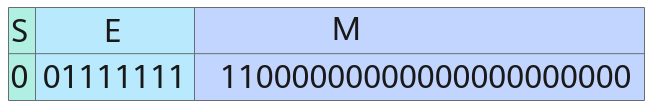
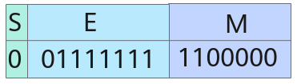
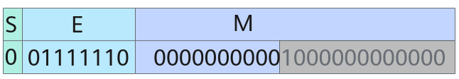
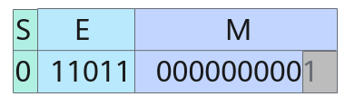

# Cast<a name="ZH-CN_TOPIC_0000001554785181"></a>

## AI处理器支持情况<a name="section1550532418810"></a>

<a name="table38301303189"></a>
<table><thead align="left"><tr id="row20831180131817"><th class="cellrowborder" valign="top" width="57.99999999999999%" id="mcps1.1.3.1.1"><p id="p1883113061818"><a name="p1883113061818"></a><a name="p1883113061818"></a><span id="ph20833205312295"><a name="ph20833205312295"></a><a name="ph20833205312295"></a>AI处理器类型</span></p>
</th>
<th class="cellrowborder" align="center" valign="top" width="42%" id="mcps1.1.3.1.2"><p id="p783113012187"><a name="p783113012187"></a><a name="p783113012187"></a>是否支持</p>
</th>
</tr>
</thead>
<tbody><tr id="row220181016240"><td class="cellrowborder" valign="top" width="57.99999999999999%" headers="mcps1.1.3.1.1 "><p id="p48327011813"><a name="p48327011813"></a><a name="p48327011813"></a><span id="ph583230201815"><a name="ph583230201815"></a><a name="ph583230201815"></a><term id="zh-cn_topic_0000001312391781_term1253731311225"><a name="zh-cn_topic_0000001312391781_term1253731311225"></a><a name="zh-cn_topic_0000001312391781_term1253731311225"></a>Ascend 910C</term></span></p>
</td>
<td class="cellrowborder" align="center" valign="top" width="42%" headers="mcps1.1.3.1.2 "><p id="p7948163910184"><a name="p7948163910184"></a><a name="p7948163910184"></a>√</p>
</td>
</tr>
<tr id="row173226882415"><td class="cellrowborder" valign="top" width="57.99999999999999%" headers="mcps1.1.3.1.1 "><p id="p14832120181815"><a name="p14832120181815"></a><a name="p14832120181815"></a><span id="ph1483216010188"><a name="ph1483216010188"></a><a name="ph1483216010188"></a><term id="zh-cn_topic_0000001312391781_term11962195213215"><a name="zh-cn_topic_0000001312391781_term11962195213215"></a><a name="zh-cn_topic_0000001312391781_term11962195213215"></a>Ascend 910B</term></span></p>
</td>
<td class="cellrowborder" align="center" valign="top" width="42%" headers="mcps1.1.3.1.2 "><p id="p19948143911820"><a name="p19948143911820"></a><a name="p19948143911820"></a>√</p>
</td>
</tr>
<tr id="row173226882415"><td class="cellrowborder" valign="top" width="57.99999999999999%" headers="mcps1.1.3.1.1 "><p id="p14832120181815"><a name="p14832120181815"></a><a name="p14832120181815"></a><span id="ph1483216010188"><a name="ph1483216010188"></a><a name="ph1483216010188"></a><term id="zh-cn_topic_0000001312391781_term11962195213215"><a name="zh-cn_topic_0000001312391781_term11962195213215"></a><a name="zh-cn_topic_0000001312391781_term11962195213215"></a>Kirin X90</term></span></p>
</td>
<td class="cellrowborder" align="center" valign="top" width="42%" headers="mcps1.1.3.1.2 "><p id="p19948143911820"><a name="p19948143911820"></a><a name="p19948143911820"></a>√</p>
</td>
</tr>
<tr id="row173226882415"><td class="cellrowborder" valign="top" width="57.99999999999999%" headers="mcps1.1.3.1.1 "><p id="p14832120181815"><a name="p14832120181815"></a><a name="p14832120181815"></a><span id="ph1483216010188"><a name="ph1483216010188"></a><a name="ph1483216010188"></a><term id="zh-cn_topic_0000001312391781_term11962195213215"><a name="zh-cn_topic_0000001312391781_term11962195213215"></a><a name="zh-cn_topic_0000001312391781_term11962195213215"></a>Kirin 9030</term></span></p>
</td>
<td class="cellrowborder" align="center" valign="top" width="42%" headers="mcps1.1.3.1.2 "><p id="p19948143911820"><a name="p19948143911820"></a><a name="p19948143911820"></a>√</p>
</td>
</tr>
</tbody>
</table>

## 功能说明<a name="section618mcpsimp"></a>

根据源操作数和目的操作数Tensor的数据类型进行精度转换。

在了解精度转换规则之前，需要先了解浮点数的表示方式和二进制的舍入规则：

-   浮点数的表示方式
    -   half共16bit，包括1bit符号位（S），5bit指数位（E）和10bit尾数位（M）。

        当E不全为0或不全为1时，表示的结果为：

        \(-1\)<sup>S</sup>  \* 2<sup>E - 15</sup>  \* \(1 + M\)

        当E全为0时，表示的结果为：

        \(-1\)<sup>S</sup>  \* 2<sup>-14</sup>  \* M

        当E全为1时，若M全为0，表示的结果为±inf（取决于符号位）；若M不全为0，表示的结果为nan。

        

        上图中S=0，E=15，M = 2<sup>-1</sup>  + 2<sup>-2</sup>，表示的结果为1.75。

    -   float共32bit，包括1bit符号位（S），8bit指数位（E）和23bit尾数位（M）。

        当E不全为0或不全为1时，表示的结果为：

        \(-1\)<sup>S</sup>  \* 2<sup>E - 127</sup>  \* \(1 + M\)

        当E全为0时，表示的结果为：

        \(-1\)<sup>S</sup>  \* 2<sup>-126</sup>  \* M

        当E全为1时，若M全为0，表示的结果为±inf（取决于符号位）；若M不全为0，表示的结果为nan。

        

        上图中S = 0，E = 127，M = 2<sup>-1</sup>  + 2<sup>-2</sup>，最终表示的结果为1.75 。

    -   bfloat16\_t共16bit，包括1bit符号位（S），8bit指数位（E）和7bit尾数位（M）。

        当E不全为0或不全为1时，表示的结果为：

        \(-1\)<sup>S</sup>  \* 2<sup>E - 127</sup>  \* \(1 + M\)

        当E全为0时，表示的结果为：

        \(-1\)<sup>S</sup>  \* 2<sup>-126</sup>  \* M

        当E全为1时，若M全为0，表示的结果为±inf（取决于符号位）；若M不全为0，表示的结果为nan。

        

        上图中S = 0，E = 127，M = 2<sup>-1</sup>  + 2<sup>-2</sup>，最终表示的结果为1.75。

-   二进制的舍入规则和十进制类似，具体如下：

    

    -   CAST\_RINT模式下，若待舍入部分的第一位为0，则不进位；若第一位为1且后续位不全为0，则进位；若第一位为1且后续位全为0，当M的最后一位为0则不进位，当M的最后一位为1则进位。

    -   CAST\_FLOOR模式下，若S为0，则不进位；若S为1，当待舍入部分全为0则不进位，否则，进位。
    -   CAST\_CEIL模式下，若S为1，则不进位；若S为0，当待舍入部分全为0则不进位；否则，进位。
    -   CAST\_ROUND模式下，若待舍入部分的第一位为0，则不进位；否则，进位。
    -   CAST\_TRUNC模式下，总是不进位。
    -   CAST\_ODD模式下，若待舍入部分全为0，则不进位；若待舍入部分不全为0，当M的最后一位为1则不进位，当M的最后一位为0则进位。

精度转换规则如下表所示（为方便描述下文描述中的src代表源操作数，dst代表目的操作数）：

**表 1**  精度转换规则

<a name="table235404962912"></a>
<table><thead align="left"><tr id="row935554942920"><th class="cellrowborder" valign="top" width="10.431043104310431%" id="mcps1.2.4.1.1"><p id="p13355144922911"><a name="p13355144922911"></a><a name="p13355144922911"></a>src类型</p>
</th>
<th class="cellrowborder" valign="top" width="10.46104610461046%" id="mcps1.2.4.1.2"><p id="p135514913299"><a name="p135514913299"></a><a name="p135514913299"></a>dst类型</p>
</th>
<th class="cellrowborder" valign="top" width="79.1079107910791%" id="mcps1.2.4.1.3"><p id="p7113121774314"><a name="p7113121774314"></a><a name="p7113121774314"></a>精度转换规则介绍</p>
</th>
</tr>
</thead>
<tbody><tr id="row3355849152915"><td class="cellrowborder" rowspan="6" align="left" valign="top" width="10.431043104310431%" headers="mcps1.2.4.1.1 "><p id="p9687163213521"><a name="p9687163213521"></a><a name="p9687163213521"></a>float</p>
</td>
<td class="cellrowborder" align="left" valign="top" width="10.46104610461046%" headers="mcps1.2.4.1.2 "><p id="p113551749202919"><a name="p113551749202919"></a><a name="p113551749202919"></a>float</p>
</td>
<td class="cellrowborder" valign="top" width="79.1079107910791%" headers="mcps1.2.4.1.3 "><p id="p6999183016349"><a name="p6999183016349"></a><a name="p6999183016349"></a>将src按照roundMode（精度转换处理模式，参见<a href="#section622mcpsimp">参数说明</a>中的roundMode参数）取整，仍以float格式存入dst中。</p>
<p id="p2023513251345"><a name="p2023513251345"></a><a name="p2023513251345"></a>示例：输入0.5，</p>
<p id="p1543914528509"><a name="p1543914528509"></a><a name="p1543914528509"></a>CAST_RINT模式输出0.0，CAST_FLOOR模式输出0.0，CAST_CEIL模式输出1.0，CAST_ROUND模式输出1.0，CAST_TRUNC模式输出0.0。</p>
</td>
</tr>
<tr id="row14355204919294"><td class="cellrowborder" align="left" valign="top" headers="mcps1.2.4.1.1 "><p id="p1935534915297"><a name="p1935534915297"></a><a name="p1935534915297"></a>half</p>
</td>
<td class="cellrowborder" valign="top" headers="mcps1.2.4.1.2 "><p id="p43071952153512"><a name="p43071952153512"></a><a name="p43071952153512"></a>将src按照roundMode取到half所能表示的数，以half格式（溢出默认按照饱和处理）存入dst中。</p>
<p id="p162319468358"><a name="p162319468358"></a><a name="p162319468358"></a>示例：输入0.5 + 2<sup id="sup69711611523"><a name="sup69711611523"></a><a name="sup69711611523"></a>-12</sup>，写成float的表示形式：2<sup id="sup61291556145210"><a name="sup61291556145210"></a><a name="sup61291556145210"></a>-1</sup> * (1 + 2<sup id="sup732521620210"><a name="sup732521620210"></a><a name="sup732521620210"></a>-11</sup>)，因此E = -1 + 127 = 126，M = 2<sup id="sup1315617330213"><a name="sup1315617330213"></a><a name="sup1315617330213"></a>-11。</sup></p>
<p id="p673417168511"><a name="p673417168511"></a><a name="p673417168511"></a><a name="image1952310171059"></a><a name="image1952310171059"></a><span></span></p>
<p id="p1862334619354"><a name="p1862334619354"></a><a name="p1862334619354"></a>half的指数位可以表示出2<sup id="sup156939018108"><a name="sup156939018108"></a><a name="sup156939018108"></a>-1</sup>，E = -1 + 15 = 14，但half只有10 bit尾数位，因此灰色部分要进行舍入。</p>
<p id="p1562314462353"><a name="p1562314462353"></a><a name="p1562314462353"></a>CAST_RINT模式舍入得尾数0000000000，E = 14，M = 0，最终表示的结果为0.5；</p>
<p id="p962374623520"><a name="p962374623520"></a><a name="p962374623520"></a>CAST_FLOOR模式舍入得尾数0000000000，E = 14，M = 0，最终表示的结果为0.5；</p>
<p id="p15623646153518"><a name="p15623646153518"></a><a name="p15623646153518"></a>CAST_CEIL模式舍入得尾数0000000001，E = 14，M = 2<sup id="sup897714261414"><a name="sup897714261414"></a><a name="sup897714261414"></a>-10</sup>，最终表示的结果为0.5 + 2<sup id="sup2460401919"><a name="sup2460401919"></a><a name="sup2460401919"></a>-11</sup>；</p>
<p id="p3623746173516"><a name="p3623746173516"></a><a name="p3623746173516"></a>CAST_ROUND模式舍入得尾数0000000001，E = 14，M = 2<sup id="sup51233291039"><a name="sup51233291039"></a><a name="sup51233291039"></a>-10</sup>，最终表示的结果为0.5 + 2<sup id="sup518915411539"><a name="sup518915411539"></a><a name="sup518915411539"></a>-11</sup>；</p>
<p id="p5623174673519"><a name="p5623174673519"></a><a name="p5623174673519"></a>CAST_TRUNC模式舍入得尾数0000000000，E = 14，M = 0，最终表示的结果为0.5；</p>
<p id="p18623184663515"><a name="p18623184663515"></a><a name="p18623184663515"></a>CAST_ODD模式舍入得尾数0000000001，E = 14，M = 2<sup id="sup135246541"><a name="sup135246541"></a><a name="sup135246541"></a>-10</sup>，最终表示的结果为0.5 + 2<sup id="sup389919164419"><a name="sup389919164419"></a><a name="sup389919164419"></a>-11</sup> 。</p>
</td>
</tr>
<tr id="row7394104235320"><td class="cellrowborder" align="left" valign="top" headers="mcps1.2.4.1.1 "><p id="p103941542205314"><a name="p103941542205314"></a><a name="p103941542205314"></a>int64_t</p>
</td>
<td class="cellrowborder" valign="top" headers="mcps1.2.4.1.2 "><p id="p5992104645711"><a name="p5992104645711"></a><a name="p5992104645711"></a>将src按照roundMode取整，以int64_t格式（溢出默认按照饱和处理）存入dst中。</p>
<p id="p197626427574"><a name="p197626427574"></a><a name="p197626427574"></a>示例：输入2<sup id="sup9635352887"><a name="sup9635352887"></a><a name="sup9635352887"></a>22</sup> + 0.5，</p>
<p id="p9762134215714"><a name="p9762134215714"></a><a name="p9762134215714"></a>CAST_RINT模式输出2<sup id="sup2129612141616"><a name="sup2129612141616"></a><a name="sup2129612141616"></a>22</sup>，CAST_FLOOR模式输出2<sup id="sup1077211374169"><a name="sup1077211374169"></a><a name="sup1077211374169"></a>22</sup>，CAST_CEIL模式输出2<sup id="sup1797365810166"><a name="sup1797365810166"></a><a name="sup1797365810166"></a>22</sup> + 1，CAST_ROUND模式输出2<sup id="sup67489377179"><a name="sup67489377179"></a><a name="sup67489377179"></a>22</sup> + 1，CAST_TRUNC模式输出2<sup id="sup17685121615182"><a name="sup17685121615182"></a><a name="sup17685121615182"></a>22</sup>。</p>
</td>
</tr>
<tr id="row127281637573"><td class="cellrowborder" align="left" valign="top" headers="mcps1.2.4.1.1 "><p id="p1972843105717"><a name="p1972843105717"></a><a name="p1972843105717"></a>int32_t</p>
</td>
<td class="cellrowborder" valign="top" headers="mcps1.2.4.1.2 "><p id="p1644991984013"><a name="p1644991984013"></a><a name="p1644991984013"></a>将src按照roundMode取整，以int32_t格式（溢出默认按照饱和处理）存入dst中。</p>
<p id="p336661414407"><a name="p336661414407"></a><a name="p336661414407"></a>示例：输入2<sup id="sup107091910191917"><a name="sup107091910191917"></a><a name="sup107091910191917"></a>22 </sup> + 0.5，</p>
<p id="p0366914184010"><a name="p0366914184010"></a><a name="p0366914184010"></a>CAST_RINT模式输出2<sup id="sup646984014195"><a name="sup646984014195"></a><a name="sup646984014195"></a>22</sup>，CAST_FLOOR模式输出2<sup id="sup969555315201"><a name="sup969555315201"></a><a name="sup969555315201"></a>22</sup> ，CAST_CEIL模式输出2<sup id="sup942324412117"><a name="sup942324412117"></a><a name="sup942324412117"></a>22</sup> + 1，CAST_ROUND模式输出2<sup id="sup189201223132217"><a name="sup189201223132217"></a><a name="sup189201223132217"></a>22</sup> + 1，CAST_TRUNC模式输出2<sup id="sup104451415132319"><a name="sup104451415132319"></a><a name="sup104451415132319"></a>22</sup>。</p>
</td>
</tr>
<tr id="row178573216486"><td class="cellrowborder" align="left" valign="top" headers="mcps1.2.4.1.1 "><p id="p1778516322487"><a name="p1778516322487"></a><a name="p1778516322487"></a>int16_t</p>
</td>
<td class="cellrowborder" valign="top" headers="mcps1.2.4.1.2 "><p id="p17489160174910"><a name="p17489160174910"></a><a name="p17489160174910"></a>将src按照roundMode取整，以int16_t格式（溢出默认按照饱和处理）存入dst中。</p>
<p id="p17904115784820"><a name="p17904115784820"></a><a name="p17904115784820"></a>示例：输入2<sup id="sup1777114542316"><a name="sup1777114542316"></a><a name="sup1777114542316"></a>22</sup> + 0.5，</p>
<p id="p149041357194813"><a name="p149041357194813"></a><a name="p149041357194813"></a>CAST_RINT模式输出2<sup id="sup997595662418"><a name="sup997595662418"></a><a name="sup997595662418"></a>15</sup> - 1（溢出处理），CAST_FLOOR模式输出2<sup id="sup11919141717255"><a name="sup11919141717255"></a><a name="sup11919141717255"></a>15</sup> - 1（溢出处理），CAST_CEIL模式输出2<sup id="sup121521540132519"><a name="sup121521540132519"></a><a name="sup121521540132519"></a>15</sup> - 1（溢出处理），CAST_ROUND模式输出2<sup id="sup2082373312610"><a name="sup2082373312610"></a><a name="sup2082373312610"></a>15</sup> - 1（溢出处理），CAST_TRUNC模式输出2<sup id="sup15439589268"><a name="sup15439589268"></a><a name="sup15439589268"></a>15</sup> - 1（溢出处理）。</p>
</td>
</tr>
<tr id="row494010912450"><td class="cellrowborder" valign="top" headers="mcps1.2.4.1.1 "><p id="p1694010974510"><a name="p1694010974510"></a><a name="p1694010974510"></a>bfloat16_t</p>
</td>
<td class="cellrowborder" valign="top" headers="mcps1.2.4.1.2 "><p id="p32441413463"><a name="p32441413463"></a><a name="p32441413463"></a>将src按照roundMode取到bfloat16_t所能表示的数，以bfloat16_t格式（溢出默认按照饱和处理）存入dst中。</p>
<p id="p471962154618"><a name="p471962154618"></a><a name="p471962154618"></a>示例：输入0.5+ 2<sup id="sup374112013460"><a name="sup374112013460"></a><a name="sup374112013460"></a>-9</sup> + 2<sup id="sup3741190204611"><a name="sup3741190204611"></a><a name="sup3741190204611"></a>-11</sup> ，写成float的表示形式：2<sup id="sup17741110104616"><a name="sup17741110104616"></a><a name="sup17741110104616"></a>-1</sup> * (1 + 2<sup id="sup2074170114612"><a name="sup2074170114612"></a><a name="sup2074170114612"></a>-8</sup> + 2<sup id="sup27413094618"><a name="sup27413094618"></a><a name="sup27413094618"></a>-10</sup>)，因此E = -1 + 127 = 126，M = 2<sup id="sup87411054619"><a name="sup87411054619"></a><a name="sup87411054619"></a>-8</sup> + 2<sup id="sup107417094616"><a name="sup107417094616"></a><a name="sup107417094616"></a>-10</sup> 。</p>
<p id="p143031654144710"><a name="p143031654144710"></a><a name="p143031654144710"></a><a name="image4303185416478"></a><a name="image4303185416478"></a><span></span></p>
<p id="p1666754012468"><a name="p1666754012468"></a><a name="p1666754012468"></a>bfloat16_t的指数位位数和float的相同，有E = 126，但bfloat16_t只有7bit尾数位，因此灰色部分要进行舍入。</p>
<p id="p1388819433467"><a name="p1388819433467"></a><a name="p1388819433467"></a>CAST_RINT模式舍入得尾数0000001，E = 126，M = 2<sup id="sup274212064611"><a name="sup274212064611"></a><a name="sup274212064611"></a>-7</sup>，最终表示的结果为0.5 + 2<sup id="sup20742100204612"><a name="sup20742100204612"></a><a name="sup20742100204612"></a>-8</sup>；</p>
<p id="p523514453460"><a name="p523514453460"></a><a name="p523514453460"></a>CAST_FLOOR模式舍入得尾数0000000，E = 126，M = 0，最终表示的结果为0.5；</p>
<p id="p17614194619461"><a name="p17614194619461"></a><a name="p17614194619461"></a>CAST_CEIL模式舍入得尾数0000001，E = 126，M = 2<sup id="sup374217010465"><a name="sup374217010465"></a><a name="sup374217010465"></a>-7</sup>，最终表示的结果为0.5 + 2<sup id="sup3742110144610"><a name="sup3742110144610"></a><a name="sup3742110144610"></a>-8</sup>；</p>
<p id="p66851549174612"><a name="p66851549174612"></a><a name="p66851549174612"></a>CAST_ROUND模式舍入得尾数0000001，E = 126，M = 2<sup id="sup674215014468"><a name="sup674215014468"></a><a name="sup674215014468"></a>-7</sup>，最终表示的结果为0.5 + 2<sup id="sup117421406462"><a name="sup117421406462"></a><a name="sup117421406462"></a>-8</sup>；</p>
<p id="p29409920456"><a name="p29409920456"></a><a name="p29409920456"></a>CAST_TRUNC模式舍入得尾数0000000，E = 126，M = 0，最终表示的结果为0.5。</p>
</td>
</tr>
<tr id="row126837164286"><td class="cellrowborder" rowspan="6" valign="top" width="10.431043104310431%" headers="mcps1.2.4.1.1 "><p id="p5117735302"><a name="p5117735302"></a><a name="p5117735302"></a>half</p>
</td>
<td class="cellrowborder" valign="top" width="10.46104610461046%" headers="mcps1.2.4.1.2 "><p id="p56831016192812"><a name="p56831016192812"></a><a name="p56831016192812"></a>float</p>
</td>
<td class="cellrowborder" valign="top" width="79.1079107910791%" headers="mcps1.2.4.1.3 "><p id="p7616217173110"><a name="p7616217173110"></a><a name="p7616217173110"></a>将src以float格式存入dst中，不存在精度转换问题，无舍入模式。</p>
<p id="p17414713163117"><a name="p17414713163117"></a><a name="p17414713163117"></a>示例：输入1.5 - 2<sup id="sup8513173315319"><a name="sup8513173315319"></a><a name="sup8513173315319"></a>-10</sup>，输出1.5 - 2<sup id="sup1898194612314"><a name="sup1898194612314"></a><a name="sup1898194612314"></a>-10</sup>。</p>
</td>
</tr>
<tr id="row13100102112812"><td class="cellrowborder" valign="top" headers="mcps1.2.4.1.1 "><p id="p13101122102818"><a name="p13101122102818"></a><a name="p13101122102818"></a>int32_t</p>
</td>
<td class="cellrowborder" valign="top" headers="mcps1.2.4.1.2 "><p id="p6430013183210"><a name="p6430013183210"></a><a name="p6430013183210"></a>将src按照roundMode取整，以int32_t格式存入dst中。</p>
<p id="p26845910325"><a name="p26845910325"></a><a name="p26845910325"></a>示例：输入-1.5，</p>
<p id="p1968413919321"><a name="p1968413919321"></a><a name="p1968413919321"></a>CAST_RINT模式输出-2，CAST_FLOOR模式输出-2，CAST_CEIL模式输出-1，CAST_ROUND模式输出-2，CAST_TRUNC模式输出-1。</p>
</td>
</tr>
<tr id="row147081324102816"><td class="cellrowborder" valign="top" headers="mcps1.2.4.1.1 "><p id="p1570912415289"><a name="p1570912415289"></a><a name="p1570912415289"></a>int16_t</p>
</td>
<td class="cellrowborder" valign="top" headers="mcps1.2.4.1.2 "><p id="p318838153418"><a name="p318838153418"></a><a name="p318838153418"></a>将src按照roundMode取整，以int16_t格式（溢出默认按照饱和处理）存入dst中。</p>
<p id="p119315133414"><a name="p119315133414"></a><a name="p119315133414"></a>示例：输入2<sup id="sup1872532420340"><a name="sup1872532420340"></a><a name="sup1872532420340"></a>7</sup> - 0.5，</p>
<p id="p1393115173412"><a name="p1393115173412"></a><a name="p1393115173412"></a>CAST_RINT模式输出2<sup id="sup1719684453410"><a name="sup1719684453410"></a><a name="sup1719684453410"></a>7</sup>，CAST_FLOOR模式输出2<sup id="sup6293101012368"><a name="sup6293101012368"></a><a name="sup6293101012368"></a>7</sup> - 1，CAST_CEIL模式输出2<sup id="sup10950112913617"><a name="sup10950112913617"></a><a name="sup10950112913617"></a>7</sup>，CAST_ROUND模式输出2<sup id="sup067711568368"><a name="sup067711568368"></a><a name="sup067711568368"></a>7</sup>，CAST_TRUNC模式输出2<sup id="sup115261319113716"><a name="sup115261319113716"></a><a name="sup115261319113716"></a>7</sup> - 1。</p>
</td>
</tr>
<tr id="row1719894510296"><td class="cellrowborder" valign="top" headers="mcps1.2.4.1.1 "><p id="p819834582915"><a name="p819834582915"></a><a name="p819834582915"></a>int8_t</p>
</td>
<td class="cellrowborder" valign="top" headers="mcps1.2.4.1.2 "><p id="p125571958113816"><a name="p125571958113816"></a><a name="p125571958113816"></a>将src按照roundMode取整，以int8_t格式（溢出默认按照饱和处理）存入dst中。</p>
<p id="p495635313811"><a name="p495635313811"></a><a name="p495635313811"></a>示例：输入2<sup id="sup795091043917"><a name="sup795091043917"></a><a name="sup795091043917"></a>7</sup> - 0.5，</p>
<p id="p16956553113810"><a name="p16956553113810"></a><a name="p16956553113810"></a>CAST_RINT模式输出2<sup id="sup1715172815397"><a name="sup1715172815397"></a><a name="sup1715172815397"></a>7</sup> - 1（溢出处理），CAST_FLOOR模式输出2<sup id="sup1620734511399"><a name="sup1620734511399"></a><a name="sup1620734511399"></a>7</sup> - 1，CAST_CEIL模式输出2<sup id="sup156381614403"><a name="sup156381614403"></a><a name="sup156381614403"></a>7</sup> - 1（溢出处理），CAST_ROUND模式输出2<sup id="sup167271828164019"><a name="sup167271828164019"></a><a name="sup167271828164019"></a>7</sup> - 1（溢出处理），CAST_TRUNC模式输出2<sup id="sup1841514480404"><a name="sup1841514480404"></a><a name="sup1841514480404"></a>7</sup> - 1。</p>
</td>
</tr>
<tr id="row393435592914"><td class="cellrowborder" valign="top" headers="mcps1.2.4.1.1 "><p id="p9934855112913"><a name="p9934855112913"></a><a name="p9934855112913"></a>uint8_t</p>
</td>
<td class="cellrowborder" valign="top" headers="mcps1.2.4.1.2 "><p id="p92056654211"><a name="p92056654211"></a><a name="p92056654211"></a>将src按照roundMode取整，以uint8_t格式（溢出默认按照饱和处理）存入dst中。</p>
<p id="p183531235417"><a name="p183531235417"></a><a name="p183531235417"></a>负数输入会被视为异常。</p>
<p id="p989516320426"><a name="p989516320426"></a><a name="p989516320426"></a>示例：输入1.75，</p>
<p id="p20895163184210"><a name="p20895163184210"></a><a name="p20895163184210"></a>CAST_RINT模式输出2，CAST_FLOOR模式输出1，CAST_CEIL模式输出2，CAST_ROUND模式输出2，CAST_TRUNC模式输出1。</p>
</td>
</tr>
<tr id="row1961614418139"><td class="cellrowborder" valign="top" headers="mcps1.2.4.1.1 "><p id="p961694171312"><a name="p961694171312"></a><a name="p961694171312"></a>int4b_t</p>
</td>
<td class="cellrowborder" valign="top" headers="mcps1.2.4.1.2 "><p id="p111803722615"><a name="p111803722615"></a><a name="p111803722615"></a>将src按照roundMode取整，以int4b_t格式（溢出默认按照饱和处理）存入dst中。</p>
<p id="p51853713268"><a name="p51853713268"></a><a name="p51853713268"></a>示例：输入1.5，</p>
<p id="p12185373262"><a name="p12185373262"></a><a name="p12185373262"></a>CAST_RINT模式输出2，CAST_FLOOR模式输出1，CAST_CEIL模式输出2，CAST_ROUND模式输出2，CAST_TRUNC模式输出1。</p>
</td>
</tr>
<tr id="row119737190554"><td class="cellrowborder" rowspan="2" valign="top" width="10.431043104310431%" headers="mcps1.2.4.1.1 "><p id="p286217619548"><a name="p286217619548"></a><a name="p286217619548"></a>bfloat16_t</p>
</td>
<td class="cellrowborder" valign="top" width="10.46104610461046%" headers="mcps1.2.4.1.2 "><p id="p29741519115513"><a name="p29741519115513"></a><a name="p29741519115513"></a>float</p>
</td>
<td class="cellrowborder" valign="top" width="79.1079107910791%" headers="mcps1.2.4.1.3 "><p id="p11318125312559"><a name="p11318125312559"></a><a name="p11318125312559"></a>将src以float格式存入dst中，不存在精度转换问题，无舍入模式。</p>
<p id="p6318135313558"><a name="p6318135313558"></a><a name="p6318135313558"></a>示例：输入1.5 - 2<sup id="sup331895312552"><a name="sup331895312552"></a><a name="sup331895312552"></a>-6</sup>，输出1.5 - 2<sup id="sup173181253165513"><a name="sup173181253165513"></a><a name="sup173181253165513"></a>-6</sup>。</p>
</td>
</tr>
<tr id="row12862146125415"><td class="cellrowborder" valign="top" headers="mcps1.2.4.1.1 "><p id="p16862366549"><a name="p16862366549"></a><a name="p16862366549"></a>int32_t</p>
</td>
<td class="cellrowborder" valign="top" headers="mcps1.2.4.1.2 "><p id="p17862466541"><a name="p17862466541"></a><a name="p17862466541"></a>将src按照roundMode取整，以int32_t格式（溢出默认按照饱和处理）存入dst中。</p>
<p id="p204322058185418"><a name="p204322058185418"></a><a name="p204322058185418"></a>示例：输入2<sup id="sup5432175855410"><a name="sup5432175855410"></a><a name="sup5432175855410"></a>6&nbsp;</sup>+ 0.5</p>
<p id="p15432558115412"><a name="p15432558115412"></a><a name="p15432558115412"></a>CAST_RINT模式输出2<sup id="sup3432558115411"><a name="sup3432558115411"></a><a name="sup3432558115411"></a>6</sup>，CAST_FLOOR模式输出2<sup id="sup443285815414"><a name="sup443285815414"></a><a name="sup443285815414"></a>6</sup> ，CAST_CEIL模式输出2<sup id="sup18432195895416"><a name="sup18432195895416"></a><a name="sup18432195895416"></a>6</sup> + 1，CAST_ROUND模式输出2<sup id="sup7432558205416"><a name="sup7432558205416"></a><a name="sup7432558205416"></a>6 </sup>+ 1，CAST_TRUNC模式输出2<sup id="sup1243285875414"><a name="sup1243285875414"></a><a name="sup1243285875414"></a>6</sup>。</p>
</td>
</tr>
<tr id="row125091169442"><td class="cellrowborder" valign="top" width="10.431043104310431%" headers="mcps1.2.4.1.1 "><p id="p8509616174411"><a name="p8509616174411"></a><a name="p8509616174411"></a>uint8_t</p>
<p id="p3782172533314"><a name="p3782172533314"></a><a name="p3782172533314"></a></p>
</td>
<td class="cellrowborder" valign="top" width="10.46104610461046%" headers="mcps1.2.4.1.2 "><p id="p115091167442"><a name="p115091167442"></a><a name="p115091167442"></a>half</p>
</td>
<td class="cellrowborder" valign="top" width="79.1079107910791%" headers="mcps1.2.4.1.3 "><p id="p66001459184518"><a name="p66001459184518"></a><a name="p66001459184518"></a>将src以half格式存入dst中，不存在精度转换问题，无舍入模式。</p>
<p id="p84001657174512"><a name="p84001657174512"></a><a name="p84001657174512"></a>示例：输入1，输出1.0。</p>
</td>
</tr>
<tr id="row75193574612"><td class="cellrowborder" valign="top" width="10.431043104310431%" headers="mcps1.2.4.1.1 "><p id="p351985174613"><a name="p351985174613"></a><a name="p351985174613"></a>int8_t</p>
</td>
<td class="cellrowborder" valign="top" width="10.46104610461046%" headers="mcps1.2.4.1.2 "><p id="p1451935194620"><a name="p1451935194620"></a><a name="p1451935194620"></a>half</p>
</td>
<td class="cellrowborder" valign="top" width="79.1079107910791%" headers="mcps1.2.4.1.3 "><p id="p7140192014521"><a name="p7140192014521"></a><a name="p7140192014521"></a>将src以half格式存入dst中，不存在精度转换问题，无舍入模式。</p>
<p id="p4618040113011"><a name="p4618040113011"></a><a name="p4618040113011"></a>示例：输入-1，输出-1.0。</p>
</td>
</tr>
<tr id="row77907597515"><td class="cellrowborder" rowspan="2" valign="top" width="10.431043104310431%" headers="mcps1.2.4.1.1 "><p id="p8515163665216"><a name="p8515163665216"></a><a name="p8515163665216"></a>int16_t</p>
</td>
<td class="cellrowborder" valign="top" width="10.46104610461046%" headers="mcps1.2.4.1.2 "><p id="p12790165915516"><a name="p12790165915516"></a><a name="p12790165915516"></a>half</p>
</td>
<td class="cellrowborder" valign="top" width="79.1079107910791%" headers="mcps1.2.4.1.3 "><p id="p125201712145516"><a name="p125201712145516"></a><a name="p125201712145516"></a>将src按照roundMode取到half所能表示的数，以half格式存入dst中。</p>
<p id="p444515755515"><a name="p444515755515"></a><a name="p444515755515"></a>示例：输入2<sup id="sup49961326125511"><a name="sup49961326125511"></a><a name="sup49961326125511"></a>12</sup> + 2，写成half的表示形式：2<sup id="sup7672537205516"><a name="sup7672537205516"></a><a name="sup7672537205516"></a>12</sup> * (1 + 2<sup id="sup818555811559"><a name="sup818555811559"></a><a name="sup818555811559"></a>-11</sup>)，要求E = 12 + 15 = 27，M = 2<sup id="sup144541154565"><a name="sup144541154565"></a><a name="sup144541154565"></a>-11</sup>：</p>
<p id="p34593020244"><a name="p34593020244"></a><a name="p34593020244"></a><a name="image25231243174110"></a><a name="image25231243174110"></a><span></span></p>
<p id="p10445117165520"><a name="p10445117165520"></a><a name="p10445117165520"></a>由于half只有10bit尾数位，因此灰色部分要进行舍入。</p>
<p id="p1544518712559"><a name="p1544518712559"></a><a name="p1544518712559"></a>CAST_RINT模式舍入得尾数0000000000，E = 27，M = 0，最终表示的结果为2<sup id="sup23122675613"><a name="sup23122675613"></a><a name="sup23122675613"></a>12</sup>；</p>
<p id="p1544518715520"><a name="p1544518715520"></a><a name="p1544518715520"></a>CAST_FLOOR模式舍入得尾数0000000000，E = 27，M = 0，最终表示的结果为2<sup id="sup61994343564"><a name="sup61994343564"></a><a name="sup61994343564"></a>12</sup>；</p>
<p id="p444515719558"><a name="p444515719558"></a><a name="p444515719558"></a>CAST_CEIL模式舍入得尾数0000000001，E = 27，M = 2<sup id="sup1454462525718"><a name="sup1454462525718"></a><a name="sup1454462525718"></a>-10</sup>，最终表示的结果为2<sup id="sup1364784245620"><a name="sup1364784245620"></a><a name="sup1364784245620"></a>12</sup> + 4；</p>
<p id="p114456775520"><a name="p114456775520"></a><a name="p114456775520"></a>CAST_ROUND模式舍入得尾数0000000001，E = 27，M = 2<sup id="sup1747161015579"><a name="sup1747161015579"></a><a name="sup1747161015579"></a>-10</sup>，最终表示的结果为2<sup id="sup16630248205618"><a name="sup16630248205618"></a><a name="sup16630248205618"></a>12 </sup>+ 4；</p>
<p id="p344515775519"><a name="p344515775519"></a><a name="p344515775519"></a>CAST_TRUNC模式舍入得尾数0000000000，E = 27，M = 0，最终表示的结果为2<sup id="sup10718135665616"><a name="sup10718135665616"></a><a name="sup10718135665616"></a>12</sup>。</p>
</td>
</tr>
<tr id="row15989522185211"><td class="cellrowborder" valign="top" headers="mcps1.2.4.1.1 "><p id="p19897222527"><a name="p19897222527"></a><a name="p19897222527"></a>float</p>
</td>
<td class="cellrowborder" valign="top" headers="mcps1.2.4.1.2 "><p id="p2316357105916"><a name="p2316357105916"></a><a name="p2316357105916"></a>将src以float格式存入dst中，不存在精度转换问题，无舍入模式。</p>
<p id="p1236535035912"><a name="p1236535035912"></a><a name="p1236535035912"></a>示例：输入2<sup id="sup6183551106"><a name="sup6183551106"></a><a name="sup6183551106"></a>15</sup> - 1，输出2<sup id="sup126081317"><a name="sup126081317"></a><a name="sup126081317"></a>15</sup> - 1。</p>
</td>
</tr>
<tr id="row15991928133511"><td class="cellrowborder" rowspan="4" valign="top" width="10.431043104310431%" headers="mcps1.2.4.1.1 "><p id="p83201943133513"><a name="p83201943133513"></a><a name="p83201943133513"></a>int32_t</p>
</td>
<td class="cellrowborder" valign="top" width="10.46104610461046%" headers="mcps1.2.4.1.2 "><p id="p19100132843510"><a name="p19100132843510"></a><a name="p19100132843510"></a>float</p>
</td>
<td class="cellrowborder" valign="top" width="79.1079107910791%" headers="mcps1.2.4.1.3 "><p id="p19695047163718"><a name="p19695047163718"></a><a name="p19695047163718"></a>将src按照roundMode取到float所能表示的数，以float格式存入dst中。</p>
<p id="p1997114011372"><a name="p1997114011372"></a><a name="p1997114011372"></a>示例：输入2<sup id="sup69714407371"><a name="sup69714407371"></a><a name="sup69714407371"></a>25</sup> + 3，写成float的表示形式：2<sup id="sup1294995610373"><a name="sup1294995610373"></a><a name="sup1294995610373"></a>25</sup> * (1 + 2<sup id="sup1334610153816"><a name="sup1334610153816"></a><a name="sup1334610153816"></a>-24</sup> + 2<sup id="sup273410198386"><a name="sup273410198386"></a><a name="sup273410198386"></a>-25</sup>)，要求E = 25 + 127 = 152，   M = 2<sup id="sup9565173015402"><a name="sup9565173015402"></a><a name="sup9565173015402"></a>-24</sup> + 2<sup id="sup760021704012"><a name="sup760021704012"></a><a name="sup760021704012"></a>-25。</sup></p>
<p id="p51981334183318"><a name="p51981334183318"></a><a name="p51981334183318"></a><a name="image292993463310"></a><a name="image292993463310"></a><span></span></p>
<p id="p397214015374"><a name="p397214015374"></a><a name="p397214015374"></a>由于float只有23bit尾数位，因此灰色部分要进行舍入。</p>
<p id="p18972104083713"><a name="p18972104083713"></a><a name="p18972104083713"></a>CAST_RINT模式舍入得尾数00000000000000000000001，E = 152，M = 2<sup id="sup13448105444217"><a name="sup13448105444217"></a><a name="sup13448105444217"></a>-23</sup>，最终表示的结果为2<sup id="sup284820194314"><a name="sup284820194314"></a><a name="sup284820194314"></a>25</sup> + 4；</p>
<p id="p49721840143717"><a name="p49721840143717"></a><a name="p49721840143717"></a>CAST_FLOOR模式舍入得尾数00000000000000000000000，E = 152，M = 0，最终表示的结果为2<sup id="sup072718128436"><a name="sup072718128436"></a><a name="sup072718128436"></a>25</sup>；</p>
<p id="p199729409376"><a name="p199729409376"></a><a name="p199729409376"></a>CAST_CEIL模式舍入得尾数00000000000000000000001，E = 152，M = 2<sup id="sup635212247437"><a name="sup635212247437"></a><a name="sup635212247437"></a>-23</sup>，最终表示的结果为2<sup id="sup1038512302435"><a name="sup1038512302435"></a><a name="sup1038512302435"></a>25 </sup>+ 4；</p>
<p id="p49721140203720"><a name="p49721140203720"></a><a name="p49721140203720"></a>CAST_ROUND模式舍入得尾数00000000000000000000001，E = 152，M = 2<sup id="sup1133994716435"><a name="sup1133994716435"></a><a name="sup1133994716435"></a>-23</sup>，最终表示的结果为2<sup id="sup41230524447"><a name="sup41230524447"></a><a name="sup41230524447"></a>25</sup> + 4；</p>
<p id="p159721040193714"><a name="p159721040193714"></a><a name="p159721040193714"></a>CAST_TRUNC模式舍入得尾数00000000000000000000000，E = 152，M = 0，最终表示的结果为2<sup id="sup13948634453"><a name="sup13948634453"></a><a name="sup13948634453"></a>25</sup> 。</p>
</td>
</tr>
<tr id="row531412311355"><td class="cellrowborder" valign="top" headers="mcps1.2.4.1.1 "><p id="p12176114745517"><a name="p12176114745517"></a><a name="p12176114745517"></a>int64_t</p>
</td>
<td class="cellrowborder" valign="top" headers="mcps1.2.4.1.2 "><p id="p1953175495614"><a name="p1953175495614"></a><a name="p1953175495614"></a>将src以int64_t格式存入dst中，不存在精度转换问题，无舍入模式。</p>
<p id="p292254115564"><a name="p292254115564"></a><a name="p292254115564"></a>示例：输入2<sup id="sup636818184578"><a name="sup636818184578"></a><a name="sup636818184578"></a>31</sup> - 1，输出2<sup id="sup51808519575"><a name="sup51808519575"></a><a name="sup51808519575"></a>31</sup> - 1。</p>
</td>
</tr>
<tr id="row28601333133511"><td class="cellrowborder" valign="top" headers="mcps1.2.4.1.1 "><p id="p1086011335356"><a name="p1086011335356"></a><a name="p1086011335356"></a>int16_t</p>
</td>
<td class="cellrowborder" valign="top" headers="mcps1.2.4.1.2 "><p id="p27661913588"><a name="p27661913588"></a><a name="p27661913588"></a>将src以int16_t格式（溢出默认按照饱和处理）存入dst中，不存在精度转换问题，无舍入模式。</p>
<p id="p14807195145812"><a name="p14807195145812"></a><a name="p14807195145812"></a>示例：输入2<sup id="sup1890394155817"><a name="sup1890394155817"></a><a name="sup1890394155817"></a>31</sup> - 1，输出2<sup id="sup2911124916585"><a name="sup2911124916585"></a><a name="sup2911124916585"></a>15</sup> - 1。</p>
</td>
</tr>
<tr id="row196317472242"><td class="cellrowborder" valign="top" headers="mcps1.2.4.1.1 "><p id="p10631174742410"><a name="p10631174742410"></a><a name="p10631174742410"></a>half</p>
</td>
<td class="cellrowborder" valign="top" headers="mcps1.2.4.1.2 "><p id="p0586519182516"><a name="p0586519182516"></a><a name="p0586519182516"></a>与<a href="SetDeqScale.md">SetDeqScale(half scale)</a>接口配合使用，输出src / 2<sup id="sup1655219427288"><a name="sup1655219427288"></a><a name="sup1655219427288"></a>17</sup> * scale * 2<sup id="sup1057615072914"><a name="sup1057615072914"></a><a name="sup1057615072914"></a>17</sup>。</p>
</td>
</tr>
</tbody>
</table>

## 函数原型<a name="section620mcpsimp"></a>

-   tensor前n个数据计算

    ```
    template <typename T, typename U>
    __aicore__ inline void Cast(const LocalTensor<T>& dst, const LocalTensor<U>& src, const RoundMode& roundMode, const uint32_t count)
    ```

-   tensor高维切分计算
    -   mask逐bit模式

        ```
        template <typename T, typename U, bool isSetMask = true>
        __aicore__ inline void Cast(const LocalTensor<T>& dst, const LocalTensor<U>& src, const RoundMode& roundMode, const uint64_t mask[], const uint8_t repeatTime, const UnaryRepeatParams& repeatParams)
        ```

    -   mask连续模式

        ```
        template <typename T, typename U, bool isSetMask = true>
        __aicore__ inline void Cast(const LocalTensor<T>& dst, const LocalTensor<U>& src, const RoundMode& roundMode, const uint64_t mask, const uint8_t repeatTime, const UnaryRepeatParams& repeatParams)
        ```

## 参数说明<a name="section622mcpsimp"></a>

**表 2**  模板参数说明

<a name="table4835205712588"></a>
<table><thead align="left"><tr id="row118356578583"><th class="cellrowborder" valign="top" width="16.35%" id="mcps1.2.3.1.1"><p id="p48354572582"><a name="p48354572582"></a><a name="p48354572582"></a>参数名</p>
</th>
<th class="cellrowborder" valign="top" width="83.65%" id="mcps1.2.3.1.2"><p id="p583535795817"><a name="p583535795817"></a><a name="p583535795817"></a>描述</p>
</th>
</tr>
</thead>
<tbody><tr id="row11492616168"><td class="cellrowborder" valign="top" width="16.35%" headers="mcps1.2.3.1.1 "><p id="p19933113132715"><a name="p19933113132715"></a><a name="p19933113132715"></a>T</p>
</td>
<td class="cellrowborder" valign="top" width="83.65%" headers="mcps1.2.3.1.2 "><p id="p593343122716"><a name="p593343122716"></a><a name="p593343122716"></a>目的操作数数据类型。</p>
<p id="p16800185694616"><a name="p16800185694616"></a><a name="p16800185694616"></a><span id="ph16239174011416"><a name="ph16239174011416"></a><a name="ph16239174011416"></a><term id="zh-cn_topic_0000001312391781_term1253731311225_1"><a name="zh-cn_topic_0000001312391781_term1253731311225_1"></a><a name="zh-cn_topic_0000001312391781_term1253731311225_1"></a>Ascend 910C</term></span>，支持的数据类型见<a href="#table52491124113511">表5</a></p>
<p id="p10310225113513"><a name="p10310225113513"></a><a name="p10310225113513"></a><span id="ph16310192543516"><a name="ph16310192543516"></a><a name="ph16310192543516"></a><term id="zh-cn_topic_0000001312391781_term11962195213215_1"><a name="zh-cn_topic_0000001312391781_term11962195213215_1"></a><a name="zh-cn_topic_0000001312391781_term11962195213215_1"></a>Ascend 910B</term></span>，支持的数据类型见<a href="#table588610209212">表4</a></p>
<p id="p16800185694616"><a name="p16800185694616"></a><a name="p16800185694616"></a><span id="ph16239174011416"><a name="ph16239174011416"></a><a name="ph16239174011416"></a><term id="zh-cn_topic_0000001312391781_term1253731311225_1"><a name="zh-cn_topic_0000001312391781_term1253731311225_1"></a><a name="zh-cn_topic_0000001312391781_term1253731311225_1"></a>Kirin X90</term></span>，支持的数据类型见<a href="#table52491124113519">表6</a></p>
<p id="p10310225113513"><a name="p10310225113513"></a><a name="p10310225113513"></a><span id="ph16310192543516"><a name="ph16310192543516"></a><a name="ph16310192543516"></a><term id="zh-cn_topic_0000001312391781_term11962195213215_1"><a name="zh-cn_topic_0000001312391781_term11962195213215_1"></a><a name="zh-cn_topic_0000001312391781_term11962195213215_1"></a>Kirin 9030</term></span>，支持的数据类型见<a href="#table52491124113519">表6</a></p>
</td>
</tr>
<tr id="row1835857145817"><td class="cellrowborder" valign="top" width="16.35%" headers="mcps1.2.3.1.1 "><p id="p5979215341"><a name="p5979215341"></a><a name="p5979215341"></a>U</p>
</td>
<td class="cellrowborder" valign="top" width="83.65%" headers="mcps1.2.3.1.2 "><p id="p1526974512618"><a name="p1526974512618"></a><a name="p1526974512618"></a>源操作数数据类型。</p>
<p id="p5994152433215"><a name="p5994152433215"></a><a name="p5994152433215"></a><span id="ph1399418245321"><a name="ph1399418245321"></a><a name="ph1399418245321"></a><term id="zh-cn_topic_0000001312391781_term1253731311225_2"><a name="zh-cn_topic_0000001312391781_term1253731311225_2"></a><a name="zh-cn_topic_0000001312391781_term1253731311225_2"></a>Ascend 910C</term></span>，支持的数据类型见<a href="#table52491124113511">表5</a></p>
<p id="p29948244324"><a name="p29948244324"></a><a name="p29948244324"></a><span id="ph169941241329"><a name="ph169941241329"></a><a name="ph169941241329"></a><term id="zh-cn_topic_0000001312391781_term11962195213215_2"><a name="zh-cn_topic_0000001312391781_term11962195213215_2"></a><a name="zh-cn_topic_0000001312391781_term11962195213215_2"></a>Ascend 910B</term></span>，支持的数据类型见<a href="#table588610209212">表4</a></p>
<p id="p16800185694616"><a name="p16800185694616"></a><a name="p16800185694616"></a><span id="ph16239174011416"><a name="ph16239174011416"></a><a name="ph16239174011416"></a><term id="zh-cn_topic_0000001312391781_term1253731311225_1"><a name="zh-cn_topic_0000001312391781_term1253731311225_1"></a><a name="zh-cn_topic_0000001312391781_term1253731311225_1"></a>Kirin X90</term></span>，支持的数据类型见<a href="#table52491124113519">表6</a></p>
<p id="p10310225113513"><a name="p10310225113513"></a><a name="p10310225113513"></a><span id="ph16310192543516"><a name="ph16310192543516"></a><a name="ph16310192543516"></a><term id="zh-cn_topic_0000001312391781_term11962195213215_1"><a name="zh-cn_topic_0000001312391781_term11962195213215_1"></a><a name="zh-cn_topic_0000001312391781_term11962195213215_1"></a>Kirin 9030</term></span>，支持的数据类型见<a href="#table52491124113519">表6</a></p>
</td>
</tr>
<tr id="row18835145716587"><td class="cellrowborder" valign="top" width="16.35%" headers="mcps1.2.3.1.1 "><p id="p1383515717581"><a name="p1383515717581"></a><a name="p1383515717581"></a>isSetMask</p>
</td>
<td class="cellrowborder" valign="top" width="83.65%" headers="mcps1.2.3.1.2 "><p id="zh-cn_topic_0000001429830437_p77520541653"><a name="zh-cn_topic_0000001429830437_p77520541653"></a><a name="zh-cn_topic_0000001429830437_p77520541653"></a>是否在接口内部设置mask。</p>
<a name="zh-cn_topic_0000001429830437_ul1163765616511"></a><a name="zh-cn_topic_0000001429830437_ul1163765616511"></a><ul id="zh-cn_topic_0000001429830437_ul1163765616511"><li>true，表示在接口内部设置mask。</li><li>false，表示在接口外部设置mask，开发者需要使用<a href="SetVectorMask.md">SetVectorMask</a>接口设置mask值。这种模式下，本接口入参中的mask值必须设置为占位符MASK_PLACEHOLDER。</li></ul>
</td>
</tr>
</tbody>
</table>

**表 3**  参数说明

<a name="table1055216132132"></a>
<table><thead align="left"><tr id="row105531513121315"><th class="cellrowborder" valign="top" width="16.49%" id="mcps1.2.4.1.1"><p id="p5553171319138"><a name="p5553171319138"></a><a name="p5553171319138"></a>参数名</p>
</th>
<th class="cellrowborder" valign="top" width="11.92%" id="mcps1.2.4.1.2"><p id="p5553151313131"><a name="p5553151313131"></a><a name="p5553151313131"></a>输入/输出</p>
</th>
<th class="cellrowborder" valign="top" width="71.59%" id="mcps1.2.4.1.3"><p id="p655316136139"><a name="p655316136139"></a><a name="p655316136139"></a>描述</p>
</th>
</tr>
</thead>
<tbody><tr id="row5553201314135"><td class="cellrowborder" valign="top" width="16.49%" headers="mcps1.2.4.1.1 "><p id="p8553813111314"><a name="p8553813111314"></a><a name="p8553813111314"></a>dst</p>
</td>
<td class="cellrowborder" valign="top" width="11.92%" headers="mcps1.2.4.1.2 "><p id="p755318134134"><a name="p755318134134"></a><a name="p755318134134"></a>输出</p>
</td>
<td class="cellrowborder" valign="top" width="71.59%" headers="mcps1.2.4.1.3 "><p id="p358015811379"><a name="p358015811379"></a><a name="p358015811379"></a>目的操作数。</p>
<p id="p5945720195112"><a name="p5945720195112"></a><a name="p5945720195112"></a><span id="zh-cn_topic_0000001530181537_ph173308471594"><a name="zh-cn_topic_0000001530181537_ph173308471594"></a><a name="zh-cn_topic_0000001530181537_ph173308471594"></a><span id="zh-cn_topic_0000001530181537_ph9902231466"><a name="zh-cn_topic_0000001530181537_ph9902231466"></a><a name="zh-cn_topic_0000001530181537_ph9902231466"></a><span id="zh-cn_topic_0000001530181537_ph1782115034816"><a name="zh-cn_topic_0000001530181537_ph1782115034816"></a><a name="zh-cn_topic_0000001530181537_ph1782115034816"></a>类型为<a href="LocalTensor.md">LocalTensor</a>，支持的TPosition为VECIN/VECCALC/VECOUT。</span></span></span></p>
<p id="p184912374359"><a name="p184912374359"></a><a name="p184912374359"></a><span id="ph1479701815419"><a name="ph1479701815419"></a><a name="ph1479701815419"></a>LocalTensor的起始地址需要32字节对齐。</span></p>
</td>
</tr>
<tr id="row6553613191315"><td class="cellrowborder" valign="top" width="16.49%" headers="mcps1.2.4.1.1 "><p id="p195531113161311"><a name="p195531113161311"></a><a name="p195531113161311"></a>src</p>
</td>
<td class="cellrowborder" valign="top" width="11.92%" headers="mcps1.2.4.1.2 "><p id="p155310135134"><a name="p155310135134"></a><a name="p155310135134"></a>输入</p>
</td>
<td class="cellrowborder" valign="top" width="71.59%" headers="mcps1.2.4.1.3 "><p id="p1743571233810"><a name="p1743571233810"></a><a name="p1743571233810"></a>源操作数。</p>
<p id="p169251414143819"><a name="p169251414143819"></a><a name="p169251414143819"></a><span id="zh-cn_topic_0000001530181537_ph173308471594_1"><a name="zh-cn_topic_0000001530181537_ph173308471594_1"></a><a name="zh-cn_topic_0000001530181537_ph173308471594_1"></a><span id="zh-cn_topic_0000001530181537_ph9902231466_1"><a name="zh-cn_topic_0000001530181537_ph9902231466_1"></a><a name="zh-cn_topic_0000001530181537_ph9902231466_1"></a><span id="zh-cn_topic_0000001530181537_ph1782115034816_1"><a name="zh-cn_topic_0000001530181537_ph1782115034816_1"></a><a name="zh-cn_topic_0000001530181537_ph1782115034816_1"></a>类型为<a href="LocalTensor.md">LocalTensor</a>，支持的TPosition为VECIN/VECCALC/VECOUT。</span></span></span></p>
<p id="p15798144016353"><a name="p15798144016353"></a><a name="p15798144016353"></a><span id="ph13451134110354"><a name="ph13451134110354"></a><a name="ph13451134110354"></a>LocalTensor的起始地址需要32字节对齐。</span></p>
</td>
</tr>
<tr id="row1450110360599"><td class="cellrowborder" valign="top" width="16.49%" headers="mcps1.2.4.1.1 "><p id="p650118368599"><a name="p650118368599"></a><a name="p650118368599"></a>roundMode</p>
</td>
<td class="cellrowborder" valign="top" width="11.92%" headers="mcps1.2.4.1.2 "><p id="p6502936195912"><a name="p6502936195912"></a><a name="p6502936195912"></a>输入</p>
</td>
<td class="cellrowborder" valign="top" width="71.59%" headers="mcps1.2.4.1.3 "><p id="p8502173605915"><a name="p8502173605915"></a><a name="p8502173605915"></a>精度转换处理模式，类型是RoundMode。</p>
<p id="p2402542181412"><a name="p2402542181412"></a><a name="p2402542181412"></a>RoundMode为枚举类型，用以控制精度转换处理模式，具体定义为：</p>
<a name="screen09015195591"></a><a name="screen09015195591"></a><pre class="screen" codetype="Cpp" id="screen09015195591">enum class RoundMode {
    CAST_NONE = 0,  // 在转换有精度损失时表示CAST_RINT模式，不涉及精度损失时表示不舍入
    CAST_RINT,      // rint，四舍六入五成双舍入
    CAST_FLOOR,     // floor，向负无穷舍入
    CAST_CEIL,      // ceil，向正无穷舍入
    CAST_ROUND,     // round，四舍五入舍入
    CAST_TRUNC,     // trunc，向零舍入
    CAST_ODD,       // Von Neumann rounding，最近邻奇数舍入
    
};</pre>
</td>
</tr>
<tr id="row1435424811239"><td class="cellrowborder" valign="top" width="16.49%" headers="mcps1.2.4.1.1 "><p id="p497919583239"><a name="p497919583239"></a><a name="p497919583239"></a>count</p>
</td>
<td class="cellrowborder" valign="top" width="11.92%" headers="mcps1.2.4.1.2 "><p id="p1197975815231"><a name="p1197975815231"></a><a name="p1197975815231"></a>输入</p>
</td>
<td class="cellrowborder" valign="top" width="71.59%" headers="mcps1.2.4.1.3 "><p id="p4980125882310"><a name="p4980125882310"></a><a name="p4980125882310"></a>参与计算的元素个数。</p>
</td>
</tr>
<tr id="row16554713131317"><td class="cellrowborder" valign="top" width="16.49%" headers="mcps1.2.4.1.1 "><p id="p2554141321313"><a name="p2554141321313"></a><a name="p2554141321313"></a>mask/mask[]</p>
</td>
<td class="cellrowborder" valign="top" width="11.92%" headers="mcps1.2.4.1.2 "><p id="p755431341319"><a name="p755431341319"></a><a name="p755431341319"></a>输入</p>
</td>
<td class="cellrowborder" valign="top" width="71.59%" headers="mcps1.2.4.1.3 "><p id="zh-cn_topic_0000001530181537_p0554313181312"><a name="zh-cn_topic_0000001530181537_p0554313181312"></a><a name="zh-cn_topic_0000001530181537_p0554313181312"></a><span id="zh-cn_topic_0000001530181537_ph793119540147"><a name="zh-cn_topic_0000001530181537_ph793119540147"></a><a name="zh-cn_topic_0000001530181537_ph793119540147"></a>mask用于控制每次迭代内参与计算的元素。</span></p>
<a name="zh-cn_topic_0000001530181537_ul1255411133132"></a><a name="zh-cn_topic_0000001530181537_ul1255411133132"></a><ul id="zh-cn_topic_0000001530181537_ul1255411133132"><li>逐bit模式：可以按位控制哪些元素参与计算，bit位的值为1表示参与计算，0表示不参与。<p id="zh-cn_topic_0000001530181537_p121114581013"><a name="zh-cn_topic_0000001530181537_p121114581013"></a><a name="zh-cn_topic_0000001530181537_p121114581013"></a>mask为数组形式，数组长度和数组元素的取值范围和操作数的数据类型有关。当操作数为16位时，数组长度为2，mask[0]、mask[1]∈[0, 2<sup id="zh-cn_topic_0000001530181537_sup1411059101"><a name="zh-cn_topic_0000001530181537_sup1411059101"></a><a name="zh-cn_topic_0000001530181537_sup1411059101"></a>64</sup>-1]并且不同时为0；当操作数为32位时，数组长度为1，mask[0]∈(0, 2<sup id="zh-cn_topic_0000001530181537_sup1711155161017"><a name="zh-cn_topic_0000001530181537_sup1711155161017"></a><a name="zh-cn_topic_0000001530181537_sup1711155161017"></a>64</sup>-1]；当操作数为64位时，数组长度为1，mask[0]∈(0, 2<sup id="zh-cn_topic_0000001530181537_sup181195111019"><a name="zh-cn_topic_0000001530181537_sup181195111019"></a><a name="zh-cn_topic_0000001530181537_sup181195111019"></a>32</sup>-1]。</p>
<p id="zh-cn_topic_0000001530181537_p711354105"><a name="zh-cn_topic_0000001530181537_p711354105"></a><a name="zh-cn_topic_0000001530181537_p711354105"></a>例如，mask=[8, 0]，8=0b1000，表示仅第4个元素参与计算。</p>
</li></ul>
<a name="zh-cn_topic_0000001530181537_ul18554121313135"></a><a name="zh-cn_topic_0000001530181537_ul18554121313135"></a><ul id="zh-cn_topic_0000001530181537_ul18554121313135"><li>连续模式：表示前面连续的多少个元素参与计算。取值范围和操作数的数据类型有关，数据类型不同，每次迭代内能够处理的元素个数最大值不同。当操作数为16位时，mask∈[1, 128]；当操作数为32位时，mask∈[1, 64]；当操作数为64位时，mask∈[1, 32]。</li></ul>
</td>
</tr>
<tr id="row185542138131"><td class="cellrowborder" valign="top" width="16.49%" headers="mcps1.2.4.1.1 "><p id="p755471321311"><a name="p755471321311"></a><a name="p755471321311"></a>repeatTime</p>
</td>
<td class="cellrowborder" valign="top" width="11.92%" headers="mcps1.2.4.1.2 "><p id="p135541313101314"><a name="p135541313101314"></a><a name="p135541313101314"></a>输入</p>
</td>
<td class="cellrowborder" valign="top" width="71.59%" headers="mcps1.2.4.1.3 "><p id="p10767143753811"><a name="p10767143753811"></a><a name="p10767143753811"></a>重复迭代次数。矢量计算单元，每次读取连续的256Bytes数据进行计算，为完成对输入数据的处理，必须通过多次迭代（repeat）才能完成所有数据的读取与计算。repeatTime表示迭代的次数，repeatTime∈[0,255]。</p>
</td>
</tr>
<tr id="row195541813181310"><td class="cellrowborder" valign="top" width="16.49%" headers="mcps1.2.4.1.1 "><p id="p15554121320132"><a name="p15554121320132"></a><a name="p15554121320132"></a>repeatParams</p>
</td>
<td class="cellrowborder" valign="top" width="11.92%" headers="mcps1.2.4.1.2 "><p id="p18554141331317"><a name="p18554141331317"></a><a name="p18554141331317"></a>输入</p>
</td>
<td class="cellrowborder" valign="top" width="71.59%" headers="mcps1.2.4.1.3 "><p id="p455461351319"><a name="p455461351319"></a><a name="p455461351319"></a>控制操作数地址步长的参数，<a href="UnaryRepeatParams.md">UnaryRepeatParams</a>类型。包含操作数相邻迭代间的地址步长，操作数同一迭代内datablock的地址步长等参数。其中dstRepStride/srcRepStride∈[0,255]。</p>
</td>
</tr>
</tbody>
</table>

**表 4** Ascend 910BCast指令参数说明

<a name="table588610209212"></a>
<table><thead align="left"><tr id="row12886132017214"><th class="cellrowborder" valign="top" width="14.27%" id="mcps1.2.4.1.1"><p id="p888682014218"><a name="p888682014218"></a><a name="p888682014218"></a>src数据类型</p>
</th>
<th class="cellrowborder" valign="top" width="14.66%" id="mcps1.2.4.1.2"><p id="p48867204212"><a name="p48867204212"></a><a name="p48867204212"></a>dst数据类型</p>
</th>
<th class="cellrowborder" valign="top" width="71.07%" id="mcps1.2.4.1.3"><p id="p17886220112119"><a name="p17886220112119"></a><a name="p17886220112119"></a>支持的roundMode</p>
</th>
</tr>
</thead>
<tbody><tr id="row13886182010211"><td class="cellrowborder" rowspan="6" valign="top" width="14.27%" headers="mcps1.2.4.1.1 "><p id="p19886320152120"><a name="p19886320152120"></a><a name="p19886320152120"></a>half</p>
<p id="p5211442173117"><a name="p5211442173117"></a><a name="p5211442173117"></a></p>
</td>
<td class="cellrowborder" valign="top" width="14.66%" headers="mcps1.2.4.1.2 "><p id="p488682042111"><a name="p488682042111"></a><a name="p488682042111"></a>int32_t</p>
</td>
<td class="cellrowborder" valign="top" width="71.07%" headers="mcps1.2.4.1.3 "><p id="p18887320142111"><a name="p18887320142111"></a><a name="p18887320142111"></a>CAST_RINT/CAST_FLOOR/CAST_CEIL/CAST_ROUND/CAST_TRUNC</p>
</td>
</tr>
<tr id="row1188762072113"><td class="cellrowborder" valign="top" headers="mcps1.2.4.1.1 "><p id="p7887132042114"><a name="p7887132042114"></a><a name="p7887132042114"></a>int16_t</p>
</td>
<td class="cellrowborder" valign="top" headers="mcps1.2.4.1.2 "><p id="p107444336363"><a name="p107444336363"></a><a name="p107444336363"></a>CAST_RINT/CAST_FLOOR/CAST_CEIL/CAST_ROUND/CAST_TRUNC</p>
</td>
</tr>
<tr id="row0887120142116"><td class="cellrowborder" valign="top" headers="mcps1.2.4.1.1 "><p id="p1788742072115"><a name="p1788742072115"></a><a name="p1788742072115"></a>float</p>
</td>
<td class="cellrowborder" valign="top" headers="mcps1.2.4.1.2 "><p id="p158878205219"><a name="p158878205219"></a><a name="p158878205219"></a>CAST_NONE</p>
</td>
</tr>
<tr id="row7887420112118"><td class="cellrowborder" valign="top" headers="mcps1.2.4.1.1 "><p id="p198871720112110"><a name="p198871720112110"></a><a name="p198871720112110"></a>int8_t</p>
</td>
<td class="cellrowborder" valign="top" headers="mcps1.2.4.1.2 "><p id="p8887112017216"><a name="p8887112017216"></a><a name="p8887112017216"></a>CAST_RINT/CAST_FLOOR/CAST_CEIL/CAST_ROUND/CAST_TRUNC/CAST_NONE</p>
</td>
</tr>
<tr id="row17888202062116"><td class="cellrowborder" valign="top" headers="mcps1.2.4.1.1 "><p id="p78881520192114"><a name="p78881520192114"></a><a name="p78881520192114"></a>uint8_t</p>
</td>
<td class="cellrowborder" valign="top" headers="mcps1.2.4.1.2 "><p id="p7888520182117"><a name="p7888520182117"></a><a name="p7888520182117"></a>CAST_RINT/CAST_FLOOR/CAST_CEIL/CAST_ROUND/CAST_TRUNC/CAST_NONE</p>
</td>
</tr>
<tr id="row10219427311"><td class="cellrowborder" valign="top" headers="mcps1.2.4.1.1 "><p id="p121642103114"><a name="p121642103114"></a><a name="p121642103114"></a>int4b_t</p>
</td>
<td class="cellrowborder" valign="top" headers="mcps1.2.4.1.2 "><p id="p1221142113114"><a name="p1221142113114"></a><a name="p1221142113114"></a>CAST_RINT/CAST_FLOOR/CAST_CEIL/CAST_ROUND/CAST_TRUNC/CAST_NONE</p>
</td>
</tr>
<tr id="row19480165716379"><td class="cellrowborder" rowspan="5" valign="top" width="14.27%" headers="mcps1.2.4.1.1 "><p id="p1588892012215"><a name="p1588892012215"></a><a name="p1588892012215"></a>float</p>
</td>
<td class="cellrowborder" valign="top" width="14.66%" headers="mcps1.2.4.1.2 "><p id="p1248025713379"><a name="p1248025713379"></a><a name="p1248025713379"></a>float</p>
</td>
<td class="cellrowborder" valign="top" width="71.07%" headers="mcps1.2.4.1.3 "><p id="p19480257103710"><a name="p19480257103710"></a><a name="p19480257103710"></a>CAST_RINT/CAST_FLOOR/CAST_CEIL/CAST_ROUND/CAST_TRUNC</p>
</td>
</tr>
<tr id="row1888182016210"><td class="cellrowborder" valign="top" headers="mcps1.2.4.1.1 "><p id="p78884206218"><a name="p78884206218"></a><a name="p78884206218"></a>int32_t</p>
</td>
<td class="cellrowborder" valign="top" headers="mcps1.2.4.1.2 "><p id="p4888172016217"><a name="p4888172016217"></a><a name="p4888172016217"></a>CAST_RINT/CAST_FLOOR/CAST_CEIL/CAST_ROUND/CAST_TRUNC</p>
</td>
</tr>
<tr id="row3888122072114"><td class="cellrowborder" valign="top" headers="mcps1.2.4.1.1 "><p id="p198891620172119"><a name="p198891620172119"></a><a name="p198891620172119"></a>half</p>
</td>
<td class="cellrowborder" valign="top" headers="mcps1.2.4.1.2 "><p id="p588911209217"><a name="p588911209217"></a><a name="p588911209217"></a>CAST_RINT/CAST_FLOOR/CAST_CEIL/CAST_ROUND/CAST_TRUNC/CAST_ODD/CAST_NONE</p>
</td>
</tr>
<tr id="row623053384018"><td class="cellrowborder" valign="top" headers="mcps1.2.4.1.1 "><p id="p11230143312406"><a name="p11230143312406"></a><a name="p11230143312406"></a>int64_t</p>
</td>
<td class="cellrowborder" valign="top" headers="mcps1.2.4.1.2 "><p id="p12230933144017"><a name="p12230933144017"></a><a name="p12230933144017"></a>CAST_RINT/CAST_FLOOR/CAST_CEIL/CAST_ROUND/CAST_TRUNC</p>
</td>
</tr>
<tr id="row1688911206217"><td class="cellrowborder" valign="top" headers="mcps1.2.4.1.1 "><p id="p168891520132111"><a name="p168891520132111"></a><a name="p168891520132111"></a>int16_t</p>
</td>
<td class="cellrowborder" valign="top" headers="mcps1.2.4.1.2 "><p id="p19577120164210"><a name="p19577120164210"></a><a name="p19577120164210"></a>CAST_RINT/CAST_FLOOR/CAST_CEIL/CAST_ROUND/CAST_TRUNC</p>
</td>
</tr>
<tr id="row1563510313143"><td class="cellrowborder" valign="top" width="14.27%" headers="mcps1.2.4.1.1 "><p id="p163510312142"><a name="p163510312142"></a><a name="p163510312142"></a>float</p>
</td>
<td class="cellrowborder" valign="top" width="14.66%" headers="mcps1.2.4.1.2 "><p id="p153025731413"><a name="p153025731413"></a><a name="p153025731413"></a>bfloat16_t</p>
</td>
<td class="cellrowborder" valign="top" width="71.07%" headers="mcps1.2.4.1.3 "><p id="p23028731415"><a name="p23028731415"></a><a name="p23028731415"></a>CAST_RINT/CAST_FLOOR/CAST_CEIL/CAST_ROUND/CAST_TRUNC</p>
</td>
</tr>
<tr id="row61658174512"><td class="cellrowborder" rowspan="2" valign="top" width="14.27%" headers="mcps1.2.4.1.1 "><p id="p5165191712518"><a name="p5165191712518"></a><a name="p5165191712518"></a>bfloat16_t</p>
</td>
<td class="cellrowborder" valign="top" width="14.66%" headers="mcps1.2.4.1.2 "><p id="p416511711517"><a name="p416511711517"></a><a name="p416511711517"></a>float</p>
</td>
<td class="cellrowborder" valign="top" width="71.07%" headers="mcps1.2.4.1.3 "><p id="p19848144315510"><a name="p19848144315510"></a><a name="p19848144315510"></a>CAST_NONE</p>
</td>
</tr>
<tr id="row1191610197610"><td class="cellrowborder" valign="top" headers="mcps1.2.4.1.1 "><p id="p4916141912618"><a name="p4916141912618"></a><a name="p4916141912618"></a>int32_t</p>
</td>
<td class="cellrowborder" valign="top" headers="mcps1.2.4.1.2 "><p id="p18525512065"><a name="p18525512065"></a><a name="p18525512065"></a>CAST_RINT/CAST_FLOOR/CAST_CEIL/CAST_ROUND/CAST_TRUNC</p>
</td>
</tr>
<tr id="row374001123211"><td class="cellrowborder" valign="top" width="14.27%" headers="mcps1.2.4.1.1 "><p id="p10740181113323"><a name="p10740181113323"></a><a name="p10740181113323"></a>int4b_t</p>
</td>
<td class="cellrowborder" valign="top" width="14.66%" headers="mcps1.2.4.1.2 "><p id="p157401611103219"><a name="p157401611103219"></a><a name="p157401611103219"></a>half</p>
</td>
<td class="cellrowborder" valign="top" width="71.07%" headers="mcps1.2.4.1.3 "><p id="p57401911163216"><a name="p57401911163216"></a><a name="p57401911163216"></a>CAST_NONE</p>
</td>
</tr>
<tr id="row1188910208217"><td class="cellrowborder" valign="top" width="14.27%" headers="mcps1.2.4.1.1 "><p id="p4889142020211"><a name="p4889142020211"></a><a name="p4889142020211"></a>uint8_t</p>
</td>
<td class="cellrowborder" valign="top" width="14.66%" headers="mcps1.2.4.1.2 "><p id="p16889172022114"><a name="p16889172022114"></a><a name="p16889172022114"></a>half</p>
</td>
<td class="cellrowborder" valign="top" width="71.07%" headers="mcps1.2.4.1.3 "><p id="p8889620102113"><a name="p8889620102113"></a><a name="p8889620102113"></a>CAST_NONE</p>
</td>
</tr>
<tr id="row68891220202117"><td class="cellrowborder" valign="top" width="14.27%" headers="mcps1.2.4.1.1 "><p id="p3889172022114"><a name="p3889172022114"></a><a name="p3889172022114"></a>int8_t</p>
</td>
<td class="cellrowborder" valign="top" width="14.66%" headers="mcps1.2.4.1.2 "><p id="p3889132072117"><a name="p3889132072117"></a><a name="p3889132072117"></a>half</p>
</td>
<td class="cellrowborder" valign="top" width="71.07%" headers="mcps1.2.4.1.3 "><p id="p138891620202117"><a name="p138891620202117"></a><a name="p138891620202117"></a>CAST_NONE</p>
</td>
</tr>
<tr id="row9890182010219"><td class="cellrowborder" rowspan="2" valign="top" width="14.27%" headers="mcps1.2.4.1.1 "><p id="p128901320142112"><a name="p128901320142112"></a><a name="p128901320142112"></a>int16_t</p>
</td>
<td class="cellrowborder" valign="top" width="14.66%" headers="mcps1.2.4.1.2 "><p id="p118901520142112"><a name="p118901520142112"></a><a name="p118901520142112"></a>half</p>
</td>
<td class="cellrowborder" valign="top" width="71.07%" headers="mcps1.2.4.1.3 "><p id="p168901201217"><a name="p168901201217"></a><a name="p168901201217"></a>CAST_RINT/CAST_FLOOR/CAST_CEIL/CAST_ROUND/CAST_TRUNC/CAST_NONE</p>
</td>
</tr>
<tr id="row18890102010215"><td class="cellrowborder" valign="top" headers="mcps1.2.4.1.1 "><p id="p189082016217"><a name="p189082016217"></a><a name="p189082016217"></a>float</p>
</td>
<td class="cellrowborder" valign="top" headers="mcps1.2.4.1.2 "><p id="p178901920112116"><a name="p178901920112116"></a><a name="p178901920112116"></a>CAST_NONE</p>
</td>
</tr>
<tr id="row11891162018212"><td class="cellrowborder" rowspan="4" valign="top" width="14.27%" headers="mcps1.2.4.1.1 "><p id="p039511471105"><a name="p039511471105"></a><a name="p039511471105"></a>int32_t</p>
</td>
<td class="cellrowborder" valign="top" width="14.66%" headers="mcps1.2.4.1.2 "><p id="p1389162019217"><a name="p1389162019217"></a><a name="p1389162019217"></a>float</p>
</td>
<td class="cellrowborder" valign="top" width="71.07%" headers="mcps1.2.4.1.3 "><p id="p1514352811016"><a name="p1514352811016"></a><a name="p1514352811016"></a>CAST_RINT/CAST_FLOOR/CAST_CEIL/CAST_ROUND/CAST_TRUNC/CAST_NONE</p>
</td>
</tr>
<tr id="row1973505810555"><td class="cellrowborder" valign="top" headers="mcps1.2.4.1.1 "><p id="p1273645875513"><a name="p1273645875513"></a><a name="p1273645875513"></a>int16_t</p>
</td>
<td class="cellrowborder" valign="top" headers="mcps1.2.4.1.2 "><p id="p193511554115612"><a name="p193511554115612"></a><a name="p193511554115612"></a>CAST_NONE</p>
</td>
</tr>
<tr id="row1484918498578"><td class="cellrowborder" valign="top" headers="mcps1.2.4.1.1 "><p id="p8849194995710"><a name="p8849194995710"></a><a name="p8849194995710"></a>half</p>
</td>
<td class="cellrowborder" valign="top" headers="mcps1.2.4.1.2 "><p id="p0420916121616"><a name="p0420916121616"></a><a name="p0420916121616"></a>roundMode不生效，与<a href="SetDeqScale.md">SetDeqScale(half scale)</a>接口配合使用。</p>
</td>
</tr>
<tr id="row6011210111"><td class="cellrowborder" valign="top" headers="mcps1.2.4.1.1 "><p id="p2121214119"><a name="p2121214119"></a><a name="p2121214119"></a>int64_t</p>
</td>
<td class="cellrowborder" valign="top" headers="mcps1.2.4.1.2 "><p id="p1812121615"><a name="p1812121615"></a><a name="p1812121615"></a>CAST_NONE</p>
</td>
</tr>
<tr id="row2051681025713"><td class="cellrowborder" rowspan="2" valign="top" width="14.27%" headers="mcps1.2.4.1.1 "><p id="p18539221195713"><a name="p18539221195713"></a><a name="p18539221195713"></a>int64_t</p>
</td>
<td class="cellrowborder" valign="top" width="14.66%" headers="mcps1.2.4.1.2 "><p id="p1751616102579"><a name="p1751616102579"></a><a name="p1751616102579"></a>int32_t</p>
</td>
<td class="cellrowborder" valign="top" width="71.07%" headers="mcps1.2.4.1.3 "><p id="p1251691025711"><a name="p1251691025711"></a><a name="p1251691025711"></a>CAST_NONE</p>
</td>
</tr>
<tr id="row14468817185716"><td class="cellrowborder" valign="top" headers="mcps1.2.4.1.1 "><p id="p9468817165713"><a name="p9468817165713"></a><a name="p9468817165713"></a>float</p>
</td>
<td class="cellrowborder" valign="top" headers="mcps1.2.4.1.2 "><p id="p3468417145716"><a name="p3468417145716"></a><a name="p3468417145716"></a>CAST_RINT/CAST_FLOOR/CAST_CEIL/CAST_ROUND/CAST_TRUNC</p>
</td>
</tr>
</tbody>
</table>

**表 5** Ascend 910CCast指令参数说明

<a name="table52491124113511"></a>
<table><thead align="left"><tr id="row2249152453512"><th class="cellrowborder" valign="top" width="14.27%" id="mcps1.2.4.1.1"><p id="p92491024103516"><a name="p92491024103516"></a><a name="p92491024103516"></a>src数据类型</p>
</th>
<th class="cellrowborder" valign="top" width="14.66%" id="mcps1.2.4.1.2"><p id="p1724932416350"><a name="p1724932416350"></a><a name="p1724932416350"></a>dst数据类型</p>
</th>
<th class="cellrowborder" valign="top" width="71.07%" id="mcps1.2.4.1.3"><p id="p7249142483518"><a name="p7249142483518"></a><a name="p7249142483518"></a>支持的roundMode</p>
</th>
</tr>
</thead>
<tbody><tr id="row10249152418354"><td class="cellrowborder" rowspan="6" valign="top" width="14.27%" headers="mcps1.2.4.1.1 "><p id="p8249224173511"><a name="p8249224173511"></a><a name="p8249224173511"></a>half</p>
<p id="p3249824163511"><a name="p3249824163511"></a><a name="p3249824163511"></a></p>
</td>
<td class="cellrowborder" valign="top" width="14.66%" headers="mcps1.2.4.1.2 "><p id="p92491624193518"><a name="p92491624193518"></a><a name="p92491624193518"></a>int32_t</p>
</td>
<td class="cellrowborder" valign="top" width="71.07%" headers="mcps1.2.4.1.3 "><p id="p02491824113516"><a name="p02491824113516"></a><a name="p02491824113516"></a>CAST_RINT/CAST_FLOOR/CAST_CEIL/CAST_ROUND/CAST_TRUNC</p>
</td>
</tr>
<tr id="row20249162443516"><td class="cellrowborder" valign="top" headers="mcps1.2.4.1.1 "><p id="p52493249353"><a name="p52493249353"></a><a name="p52493249353"></a>int16_t</p>
</td>
<td class="cellrowborder" valign="top" headers="mcps1.2.4.1.2 "><p id="p7250142483520"><a name="p7250142483520"></a><a name="p7250142483520"></a>CAST_RINT/CAST_FLOOR/CAST_CEIL/CAST_ROUND/CAST_TRUNC</p>
</td>
</tr>
<tr id="row725092483512"><td class="cellrowborder" valign="top" headers="mcps1.2.4.1.1 "><p id="p14250192433511"><a name="p14250192433511"></a><a name="p14250192433511"></a>float</p>
</td>
<td class="cellrowborder" valign="top" headers="mcps1.2.4.1.2 "><p id="p325052416358"><a name="p325052416358"></a><a name="p325052416358"></a>CAST_NONE</p>
</td>
</tr>
<tr id="row172501924123517"><td class="cellrowborder" valign="top" headers="mcps1.2.4.1.1 "><p id="p425002433510"><a name="p425002433510"></a><a name="p425002433510"></a>int8_t</p>
</td>
<td class="cellrowborder" valign="top" headers="mcps1.2.4.1.2 "><p id="p2025052411353"><a name="p2025052411353"></a><a name="p2025052411353"></a>CAST_RINT/CAST_FLOOR/CAST_CEIL/CAST_ROUND/CAST_TRUNC/CAST_NONE</p>
</td>
</tr>
<tr id="row16250424193515"><td class="cellrowborder" valign="top" headers="mcps1.2.4.1.1 "><p id="p4250122493517"><a name="p4250122493517"></a><a name="p4250122493517"></a>uint8_t</p>
</td>
<td class="cellrowborder" valign="top" headers="mcps1.2.4.1.2 "><p id="p1725092410357"><a name="p1725092410357"></a><a name="p1725092410357"></a>CAST_RINT/CAST_FLOOR/CAST_CEIL/CAST_ROUND/CAST_TRUNC/CAST_NONE</p>
</td>
</tr>
<tr id="row1725012245356"><td class="cellrowborder" valign="top" headers="mcps1.2.4.1.1 "><p id="p14250324153510"><a name="p14250324153510"></a><a name="p14250324153510"></a>int4b_t</p>
</td>
<td class="cellrowborder" valign="top" headers="mcps1.2.4.1.2 "><p id="p18250152419354"><a name="p18250152419354"></a><a name="p18250152419354"></a>CAST_RINT/CAST_FLOOR/CAST_CEIL/CAST_ROUND/CAST_TRUNC/CAST_NONE</p>
</td>
</tr>
<tr id="row1250102411356"><td class="cellrowborder" rowspan="5" valign="top" width="14.27%" headers="mcps1.2.4.1.1 "><p id="p182501624163516"><a name="p182501624163516"></a><a name="p182501624163516"></a>float</p>
</td>
<td class="cellrowborder" valign="top" width="14.66%" headers="mcps1.2.4.1.2 "><p id="p1425072493515"><a name="p1425072493515"></a><a name="p1425072493515"></a>float</p>
</td>
<td class="cellrowborder" valign="top" width="71.07%" headers="mcps1.2.4.1.3 "><p id="p1225017248357"><a name="p1225017248357"></a><a name="p1225017248357"></a>CAST_RINT/CAST_FLOOR/CAST_CEIL/CAST_ROUND/CAST_TRUNC</p>
</td>
</tr>
<tr id="row22509243350"><td class="cellrowborder" valign="top" headers="mcps1.2.4.1.1 "><p id="p42519242351"><a name="p42519242351"></a><a name="p42519242351"></a>int32_t</p>
</td>
<td class="cellrowborder" valign="top" headers="mcps1.2.4.1.2 "><p id="p82511424193510"><a name="p82511424193510"></a><a name="p82511424193510"></a>CAST_RINT/CAST_FLOOR/CAST_CEIL/CAST_ROUND/CAST_TRUNC</p>
</td>
</tr>
<tr id="row22511624183516"><td class="cellrowborder" valign="top" headers="mcps1.2.4.1.1 "><p id="p1251142414351"><a name="p1251142414351"></a><a name="p1251142414351"></a>half</p>
</td>
<td class="cellrowborder" valign="top" headers="mcps1.2.4.1.2 "><p id="p8251192410354"><a name="p8251192410354"></a><a name="p8251192410354"></a>CAST_RINT/CAST_FLOOR/CAST_CEIL/CAST_ROUND/CAST_TRUNC/CAST_ODD/CAST_NONE</p>
</td>
</tr>
<tr id="row132510242358"><td class="cellrowborder" valign="top" headers="mcps1.2.4.1.1 "><p id="p172511824143517"><a name="p172511824143517"></a><a name="p172511824143517"></a>int64_t</p>
</td>
<td class="cellrowborder" valign="top" headers="mcps1.2.4.1.2 "><p id="p62512241353"><a name="p62512241353"></a><a name="p62512241353"></a>CAST_RINT/CAST_FLOOR/CAST_CEIL/CAST_ROUND/CAST_TRUNC</p>
</td>
</tr>
<tr id="row32511924123518"><td class="cellrowborder" valign="top" headers="mcps1.2.4.1.1 "><p id="p1825192410351"><a name="p1825192410351"></a><a name="p1825192410351"></a>int16_t</p>
</td>
<td class="cellrowborder" valign="top" headers="mcps1.2.4.1.2 "><p id="p1625118246356"><a name="p1625118246356"></a><a name="p1625118246356"></a>CAST_RINT/CAST_FLOOR/CAST_CEIL/CAST_ROUND/CAST_TRUNC</p>
</td>
</tr>
<tr id="row132518246352"><td class="cellrowborder" valign="top" width="14.27%" headers="mcps1.2.4.1.1 "><p id="p6251224203520"><a name="p6251224203520"></a><a name="p6251224203520"></a>float</p>
</td>
<td class="cellrowborder" valign="top" width="14.66%" headers="mcps1.2.4.1.2 "><p id="p13251112413354"><a name="p13251112413354"></a><a name="p13251112413354"></a>bfloat16_t</p>
</td>
<td class="cellrowborder" valign="top" width="71.07%" headers="mcps1.2.4.1.3 "><p id="p2251824103512"><a name="p2251824103512"></a><a name="p2251824103512"></a>CAST_RINT/CAST_FLOOR/CAST_CEIL/CAST_ROUND/CAST_TRUNC</p>
</td>
</tr>
<tr id="row15251152473512"><td class="cellrowborder" rowspan="2" valign="top" width="14.27%" headers="mcps1.2.4.1.1 "><p id="p625172413350"><a name="p625172413350"></a><a name="p625172413350"></a>bfloat16_t</p>
</td>
<td class="cellrowborder" valign="top" width="14.66%" headers="mcps1.2.4.1.2 "><p id="p4251524153516"><a name="p4251524153516"></a><a name="p4251524153516"></a>float</p>
</td>
<td class="cellrowborder" valign="top" width="71.07%" headers="mcps1.2.4.1.3 "><p id="p1125113249354"><a name="p1125113249354"></a><a name="p1125113249354"></a>CAST_NONE</p>
</td>
</tr>
<tr id="row1725222463518"><td class="cellrowborder" valign="top" headers="mcps1.2.4.1.1 "><p id="p1925214241353"><a name="p1925214241353"></a><a name="p1925214241353"></a>int32_t</p>
</td>
<td class="cellrowborder" valign="top" headers="mcps1.2.4.1.2 "><p id="p182526244357"><a name="p182526244357"></a><a name="p182526244357"></a>CAST_RINT/CAST_FLOOR/CAST_CEIL/CAST_ROUND/CAST_TRUNC</p>
</td>
</tr>
<tr id="row3252224163518"><td class="cellrowborder" valign="top" width="14.27%" headers="mcps1.2.4.1.1 "><p id="p152521424123516"><a name="p152521424123516"></a><a name="p152521424123516"></a>int4b_t</p>
</td>
<td class="cellrowborder" valign="top" width="14.66%" headers="mcps1.2.4.1.2 "><p id="p132523244357"><a name="p132523244357"></a><a name="p132523244357"></a>half</p>
</td>
<td class="cellrowborder" valign="top" width="71.07%" headers="mcps1.2.4.1.3 "><p id="p525216241356"><a name="p525216241356"></a><a name="p525216241356"></a>CAST_NONE</p>
</td>
</tr>
<tr id="row1825212443510"><td class="cellrowborder" valign="top" width="14.27%" headers="mcps1.2.4.1.1 "><p id="p1925262453511"><a name="p1925262453511"></a><a name="p1925262453511"></a>uint8_t</p>
</td>
<td class="cellrowborder" valign="top" width="14.66%" headers="mcps1.2.4.1.2 "><p id="p16252024183510"><a name="p16252024183510"></a><a name="p16252024183510"></a>half</p>
</td>
<td class="cellrowborder" valign="top" width="71.07%" headers="mcps1.2.4.1.3 "><p id="p0252102413358"><a name="p0252102413358"></a><a name="p0252102413358"></a>CAST_NONE</p>
</td>
</tr>
<tr id="row525210243353"><td class="cellrowborder" valign="top" width="14.27%" headers="mcps1.2.4.1.1 "><p id="p825282423518"><a name="p825282423518"></a><a name="p825282423518"></a>int8_t</p>
</td>
<td class="cellrowborder" valign="top" width="14.66%" headers="mcps1.2.4.1.2 "><p id="p7252172453511"><a name="p7252172453511"></a><a name="p7252172453511"></a>half</p>
</td>
<td class="cellrowborder" valign="top" width="71.07%" headers="mcps1.2.4.1.3 "><p id="p82521124143514"><a name="p82521124143514"></a><a name="p82521124143514"></a>CAST_NONE</p>
</td>
</tr>
<tr id="row625282416351"><td class="cellrowborder" rowspan="2" valign="top" width="14.27%" headers="mcps1.2.4.1.1 "><p id="p1252524103519"><a name="p1252524103519"></a><a name="p1252524103519"></a>int16_t</p>
</td>
<td class="cellrowborder" valign="top" width="14.66%" headers="mcps1.2.4.1.2 "><p id="p625212423516"><a name="p625212423516"></a><a name="p625212423516"></a>half</p>
</td>
<td class="cellrowborder" valign="top" width="71.07%" headers="mcps1.2.4.1.3 "><p id="p8253122418355"><a name="p8253122418355"></a><a name="p8253122418355"></a>CAST_RINT/CAST_FLOOR/CAST_CEIL/CAST_ROUND/CAST_TRUNC/CAST_NONE</p>
</td>
</tr>
<tr id="row225352473511"><td class="cellrowborder" valign="top" headers="mcps1.2.4.1.1 "><p id="p15253112413355"><a name="p15253112413355"></a><a name="p15253112413355"></a>float</p>
</td>
<td class="cellrowborder" valign="top" headers="mcps1.2.4.1.2 "><p id="p7253182403518"><a name="p7253182403518"></a><a name="p7253182403518"></a>CAST_NONE</p>
</td>
</tr>
<tr id="row3253724163510"><td class="cellrowborder" rowspan="4" valign="top" width="14.27%" headers="mcps1.2.4.1.1 "><p id="p1253102493516"><a name="p1253102493516"></a><a name="p1253102493516"></a>int32_t</p>
</td>
<td class="cellrowborder" valign="top" width="14.66%" headers="mcps1.2.4.1.2 "><p id="p9253924193514"><a name="p9253924193514"></a><a name="p9253924193514"></a>float</p>
</td>
<td class="cellrowborder" valign="top" width="71.07%" headers="mcps1.2.4.1.3 "><p id="p1125312473512"><a name="p1125312473512"></a><a name="p1125312473512"></a>CAST_RINT/CAST_FLOOR/CAST_CEIL/CAST_ROUND/CAST_TRUNC/CAST_NONE</p>
</td>
</tr>
<tr id="row7253192413356"><td class="cellrowborder" valign="top" headers="mcps1.2.4.1.1 "><p id="p9253162412353"><a name="p9253162412353"></a><a name="p9253162412353"></a>int16_t</p>
</td>
<td class="cellrowborder" valign="top" headers="mcps1.2.4.1.2 "><p id="p825320246352"><a name="p825320246352"></a><a name="p825320246352"></a>CAST_NONE</p>
</td>
</tr>
<tr id="row5253162443515"><td class="cellrowborder" valign="top" headers="mcps1.2.4.1.1 "><p id="p2025312423518"><a name="p2025312423518"></a><a name="p2025312423518"></a>half</p>
</td>
<td class="cellrowborder" valign="top" headers="mcps1.2.4.1.2 "><p id="p27112487167"><a name="p27112487167"></a><a name="p27112487167"></a>roundMode不生效，与<a href="SetDeqScale.md">SetDeqScale(half scale)</a>接口配合使用。</p>
</td>
</tr>
<tr id="row192533241352"><td class="cellrowborder" valign="top" headers="mcps1.2.4.1.1 "><p id="p6253132414356"><a name="p6253132414356"></a><a name="p6253132414356"></a>int64_t</p>
</td>
<td class="cellrowborder" valign="top" headers="mcps1.2.4.1.2 "><p id="p1725313242351"><a name="p1725313242351"></a><a name="p1725313242351"></a>CAST_NONE</p>
</td>
</tr>
<tr id="row12253182410354"><td class="cellrowborder" rowspan="2" valign="top" width="14.27%" headers="mcps1.2.4.1.1 "><p id="p925413241355"><a name="p925413241355"></a><a name="p925413241355"></a>int64_t</p>
</td>
<td class="cellrowborder" valign="top" width="14.66%" headers="mcps1.2.4.1.2 "><p id="p82541824143512"><a name="p82541824143512"></a><a name="p82541824143512"></a>int32_t</p>
</td>
<td class="cellrowborder" valign="top" width="71.07%" headers="mcps1.2.4.1.3 "><p id="p525462418354"><a name="p525462418354"></a><a name="p525462418354"></a>CAST_NONE</p>
</td>
</tr>
<tr id="row14254202412355"><td class="cellrowborder" valign="top" headers="mcps1.2.4.1.1 "><p id="p325502415352"><a name="p325502415352"></a><a name="p325502415352"></a>float</p>
</td>
<td class="cellrowborder" valign="top" headers="mcps1.2.4.1.2 "><p id="p12255524153519"><a name="p12255524153519"></a><a name="p12255524153519"></a>CAST_RINT/CAST_FLOOR/CAST_CEIL/CAST_ROUND/CAST_TRUNC</p>
</td>
</tr>
</tbody>
</table>

**表 6** Kirin X90、Kirin 9030 Cast指令参数说明

<a name="table52491124113519"></a>
<table><thead align="left"><tr id="row2249152453512"><th class="cellrowborder" valign="top" width="14.27%" id="mcps1.2.4.1.1"><p id="p92491024103516"><a name="p92491024103516"></a><a name="p92491024103516"></a>src数据类型</p>
</th>
<th class="cellrowborder" valign="top" width="14.66%" id="mcps1.2.4.1.2"><p id="p1724932416350"><a name="p1724932416350"></a><a name="p1724932416350"></a>dst数据类型</p>
</th>
<th class="cellrowborder" valign="top" width="71.07%" id="mcps1.2.4.1.3"><p id="p7249142483518"><a name="p7249142483518"></a><a name="p7249142483518"></a>支持的roundMode</p>
</th>
</tr>
</thead>
<tbody><tr id="row10249152418354"><td class="cellrowborder" rowspan="3" valign="top" width="14.27%" headers="mcps1.2.4.1.1 "><p id="p8249224173511"><a name="p8249224173511"></a><a name="p8249224173511"></a>half</p>
<p id="p3249824163511"><a name="p3249824163511"></a><a name="p3249824163511"></a></p>
</td>
<td class="cellrowborder" valign="top" width="14.66%" headers="mcps1.2.4.1.2 "><p id="p92491624193518"><a name="p92491624193518"></a><a name="p92491624193518"></a>uint8_t</p>
</td>
<td class="cellrowborder" valign="top" width="71.07%" headers="mcps1.2.4.1.3 "><p id="p02491824113516"><a name="p02491824113516"></a><a name="p02491824113516"></a>CAST_CEIL</p>
</td>
</tr>
<tr id="row20249162443516"><td class="cellrowborder" valign="top" headers="mcps1.2.4.1.1 "><p id="p52493249353"><a name="p52493249353"></a><a name="p52493249353"></a>int32_t</p>
</td>
<td class="cellrowborder" valign="top" headers="mcps1.2.4.1.2 "><p id="p7250142483520"><a name="p7250142483520"></a><a name="p7250142483520"></a>CAST_FLOOR</p>
</td>
</tr>
<tr id="row725092483512"><td class="cellrowborder" valign="top" headers="mcps1.2.4.1.1 "><p id="p14250192433511"><a name="p14250192433511"></a><a name="p14250192433511"></a>float</p>
</td>
<td class="cellrowborder" valign="top" headers="mcps1.2.4.1.2 "><p id="p325052416358"><a name="p325052416358"></a><a name="p325052416358"></a>CAST_NONE</p>
</td>
</tr>
<tr id="row1250102411356"><td class="cellrowborder" rowspan="1" valign="top" width="14.27%" headers="mcps1.2.4.1.1 "><p id="p182501624163516"><a name="p182501624163516"></a><a name="p182501624163516"></a>float</p>
</td>
<td class="cellrowborder" valign="top" width="14.66%" headers="mcps1.2.4.1.2 "><p id="p1425072493515"><a name="p1425072493515"></a><a name="p1425072493515"></a>bfloat16_t</p>
</td>
<td class="cellrowborder" valign="top" width="71.07%" headers="mcps1.2.4.1.3 "><p id="p1225017248357"><a name="p1225017248357"></a><a name="p1225017248357"></a>CAST_ROUND</p>
</td>
</tr>

<tr id="row132518246352"><td class="cellrowborder" valign="top" width="14.27%" headers="mcps1.2.4.1.1 "><p id="p6251224203520"><a name="p6251224203520"></a><a name="p6251224203520"></a>int32_t</p>
</td>
<td class="cellrowborder" valign="top" width="14.66%" headers="mcps1.2.4.1.2 "><p id="p13251112413354"><a name="p13251112413354"></a><a name="p13251112413354"></a>float</p>
</td>
<td class="cellrowborder" valign="top" width="71.07%" headers="mcps1.2.4.1.3 "><p id="p2251824103512"><a name="p2251824103512"></a><a name="p2251824103512"></a>CAST_CEIL</p>
</td>
</tr>
<tr id="row15251152473512"><td class="cellrowborder" rowspan="2" valign="top" width="14.27%" headers="mcps1.2.4.1.1 "><p id="p625172413350"><a name="p625172413350"></a><a name="p625172413350"></a>bfloat16_t</p>
</td>
<td class="cellrowborder" valign="top" width="14.66%" headers="mcps1.2.4.1.2 "><p id="p4251524153516"><a name="p4251524153516"></a><a name="p4251524153516"></a>float</p>
</td>
<td class="cellrowborder" valign="top" width="71.07%" headers="mcps1.2.4.1.3 "><p id="p1125113249354"><a name="p1125113249354"></a><a name="p1125113249354"></a>CAST_NONE</p>
</td>
</tr>
</td>
</tr>
</tbody>
</table>

## 返回值说明<a name="section640mcpsimp"></a>

无

## 约束说明<a name="section633mcpsimp"></a>

-   操作数地址对齐要求请参见[通用地址对齐约束](通用说明和约束.md#section796754519912)。
-   操作数地址重叠约束请参考[通用地址重叠约束](通用说明和约束.md#section668772811100)。特别地，对于长度较小的数据类型转换为长度较大的数据类型时，地址重叠可能会导致结果错误。

-   每个repeat能处理的数据量取决于数据精度、AI处理器型号，如float-\>half转换每次迭代操作64个源/目的元素。
-   当源操作数和目的操作数位数不同时，计算输入参数以数据类型的字节较大的为准。例如，源操作数为half类型，目的操作数为int32\_t类型时，为保证输出和输入是连续的，dstRepStride应设置为8，srcRepStride应设置为4。
-   当dst或src为int4b\_t时，由于一个int4b\_t只占半个字节，故申请Tensor空间时，只需申请相同数量的int8\_t数据空间的一半。host侧目前暂不支持int4b\_t，故在申请int4b\_t类型的tensor时，应先申请一个类型为int8\_t的tensor，再用Reinterpretcast转化为int4b\_t并调用Cast指令，详见调用示例。
-   当dst或src为int4b\_t时，tensor高维切分计算接口的连续模式的mask与tensor前n个数据计算接口的count必须为偶数；对于tensor高维切分计算接口的逐bit模式，对应同一字节的相邻两个比特位的数值必须一致，即0-1位数值一致，2-3位数值一致，4-5位数值一致，以此类推。

## 调用示例<a name="section642mcpsimp"></a>

本样例中只展示Compute流程中的部分代码。本样例的srcLocal为half类型，dstLocal为int32\_t类型，计算mask时以int32\_t为准。

如果您需要运行样例代码，请将该代码段拷贝并替换[样例模板](#section12233154963115)中Compute函数的部分代码即可。

-   tensor高维切分计算样例-mask连续模式

    ```
    uint64_t mask = 256 / sizeof(int32_t);
    // repeatTime = 8, 64 elements one repeat, 512 elements total
    // dstBlkStride, srcBlkStride = 1, no gap between blocks in one repeat
    // dstRepStride = 8, srcRepStride = 4, no gap between repeats
    AscendC::Cast(dstLocal, srcLocal, AscendC::RoundMode::CAST_CEIL, mask, 8, { 1, 1, 8, 4 });
    ```

-   tensor高维切分计算样例-mask逐bit模式

    ```
    uint64_t mask[2] = { 0, UINT64_MAX };
    // repeatTime = 8, 64 elements one repeat, 512 elements total
    // dstBlkStride, srcBlkStride = 1, no gap between blocks in one repeat
    // dstRepStride = 8, srcRepStride = 4, no gap between repeats
    AscendC::Cast(dstLocal, srcLocal, AscendC::RoundMode::CAST_CEIL, mask, 8, { 1, 1, 8, 4 });
    ```

-   tensor前n个数据计算样例

    ```
    AscendC::Cast(dstLocal, srcLocal, AscendC::RoundMode::CAST_CEIL, 512);
    ```

结果示例如下：

```
输入数据(srcLocal): 
[29.5    83.6    16.75   45.1    40.62   69.06   47.6    96.5    72.7
 57.56   61.25   69.7    29.27   91.2    70.1    14.484   9.625  21.58
  9.336   3.125  63.72    9.9    17.28   73.2    75.7    29.81   98.8
 99.06   72.94    3.785  24.94   25.56   39.1    58.94   39.6    78.4
  5.43   25.48    9.58   60.8    77.56   29.7    70.3     6.312   4.047
 87.1    81.6    76.56   59.28   55.66   81.75   73.56   76.9    54.38
  7.254  37.84   11.08   77.6    83.6    89.2    93.06    2.96   76.56
 62.16   76.25   95.44   86.6    86.75   29.83   82.2    55.03   64.9
 56.44   12.89   87.06   39.34   72.25   43.06   63.4    51.72   63.9
  0.703  47.84   27.73   99.     89.     97.3     1.277  58.44   14.05
 78.9    98.5    28.55   44.8    41.03   40.75   74.2    74.06   10.51
 69.2    25.83   35.8    85.5    25.12   82.25   95.3    36.75   55.88
 90.9    57.47    7.13   18.1    40.97   31.     99.3    69.4    72.94
 62.44   63.7    80.     37.94   11.11   37.     39.72   87.94   31.72
 25.7    54.7    32.8    21.64   14.53   55.1     3.607  40.16   77.7
 15.15   77.44   43.25   85.75   67.3    30.33   67.56   60.72   58.16
 19.84   89.2    18.75   55.56   31.61    9.445   6.5    27.95   48.5
 37.16    7.805  37.72   69.6    36.2    92.56   24.72   41.56   48.44
 19.27   25.94   25.      8.836  55.75   77.8    25.84   46.16   71.7
 63.62   33.28    3.719  55.22   45.97   35.8    27.86   42.22    3.078
 92.06    0.805  51.97   76.4    32.03   74.56   28.1    91.2    35.38
  0.2009 74.25   87.5    92.75   76.25   51.28   22.9    34.4    28.23
 87.5    78.75   63.1    61.56   79.94    6.766  95.1    55.     56.75
 39.66   94.75   24.19   29.83   72.6    99.9    12.43   46.56   51.9
 92.3    42.66   91.8    95.8    35.2    13.08   60.7    22.22    6.055
  2.23   13.875  71.3    99.56   91.94   92.     96.06   97.5    68.75
  8.61    1.157  68.2    20.73   63.44   90.     38.78   64.4    88.9
 20.75   14.03   97.06   66.8    57.9    86.94   28.5     0.2279 51.8
 84.56   39.53   93.     15.66   15.23   71.75   11.44   45.28   57.38
 82.5    88.7     9.74   90.4    61.56   68.56   11.22   69.3    40.28
 24.78   84.44   23.92    8.4    20.88   48.2    17.42   59.84   93.2
  2.191  95.94   93.06   54.53   76.5    37.     41.7    82.7    69.5
 92.6     5.8    32.78   84.56   26.5    96.56    0.858  96.44   52.8
 90.9    30.52    2.656  32.03   35.72    8.125  21.94   84.5    66.7
 96.75   46.8     1.42   58.3    28.75   44.94   66.2    28.67   11.695
 41.75   67.25   26.75   17.72   35.9     5.72   55.88   94.7    80.8
 71.     86.06   36.78   81.06   56.8    61.34   11.42   74.     32.16
 14.695  78.6    56.1    64.4    61.75   50.88   39.6    79.94   71.25
 40.7     5.99   67.4    62.28   89.25   12.02   63.12   33.1    59.06
 28.2    19.22   59.66   51.6    53.28   97.8    42.25   82.     39.7
 50.6    95.06   20.64   26.62   54.9    55.     28.44   26.25   46.56
 87.06   98.44   49.34   37.2    97.4    34.3    83.4    57.4    94.
 29.31   79.44   19.72   54.9    50.25   58.75   92.5    17.3    17.88
 44.7     6.047  50.78   75.3    21.66   71.5    97.75   35.8    93.6
  4.367  31.02   66.5    48.25   34.     92.7    36.97   86.5    10.37
 82.     29.39   10.63   40.72   72.5    31.56   96.5    70.44    6.074
 37.34    7.58   21.72   44.97   77.6    14.22   18.62   47.97   54.6
 99.56   81.7    35.75   44.22   28.64   91.56    1.005  44.      8.125
 11.7    93.6    70.25   63.94   11.05   50.97   56.47   39.4    35.53
 84.     10.21   42.66   62.12   87.7    71.25   87.75   56.03   60.88
 31.81   68.1    91.1    67.3    53.6    96.06   43.75   27.86   46.6
 87.7    29.47    2.174  88.4    49.53   63.53   84.9    91.75   48.53
 91.94   88.44   58.3    88.44   23.11   91.56   71.4    59.66   93.44
 28.56   93.3    59.94   90.     18.95   52.8    70.3    58.     21.47
 93.7    45.03   84.25   34.06   23.86   38.4     5.566  41.5    35.1
 34.8    32.8    81.44   74.75   95.9    23.56    3.562  48.72   92.7
 43.88   83.75   69.06   85.8    22.84   63.78   90.94   52.78  ]
输出数据(dstLocal): 
[ 30  84  17  46  41  70  48  97  73  58  62  70  30  92  71  15  10  22
  10   4  64  10  18  74  76  30  99 100  73   4  25  26  40  59  40  79
   6  26  10  61  78  30  71   7   5  88  82  77  60  56  82  74  77  55
   8  38  12  78  84  90  94   3  77  63  77  96  87  87  30  83  56  65
  57  13  88  40  73  44  64  52  64   1  48  28  99  89  98   2  59  15
  79  99  29  45  42  41  75  75  11  70  26  36  86  26  83  96  37  56
  91  58   8  19  41  31 100  70  73  63  64  80  38  12  37  40  88  32
  26  55  33  22  15  56   4  41  78  16  78  44  86  68  31  68  61  59
  20  90  19  56  32  10   7  28  49  38   8  38  70  37  93  25  42  49
  20  26  25   9  56  78  26  47  72  64  34   4  56  46  36  28  43   4
  93   1  52  77  33  75  29  92  36   1  75  88  93  77  52  23  35  29
  88  79  64  62  80   7  96  55  57  40  95  25  30  73 100  13  47  52
  93  43  92  96  36  14  61  23   7   3  14  72 100  92  92  97  98  69
   9   2  69  21  64  90  39  65  89  21  15  98  67  58  87  29   1  52
  85  40  93  16  16  72  12  46  58  83  89  10  91  62  69  12  70  41
  25  85  24   9  21  49  18  60  94   3  96  94  55  77  37  42  83  70
  93   6  33  85  27  97   1  97  53  91  31   3  33  36   9  22  85  67
  97  47   2  59  29  45  67  29  12  42  68  27  18  36   6  56  95  81
  71  87  37  82  57  62  12  74  33  15  79  57  65  62  51  40  80  72
  41   6  68  63  90  13  64  34  60  29  20  60  52  54  98  43  82  40
  51  96  21  27  55  55  29  27  47  88  99  50  38  98  35  84  58  94
  30  80  20  55  51  59  93  18  18  45   7  51  76  22  72  98  36  94
   5  32  67  49  34  93  37  87  11  82  30  11  41  73  32  97  71   7
  38   8  22  45  78  15  19  48  55 100  82  36  45  29  92   2  44   9
  12  94  71  64  12  51  57  40  36  84  11  43  63  88  72  88  57  61
  32  69  92  68  54  97  44  28  47  88  30   3  89  50  64  85  92  49
  92  89  59  89  24  92  72  60  94  29  94  60  90  19  53  71  58  22
  94  46  85  35  24  39   6  42  36  35  33  82  75  96  24   4  49  93
  44  84  70  86  23  64  91  53]
```

-   当Cast涉及int4b\_t时，调用示例如下：

    dstLocal为int8\_t类型，srcLocal为half类型

    ```
    inBufferSize_ = srcSize;  // src buffer size
    outBufferSize_ = srcSize / 2;   //dst buffer size
    uint64_t mask = 128;
    AscendC::LocalTensor<half> srcLocal;
    srcLocal.SetSize(inBufferSize_);
    AscendC::LocalTensor<int8_t> dstLocal;
    dstLocal.SetSize(outBufferSize_);
    AscendC::LocalTensor<AscendC::int4b_t> dstLocalTmp = dstLocal.ReinterpretCast<AscendC::int4b_t>();
    // repeatTime = 1, 128 elements one repeat, 128 elements total
    // dstBlkStride, srcBlkStride = 1, no gap between blocks in one repeat
    // dstRepStride = 4, srcRepStride = 8, no gap between repeats
    AscendC::Cast<AscendC::int4b_t, half>(dstLocalTmp, srcLocal, AscendC::RoundMode::CAST_CEIL, mask, 1, {1, 1, 4, 8});
    ```

## 样例模板<a name="section12233154963115"></a>

为了方便您快速运行指令中的参考样例，本章节提供样例模板。

```
#include "kernel_operator.h"
class KernelCast {
public:
    __aicore__ inline KernelCast() {}
    __aicore__ inline void Init(__gm__ uint8_t* srcGm, __gm__ uint8_t* dstGm)
    {
        srcGlobal.SetGlobalBuffer((__gm__ half*)srcGm);
        dstGlobal.SetGlobalBuffer((__gm__ int32_t*)dstGm);
        pipe.InitBuffer(inQueueSrc, 1, 512 * sizeof(half));
        pipe.InitBuffer(outQueueDst, 1, 512 * sizeof(int32_t));
    }
    __aicore__ inline void Process()
    {
        CopyIn();
        Compute();
        CopyOut();
    }
private:
    __aicore__ inline void CopyIn()
    {
        AscendC::LocalTensor<half> srcLocal = inQueueSrc.AllocTensor<half>();
        AscendC::DataCopy(srcLocal, srcGlobal, 512);
        inQueueSrc.EnQue(srcLocal);
    }
    __aicore__ inline void Compute()
    {
        AscendC::LocalTensor<half> srcLocal = inQueueSrc.DeQue<half>();
        AscendC::LocalTensor<int32_t> dstLocal = outQueueDst.AllocTensor<int32_t>();
 
        AscendC::Cast(dstLocal, srcLocal, AscendC::RoundMode::CAST_CEIL, 512);
 
        outQueueDst.EnQue<int32_t>(dstLocal);
        inQueueSrc.FreeTensor(srcLocal);
    }
    __aicore__ inline void CopyOut()
    {
        AscendC::LocalTensor<int32_t> dstLocal = outQueueDst.DeQue<int32_t>();
        AscendC::DataCopy(dstGlobal, dstLocal, 512);
        outQueueDst.FreeTensor(dstLocal);
    }
private:
    AscendC::TPipe pipe;
    AscendC::TQue<AscendC::TPosition::VECIN, 1> inQueueSrc;
    AscendC::TQue<AscendC::TPosition::VECOUT, 1> outQueueDst;
    AscendC::GlobalTensor<half> srcGlobal;
    AscendC::GlobalTensor<int32_t> dstGlobal;
};
extern "C" __global__ __aicore__ void cast_simple_kernel(__gm__ uint8_t* srcGm, __gm__ uint8_t* dstGm)
{
    KernelCast op;
    op.Init(srcGm, dstGm);
    op.Process();
}
```

## 更多样例<a name="section149016158516"></a>

更多地，您可以参考以下样例，了解如何使用Cast指令的tensor高维切分计算接口，进行更灵活的操作、实现更高级的功能。

-   通过tensor高维切分计算接口中的mask连续模式，实现数据非连续计算。

    ```
    uint64_t mask = 32;  // 每个迭代内只计算前32个数
    AscendC::Cast(dstLocal, srcLocal, AscendC::RoundMode::CAST_CEIL, mask, 8, { 1, 1, 8, 4 });
    ```

    结果示例如下：

    ```
    输入数据(srcLocal): 
    [37.4     7.11   53.5    19.44   22.66   43.     43.16    5.316  74.2
     15.7    87.75   86.94   92.56   25.45   36.06   94.6    73.6    30.48
     48.16   12.55   27.81   14.67    6.58   48.38   67.5    57.5    63.3
     85.2     3.654  68.7    52.53   16.38   13.945  63.84   87.2    82.5
     85.7    27.78   15.41   41.66   31.38   14.65   88.25    0.0332 43.06
     46.88   15.57   87.1    53.16   33.5    91.06   36.5    55.34   60.53
      3.238  23.92   97.5    91.1    78.44   54.47   82.     53.8    72.1
     25.06   32.12   15.88   33.38   36.7    33.3    84.4    19.25    1.743
     46.16   22.06    4.582  71.1    15.94   22.23   53.47   17.05   48.56
     94.44   77.4    90.2    46.56   92.4     9.45   68.44   35.7    31.62
     68.1    63.7    77.     92.06   20.45   27.67   93.4    22.39   17.22
     73.06    7.12   25.34   36.34   13.54   38.12   24.56   86.56   69.7
     68.3    30.38   68.4    86.1    54.44   70.     55.3    48.6    59.03
     64.44   15.45   66.5    92.7    60.7    52.22   47.     99.75   41.94
     43.06   89.5    36.9    62.5     1.306  48.06    9.37   62.25   20.61
     43.8    69.25   27.22   71.44   52.75   11.82   80.6    63.44   53.22
     85.44   25.25    2.309  26.88   84.5    29.83    9.93   81.9    97.75
     75.75   97.7    72.     19.86   26.62   88.7    74.06    9.24   42.5
     14.     39.44   98.56   66.94   89.     57.12   39.     11.57   19.05
     86.56   32.66   19.25   99.3    95.6    58.7    79.6    37.38   65.
     75.7     8.586  77.7     2.68   75.7    77.56   39.1    39.72   64.06
     98.44   30.27   31.9    94.4    85.94    4.965   2.758  92.4    49.53
     50.75    5.7    19.69   87.6    20.08   88.8    87.4    63.6    68.3
     78.9    45.66   10.01   35.25   71.9    37.38   39.7    43.47   11.67
     64.3    35.62   74.3    59.3    28.69   29.56   23.14   36.22    4.88
     70.5    25.05   72.6    71.6    32.28   34.66   80.     96.1    98.7
     12.91   95.4    61.97   87.94   19.1    40.47   89.6    84.     29.72
     17.8    81.44   23.25   33.03   18.67   78.     49.62   63.1    72.75
     77.25    3.74   38.9    17.92   76.     25.62   34.53   84.     32.03
     57.3     9.21    6.836  68.9    35.78   96.75   56.3    96.1    23.45
     78.75   94.25   12.44   56.7    24.55   25.11   90.7    50.94   78.4
      3.576  21.81   53.28   26.2    43.1     7.742  13.4    86.44   86.9
     13.93   16.48   91.06   42.3    95.5    66.8    40.6    98.06   71.9
     67.6    55.9    82.44   93.75   41.53   23.62   40.12   40.53   80.7
     80.25   96.3    51.38   93.6    91.3    32.84   88.     69.7    63.16
     41.75   43.22   43.22   31.73   84.9    91.6    80.     53.34   27.12
     76.6    97.25   44.5    30.28   74.3    76.06   40.     41.28   37.72
     99.56   18.73   16.45   92.75   79.1    40.3    68.     23.98   88.7
     86.6    24.97   59.6    28.25   82.94   46.12   60.12   34.53   79.7
     11.086  20.25   44.88   39.97   42.12   62.7    30.66   42.56   16.69
     85.2    90.8    78.75   26.16   18.14   94.06   40.3    20.16   38.
     12.99   95.44   76.25   26.03   76.     30.06   27.25   84.56   30.45
     66.1    83.25    3.732  39.1    54.22   82.8    43.22   53.03   11.66
     88.1     6.83   66.8    44.4     7.5    24.77   74.4    35.9    79.75
     41.62   37.06   60.12   57.9    96.94   84.25   39.88   22.55   72.7
     58.9    44.75   90.4    46.34   71.3    16.4    26.12   21.45   10.27
     91.     41.53   39.03   80.25    2.11    7.88   72.2    27.83   88.1
     67.56   10.72   52.84   91.2    97.6    51.44   74.7     3.527  79.25
     11.3    19.16   39.53    3.469  98.7    45.72   40.16   47.1    71.8
     11.81   52.97   71.44   37.7    26.81   46.22   26.94    4.805  12.18
     70.4    51.4    24.2    83.9     9.62   12.445  57.6    85.8    55.12
     88.25   32.38   62.88    1.903  47.72   35.9    48.94   86.06   32.44
      1.219  35.56   49.78   49.97   24.45   94.5    99.94   44.72    3.404
     83.6    23.14   76.7    91.7    24.33   20.62   24.72    4.55   88.94
     87.44   95.75   41.56   13.77   34.6    95.94   77.1    24.28   70.06
     10.06   11.38   88.8    57.22   94.56   35.     79.8    58.22   44.06
     26.9    16.25   99.94   51.1    42.38   84.25    0.9604 48.1   ]
    
    输出数据(dstLocal): 
    [        38          8         54         20         23         43
             44          6         75         16         88         87
             93         26         37         95         74         31
             49         13         28         15          7         49
             68         58         64         86          4         69
             53         17 1879993057 1827499998 1823960025 1570990114
     1828150463 1811639312 1794470101 1754296176 1888841335 1715628997
     1839753994 1850888497 1889364175 1891068936 1823369913 1769105534
     1815638091 1808559970 1601662785 1739089473 1863146361 1694785989
     1597138938 1836478181 1888774249 1637707434 1877372650 1796304934
     1887530885 1839295471 1707240971 1873242695         33         16
             34         37         34         85         20          2
             47         23          5         72         16         23
             54         18         49         95         78         91
             47         93         10         69         36         32
             69         64         77         93         21         28
     1753837732 1488743807 1711632378 1799581711 1818783215 1891790695
     1837723802 1752132873 1727950918 1760390205 1866887130 1824876865
     1807839436 1890544910 1889755550 1787129270 1502702106 1841065201
     1820156583 1779396288 1760521448 1844604520 1831039103 1843491014
     1891199259 1839493317 1801349958 1577807434 1811377215 1879404734
     1826057367 1837853054         37         63          2         49
             10         63         21         44         70         28
             72         53         12         81         64         54
             86         26          3         27         85         30
             10         82         98         76         98         72
             20         27         89         75 1890086927 1826517134
     1814783944 1824156809 1875733079 1842114682 1845456975 1830120794
     1787980861 1807380585 1535469972 1883860884 1889167601 1747872128
     1888317235 1720937006 1836806331 1654152236 1695309475 1892773593
     1840737395 1868392748 1833724316 1600153936 1869310159 1883467778
     1892641857 1776248953 1833201514 1886743848 1745972258 1860657622
             95         86          5          3         93         50
             51          6         20         88         21         89
             88         64         69         79         46         11
             36         72         38         40         44         12
             65         36         75         60         29         30
             24         37 1733652589 1756325317 1685744372 1780772214
     1660252348 1629973784 1847815925 1828941229 1683778661 1519480967
     1762160488 1844801381 1832742021 1891724641 1761701480 1695312651
     1429433841 1774275423 1828349211 1779786303 1835953259 1784896595
     1858432988 1413442268 1893363867 1886679050 1872588913 1473866635
     1793158916 1762946052 1719627087 1893231666         76         26
             35         84         33         58         10          7
             69         36         97         57         97         24
             79         95         13         57         25         26
             91         51         79          4         22         54
             27         44          8         14         87         87
     1208960410 1208567888 1215973275 1214859418 1210992732 1208305714
     1165379704 1215252623 1197033625 1212172318 1217415148 1211058280
     1206798479 1215645776 1209223143 1217611809 1212500082 1215383615
     1208567769 1200179260 1216694386 1218070398 1195526187 1211516213
     1213089850 1213941743 1216825148 1212565573 1216694248 1217546087
     1200178778 1215973524         92         80         54         28
             77         98         45         31         75         77
             40         42         38        100         19         17
             93         80         41         68         24         89
             87         25         60         29         83         47
             61         35         80         12 1189759014 1218070662
     1211057953 1216825400 1215121414 1214596952 1216169420 1210075102
     1209157633 1213941279 1195984973 1211648118 1201686666 1212041360
     1216103688 1212500024 1173112887 1194608648 1216825427 1209747582
     1207191587 1214859224 1203980407 1215711379 1213155353 1203259396
     1214859350 1211779156 1217218713 1202473003 1216628529 1196771437
             44         54         12         89          7         67
             45          8         25         75         36         80
             42         38         61         58         97         85
             40         23         73         59         45         91
             47         72         17         27         22         11
             91         42 1211516990 1198213215 1203848735 1217349746
     1212303398 1217808150 1215514752 1209878647 1214138433 1215711277
     1212041273 1215383541 1214728294 1197754500 1169574019 1208371214
     1214269569 1216301092 1216563283 1213548677 1217873970 1203128459
     1209812695 1218136029 1194805359 1204439186 1218005120 1213941626
     1217153046 1208109091 1215055928 1215318166          5         13
             71         52         25         84         10         13
             58         86         56         89         33         63
              2         48         36         49         87         33
              2         36         50         50         25         95
            100         45          4         84         24         77
     1202210969 1213679767 1209288847 1217480263 1184319410 1214072674
     1188382819 1217283870 1200769107 1217939416 1199327294 1213351841
     1206667407 1217153163 1215580283 1214138474 1206798167 1194477696
     1193690499 1214072706 1216825421 1216693888 1217611496 1198540949
     1199654414 1206405188 1214203847 1165183076 1213745302 1208830102
     1209944118 1215121459]
    ```

