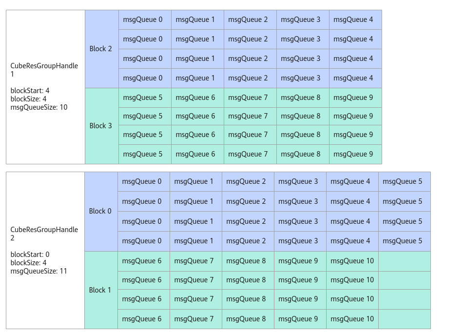

# CubeResGroupHandle构造函数<a name="ZH-CN_TOPIC_0000001965821852"></a>

## 产品支持情况<a name="section1550532418810"></a>

<a name="table38301303189"></a>
<table><thead align="left"><tr id="row20831180131817"><th class="cellrowborder" valign="top" width="57.95%" id="mcps1.1.3.1.1"><p id="p1883113061818"><a name="p1883113061818"></a><a name="p1883113061818"></a><span id="ph20833205312295"><a name="ph20833205312295"></a><a name="ph20833205312295"></a>产品</span></p>
</th>
<th class="cellrowborder" align="center" valign="top" width="42.05%" id="mcps1.1.3.1.2"><p id="p783113012187"><a name="p783113012187"></a><a name="p783113012187"></a>是否支持</p>
</th>
</tr>
</thead>
<tbody><tr id="row220181016240"><td class="cellrowborder" valign="top" width="57.95%" headers="mcps1.1.3.1.1 "><p id="p48327011813"><a name="p48327011813"></a><a name="p48327011813"></a><span id="ph583230201815"><a name="ph583230201815"></a><a name="ph583230201815"></a><term id="zh-cn_topic_0000001312391781_term1253731311225"><a name="zh-cn_topic_0000001312391781_term1253731311225"></a><a name="zh-cn_topic_0000001312391781_term1253731311225"></a>Atlas A3 训练系列产品</term>/<term id="zh-cn_topic_0000001312391781_term131434243115"><a name="zh-cn_topic_0000001312391781_term131434243115"></a><a name="zh-cn_topic_0000001312391781_term131434243115"></a>Atlas A3 推理系列产品</term></span></p>
</td>
<td class="cellrowborder" align="center" valign="top" width="42.05%" headers="mcps1.1.3.1.2 "><p id="p7948163910184"><a name="p7948163910184"></a><a name="p7948163910184"></a>x</p>
</td>
</tr>
<tr id="row173226882415"><td class="cellrowborder" valign="top" width="57.95%" headers="mcps1.1.3.1.1 "><p id="p14832120181815"><a name="p14832120181815"></a><a name="p14832120181815"></a><span id="ph1483216010188"><a name="ph1483216010188"></a><a name="ph1483216010188"></a><term id="zh-cn_topic_0000001312391781_term11962195213215"><a name="zh-cn_topic_0000001312391781_term11962195213215"></a><a name="zh-cn_topic_0000001312391781_term11962195213215"></a>Atlas A2 训练系列产品</term>/<term id="zh-cn_topic_0000001312391781_term184716139811"><a name="zh-cn_topic_0000001312391781_term184716139811"></a><a name="zh-cn_topic_0000001312391781_term184716139811"></a>Atlas A2 推理系列产品</term></span></p>
</td>
<td class="cellrowborder" align="center" valign="top" width="42.05%" headers="mcps1.1.3.1.2 "><p id="p19948143911820"><a name="p19948143911820"></a><a name="p19948143911820"></a>√</p>
</td>
</tr>
</tbody>
</table>

## 功能说明<a name="zh-cn_topic_0000001526206862_section212607105720"></a>

构造CubeResGroupHandle对象，完成组内的AIC和消息队列分配。构造CubeResGroupHandle对象时需要传入模板参数CubeMsgType，CubeMsgType是由用户定义的消息结构体，请参考[表1](CubeResGroupHandle使用说明.md#table189051237164018)。使用此接口需要用户自主管理地址、同步事件等，因此更推荐使用[CreateCubeResGroup](CubeResGroupHandle构造函数.md)接口快速创建CubeResGroupHandle对象。

## 函数原型<a name="section765814724715"></a>

```
template <typename CubeMsgType>
class CubeResGroupHandle;
__aicore__ inline CubeResGroupHandle() = default
__aicore__ inline CubeResGroupHandle(GM_ADDR workspace, uint8_t blockStart, uint8_t blockSize, uint8_t msgQueueSize, uint8_t evtIDIn)
```

## 参数说明<a name="zh-cn_topic_0000001526206862_section129451113125413"></a>

**表 1**  CubeResGroupHandle参数说明

<a name="zh-cn_topic_0000001526206862_zh-cn_topic_0000001389783361_table111938719446"></a>
<table><thead align="left"><tr id="zh-cn_topic_0000001526206862_zh-cn_topic_0000001389783361_row6223476444"><th class="cellrowborder" valign="top" width="17.22%" id="mcps1.2.4.1.1"><p id="zh-cn_topic_0000001526206862_zh-cn_topic_0000001389783361_p10223674448"><a name="zh-cn_topic_0000001526206862_zh-cn_topic_0000001389783361_p10223674448"></a><a name="zh-cn_topic_0000001526206862_zh-cn_topic_0000001389783361_p10223674448"></a>参数</p>
</th>
<th class="cellrowborder" valign="top" width="15.340000000000002%" id="mcps1.2.4.1.2"><p id="zh-cn_topic_0000001526206862_zh-cn_topic_0000001389783361_p645511218169"><a name="zh-cn_topic_0000001526206862_zh-cn_topic_0000001389783361_p645511218169"></a><a name="zh-cn_topic_0000001526206862_zh-cn_topic_0000001389783361_p645511218169"></a>输入/输出</p>
</th>
<th class="cellrowborder" valign="top" width="67.44%" id="mcps1.2.4.1.3"><p id="zh-cn_topic_0000001526206862_zh-cn_topic_0000001389783361_p1922337124411"><a name="zh-cn_topic_0000001526206862_zh-cn_topic_0000001389783361_p1922337124411"></a><a name="zh-cn_topic_0000001526206862_zh-cn_topic_0000001389783361_p1922337124411"></a>说明</p>
</th>
</tr>
</thead>
<tbody><tr id="zh-cn_topic_0000001526206862_zh-cn_topic_0000001389783361_row152234713443"><td class="cellrowborder" valign="top" width="17.22%" headers="mcps1.2.4.1.1 "><p id="zh-cn_topic_0000001526206862_zh-cn_topic_0000001389783361_p2340183613156"><a name="zh-cn_topic_0000001526206862_zh-cn_topic_0000001389783361_p2340183613156"></a><a name="zh-cn_topic_0000001526206862_zh-cn_topic_0000001389783361_p2340183613156"></a>workspace</p>
</td>
<td class="cellrowborder" valign="top" width="15.340000000000002%" headers="mcps1.2.4.1.2 "><p id="p19741912147"><a name="p19741912147"></a><a name="p19741912147"></a>输入</p>
</td>
<td class="cellrowborder" valign="top" width="67.44%" headers="mcps1.2.4.1.3 "><p id="p17175015525"><a name="p17175015525"></a><a name="p17175015525"></a>该CubeResGroupHandle的消息通讯区在GM上的起始地址。</p>
</td>
</tr>
<tr id="zh-cn_topic_0000001526206862_row1239183183016"><td class="cellrowborder" valign="top" width="17.22%" headers="mcps1.2.4.1.1 "><p id="zh-cn_topic_0000001526206862_p223953193015"><a name="zh-cn_topic_0000001526206862_p223953193015"></a><a name="zh-cn_topic_0000001526206862_p223953193015"></a>blockStart</p>
</td>
<td class="cellrowborder" valign="top" width="15.340000000000002%" headers="mcps1.2.4.1.2 "><p id="zh-cn_topic_0000001526206862_p7239938308"><a name="zh-cn_topic_0000001526206862_p7239938308"></a><a name="zh-cn_topic_0000001526206862_p7239938308"></a>输入</p>
</td>
<td class="cellrowborder" valign="top" width="67.44%" headers="mcps1.2.4.1.3 "><p id="p1117515154210"><a name="p1117515154210"></a><a name="p1117515154210"></a>该CubeResGroupHandle在AIV视角下起始AIC对应的序号，即AIC的起始序号*2。例如，如果AIC起始序号为0，则填入0*2；如果为1，则填入1*2。</p>
</td>
</tr>
<tr id="row9374154371313"><td class="cellrowborder" valign="top" width="17.22%" headers="mcps1.2.4.1.1 "><p id="p11374343181311"><a name="p11374343181311"></a><a name="p11374343181311"></a>blockSize</p>
</td>
<td class="cellrowborder" valign="top" width="15.340000000000002%" headers="mcps1.2.4.1.2 "><p id="p146153901420"><a name="p146153901420"></a><a name="p146153901420"></a>输入</p>
</td>
<td class="cellrowborder" valign="top" width="67.44%" headers="mcps1.2.4.1.3 "><p id="p517518151222"><a name="p517518151222"></a><a name="p517518151222"></a>该CubeResGroupHandle在AIV视角下分配的Block个数，即实际的AIC个数*2。</p>
</td>
</tr>
<tr id="row15285204611313"><td class="cellrowborder" valign="top" width="17.22%" headers="mcps1.2.4.1.1 "><p id="p15285194613135"><a name="p15285194613135"></a><a name="p15285194613135"></a>msgQueueSize</p>
</td>
<td class="cellrowborder" valign="top" width="15.340000000000002%" headers="mcps1.2.4.1.2 "><p id="p9285104615133"><a name="p9285104615133"></a><a name="p9285104615133"></a>输入</p>
</td>
<td class="cellrowborder" valign="top" width="67.44%" headers="mcps1.2.4.1.3 "><p id="p101756155210"><a name="p101756155210"></a><a name="p101756155210"></a>该CubeResGroupHandle分配的消息队列总数。</p>
</td>
</tr>
<tr id="row155491219122113"><td class="cellrowborder" valign="top" width="17.22%" headers="mcps1.2.4.1.1 "><p id="p1250414522214"><a name="p1250414522214"></a><a name="p1250414522214"></a>evtIDIn</p>
</td>
<td class="cellrowborder" valign="top" width="15.340000000000002%" headers="mcps1.2.4.1.2 "><p id="p17504115215215"><a name="p17504115215215"></a><a name="p17504115215215"></a>输入</p>
</td>
<td class="cellrowborder" valign="top" width="67.44%" headers="mcps1.2.4.1.3 "><p id="p155041252152119"><a name="p155041252152119"></a><a name="p155041252152119"></a>通信框架内用于AIV侧消息的同步事件。</p>
</td>
</tr>
</tbody>
</table>

如下图所示，CubeResGroupHandle1的blockStart为4，blockSize为4，表示起始的AIC序号为2，即blockStart / 2；AIC数量为2，即blockSize / 2。msgQueueSize为10，表示消息队列个数为10，每个Block分配的消息队列个数为Ceil\(msgQueueSize，blockSize/2\)，Block2和Block3分配到的消息队列个数均为5。CubeResGroupHandle2的msgQueueSize数量为11，最后一个Block只能分配5个消息队列。

**图 1**  Block和消息队列映射示意图<a name="fig38005710136"></a>  


## 约束说明<a name="zh-cn_topic_0000001526206862_section65498832"></a>

-   假设芯片的AIV核数为x，那么blockStart + blockSize <= x - 1, msgQueueSize <= x。
-   每个AIC至少被分配1个消息队列msgQueue。
-   blockStart和blockSize必须为偶数。
-   使用该接口，UB空间末尾的1600B + sizeof\(CubeMsgType\)将被占用。
-   1个AIC只能属于1个CubeGroupHandle，即多个CubeGroupHandle的\[blockStart / 2, blockStart / 2+blockSize / 2\]区间不能重叠。
-   不能和[REGIST\_MATMUL\_OBJ](REGIST_MATMUL_OBJ.md)接口同时使用。使用资源管理API时，用户自主管理AIC和AIV的核间通信，REGIST\_MATMUL\_OBJ内部是由框架管理AIC和AIV的核间通信，同时使用可能会导致通信消息错误等异常。

## 调用示例<a name="zh-cn_topic_0000001526206862_section97001499599"></a>

```
uint8_t blockStart = 4;
uint8_t blockSize = 4;
uint8_t msgQueueSize = 10;
uint8_t evtIDIn = 0; //用户自行管理事件ID
AscendC::KfcWorkspace desc(workspace); // 用户自行管理的workspace指针。
AscendC::CubeResGroupHandle<CubeMsgBody> handle;
handle = AscendC::CubeResGroupHandle<MatmulApiType, MyCallbackFunc, CubeMsgBody>(desc.GetMsgStart(), blockStart, blockSize, msgQueueSize, evtIDIn); 
```

