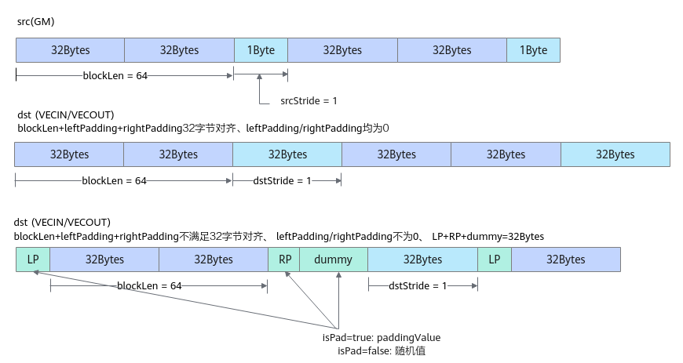
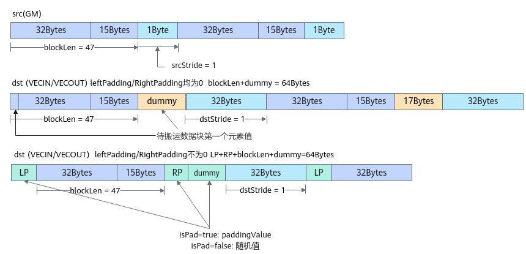
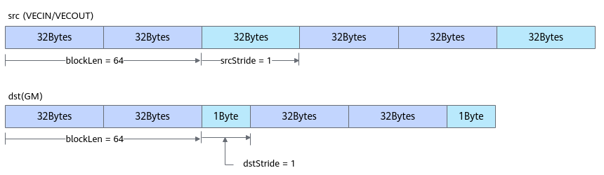
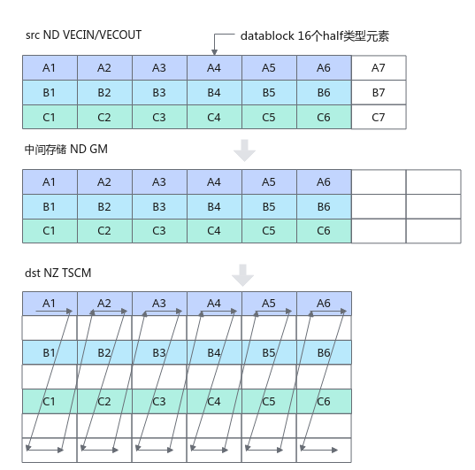

# DataCopyPad\(ISASI\)<a name="ZH-CN_TOPIC_0000001894460401"></a>

## 产品支持情况<a name="section1550532418810"></a>

<a name="table38301303189"></a>
<table><thead align="left"><tr id="row20831180131817"><th class="cellrowborder" valign="top" width="57.99999999999999%" id="mcps1.1.3.1.1"><p id="p1883113061818"><a name="p1883113061818"></a><a name="p1883113061818"></a><span id="ph20833205312295"><a name="ph20833205312295"></a><a name="ph20833205312295"></a>产品</span></p>
</th>
<th class="cellrowborder" align="center" valign="top" width="42%" id="mcps1.1.3.1.2"><p id="p783113012187"><a name="p783113012187"></a><a name="p783113012187"></a>是否支持</p>
</th>
</tr>
</thead>
<tbody><tr id="row1272474920205"><td class="cellrowborder" valign="top" width="57.99999999999999%" headers="mcps1.1.3.1.1 "><p id="p17301775812"><a name="p17301775812"></a><a name="p17301775812"></a><span id="ph2272194216543"><a name="ph2272194216543"></a><a name="ph2272194216543"></a>Ascend 950PR/Ascend 950DT</span></p>
</td>
<td class="cellrowborder" align="center" valign="top" width="42%" headers="mcps1.1.3.1.2 "><p id="p37256491200"><a name="p37256491200"></a><a name="p37256491200"></a>√</p>
</td>
</tr>
<tr id="row220181016240"><td class="cellrowborder" valign="top" width="57.99999999999999%" headers="mcps1.1.3.1.1 "><p id="p48327011813"><a name="p48327011813"></a><a name="p48327011813"></a><span id="ph583230201815"><a name="ph583230201815"></a><a name="ph583230201815"></a><term id="zh-cn_topic_0000001312391781_term1253731311225"><a name="zh-cn_topic_0000001312391781_term1253731311225"></a><a name="zh-cn_topic_0000001312391781_term1253731311225"></a>Atlas A3 训练系列产品</term>/<term id="zh-cn_topic_0000001312391781_term131434243115"><a name="zh-cn_topic_0000001312391781_term131434243115"></a><a name="zh-cn_topic_0000001312391781_term131434243115"></a>Atlas A3 推理系列产品</term></span></p>
</td>
<td class="cellrowborder" align="center" valign="top" width="42%" headers="mcps1.1.3.1.2 "><p id="p7948163910184"><a name="p7948163910184"></a><a name="p7948163910184"></a>√</p>
</td>
</tr>
<tr id="row173226882415"><td class="cellrowborder" valign="top" width="57.99999999999999%" headers="mcps1.1.3.1.1 "><p id="p14832120181815"><a name="p14832120181815"></a><a name="p14832120181815"></a><span id="ph1483216010188"><a name="ph1483216010188"></a><a name="ph1483216010188"></a><term id="zh-cn_topic_0000001312391781_term11962195213215"><a name="zh-cn_topic_0000001312391781_term11962195213215"></a><a name="zh-cn_topic_0000001312391781_term11962195213215"></a>Atlas A2 训练系列产品</term>/<term id="zh-cn_topic_0000001312391781_term184716139811"><a name="zh-cn_topic_0000001312391781_term184716139811"></a><a name="zh-cn_topic_0000001312391781_term184716139811"></a>Atlas A2 推理系列产品</term></span></p>
</td>
<td class="cellrowborder" align="center" valign="top" width="42%" headers="mcps1.1.3.1.2 "><p id="p19948143911820"><a name="p19948143911820"></a><a name="p19948143911820"></a>√</p>
</td>
</tr>
</tbody>
</table>

## 功能说明<a name="section618mcpsimp"></a>

该接口提供数据非对齐搬运的功能，其中从Global Memory搬运数据至Local Memory时，可以根据开发者的需要自行填充数据。

## 函数原型<a name="section620mcpsimp"></a>

-   dataCopyParams为[DataCopyExtParams](#table10572141063919)类型，相比于[DataCopyParams](#table9182515919)类型，支持的操作数步长等参数取值范围更大
    -   通路：Global Memory-\>Local Memory

        ```
        template <typename T, PaddingMode mode = PaddingMode::Normal>
        __aicore__ inline void DataCopyPad(const LocalTensor<T>& dst, const GlobalTensor<T>& src, const DataCopyExtParams& dataCopyParams, const DataCopyPadExtParams<T>& padParams)
        ```

        ```
        template <typename T>
        __aicore__ inline void DataCopyPad(const LocalTensor<T>& dst, const GlobalTensor<T>& src, const DataCopyExtParams& dataCopyParams, const DataCopyPadExtParams<T>& padParams)
        ```

    -   通路：Local Memory-\>Global Memory

        ```
        template <typename T, PaddingMode mode = PaddingMode::Normal>
        __aicore__ inline void DataCopyPad(const GlobalTensor<T>& dst, const LocalTensor<T>& src, const DataCopyExtParams& dataCopyParams)
        ```

        ```
        template <typename T>
        __aicore__ inline void DataCopyPad(const GlobalTensor<T>& dst, const LocalTensor<T>& src, const DataCopyExtParams& dataCopyParams)
        ```

    -   通路：Local Memory-\>Local Memory，实际搬运过程是VECIN/VECOUT-\>GM-\>TSCM

        ```
        template <typename T>
        __aicore__ inline void DataCopyPad(const LocalTensor<T>& dst, const LocalTensor<T>& src, const DataCopyExtParams& dataCopyParams, const Nd2NzParams& nd2nzParams)
        ```

-   dataCopyParams为[DataCopyParams](#table9182515919)类型
    -   通路：Global Memory-\>Local Memory

        ```
        template<typename T, PaddingMode mode = PaddingMode::Normal>
        __aicore__ inline void DataCopyPad(const LocalTensor<T>& dst, const GlobalTensor<T>& src, const DataCopyParams& dataCopyParams, const DataCopyPadParams& padParams)
        ```

        ```
        template<typename T>
        __aicore__ inline void DataCopyPad(const LocalTensor<T>& dst, const GlobalTensor<T>& src, const DataCopyParams& dataCopyParams, const DataCopyPadParams& padParams)
        ```

    -   通路：Local Memory-\>Global Memory

        ```
        template<typename T, PaddingMode mode = PaddingMode::Normal>
        __aicore__ inline void DataCopyPad(const GlobalTensor<T>& dst, const LocalTensor<T>& src,const DataCopyParams& dataCopyParams)
        ```

        ```
        template<typename T>
        __aicore__ inline void DataCopyPad(const GlobalTensor<T>& dst, const LocalTensor<T>& src,const DataCopyParams& dataCopyParams)
        ```

    -   通路：Local Memory-\>Local Memory，实际搬运过程是VECIN/VECOUT-\>GM-\>TSCM

        ```
        template<typename T>
        __aicore__ inline void DataCopyPad(const LocalTensor<T>& dst, const LocalTensor<T>& src, const DataCopyParams& dataCopyParams, const Nd2NzParams& nd2nzParams)
        ```

不同产品型号对函数原型的支持存在差异，请参考下表中的支持度信息，选择产品型号支持的函数原型进行开发。

**表 1**  不同产品型号对函数原型的支持度

<a name="table19300151419354"></a>
<table><thead align="left"><tr id="row143011314143513"><th class="cellrowborder" valign="top" width="29.909999999999997%" id="mcps1.2.4.1.1"><p id="p19301171413514"><a name="p19301171413514"></a><a name="p19301171413514"></a>产品型号</p>
</th>
<th class="cellrowborder" valign="top" width="54.559999999999995%" id="mcps1.2.4.1.2"><p id="p1830141412353"><a name="p1830141412353"></a><a name="p1830141412353"></a>支持的数据传输通路</p>
</th>
<th class="cellrowborder" valign="top" width="15.53%" id="mcps1.2.4.1.3"><p id="p116921969216"><a name="p116921969216"></a><a name="p116921969216"></a>是否支持设置数据搬运模式mode（搬运模式包括单次搬运对齐和整块数据搬运对齐）</p>
</th>
</tr>
</thead>
<tbody><tr id="row1930181411352"><td class="cellrowborder" valign="top" width="29.909999999999997%" headers="mcps1.2.4.1.1 "><p id="p35852461357"><a name="p35852461357"></a><a name="p35852461357"></a><span id="ph358510464354"><a name="ph358510464354"></a><a name="ph358510464354"></a>Ascend 950PR/Ascend 950DT</span></p>
</td>
<td class="cellrowborder" valign="top" width="54.559999999999995%" headers="mcps1.2.4.1.2 "><p id="p1865151212387"><a name="p1865151212387"></a><a name="p1865151212387"></a>GM-&gt;VECIN/VECOUT、GM-&gt;A1/B1、GM-&gt;TSCM、VECIN/VECOUT-&gt;GM、A1/B1-&gt;GM、VECIN/VECOUT-&gt;TSCM、 GM-&gt;VECCALC</p>
</td>
<td class="cellrowborder" valign="top" width="15.53%" headers="mcps1.2.4.1.3 "><p id="p1769246192116"><a name="p1769246192116"></a><a name="p1769246192116"></a>是</p>
</td>
</tr>
<tr id="row17301101417355"><td class="cellrowborder" valign="top" width="29.909999999999997%" headers="mcps1.2.4.1.1 "><p id="p7585124612359"><a name="p7585124612359"></a><a name="p7585124612359"></a><span id="ph758518467351"><a name="ph758518467351"></a><a name="ph758518467351"></a><term id="zh-cn_topic_0000001312391781_term1253731311225_1"><a name="zh-cn_topic_0000001312391781_term1253731311225_1"></a><a name="zh-cn_topic_0000001312391781_term1253731311225_1"></a>Atlas A3 训练系列产品</term>/<term id="zh-cn_topic_0000001312391781_term131434243115_1"><a name="zh-cn_topic_0000001312391781_term131434243115_1"></a><a name="zh-cn_topic_0000001312391781_term131434243115_1"></a>Atlas A3 推理系列产品</term></span></p>
</td>
<td class="cellrowborder" valign="top" width="54.559999999999995%" headers="mcps1.2.4.1.2 "><p id="p183162199399"><a name="p183162199399"></a><a name="p183162199399"></a>GM-&gt;VECIN/VECOUT、VECIN/VECOUT-&gt;GM、VECIN/VECOUT-&gt;TSCM</p>
</td>
<td class="cellrowborder" valign="top" width="15.53%" headers="mcps1.2.4.1.3 "><p id="p769218692114"><a name="p769218692114"></a><a name="p769218692114"></a>否</p>
</td>
</tr>
<tr id="row1630161420353"><td class="cellrowborder" valign="top" width="29.909999999999997%" headers="mcps1.2.4.1.1 "><p id="p55852046133515"><a name="p55852046133515"></a><a name="p55852046133515"></a><span id="ph1158524643516"><a name="ph1158524643516"></a><a name="ph1158524643516"></a><term id="zh-cn_topic_0000001312391781_term11962195213215_1"><a name="zh-cn_topic_0000001312391781_term11962195213215_1"></a><a name="zh-cn_topic_0000001312391781_term11962195213215_1"></a>Atlas A2 训练系列产品</term>/<term id="zh-cn_topic_0000001312391781_term184716139811_1"><a name="zh-cn_topic_0000001312391781_term184716139811_1"></a><a name="zh-cn_topic_0000001312391781_term184716139811_1"></a>Atlas A2 推理系列产品</term></span></p>
</td>
<td class="cellrowborder" valign="top" width="54.559999999999995%" headers="mcps1.2.4.1.2 "><p id="p6822102933911"><a name="p6822102933911"></a><a name="p6822102933911"></a>GM-&gt;VECIN/VECOUT、VECIN/VECOUT-&gt;GM、VECIN/VECOUT-&gt;TSCM</p>
</td>
<td class="cellrowborder" valign="top" width="15.53%" headers="mcps1.2.4.1.3 "><p id="p12692266214"><a name="p12692266214"></a><a name="p12692266214"></a>否</p>
</td>
</tr>
</tbody>
</table>

## 参数说明<a name="section622mcpsimp"></a>

**表 2**  模板参数说明

<a name="table4835205712588"></a>
<table><thead align="left"><tr id="zh-cn_topic_0000001429830437_row118356578583"><th class="cellrowborder" valign="top" width="18.21%" id="mcps1.2.3.1.1"><p id="zh-cn_topic_0000001429830437_p48354572582"><a name="zh-cn_topic_0000001429830437_p48354572582"></a><a name="zh-cn_topic_0000001429830437_p48354572582"></a>参数名</p>
</th>
<th class="cellrowborder" valign="top" width="81.78999999999999%" id="mcps1.2.3.1.2"><p id="zh-cn_topic_0000001429830437_p583535795817"><a name="zh-cn_topic_0000001429830437_p583535795817"></a><a name="zh-cn_topic_0000001429830437_p583535795817"></a>描述</p>
</th>
</tr>
</thead>
<tbody><tr id="zh-cn_topic_0000001429830437_row1835857145817"><td class="cellrowborder" valign="top" width="18.21%" headers="mcps1.2.3.1.1 "><p id="zh-cn_topic_0000001429830437_p5835457165816"><a name="zh-cn_topic_0000001429830437_p5835457165816"></a><a name="zh-cn_topic_0000001429830437_p5835457165816"></a>T</p>
</td>
<td class="cellrowborder" valign="top" width="81.78999999999999%" headers="mcps1.2.3.1.2 "><p id="zh-cn_topic_0000001429830437_p168351657155818"><a name="zh-cn_topic_0000001429830437_p168351657155818"></a><a name="zh-cn_topic_0000001429830437_p168351657155818"></a>操作数以及paddingValue（待填充数据值）的数据类型。</p>
<p id="p468305719192"><a name="p468305719192"></a><a name="p468305719192"></a><span id="ph126252025205"><a name="ph126252025205"></a><a name="ph126252025205"></a>Ascend 950PR/Ascend 950DT</span>，支持的数据类型为：bool/int8_t/uint8_t/int16_t/uint16_t/half/bfloat16_t/int32_t/uint32_t/float/complex32/int64_t/uint64_t/double/complex64</p>
<p id="p523904010149"><a name="p523904010149"></a><a name="p523904010149"></a><span id="ph16239174011416"><a name="ph16239174011416"></a><a name="ph16239174011416"></a><term id="zh-cn_topic_0000001312391781_term1253731311225_2"><a name="zh-cn_topic_0000001312391781_term1253731311225_2"></a><a name="zh-cn_topic_0000001312391781_term1253731311225_2"></a>Atlas A3 训练系列产品</term>/<term id="zh-cn_topic_0000001312391781_term131434243115_2"><a name="zh-cn_topic_0000001312391781_term131434243115_2"></a><a name="zh-cn_topic_0000001312391781_term131434243115_2"></a>Atlas A3 推理系列产品</term></span>，支持的数据类型为：half/bfloat16_t/int16_t/uint16_t/float/int32_t/uint32_t/int8_t/uint8_t/int64_t/uint64_t/double</p>
<p id="p5583135802514"><a name="p5583135802514"></a><a name="p5583135802514"></a><span id="ph164521232145312"><a name="ph164521232145312"></a><a name="ph164521232145312"></a><term id="zh-cn_topic_0000001312391781_term11962195213215_2"><a name="zh-cn_topic_0000001312391781_term11962195213215_2"></a><a name="zh-cn_topic_0000001312391781_term11962195213215_2"></a>Atlas A2 训练系列产品</term>/<term id="zh-cn_topic_0000001312391781_term184716139811_2"><a name="zh-cn_topic_0000001312391781_term184716139811_2"></a><a name="zh-cn_topic_0000001312391781_term184716139811_2"></a>Atlas A2 推理系列产品</term></span>，支持的数据类型为：half/bfloat16_t/int16_t/uint16_t/float/int32_t/uint32_t/int8_t/uint8_t/int64_t/uint64_t/double</p>
</td>
</tr>
<tr id="row11228130151516"><td class="cellrowborder" valign="top" width="18.21%" headers="mcps1.2.3.1.1 "><p id="p12228202152"><a name="p12228202152"></a><a name="p12228202152"></a>mode</p>
</td>
<td class="cellrowborder" valign="top" width="81.78999999999999%" headers="mcps1.2.3.1.2 "><p id="p202731227454"><a name="p202731227454"></a><a name="p202731227454"></a>配置数据搬运模式。PaddingMode类型，定义如下：</p>
<a name="screen947019218236"></a><a name="screen947019218236"></a><pre class="screen" codetype="Cpp" id="screen947019218236">enum class PaddingMode : uint8_t {
    Normal = 0,  // 默认模式，与原有数据搬运格式保持一致，每次数据搬运都会补齐至32字节对齐
    Compact,     // 紧凑模式，允许单次搬运不对齐，统一在整块数据末尾补齐至32字节对齐
};</pre>
</td>
</tr>
</tbody>
</table>

**表 3**  接口参数说明

<a name="zh-cn_topic_0235751031_table33761356"></a>
<table><thead align="left"><tr id="zh-cn_topic_0235751031_row27598891"><th class="cellrowborder" valign="top" width="18.529999999999998%" id="mcps1.2.4.1.1"><p id="zh-cn_topic_0235751031_p20917673"><a name="zh-cn_topic_0235751031_p20917673"></a><a name="zh-cn_topic_0235751031_p20917673"></a>参数名</p>
</th>
<th class="cellrowborder" valign="top" width="10.059999999999999%" id="mcps1.2.4.1.2"><p id="zh-cn_topic_0235751031_p16609919"><a name="zh-cn_topic_0235751031_p16609919"></a><a name="zh-cn_topic_0235751031_p16609919"></a>输入/输出</p>
</th>
<th class="cellrowborder" valign="top" width="71.41%" id="mcps1.2.4.1.3"><p id="zh-cn_topic_0235751031_p59995477"><a name="zh-cn_topic_0235751031_p59995477"></a><a name="zh-cn_topic_0235751031_p59995477"></a>描述</p>
</th>
</tr>
</thead>
<tbody><tr id="row42461942101815"><td class="cellrowborder" valign="top" width="18.529999999999998%" headers="mcps1.2.4.1.1 "><p id="p2925016172518"><a name="p2925016172518"></a><a name="p2925016172518"></a>dst</p>
</td>
<td class="cellrowborder" valign="top" width="10.059999999999999%" headers="mcps1.2.4.1.2 "><p id="p199251416112517"><a name="p199251416112517"></a><a name="p199251416112517"></a>输出</p>
</td>
<td class="cellrowborder" valign="top" width="71.41%" headers="mcps1.2.4.1.3 "><p id="p188412179332"><a name="p188412179332"></a><a name="p188412179332"></a>目的操作数，类型为LocalTensor或GlobalTensor。</p>
<p id="p10908340183319"><a name="p10908340183319"></a><a name="p10908340183319"></a>LocalTensor的起始地址需要保证32字节对齐。</p>
<p id="p62441154113319"><a name="p62441154113319"></a><a name="p62441154113319"></a>GlobalTensor的起始地址无地址对齐约束。</p>
</td>
</tr>
<tr id="row2137145181815"><td class="cellrowborder" valign="top" width="18.529999999999998%" headers="mcps1.2.4.1.1 "><p id="p3926171610253"><a name="p3926171610253"></a><a name="p3926171610253"></a>src</p>
</td>
<td class="cellrowborder" valign="top" width="10.059999999999999%" headers="mcps1.2.4.1.2 "><p id="p4926121682518"><a name="p4926121682518"></a><a name="p4926121682518"></a>输入</p>
</td>
<td class="cellrowborder" valign="top" width="71.41%" headers="mcps1.2.4.1.3 "><p id="p49261616142516"><a name="p49261616142516"></a><a name="p49261616142516"></a>源操作数，类型为LocalTensor或GlobalTensor。</p>
<p id="p1449332363410"><a name="p1449332363410"></a><a name="p1449332363410"></a>LocalTensor的起始地址需要保证32字节对齐。</p>
<p id="p10493102318345"><a name="p10493102318345"></a><a name="p10493102318345"></a>GlobalTensor的起始地址无地址对齐约束。</p>
</td>
</tr>
<tr id="row19615183817191"><td class="cellrowborder" valign="top" width="18.529999999999998%" headers="mcps1.2.4.1.1 "><p id="p1766211402594"><a name="p1766211402594"></a><a name="p1766211402594"></a>dataCopyParams</p>
</td>
<td class="cellrowborder" valign="top" width="10.059999999999999%" headers="mcps1.2.4.1.2 "><p id="p566110407591"><a name="p566110407591"></a><a name="p566110407591"></a>输入</p>
</td>
<td class="cellrowborder" valign="top" width="71.41%" headers="mcps1.2.4.1.3 "><p id="p47741322184712"><a name="p47741322184712"></a><a name="p47741322184712"></a>搬运参数。</p>
<a name="ul823117251473"></a><a name="ul823117251473"></a><ul id="ul823117251473"><li>DataCopyExtParams类型，具体参数说明请参考<a href="#table10572141063919">表4</a>。</li><li>DataCopyParams类型，具体参数说明请参考<a href="#table9182515919">表5</a>。</li></ul>
</td>
</tr>
<tr id="row186451941121915"><td class="cellrowborder" valign="top" width="18.529999999999998%" headers="mcps1.2.4.1.1 "><p id="p2645114111914"><a name="p2645114111914"></a><a name="p2645114111914"></a>padParams</p>
</td>
<td class="cellrowborder" valign="top" width="10.059999999999999%" headers="mcps1.2.4.1.2 "><p id="p136451441191912"><a name="p136451441191912"></a><a name="p136451441191912"></a>输入</p>
</td>
<td class="cellrowborder" valign="top" width="71.41%" headers="mcps1.2.4.1.3 "><p id="p186726237528"><a name="p186726237528"></a><a name="p186726237528"></a>从Global Memory搬运数据至Local Memory时，可以根据开发者需要，在搬运数据左边或右边填充数据。padParams是用于控制数据填充过程的参数。</p>
<a name="ul1641826125213"></a><a name="ul1641826125213"></a><ul id="ul1641826125213"><li>DataCopyPadExtParams类型，具体参数请参考<a href="#table844881954715">表6</a>。<strong id="b1083441293911"><a name="b1083441293911"></a><a name="b1083441293911"></a></strong></li><li>DataCopyPadParams类型，具体参数请参考<a href="#table990103991413">表7</a>。</li></ul>
</td>
</tr>
<tr id="row250163914199"><td class="cellrowborder" valign="top" width="18.529999999999998%" headers="mcps1.2.4.1.1 "><p id="p266017409595"><a name="p266017409595"></a><a name="p266017409595"></a>nd2nzParams</p>
</td>
<td class="cellrowborder" valign="top" width="10.059999999999999%" headers="mcps1.2.4.1.2 "><p id="p1265944005915"><a name="p1265944005915"></a><a name="p1265944005915"></a>输入</p>
</td>
<td class="cellrowborder" valign="top" width="71.41%" headers="mcps1.2.4.1.3 "><p id="p1656164065914"><a name="p1656164065914"></a><a name="p1656164065914"></a>从VECIN/VECOUT-&gt;TSCM进行数据搬运时，可以进行ND到NZ的数据格式转换。nd2nzParams是用于控制数据格式转换的参数，Nd2NzParams类型，具体参数请参考<a href="随路转换ND2NZ搬运.md#table844881954715">表3</a>。</p>
<p id="p199142613277"><a name="p199142613277"></a><a name="p199142613277"></a><strong id="b15326524194316"><a name="b15326524194316"></a><a name="b15326524194316"></a>注意：Nd2NzParams的ndNum仅支持设置为1</strong>。</p>
</td>
</tr>
</tbody>
</table>

下文表格中列出的结构体参数定义请参考$\{INSTALL\_DIR\}/include/ascendc/basic\_api/interface/kernel\_struct\_data\_copy.h，$\{INSTALL\_DIR\}请替换为CANN软件安装后文件存储路径。

**表 4**  DataCopyExtParams结构体参数定义

<a name="table10572141063919"></a>
<table><thead align="left"><tr id="row185738102393"><th class="cellrowborder" valign="top" width="15%" id="mcps1.2.3.1.1"><p id="p1573101033918"><a name="p1573101033918"></a><a name="p1573101033918"></a>参数名称</p>
</th>
<th class="cellrowborder" valign="top" width="85%" id="mcps1.2.3.1.2"><p id="p7573191019395"><a name="p7573191019395"></a><a name="p7573191019395"></a>含义</p>
</th>
</tr>
</thead>
<tbody><tr id="row16573210153915"><td class="cellrowborder" valign="top" width="15%" headers="mcps1.2.3.1.1 "><p id="p1457312101394"><a name="p1457312101394"></a><a name="p1457312101394"></a>blockCount</p>
</td>
<td class="cellrowborder" valign="top" width="85%" headers="mcps1.2.3.1.2 "><p id="p18573121053915"><a name="p18573121053915"></a><a name="p18573121053915"></a>指定该指令包含的连续传输数据块个数，数据类型为uint16_t，取值范围：blockCount∈[1, 4095]。</p>
</td>
</tr>
<tr id="row1657315104398"><td class="cellrowborder" valign="top" width="15%" headers="mcps1.2.3.1.1 "><p id="p19573171073914"><a name="p19573171073914"></a><a name="p19573171073914"></a>blockLen</p>
</td>
<td class="cellrowborder" valign="top" width="85%" headers="mcps1.2.3.1.2 "><p id="p15731210203917"><a name="p15731210203917"></a><a name="p15731210203917"></a>指定该指令每个连续传输数据块长度，<strong id="b8573710103918"><a name="b8573710103918"></a><a name="b8573710103918"></a>该指令支持非对齐搬运</strong>，<strong id="b157321093915"><a name="b157321093915"></a><a name="b157321093915"></a>每个连续传输数据块长度单位为字节</strong>。数据类型为uint32_t，取值范围：blockLen∈[1, 2097151]。</p>
</td>
</tr>
<tr id="row17573201017390"><td class="cellrowborder" valign="top" width="15%" headers="mcps1.2.3.1.1 "><p id="p175731610183919"><a name="p175731610183919"></a><a name="p175731610183919"></a>srcStride</p>
</td>
<td class="cellrowborder" valign="top" width="85%" headers="mcps1.2.3.1.2 "><p id="p59132515611"><a name="p59132515611"></a><a name="p59132515611"></a>源操作数，相邻连续数据块的间隔（前面一个数据块的尾与后面数据块的头的间隔）。</p>
<p id="p8449273564"><a name="p8449273564"></a><a name="p8449273564"></a><strong id="b1557321011393"><a name="b1557321011393"></a><a name="b1557321011393"></a>如果源操作数的逻辑位置为VECIN/VECOUT，则单位为dataBlock(32字节)。如果源操作数的逻辑位置为GM，则单位为字节</strong>。</p>
<p id="p1946721919613"><a name="p1946721919613"></a><a name="p1946721919613"></a>数据类型为uint32_t，srcStride不要超出该数据类型的取值范围。</p>
<p id="p1550210261862"><a name="p1550210261862"></a><a name="p1550210261862"></a>特别地，针对如下型号：</p>
<p id="p1309123018612"><a name="p1309123018612"></a><a name="p1309123018612"></a><span id="ph1959710240111"><a name="ph1959710240111"></a><a name="ph1959710240111"></a>Ascend 950PR/Ascend 950DT</span></p>
<p id="p757311106394"><a name="p757311106394"></a><a name="p757311106394"></a>数据类型为int64_t，如果源操作数的逻辑位置为VECIN/VECOUT，取值范围为[0, 65535]；如果源操作数的逻辑位置为GM，取值范围为[-blockLen, 2<sup id="sup98861247195416"><a name="sup98861247195416"></a><a name="sup98861247195416"></a>^40</sup>-1]。</p>
</td>
</tr>
<tr id="row125738105397"><td class="cellrowborder" valign="top" width="15%" headers="mcps1.2.3.1.1 "><p id="p057351013919"><a name="p057351013919"></a><a name="p057351013919"></a>dstStride</p>
</td>
<td class="cellrowborder" valign="top" width="85%" headers="mcps1.2.3.1.2 "><p id="p9422151918588"><a name="p9422151918588"></a><a name="p9422151918588"></a>目的操作数，相邻连续数据块间的间隔（前面一个数据块的尾与后面数据块的头的间隔）。</p>
<p id="p16531521145813"><a name="p16531521145813"></a><a name="p16531521145813"></a><strong id="b155732100395"><a name="b155732100395"></a><a name="b155732100395"></a>如果目的操作数的逻辑位置为VECIN/VECOUT，则单位为dataBlock(32字节)，如果目的操作数的逻辑位置为GM，则单位为字节</strong>。</p>
<p id="p13157421583"><a name="p13157421583"></a><a name="p13157421583"></a>数据类型为uint32_t，dstStride不要超出该数据类型的取值范围。</p>
<p id="p175488548815"><a name="p175488548815"></a><a name="p175488548815"></a>特别地，针对如下型号：</p>
<p id="p2054865417810"><a name="p2054865417810"></a><a name="p2054865417810"></a><span id="ph1954818540814"><a name="ph1954818540814"></a><a name="ph1954818540814"></a>Ascend 950PR/Ascend 950DT</span></p>
<p id="p1857315102399"><a name="p1857315102399"></a><a name="p1857315102399"></a>数据类型为int64_t，如果目的操作数的逻辑位置为VECIN/VECOUT，取值范围为[0, 65535]；如果目的操作数的逻辑位置为GM，取值范围为[0, 2<sup id="sup2038716165513"><a name="sup2038716165513"></a><a name="sup2038716165513"></a>^40</sup>-1]。</p>
</td>
</tr>
<tr id="row13428122712551"><td class="cellrowborder" valign="top" width="15%" headers="mcps1.2.3.1.1 "><p id="p17428152705514"><a name="p17428152705514"></a><a name="p17428152705514"></a>rsv</p>
</td>
<td class="cellrowborder" valign="top" width="85%" headers="mcps1.2.3.1.2 "><p id="p842842719551"><a name="p842842719551"></a><a name="p842842719551"></a>保留字段。</p>
</td>
</tr>
</tbody>
</table>

**表 5**  DataCopyParams结构体参数定义

<a name="table9182515919"></a>
<table><thead align="left"><tr id="row151816516917"><th class="cellrowborder" valign="top" width="15%" id="mcps1.2.3.1.1"><p id="p18182513916"><a name="p18182513916"></a><a name="p18182513916"></a>参数名称</p>
</th>
<th class="cellrowborder" valign="top" width="85%" id="mcps1.2.3.1.2"><p id="p41815515920"><a name="p41815515920"></a><a name="p41815515920"></a>含义</p>
</th>
</tr>
</thead>
<tbody><tr id="row1818105113916"><td class="cellrowborder" valign="top" width="15%" headers="mcps1.2.3.1.1 "><p id="p17780347142614"><a name="p17780347142614"></a><a name="p17780347142614"></a>blockCount</p>
</td>
<td class="cellrowborder" valign="top" width="85%" headers="mcps1.2.3.1.2 "><p id="p478014752618"><a name="p478014752618"></a><a name="p478014752618"></a>指定该指令包含的连续传输数据块个数，数据类型为uint16_t，取值范围：blockCount∈[1, 4095]。</p>
</td>
</tr>
<tr id="row2968131992515"><td class="cellrowborder" valign="top" width="15%" headers="mcps1.2.3.1.1 "><p id="p878011470264"><a name="p878011470264"></a><a name="p878011470264"></a>blockLen</p>
</td>
<td class="cellrowborder" valign="top" width="85%" headers="mcps1.2.3.1.2 "><p id="p11780174752617"><a name="p11780174752617"></a><a name="p11780174752617"></a>指定该指令每个连续传输数据块长度，<strong id="b129631824161419"><a name="b129631824161419"></a><a name="b129631824161419"></a>该指令支持非对齐搬运</strong>，<strong id="b916772219137"><a name="b916772219137"></a><a name="b916772219137"></a>每个连续传输数据块长度单位为字节</strong>。数据类型为uint16_t，blockLen不要超出该数据类型的取值范围。</p>
</td>
</tr>
<tr id="row1589112062510"><td class="cellrowborder" valign="top" width="15%" headers="mcps1.2.3.1.1 "><p id="p378018478265"><a name="p378018478265"></a><a name="p378018478265"></a>srcStride</p>
</td>
<td class="cellrowborder" valign="top" width="85%" headers="mcps1.2.3.1.2 "><p id="p19780547162614"><a name="p19780547162614"></a><a name="p19780547162614"></a>源操作数，相邻连续数据块的间隔（前面一个数据块的尾与后面数据块的头的间隔），<strong id="b93211925192719"><a name="b93211925192719"></a><a name="b93211925192719"></a>如果源操作数的逻辑位置为VECIN/VECOUT，则单位为dataBlock(32字节)。如果源操作数的逻辑位置为GM，则单位为字节</strong>。数据类型为uint16_t，srcStride不要超出该数据类型的取值范围。</p>
</td>
</tr>
<tr id="row3593192082512"><td class="cellrowborder" valign="top" width="15%" headers="mcps1.2.3.1.1 "><p id="p18780347152610"><a name="p18780347152610"></a><a name="p18780347152610"></a>dstStride</p>
</td>
<td class="cellrowborder" valign="top" width="85%" headers="mcps1.2.3.1.2 "><p id="p18780947162613"><a name="p18780947162613"></a><a name="p18780947162613"></a>目的操作数，相邻连续数据块间的间隔（前面一个数据块的尾与后面数据块的头的间隔），<strong id="b1136152862715"><a name="b1136152862715"></a><a name="b1136152862715"></a>如果目的操作数的逻辑位置为VECIN/VECOUT，则单位为dataBlock(32字节)，如果目的操作数的逻辑位置为GM，则单位为字节</strong>。数据类型为uint16_t，dstStride不要超出该数据类型的取值范围。</p>
</td>
</tr>
</tbody>
</table>

**表 6**  DataCopyPadExtParams<T\>结构体参数定义

<a name="table844881954715"></a>
<table><thead align="left"><tr id="row11449201964714"><th class="cellrowborder" valign="top" width="18.44%" id="mcps1.2.3.1.1"><p id="p18449151934710"><a name="p18449151934710"></a><a name="p18449151934710"></a>参数名称</p>
</th>
<th class="cellrowborder" valign="top" width="81.56%" id="mcps1.2.3.1.2"><p id="p11449719134719"><a name="p11449719134719"></a><a name="p11449719134719"></a>含义</p>
</th>
</tr>
</thead>
<tbody><tr id="row5449161919474"><td class="cellrowborder" valign="top" width="18.44%" headers="mcps1.2.3.1.1 "><p id="p8928559104716"><a name="p8928559104716"></a><a name="p8928559104716"></a>isPad</p>
</td>
<td class="cellrowborder" valign="top" width="81.56%" headers="mcps1.2.3.1.2 "><p id="p844917194478"><a name="p844917194478"></a><a name="p844917194478"></a>是否需要填充用户自定义的数据，取值范围：true，false。</p>
<p id="p13122201371214"><a name="p13122201371214"></a><a name="p13122201371214"></a><span>true：</span><span>填充padding value</span>。</p>
<p id="p1012231371217"><a name="p1012231371217"></a><a name="p1012231371217"></a><span>false：</span>表示<span>用户不需要指定填充值，会默认填充</span>随机值。</p>
</td>
</tr>
<tr id="row1944911994712"><td class="cellrowborder" valign="top" width="18.44%" headers="mcps1.2.3.1.1 "><p id="p102019313485"><a name="p102019313485"></a><a name="p102019313485"></a>leftPadding</p>
</td>
<td class="cellrowborder" valign="top" width="81.56%" headers="mcps1.2.3.1.2 "><p id="p0613279142"><a name="p0613279142"></a><a name="p0613279142"></a>连续搬运数据块左侧需要补充的数据范围，单位为元素个数。</p>
<p id="p16581027171419"><a name="p16581027171419"></a><a name="p16581027171419"></a><strong id="b175814271148"><a name="b175814271148"></a><a name="b175814271148"></a>leftPadding、rightPadding所占的字节数均不能超过32字节。</strong></p>
</td>
</tr>
<tr id="row1944916196475"><td class="cellrowborder" valign="top" width="18.44%" headers="mcps1.2.3.1.1 "><p id="p1397111514816"><a name="p1397111514816"></a><a name="p1397111514816"></a>rightPadValue</p>
</td>
<td class="cellrowborder" valign="top" width="81.56%" headers="mcps1.2.3.1.2 "><p id="p144493191478"><a name="p144493191478"></a><a name="p144493191478"></a>连续搬运数据块右侧需要补充的数据范围，单位为元素个数。</p>
<p id="p1190468201516"><a name="p1190468201516"></a><a name="p1190468201516"></a><strong id="b19904883152"><a name="b19904883152"></a><a name="b19904883152"></a>leftPadding、rightPadding所占的字节数均不能超过32字节。</strong></p>
</td>
</tr>
<tr id="row2449119174717"><td class="cellrowborder" valign="top" width="18.44%" headers="mcps1.2.3.1.1 "><p id="p1217581074813"><a name="p1217581074813"></a><a name="p1217581074813"></a>padValue</p>
</td>
<td class="cellrowborder" valign="top" width="81.56%" headers="mcps1.2.3.1.2 "><p id="p1445013195477"><a name="p1445013195477"></a><a name="p1445013195477"></a>左右两侧需要填充的数据值，需要保证在数据占用字节范围内。</p>
<p id="p1126181121313"><a name="p1126181121313"></a><a name="p1126181121313"></a>数据类型和源操作数保持一致，T数据类型。</p>
<p id="p1091511149345"><a name="p1091511149345"></a><a name="p1091511149345"></a><strong id="b21621520171213"><a name="b21621520171213"></a><a name="b21621520171213"></a>当数据类型长度为64位时，该参数只能设置为0。</strong></p>
</td>
</tr>
</tbody>
</table>

**表 7**  DataCopyPadParams结构体参数定义

<a name="table990103991413"></a>
<table><thead align="left"><tr id="row29013931412"><th class="cellrowborder" valign="top" width="18.44%" id="mcps1.2.3.1.1"><p id="p3900394148"><a name="p3900394148"></a><a name="p3900394148"></a>参数名称</p>
</th>
<th class="cellrowborder" valign="top" width="81.56%" id="mcps1.2.3.1.2"><p id="p790153981417"><a name="p790153981417"></a><a name="p790153981417"></a>含义</p>
</th>
</tr>
</thead>
<tbody><tr id="row159116399142"><td class="cellrowborder" valign="top" width="18.44%" headers="mcps1.2.3.1.1 "><p id="p9911439151416"><a name="p9911439151416"></a><a name="p9911439151416"></a>isPad</p>
</td>
<td class="cellrowborder" valign="top" width="81.56%" headers="mcps1.2.3.1.2 "><p id="p2911539171419"><a name="p2911539171419"></a><a name="p2911539171419"></a>是否需要填充用户自定义的数据，取值范围：true，false。</p>
<p id="p189163918146"><a name="p189163918146"></a><a name="p189163918146"></a><span>true：</span><span>填充padding value</span>。</p>
<p id="p1591339171414"><a name="p1591339171414"></a><a name="p1591339171414"></a><span>false：</span>表示<span>用户不需要指定填充值，会默认填充</span>随机值。</p>
</td>
</tr>
<tr id="row491173991412"><td class="cellrowborder" valign="top" width="18.44%" headers="mcps1.2.3.1.1 "><p id="p1591143914149"><a name="p1591143914149"></a><a name="p1591143914149"></a>leftPadding</p>
</td>
<td class="cellrowborder" valign="top" width="81.56%" headers="mcps1.2.3.1.2 "><p id="p2091123981416"><a name="p2091123981416"></a><a name="p2091123981416"></a>连续搬运数据块左侧需要补充的数据范围，单位为元素个数。</p>
<p id="p69113918143"><a name="p69113918143"></a><a name="p69113918143"></a><strong id="b29133951419"><a name="b29133951419"></a><a name="b29133951419"></a>leftPadding、rightPadding所占的字节数均不能超过32字节。</strong></p>
</td>
</tr>
<tr id="row99115392145"><td class="cellrowborder" valign="top" width="18.44%" headers="mcps1.2.3.1.1 "><p id="p991173971416"><a name="p991173971416"></a><a name="p991173971416"></a>rightPadding</p>
</td>
<td class="cellrowborder" valign="top" width="81.56%" headers="mcps1.2.3.1.2 "><p id="p16911339121419"><a name="p16911339121419"></a><a name="p16911339121419"></a>连续搬运数据块右侧需要补充的数据范围，单位为元素个数。</p>
<p id="p1911339201420"><a name="p1911339201420"></a><a name="p1911339201420"></a><strong id="b20911339101412"><a name="b20911339101412"></a><a name="b20911339101412"></a>leftPadding、rightPadding所占的字节数均不能超过32字节。</strong></p>
</td>
</tr>
<tr id="row291539201419"><td class="cellrowborder" valign="top" width="18.44%" headers="mcps1.2.3.1.1 "><p id="p29133981420"><a name="p29133981420"></a><a name="p29133981420"></a>paddingValue</p>
</td>
<td class="cellrowborder" valign="top" width="81.56%" headers="mcps1.2.3.1.2 "><p id="p79118390147"><a name="p79118390147"></a><a name="p79118390147"></a>左右两侧需要填充的数据值，需要保证在数据占用字节范围内。</p>
<p id="p3911539171411"><a name="p3911539171411"></a><a name="p3911539171411"></a>uint64_t数据类型，要求源操作数为uint64_t数据类型，且该参数只能设置为0。</p>
</td>
</tr>
</tbody>
</table>

下面分别给出如下场景的配置示例：

-   [GM-\>VECIN/VECOUT](#li73127579197)
-   [VECIN/VECOUT-\>GM](#li1526352412213)
-   [VECIN/VECOUT-\>TSCM](#li1475016332217)
-   [搬运模式的配置示例](#li1975762118172)
-   <a name="li73127579197"></a>**GM**-\>**VECIN/VECOUT**
    -   参数解释
        -   当blockLen+leftPadding+rightPadding满足32字节对齐时，若isPad为false，左右两侧填充的数据值会默认为随机值；否则为paddingValue。
        -   当blockLen+leftPadding+rightPadding不满足32字节对齐时，框架会填充一些假数据dummy，保证左右填充的数据和blockLen、假数据为32字节对齐。若leftPadding、rightPadding都为0：dummy会默认填充待搬运数据块的第一个元素值；若leftPadding/rightPadding不为0：isPad为false，左右两侧填充的数据值和dummy值均为随机值；否则为paddingValue。

    -   配置示例1：

        -   blockLen为64，每个连续传输数据块包含64字节；srcStride为1，因为源操作数的逻辑位置为GM，srcStride的单位为字节，也就是说源操作数相邻数据块之间间隔1字节；dstStride为1，因为目的操作数的逻辑位置为VECIN/VECOUT，dstStride的单位为DataBlock数量（每DataBlock为32字节），也就是说目的操作数相邻数据块之间间隔1个dataBlock。
        -   blockLen+leftPadding+rightPadding满足32字节对齐，isPad为false，左右两侧填充的数据值会默认为随机值；否则为paddingValue。此处示例中，leftPadding、rightPadding均为0，则不填充。
        -   blockLen+leftPadding+rightPadding不满足32字节对齐时，框架会填充一些假数据dummy，保证左右填充的数据和blockLen、假数据为32字节对齐。leftPadding/rightPadding不为0：若isPad为false，左右两侧填充的数据值和dummy值均为随机值；否则为paddingValue。

        

    -   配置示例2：

        -   blockLen为47，每个连续传输数据块包含47字节；srcStride为1，表示源操作数相邻数据块之间间隔1字节；dstStride为1，表示目的操作数相邻数据块之间间隔1个dataBlock。
        -   blockLen+leftPadding+rightPadding不满足32字节对齐，leftPadding、rightPadding均为0：dummy会默认填充待搬运数据块的第一个元素值。
        -   blockLen+leftPadding+rightPadding不满足32字节对齐，leftPadding/rightPadding不为0：若isPad为false，左右两侧填充的数据值和dummy值均为随机值；否则为paddingValue。

        

    -   配置示例3：

        -   blockLen为48，每个连续传输数据块包含48字节；srcStride为-48，表示源操作数相邻数据块之间间隔-48字节，相当于每次传输的连续数据块都是同一块；dstStride为1，表示目的操作数相邻数据块之间间隔1个dataBlock。
        -   blockLen+leftPadding+rightPadding不满足32字节对齐，leftPadding、rightPadding均为0：dummy会默认填充待搬运数据块的第一个元素值。
        -   blockLen+leftPadding+rightPadding不满足32字节对齐，leftPadding/rightPadding不为0：若isPad为false，左右两侧填充的数据值和dummy值均为随机值；否则为paddingValue。

        

-   <a name="li1526352412213"></a>**VECIN/VECOUT**-\>**GM**
    -   当每个连续传输数据块长度blockLen为32字节对齐时，下图呈现了需要传入的DataCopyParams示例，blockLen为64，每个连续传输数据块包含64字节；srcStride为1，因为源操作数的逻辑位置为VECIN/VECOUT，srcStride的单位为dataBlock\(32字节\)，也就是说源操作数相邻数据块之间间隔1个dataBlock；dstStride为1，因为目的操作数的逻辑位置为GM，dstStride的单位为字节，也就是说目的操作数相邻数据块之间间隔1字节。

        

    -   当每个连续传输数据块长度blockLen不满足32字节对齐，由于Unified Buffer要求32字节对齐，框架在搬出时会自动补充一些假数据来保证对齐，但在当搬到GM时会自动将填充的假数据丢弃掉。下图呈现了该场景下需要传入的DataCopyParams示例和假数据补齐的原理。blockLen为47，每个连续传输数据块包含47字节，不满足32字节对齐；srcStride为1，表示源操作数相邻数据块之间间隔1个dataBlock；dstStride为1，表示目的操作数相邻数据块之间间隔1字节。框架在搬出时会自动补充17字节的假数据来保证对齐，搬到GM时再自动将填充的假数据丢弃掉。

        

-   <a name="li1475016332217"></a>**VECIN/VECOUT-\>TSCM**

    **注意：**内部实现涉及AIC和AIV之间的通信，实际搬运路径为VECIN/VECOUT-\>GM-\>TSCM，**发送通信消息会有开销，性能会受到影响**。

    如[图1 VECIN/VECOUT-\>TSCM搬运示意图](#fig9329040132719)所示，展示了从VECIN/VECOUT搬运到GM，再搬运到TSCM的过程：示例中数据类型为half，单个datablock（32字节）含有16个half元素，源操作数中的A1\~A6、B1\~B6、C1\~C6为需要进行搬运的数据。

    -   从VECIN/VECOUT-\>GM的搬运，数据存储格式没有发生转变，依然是ND。
        -   **blockCount**为需要搬运的连续传输数据块个数，设置为3；
        -   **blockLen**为一个连续传输数据块的大小（单位为字节），设置为6 \* 32 = 192；
        -   **srcStride**为源操作数相邻连续数据块的间隔（前面一个数据块的尾与后面数据块的头的间隔），源操作数逻辑位置为VECIN/VECOUT，其单位为datablock，两个连续传输数据块（A1\~A6、B1\~B6）中间相隔1个A7，因此srcStride设置为1；
        -   **dstStride**为目的操作数，相邻连续数据块间的间隔（前面一个数据块的尾与后面数据块的头的间隔），目的操作数逻辑位置为GM，其单位为字节，两个连续传输数据块（A1\~A6、B1\~B6）中间相隔2个空白的datablock，因此dstStride设置为64字节。

    -   从GM-\>TSCM的搬运，数据存储格式由ND转换为NZ。
        -   **ndNum**固定为1，即A1\~A6、B1\~B6、C1\~C6视作一整个ndMatrix；
        -   **nValue**为ndMatrix的行数，即为3行；
        -   **dValue**为ndMatrix中一行包含的元素个数，即为6 \* 16 = 96个元素；
        -   **srcNdMatrixStride**为相邻ndMatrix之间的距离，因为仅涉及1个ndMatrix，所以可填为0；
        -   **srcDValue**表明ndMatrix的第x行和第x+1行所相隔的元素个数，如A1\~B1的距离，即为8个datablock，8 \* 16 = 128个元素；
        -   **dstNzC0Stride**为src同一行的相邻datablock在NZ矩阵中相隔datablock数，如A1\~A2的距离，即为7个datablock （A1 + 空白 + B1 + 空白 + C1 + 空白 \* 2）；
        -   **dstNzNStride**为src中ndMatrix的相邻行在NZ矩阵中相隔多少个datablock，如A1\~B1的距离，即为2个datablock（A1 + 空白）；
        -   **dstNzMatrixStride**为相邻NZ矩阵之间的元素个数，因为仅涉及1个NZ矩阵，所以可以填为1。

    **图 1**  VECIN/VECOUT-\>TSCM搬运示意图<a name="fig9329040132719"></a>  
    

-   <a name="li1975762118172"></a>搬运模式的配置示例
    -   Normal模式

        blockLen为48，每个连续传输数据块包含48字节；srcStride为0，因为源操作数的逻辑位置为GM，srcStride的单位为字节，即源操作数相邻数据块之间紧密排列；dstStride为0，因为目的操作数的逻辑位置为VECIN、VECOUT，dstStride的单位为DataBlock（32字节），目的操作数相邻数据块之间无间隔，注意数据块包含leftPadding/rightPadding数据。

        blockLen + leftPadding + rightPadding满足32字节对齐，isPad为false，左右两侧填充的数据值会默认为随机值，否则为paddingValue。此处示例中，leftPadding为0，rightPadding为16，每个连续传输数据块都会在右侧填充16字节。目的操作数的总长度为192字节。

    -   Compact模式

        blockLen为48，每个连续传输数据块包含48字节；srcStride为0，因为源操作数的逻辑位置为GM，srcStride的单位为字节，即源操作数相邻数据块之间紧密排列；dstStride为0，因为目的操作数的逻辑位置为VECIN、VECOUT，dstStride的单位为DataBlock（32字节），目的操作数相邻数据块之间紧密排列，不会填充数据

        blockLen \* blockCount + leftPadding + rightPadding 满足32字节对齐，isPad为false，左右两侧填充的数据值会默认为随机值，否则为paddingValue。此处示例中，leftPadding为0，rightPadding为16，在最后一个数据块右侧填充16字节。目的操作数的总长度为160字节。

        

## 返回值说明<a name="section640mcpsimp"></a>

无

## 约束说明<a name="section633mcpsimp"></a>

-   leftPadding、rightPadding的字节数均不能超过32字节。
-   针对Ascend 950PR/Ascend 950DT，VECIN/VECOUT-\>TSCM通路，仅支持如下数据类型：half、bfloat16\_t、int16\_t、uint16\_t、float、int32\_t、uint32\_t、int8\_t、uint8\_t、int64\_t、uint64\_t、double。

## 调用示例<a name="section177231425115410"></a>

本示例实现了GM-\>VECIN-\>GM的非对齐搬运过程。

```
#include "kernel_operator.h"

AscendC::TPipe pipe;
AscendC::TQue<AscendC::TPosition::VECIN, 1> inQueueSrc;
AscendC::TQue<AscendC::TPosition::VECOUT, 1> outQueueDst;
AscendC::GlobalTensor<half> srcGlobal;
AscendC::GlobalTensor<half> dstGlobal;
AscendC::DataCopyPadExtParams<half> padParams;
AscendC::DataCopyExtParams copyParams;
half scalar = 0;
AscendC::LocalTensor<half> srcLocal = inQueueSrc.AllocTensor<half>();
AscendC::DataCopyExtParams copyParams{1, 20 * sizeof(half), 0, 0, 0}; // 结构体DataCopyExtParams最后一个参数是rsv保留位
AscendC::DataCopyPadExtParams<half> padParams{true, 0, 2, 0};
AscendC::DataCopyPad(srcLocal, srcGlobal, copyParams, padParams); // 从GM->VECIN搬运40字节
inQueueSrc.EnQue<half>(srcLocal);

AscendC::LocalTensor<half> srcLocal = inQueueSrc.DeQue<half>();
AscendC::LocalTensor<half> dstLocal = outQueueDst.AllocTensor<half>();
AscendC::Adds(dstLocal, srcLocal, scalar, 20);
outQueueDst.EnQue(dstLocal);
inQueueSrc.FreeTensor(srcLocal);

AscendC::LocalTensor<half> dstLocal = outQueueDst.DeQue<half>();
AscendC::DataCopyExtParams copyParams{1, 20 * sizeof(half), 0, 0, 0};
AscendC::DataCopyPad(dstGlobal, dstLocal, copyParams); // 从VECIN->GM搬运40字节
outQueueDst.FreeTensor(dstLocal);

```

结果示例：

```
输入数据src0Global: [1 2 3 ... 32]
输出数据dstGlobal:[1 2 3 ... 20]
```

