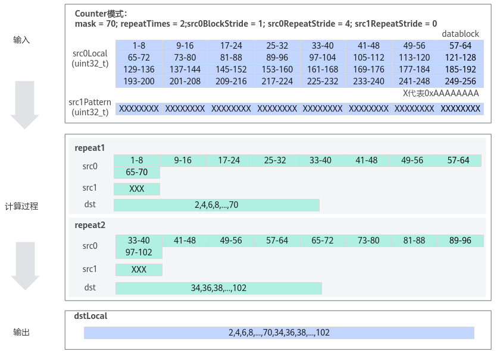
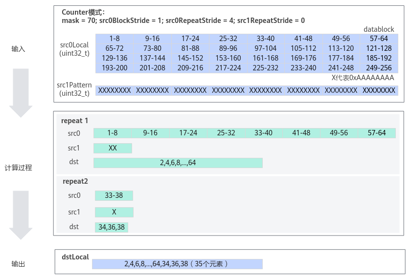

# GatherMask<a name="ZH-CN_TOPIC_0000001500267978"></a>

## 产品支持情况<a name="section1550532418810"></a>

<a name="table38301303189"></a>
<table><thead align="left"><tr id="row20831180131817"><th class="cellrowborder" valign="top" width="57.99999999999999%" id="mcps1.1.3.1.1"><p id="p1883113061818"><a name="p1883113061818"></a><a name="p1883113061818"></a><span id="ph20833205312295"><a name="ph20833205312295"></a><a name="ph20833205312295"></a>产品</span></p>
</th>
<th class="cellrowborder" align="center" valign="top" width="42%" id="mcps1.1.3.1.2"><p id="p783113012187"><a name="p783113012187"></a><a name="p783113012187"></a>是否支持</p>
</th>
</tr>
</thead>
<tbody><tr id="row1272474920205"><td class="cellrowborder" valign="top" width="57.99999999999999%" headers="mcps1.1.3.1.1 "><p id="p17301775812"><a name="p17301775812"></a><a name="p17301775812"></a><span id="ph2272194216543"><a name="ph2272194216543"></a><a name="ph2272194216543"></a>Ascend 950PR/Ascend 950DT</span></p>
</td>
<td class="cellrowborder" align="center" valign="top" width="42%" headers="mcps1.1.3.1.2 "><p id="p37256491200"><a name="p37256491200"></a><a name="p37256491200"></a>√</p>
</td>
</tr>
<tr id="row220181016240"><td class="cellrowborder" valign="top" width="57.99999999999999%" headers="mcps1.1.3.1.1 "><p id="p48327011813"><a name="p48327011813"></a><a name="p48327011813"></a><span id="ph583230201815"><a name="ph583230201815"></a><a name="ph583230201815"></a><term id="zh-cn_topic_0000001312391781_term1253731311225"><a name="zh-cn_topic_0000001312391781_term1253731311225"></a><a name="zh-cn_topic_0000001312391781_term1253731311225"></a>Atlas A3 训练系列产品</term>/<term id="zh-cn_topic_0000001312391781_term131434243115"><a name="zh-cn_topic_0000001312391781_term131434243115"></a><a name="zh-cn_topic_0000001312391781_term131434243115"></a>Atlas A3 推理系列产品</term></span></p>
</td>
<td class="cellrowborder" align="center" valign="top" width="42%" headers="mcps1.1.3.1.2 "><p id="p7948163910184"><a name="p7948163910184"></a><a name="p7948163910184"></a>√</p>
</td>
</tr>
<tr id="row173226882415"><td class="cellrowborder" valign="top" width="57.99999999999999%" headers="mcps1.1.3.1.1 "><p id="p14832120181815"><a name="p14832120181815"></a><a name="p14832120181815"></a><span id="ph1483216010188"><a name="ph1483216010188"></a><a name="ph1483216010188"></a><term id="zh-cn_topic_0000001312391781_term11962195213215"><a name="zh-cn_topic_0000001312391781_term11962195213215"></a><a name="zh-cn_topic_0000001312391781_term11962195213215"></a>Atlas A2 训练系列产品</term>/<term id="zh-cn_topic_0000001312391781_term184716139811"><a name="zh-cn_topic_0000001312391781_term184716139811"></a><a name="zh-cn_topic_0000001312391781_term184716139811"></a>Atlas A2 推理系列产品</term></span></p>
</td>
<td class="cellrowborder" align="center" valign="top" width="42%" headers="mcps1.1.3.1.2 "><p id="p19948143911820"><a name="p19948143911820"></a><a name="p19948143911820"></a>√</p>
</td>
</tr>
</tbody>
</table>

## 功能说明<a name="section618mcpsimp"></a>

以**内置固定模式**对应的二进制或者**用户自定义输入的Tensor**数值对应的二进制为gather mask（数据收集的掩码），从源操作数中选取元素写入目的操作数中。

## 函数原型<a name="section620mcpsimp"></a>

-   用户自定义模式

    ```
    template <typename T, typename U, GatherMaskMode mode = defaultGatherMaskMode>
    __aicore__ inline void GatherMask(const LocalTensor<T>& dst, const LocalTensor<T>& src0, const LocalTensor<U>& src1Pattern, const bool reduceMode, const uint32_t mask, const GatherMaskParams& gatherMaskParams, uint64_t& rsvdCnt)
    ```

-   内置固定模式

    ```
    template <typename T, GatherMaskMode mode = defaultGatherMaskMode>
    __aicore__ inline void GatherMask(const LocalTensor<T>& dst, const LocalTensor<T>& src0, const uint8_t src1Pattern, const bool reduceMode, const uint32_t mask, const GatherMaskParams& gatherMaskParams, uint64_t& rsvdCnt)
    ```

## 参数说明<a name="section622mcpsimp"></a>

**表 1**  模板参数说明

<a name="table1183814716169"></a>
<table><thead align="left"><tr id="row0838154741615"><th class="cellrowborder" valign="top" width="14.77%" id="mcps1.2.3.1.1"><p id="p683818472167"><a name="p683818472167"></a><a name="p683818472167"></a>参数名称</p>
</th>
<th class="cellrowborder" valign="top" width="85.22999999999999%" id="mcps1.2.3.1.2"><p id="p208381447161619"><a name="p208381447161619"></a><a name="p208381447161619"></a>含义</p>
</th>
</tr>
</thead>
<tbody><tr id="row166091324112514"><td class="cellrowborder" valign="top" width="14.77%" headers="mcps1.2.3.1.1 "><p id="p186091247251"><a name="p186091247251"></a><a name="p186091247251"></a>T</p>
</td>
<td class="cellrowborder" valign="top" width="85.22999999999999%" headers="mcps1.2.3.1.2 "><p id="p186091824132516"><a name="p186091824132516"></a><a name="p186091824132516"></a>源操作数src0和目的操作数dst的数据类型。</p>
<p id="p168601414125214"><a name="p168601414125214"></a><a name="p168601414125214"></a><span id="ph1886081495211"><a name="ph1886081495211"></a><a name="ph1886081495211"></a>Ascend 950PR/Ascend 950DT</span>，支持的数据类型为：int8_t/uint8_t/int16_t/uint16_t/half/bfloat16_t/float/int32_t/uint32_t</p>
<p id="p523904010149"><a name="p523904010149"></a><a name="p523904010149"></a><span id="ph16239174011416"><a name="ph16239174011416"></a><a name="ph16239174011416"></a><term id="zh-cn_topic_0000001312391781_term1253731311225_1"><a name="zh-cn_topic_0000001312391781_term1253731311225_1"></a><a name="zh-cn_topic_0000001312391781_term1253731311225_1"></a>Atlas A3 训练系列产品</term>/<term id="zh-cn_topic_0000001312391781_term131434243115_1"><a name="zh-cn_topic_0000001312391781_term131434243115_1"></a><a name="zh-cn_topic_0000001312391781_term131434243115_1"></a>Atlas A3 推理系列产品</term></span>，支持的数据类型为：half/bfloat16_t/uint16_t/int16_t/float/uint32_t/int32_t</p>
<p id="p209372313303"><a name="p209372313303"></a><a name="p209372313303"></a><span id="ph6937237308"><a name="ph6937237308"></a><a name="ph6937237308"></a><term id="zh-cn_topic_0000001312391781_term11962195213215_1"><a name="zh-cn_topic_0000001312391781_term11962195213215_1"></a><a name="zh-cn_topic_0000001312391781_term11962195213215_1"></a>Atlas A2 训练系列产品</term>/<term id="zh-cn_topic_0000001312391781_term184716139811_1"><a name="zh-cn_topic_0000001312391781_term184716139811_1"></a><a name="zh-cn_topic_0000001312391781_term184716139811_1"></a>Atlas A2 推理系列产品</term></span>，支持的数据类型为：half/bfloat16_t/uint16_t/int16_t/float/uint32_t/int32_t</p>
</td>
</tr>
<tr id="row135451522112520"><td class="cellrowborder" valign="top" width="14.77%" headers="mcps1.2.3.1.1 "><p id="p1354612213257"><a name="p1354612213257"></a><a name="p1354612213257"></a>U</p>
</td>
<td class="cellrowborder" valign="top" width="85.22999999999999%" headers="mcps1.2.3.1.2 "><p id="p125461422142510"><a name="p125461422142510"></a><a name="p125461422142510"></a>用户自定义模式下src1Pattern的数据类型。支持的数据类型为uint8_t/uint16_t/uint32_t。</p>
<a name="ul186367588592"></a><a name="ul186367588592"></a><ul id="ul186367588592"><li>当目的操作数数据类型为uint8_t/int8_t时，src1Pattern应为uint8_t数据类型。</li><li>当目的操作数数据类型为half/uint16_t/int16_t/bfloat16_t时，src1Pattern应为uint16_t数据类型。</li><li>当目的操作数数据类型为float/uint32_t/int32_t时，src1Pattern应为uint32_t数据类型。</li></ul>
</td>
</tr>
<tr id="row18381947151619"><td class="cellrowborder" valign="top" width="14.77%" headers="mcps1.2.3.1.1 "><p id="p683894716163"><a name="p683894716163"></a><a name="p683894716163"></a>mode</p>
</td>
<td class="cellrowborder" valign="top" width="85.22999999999999%" headers="mcps1.2.3.1.2 "><p id="p11838134715164"><a name="p11838134715164"></a><a name="p11838134715164"></a>预留参数，为后续功能做预留，当前提供默认值，用户无需设置该参数。</p>
</td>
</tr>
</tbody>
</table>

**表 2**  参数说明

<a name="table8955841508"></a>
<table><thead align="left"><tr id="row15956194105014"><th class="cellrowborder" valign="top" width="15.011501150115011%" id="mcps1.2.4.1.1"><p id="p7956144195014"><a name="p7956144195014"></a><a name="p7956144195014"></a>参数名称</p>
</th>
<th class="cellrowborder" valign="top" width="11.381138113811382%" id="mcps1.2.4.1.2"><p id="p1295624145013"><a name="p1295624145013"></a><a name="p1295624145013"></a>输入/输出</p>
</th>
<th class="cellrowborder" valign="top" width="73.6073607360736%" id="mcps1.2.4.1.3"><p id="p16956144145011"><a name="p16956144145011"></a><a name="p16956144145011"></a>含义</p>
</th>
</tr>
</thead>
<tbody><tr id="row5956546509"><td class="cellrowborder" valign="top" width="15.011501150115011%" headers="mcps1.2.4.1.1 "><p id="p19576531173410"><a name="p19576531173410"></a><a name="p19576531173410"></a>dst</p>
</td>
<td class="cellrowborder" valign="top" width="11.381138113811382%" headers="mcps1.2.4.1.2 "><p id="p16576163119347"><a name="p16576163119347"></a><a name="p16576163119347"></a>输出</p>
</td>
<td class="cellrowborder" valign="top" width="73.6073607360736%" headers="mcps1.2.4.1.3 "><p id="p2440144117334"><a name="p2440144117334"></a><a name="p2440144117334"></a>目的操作数。</p>
<p id="p5945720195112"><a name="p5945720195112"></a><a name="p5945720195112"></a><span id="zh-cn_topic_0000001530181537_ph173308471594"><a name="zh-cn_topic_0000001530181537_ph173308471594"></a><a name="zh-cn_topic_0000001530181537_ph173308471594"></a><span id="zh-cn_topic_0000001530181537_ph9902231466"><a name="zh-cn_topic_0000001530181537_ph9902231466"></a><a name="zh-cn_topic_0000001530181537_ph9902231466"></a><span id="zh-cn_topic_0000001530181537_ph1782115034816"><a name="zh-cn_topic_0000001530181537_ph1782115034816"></a><a name="zh-cn_topic_0000001530181537_ph1782115034816"></a>类型为<a href="LocalTensor.md">LocalTensor</a>，支持的TPosition为VECIN/VECCALC/VECOUT。</span></span></span></p>
<p id="p1685617244334"><a name="p1685617244334"></a><a name="p1685617244334"></a><span id="ph1479701815419"><a name="ph1479701815419"></a><a name="ph1479701815419"></a>LocalTensor的起始地址需要32字节对齐。</span></p>
</td>
</tr>
<tr id="row69959512410"><td class="cellrowborder" valign="top" width="15.011501150115011%" headers="mcps1.2.4.1.1 "><p id="p165761231123417"><a name="p165761231123417"></a><a name="p165761231123417"></a>src0</p>
</td>
<td class="cellrowborder" valign="top" width="11.381138113811382%" headers="mcps1.2.4.1.2 "><p id="p757693163410"><a name="p757693163410"></a><a name="p757693163410"></a>输入</p>
</td>
<td class="cellrowborder" valign="top" width="73.6073607360736%" headers="mcps1.2.4.1.3 "><p id="p189961219163411"><a name="p189961219163411"></a><a name="p189961219163411"></a>源操作数。</p>
<p id="p1854602513419"><a name="p1854602513419"></a><a name="p1854602513419"></a><span id="zh-cn_topic_0000001530181537_ph173308471594_1"><a name="zh-cn_topic_0000001530181537_ph173308471594_1"></a><a name="zh-cn_topic_0000001530181537_ph173308471594_1"></a><span id="zh-cn_topic_0000001530181537_ph9902231466_1"><a name="zh-cn_topic_0000001530181537_ph9902231466_1"></a><a name="zh-cn_topic_0000001530181537_ph9902231466_1"></a><span id="zh-cn_topic_0000001530181537_ph1782115034816_1"><a name="zh-cn_topic_0000001530181537_ph1782115034816_1"></a><a name="zh-cn_topic_0000001530181537_ph1782115034816_1"></a>类型为<a href="LocalTensor.md">LocalTensor</a>，支持的TPosition为VECIN/VECCALC/VECOUT。</span></span></span></p>
<p id="p14487102753313"><a name="p14487102753313"></a><a name="p14487102753313"></a><span id="ph16988627133315"><a name="ph16988627133315"></a><a name="ph16988627133315"></a>LocalTensor的起始地址需要32字节对齐。</span></p>
<p id="p12455132116342"><a name="p12455132116342"></a><a name="p12455132116342"></a>数据类型需要与目的操作数保持一致。</p>
</td>
</tr>
<tr id="row4956154125018"><td class="cellrowborder" valign="top" width="15.011501150115011%" headers="mcps1.2.4.1.1 "><p id="p10576203116349"><a name="p10576203116349"></a><a name="p10576203116349"></a>src1Pattern</p>
</td>
<td class="cellrowborder" valign="top" width="11.381138113811382%" headers="mcps1.2.4.1.2 "><p id="p1157693123417"><a name="p1157693123417"></a><a name="p1157693123417"></a>输入</p>
</td>
<td class="cellrowborder" valign="top" width="73.6073607360736%" headers="mcps1.2.4.1.3 "><p id="p19262048174314"><a name="p19262048174314"></a><a name="p19262048174314"></a>gather mask（数据收集的掩码），分为内置固定模式和用户自定义模式两种，根据内置固定模式对应的二进制或者用户自定义输入的Tensor数值对应的二进制从源操作数中选取元素写入目的操作数中。1为选取，0为不选取。</p>
<a name="ul10546132419271"></a><a name="ul10546132419271"></a><ul id="ul10546132419271"><li>内置固定模式：src1Pattern数据类型为uint8_t，取值范围为[1,7]，所有repeat迭代使用相同的gather mask。不支持配置src1RepeatStride。<a name="ul24853517192"></a><a name="ul24853517192"></a><ul id="ul24853517192"><li>1：01010101…0101 # 每个repeat取偶数索引元素</li><li>2：10101010…1010 # 每个repeat取奇数索引元素</li><li>3：00010001…0001 # 每个repeat内每四个元素取第一个元素</li><li>4：00100010…0010 # 每个repeat内每四个元素取第二个元素，</li><li>5：01000100…0100 # 每个repeat内每四个元素取第三个元素</li><li>6：10001000…1000 # 每个repeat内每四个元素取第四个元素</li><li>7：11111111...1111 # 每个repeat内取全部元素</li></ul>
<p id="p1760174211581"><a name="p1760174211581"></a><a name="p1760174211581"></a><span id="ph1606424588"><a name="ph1606424588"></a><a name="ph1606424588"></a>Ascend 950PR/Ascend 950DT</span>支持模式1-7</p>
<p id="p1278782254312"><a name="p1278782254312"></a><a name="p1278782254312"></a><span id="ph1787172284313"><a name="ph1787172284313"></a><a name="ph1787172284313"></a><term id="zh-cn_topic_0000001312391781_term1253731311225_2"><a name="zh-cn_topic_0000001312391781_term1253731311225_2"></a><a name="zh-cn_topic_0000001312391781_term1253731311225_2"></a>Atlas A3 训练系列产品</term>/<term id="zh-cn_topic_0000001312391781_term131434243115_2"><a name="zh-cn_topic_0000001312391781_term131434243115_2"></a><a name="zh-cn_topic_0000001312391781_term131434243115_2"></a>Atlas A3 推理系列产品</term></span>支持模式1-7</p>
<p id="p1348194411011"><a name="p1348194411011"></a><a name="p1348194411011"></a><span id="ph61181133504"><a name="ph61181133504"></a><a name="ph61181133504"></a><term id="zh-cn_topic_0000001312391781_term11962195213215_2"><a name="zh-cn_topic_0000001312391781_term11962195213215_2"></a><a name="zh-cn_topic_0000001312391781_term11962195213215_2"></a>Atlas A2 训练系列产品</term>/<term id="zh-cn_topic_0000001312391781_term184716139811_2"><a name="zh-cn_topic_0000001312391781_term184716139811_2"></a><a name="zh-cn_topic_0000001312391781_term184716139811_2"></a>Atlas A2 推理系列产品</term></span>支持模式1-7</p>
</li></ul>
<a name="ul348645181912"></a><a name="ul348645181912"></a><ul id="ul348645181912"><li>用户自定义模式：src1Pattern数据类型为LocalTensor，迭代间间隔由src1RepeatStride决定， 迭代内src1Pattern连续消耗。</li></ul>
</td>
</tr>
<tr id="row1495634115010"><td class="cellrowborder" valign="top" width="15.011501150115011%" headers="mcps1.2.4.1.1 "><p id="p759135817241"><a name="p759135817241"></a><a name="p759135817241"></a>reduceMode</p>
</td>
<td class="cellrowborder" valign="top" width="11.381138113811382%" headers="mcps1.2.4.1.2 "><p id="p1797491412352"><a name="p1797491412352"></a><a name="p1797491412352"></a>输入</p>
</td>
<td class="cellrowborder" valign="top" width="73.6073607360736%" headers="mcps1.2.4.1.3 "><p id="p62736178253"><a name="p62736178253"></a><a name="p62736178253"></a>用于选择mask参数模式，数据类型为bool，支持如下取值。</p>
<a name="ul10273191772513"></a><a name="ul10273191772513"></a><ul id="ul10273191772513"><li>false：Normal模式。该模式下，每次repeat操作256Bytes数据，总的数据计算量为repeatTimes  * 256Bytes。<a name="ul49125015105"></a><a name="ul49125015105"></a><ul id="ul49125015105"><li>mask参数无效，建议设置为0。</li><li>按需配置repeatTimes、src0BlockStride、src0RepeatStride参数。</li><li>支持src1Pattern配置为内置固定模式或用户自定义模式。用户自定义模式下可根据实际情况配置src1RepeatStride。</li></ul>
</li><li>true：Counter模式。根据mask等参数含义的不同，该模式有以下两种配置方式：<a name="ul16648161913568"></a><a name="ul16648161913568"></a><ul id="ul16648161913568"><li><a href="#fig126588515614">配置方式一</a>：每次repeat操作mask个元素，总的数据计算量为repeatTimes * mask个元素。<a name="ul1472574218223"></a><a name="ul1472574218223"></a><ul id="ul1472574218223"><li>mask值配置为每一次repeat计算的元素个数。</li><li>按需配置repeatTimes、src0BlockStride、src0RepeatStride参数。</li><li>支持src1Pattern配置为内置固定模式或用户自定义模式。用户自定义模式下可根据实际情况配置src1RepeatStride。</li></ul>
</li><li><a href="#fig13219248171214">配置方式二</a>：总的数据计算量为mask个元素。<a name="ul226118593296"></a><a name="ul226118593296"></a><ul id="ul226118593296"><li>mask配置为总的数据计算量。</li><li>repeatTimes值不生效，指令的迭代次数由源操作数和mask共同决定。</li><li>按需配置src0BlockStride、src0RepeatStride参数。</li><li>支持src1Pattern配置为内置固定模式或用户自定义模式。用户自定义模式下可根据实际情况配置src1RepeatStride。</li></ul>
</li></ul>
<p id="p8218151033115"><a name="p8218151033115"></a><a name="p8218151033115"></a><span id="ph1421821073119"><a name="ph1421821073119"></a><a name="ph1421821073119"></a>Ascend 950PR/Ascend 950DT</span>，支持配置方式一</p>
<p id="p82181610183118"><a name="p82181610183118"></a><a name="p82181610183118"></a><span id="ph121812101314"><a name="ph121812101314"></a><a name="ph121812101314"></a><term id="zh-cn_topic_0000001312391781_term1253731311225_3"><a name="zh-cn_topic_0000001312391781_term1253731311225_3"></a><a name="zh-cn_topic_0000001312391781_term1253731311225_3"></a>Atlas A3 训练系列产品</term>/<term id="zh-cn_topic_0000001312391781_term131434243115_3"><a name="zh-cn_topic_0000001312391781_term131434243115_3"></a><a name="zh-cn_topic_0000001312391781_term131434243115_3"></a>Atlas A3 推理系列产品</term></span>，支持配置方式一</p>
<p id="p1421891033117"><a name="p1421891033117"></a><a name="p1421891033117"></a><span id="ph5218310133120"><a name="ph5218310133120"></a><a name="ph5218310133120"></a><term id="zh-cn_topic_0000001312391781_term11962195213215_3"><a name="zh-cn_topic_0000001312391781_term11962195213215_3"></a><a name="zh-cn_topic_0000001312391781_term11962195213215_3"></a>Atlas A2 训练系列产品</term>/<term id="zh-cn_topic_0000001312391781_term184716139811_3"><a name="zh-cn_topic_0000001312391781_term184716139811_3"></a><a name="zh-cn_topic_0000001312391781_term184716139811_3"></a>Atlas A2 推理系列产品</term></span>，支持配置方式一</p>
</li></ul>
</td>
</tr>
<tr id="row769135514428"><td class="cellrowborder" valign="top" width="15.011501150115011%" headers="mcps1.2.4.1.1 "><p id="p2554141321313"><a name="p2554141321313"></a><a name="p2554141321313"></a>mask</p>
</td>
<td class="cellrowborder" valign="top" width="11.381138113811382%" headers="mcps1.2.4.1.2 "><p id="p10535746191515"><a name="p10535746191515"></a><a name="p10535746191515"></a>输入</p>
</td>
<td class="cellrowborder" valign="top" width="73.6073607360736%" headers="mcps1.2.4.1.3 "><p id="p172351037102910"><a name="p172351037102910"></a><a name="p172351037102910"></a>用于控制每次迭代内参与计算的元素。根据reduceMode，分为两种模式：</p>
<a name="ul1423503712296"></a><a name="ul1423503712296"></a><ul id="ul1423503712296"><li>Normal模式：mask无效，建议设置为0。</li><li>Counter模式：取值范围[1, 2<sup id="sup1623122513394"><a name="sup1623122513394"></a><a name="sup1623122513394"></a>32</sup> – 1]。不同的版本型号Counter模式下，mask参数表示含义不同。具体配置规则参考上文reduceMode参数描述。</li></ul>
</td>
</tr>
<tr id="row191624543910"><td class="cellrowborder" valign="top" width="15.011501150115011%" headers="mcps1.2.4.1.1 "><p id="p196731955113212"><a name="p196731955113212"></a><a name="p196731955113212"></a>gatherMaskParams</p>
</td>
<td class="cellrowborder" valign="top" width="11.381138113811382%" headers="mcps1.2.4.1.2 "><p id="p172551556134814"><a name="p172551556134814"></a><a name="p172551556134814"></a>输入</p>
</td>
<td class="cellrowborder" valign="top" width="73.6073607360736%" headers="mcps1.2.4.1.3 "><p id="p14392183311346"><a name="p14392183311346"></a><a name="p14392183311346"></a>控制操作数地址步长的数据结构，GatherMaskParams类型。</p>
<p id="p395104375712"><a name="p395104375712"></a><a name="p395104375712"></a>具体定义请参考<span id="ph10562197165916"><a name="ph10562197165916"></a><a name="ph10562197165916"></a>${INSTALL_DIR}</span>/include/ascendc/basic_api/interface/kernel_struct_gather.h，<span id="ph14322531015"><a name="ph14322531015"></a><a name="ph14322531015"></a>${INSTALL_DIR}</span>请替换为CANN软件安装后文件存储路径。</p>
<p id="p1480184218455"><a name="p1480184218455"></a><a name="p1480184218455"></a>具体参数说明<a href="#table1940815635619">表3</a>。</p>
</td>
</tr>
<tr id="row17825055390"><td class="cellrowborder" valign="top" width="15.011501150115011%" headers="mcps1.2.4.1.1 "><p id="p1748419124336"><a name="p1748419124336"></a><a name="p1748419124336"></a>rsvdCnt</p>
</td>
<td class="cellrowborder" valign="top" width="11.381138113811382%" headers="mcps1.2.4.1.2 "><p id="p7880174717266"><a name="p7880174717266"></a><a name="p7880174717266"></a>输出</p>
</td>
<td class="cellrowborder" valign="top" width="73.6073607360736%" headers="mcps1.2.4.1.3 "><p id="p167716569333"><a name="p167716569333"></a><a name="p167716569333"></a>该条指令筛选后保留下来的元素计数，对应dstLocal中有效元素个数，数据类型为uint64_t。</p>
</td>
</tr>
</tbody>
</table>

**表 3**  GatherMaskParams结构体参数说明

<a name="table1940815635619"></a>
<table><thead align="left"><tr id="row1940813563564"><th class="cellrowborder" valign="top" width="16.689999999999998%" id="mcps1.2.3.1.1"><p id="p1408155635620"><a name="p1408155635620"></a><a name="p1408155635620"></a>参数名称</p>
</th>
<th class="cellrowborder" valign="top" width="83.31%" id="mcps1.2.3.1.2"><p id="p0409115655616"><a name="p0409115655616"></a><a name="p0409115655616"></a>含义</p>
</th>
</tr>
</thead>
<tbody><tr id="row1134410193199"><td class="cellrowborder" valign="top" width="16.689999999999998%" headers="mcps1.2.3.1.1 "><p id="p13581618135319"><a name="p13581618135319"></a><a name="p13581618135319"></a>src0BlockStride</p>
</td>
<td class="cellrowborder" valign="top" width="83.31%" headers="mcps1.2.3.1.2 "><p id="p9474135519562"><a name="p9474135519562"></a><a name="p9474135519562"></a>用于设置src0同一迭代不同DataBlock间的地址步长（起始地址之间的间隔）。单位为<span>DataBlock。</span></p>
</td>
</tr>
<tr id="row340910561569"><td class="cellrowborder" valign="top" width="16.689999999999998%" headers="mcps1.2.3.1.1 "><p id="p1618413331539"><a name="p1618413331539"></a><a name="p1618413331539"></a>repeatTimes</p>
</td>
<td class="cellrowborder" valign="top" width="83.31%" headers="mcps1.2.3.1.2 "><p id="p67791215175412"><a name="p67791215175412"></a><a name="p67791215175412"></a>迭代次数。</p>
</td>
</tr>
<tr id="row650811625310"><td class="cellrowborder" valign="top" width="16.689999999999998%" headers="mcps1.2.3.1.1 "><p id="p250817160535"><a name="p250817160535"></a><a name="p250817160535"></a>src0RepeatStride</p>
</td>
<td class="cellrowborder" valign="top" width="83.31%" headers="mcps1.2.3.1.2 "><p id="p204741950721"><a name="p204741950721"></a><a name="p204741950721"></a>用于设置src0相邻迭代间的地址步长（起始地址之间的间隔）。单位为<span>DataBlock。</span></p>
</td>
</tr>
<tr id="row154091456105618"><td class="cellrowborder" valign="top" width="16.689999999999998%" headers="mcps1.2.3.1.1 "><p id="p119721955135316"><a name="p119721955135316"></a><a name="p119721955135316"></a>src1RepeatStride</p>
</td>
<td class="cellrowborder" valign="top" width="83.31%" headers="mcps1.2.3.1.2 "><p id="p64091356135614"><a name="p64091356135614"></a><a name="p64091356135614"></a>用于设置src1相邻迭代间的地址步长（起始地址之间的间隔）。单位为<span>DataBlock。</span></p>
</td>
</tr>
</tbody>
</table>

## 返回值说明<a name="section198548421851"></a>

无

## 约束说明<a name="section633mcpsimp"></a>

-   操作数地址对齐要求请参见[通用地址对齐约束](通用说明和约束.md#section796754519912)。
-   操作数地址重叠约束请参考[通用地址重叠约束](通用说明和约束.md#section668772811100)。

-   若调用该接口前为Counter模式，在调用该接口后需要显式设置回Counter模式（接口内部执行结束后会设置为Normal模式）。

## 调用示例<a name="section642mcpsimp"></a>

-   用户自定义Tensor样例

    ```
    #include "kernel_operator.h"
    class KernelGatherMask {
    public:
        __aicore__ inline KernelGatherMask () {}
        __aicore__ inline void Init(__gm__ uint8_t* src0Gm, __gm__ uint8_t* src1Gm, __gm__ uint8_t* dstGm)
        {
            src0Global.SetGlobalBuffer((__gm__ uint32_t*)src0Gm);
            src1Global.SetGlobalBuffer((__gm__ uint32_t*)src1Gm);
            dstGlobal.SetGlobalBuffer((__gm__ uint32_t*)dstGm);
            pipe.InitBuffer(inQueueSrc0, 1, 256 * sizeof(uint32_t));
            pipe.InitBuffer(inQueueSrc1, 1, 8 * sizeof(uint32_t));
            pipe.InitBuffer(outQueueDst, 1, 256 * sizeof(uint32_t));
        }
        __aicore__ inline void Process()
        {
            CopyIn();
            Compute();
            CopyOut();
        }
    private:
        __aicore__ inline void CopyIn()
        {
            AscendC::LocalTensor<uint32_t> src0Local = inQueueSrc0.AllocTensor<uint32_t>();
            AscendC::LocalTensor<uint32_t> src1Local = inQueueSrc1.AllocTensor<uint32_t>();
            AscendC::DataCopy(src0Local, src0Global, 256);
            AscendC::DataCopy(src1Local, src1Global, 32);
            inQueueSrc0.EnQue(src0Local);
            inQueueSrc1.EnQue(src1Local);
        }
        __aicore__ inline void Compute()
        {
            AscendC::LocalTensor<uint32_t> src0Local = inQueueSrc0.DeQue<uint32_t>();
            AscendC::LocalTensor<uint32_t> src1Local = inQueueSrc1.DeQue<uint32_t>();
            AscendC::LocalTensor<uint32_t> dstLocal = outQueueDst.AllocTensor<uint32_t>();
            uint32_t mask = 70;
           uint64_t rsvdCnt = 0;
            // reduceMode = true;    使用Counter模式
            // src0BlockStride = 1;  单次迭代内数据间隔1个datablock，即数据连续读取和写入
            // repeatTimes = 2;      Counter模式时，仅在部分产品型号下会生效
            // src0RepeatStride = 4; 源操作数迭代间数据间隔4个datablock
            // src1RepeatStride = 0; src1迭代间数据间隔0个datablock，即原位置读取
            AscendC::GatherMask (dstLocal, src0Local, src1Local, true, mask, { 1, 2, 4, 0 }, rsvdCnt);
            outQueueDst.EnQue<uint32_t>(dstLocal);
            inQueueSrc0.FreeTensor(src0Local);
            inQueueSrc1.FreeTensor(src1Local);
        }
        __aicore__ inline void CopyOut()
        {
            AscendC::LocalTensor<uint32_t> dstLocal = outQueueDst.DeQue<uint32_t>();
            AscendC::DataCopy(dstGlobal, dstLocal, 256);
            outQueueDst.FreeTensor(dstLocal);
        }
    private:
        AscendC::TPipe pipe;
        AscendC::TQue<AscendC::TPosition::VECIN, 1> inQueueSrc0, inQueueSrc1;
        AscendC::TQue<AscendC::TPosition::VECOUT, 1> outQueueDst;
        AscendC::GlobalTensor<uint32_t> src0Global, src1Global, dstGlobal;
    };
    extern "C" __global__ __aicore__ void gather_mask_simple_kernel(__gm__ uint8_t* src0Gm, __gm__ uint8_t* src1Gm, __gm__ uint8_t* dstGm)
    {
        KernelGatherMask op;
        op.Init(src0Gm, src1Gm, dstGm);
        op.Process();
    }
    ```

    下图为Counter模式配置方式一示意图：

    -   mask = 70，每一次repeat计算70个元素；
    -   repeatTimes = 2，共进行2次repeat；
    -   src0BlockStride = 1，源操作数src0Local单次迭代内datablock之间无间隔；
    -   src0RepeatStride = 4，源操作数src0Local相邻迭代间的间隔为4个datablock，所以第二次repeat从第33个元素开始处理。
    -   src1Pattern配置为用户自定义模式。src1RepeatStride = 0，src1Pattern相邻迭代间的间隔为0个datablock，所以第二次repeat仍从src1Pattern的首地址开始处理。

    **图 1**  Counter模式配置方式一示意图<a name="fig126588515614"></a>  
    

    下图为Counter模式配置方式二示意图：

    -   mask = 70，一共计算70个元素；
    -   repeatTimes配置不生效，根据源操作数和mask自动推断：源操作数的数据类型为uint32\_t，每个迭代处理256Bytes数据，一个迭代处理64个元素，共需要进行2次repeat；
    -   src0BlockStride = 1，源操作数src0Local单次迭代内datablock之间无间隔；
    -   src0RepeatStride = 4，源操作数src0Local相邻迭代间的间隔为4个datablock，所以第二次repeat从第33个元素开始处理。
    -   src1Pattern配置为用户自定义模式。src1RepeatStride = 0，src1Pattern相邻迭代间的间隔为0个datablock，所以第二次repeat仍从src1Pattern的首地址开始处理。

    **图 2**  Counter模式配置方式二示意图<a name="fig13219248171214"></a>  
    

-   内置固定模式

    ```
    #include "kernel_operator.h"
    class KernelGatherMask {
    public:
        __aicore__ inline KernelGatherMask () {}
        __aicore__ inline void Init(__gm__ uint8_t* src0Gm, __gm__ uint8_t* dstGm)
        {
            src0Global.SetGlobalBuffer((__gm__ uint16_t*)src0Gm);
            dstGlobal.SetGlobalBuffer((__gm__ uint16_t*)dstGm);
            pipe.InitBuffer(inQueueSrc0, 1, 128 * sizeof(uint16_t));
            pipe.InitBuffer(outQueueDst, 1, 128 * sizeof(uint16_t));
        }
        __aicore__ inline void Process()
        {
            CopyIn();
            Compute();
            CopyOut();
        }
    private:
        __aicore__ inline void CopyIn()
        {
            AscendC::LocalTensor<uint16_t> src0Local = inQueueSrc0.AllocTensor<uint16_t>();
            AscendC::DataCopy(src0Local, src0Global, 128);
            inQueueSrc0.EnQue(src0Local);
        }
        __aicore__ inline void Compute()
        {
            AscendC::LocalTensor<uint16_t> src0Local = inQueueSrc0.DeQue<uint16_t>();
            AscendC::LocalTensor<uint16_t> dstLocal = outQueueDst.AllocTensor<uint16_t>();
     
            uint32_t mask = 0; // normal模式下mask建议设置为0
            uint64_t rsvdCnt = 0; // 用于保存筛选后保留下来的元素个数
            uint8_t src1Pattern = 2; // 内置固定模式
            // reduceMode = false; 使用normal模式
            // src0BlockStride = 1; 单次迭代内数据间隔1个Block，即数据连续读取和写入
            // repeatTimes = 1;重复迭代一次
            // src0RepeatStride = 0;重复一次，故设置为0
            // src1RepeatStride = 0;重复一次，故设置为0
            AscendC::GatherMask(dstLocal, src0Local, src1Pattern, false, mask, { 1, 1, 0, 0 }, rsvdCnt);
     
            outQueueDst.EnQue<uint16_t>(dstLocal);
            inQueueSrc0.FreeTensor(src0Local);
        }
        __aicore__ inline void CopyOut()
        {
            AscendC::LocalTensor<uint16_t> dstLocal = outQueueDst.DeQue<uint16_t>();
            
            AscendC::DataCopy(dstGlobal, dstLocal, 128);
            outQueueDst.FreeTensor(dstLocal);
        }
    private:
        AscendC::TPipe pipe;
        AscendC::TQue<AscendC::TPosition::VECIN, 1> inQueueSrc0;
        AscendC::TQue<AscendC::TPosition::VECOUT, 1> outQueueDst;
        AscendC::GlobalTensor<uint16_t> src0Global, dstGlobal;
    };
     
    extern "C" __global__ __aicore__ void gather_mask_simple_kernel(__gm__ uint8_t* src0Gm, __gm__ uint8_t* dstGm)
    {
        KernelGatherMask op;
        op.Init(src0Gm, dstGm);
        op.Process();
    }
    ```

    结果示例如下：

    ```
    输入数据src0Local：[1 2 3 ... 128]
    输入数据src1Pattern：src1Pattern = 2;
    输出数据dstLocal：[2 4 6 8 10 12 14 16 18 20 22 24 26 28 30 32 34 36 38 40 42 44 46 48 50 52 54 56 58 60 62 64 66 68 70 72 74 76 78 80 82 84 86 88 90 92 94 96 98 100 102 104 106 108 110 112 114 116 118 120 122 124 126 128 undefined ..undefined]
    输出数据rsvdCnt：64
    ```

