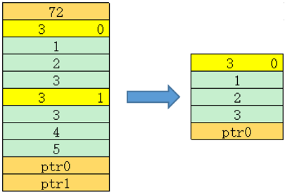

# GetDataPtr<a name="ZH-CN_TOPIC_0000002306338962"></a>

## AI处理器支持情况<a name="section73648168211"></a>

<a name="table38301303189"></a>
<table><thead align="left"><tr id="row20831180131817"><th class="cellrowborder" valign="top" width="57.99999999999999%" id="mcps1.1.3.1.1"><p id="p1883113061818"><a name="p1883113061818"></a><a name="p1883113061818"></a><span id="ph20833205312295"><a name="ph20833205312295"></a><a name="ph20833205312295"></a>AI处理器类型</span></p>
</th>
<th class="cellrowborder" align="center" valign="top" width="42%" id="mcps1.1.3.1.2"><p id="p783113012187"><a name="p783113012187"></a><a name="p783113012187"></a>是否支持</p>
</th>
</tr>
</thead>
<tbody><tr id="row220181016240"><td class="cellrowborder" valign="top" width="57.99999999999999%" headers="mcps1.1.3.1.1 "><p id="p48327011813"><a name="p48327011813"></a><a name="p48327011813"></a><span id="ph583230201815"><a name="ph583230201815"></a><a name="ph583230201815"></a><term id="zh-cn_topic_0000001312391781_term1253731311225"><a name="zh-cn_topic_0000001312391781_term1253731311225"></a><a name="zh-cn_topic_0000001312391781_term1253731311225"></a>Ascend 910C</term></span></p>
</td>
<td class="cellrowborder" align="center" valign="top" width="42%" headers="mcps1.1.3.1.2 "><p id="p7948163910184"><a name="p7948163910184"></a><a name="p7948163910184"></a>√</p>
</td>
</tr>
<tr id="row173226882415"><td class="cellrowborder" valign="top" width="57.99999999999999%" headers="mcps1.1.3.1.1 "><p id="p14832120181815"><a name="p14832120181815"></a><a name="p14832120181815"></a><span id="ph1483216010188"><a name="ph1483216010188"></a><a name="ph1483216010188"></a><term id="zh-cn_topic_0000001312391781_term11962195213215"><a name="zh-cn_topic_0000001312391781_term11962195213215"></a><a name="zh-cn_topic_0000001312391781_term11962195213215"></a>Ascend 910B</term></span></p>
</td>
<td class="cellrowborder" align="center" valign="top" width="42%" headers="mcps1.1.3.1.2 "><p id="p19948143911820"><a name="p19948143911820"></a><a name="p19948143911820"></a>√</p>
</td>
</tr>
</tbody>
</table>

## 功能说明<a name="zh-cn_topic_0000002078447573_zh-cn_topic_0000001576806829_zh-cn_topic_0000001339187720_section36583473819"></a>

获取储存Tensor数据地址。

## 函数原型<a name="zh-cn_topic_0000002078447573_zh-cn_topic_0000001576806829_zh-cn_topic_0000001339187720_section13230182415108"></a>

```
T* GetDataPtr()
```

## 参数说明<a name="zh-cn_topic_0000002078447573_zh-cn_topic_0000001576806829_zh-cn_topic_0000001339187720_section75395119104"></a>

无

## 返回值说明<a name="zh-cn_topic_0000002078447573_zh-cn_topic_0000001576806829_zh-cn_topic_0000001339187720_section25791320141317"></a>

返回储存Tensor数据地址。T数据类型。

## 约束说明<a name="zh-cn_topic_0000002078447573_zh-cn_topic_0000001576806829_zh-cn_topic_0000001339187720_section19165124931511"></a>

无

## 调用示例<a name="zh-cn_topic_0000002078447573_zh-cn_topic_0000001576806829_zh-cn_topic_0000001339187720_section320753512363"></a>

示例中待解析的srcGm内存排布如下图所示：



```
AscendC::ListTensorDesc listTensorDesc(reinterpret_cast<__gm__ void *>(srcGm)); // srcGm为待解析的gm地址
uint32_t size = listTensorDesc.GetSize();                                       // size = 2
auto dataPtr0 = listTensorDesc.GetDataPtr<int32_t>(0);                          // 获取ptr0
auto dataPtr1 = listTensorDesc.GetDataPtr<int32_t>(1);                          // 获取ptr1

uint64_t buf[100] = {0}; // 示例中Tensor的dim为3, 此处的100表示预留足够大的空间
AscendC::TensorDesc<int32_t> desc;
desc.SetShapeAddr(buf);          // 为desc指定用于储存shape信息的地址
listTensorDesc.GetDesc(desc, 0); // 获取索引0的shape信息

uint64_t dim = desc.GetDim();   // dim = 3
uint64_t idx = desc.GetIndex(); // idx = 0
uint64_t shape[3] = {0};
for (uint32_t i = 0; i < desc.GetDim(); i++)
{
    shape[i] = desc.GetShape(i); // GetShape(0) = 1, GetShape(1) = 2, GetShape(2) = 3
}
auto ptr = desc.GetDataPtr();
```

