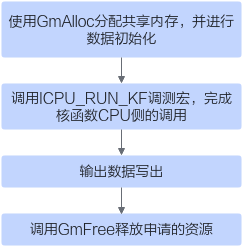

# ICPU\_RUN\_KF<a name="ZH-CN_TOPIC_0000002080882157"></a>

## AI处理器支持情况<a name="section1550532418810"></a>

<a name="table38301303189"></a>
<table><thead align="left"><tr id="row20831180131817"><th class="cellrowborder" valign="top" width="57.99999999999999%" id="mcps1.1.3.1.1"><p id="p1883113061818"><a name="p1883113061818"></a><a name="p1883113061818"></a><span id="ph20833205312295"><a name="ph20833205312295"></a><a name="ph20833205312295"></a>AI处理器类型</span></p>
</th>
<th class="cellrowborder" align="center" valign="top" width="42%" id="mcps1.1.3.1.2"><p id="p783113012187"><a name="p783113012187"></a><a name="p783113012187"></a>是否支持</p>
</th>
</tr>
</thead>
<tbody><tr id="row220181016240"><td class="cellrowborder" valign="top" width="57.99999999999999%" headers="mcps1.1.3.1.1 "><p id="p48327011813"><a name="p48327011813"></a><a name="p48327011813"></a><span id="ph583230201815"><a name="ph583230201815"></a><a name="ph583230201815"></a><term id="zh-cn_topic_0000001312391781_term1253731311225"><a name="zh-cn_topic_0000001312391781_term1253731311225"></a><a name="zh-cn_topic_0000001312391781_term1253731311225"></a>Ascend 910C</term></span></p>
</td>
<td class="cellrowborder" align="center" valign="top" width="42%" headers="mcps1.1.3.1.2 "><p id="p7948163910184"><a name="p7948163910184"></a><a name="p7948163910184"></a>√</p>
</td>
</tr>
<tr id="row173226882415"><td class="cellrowborder" valign="top" width="57.99999999999999%" headers="mcps1.1.3.1.1 "><p id="p14832120181815"><a name="p14832120181815"></a><a name="p14832120181815"></a><span id="ph1483216010188"><a name="ph1483216010188"></a><a name="ph1483216010188"></a><term id="zh-cn_topic_0000001312391781_term11962195213215"><a name="zh-cn_topic_0000001312391781_term11962195213215"></a><a name="zh-cn_topic_0000001312391781_term11962195213215"></a>Ascend 910B</term></span></p>
</td>
<td class="cellrowborder" align="center" valign="top" width="42%" headers="mcps1.1.3.1.2 "><p id="p19948143911820"><a name="p19948143911820"></a><a name="p19948143911820"></a>√</p>
</td>
</tr>
</tbody>
</table>

## 功能说明<a name="zh-cn_topic_0000001963799134_zh-cn_topic_0000001541924164_section259105813316"></a>

进行核函数的CPU侧运行验证时，CPU调测总入口，完成CPU侧的算子程序调用。

## 函数原型<a name="zh-cn_topic_0000001963799134_zh-cn_topic_0000001541924164_section2067518173415"></a>

```
#define ICPU_RUN_KF(func, blkdim, ...)
```

## 参数说明<a name="zh-cn_topic_0000001963799134_zh-cn_topic_0000001541924164_section158061867342"></a>

<a name="zh-cn_topic_0000001963799134_zh-cn_topic_0000001541924164_zh-cn_topic_0235751031_table33761356"></a>
<table><thead align="left"><tr id="zh-cn_topic_0000001963799134_zh-cn_topic_0000001541924164_zh-cn_topic_0235751031_row27598891"><th class="cellrowborder" valign="top" width="16.49%" id="mcps1.1.4.1.1"><p id="zh-cn_topic_0000001963799134_zh-cn_topic_0000001541924164_zh-cn_topic_0235751031_p20917673"><a name="zh-cn_topic_0000001963799134_zh-cn_topic_0000001541924164_zh-cn_topic_0235751031_p20917673"></a><a name="zh-cn_topic_0000001963799134_zh-cn_topic_0000001541924164_zh-cn_topic_0235751031_p20917673"></a>参数名</p>
</th>
<th class="cellrowborder" valign="top" width="11.93%" id="mcps1.1.4.1.2"><p id="zh-cn_topic_0000001963799134_zh-cn_topic_0000001541924164_zh-cn_topic_0235751031_p16609919"><a name="zh-cn_topic_0000001963799134_zh-cn_topic_0000001541924164_zh-cn_topic_0235751031_p16609919"></a><a name="zh-cn_topic_0000001963799134_zh-cn_topic_0000001541924164_zh-cn_topic_0235751031_p16609919"></a>输入/输出</p>
</th>
<th class="cellrowborder" valign="top" width="71.58%" id="mcps1.1.4.1.3"><p id="zh-cn_topic_0000001963799134_zh-cn_topic_0000001541924164_zh-cn_topic_0235751031_p59995477"><a name="zh-cn_topic_0000001963799134_zh-cn_topic_0000001541924164_zh-cn_topic_0235751031_p59995477"></a><a name="zh-cn_topic_0000001963799134_zh-cn_topic_0000001541924164_zh-cn_topic_0235751031_p59995477"></a>描述</p>
</th>
</tr>
</thead>
<tbody><tr id="zh-cn_topic_0000001963799134_zh-cn_topic_0000001541924164_row42461942101815"><td class="cellrowborder" valign="top" width="16.49%" headers="mcps1.1.4.1.1 "><p id="zh-cn_topic_0000001963799134_zh-cn_topic_0000001541924164_p284425844311"><a name="zh-cn_topic_0000001963799134_zh-cn_topic_0000001541924164_p284425844311"></a><a name="zh-cn_topic_0000001963799134_zh-cn_topic_0000001541924164_p284425844311"></a>func</p>
</td>
<td class="cellrowborder" valign="top" width="11.93%" headers="mcps1.1.4.1.2 "><p id="zh-cn_topic_0000001963799134_zh-cn_topic_0000001541924164_p158449584436"><a name="zh-cn_topic_0000001963799134_zh-cn_topic_0000001541924164_p158449584436"></a><a name="zh-cn_topic_0000001963799134_zh-cn_topic_0000001541924164_p158449584436"></a>输入</p>
</td>
<td class="cellrowborder" valign="top" width="71.58%" headers="mcps1.1.4.1.3 "><p id="zh-cn_topic_0000001963799134_zh-cn_topic_0000001541924164_p297233812230"><a name="zh-cn_topic_0000001963799134_zh-cn_topic_0000001541924164_p297233812230"></a><a name="zh-cn_topic_0000001963799134_zh-cn_topic_0000001541924164_p297233812230"></a>算子的kernel函数指针。</p>
</td>
</tr>
<tr id="zh-cn_topic_0000001963799134_zh-cn_topic_0000001541924164_row8219113874910"><td class="cellrowborder" valign="top" width="16.49%" headers="mcps1.1.4.1.1 "><p id="zh-cn_topic_0000001963799134_zh-cn_topic_0000001541924164_p16219938104918"><a name="zh-cn_topic_0000001963799134_zh-cn_topic_0000001541924164_p16219938104918"></a><a name="zh-cn_topic_0000001963799134_zh-cn_topic_0000001541924164_p16219938104918"></a>blkdim</p>
</td>
<td class="cellrowborder" valign="top" width="11.93%" headers="mcps1.1.4.1.2 "><p id="zh-cn_topic_0000001963799134_zh-cn_topic_0000001541924164_p17219113894919"><a name="zh-cn_topic_0000001963799134_zh-cn_topic_0000001541924164_p17219113894919"></a><a name="zh-cn_topic_0000001963799134_zh-cn_topic_0000001541924164_p17219113894919"></a>输入</p>
</td>
<td class="cellrowborder" valign="top" width="71.58%" headers="mcps1.1.4.1.3 "><p id="zh-cn_topic_0000001963799134_zh-cn_topic_0000001541924164_p1721973834915"><a name="zh-cn_topic_0000001963799134_zh-cn_topic_0000001541924164_p1721973834915"></a><a name="zh-cn_topic_0000001963799134_zh-cn_topic_0000001541924164_p1721973834915"></a>算子的核心数，corenum。</p>
</td>
</tr>
<tr id="zh-cn_topic_0000001963799134_zh-cn_topic_0000001541924164_row14935161035014"><td class="cellrowborder" valign="top" width="16.49%" headers="mcps1.1.4.1.1 "><p id="zh-cn_topic_0000001963799134_zh-cn_topic_0000001541924164_p9935110175011"><a name="zh-cn_topic_0000001963799134_zh-cn_topic_0000001541924164_p9935110175011"></a><a name="zh-cn_topic_0000001963799134_zh-cn_topic_0000001541924164_p9935110175011"></a>...</p>
</td>
<td class="cellrowborder" valign="top" width="11.93%" headers="mcps1.1.4.1.2 "><p id="zh-cn_topic_0000001963799134_zh-cn_topic_0000001541924164_p199351310145011"><a name="zh-cn_topic_0000001963799134_zh-cn_topic_0000001541924164_p199351310145011"></a><a name="zh-cn_topic_0000001963799134_zh-cn_topic_0000001541924164_p199351310145011"></a>输入</p>
</td>
<td class="cellrowborder" valign="top" width="71.58%" headers="mcps1.1.4.1.3 "><p id="zh-cn_topic_0000001963799134_zh-cn_topic_0000001541924164_p79351710125012"><a name="zh-cn_topic_0000001963799134_zh-cn_topic_0000001541924164_p79351710125012"></a><a name="zh-cn_topic_0000001963799134_zh-cn_topic_0000001541924164_p79351710125012"></a>所有的入参和出参，依次填入，当前参数个数限制为32个，超出32时会出现编译错误。</p>
</td>
</tr>
</tbody>
</table>

## 返回值说明<a name="zh-cn_topic_0000001963799134_zh-cn_topic_0000001541924164_section640mcpsimp"></a>

无

## 约束说明<a name="zh-cn_topic_0000001963799134_zh-cn_topic_0000001541924164_section794123819592"></a>

除了func、blkdim以外，其他的变量都必须是通过GmAlloc分配的共享内存的指针；传入的参数的数量和顺序都必须和kernel保持一致。

## 调用示例<a name="zh-cn_topic_0000001963799134_zh-cn_topic_0000001541924164_section82241477610"></a>

下面代码以add\_custom算子为例，介绍算子核函数在CPU侧验证时，算子调用的应用程序如何编写。您在实现自己的应用程序时，需要关注由于算子核函数不同带来的修改，包括算子核函数名，入参出参的不同等，合理安排相应的内存分配、内存拷贝和文件读写等，相关API的调用方式直接复用即可。

1.  按需包含头文件，通过ASCENDC\_CPU\_DEBUG宏区分CPU和NPU侧需要包含的头文件。

    ```
    #include "data_utils.h"
    #ifndef ASCENDC_CPU_DEBUG
    #include "acl/acl.h"
    #else
    #include "tikicpulib.h"
    extern "C" __global__ __aicore__ void add_custom(GM_ADDR x, GM_ADDR y, GM_ADDR z); // 核函数声明
    #endif
    ```

2.  CPU侧运行验证。完成算子核函数CPU侧运行验证的步骤如下：

    **图 1**  CPU侧运行验证步骤<a name="fig13576112114442"></a>  
    

    ```
    int32_t main(int32_t argc, char* argv[])
    {
        uint32_t blockDim = 8;
        size_t inputByteSize = 8 * 2048 * sizeof(uint16_t);
        size_t outputByteSize = 8 * 2048 * sizeof(uint16_t);
    
       // 使用GmAlloc分配共享内存，并进行数据初始化
        uint8_t* x = (uint8_t*)AscendC::GmAlloc(inputByteSize);
        uint8_t* y = (uint8_t*)AscendC::GmAlloc(inputByteSize);
        uint8_t* z = (uint8_t*)AscendC::GmAlloc(outputByteSize);
    
        ReadFile("./input/input_x.bin", inputByteSize, x, inputByteSize);
        ReadFile("./input/input_y.bin", inputByteSize, y, inputByteSize);
        // 矢量算子需要设置内核模式为AIV模式
        AscendC::SetKernelMode(KernelMode::AIV_MODE);
        // 调用ICPU_RUN_KF调测宏，完成核函数CPU侧的调用
        ICPU_RUN_KF(add_custom, blockDim, x, y, z);
        // 输出数据写出
        WriteFile("./output/output_z.bin", z, outputByteSize);
        // 调用GmFree释放申请的资源
        AscendC::GmFree((void *)x);
        AscendC::GmFree((void *)y);
        AscendC::GmFree((void *)z);
        return 0;
    }
    ```

