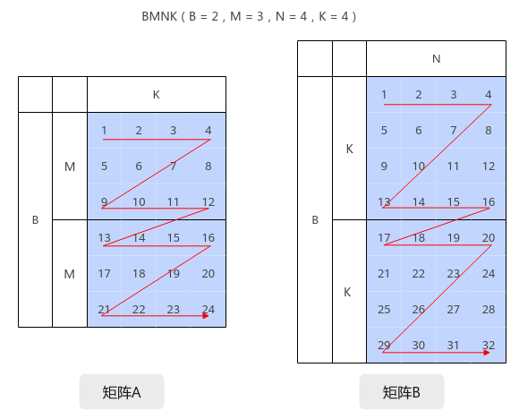
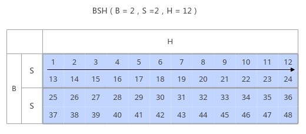
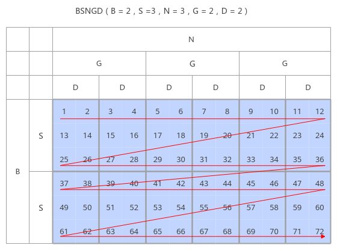
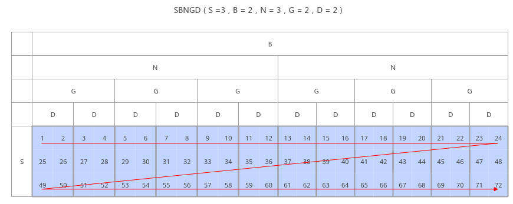
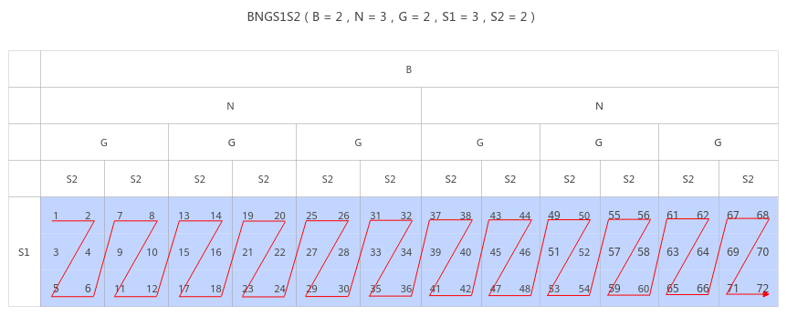

# IterateBatch<a name="ZH-CN_TOPIC_0000001846433226"></a>

## AI处理器支持情况<a name="section1550532418810"></a>

<a name="table1334714391211"></a>
<table><thead align="left"><tr id="row1334743121213"><th class="cellrowborder" valign="top" width="57.99999999999999%" id="mcps1.1.3.1.1"><p id="p834713321216"><a name="p834713321216"></a><a name="p834713321216"></a><span id="ph834783101215"><a name="ph834783101215"></a><a name="ph834783101215"></a>AI处理器类型</span></p>
</th>
<th class="cellrowborder" align="center" valign="top" width="42%" id="mcps1.1.3.1.2"><p id="p2347234127"><a name="p2347234127"></a><a name="p2347234127"></a>是否支持</p>
</th>
</tr>
</thead>
<tbody><tr id="row1834733191219"><td class="cellrowborder" valign="top" width="57.99999999999999%" headers="mcps1.1.3.1.1 "><p id="p1234716311218"><a name="p1234716311218"></a><a name="p1234716311218"></a><span id="ph434819391213"><a name="ph434819391213"></a><a name="ph434819391213"></a><term id="zh-cn_topic_0000001312391781_term1253731311225"><a name="zh-cn_topic_0000001312391781_term1253731311225"></a><a name="zh-cn_topic_0000001312391781_term1253731311225"></a>Ascend 910C</term></span></p>
</td>
<td class="cellrowborder" align="center" valign="top" width="42%" headers="mcps1.1.3.1.2 "><p id="p7751240111217"><a name="p7751240111217"></a><a name="p7751240111217"></a>√</p>
</td>
</tr>
<tr id="row33481333123"><td class="cellrowborder" valign="top" width="57.99999999999999%" headers="mcps1.1.3.1.1 "><p id="p2034813321217"><a name="p2034813321217"></a><a name="p2034813321217"></a><span id="ph334833191213"><a name="ph334833191213"></a><a name="ph334833191213"></a><term id="zh-cn_topic_0000001312391781_term11962195213215"><a name="zh-cn_topic_0000001312391781_term11962195213215"></a><a name="zh-cn_topic_0000001312391781_term11962195213215"></a>Ascend 910B</term></span></p>
</td>
<td class="cellrowborder" align="center" valign="top" width="42%" headers="mcps1.1.3.1.2 "><p id="p20751740131216"><a name="p20751740131216"></a><a name="p20751740131216"></a>√</p>
</td>
</tr>
</tbody>
</table>

## 功能说明<a name="section618mcpsimp"></a>

单次Matmul计算处理的shape比较小时，由于每次计算均涉及到内部的通信，可能会影响性能，该接口提供批量处理Matmul的功能，调用一次IterateBatch，可以计算出多个singleCoreM \* singleCoreN大小的C矩阵。

在使用该接口前，需要了解一些必备的数据排布格式：

-   **通用数据格式（NORMAL）**：BMNK的数据排布格式；B：Batch，批处理的大小；M、N、K为矩阵乘\[M, K\]\*\[K, N\]的矩阵维度；其数据排布格式如下：

    

-   **BSH/SBH：**B：Batch，批处理的大小； S：sequence length，序列长度；H = N \* D，其中，N为head的数量，D为head的大小。Layout格式如下图所示：

    

    

-   **BSNGD：**为原始BSH shape做reshape后的shape，S和D为单Batch的矩阵乘的M轴（或N轴）和K轴，一个SD为一个batch的计算数据，Layout格式如下图所示：

    

-   **SBNGD：**为原始SBH shape做reshape后shape，S和D为矩阵乘的M轴（或N轴）和K轴，一个SD为一个Batch的计算数据，Layout格式如下图所示：

    

-   **BNGS1S2：**一般为前两种Layout进行矩阵乘的输出，S1S2数据连续存放，一个S1S2为一个Batch的计算数据，Layout格式如下图所示：

    

实例化Matmul时，需要通过MatmulType设置输入输出的Layout格式，当前支持4种Layout类型：BSNGD、SBNGD、BNGS1S2、NORMAL（BMNK的数据排布格式使用NORMAL表示）。

对于BSNGD、SBNGD、BNGS1S2 Layout格式，调用该接口之前需要在host Tiling实现中使用[SetALayout](SetALayout.md)、[SetBLayout](SetBLayout.md)、[SetCLayout](SetCLayout.md)、[SetBatchNum](SetBatchNum-32.md)设置A/B/C的Layout轴信息和最大BatchNum数；对于NORMAL  Layout格式则需使用[SetBatchInfoForNormal](SetBatchInfoForNormal.md)设置A/B/C的M/N/K轴信息和A/B矩阵的BatchNum数。

单个矩阵乘迭代顺序可通过tiling参数iterateOrder调整。

## 函数原型<a name="section620mcpsimp"></a>

-   mix模式
    -   输出至GM

        ```
        template <bool sync = true, bool waitIterateBatch = false>
        __aicore__ inline void IterateBatch(const GlobalTensor<DstT>& gm, uint32_t batchA, uint32_t batchB, bool enSequentialWrite, const uint32_t matrixStrideA = 0, const uint32_t matrixStrideB = 0, const uint32_t matrixStrideC = 0, const bool enPartialSum = false, const uint8_t enAtomic = 0)
        ```

    -   输出至VECIN

        ```
        template <bool sync = true>
        __aicore__ inline void IterateBatch(const LocalTensor<DstT>& ubCmatrix, uint32_t batchA, uint32_t batchB, bool enSequentialWrite, const uint32_t matrixStrideA = 0, const uint32_t matrixStrideB = 0, const uint32_t matrixStrideC = 0, const bool enPartialSum = false, const uint8_t enAtomic = 0)
        ```

-   纯cube模式

    使用前需先调用[SetBatchNum](SetBatchNum.md)接口设置batchA和batchB的大小。

    -   输出至GM

        ```
        __aicore__ inline void IterateBatch(const GlobalTensor<DstT>& gm, bool enPartialSum, uint8_t enAtomic, bool enSequentialWrite, const uint32_t matrixStrideA = 0, const uint32_t matrixStrideB = 0, const uint32_t matrixStrideC = 0)
        ```

## 参数说明<a name="section622mcpsimp"></a>

**表 1**  模板参数说明

<a name="table8746171282418"></a>
<table><thead align="left"><tr id="row8746191212419"><th class="cellrowborder" valign="top" width="17.02%" id="mcps1.2.3.1.1"><p id="p474618126245"><a name="p474618126245"></a><a name="p474618126245"></a>参数名</p>
</th>
<th class="cellrowborder" valign="top" width="82.98%" id="mcps1.2.3.1.2"><p id="p1574681216240"><a name="p1574681216240"></a><a name="p1574681216240"></a>描述</p>
</th>
</tr>
</thead>
<tbody><tr id="row1574617127244"><td class="cellrowborder" valign="top" width="17.02%" headers="mcps1.2.3.1.1 "><p id="p2746171214244"><a name="p2746171214244"></a><a name="p2746171214244"></a>sync</p>
</td>
<td class="cellrowborder" valign="top" width="82.98%" headers="mcps1.2.3.1.2 "><p id="p2314131071416"><a name="p2314131071416"></a><a name="p2314131071416"></a>获取C矩阵过程分为同步和异步两种模式：</p>
<a name="ul101321025155310"></a><a name="ul101321025155310"></a><ul id="ul101321025155310"><li><strong id="b18450458153116"><a name="b18450458153116"></a><a name="b18450458153116"></a>同步：</strong>需要同步等待IterateBatch执行结束。</li><li><strong id="b72671419326"><a name="b72671419326"></a><a name="b72671419326"></a>异步：</strong>不需要同步等待IterateBatch执行结束。</li></ul>
<p id="p1473293613415"><a name="p1473293613415"></a><a name="p1473293613415"></a>通过该参数设置同步或者异步模式：同步模式设置为true；异步模式设置为false。默认为同步模式。异步场景需要配合<a href="WaitIterateBatch.md">WaitIterateBatch</a>接口使用。</p>
</td>
</tr>
<tr id="row1579843192113"><td class="cellrowborder" valign="top" width="17.02%" headers="mcps1.2.3.1.1 "><p id="p6798153192114"><a name="p6798153192114"></a><a name="p6798153192114"></a>waitIterateBatch</p>
</td>
<td class="cellrowborder" valign="top" width="82.98%" headers="mcps1.2.3.1.2 "><p id="p205351629143710"><a name="p205351629143710"></a><a name="p205351629143710"></a>是否需要通过<a href="WaitIterateBatch.md">WaitIterateBatch</a>接口等待IterateBatch执行结束，仅在异步场景下使用。默认为false。</p>
<p id="p1859926195210"><a name="p1859926195210"></a><a name="p1859926195210"></a>true：需要通过WaitIterateBatch接口等待IterateBatch执行结束。</p>
<p id="p381710502478"><a name="p381710502478"></a><a name="p381710502478"></a>false：不需要通过WaitIterateBatch接口等待IterateBatch执行结束，开发者自行处理等待IterateBatch执行结束的过程。</p>
</td>
</tr>
</tbody>
</table>

<a name="table9646134355611"></a>
<table><thead align="left"><tr id="row964714433565"><th class="cellrowborder" valign="top" width="18.92%" id="mcps1.1.4.1.1"><p id="zh-cn_topic_0235751031_p20917673"><a name="zh-cn_topic_0235751031_p20917673"></a><a name="zh-cn_topic_0235751031_p20917673"></a>参数名</p>
</th>
<th class="cellrowborder" valign="top" width="7.95%" id="mcps1.1.4.1.2"><p id="zh-cn_topic_0235751031_p16609919"><a name="zh-cn_topic_0235751031_p16609919"></a><a name="zh-cn_topic_0235751031_p16609919"></a>输入/输出</p>
</th>
<th class="cellrowborder" valign="top" width="73.13%" id="mcps1.1.4.1.3"><p id="zh-cn_topic_0235751031_p59995477"><a name="zh-cn_topic_0235751031_p59995477"></a><a name="zh-cn_topic_0235751031_p59995477"></a>描述</p>
</th>
</tr>
</thead>
<tbody><tr id="row36481043185619"><td class="cellrowborder" valign="top" width="18.92%" headers="mcps1.1.4.1.1 "><p id="p15339630201219"><a name="p15339630201219"></a><a name="p15339630201219"></a>gm</p>
</td>
<td class="cellrowborder" valign="top" width="7.95%" headers="mcps1.1.4.1.2 "><p id="p14339183015126"><a name="p14339183015126"></a><a name="p14339183015126"></a>输出</p>
</td>
<td class="cellrowborder" valign="top" width="73.13%" headers="mcps1.1.4.1.3 "><p id="p166011637153012"><a name="p166011637153012"></a><a name="p166011637153012"></a>C矩阵。<span id="ph15942199192220"><a name="ph15942199192220"></a><a name="ph15942199192220"></a><span id="ph1294215916225"><a name="ph1294215916225"></a><a name="ph1294215916225"></a><span id="ph894279182218"><a name="ph894279182218"></a><a name="ph894279182218"></a>类型为<a href="GlobalTensor.md">GlobalTensor</a>。</span></span></span></p>
<p id="p14555829193812"><a name="p14555829193812"></a><a name="p14555829193812"></a><span id="ph13555329143813"><a name="ph13555329143813"></a><a name="ph13555329143813"></a><term id="zh-cn_topic_0000001312391781_term1253731311225_1"><a name="zh-cn_topic_0000001312391781_term1253731311225_1"></a><a name="zh-cn_topic_0000001312391781_term1253731311225_1"></a>Ascend 910C</term></span>，支持的数据类型为：half/bfloat16_t/int32_t/float</p>
<p id="p116811630632"><a name="p116811630632"></a><a name="p116811630632"></a><span id="ph96991313115913"><a name="ph96991313115913"></a><a name="ph96991313115913"></a><term id="zh-cn_topic_0000001312391781_term11962195213215_1"><a name="zh-cn_topic_0000001312391781_term11962195213215_1"></a><a name="zh-cn_topic_0000001312391781_term11962195213215_1"></a>Ascend 910B</term></span>，支持的数据类型为：half/bfloat16_t/int32_t/float</p>
</td>
</tr>
<tr id="row16491543185617"><td class="cellrowborder" valign="top" width="18.92%" headers="mcps1.1.4.1.1 "><p id="p9339153015123"><a name="p9339153015123"></a><a name="p9339153015123"></a>ubCmatrix</p>
</td>
<td class="cellrowborder" valign="top" width="7.95%" headers="mcps1.1.4.1.2 "><p id="p1433933041215"><a name="p1433933041215"></a><a name="p1433933041215"></a>输出</p>
</td>
<td class="cellrowborder" valign="top" width="73.13%" headers="mcps1.1.4.1.3 "><p id="p36131149143013"><a name="p36131149143013"></a><a name="p36131149143013"></a>C矩阵。<span id="ph173308471594"><a name="ph173308471594"></a><a name="ph173308471594"></a><span id="ph9902231466"><a name="ph9902231466"></a><a name="ph9902231466"></a><span id="ph1782115034816"><a name="ph1782115034816"></a><a name="ph1782115034816"></a>类型为<a href="LocalTensor.md">LocalTensor</a>。</span></span></span></p>
<p id="p1384120417"><a name="p1384120417"></a><a name="p1384120417"></a><span id="ph03871294110"><a name="ph03871294110"></a><a name="ph03871294110"></a><term id="zh-cn_topic_0000001312391781_term1253731311225_2"><a name="zh-cn_topic_0000001312391781_term1253731311225_2"></a><a name="zh-cn_topic_0000001312391781_term1253731311225_2"></a>Ascend 910C</term></span>，支持的数据类型为：half/bfloat16_t/int32_t/float</p>
<p id="p168241183577"><a name="p168241183577"></a><a name="p168241183577"></a><span id="ph17461117135916"><a name="ph17461117135916"></a><a name="ph17461117135916"></a><term id="zh-cn_topic_0000001312391781_term11962195213215_2"><a name="zh-cn_topic_0000001312391781_term11962195213215_2"></a><a name="zh-cn_topic_0000001312391781_term11962195213215_2"></a>Ascend 910B</term></span>，支持的数据类型为：half/bfloat16_t/int32_t/float</p>
</td>
</tr>
<tr id="row65521150131316"><td class="cellrowborder" valign="top" width="18.92%" headers="mcps1.1.4.1.1 "><p id="p1755219506135"><a name="p1755219506135"></a><a name="p1755219506135"></a>batchA</p>
</td>
<td class="cellrowborder" valign="top" width="7.95%" headers="mcps1.1.4.1.2 "><p id="p14553350121317"><a name="p14553350121317"></a><a name="p14553350121317"></a>输入</p>
</td>
<td class="cellrowborder" valign="top" width="73.13%" headers="mcps1.1.4.1.3 "><p id="p65538507135"><a name="p65538507135"></a><a name="p65538507135"></a>左矩阵的batch数。</p>
</td>
</tr>
<tr id="row1997242710146"><td class="cellrowborder" valign="top" width="18.92%" headers="mcps1.1.4.1.1 "><p id="p69731527181417"><a name="p69731527181417"></a><a name="p69731527181417"></a>batchB</p>
</td>
<td class="cellrowborder" valign="top" width="7.95%" headers="mcps1.1.4.1.2 "><p id="p10973152711411"><a name="p10973152711411"></a><a name="p10973152711411"></a>输入</p>
</td>
<td class="cellrowborder" valign="top" width="73.13%" headers="mcps1.1.4.1.3 "><p id="p89734276141"><a name="p89734276141"></a><a name="p89734276141"></a>右矩阵的batch数。在batchA/batchB不相同的情况下，默认做broadcast操作。</p>
<p id="p1623564711369"><a name="p1623564711369"></a><a name="p1623564711369"></a>多batch计算支持在G轴上做输入broadcast和输出reduce，左矩阵、右矩阵G轴维度必须是整数倍的关系。</p>
</td>
</tr>
<tr id="row6652117123"><td class="cellrowborder" valign="top" width="18.92%" headers="mcps1.1.4.1.1 "><p id="p1733933012128"><a name="p1733933012128"></a><a name="p1733933012128"></a>enSequentialWrite</p>
</td>
<td class="cellrowborder" valign="top" width="7.95%" headers="mcps1.1.4.1.2 "><p id="p1233993014123"><a name="p1233993014123"></a><a name="p1233993014123"></a>输入</p>
</td>
<td class="cellrowborder" valign="top" width="73.13%" headers="mcps1.1.4.1.3 "><p id="p450020884520"><a name="p450020884520"></a><a name="p450020884520"></a>输出是否<a href="GetTensorC.md#fig580415103338">连续存放</a>数据，即是否开启连续写模式（连续写，写入[baseM, baseN]；非连续写，写入[singleCoreM, singleCoreN]中对应的位置）。</p>
<a name="ul437921019455"></a><a name="ul437921019455"></a><ul id="ul437921019455"><li>左右矩阵和输出矩阵的存储位置为<span id="ph1696163623613"><a name="ph1696163623613"></a><a name="ph1696163623613"></a>Unified Buffer</span>，则enSequentialWrite参数应配置为true；</li><li>输出矩阵的存储位置为GM，则enSequentialWrite参数应配置为false。</li></ul>
</td>
</tr>
<tr id="row272485812117"><td class="cellrowborder" valign="top" width="18.92%" headers="mcps1.1.4.1.1 "><p id="p97241958517"><a name="p97241958517"></a><a name="p97241958517"></a>matrixStrideA</p>
</td>
<td class="cellrowborder" valign="top" width="7.95%" headers="mcps1.1.4.1.2 "><p id="p8724105817117"><a name="p8724105817117"></a><a name="p8724105817117"></a>输入</p>
</td>
<td class="cellrowborder" valign="top" width="73.13%" headers="mcps1.1.4.1.3 "><p id="p4936239618"><a name="p4936239618"></a><a name="p4936239618"></a>A矩阵源操作数相邻nd矩阵起始地址间的偏移，单位是元素，默认值是0。</p>
</td>
</tr>
<tr id="row139951251721"><td class="cellrowborder" valign="top" width="18.92%" headers="mcps1.1.4.1.1 "><p id="p1526120521729"><a name="p1526120521729"></a><a name="p1526120521729"></a>matrixStrideB</p>
</td>
<td class="cellrowborder" valign="top" width="7.95%" headers="mcps1.1.4.1.2 "><p id="p209951659213"><a name="p209951659213"></a><a name="p209951659213"></a>输入</p>
</td>
<td class="cellrowborder" valign="top" width="73.13%" headers="mcps1.1.4.1.3 "><p id="p1781425771"><a name="p1781425771"></a><a name="p1781425771"></a>B矩阵源操作数相邻nd矩阵起始地址间的偏移，单位是元素，默认值是0。</p>
</td>
</tr>
<tr id="row12291216224"><td class="cellrowborder" valign="top" width="18.92%" headers="mcps1.1.4.1.1 "><p id="p01731956222"><a name="p01731956222"></a><a name="p01731956222"></a>matrixStrideC</p>
</td>
<td class="cellrowborder" valign="top" width="7.95%" headers="mcps1.1.4.1.2 "><p id="p629121616211"><a name="p629121616211"></a><a name="p629121616211"></a>输入</p>
</td>
<td class="cellrowborder" valign="top" width="73.13%" headers="mcps1.1.4.1.3 "><p id="p13881529472"><a name="p13881529472"></a><a name="p13881529472"></a>该参数预留，开发者无需关注。</p>
</td>
</tr>
<tr id="row19816101512596"><td class="cellrowborder" valign="top" width="18.92%" headers="mcps1.1.4.1.1 "><p id="p3225452133"><a name="p3225452133"></a><a name="p3225452133"></a>enPartialSum</p>
</td>
<td class="cellrowborder" valign="top" width="7.95%" headers="mcps1.1.4.1.2 "><p id="p981701525917"><a name="p981701525917"></a><a name="p981701525917"></a>输入</p>
</td>
<td class="cellrowborder" valign="top" width="73.13%" headers="mcps1.1.4.1.3 "><p id="p01481439165610"><a name="p01481439165610"></a><a name="p01481439165610"></a>是否将矩阵乘的结果累加于现有的CO1数据，默认值为false。在L0C累加时，只支持A矩阵和B矩阵相乘的输出C矩阵规格为singleM==baseM &amp;&amp;singleN==baseN。</p>
</td>
</tr>
<tr id="row579711925920"><td class="cellrowborder" valign="top" width="18.92%" headers="mcps1.1.4.1.1 "><p id="p379711915596"><a name="p379711915596"></a><a name="p379711915596"></a>enAtomic</p>
</td>
<td class="cellrowborder" valign="top" width="7.95%" headers="mcps1.1.4.1.2 "><p id="p187971119105910"><a name="p187971119105910"></a><a name="p187971119105910"></a>输入</p>
</td>
<td class="cellrowborder" valign="top" width="73.13%" headers="mcps1.1.4.1.3 "><p id="p11557163871916"><a name="p11557163871916"></a><a name="p11557163871916"></a>是否开启Atomic操作，默认值为0<strong id="b1375714215539"><a name="b1375714215539"></a><a name="b1375714215539"></a>。</strong></p>
<p id="p553784617537"><a name="p553784617537"></a><a name="p553784617537"></a>参数取值：</p>
<p id="p19697610154618"><a name="p19697610154618"></a><a name="p19697610154618"></a>0：不开启Atomic操作</p>
<p id="p108028241466"><a name="p108028241466"></a><a name="p108028241466"></a>1：开启AtomicAdd累加操作</p>
<p id="p875272616463"><a name="p875272616463"></a><a name="p875272616463"></a>2：开启AtomicMax求最大值操作</p>
<p id="p337993234616"><a name="p337993234616"></a><a name="p337993234616"></a>3：开启AtomicMin求最小值操作</p>
</td>
</tr>
</tbody>
</table>

## 返回值说明<a name="section640mcpsimp"></a>

无

## 约束说明<a name="section633mcpsimp"></a>

-   该接口只支持Norm模板，即BatchMatmul只支持Norm模板。
-   对于BSNGD、SBNGD、BNGS1S2 Layout格式，输入A、B矩阵按分形对齐后的多Batch数据总和应小于L1 Buffer的大小；对于NORMAL  Layout格式没有这种限制，但需通过MatmulConfig配置输入A、B矩阵多Batch数据大小与L1 Buffer的大小关系；
-   对于BSNGD、SBNGD、BNGS1S2 Layout格式，称左矩阵、右矩阵的G轴分别为ALayoutInfoG、BLayoutInfoG，则ALayoutInfoG / batchA = BLayoutInfoG / batchB；对于NORMAL  Layout格式，batchA、batchB必须满足倍数关系。
-   如果接口输出到Unified Buffer上，输出C矩阵大小BaseM\*BaseN应小于分配的Unified Buffer内存大小。
-   如果接口输出到Unified Buffer上，且单核计算的N方向大小singleCoreN非32字节对齐，C矩阵的CubeFormat仅支持ND\_ALIGN格式，输出C矩阵片时，自动将singleCoreN方向上的数据补齐至32字节。
-   对于BSNGD、SBNGD Layout格式，输入输出只支持ND格式数据。对于BNGS1S2、NORMAL  Layout格式， 输入支持ND/NZ格式数据。
-   对于BSNGD、SBNGD Layout格式，不支持连续写模式。
-   该接口不支持量化模式，即不支持SetQuantScalar、SetQuantVector接口。
-   BSNGD场景，不支持一次计算多行SD，需要算子程序中循环计算，即\(ALayoutInfoN \* ALayoutInfoG\) / batchA、\(BLayoutInfoN \* BLayoutInfoG\) / batchB均为整数。
-   **异步模式**不支持IterateBatch搬运到UB上。
-   当使能MixDualMaster（双主模式）场景时，即模板参数[enableMixDualMaster](MatmulConfig.md#p9218181073719)设置为true，不支持使用该接口。
-   使用该接口时，A矩阵、B矩阵不支持int4b\_t类型的输入，即BatchMatmul不支持int4b\_t类型的矩阵输入。

## 调用示例<a name="section94691236101419"></a>

-   该示例完成aGM、bGM矩阵乘，结果保存到cGm上，其中aGM、bGM、cGM数据的layout格式均为NORMAL，左矩阵每次计算batchA个MK数据，右矩阵每次计算batchB个KN数据。

    ```
    // 定义matmul type
    typedef AscendC::MatmulType <AscendC::TPosition::GM, CubeFormat::ND, half, false, LayoutMode::NORMAL> aType;
    typedef AscendC::MatmulType <AscendC::TPosition::GM, CubeFormat::ND, half, true, LayoutMode::NORMAL> bType;
    typedef AscendC::MatmulType <AscendC::TPosition::GM, CubeFormat::ND, float, false, LayoutMode::NORMAL> cType;
    typedef AscendC::MatmulType <AscendC::TPosition::GM, CubeFormat::ND, float> biasType;
    // 创建Matmul实例
    constexpr static MatmulConfig MM_CFG = GetNormalConfig(false, false, false, BatchMode::BATCH_LESS_THAN_L1);
    AscendC::Matmul<aType, bType, cType, biasType, MM_CFG> mm1;
    REGIST_MATMUL_OBJ(&pipe, GetSysWorkSpacePtr(), mm1);
    mm1.Init(&tiling);
    mm1.SetTensorA(gm_a, isTransposeAIn);
    mm1.SetTensorB(gm_b, isTransposeBIn);
    if(tiling.isBias) {
        mm1.SetBias(gm_bias);
    }
    // 多batch Matmul计算
    mm1.IterateBatch(gm_c, batchA, batchB, false);
    ```

-   该示例完成aGM、bGM矩阵乘，结果保存到cGm上，其中aGM数据的layout格式为BSNGD，bGM数据的layout格式为BSNGD，cGM的layout格式为BNGS1S2，左矩阵每次计算batchA个SD数据，右矩阵每次计算batchB个SD数据。

    ```
    // 定义matmul type
    typedef AscendC::MatmulType <AscendC::TPosition::GM, CubeFormat::ND, half, false, LayoutMode::BSNGD> aType;
    typedef AscendC::MatmulType <AscendC::TPosition::GM, CubeFormat::ND, half, true, LayoutMode::BSNGD> bType;
    typedef AscendC::MatmulType <AscendC::TPosition::GM, CubeFormat::ND, float, false, LayoutMode::BNGS1S2> cType;
    typedef AscendC::MatmulType <AscendC::TPosition::GM, CubeFormat::ND, float> biasType;
    // 创建Matmul实例
    AscendC::Matmul<aType, bType, cType, biasType> mm1;
    REGIST_MATMUL_OBJ(&pipe, GetSysWorkSpacePtr(), mm1);
    mm1.Init(&tiling);
    int batchC = batchA > batchB ? batchA : batchB;
    int g_lay = tiling.ALayoutInfoG > tiling.BLayoutInfoG ? tiling.ALayoutInfoG : tiling.BLayoutInfoG;
    // 计算需要多Batch计算循环次数
    int for_exent = tiling.ALayoutInfoB * tiling.ALayoutInfoN * g_lay / tiling.BatchNum;
    for(int i=0; i<for_exent; ++i) {
        // 计算每次多batch计算A/B矩阵的起始地址
        int batchOffsetA = i * tiling.ALayoutInfoD * batchA;
        int batchOffsetB = i * tiling.BLayoutInfoD * batchB;
        mm1.SetTensorA(gm_a[batchOffsetA], isTransposeAIn);
        mm1.SetTensorB(gm_b[batchOffsetB], isTransposeBIn);
        int idx_c = i * batchC;
        if (tiling.CLayoutInfoG == 1 && (tiling.BLayoutInfoG != 1 || tiling.ALayoutInfoG != 1)) {
            idx_c = idx_c / (tiling.BLayoutInfoG > tiling.ALayoutInfoG ? tiling.BLayoutInfoG : tiling.ALayoutInfoG);
        }
        if(tiling.isBias) {
            int batchOffsetBias = idx_c * tiling.CLayoutInfoS2;
            mm1.SetBias(gm_bias[batchOffsetBias]);
        }
        int batchOffsetC = idx_c * tiling.CLayoutInfoS2;
        if (C_TYPE::layout == LayoutMode::BNGS1S2) {
            batchOffsetC = idx_c * tiling.CLayoutInfoS2 * tiling.CLayoutInfoS1;
        }
        // 多batch Matmul计算
        mm1.IterateBatch(gm_c[batchOffsetC], batchA, batchB, false);
    }
    ```

