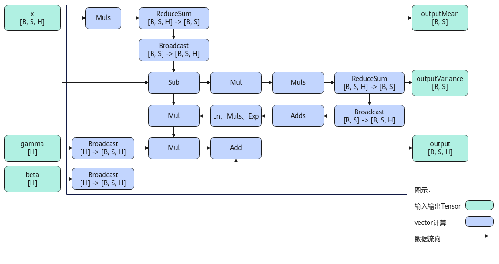

# LayerNorm<a name="ZH-CN_TOPIC_0000001574764914"></a>

## 产品支持情况<a name="section1586581915393"></a>

<a name="table169596713360"></a>
<table><thead align="left"><tr id="row129590715369"><th class="cellrowborder" valign="top" width="57.99999999999999%" id="mcps1.1.3.1.1"><p id="p17959971362"><a name="p17959971362"></a><a name="p17959971362"></a><span id="ph895914718367"><a name="ph895914718367"></a><a name="ph895914718367"></a>产品</span></p>
</th>
<th class="cellrowborder" align="center" valign="top" width="42%" id="mcps1.1.3.1.2"><p id="p89594763612"><a name="p89594763612"></a><a name="p89594763612"></a>是否支持</p>
</th>
</tr>
</thead>
<tbody><tr id="row18959673369"><td class="cellrowborder" valign="top" width="57.99999999999999%" headers="mcps1.1.3.1.1 "><p id="p1595910763613"><a name="p1595910763613"></a><a name="p1595910763613"></a><span id="ph1595918753613"><a name="ph1595918753613"></a><a name="ph1595918753613"></a>Ascend 950PR/Ascend 950DT</span></p>
</td>
<td class="cellrowborder" align="center" valign="top" width="42%" headers="mcps1.1.3.1.2 "><p id="p1695957133611"><a name="p1695957133611"></a><a name="p1695957133611"></a>√</p>
</td>
</tr>
<tr id="row18959157103612"><td class="cellrowborder" valign="top" width="57.99999999999999%" headers="mcps1.1.3.1.1 "><p id="p13959117193618"><a name="p13959117193618"></a><a name="p13959117193618"></a><span id="ph9959117173614"><a name="ph9959117173614"></a><a name="ph9959117173614"></a><term id="zh-cn_topic_0000001312391781_term1253731311225"><a name="zh-cn_topic_0000001312391781_term1253731311225"></a><a name="zh-cn_topic_0000001312391781_term1253731311225"></a>Atlas A3 训练系列产品</term>/<term id="zh-cn_topic_0000001312391781_term131434243115"><a name="zh-cn_topic_0000001312391781_term131434243115"></a><a name="zh-cn_topic_0000001312391781_term131434243115"></a>Atlas A3 推理系列产品</term></span></p>
</td>
<td class="cellrowborder" align="center" valign="top" width="42%" headers="mcps1.1.3.1.2 "><p id="p1095914793613"><a name="p1095914793613"></a><a name="p1095914793613"></a>√</p>
</td>
</tr>
<tr id="row89591478362"><td class="cellrowborder" valign="top" width="57.99999999999999%" headers="mcps1.1.3.1.1 "><p id="p7959157163619"><a name="p7959157163619"></a><a name="p7959157163619"></a><span id="ph1995997193619"><a name="ph1995997193619"></a><a name="ph1995997193619"></a><term id="zh-cn_topic_0000001312391781_term11962195213215"><a name="zh-cn_topic_0000001312391781_term11962195213215"></a><a name="zh-cn_topic_0000001312391781_term11962195213215"></a>Atlas A2 训练系列产品</term>/<term id="zh-cn_topic_0000001312391781_term184716139811"><a name="zh-cn_topic_0000001312391781_term184716139811"></a><a name="zh-cn_topic_0000001312391781_term184716139811"></a>Atlas A2 推理系列产品</term></span></p>
</td>
<td class="cellrowborder" align="center" valign="top" width="42%" headers="mcps1.1.3.1.2 "><p id="p149598793615"><a name="p149598793615"></a><a name="p149598793615"></a>√</p>
</td>
</tr>
</tbody>
</table>

## 功能说明<a name="section618mcpsimp"></a>

根据接口输出的不同，本节介绍如下两种LayerNorm接口。

-   对shape为\[B，S，H\]的输入数据，输出归一化结果、均值和方差

    在深层神经网络训练过程中，前面层训练参数的更新，会引起后面层输入数据分布的变化，导致权重更新不均衡及学习效率变慢。通过采用归一化策略，将网络层输入数据收敛到\[0, 1\]之间，可以规范网络层输入输出数据分布，加速训练参数收敛过程，使学习效率提升更加稳定。**LayerNorm是许多归一化方法中的一种。**

    本接口实现了对shape大小为\[B，S，H\]输入数据的LayerNorm归一化，其计算公式如下，其中γ为缩放系数，β为平移系数，ε为防除零的权重系数：

    

    其中，如下两个参数分别代表输入在H轴的均值和方差。

    

-   对shape为\[A，R\]的输入数据，输出归一化结果、均值、标准差的倒数或方差

    本接口实现了对shape为\[A，R\]输入数据的LayerNorm归一化，其计算公式如下，其中γ为缩放系数，β为平移系数，ε为防除零的权重系数：

    

    其中，如下三个参数分别代表输入在R轴的均值，方差和标准差的倒数。

    

## 实现原理<a name="section13229175017585"></a>

-   对shape为\[B，S，H\]的输入数据，输出归一化结果、均值和方差

    以float类型，ND格式，输入为inputX\[B, S, H\]，gamma\[H\]和beta\[H\]为例，描述LayerNorm高阶API内部算法框图，如下图所示。

    **图 1**  LayerNorm算法框图<a name="fig465593873413"></a>  
    

    计算过程分为如下几步，均在Vector上进行（下文中m指尾轴H的长度）：

    1.  计算均值：Muls计算x\*1/m的值，再计算累加值ReduceSum，得到均值outputMean；
    2.  计算方差：Sub计算出输入x与均值的差值，再用Mul进行平方计算，最后用Muls乘上1/m并计算累加值，得到方差outputVariance；
    3.  处理gamma和beta：通过broadcast得到BSH维度的gamma和beta；
    4.  计算输出：方差通过broadcast（或Duplicate）得到BSH维度的tensor，再依次经过Adds\(outputVariance, eps\)、Ln, Muls, Exp（或Sqrt），最后与（x-均值）相乘，得到的结果乘上gamma，加上beta，得到输出结果。

-   对shape为\[A，R\]的输入数据，输出归一化结果、均值、标准差的倒数或方差

    以float类型，ND格式，输入为inputX\[A, R\]，gamma\[R\] 和beta\[R\]为例，描述LayerNorm高阶API内部算法框架，如下图所示。

    **图 2**  LayerNorm-Rstd版本算法框图<a name="fig125521522105515"></a>  
    
    

    计算过程分为如下几步，均在Vector上进行，整体按照以A轴为最外层循环进行计算：

    1.  计算均值：首先对x的每个元素乘以1/\(2^k+m\)，防止后续累加溢出。然后使用二分累加方式对数据进行求和：将数据拆分成一个整块和一个尾块，其中整块为2^k个元素，尾块为m个元素，将尾块数据叠加到整块数据。为方便描述，定义Vnum为参与单次计算的元素个数。对整块中，以Vnum长度为单位，奇偶位数据进行Vadd，得到一个Vnum长度的结果，对该结果做WholeReduceSum计算，得到输出均值mean；
    2.  计算rstd：用Sub计算出输入x与均值的差值，再用Mul计算，计算该差值的平方，为防止溢出，按照同样的二分累加方式，计算出该平方结果的方差Variance；方差与防除零系数ε相加，通过Rsqrt计算，得到输出rstd；
    3.  计算输出：用Sub计算出输入x与均值的差值，再与rstd相乘，得到的结果与gamma相乘，与beta相加，得到输出结果。

## 函数原型<a name="section1834111321944"></a>

由于该接口的内部实现中涉及复杂的计算，需要额外的临时空间来存储计算过程中的中间变量。临时空间大小BufferSize的获取方法：通过[LayerNorm Tiling](LayerNorm-Tiling.md)中提供的GetLayerNormMaxMinTmpSize接口获取所需最大和最小临时空间大小，最小空间可以保证功能正确，最大空间用于提升性能。

临时空间支持**接口框架申请**和开发者**通过sharedTmpBuffer入参传入**两种方式，因此LayerNorm接口的函数原型有两种：

-   对shape为\[B，S，H\]的输入数据，输出归一化结果、均值和方差
    -   通过sharedTmpBuffer入参传入临时空间

        ```
        template <typename T, bool isReuseSource = false>
        __aicore__ inline void LayerNorm(const LocalTensor<T>& output, const LocalTensor<T>& outputMean, const LocalTensor<T>& outputVariance, const LocalTensor<T>& inputX, const LocalTensor<T>& gamma, const LocalTensor<T>& beta, const LocalTensor<uint8_t>& sharedTmpBuffer, const T epsilon, LayerNormTiling& tiling)
        ```

        该方式下开发者需自行申请并管理临时内存空间，并在接口调用完成后，复用该部分内存，内存不会反复申请释放，灵活性较高，内存利用率也较高。

    -   接口框架申请临时空间

        ```
        template <typename T, bool isReuseSource = false>
        __aicore__ inline void LayerNorm(const LocalTensor<T>& output, const LocalTensor<T>& outputMean, const LocalTensor<T>& outputVariance, const LocalTensor<T>& inputX, const LocalTensor<T>& gamma, const LocalTensor<T>& beta, const T epsilon, LayerNormTiling& tiling)
        ```

        该方式下开发者无需申请，但是需要预留临时空间的大小。

-   对shape为\[A，R\]的输入数据，输出归一化结果、均值、标准差的倒数或方差
    -   通过sharedTmpBuffer入参传入临时空间

        ```
        template <typename U, typename T, bool isReuseSource = false, const LayerNormConfig& config = LNCFG_NORM>
        __aicore__ inline void LayerNorm(const LocalTensor<T>& output, const LocalTensor<float>& outputMean, const LocalTensor<float>& outputRstd, const LocalTensor<T>& inputX, const LocalTensor<U>& gamma, const LocalTensor<U>& beta, const float epsilon, const LocalTensor<uint8_t>& sharedTmpBuffer, const LayerNormPara& para, const LayerNormSeparateTiling& tiling)
        ```

        该方式下开发者需自行申请并管理临时内存空间，并在接口调用完成后，复用该部分内存，内存不会反复申请释放，灵活性较高，内存利用率也较高。

    -   接口框架申请临时空间

        ```
        template <typename U, typename T, bool isReuseSource = false, const LayerNormConfig& config = LNCFG_NORM>
        __aicore__ inline void LayerNorm(const LocalTensor<T>& output, const LocalTensor<float>& outputMean, const LocalTensor<float>& outputRstd, const LocalTensor<T>& inputX, const LocalTensor<U>& gamma, const LocalTensor<U>& beta, const float epsilon, const LayerNormPara& para, const LayerNormSeparateTiling& tiling)
        ```

        该方式下开发者无需申请，但是需要预留临时空间的大小。

## 参数说明<a name="section622mcpsimp"></a>

-   对shape为\[B，S，H\]的输入数据，输出归一化结果、均值和方差的接口

    **表 1**  模板参数说明

    <a name="table575571914269"></a>
    <table><thead align="left"><tr id="row18755131942614"><th class="cellrowborder" valign="top" width="19.39%" id="mcps1.2.3.1.1"><p id="p675519193268"><a name="p675519193268"></a><a name="p675519193268"></a>参数名</p>
    </th>
    <th class="cellrowborder" valign="top" width="80.61%" id="mcps1.2.3.1.2"><p id="p375511918267"><a name="p375511918267"></a><a name="p375511918267"></a>描述</p>
    </th>
    </tr>
    </thead>
    <tbody><tr id="row14755141911264"><td class="cellrowborder" valign="top" width="19.39%" headers="mcps1.2.3.1.1 "><p id="p47551198266"><a name="p47551198266"></a><a name="p47551198266"></a>T</p>
    </td>
    <td class="cellrowborder" valign="top" width="80.61%" headers="mcps1.2.3.1.2 "><p id="p125969172719"><a name="p125969172719"></a><a name="p125969172719"></a>操作数的数据类型。</p>
    <p id="p1688223162815"><a name="p1688223162815"></a><a name="p1688223162815"></a><span id="ph1168842372812"><a name="ph1168842372812"></a><a name="ph1168842372812"></a>Ascend 950PR/Ascend 950DT</span>，支持的数据类型为：half、float。</p>
    <p id="p105913396307"><a name="p105913396307"></a><a name="p105913396307"></a><span id="ph4591193923018"><a name="ph4591193923018"></a><a name="ph4591193923018"></a><term id="zh-cn_topic_0000001312391781_term1253731311225_1"><a name="zh-cn_topic_0000001312391781_term1253731311225_1"></a><a name="zh-cn_topic_0000001312391781_term1253731311225_1"></a>Atlas A3 训练系列产品</term>/<term id="zh-cn_topic_0000001312391781_term131434243115_1"><a name="zh-cn_topic_0000001312391781_term131434243115_1"></a><a name="zh-cn_topic_0000001312391781_term131434243115_1"></a>Atlas A3 推理系列产品</term></span>，支持的数据类型为：half、float。</p>
    <p id="p10591143917308"><a name="p10591143917308"></a><a name="p10591143917308"></a><span id="ph19591839113014"><a name="ph19591839113014"></a><a name="ph19591839113014"></a><term id="zh-cn_topic_0000001312391781_term11962195213215_1"><a name="zh-cn_topic_0000001312391781_term11962195213215_1"></a><a name="zh-cn_topic_0000001312391781_term11962195213215_1"></a>Atlas A2 训练系列产品</term>/<term id="zh-cn_topic_0000001312391781_term184716139811_1"><a name="zh-cn_topic_0000001312391781_term184716139811_1"></a><a name="zh-cn_topic_0000001312391781_term184716139811_1"></a>Atlas A2 推理系列产品</term></span>，支持的数据类型为：half、float。</p>
    </td>
    </tr>
    <tr id="row9756719122620"><td class="cellrowborder" valign="top" width="19.39%" headers="mcps1.2.3.1.1 "><p id="p1682112447268"><a name="p1682112447268"></a><a name="p1682112447268"></a>isReuseSource</p>
    </td>
    <td class="cellrowborder" valign="top" width="80.61%" headers="mcps1.2.3.1.2 "><p id="p1275717613718"><a name="p1275717613718"></a><a name="p1275717613718"></a>是否允许修改源操作数，默认值为false。如果开发者允许源操作数被改写，可以使能该参数，使能后能够节省部分内存空间。</p>
    <p id="p175786163713"><a name="p175786163713"></a><a name="p175786163713"></a>设置为<strong id="b575706193714"><a name="b575706193714"></a><a name="b575706193714"></a>true</strong>，则本接口内部计算时<strong id="b147578614378"><a name="b147578614378"></a><a name="b147578614378"></a>复用</strong>inputX的内存空间，节省内存空间；设置为<strong id="b475717616379"><a name="b475717616379"></a><a name="b475717616379"></a>false</strong>，则本接口内部计算时<strong id="b157575653719"><a name="b157575653719"></a><a name="b157575653719"></a>不复用</strong>inputX的内存空间。</p>
    <p id="p177571162377"><a name="p177571162377"></a><a name="p177571162377"></a>对于float数据类型输入支持开启该参数，half数据类型输入不支持开启该参数。</p>
    <p id="p62891018544"><a name="p62891018544"></a><a name="p62891018544"></a>isReuseSource的使用样例请参考<a href="更多样例-84.md#section639165323915">更多样例</a>。</p>
    </td>
    </tr>
    </tbody>
    </table>

    **表 2**  接口参数说明

    <a name="table8955841508"></a>
    <table><thead align="left"><tr id="row15956194105014"><th class="cellrowborder" valign="top" width="19.621962196219624%" id="mcps1.2.4.1.1"><p id="p7956144195014"><a name="p7956144195014"></a><a name="p7956144195014"></a>参数名称</p>
    </th>
    <th class="cellrowborder" valign="top" width="10.781078107810782%" id="mcps1.2.4.1.2"><p id="p1295624145013"><a name="p1295624145013"></a><a name="p1295624145013"></a>输入/输出</p>
    </th>
    <th class="cellrowborder" valign="top" width="69.5969596959696%" id="mcps1.2.4.1.3"><p id="p16956144145011"><a name="p16956144145011"></a><a name="p16956144145011"></a>含义</p>
    </th>
    </tr>
    </thead>
    <tbody><tr id="row9819425175111"><td class="cellrowborder" valign="top" width="19.621962196219624%" headers="mcps1.2.4.1.1 "><p id="p4428175618426"><a name="p4428175618426"></a><a name="p4428175618426"></a>output</p>
    </td>
    <td class="cellrowborder" valign="top" width="10.781078107810782%" headers="mcps1.2.4.1.2 "><p id="p2428856174212"><a name="p2428856174212"></a><a name="p2428856174212"></a>输出</p>
    </td>
    <td class="cellrowborder" valign="top" width="69.5969596959696%" headers="mcps1.2.4.1.3 "><p id="p242825624218"><a name="p242825624218"></a><a name="p242825624218"></a>目的操作数，shape为[B, S, H]，LocalTensor数据结构的定义请参考<a href="LocalTensor.md">LocalTensor</a>。</p>
    <p id="p16911647191712"><a name="p16911647191712"></a><a name="p16911647191712"></a><span id="zh-cn_topic_0000001530181537_ph173308471594"><a name="zh-cn_topic_0000001530181537_ph173308471594"></a><a name="zh-cn_topic_0000001530181537_ph173308471594"></a><span id="zh-cn_topic_0000001530181537_ph9902231466"><a name="zh-cn_topic_0000001530181537_ph9902231466"></a><a name="zh-cn_topic_0000001530181537_ph9902231466"></a><span id="zh-cn_topic_0000001530181537_ph1782115034816"><a name="zh-cn_topic_0000001530181537_ph1782115034816"></a><a name="zh-cn_topic_0000001530181537_ph1782115034816"></a>类型为<a href="LocalTensor.md">LocalTensor</a>，支持的TPosition为VECIN/VECCALC/VECOUT。</span></span></span></p>
    </td>
    </tr>
    <tr id="row1366215274516"><td class="cellrowborder" valign="top" width="19.621962196219624%" headers="mcps1.2.4.1.1 "><p id="p10429155616425"><a name="p10429155616425"></a><a name="p10429155616425"></a>outputMean</p>
    </td>
    <td class="cellrowborder" valign="top" width="10.781078107810782%" headers="mcps1.2.4.1.2 "><p id="p164291756114215"><a name="p164291756114215"></a><a name="p164291756114215"></a>输出</p>
    </td>
    <td class="cellrowborder" valign="top" width="69.5969596959696%" headers="mcps1.2.4.1.3 "><p id="p446091145118"><a name="p446091145118"></a><a name="p446091145118"></a>均值，shape为[B, S]，LocalTensor数据结构的定义请参考<a href="LocalTensor.md">LocalTensor</a>。</p>
    <p id="p854817436545"><a name="p854817436545"></a><a name="p854817436545"></a><span id="zh-cn_topic_0000001530181537_ph173308471594_1"><a name="zh-cn_topic_0000001530181537_ph173308471594_1"></a><a name="zh-cn_topic_0000001530181537_ph173308471594_1"></a><span id="zh-cn_topic_0000001530181537_ph9902231466_1"><a name="zh-cn_topic_0000001530181537_ph9902231466_1"></a><a name="zh-cn_topic_0000001530181537_ph9902231466_1"></a><span id="zh-cn_topic_0000001530181537_ph1782115034816_1"><a name="zh-cn_topic_0000001530181537_ph1782115034816_1"></a><a name="zh-cn_topic_0000001530181537_ph1782115034816_1"></a>类型为<a href="LocalTensor.md">LocalTensor</a>，支持的TPosition为VECIN/VECCALC/VECOUT。</span></span></span></p>
    </td>
    </tr>
    <tr id="row17354929175114"><td class="cellrowborder" valign="top" width="19.621962196219624%" headers="mcps1.2.4.1.1 "><p id="p9700348105111"><a name="p9700348105111"></a><a name="p9700348105111"></a>outputVariance</p>
    </td>
    <td class="cellrowborder" valign="top" width="10.781078107810782%" headers="mcps1.2.4.1.2 "><p id="p18699164810513"><a name="p18699164810513"></a><a name="p18699164810513"></a>输出</p>
    </td>
    <td class="cellrowborder" valign="top" width="69.5969596959696%" headers="mcps1.2.4.1.3 "><p id="p116749805213"><a name="p116749805213"></a><a name="p116749805213"></a>方差，shape为[B, S]，LocalTensor数据结构的定义请参考<a href="LocalTensor.md">LocalTensor</a>。</p>
    <p id="p3453249175418"><a name="p3453249175418"></a><a name="p3453249175418"></a><span id="zh-cn_topic_0000001530181537_ph173308471594_2"><a name="zh-cn_topic_0000001530181537_ph173308471594_2"></a><a name="zh-cn_topic_0000001530181537_ph173308471594_2"></a><span id="zh-cn_topic_0000001530181537_ph9902231466_2"><a name="zh-cn_topic_0000001530181537_ph9902231466_2"></a><a name="zh-cn_topic_0000001530181537_ph9902231466_2"></a><span id="zh-cn_topic_0000001530181537_ph1782115034816_2"><a name="zh-cn_topic_0000001530181537_ph1782115034816_2"></a><a name="zh-cn_topic_0000001530181537_ph1782115034816_2"></a>类型为<a href="LocalTensor.md">LocalTensor</a>，支持的TPosition为VECIN/VECCALC/VECOUT。</span></span></span></p>
    </td>
    </tr>
    <tr id="row1252915271469"><td class="cellrowborder" valign="top" width="19.621962196219624%" headers="mcps1.2.4.1.1 "><p id="p4529827124618"><a name="p4529827124618"></a><a name="p4529827124618"></a>inputX</p>
    </td>
    <td class="cellrowborder" valign="top" width="10.781078107810782%" headers="mcps1.2.4.1.2 "><p id="p1360673615466"><a name="p1360673615466"></a><a name="p1360673615466"></a>输入</p>
    </td>
    <td class="cellrowborder" valign="top" width="69.5969596959696%" headers="mcps1.2.4.1.3 "><p id="p76064362463"><a name="p76064362463"></a><a name="p76064362463"></a>源操作数，shape为[B, S, H]，LocalTensor数据结构的定义请参考<a href="LocalTensor.md">LocalTensor</a>。inputX的数据类型需要与目的操作数保持一致，尾轴长度需要32B对齐。</p>
    <p id="p05701357205415"><a name="p05701357205415"></a><a name="p05701357205415"></a><span id="zh-cn_topic_0000001530181537_ph173308471594_3"><a name="zh-cn_topic_0000001530181537_ph173308471594_3"></a><a name="zh-cn_topic_0000001530181537_ph173308471594_3"></a><span id="zh-cn_topic_0000001530181537_ph9902231466_3"><a name="zh-cn_topic_0000001530181537_ph9902231466_3"></a><a name="zh-cn_topic_0000001530181537_ph9902231466_3"></a><span id="zh-cn_topic_0000001530181537_ph1782115034816_3"><a name="zh-cn_topic_0000001530181537_ph1782115034816_3"></a><a name="zh-cn_topic_0000001530181537_ph1782115034816_3"></a>类型为<a href="LocalTensor.md">LocalTensor</a>，支持的TPosition为VECIN/VECCALC/VECOUT。</span></span></span></p>
    </td>
    </tr>
    <tr id="row199078192473"><td class="cellrowborder" valign="top" width="19.621962196219624%" headers="mcps1.2.4.1.1 "><p id="p390771918472"><a name="p390771918472"></a><a name="p390771918472"></a>gamma</p>
    </td>
    <td class="cellrowborder" valign="top" width="10.781078107810782%" headers="mcps1.2.4.1.2 "><p id="p79074190471"><a name="p79074190471"></a><a name="p79074190471"></a>输入</p>
    </td>
    <td class="cellrowborder" valign="top" width="69.5969596959696%" headers="mcps1.2.4.1.3 "><p id="p529563815472"><a name="p529563815472"></a><a name="p529563815472"></a>缩放系数，shape为[H]，LocalTensor数据结构的定义请参考<a href="LocalTensor.md">LocalTensor</a>。gamma的数据类型需要与目的操作数保持一致，尾轴长度需要32B对齐。</p>
    <p id="p1365422155516"><a name="p1365422155516"></a><a name="p1365422155516"></a><span id="zh-cn_topic_0000001530181537_ph173308471594_4"><a name="zh-cn_topic_0000001530181537_ph173308471594_4"></a><a name="zh-cn_topic_0000001530181537_ph173308471594_4"></a><span id="zh-cn_topic_0000001530181537_ph9902231466_4"><a name="zh-cn_topic_0000001530181537_ph9902231466_4"></a><a name="zh-cn_topic_0000001530181537_ph9902231466_4"></a><span id="zh-cn_topic_0000001530181537_ph1782115034816_4"><a name="zh-cn_topic_0000001530181537_ph1782115034816_4"></a><a name="zh-cn_topic_0000001530181537_ph1782115034816_4"></a>类型为<a href="LocalTensor.md">LocalTensor</a>，支持的TPosition为VECIN/VECCALC/VECOUT。</span></span></span></p>
    </td>
    </tr>
    <tr id="row12471912490"><td class="cellrowborder" valign="top" width="19.621962196219624%" headers="mcps1.2.4.1.1 "><p id="p14541425204916"><a name="p14541425204916"></a><a name="p14541425204916"></a>beta</p>
    </td>
    <td class="cellrowborder" valign="top" width="10.781078107810782%" headers="mcps1.2.4.1.2 "><p id="p1754425184911"><a name="p1754425184911"></a><a name="p1754425184911"></a>输入</p>
    </td>
    <td class="cellrowborder" valign="top" width="69.5969596959696%" headers="mcps1.2.4.1.3 "><p id="p45442544919"><a name="p45442544919"></a><a name="p45442544919"></a>平移系数，shape为[H]，LocalTensor数据结构的定义请参考<a href="LocalTensor.md">LocalTensor</a>。beta的数据类型需要与目的操作数保持一致，尾轴长度需要32B对齐。</p>
    <p id="p572127195510"><a name="p572127195510"></a><a name="p572127195510"></a><span id="zh-cn_topic_0000001530181537_ph173308471594_5"><a name="zh-cn_topic_0000001530181537_ph173308471594_5"></a><a name="zh-cn_topic_0000001530181537_ph173308471594_5"></a><span id="zh-cn_topic_0000001530181537_ph9902231466_5"><a name="zh-cn_topic_0000001530181537_ph9902231466_5"></a><a name="zh-cn_topic_0000001530181537_ph9902231466_5"></a><span id="zh-cn_topic_0000001530181537_ph1782115034816_5"><a name="zh-cn_topic_0000001530181537_ph1782115034816_5"></a><a name="zh-cn_topic_0000001530181537_ph1782115034816_5"></a>类型为<a href="LocalTensor.md">LocalTensor</a>，支持的TPosition为VECIN/VECCALC/VECOUT。</span></span></span></p>
    </td>
    </tr>
    <tr id="row1261791716247"><td class="cellrowborder" valign="top" width="19.621962196219624%" headers="mcps1.2.4.1.1 "><p id="p179192469188"><a name="p179192469188"></a><a name="p179192469188"></a>sharedTmpBuffer</p>
    </td>
    <td class="cellrowborder" valign="top" width="10.781078107810782%" headers="mcps1.2.4.1.2 "><p id="p209199466187"><a name="p209199466187"></a><a name="p209199466187"></a>输入</p>
    </td>
    <td class="cellrowborder" valign="top" width="69.5969596959696%" headers="mcps1.2.4.1.3 "><p id="p47801866195"><a name="p47801866195"></a><a name="p47801866195"></a>共享缓冲区，用于存放API内部计算产生的临时数据。该方式开发者可以自行管理sharedTmpBuffer内存空间，并在接口调用完成后，复用该部分内存，内存不会反复申请释放，灵活性较高，内存利用率也较高。共享缓冲区大小的获取方式请参考<a href="LayerNorm-Tiling.md">LayerNorm Tiling</a>。</p>
    <p id="p167809613199"><a name="p167809613199"></a><a name="p167809613199"></a><span id="zh-cn_topic_0000001530181537_ph173308471594_6"><a name="zh-cn_topic_0000001530181537_ph173308471594_6"></a><a name="zh-cn_topic_0000001530181537_ph173308471594_6"></a><span id="zh-cn_topic_0000001530181537_ph9902231466_6"><a name="zh-cn_topic_0000001530181537_ph9902231466_6"></a><a name="zh-cn_topic_0000001530181537_ph9902231466_6"></a><span id="zh-cn_topic_0000001530181537_ph1782115034816_6"><a name="zh-cn_topic_0000001530181537_ph1782115034816_6"></a><a name="zh-cn_topic_0000001530181537_ph1782115034816_6"></a>类型为<a href="LocalTensor.md">LocalTensor</a>，支持的TPosition为VECIN/VECCALC/VECOUT。</span></span></span></p>
    </td>
    </tr>
    <tr id="row448510291335"><td class="cellrowborder" valign="top" width="19.621962196219624%" headers="mcps1.2.4.1.1 "><p id="p186973485516"><a name="p186973485516"></a><a name="p186973485516"></a>epsilon</p>
    </td>
    <td class="cellrowborder" valign="top" width="10.781078107810782%" headers="mcps1.2.4.1.2 "><p id="p0319927105216"><a name="p0319927105216"></a><a name="p0319927105216"></a>输入</p>
    </td>
    <td class="cellrowborder" valign="top" width="69.5969596959696%" headers="mcps1.2.4.1.3 "><p id="p176961648195116"><a name="p176961648195116"></a><a name="p176961648195116"></a>防除零的权重系数。</p>
    </td>
    </tr>
    <tr id="row11190183865214"><td class="cellrowborder" valign="top" width="19.621962196219624%" headers="mcps1.2.4.1.1 "><p id="p191147115532"><a name="p191147115532"></a><a name="p191147115532"></a>tiling</p>
    </td>
    <td class="cellrowborder" valign="top" width="10.781078107810782%" headers="mcps1.2.4.1.2 "><p id="p11901338195219"><a name="p11901338195219"></a><a name="p11901338195219"></a>输入</p>
    </td>
    <td class="cellrowborder" valign="top" width="69.5969596959696%" headers="mcps1.2.4.1.3 "><p id="p819020383526"><a name="p819020383526"></a><a name="p819020383526"></a>LayerNorm计算所需Tiling信息，Tiling信息的获取请参考<a href="LayerNorm-Tiling.md">LayerNorm Tiling</a>。</p>
    </td>
    </tr>
    </tbody>
    </table>

-   对shape为\[A，R\]的输入数据，输出归一化结果、均值、标准差的倒数或方差的接口

    **表 3**  模板参数说明

    <a name="table128761218104510"></a>
    <table><thead align="left"><tr id="row1787681864515"><th class="cellrowborder" valign="top" width="19.39%" id="mcps1.2.3.1.1"><p id="p1387651817453"><a name="p1387651817453"></a><a name="p1387651817453"></a>参数名</p>
    </th>
    <th class="cellrowborder" valign="top" width="80.61%" id="mcps1.2.3.1.2"><p id="p16876121816450"><a name="p16876121816450"></a><a name="p16876121816450"></a>描述</p>
    </th>
    </tr>
    </thead>
    <tbody><tr id="row28761718174515"><td class="cellrowborder" valign="top" width="19.39%" headers="mcps1.2.3.1.1 "><p id="p88760188458"><a name="p88760188458"></a><a name="p88760188458"></a>U</p>
    </td>
    <td class="cellrowborder" valign="top" width="80.61%" headers="mcps1.2.3.1.2 "><p id="p1876151810457"><a name="p1876151810457"></a><a name="p1876151810457"></a>beta，gamma操作数的数据类型。</p>
    <p id="p6523155363214"><a name="p6523155363214"></a><a name="p6523155363214"></a><span id="ph1852345353217"><a name="ph1852345353217"></a><a name="ph1852345353217"></a>Ascend 950PR/Ascend 950DT</span>，支持的数据类型为：half、bfloat16_t、float。</p>
    <p id="p952355383212"><a name="p952355383212"></a><a name="p952355383212"></a><span id="ph145231653193211"><a name="ph145231653193211"></a><a name="ph145231653193211"></a><term id="zh-cn_topic_0000001312391781_term1253731311225_2"><a name="zh-cn_topic_0000001312391781_term1253731311225_2"></a><a name="zh-cn_topic_0000001312391781_term1253731311225_2"></a>Atlas A3 训练系列产品</term>/<term id="zh-cn_topic_0000001312391781_term131434243115_2"><a name="zh-cn_topic_0000001312391781_term131434243115_2"></a><a name="zh-cn_topic_0000001312391781_term131434243115_2"></a>Atlas A3 推理系列产品</term></span>，支持的数据类型为：half、float。</p>
    <p id="p5523135310323"><a name="p5523135310323"></a><a name="p5523135310323"></a><span id="ph16523153173213"><a name="ph16523153173213"></a><a name="ph16523153173213"></a><term id="zh-cn_topic_0000001312391781_term11962195213215_2"><a name="zh-cn_topic_0000001312391781_term11962195213215_2"></a><a name="zh-cn_topic_0000001312391781_term11962195213215_2"></a>Atlas A2 训练系列产品</term>/<term id="zh-cn_topic_0000001312391781_term184716139811_2"><a name="zh-cn_topic_0000001312391781_term184716139811_2"></a><a name="zh-cn_topic_0000001312391781_term184716139811_2"></a>Atlas A2 推理系列产品</term></span>，支持的数据类型为：half、float。</p>
    </td>
    </tr>
    <tr id="row91421942114514"><td class="cellrowborder" valign="top" width="19.39%" headers="mcps1.2.3.1.1 "><p id="p0143154274510"><a name="p0143154274510"></a><a name="p0143154274510"></a>T</p>
    </td>
    <td class="cellrowborder" valign="top" width="80.61%" headers="mcps1.2.3.1.2 "><p id="p214344224510"><a name="p214344224510"></a><a name="p214344224510"></a>output，inputX操作数的数据类型。</p>
    <p id="p7358037153113"><a name="p7358037153113"></a><a name="p7358037153113"></a><span id="ph03581337203117"><a name="ph03581337203117"></a><a name="ph03581337203117"></a>Ascend 950PR/Ascend 950DT</span>，支持的数据类型为：half、bfloat16_t、float。</p>
    <p id="p17358153723112"><a name="p17358153723112"></a><a name="p17358153723112"></a><span id="ph1135863773117"><a name="ph1135863773117"></a><a name="ph1135863773117"></a><term id="zh-cn_topic_0000001312391781_term1253731311225_3"><a name="zh-cn_topic_0000001312391781_term1253731311225_3"></a><a name="zh-cn_topic_0000001312391781_term1253731311225_3"></a>Atlas A3 训练系列产品</term>/<term id="zh-cn_topic_0000001312391781_term131434243115_3"><a name="zh-cn_topic_0000001312391781_term131434243115_3"></a><a name="zh-cn_topic_0000001312391781_term131434243115_3"></a>Atlas A3 推理系列产品</term></span>，支持的数据类型为：half、float。</p>
    <p id="p9358193743116"><a name="p9358193743116"></a><a name="p9358193743116"></a><span id="ph53581137123116"><a name="ph53581137123116"></a><a name="ph53581137123116"></a><term id="zh-cn_topic_0000001312391781_term11962195213215_3"><a name="zh-cn_topic_0000001312391781_term11962195213215_3"></a><a name="zh-cn_topic_0000001312391781_term11962195213215_3"></a>Atlas A2 训练系列产品</term>/<term id="zh-cn_topic_0000001312391781_term184716139811_3"><a name="zh-cn_topic_0000001312391781_term184716139811_3"></a><a name="zh-cn_topic_0000001312391781_term184716139811_3"></a>Atlas A2 推理系列产品</term></span>，支持的数据类型为:half、float。</p>
    </td>
    </tr>
    <tr id="row58761518134511"><td class="cellrowborder" valign="top" width="19.39%" headers="mcps1.2.3.1.1 "><p id="p687611816458"><a name="p687611816458"></a><a name="p687611816458"></a>isReuseSource</p>
    </td>
    <td class="cellrowborder" valign="top" width="80.61%" headers="mcps1.2.3.1.2 "><p id="p655895845617"><a name="p655895845617"></a><a name="p655895845617"></a>该参数预留，传入默认值false即可。</p>
    </td>
    </tr>
    <tr id="row1870819634812"><td class="cellrowborder" valign="top" width="19.39%" headers="mcps1.2.3.1.1 "><p id="p127081060486"><a name="p127081060486"></a><a name="p127081060486"></a>config</p>
    </td>
    <td class="cellrowborder" valign="top" width="80.61%" headers="mcps1.2.3.1.2 "><p id="p202731227454"><a name="p202731227454"></a><a name="p202731227454"></a>配置LayerNorm接口中输入输出相关信息。LayerNormConfig类型，定义如下。</p>
    <a name="screen027923314253"></a><a name="screen027923314253"></a><pre class="screen" codetype="Cpp" id="screen027923314253">struct LayerNormConfig {
        bool isNoBeta = false;
        bool isNoGamma = false;
        bool isOnlyOutput = false;
        bool isOutputRstd = true;
    };</pre>
    <a name="ul1167113259457"></a><a name="ul1167113259457"></a><ul id="ul1167113259457"><li>isNoBeta：计算时，输入beta是否使用。<a name="ul11364174572711"></a><a name="ul11364174572711"></a><ul id="ul11364174572711"><li>false：默认值，LayerNorm计算中使用输入beta。</li><li>true：LayerNorm计算中不使用输入beta。此时，公式中与beta相关的计算被省略。</li></ul>
    </li><li>isNoGamma：可选输入gamma是否使用。<a name="ul748573616312"></a><a name="ul748573616312"></a><ul id="ul748573616312"><li>false：默认值，LayerNorm计算中使用可选输入gamma。</li><li>true：LayerNorm计算中不使用输入gamma。此时，公式中与gamma相关的计算被省略。</li></ul>
    </li><li>isOnlyOutput：是否只输出y，不输出均值mean与标准差的倒数rstd。当前该参数仅支持取值为false，表示y、mean和rstd的结果全部输出。</li><li>isOutputRstd：选择输出标准差的倒数rstd还是方差。<a name="ul14813145633415"></a><a name="ul14813145633415"></a><ul id="ul14813145633415"><li>true：默认值，输出标准差的倒数。</li><li>false：输出方差。</li></ul>
    </li></ul>
    </td>
    </tr>
    </tbody>
    </table>

    **表 4**  接口参数说明

    <a name="table2087718184450"></a>
    <table><thead align="left"><tr id="row1877161884515"><th class="cellrowborder" valign="top" width="19.621962196219624%" id="mcps1.2.4.1.1"><p id="p28771318104519"><a name="p28771318104519"></a><a name="p28771318104519"></a>参数名称</p>
    </th>
    <th class="cellrowborder" valign="top" width="10.771077107710772%" id="mcps1.2.4.1.2"><p id="p587720189452"><a name="p587720189452"></a><a name="p587720189452"></a>输入/输出</p>
    </th>
    <th class="cellrowborder" valign="top" width="69.60696069606959%" id="mcps1.2.4.1.3"><p id="p13877191817454"><a name="p13877191817454"></a><a name="p13877191817454"></a>含义</p>
    </th>
    </tr>
    </thead>
    <tbody><tr id="row68772018194518"><td class="cellrowborder" valign="top" width="19.621962196219624%" headers="mcps1.2.4.1.1 "><p id="p0877131824517"><a name="p0877131824517"></a><a name="p0877131824517"></a>output</p>
    </td>
    <td class="cellrowborder" valign="top" width="10.771077107710772%" headers="mcps1.2.4.1.2 "><p id="p987741824515"><a name="p987741824515"></a><a name="p987741824515"></a>输出</p>
    </td>
    <td class="cellrowborder" valign="top" width="69.60696069606959%" headers="mcps1.2.4.1.3 "><p id="p178776184450"><a name="p178776184450"></a><a name="p178776184450"></a>目的操作数，shape为[A, R]，LocalTensor数据结构的定义请参考<a href="LocalTensor.md">LocalTensor</a>。</p>
    <p id="p167721925711"><a name="p167721925711"></a><a name="p167721925711"></a><span id="zh-cn_topic_0000001530181537_ph173308471594_7"><a name="zh-cn_topic_0000001530181537_ph173308471594_7"></a><a name="zh-cn_topic_0000001530181537_ph173308471594_7"></a><span id="zh-cn_topic_0000001530181537_ph9902231466_7"><a name="zh-cn_topic_0000001530181537_ph9902231466_7"></a><a name="zh-cn_topic_0000001530181537_ph9902231466_7"></a><span id="zh-cn_topic_0000001530181537_ph1782115034816_7"><a name="zh-cn_topic_0000001530181537_ph1782115034816_7"></a><a name="zh-cn_topic_0000001530181537_ph1782115034816_7"></a>类型为<a href="LocalTensor.md">LocalTensor</a>，支持的TPosition为VECIN/VECCALC/VECOUT。</span></span></span></p>
    </td>
    </tr>
    <tr id="row78772188458"><td class="cellrowborder" valign="top" width="19.621962196219624%" headers="mcps1.2.4.1.1 "><p id="p9877111844512"><a name="p9877111844512"></a><a name="p9877111844512"></a>outputMean</p>
    </td>
    <td class="cellrowborder" valign="top" width="10.771077107710772%" headers="mcps1.2.4.1.2 "><p id="p7877151814510"><a name="p7877151814510"></a><a name="p7877151814510"></a>输出</p>
    </td>
    <td class="cellrowborder" valign="top" width="69.60696069606959%" headers="mcps1.2.4.1.3 "><p id="p08771318154520"><a name="p08771318154520"></a><a name="p08771318154520"></a>均值，shape为[A]，LocalTensor数据结构的定义请参考<a href="LocalTensor.md">LocalTensor</a>。</p>
    <p id="p761652165717"><a name="p761652165717"></a><a name="p761652165717"></a><span id="zh-cn_topic_0000001530181537_ph173308471594_8"><a name="zh-cn_topic_0000001530181537_ph173308471594_8"></a><a name="zh-cn_topic_0000001530181537_ph173308471594_8"></a><span id="zh-cn_topic_0000001530181537_ph9902231466_8"><a name="zh-cn_topic_0000001530181537_ph9902231466_8"></a><a name="zh-cn_topic_0000001530181537_ph9902231466_8"></a><span id="zh-cn_topic_0000001530181537_ph1782115034816_8"><a name="zh-cn_topic_0000001530181537_ph1782115034816_8"></a><a name="zh-cn_topic_0000001530181537_ph1782115034816_8"></a>类型为<a href="LocalTensor.md">LocalTensor</a>，支持的TPosition为VECIN/VECCALC/VECOUT。</span></span></span></p>
    </td>
    </tr>
    <tr id="row1687714181456"><td class="cellrowborder" valign="top" width="19.621962196219624%" headers="mcps1.2.4.1.1 "><p id="p88779186454"><a name="p88779186454"></a><a name="p88779186454"></a>outputRstd</p>
    </td>
    <td class="cellrowborder" valign="top" width="10.771077107710772%" headers="mcps1.2.4.1.2 "><p id="p1987741874510"><a name="p1987741874510"></a><a name="p1987741874510"></a>输出</p>
    </td>
    <td class="cellrowborder" valign="top" width="69.60696069606959%" headers="mcps1.2.4.1.3 "><p id="p14878121814452"><a name="p14878121814452"></a><a name="p14878121814452"></a>当模板参数config中的isOutputRstd为true，outputRstd为标准差的倒数，否则isOutputRstd为false时，outputRstd为方差，shape为[A]，LocalTensor数据结构的定义请参考<a href="LocalTensor.md">LocalTensor</a>。</p>
    <p id="p1695992210577"><a name="p1695992210577"></a><a name="p1695992210577"></a><span id="zh-cn_topic_0000001530181537_ph173308471594_9"><a name="zh-cn_topic_0000001530181537_ph173308471594_9"></a><a name="zh-cn_topic_0000001530181537_ph173308471594_9"></a><span id="zh-cn_topic_0000001530181537_ph9902231466_9"><a name="zh-cn_topic_0000001530181537_ph9902231466_9"></a><a name="zh-cn_topic_0000001530181537_ph9902231466_9"></a><span id="zh-cn_topic_0000001530181537_ph1782115034816_9"><a name="zh-cn_topic_0000001530181537_ph1782115034816_9"></a><a name="zh-cn_topic_0000001530181537_ph1782115034816_9"></a>类型为<a href="LocalTensor.md">LocalTensor</a>，支持的TPosition为VECIN/VECCALC/VECOUT。</span></span></span></p>
    </td>
    </tr>
    <tr id="row1387871834515"><td class="cellrowborder" valign="top" width="19.621962196219624%" headers="mcps1.2.4.1.1 "><p id="p987871814451"><a name="p987871814451"></a><a name="p987871814451"></a>inputX</p>
    </td>
    <td class="cellrowborder" valign="top" width="10.771077107710772%" headers="mcps1.2.4.1.2 "><p id="p5878518174514"><a name="p5878518174514"></a><a name="p5878518174514"></a>输入</p>
    </td>
    <td class="cellrowborder" valign="top" width="69.60696069606959%" headers="mcps1.2.4.1.3 "><p id="p198781618114513"><a name="p198781618114513"></a><a name="p198781618114513"></a>源操作数，shape为[A, R]，LocalTensor数据结构的定义请参考<a href="LocalTensor.md">LocalTensor</a>。inputX的数据类型需要与目的操作数保持一致，尾轴长度需要32B对齐。</p>
    <p id="p101291024155714"><a name="p101291024155714"></a><a name="p101291024155714"></a><span id="zh-cn_topic_0000001530181537_ph173308471594_10"><a name="zh-cn_topic_0000001530181537_ph173308471594_10"></a><a name="zh-cn_topic_0000001530181537_ph173308471594_10"></a><span id="zh-cn_topic_0000001530181537_ph9902231466_10"><a name="zh-cn_topic_0000001530181537_ph9902231466_10"></a><a name="zh-cn_topic_0000001530181537_ph9902231466_10"></a><span id="zh-cn_topic_0000001530181537_ph1782115034816_10"><a name="zh-cn_topic_0000001530181537_ph1782115034816_10"></a><a name="zh-cn_topic_0000001530181537_ph1782115034816_10"></a>类型为<a href="LocalTensor.md">LocalTensor</a>，支持的TPosition为VECIN/VECCALC/VECOUT。</span></span></span></p>
    </td>
    </tr>
    <tr id="row08781418134517"><td class="cellrowborder" valign="top" width="19.621962196219624%" headers="mcps1.2.4.1.1 "><p id="p15878818204516"><a name="p15878818204516"></a><a name="p15878818204516"></a>gamma</p>
    </td>
    <td class="cellrowborder" valign="top" width="10.771077107710772%" headers="mcps1.2.4.1.2 "><p id="p8878161816454"><a name="p8878161816454"></a><a name="p8878161816454"></a>输入</p>
    </td>
    <td class="cellrowborder" valign="top" width="69.60696069606959%" headers="mcps1.2.4.1.3 "><p id="p16878181815454"><a name="p16878181815454"></a><a name="p16878181815454"></a>缩放系数，shape为[R]，LocalTensor数据结构的定义请参考<a href="LocalTensor.md">LocalTensor</a>。gamma的数据类型精度不低于源操作数的数据类型精度。</p>
    <p id="p2389152512571"><a name="p2389152512571"></a><a name="p2389152512571"></a><span id="zh-cn_topic_0000001530181537_ph173308471594_11"><a name="zh-cn_topic_0000001530181537_ph173308471594_11"></a><a name="zh-cn_topic_0000001530181537_ph173308471594_11"></a><span id="zh-cn_topic_0000001530181537_ph9902231466_11"><a name="zh-cn_topic_0000001530181537_ph9902231466_11"></a><a name="zh-cn_topic_0000001530181537_ph9902231466_11"></a><span id="zh-cn_topic_0000001530181537_ph1782115034816_11"><a name="zh-cn_topic_0000001530181537_ph1782115034816_11"></a><a name="zh-cn_topic_0000001530181537_ph1782115034816_11"></a>类型为<a href="LocalTensor.md">LocalTensor</a>，支持的TPosition为VECIN/VECCALC/VECOUT。</span></span></span></p>
    </td>
    </tr>
    <tr id="row78781718104510"><td class="cellrowborder" valign="top" width="19.621962196219624%" headers="mcps1.2.4.1.1 "><p id="p7878121874513"><a name="p7878121874513"></a><a name="p7878121874513"></a>beta</p>
    </td>
    <td class="cellrowborder" valign="top" width="10.771077107710772%" headers="mcps1.2.4.1.2 "><p id="p17878141818453"><a name="p17878141818453"></a><a name="p17878141818453"></a>输入</p>
    </td>
    <td class="cellrowborder" valign="top" width="69.60696069606959%" headers="mcps1.2.4.1.3 "><p id="p13878111874517"><a name="p13878111874517"></a><a name="p13878111874517"></a>平移系数，shape为[R]，LocalTensor数据结构的定义请参考<a href="LocalTensor.md">LocalTensor</a>。beta的数据类型精度不低于源操作数的数据类型精度。</p>
    <p id="p264118264573"><a name="p264118264573"></a><a name="p264118264573"></a><span id="zh-cn_topic_0000001530181537_ph173308471594_12"><a name="zh-cn_topic_0000001530181537_ph173308471594_12"></a><a name="zh-cn_topic_0000001530181537_ph173308471594_12"></a><span id="zh-cn_topic_0000001530181537_ph9902231466_12"><a name="zh-cn_topic_0000001530181537_ph9902231466_12"></a><a name="zh-cn_topic_0000001530181537_ph9902231466_12"></a><span id="zh-cn_topic_0000001530181537_ph1782115034816_12"><a name="zh-cn_topic_0000001530181537_ph1782115034816_12"></a><a name="zh-cn_topic_0000001530181537_ph1782115034816_12"></a>类型为<a href="LocalTensor.md">LocalTensor</a>，支持的TPosition为VECIN/VECCALC/VECOUT。</span></span></span></p>
    </td>
    </tr>
    <tr id="row087919187455"><td class="cellrowborder" valign="top" width="19.621962196219624%" headers="mcps1.2.4.1.1 "><p id="p198797185455"><a name="p198797185455"></a><a name="p198797185455"></a>epsilon</p>
    </td>
    <td class="cellrowborder" valign="top" width="10.771077107710772%" headers="mcps1.2.4.1.2 "><p id="p98791218164519"><a name="p98791218164519"></a><a name="p98791218164519"></a>输入</p>
    </td>
    <td class="cellrowborder" valign="top" width="69.60696069606959%" headers="mcps1.2.4.1.3 "><p id="p16879191884520"><a name="p16879191884520"></a><a name="p16879191884520"></a>防除零的权重系数。</p>
    </td>
    </tr>
    <tr id="row113224512501"><td class="cellrowborder" valign="top" width="19.621962196219624%" headers="mcps1.2.4.1.1 "><p id="p1187910186454"><a name="p1187910186454"></a><a name="p1187910186454"></a>sharedTmpBuffer</p>
    </td>
    <td class="cellrowborder" valign="top" width="10.771077107710772%" headers="mcps1.2.4.1.2 "><p id="p1487913183458"><a name="p1487913183458"></a><a name="p1487913183458"></a>输入</p>
    </td>
    <td class="cellrowborder" valign="top" width="69.60696069606959%" headers="mcps1.2.4.1.3 "><p id="p3879171874513"><a name="p3879171874513"></a><a name="p3879171874513"></a>共享缓冲区，用于存放API内部计算产生的临时数据。该方式开发者可以自行管理sharedTmpBuffer内存空间，并在接口调用完成后，复用该部分内存，内存不会反复申请释放，灵活性较高，内存利用率也较高。共享缓冲区大小的获取方式请参考<a href="LayerNorm-Tiling.md">LayerNorm Tiling</a>。</p>
    <p id="p13879191812459"><a name="p13879191812459"></a><a name="p13879191812459"></a><span id="zh-cn_topic_0000001530181537_ph173308471594_13"><a name="zh-cn_topic_0000001530181537_ph173308471594_13"></a><a name="zh-cn_topic_0000001530181537_ph173308471594_13"></a><span id="zh-cn_topic_0000001530181537_ph9902231466_13"><a name="zh-cn_topic_0000001530181537_ph9902231466_13"></a><a name="zh-cn_topic_0000001530181537_ph9902231466_13"></a><span id="zh-cn_topic_0000001530181537_ph1782115034816_13"><a name="zh-cn_topic_0000001530181537_ph1782115034816_13"></a><a name="zh-cn_topic_0000001530181537_ph1782115034816_13"></a>类型为<a href="LocalTensor.md">LocalTensor</a>，支持的TPosition为VECIN/VECCALC/VECOUT。</span></span></span></p>
    </td>
    </tr>
    <tr id="row11731132543214"><td class="cellrowborder" valign="top" width="19.621962196219624%" headers="mcps1.2.4.1.1 "><p id="p13731525123217"><a name="p13731525123217"></a><a name="p13731525123217"></a>para</p>
    </td>
    <td class="cellrowborder" valign="top" width="10.771077107710772%" headers="mcps1.2.4.1.2 "><p id="p1073152563216"><a name="p1073152563216"></a><a name="p1073152563216"></a>输入</p>
    </td>
    <td class="cellrowborder" valign="top" width="69.60696069606959%" headers="mcps1.2.4.1.3 "><p id="p1945105915511"><a name="p1945105915511"></a><a name="p1945105915511"></a>LayerNorm计算所需的参数信息。LayerNormPara类型，定义如下。</p>
    <a name="screen18633844112517"></a><a name="screen18633844112517"></a><pre class="screen" codetype="Cpp" id="screen18633844112517">struct LayerNormPara {
        uint32_t aLength;
        uint32_t rLength;
        uint32_t rLengthWithPadding;
    };</pre>
    <a name="ul20925141115211"></a><a name="ul20925141115211"></a><ul id="ul20925141115211"><li>aLength：指定输入inputX的A轴长度。</li><li>rLength：指定输入inputX的R轴实际需要处理的数据长度。</li><li>rLengthWithPadding：指定输入inputX的R轴对齐后的长度，该值是32B对齐的。</li></ul>
    </td>
    </tr>
    <tr id="row14879141819457"><td class="cellrowborder" valign="top" width="19.621962196219624%" headers="mcps1.2.4.1.1 "><p id="p1087918182453"><a name="p1087918182453"></a><a name="p1087918182453"></a>tiling</p>
    </td>
    <td class="cellrowborder" valign="top" width="10.771077107710772%" headers="mcps1.2.4.1.2 "><p id="p98791318114516"><a name="p98791318114516"></a><a name="p98791318114516"></a>输入</p>
    </td>
    <td class="cellrowborder" valign="top" width="69.60696069606959%" headers="mcps1.2.4.1.3 "><p id="p7879151814515"><a name="p7879151814515"></a><a name="p7879151814515"></a>LayerNorm计算所需的Tiling信息，Tiling信息的获取请参考<a href="LayerNorm-Tiling.md">LayerNorm Tiling</a>。</p>
    </td>
    </tr>
    </tbody>
    </table>

## 返回值说明<a name="section5468191312484"></a>

无

## 约束说明<a name="section633mcpsimp"></a>

-   操作数地址对齐要求请参见[通用地址对齐约束](通用说明和约束.md#section796754519912)。
-   对shape为\[B，S，H\]的输入数据，输出归一化结果、均值和方差的接口：
    -   output和inputX的空间可以复用。其他输出与输入的空间不可复用。
    -   输入数据中尾轴H不满足对齐要求时，开发者需要进行补齐，补齐的数据应设置为0，防止出现异常值从而影响网络计算。
    -   不支持对尾轴H轴的切分。
    -   inputX、output、gamma、beta的H轴长度相同。
    -   inputX、output、outputMean、outputVariance的B轴长度相同、S轴长度相同。

-   对shape为\[A，R\]的输入数据，输出归一化结果、均值、标准差的倒数或方差的接口：
    -   参数gamma和beta的数据类型精度不低于源操作数的数据类型精度。比如，inputX的数据类型是bfloat16\_t，gamma、beta的数据类型可以是bfloat16\_t、float，精度不低于inputX。
    -   src和dst的Tensor空间不可以复用。
    -   不支持对R轴进行切分。

## 调用示例<a name="section7848153554510"></a>

-   输入数据的shape为\[B，S，H\]，输出归一化结果、均值和方差的接口调用示例

    ```
    // tiling数据在Host侧获取, bshLength, hLength, bsLength, epsilon均从tiling中获取。
    AscendC::TPipe pipe;
    AscendC::TQue<QuePosition::VECIN, 1> inQueueX;
    AscendC::TQue<QuePosition::VECIN, 1> inQueueGamma;
    AscendC::TQue<QuePosition::VECIN, 1> inQueueBeta;
    AscendC::TQue<QuePosition::VECOUT, 1> outQueue;
    AscendC::TQue<QuePosition::VECOUT, 1> outQueueMean;
    AscendC::TQue<QuePosition::VECOUT, 1> outQueueVariance;
    
    pipe.InitBuffer(inQueueX, 1, sizeof(float) * bshLength);
    pipe.InitBuffer(inQueueGamma, 1, sizeof(float) * hLength);
    pipe.InitBuffer(inQueueBeta, 1, sizeof(float) * hLength);
    pipe.InitBuffer(outQueue, 1, sizeof(float) * bshLength);
    pipe.InitBuffer(outQueueMean, 1, sizeof(float) * bsLength);
    pipe.InitBuffer(outQueueVariance, 1, sizeof(float) * bsLength);
    
    AscendC::LocalTensor<float> inputX = inQueueX.AllocTensor<float>();
    AscendC::LocalTensor<float> gamma = inQueueGamma.AllocTensor<float>();
    AscendC::LocalTensor<float> beta = inQueueBeta.AllocTensor<float>();
    AscendC::LocalTensor<float> output = outQueue.AllocTensor<float>();
    AscendC::LocalTensor<float> mean = outQueueMean.AllocTensor<float>();
    AscendC::LocalTensor<float> variance = outQueueVariance.AllocTensor<float>();
    AscendC::LayerNorm<float, false>(output, mean, variance, inputX, gamma, beta, (float)epsilon, tiling);
    ```

-   输入数据的shape为\[A，R\]，输出归一化结果、均值、标准差的倒数或方差的接口调用示例

    ```
    AscendC::TPipe pipe;
    AscendC::TQue<AscendC::TPosition::VECIN, 1> inQueueX;
    AscendC::TQue<AscendC::TPosition::VECIN, 1> inQueueGamma;
    AscendC::TQue<AscendC::TPosition::VECIN, 1> inQueueBeta;
    AscendC::TQue<AscendC::TPosition::VECOUT, 1> outQueue;
    AscendC::TQue<AscendC::TPosition::VECOUT, 1> outQueueMean;
    AscendC::TQue<AscendC::TPosition::VECOUT, 1> outQueueRstd;
    
    // arLength, rLengthWithPadding, aLength, rLength, epsilon 均通过 tiling 数据获取
    pipe.InitBuffer(inQueueX, 1, sizeof(float) * arLength);
    pipe.InitBuffer(inQueueGamma, 1, sizeof(float) * rLengthWithPadding);
    pipe.InitBuffer(inQueueBeta, 1, sizeof(float) * rLengthWithPadding);
    pipe.InitBuffer(outQueue, 1, sizeof(float) * arLength);
    pipe.InitBuffer(outQueueMean, 1, sizeof(float) * aLength);
    pipe.InitBuffer(outQueue1, 1, sizeof(float) * aLength);
    
    AscendC::LocalTensor<float> inputX = inQueueX.AllocTensor<float>();
    AscendC::LocalTensor<float> gamma = inQueueGamma.AllocTensor<float>();
    AscendC::LocalTensor<float> beta = inQueueBeta.AllocTensor<float>();
    AscendC::LocalTensor<float> output = outQueue.AllocTensor<float>();
    AscendC::LocalTensor<float> mean = outQueueMean.AllocTensor<float>();
    AscendC::LocalTensor<float> output1 = outQueue1.AllocTensor<float>();
    
    // config编译期常量，类型及取值: AscendC::LayerNormConfig{false, false, false, true}
    // para类型及取值: AscendC::LayerNormPara{aLength, rLength, rLengthWithPadding}
    AscendC::LayerNorm<float, float, false, config>(output, mean, output1, inputX, gamma, beta, (float)epsilon, para, tiling);
    ```

