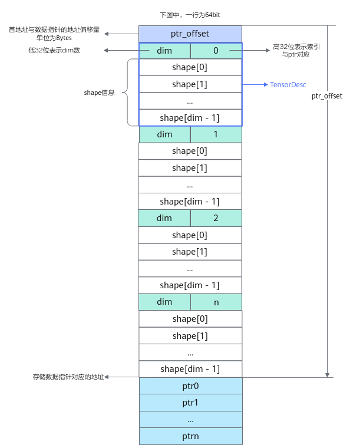
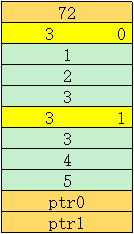

# ListTensorDesc<a name="ZH-CN_TOPIC_0000001714160421"></a>

## 产品支持情况<a name="section1550532418810"></a>

<a name="table38301303189"></a>
<table><thead align="left"><tr id="row20831180131817"><th class="cellrowborder" valign="top" width="57.99999999999999%" id="mcps1.1.3.1.1"><p id="p1883113061818"><a name="p1883113061818"></a><a name="p1883113061818"></a><span id="ph20833205312295"><a name="ph20833205312295"></a><a name="ph20833205312295"></a>产品</span></p>
</th>
<th class="cellrowborder" align="center" valign="top" width="42%" id="mcps1.1.3.1.2"><p id="p783113012187"><a name="p783113012187"></a><a name="p783113012187"></a>是否支持</p>
</th>
</tr>
</thead>
<tbody><tr id="row1272474920205"><td class="cellrowborder" valign="top" width="57.99999999999999%" headers="mcps1.1.3.1.1 "><p id="p17301775812"><a name="p17301775812"></a><a name="p17301775812"></a><span id="ph2272194216543"><a name="ph2272194216543"></a><a name="ph2272194216543"></a>Ascend 950PR/Ascend 950DT</span></p>
</td>
<td class="cellrowborder" align="center" valign="top" width="42%" headers="mcps1.1.3.1.2 "><p id="p178156622310"><a name="p178156622310"></a><a name="p178156622310"></a>x</p>
</td>
</tr>
<tr id="row220181016240"><td class="cellrowborder" valign="top" width="57.99999999999999%" headers="mcps1.1.3.1.1 "><p id="p48327011813"><a name="p48327011813"></a><a name="p48327011813"></a><span id="ph583230201815"><a name="ph583230201815"></a><a name="ph583230201815"></a><term id="zh-cn_topic_0000001312391781_term1253731311225"><a name="zh-cn_topic_0000001312391781_term1253731311225"></a><a name="zh-cn_topic_0000001312391781_term1253731311225"></a>Atlas A3 训练系列产品</term>/<term id="zh-cn_topic_0000001312391781_term131434243115"><a name="zh-cn_topic_0000001312391781_term131434243115"></a><a name="zh-cn_topic_0000001312391781_term131434243115"></a>Atlas A3 推理系列产品</term></span></p>
</td>
<td class="cellrowborder" align="center" valign="top" width="42%" headers="mcps1.1.3.1.2 "><p id="p7948163910184"><a name="p7948163910184"></a><a name="p7948163910184"></a>√</p>
</td>
</tr>
<tr id="row173226882415"><td class="cellrowborder" valign="top" width="57.99999999999999%" headers="mcps1.1.3.1.1 "><p id="p14832120181815"><a name="p14832120181815"></a><a name="p14832120181815"></a><span id="ph1483216010188"><a name="ph1483216010188"></a><a name="ph1483216010188"></a><term id="zh-cn_topic_0000001312391781_term11962195213215"><a name="zh-cn_topic_0000001312391781_term11962195213215"></a><a name="zh-cn_topic_0000001312391781_term11962195213215"></a>Atlas A2 训练系列产品</term>/<term id="zh-cn_topic_0000001312391781_term184716139811"><a name="zh-cn_topic_0000001312391781_term184716139811"></a><a name="zh-cn_topic_0000001312391781_term184716139811"></a>Atlas A2 推理系列产品</term></span></p>
</td>
<td class="cellrowborder" align="center" valign="top" width="42%" headers="mcps1.1.3.1.2 "><p id="p19948143911820"><a name="p19948143911820"></a><a name="p19948143911820"></a>√</p>
</td>
</tr>
</tbody>
</table>

## 功能说明<a name="section195171847105215"></a>

ListTensorDesc用来解析符合以下内存排布格式的数据， 并在kernel侧根据索引获取储存对应数据的地址及shape信息。



## 需要包含的头文件<a name="section12341115212912"></a>

```
#include "kernel_operator_list_tensor_intf.h"
```

## 函数原型<a name="zh-cn_topic_0000001441184464_section620mcpsimp"></a>

```
class ListTensorDesc {
    ListTensorDesc();
    ListTensorDesc(__gm__ void* data, uint32_t length = 0xffffffff, uint32_t shapeSize = 0xffffffff);
    void Init(__gm__ void* data, uint32_t length = 0xffffffff, uint32_t shapeSize = 0xffffffff);
    template<class T> void GetDesc(TensorDesc<T>& desc, uint32_t index);
    template<class T> T* GetDataPtr(uint32_t index);
    uint32_t GetSize();
}
```

## 函数说明<a name="section396516531098"></a>

**表 1**  模板参数说明

<a name="table13588175515344"></a>
<table><thead align="left"><tr id="row1160915519346"><th class="cellrowborder" valign="top" width="21.8%" id="mcps1.2.3.1.1"><p id="p9609105553412"><a name="p9609105553412"></a><a name="p9609105553412"></a>参数名</p>
</th>
<th class="cellrowborder" valign="top" width="78.2%" id="mcps1.2.3.1.2"><p id="p156091955143419"><a name="p156091955143419"></a><a name="p156091955143419"></a>描述</p>
</th>
</tr>
</thead>
<tbody><tr id="row1545073919457"><td class="cellrowborder" valign="top" width="21.8%" headers="mcps1.2.3.1.1 "><p id="p1745103924512"><a name="p1745103924512"></a><a name="p1745103924512"></a>T</p>
</td>
<td class="cellrowborder" valign="top" width="78.2%" headers="mcps1.2.3.1.2 "><p id="p11700113714195"><a name="p11700113714195"></a><a name="p11700113714195"></a>Tensor中元素的数据类型。</p>
</td>
</tr>
</tbody>
</table>

**表 2**  函数及参数说明

<a name="table153364918102"></a>
<table><thead align="left"><tr id="row7363209171013"><th class="cellrowborder" valign="top" width="22.58%" id="mcps1.2.4.1.1"><p id="p136399171010"><a name="p136399171010"></a><a name="p136399171010"></a><strong id="b137544519107"><a name="b137544519107"></a><a name="b137544519107"></a>函数名称</strong></p>
</th>
<th class="cellrowborder" valign="top" width="32.879999999999995%" id="mcps1.2.4.1.2"><p id="p7363209141012"><a name="p7363209141012"></a><a name="p7363209141012"></a><strong id="b1767135119100"><a name="b1767135119100"></a><a name="b1767135119100"></a>入参说明</strong></p>
</th>
<th class="cellrowborder" valign="top" width="44.54%" id="mcps1.2.4.1.3"><p id="p736369161015"><a name="p736369161015"></a><a name="p736369161015"></a><strong id="b3770145112107"><a name="b3770145112107"></a><a name="b3770145112107"></a>含义</strong></p>
</th>
</tr>
</thead>
<tbody><tr id="row8679452171114"><td class="cellrowborder" valign="top" width="22.58%" headers="mcps1.2.4.1.1 "><p id="p048812536114"><a name="p048812536114"></a><a name="p048812536114"></a>ListTensorDesc</p>
</td>
<td class="cellrowborder" valign="top" width="32.879999999999995%" headers="mcps1.2.4.1.2 "><p id="p20679185210116"><a name="p20679185210116"></a><a name="p20679185210116"></a>-</p>
</td>
<td class="cellrowborder" valign="top" width="44.54%" headers="mcps1.2.4.1.3 "><p id="p66799524117"><a name="p66799524117"></a><a name="p66799524117"></a>默认构造函数，需配合Init函数使用。</p>
</td>
</tr>
<tr id="row2036317913108"><td class="cellrowborder" valign="top" width="22.58%" headers="mcps1.2.4.1.1 "><p id="p836312981011"><a name="p836312981011"></a><a name="p836312981011"></a>ListTensorDesc</p>
</td>
<td class="cellrowborder" valign="top" width="32.879999999999995%" headers="mcps1.2.4.1.2 "><p id="p412513492010"><a name="p412513492010"></a><a name="p412513492010"></a>data：待解析数据的首地址</p>
<p id="p13363493109"><a name="p13363493109"></a><a name="p13363493109"></a>length：待解析内存的长度</p>
<p id="p133633981020"><a name="p133633981020"></a><a name="p133633981020"></a>shapeSize：数据指针的个数</p>
<p id="p5441241210"><a name="p5441241210"></a><a name="p5441241210"></a>length和shapeSize仅用于校验，不填写时不进行校验</p>
</td>
<td class="cellrowborder" valign="top" width="44.54%" headers="mcps1.2.4.1.3 "><p id="p736312951011"><a name="p736312951011"></a><a name="p736312951011"></a>ListTensorDesc类的构造函数，用于解析对应的内存排布。</p>
</td>
</tr>
<tr id="row18487145155715"><td class="cellrowborder" valign="top" width="22.58%" headers="mcps1.2.4.1.1 "><p id="p727005014572"><a name="p727005014572"></a><a name="p727005014572"></a>Init</p>
</td>
<td class="cellrowborder" valign="top" width="32.879999999999995%" headers="mcps1.2.4.1.2 "><p id="p337451113583"><a name="p337451113583"></a><a name="p337451113583"></a>data：待解析数据的首地址</p>
<p id="p637411135819"><a name="p637411135819"></a><a name="p637411135819"></a>length：待解析内存的长度</p>
<p id="p11374171114582"><a name="p11374171114582"></a><a name="p11374171114582"></a>shapeSize：数据指针的个数</p>
<p id="p10374131114583"><a name="p10374131114583"></a><a name="p10374131114583"></a>length和shapeSize仅用于校验，不填写时不进行校验</p>
</td>
<td class="cellrowborder" valign="top" width="44.54%" headers="mcps1.2.4.1.3 "><p id="p1848724515571"><a name="p1848724515571"></a><a name="p1848724515571"></a>初始化函数，用于解析对应的内存排布。</p>
</td>
</tr>
<tr id="row6363594108"><td class="cellrowborder" valign="top" width="22.58%" headers="mcps1.2.4.1.1 "><p id="p203647981019"><a name="p203647981019"></a><a name="p203647981019"></a>GetDesc</p>
</td>
<td class="cellrowborder" valign="top" width="32.879999999999995%" headers="mcps1.2.4.1.2 "><p id="p036429151011"><a name="p036429151011"></a><a name="p036429151011"></a>desc：出参，解析后的Tensor描述信息</p>
<p id="p1836410919102"><a name="p1836410919102"></a><a name="p1836410919102"></a>index：索引值</p>
</td>
<td class="cellrowborder" valign="top" width="44.54%" headers="mcps1.2.4.1.3 "><p id="p1364129101013"><a name="p1364129101013"></a><a name="p1364129101013"></a>根据index获得功能说明图中对应的TensorDesc信息。</p>
<p id="zh-cn_topic_0000001441184464_p4760716131514"><a name="zh-cn_topic_0000001441184464_p4760716131514"></a><a name="zh-cn_topic_0000001441184464_p4760716131514"></a>使用GetDesc前需要先调用TensorDesc.SetShapeAddr为desc指定用于储存shape信息的地址，调用GetDesc后会将shape信息写入该地址。</p>
<p id="p173433415610"><a name="p173433415610"></a><a name="p173433415610"></a><span id="ph113414344611"><a name="ph113414344611"></a><a name="ph113414344611"></a><term id="zh-cn_topic_0000001312391781_term11962195213215_1"><a name="zh-cn_topic_0000001312391781_term11962195213215_1"></a><a name="zh-cn_topic_0000001312391781_term11962195213215_1"></a>Atlas A2 训练系列产品</term>/<term id="zh-cn_topic_0000001312391781_term184716139811_1"><a name="zh-cn_topic_0000001312391781_term184716139811_1"></a><a name="zh-cn_topic_0000001312391781_term184716139811_1"></a>Atlas A2 推理系列产品</term></span>支持该功能</p>
<p id="p286194811518"><a name="p286194811518"></a><a name="p286194811518"></a><span id="ph14862134820150"><a name="ph14862134820150"></a><a name="ph14862134820150"></a><term id="zh-cn_topic_0000001312391781_term1253731311225_1"><a name="zh-cn_topic_0000001312391781_term1253731311225_1"></a><a name="zh-cn_topic_0000001312391781_term1253731311225_1"></a>Atlas A3 训练系列产品</term>/<term id="zh-cn_topic_0000001312391781_term131434243115_1"><a name="zh-cn_topic_0000001312391781_term131434243115_1"></a><a name="zh-cn_topic_0000001312391781_term131434243115_1"></a>Atlas A3 推理系列产品</term></span>支持该功能</p>
</td>
</tr>
<tr id="row936499191010"><td class="cellrowborder" valign="top" width="22.58%" headers="mcps1.2.4.1.1 "><p id="p1636415981013"><a name="p1636415981013"></a><a name="p1636415981013"></a>GetDataPtr</p>
</td>
<td class="cellrowborder" valign="top" width="32.879999999999995%" headers="mcps1.2.4.1.2 "><p id="p93647921018"><a name="p93647921018"></a><a name="p93647921018"></a>index：索引值</p>
</td>
<td class="cellrowborder" valign="top" width="44.54%" headers="mcps1.2.4.1.3 "><p id="p4364996106"><a name="p4364996106"></a><a name="p4364996106"></a>根据index获取储存对应数据的地址。</p>
</td>
</tr>
<tr id="row1936417910103"><td class="cellrowborder" valign="top" width="22.58%" headers="mcps1.2.4.1.1 "><p id="p133641294106"><a name="p133641294106"></a><a name="p133641294106"></a>GetSize</p>
</td>
<td class="cellrowborder" valign="top" width="32.879999999999995%" headers="mcps1.2.4.1.2 "><p id="p636449101018"><a name="p636449101018"></a><a name="p636449101018"></a>-</p>
</td>
<td class="cellrowborder" valign="top" width="44.54%" headers="mcps1.2.4.1.3 "><p id="p2036420914106"><a name="p2036420914106"></a><a name="p2036420914106"></a>获取ListTensor中包含的数据指针的个数。</p>
</td>
</tr>
</tbody>
</table>

## 调用示例<a name="section1742652412511"></a>

示例中待解析的srcGm内存排布如下图所示：



```
AscendC::ListTensorDesc listTensorDesc(reinterpret_cast<__gm__ void *>(srcGm)); // srcGm为待解析的gm地址
uint32_t size = listTensorDesc.GetSize();                                       // size = 2
auto dataPtr0 = listTensorDesc.GetDataPtr<int32_t>(0);                          // 获取ptr0
auto dataPtr1 = listTensorDesc.GetDataPtr<int32_t>(1);                          // 获取ptr1

uint64_t buf[100] = {0}; // 示例中Tensor的dim为3, 此处的100表示预留足够大的空间
AscendC::TensorDesc<int32_t> desc;
desc.SetShapeAddr(buf);          // 为desc指定用于储存shape信息的地址
listTensorDesc.GetDesc(desc, 0); // 获取索引0的shape信息

uint64_t dim = desc.GetDim();   // dim = 3
uint64_t idx = desc.GetIndex(); // idx = 0
uint64_t shape[3] = {0};
for (uint32_t i = 0; i < desc.GetDim(); i++)
{
    shape[i] = desc.GetShape(i); // GetShape(0) = 1, GetShape(1) = 2, GetShape(2) = 3
}
auto ptr = desc.GetDataPtr();
```

