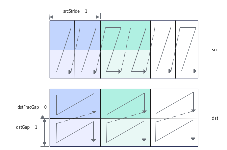
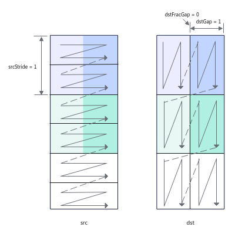

# LoadDataWithTranspose<a name="ZH-CN_TOPIC_0000001788021078"></a>

## AI处理器支持情况<a name="section1550532418810"></a>

<a name="table38301303189"></a>
<table><thead align="left"><tr id="row20831180131817"><th class="cellrowborder" valign="top" width="57.99999999999999%" id="mcps1.1.3.1.1"><p id="p1883113061818"><a name="p1883113061818"></a><a name="p1883113061818"></a><span id="ph20833205312295"><a name="ph20833205312295"></a><a name="ph20833205312295"></a>AI处理器类型</span></p>
</th>
<th class="cellrowborder" align="center" valign="top" width="42%" id="mcps1.1.3.1.2"><p id="p783113012187"><a name="p783113012187"></a><a name="p783113012187"></a>是否支持</p>
</th>
</tr>
</thead>
<tbody><tr id="row220181016240"><td class="cellrowborder" valign="top" width="57.99999999999999%" headers="mcps1.1.3.1.1 "><p id="p48327011813"><a name="p48327011813"></a><a name="p48327011813"></a><span id="ph583230201815"><a name="ph583230201815"></a><a name="ph583230201815"></a><term id="zh-cn_topic_0000001312391781_term1253731311225"><a name="zh-cn_topic_0000001312391781_term1253731311225"></a><a name="zh-cn_topic_0000001312391781_term1253731311225"></a>Ascend 910C</term></span></p>
</td>
<td class="cellrowborder" align="center" valign="top" width="42%" headers="mcps1.1.3.1.2 "><p id="p7948163910184"><a name="p7948163910184"></a><a name="p7948163910184"></a>√</p>
</td>
</tr>
<tr id="row173226882415"><td class="cellrowborder" valign="top" width="57.99999999999999%" headers="mcps1.1.3.1.1 "><p id="p14832120181815"><a name="p14832120181815"></a><a name="p14832120181815"></a><span id="ph1483216010188"><a name="ph1483216010188"></a><a name="ph1483216010188"></a><term id="zh-cn_topic_0000001312391781_term11962195213215"><a name="zh-cn_topic_0000001312391781_term11962195213215"></a><a name="zh-cn_topic_0000001312391781_term11962195213215"></a>Ascend 910B</term></span></p>
</td>
<td class="cellrowborder" align="center" valign="top" width="42%" headers="mcps1.1.3.1.2 "><p id="p19948143911820"><a name="p19948143911820"></a><a name="p19948143911820"></a>√</p>
</td>
</tr>
</tbody>
</table>

## 功能说明<a name="section618mcpsimp"></a>

该接口实现带转置的2D格式数据从A1/B1到A2/B2的加载。

下面通过示例来讲解接口功能和关键参数：下文图中一个N形或者一个Z形代表一个分形。

-   对于uint8\_t/int8\_t数据类型，每次迭代处理32\*32\*1B数据，可处理2个分形（一个分形512B），每次迭代中，源操作数中2个连续的16\*32分形将被合并为1个32\*32的方块矩阵，基于方块矩阵做转置，转置后分裂为2个16\*32分形，根据目的操作数分形间隔等参数可以有不同的排布。

    如下图示例：

    -   共需要处理3072B的数据，每次迭代处理32\*32\*1B数据，需要3次迭代可以完成，repeatTime = 3；
    -   srcStride = 1，表示相邻迭代间，源操作数前一个方块矩阵与后一个方块矩阵起始地址的间隔为1（单位：32\*32\*1B），这里的单位实际上是拼接后的方块矩阵的大小；
    -   dstGap = 1，表示相邻迭代间，目的操作数前一个迭代第一个分形的结束地址到下一个迭代第一个分形起始地址的间隔为1（单位：512B）；
    -   dstFracGap = 0，表示每个迭代内目的操作数前一个分形的结束地址与后一个分形起始地址的间隔为0（单位：512B）。

    

    如下图示例：

    -   repeatTime和srcStride的解释和上图示例一致。
    -   dstGap = 0，表示相邻迭代间，目的操作数前一个迭代第一个分形的结束地址和下一个迭代第一个分形起始地址无间隔。
    -   dstFracGap = 2，表示每个迭代内目的操作数前一个分形的结束地址与后一个分形起始地址的间隔为2（单位：512B）。

    

-   对于half/bfloat16\_t数据类型，每次迭代处理16\*16\*2B数据，可处理1个分形（一个分形512B），每次迭代中，源操作数中1个16\*16分形将被转置。

    -   共需要处理1536B的数据，每次迭代处理16\*16\*2B数据，需要3次迭代可以完成，repeatTime = 3；
    -   srcStride = 1，表示相邻迭代间，源操作数前一个方块矩阵与后一个方块矩阵起始地址的间隔为1 （单位：16\*16\*2B）；
    -   dstGap = 0，表示相邻迭代间，目的操作数前一个迭代第一个分形的结束地址到下一个迭代第一个分形起始地址无间隔；
    -   该场景下，因为其分形即为方块矩阵，每个迭代处理一个分形，不存在迭代内分形的间隔，该参数设置无效。

    

-   对于float/int32\_t/uint32\_t数据类型，每次迭代处理16\*16\*4B数据，可处理2个分形（一个分形512B），每次迭代中，源操作数2个连续的16\*8分形将被合并为1个16\*16的方块矩阵，基于方块矩阵做转置，转置后分裂为2个16\*8分形，根据目的操作数分形间隔等参数可以有不同的排布。

    如下图示例：

    -   共需要处理3072B的数据，每次迭代处理16\*16\*4B数据，需要3次迭代可以完成，repeatTime = 3；
    -   srcStride = 1，表示相邻迭代间，源操作数前一个方块矩阵与后一个方块矩阵起始地址的间隔为1（单位：16\*16\*4B），这里的单位实际上是拼接后的方块矩阵的大小；
    -   dstGap = 1，表示相邻迭代间，目的操作数前一个迭代第一个分形的结束地址到下一个迭代第一个分形起始地址的间隔为1（单位：512B）；
    -   dstFracGap = 0，表示每个迭代内目的操作数前一个分形结束地址与后一个分形起始地址的间隔为0（单位：512B）。

    

    如下图示例：

    -   repeatTime和srcStride的解释和上图示例一致。
    -   dstGap = 0，表示相邻迭代间，目的操作数前一个迭代第一个分形的结束地址和下一个迭代第一个分形起始地址无间隔。
    -   dstFracGap = 2，表示每个迭代内目的操作数前一个分形结束地址与后一个分形起始地址的间隔为2（单位：512B）。

    

-   对于int4b\_t数据类型，每次迭代处理64\*64\*0.5B数据，可处理4个分形（一个分形512B），每次迭代中，源操作数中4个连续的16\*64分形将被合并为1个64\*64的方块矩阵，基于方块矩阵做转置，转置后分裂为4个16\*64分形，根据目的操作数分形间隔等参数可以有不同的排布。

    int4b\_t数据类型需要两个数拼成一个int8\_t或uint8\_t的数，拼凑的规则如下：

    

    如下图示例：

    -   共需要处理6144B的数据，每次迭代处理64\*64\*0.5B数据，需要3次迭代可以完成，repeatTime = 3；
    -   srcStride = 1，表示相邻迭代间，源操作数前一个方块矩阵与后一个方块矩阵起始地址的间隔为1（单位：64\*64\*0.5B），这里的单位实际上是拼接后的方块矩阵的大小；
    -   dstGap = 1，表示相邻迭代间，目的操作数前一个迭代第一个分形的结束地址到下一个迭代第一个分形起始地址的间隔为1（单位：512B）；
    -   dstFracGap = 0，表示每个迭代内目的操作数前一个分形的结束地址与后一个分形起始地址的间隔为0（单位：512B）。

    

    如下图示例：

    -   repeatTime和srcStride的解释和上图示例一致。
    -   dstGap = 0，表示相邻迭代间，目的操作数前一个迭代第一个分形的结束地址和下一个迭代第一个分形起始地址无间隔。
    -   dstFracGap = 2，表示每个迭代内目的操作数前一个分形的结束地址与后一个分形起始地址的间隔为2（单位：512B）。

    

## 函数原型<a name="section620mcpsimp"></a>

```
template <typename T>
__aicore__ inline void LoadDataWithTranspose(const LocalTensor<T>& dst, const LocalTensor<T>& src, const LoadData2dTransposeParams& loadDataParams)
```

```

```

## 参数说明<a name="section622mcpsimp"></a>

**表 1**  模板参数说明

<a name="table17296541585"></a>
<table><thead align="left"><tr id="row92913547813"><th class="cellrowborder" valign="top" width="22.869999999999997%" id="mcps1.2.3.1.1"><p id="p1117617228103"><a name="p1117617228103"></a><a name="p1117617228103"></a>参数名</p>
</th>
<th class="cellrowborder" valign="top" width="77.13%" id="mcps1.2.3.1.2"><p id="p14176192219101"><a name="p14176192219101"></a><a name="p14176192219101"></a>描述</p>
</th>
</tr>
</thead>
<tbody><tr id="row132910546816"><td class="cellrowborder" valign="top" width="22.869999999999997%" headers="mcps1.2.3.1.1 "><p id="p229195410812"><a name="p229195410812"></a><a name="p229195410812"></a>T</p>
</td>
<td class="cellrowborder" valign="top" width="77.13%" headers="mcps1.2.3.1.2 "><p id="p990614114434"><a name="p990614114434"></a><a name="p990614114434"></a><span id="ph17565161613616"><a name="ph17565161613616"></a><a name="ph17565161613616"></a><term id="zh-cn_topic_0000001312391781_term11962195213215_1"><a name="zh-cn_topic_0000001312391781_term11962195213215_1"></a><a name="zh-cn_topic_0000001312391781_term11962195213215_1"></a>Ascend 910B</term></span>，支持的数据类型为：int4b_t/int8_t/uint8_t/half/bfloat16_t/float/int32_t/uint32_t。</p>
<p id="p523904010149"><a name="p523904010149"></a><a name="p523904010149"></a><span id="ph16239174011416"><a name="ph16239174011416"></a><a name="ph16239174011416"></a><term id="zh-cn_topic_0000001312391781_term1253731311225_1"><a name="zh-cn_topic_0000001312391781_term1253731311225_1"></a><a name="zh-cn_topic_0000001312391781_term1253731311225_1"></a>Ascend 910C</term></span>，支持的数据类型为：int4b_t/int8_t/uint8_t/half/bfloat16_t/float/int32_t/uint32_t。</p>
<p id="p1978741114"><a name="p1978741114"></a><a name="p1978741114"></a>其中int4b_t数据类型仅在LocalTensor的TPosition为B2时支持。</p>
</td>
</tr>
</tbody>
</table>

**表 2**  参数说明

<a name="table8955841508"></a>
<table><thead align="left"><tr id="row15956194105014"><th class="cellrowborder" valign="top" width="23.002300230023003%" id="mcps1.2.4.1.1"><p id="p7956144195014"><a name="p7956144195014"></a><a name="p7956144195014"></a>参数名称</p>
</th>
<th class="cellrowborder" valign="top" width="10.03100310031003%" id="mcps1.2.4.1.2"><p id="p1295624145013"><a name="p1295624145013"></a><a name="p1295624145013"></a>输入/输出</p>
</th>
<th class="cellrowborder" valign="top" width="66.96669666966696%" id="mcps1.2.4.1.3"><p id="p16956144145011"><a name="p16956144145011"></a><a name="p16956144145011"></a>含义</p>
</th>
</tr>
</thead>
<tbody><tr id="row5956546509"><td class="cellrowborder" valign="top" width="23.002300230023003%" headers="mcps1.2.4.1.1 "><p id="p19287714181617"><a name="p19287714181617"></a><a name="p19287714181617"></a>dst</p>
</td>
<td class="cellrowborder" valign="top" width="10.03100310031003%" headers="mcps1.2.4.1.2 "><p id="p192871614151615"><a name="p192871614151615"></a><a name="p192871614151615"></a>输出</p>
</td>
<td class="cellrowborder" valign="top" width="66.96669666966696%" headers="mcps1.2.4.1.3 "><p id="p7937181983414"><a name="p7937181983414"></a><a name="p7937181983414"></a>目的操作数，结果矩阵，类型为LocalTensor。</p>
<p id="p16287121461618"><a name="p16287121461618"></a><a name="p16287121461618"></a><span id="ph16453145783416"><a name="ph16453145783416"></a><a name="ph16453145783416"></a><term id="zh-cn_topic_0000001312391781_term11962195213215_2"><a name="zh-cn_topic_0000001312391781_term11962195213215_2"></a><a name="zh-cn_topic_0000001312391781_term11962195213215_2"></a>Ascend 910B</term></span>，支持的TPosition为A2/B2。</p>
<p id="p1118816112359"><a name="p1118816112359"></a><a name="p1118816112359"></a><span id="ph1229951712358"><a name="ph1229951712358"></a><a name="ph1229951712358"></a><term id="zh-cn_topic_0000001312391781_term1253731311225_2"><a name="zh-cn_topic_0000001312391781_term1253731311225_2"></a><a name="zh-cn_topic_0000001312391781_term1253731311225_2"></a>Ascend 910C</term></span>，支持的TPosition为A2/B2。</p>
<p id="p9467144018445"><a name="p9467144018445"></a><a name="p9467144018445"></a>LocalTensor的起始地址需要保证512字节对齐。</p>
<p id="p1127919573117"><a name="p1127919573117"></a><a name="p1127919573117"></a>数据类型和src的数据类型保持一致。</p>
</td>
</tr>
<tr id="row4956154125018"><td class="cellrowborder" valign="top" width="23.002300230023003%" headers="mcps1.2.4.1.1 "><p id="p142871414131614"><a name="p142871414131614"></a><a name="p142871414131614"></a>src</p>
</td>
<td class="cellrowborder" valign="top" width="10.03100310031003%" headers="mcps1.2.4.1.2 "><p id="p628711148165"><a name="p628711148165"></a><a name="p628711148165"></a>输入</p>
</td>
<td class="cellrowborder" valign="top" width="66.96669666966696%" headers="mcps1.2.4.1.3 "><p id="p7888103453511"><a name="p7888103453511"></a><a name="p7888103453511"></a>源操作数，类型为LocalTensor。</p>
<p id="p54481413617"><a name="p54481413617"></a><a name="p54481413617"></a><span id="ph3441114173620"><a name="ph3441114173620"></a><a name="ph3441114173620"></a><term id="zh-cn_topic_0000001312391781_term11962195213215_3"><a name="zh-cn_topic_0000001312391781_term11962195213215_3"></a><a name="zh-cn_topic_0000001312391781_term11962195213215_3"></a>Ascend 910B</term></span>，支持的TPosition为A1/B1。</p>
<p id="p344151412368"><a name="p344151412368"></a><a name="p344151412368"></a><span id="ph174481423610"><a name="ph174481423610"></a><a name="ph174481423610"></a><term id="zh-cn_topic_0000001312391781_term1253731311225_3"><a name="zh-cn_topic_0000001312391781_term1253731311225_3"></a><a name="zh-cn_topic_0000001312391781_term1253731311225_3"></a>Ascend 910C</term></span>，支持的TPosition为A1/B1。</p>
<p id="p128771714204514"><a name="p128771714204514"></a><a name="p128771714204514"></a>LocalTensor的起始地址需要保证32字节对齐。</p>
<p id="p9810121419213"><a name="p9810121419213"></a><a name="p9810121419213"></a>数据类型和dst的数据类型保持一致。</p>
</td>
</tr>
<tr id="row1075785651510"><td class="cellrowborder" valign="top" width="23.002300230023003%" headers="mcps1.2.4.1.1 "><p id="p1728791441620"><a name="p1728791441620"></a><a name="p1728791441620"></a>loadDataParams</p>
</td>
<td class="cellrowborder" valign="top" width="10.03100310031003%" headers="mcps1.2.4.1.2 "><p id="p11287151451610"><a name="p11287151451610"></a><a name="p11287151451610"></a>输入</p>
</td>
<td class="cellrowborder" valign="top" width="66.96669666966696%" headers="mcps1.2.4.1.3 "><p id="p17376814155615"><a name="p17376814155615"></a><a name="p17376814155615"></a>LoadDataWithTranspose相关参数，类型为LoadData2dTransposeParams。</p>
<p id="p395104375712"><a name="p395104375712"></a><a name="p395104375712"></a>具体定义请参考<span id="ph10562197165916"><a name="ph10562197165916"></a><a name="ph10562197165916"></a>${INSTALL_DIR}</span>/include/ascendc/basic_api/interface/kernel_struct_mm.h，<span id="ph14322531015"><a name="ph14322531015"></a><a name="ph14322531015"></a>${INSTALL_DIR}</span>请替换为CANN软件安装后文件存储路径。</p>
<p id="p12287014111614"><a name="p12287014111614"></a><a name="p12287014111614"></a>参数说明请参考<a href="#table13526111319538">表3</a>。</p>
</td>
</tr>
</tbody>
</table>

**表 3**  LoadData2dTransposeParams结构体内参数说明

<a name="table13526111319538"></a>
<table><thead align="left"><tr id="row175271813105316"><th class="cellrowborder" valign="top" width="15.28152815281528%" id="mcps1.2.4.1.1"><p id="p6527713145318"><a name="p6527713145318"></a><a name="p6527713145318"></a>参数名称</p>
</th>
<th class="cellrowborder" valign="top" width="12.451245124512452%" id="mcps1.2.4.1.2"><p id="p19527171319534"><a name="p19527171319534"></a><a name="p19527171319534"></a>输入/输出</p>
</th>
<th class="cellrowborder" valign="top" width="72.26722672267228%" id="mcps1.2.4.1.3"><p id="p1652721305311"><a name="p1652721305311"></a><a name="p1652721305311"></a>含义</p>
</th>
</tr>
</thead>
<tbody><tr id="row0527151318536"><td class="cellrowborder" valign="top" width="15.28152815281528%" headers="mcps1.2.4.1.1 "><p id="p1855384918180"><a name="p1855384918180"></a><a name="p1855384918180"></a>startIndex</p>
</td>
<td class="cellrowborder" valign="top" width="12.451245124512452%" headers="mcps1.2.4.1.2 "><p id="p75532491189"><a name="p75532491189"></a><a name="p75532491189"></a>输入</p>
</td>
<td class="cellrowborder" valign="top" width="72.26722672267228%" headers="mcps1.2.4.1.3 "><p id="p13419321144217"><a name="p13419321144217"></a><a name="p13419321144217"></a>方块矩阵ID，搬运起始位置为源操作数中第几个方块矩阵（0 为源操作数中第1个方块矩阵）。取值范围：startIndex∈[0, 65535] 。默认为0。</p>
<p id="p35535499185"><a name="p35535499185"></a><a name="p35535499185"></a>例如，源操作数中有20个大小为16*8*4B的分形（数据类型为float），startIndex=1表示搬运起始位置为第2个方块矩阵，即将第3和第4个分形从源操作数中转置到目的操作数中（第1、2个分形组成第1个方块矩阵，第3、4个分形组成第2个方块矩阵）。</p>
</td>
</tr>
<tr id="row195271213135317"><td class="cellrowborder" valign="top" width="15.28152815281528%" headers="mcps1.2.4.1.1 "><p id="p955315493182"><a name="p955315493182"></a><a name="p955315493182"></a>repeatTimes</p>
</td>
<td class="cellrowborder" valign="top" width="12.451245124512452%" headers="mcps1.2.4.1.2 "><p id="p755314991818"><a name="p755314991818"></a><a name="p755314991818"></a>输入</p>
</td>
<td class="cellrowborder" valign="top" width="72.26722672267228%" headers="mcps1.2.4.1.3 "><p id="p227396135817"><a name="p227396135817"></a><a name="p227396135817"></a>迭代次数。</p>
<p id="p92731369589"><a name="p92731369589"></a><a name="p92731369589"></a>对于uint8_t/int8_t数据类型，每次迭代处理32*32*1B数据；</p>
<p id="p152731567588"><a name="p152731567588"></a><a name="p152731567588"></a>对于half/bfloat16_t数据类型，每次迭代处理16*16*2B数据；</p>
<p id="p927366175817"><a name="p927366175817"></a><a name="p927366175817"></a>对于float/int32_t/uint32_t数据类型，每次迭代处理16*16*4B数据。</p>
<p id="p937417591327"><a name="p937417591327"></a><a name="p937417591327"></a>对于int4b_t数据类型，每次迭代处理16*64*0.5B数据。</p>
<p id="p15553949101816"><a name="p15553949101816"></a><a name="p15553949101816"></a>取值范围：repeatTimes∈[0, 255]。默认为0。</p>
</td>
</tr>
<tr id="row11771625161812"><td class="cellrowborder" valign="top" width="15.28152815281528%" headers="mcps1.2.4.1.1 "><p id="p055374920185"><a name="p055374920185"></a><a name="p055374920185"></a>srcStride</p>
</td>
<td class="cellrowborder" valign="top" width="12.451245124512452%" headers="mcps1.2.4.1.2 "><p id="p6553449121814"><a name="p6553449121814"></a><a name="p6553449121814"></a>输入</p>
</td>
<td class="cellrowborder" valign="top" width="72.26722672267228%" headers="mcps1.2.4.1.3 "><p id="p4488340145917"><a name="p4488340145917"></a><a name="p4488340145917"></a>相邻迭代间，源操作数前一个分形与后一个分形起始地址的间隔。这里的单位实际上是拼接后的方块矩阵的大小。</p>
<p id="p4488640135916"><a name="p4488640135916"></a><a name="p4488640135916"></a>对于uint8_t/int8_t数据类型，单位是32*32*1B；</p>
<p id="p24883402596"><a name="p24883402596"></a><a name="p24883402596"></a>对于half/bfloat16_t数据类型，单位是16*16*2B；</p>
<p id="p11488104018598"><a name="p11488104018598"></a><a name="p11488104018598"></a>对于float/int32_t/uint32_t数据类型，单位是16*16*4B。</p>
<p id="p462215290314"><a name="p462215290314"></a><a name="p462215290314"></a>对于int4b_t数据类型，每次迭代处理16*64*0.5B数据。</p>
<p id="p18553154931812"><a name="p18553154931812"></a><a name="p18553154931812"></a>取值范围：srcStride∈[0, 65535]。默认为0。</p>
</td>
</tr>
<tr id="row1321772919185"><td class="cellrowborder" valign="top" width="15.28152815281528%" headers="mcps1.2.4.1.1 "><p id="p125531449181816"><a name="p125531449181816"></a><a name="p125531449181816"></a>dstGap</p>
</td>
<td class="cellrowborder" valign="top" width="12.451245124512452%" headers="mcps1.2.4.1.2 "><p id="p105545496187"><a name="p105545496187"></a><a name="p105545496187"></a>输入</p>
</td>
<td class="cellrowborder" valign="top" width="72.26722672267228%" headers="mcps1.2.4.1.3 "><p id="p1755412492183"><a name="p1755412492183"></a><a name="p1755412492183"></a>相邻迭代间，目的操作数前一个迭代第一个分形的结束地址到下一个迭代第一个分形起始地址的间隔，单位：512B。取值范围：dstGap∈[0, 65535]。默认为0。</p>
</td>
</tr>
<tr id="row16697631171819"><td class="cellrowborder" valign="top" width="15.28152815281528%" headers="mcps1.2.4.1.1 "><p id="p1555415492180"><a name="p1555415492180"></a><a name="p1555415492180"></a>dstFracGap</p>
</td>
<td class="cellrowborder" valign="top" width="12.451245124512452%" headers="mcps1.2.4.1.2 "><p id="p15554164914188"><a name="p15554164914188"></a><a name="p15554164914188"></a>输入</p>
</td>
<td class="cellrowborder" valign="top" width="72.26722672267228%" headers="mcps1.2.4.1.3 "><p id="p754716518118"><a name="p754716518118"></a><a name="p754716518118"></a>每个迭代内目的操作数转置前一个分形结束地址与后一个分形起始地址的间隔，单位为512B，仅在数据类型为float/int32_t/uint32_t/uint8_t/int8_t/int4b_t时有效。取值范围：dstFracGap∈[0, 65535]。默认为0。</p>
</td>
</tr>
<tr id="row12626101413478"><td class="cellrowborder" valign="top" width="15.28152815281528%" headers="mcps1.2.4.1.1 "><p id="p16554134921816"><a name="p16554134921816"></a><a name="p16554134921816"></a>addrMode</p>
</td>
<td class="cellrowborder" valign="top" width="12.451245124512452%" headers="mcps1.2.4.1.2 "><p id="p19554114910183"><a name="p19554114910183"></a><a name="p19554114910183"></a>输入</p>
</td>
<td class="cellrowborder" valign="top" width="72.26722672267228%" headers="mcps1.2.4.1.3 "><p id="p6264205416479"><a name="p6264205416479"></a><a name="p6264205416479"></a>预留参数。为后续的功能做保留，开发者暂时无需关注，使用默认值即可。</p>
</td>
</tr>
</tbody>
</table>

## 约束说明<a name="section633mcpsimp"></a>

-   repeat=0表示不执行搬运操作。
-   开发者需要保证目的操作数转置后的分形没有重叠。
-   操作数地址对齐要求请参见[通用地址对齐约束](通用说明和约束.md#section796754519912)。

## 调用示例<a name="section642mcpsimp"></a>

-   示例1：该示例输入a矩阵为int8\_t类型，shape为\[16,32\]，输入b矩阵为int8\_t类型，shape为\[32,64\]，输出c的类型为int32\_t。a矩阵从A1-\>A2不转置，b矩阵从B1-\>B2转置，之后进行Mmad计算和Fixpipe计算。

    ```
    #include "kernel_operator.h"
    
    template <typename dst_T, typename fmap_T, typename weight_T, typename dstCO1_T> class KernelMatmul {
    public:
        __aicore__ inline KernelMatmul()
        {
            aSize = m * k;
            bSize = k * n;
            cSize = m * n;
            nBlocks = n / 16;
        }
        __aicore__ inline void Init(__gm__ uint8_t *a, __gm__ uint8_t *b, __gm__ uint8_t *c)
        {
            aGM.SetGlobalBuffer((__gm__ fmap_T *)a);
            bGM.SetGlobalBuffer((__gm__ weight_T *)b);
            cGM.SetGlobalBuffer((__gm__ dstCO1_T *)c);
            pipe.InitBuffer(inQueueA1, 1, aSize * sizeof(fmap_T));
            pipe.InitBuffer(inQueueA2, 1, aSize * sizeof(fmap_T));
            pipe.InitBuffer(inQueueB1, 1, bSize * sizeof(weight_T));
            pipe.InitBuffer(inQueueB2, 2, bSize * sizeof(weight_T));
            pipe.InitBuffer(outQueueCO1, 1, cSize * sizeof(dstCO1_T));
        }
        __aicore__ inline void Process()
        {
            CopyIn();
            SplitA();
            SplitB();
            Compute();
            CopyOut();
        }
    
    private:
        __aicore__ inline void CopyIn()
        {
            AscendC::LocalTensor<fmap_T> a1Local = inQueueA1.AllocTensor<fmap_T>();
            AscendC::LocalTensor<weight_T> b1Local = inQueueB1.AllocTensor<weight_T>();
    
            AscendC::Nd2NzParams dataCopyA1Params;
            dataCopyA1Params.ndNum = 1;
            dataCopyA1Params.nValue = m;
            dataCopyA1Params.dValue = k;
            dataCopyA1Params.srcNdMatrixStride = 0;
            dataCopyA1Params.srcDValue = k;
            dataCopyA1Params.dstNzC0Stride = m;
            dataCopyA1Params.dstNzNStride = 1;
            dataCopyA1Params.dstNzMatrixStride = 0;
            AscendC::DataCopy(a1Local, aGM, dataCopyA1Params);
    
            AscendC::Nd2NzParams dataCopyB1Params;
            dataCopyB1Params.ndNum = 1;
            dataCopyB1Params.nValue = k;
            dataCopyB1Params.dValue = n;
            dataCopyB1Params.srcNdMatrixStride = 0;
            dataCopyB1Params.srcDValue = n;
            dataCopyB1Params.dstNzC0Stride = k;
            dataCopyB1Params.dstNzNStride = 1;
            dataCopyB1Params.dstNzMatrixStride = 0;
            AscendC::DataCopy(b1Local, bGM, dataCopyB1Params);
    
            inQueueA1.EnQue(a1Local);
            inQueueB1.EnQue(b1Local);
        }
        __aicore__ inline void SplitA()
        {
            AscendC::LocalTensor<fmap_T> a1Local = inQueueA1.DeQue<fmap_T>();
            AscendC::LocalTensor<fmap_T> a2Local = inQueueA2.AllocTensor<fmap_T>();
    
            AscendC::LoadData2DParams loadL0AParams;
            loadL0AParams.repeatTimes = aSize * sizeof(fmap_T) / 512;
            loadL0AParams.srcStride = 1;
            loadL0AParams.ifTranspose = false;
            AscendC::LoadData(a2Local, a1Local, loadL0AParams);
    
            inQueueA2.EnQue<fmap_T>(a2Local);
            inQueueA1.FreeTensor(a1Local);
        }
        __aicore__ inline void SplitB()
        {
            AscendC::LocalTensor<weight_T> b1Local = inQueueB1.DeQue<weight_T>();
            AscendC::LocalTensor<weight_T> b2Local = inQueueB2.AllocTensor<weight_T>();
    
            AscendC::LoadData2dTransposeParams loadDataParams;
            loadDataParams.startIndex = 0;
            nBlockSize = 32;
            loadDataParams.repeatTimes = n / nBlockSize;
            loadDataParams.srcStride = 1;
            loadDataParams.dstGap = 1;
            loadDataParams.dstFracGap = 0;
            AscendC::LoadDataWithTranspose(b2Local, b1Local, loadDataParams);
    
            inQueueB1.FreeTensor(b1Local);
            inQueueB2.EnQue<weight_T>(b2Local);
        }
        __aicore__ inline void Compute()
        {
            AscendC::LocalTensor<fmap_T> a2Local = inQueueA2.DeQue<fmap_T>();
            AscendC::LocalTensor<weight_T> b2Local = inQueueB2.DeQue<weight_T>();
            AscendC::LocalTensor<dstCO1_T> c1Local = outQueueCO1.AllocTensor<dstCO1_T>();
    
            AscendC::MmadParams mmadParams;
            mmadParams.m = m;
            mmadParams.n = n;
            mmadParams.k = k;
            AscendC::Mmad(c1Local, a2Local, b2Local, mmadParams);
    
            outQueueCO1.EnQue<dstCO1_T>(c1Local);
            inQueueA2.FreeTensor(a2Local);
            inQueueB2.FreeTensor(b2Local);
        }
        __aicore__ inline void CopyOut()
        {
            AscendC::LocalTensor<dstCO1_T> c1Local = outQueueCO1.DeQue<dstCO1_T>();
            AscendC::FixpipeParamsV220 fixpipeParams;
            fixpipeParams.nSize = n;
            fixpipeParams.mSize = m;
            fixpipeParams.srcStride = m;
            fixpipeParams.dstStride = n;
    
            fixpipeParams.ndNum = 1;
            fixpipeParams.srcNdStride = 0;
            fixpipeParams.dstNdStride = 0;
            AscendC::Fixpipe(cGM, c1Local, fixpipeParams);
            outQueueCO1.FreeTensor(c1Local);
        }
    
    private:
        AscendC::TPipe pipe;
    
        AscendC::TQue<AscendC::TPosition::A1, 1> inQueueA1;
        AscendC::TQue<AscendC::TPosition::A2, 1> inQueueA2;
        AscendC::TQue<AscendC::TPosition::B1, 1> inQueueB1;
        AscendC::TQue<AscendC::TPosition::B2, 1> inQueueB2;
        // dst queue
        AscendC::TQue<AscendC::TPosition::CO1, 1> outQueueCO1;
    
        AscendC::GlobalTensor<fmap_T> aGM;
        AscendC::GlobalTensor<weight_T> bGM;
        AscendC::GlobalTensor<dst_T> cGM;
    
        uint16_t m = 16, k = 32, n = 64;
        uint8_t nBlockSize = 16;
        uint16_t c0Size = 16;
        uint16_t aSize, bSize, cSize, nBlocks;
    };
    
    extern "C" __global__ __aicore__ void cube_matmul_loaddata_operator_int8_t(__gm__ uint8_t *a, __gm__ uint8_t *b,
        __gm__ uint8_t *c)
    {
        KernelMatmul<dst_type, fmap_type, weight_type, dstCO1_type> op;
        op.Init(a, b, c);
        op.Process();
    }
    ```

-   示例2：该示例输入a矩阵为half类型，shape为\[16,32\]，输入b矩阵为half类型，shape为\[32,32\]，输出c的类型为float。a矩阵从A1-\>A2不转置，b矩阵从B1-\>B2转置，之后进行Mmad计算和Fixpipe计算。

    ```
    #include "kernel_operator.h"
    
    template <typename dst_T, typename fmap_T, typename weight_T, typename dstCO1_T> class KernelMatmul {
    public:
        __aicore__ inline KernelMatmul()
        {
            aSize = m * k;
            bSize = k * n;
            cSize = m * n;
            nBlocks = n / 16;
        }
        __aicore__ inline void Init(__gm__ uint8_t *a, __gm__ uint8_t *b, __gm__ uint8_t *c)
        {
            aGM.SetGlobalBuffer((__gm__ fmap_T *)a);
            bGM.SetGlobalBuffer((__gm__ weight_T *)b);
            cGM.SetGlobalBuffer((__gm__ dstCO1_T *)c);
            pipe.InitBuffer(inQueueA1, 1, aSize * sizeof(fmap_T));
            pipe.InitBuffer(inQueueA2, 1, aSize * sizeof(fmap_T));
            pipe.InitBuffer(inQueueB1, 1, bSize * sizeof(weight_T));
            pipe.InitBuffer(inQueueB2, 2, bSize * sizeof(weight_T));
            pipe.InitBuffer(outQueueCO1, 1, cSize * sizeof(dstCO1_T));
        }
        __aicore__ inline void Process()
        {
            CopyIn();
            SplitA();
            SplitB();
            Compute();
            CopyOut();
        }
    
    private:
        __aicore__ inline void CopyIn()
        {
            AscendC::LocalTensor<fmap_T> a1Local = inQueueA1.AllocTensor<fmap_T>();
            AscendC::LocalTensor<weight_T> b1Local = inQueueB1.AllocTensor<weight_T>();
    
            AscendC::Nd2NzParams dataCopyA1Params;
            dataCopyA1Params.ndNum = 1;
            dataCopyA1Params.nValue = m;
            dataCopyA1Params.dValue = k;
            dataCopyA1Params.srcNdMatrixStride = 0;
            dataCopyA1Params.srcDValue = k;
            dataCopyA1Params.dstNzC0Stride = m;
            dataCopyA1Params.dstNzNStride = 1;
            dataCopyA1Params.dstNzMatrixStride = 0;
            AscendC::DataCopy(a1Local, aGM, dataCopyA1Params);
    
            AscendC::Nd2NzParams dataCopyB1Params;
            dataCopyB1Params.ndNum = 1;
            dataCopyB1Params.nValue = k;
            dataCopyB1Params.dValue = n;
            dataCopyB1Params.srcNdMatrixStride = 0;
            dataCopyB1Params.srcDValue = n;
            dataCopyB1Params.dstNzC0Stride = k;
            dataCopyB1Params.dstNzNStride = 1;
            dataCopyB1Params.dstNzMatrixStride = 0;
            AscendC::DataCopy(b1Local, bGM, dataCopyB1Params);
    
            inQueueA1.EnQue(a1Local);
            inQueueB1.EnQue(b1Local);
        }
        __aicore__ inline void SplitA()
        {
            AscendC::LocalTensor<fmap_T> a1Local = inQueueA1.DeQue<fmap_T>();
            AscendC::LocalTensor<fmap_T> a2Local = inQueueA2.AllocTensor<fmap_T>();
    
            AscendC::LoadData2DParams loadL0AParams;
            loadL0AParams.repeatTimes = aSize * sizeof(fmap_T) / 512;
            loadL0AParams.srcStride = 1;
            loadL0AParams.ifTranspose = false;
            AscendC::LoadData(a2Local, a1Local, loadL0AParams);
    
            inQueueA2.EnQue<fmap_T>(a2Local);
            inQueueA1.FreeTensor(a1Local);
        }
        __aicore__ inline void SplitB()
        {
            AscendC::LocalTensor<weight_T> b1Local = inQueueB1.DeQue<weight_T>();
            AscendC::LocalTensor<weight_T> b2Local = inQueueB2.AllocTensor<weight_T>();
    
            AscendC::LoadData2dTransposeParams loadDataParams;
            loadDataParams.startIndex = 0;
            nBlockSize = 16;
            loadDataParams.repeatTimes = k / nBlockSize;
            loadDataParams.srcStride = 1;
            loadDataParams.dstGap = 1;
            for (int i = 0; i < (n / nBlockSize); ++i) {
                AscendC::LoadDataWithTranspose(b2Local[i * 16 * nBlockSize], b1Local[i * k * nBlockSize], loadDataParams);
            }
    
            inQueueB1.FreeTensor(b1Local);
            inQueueB2.EnQue<weight_T>(b2Local);
        }
        __aicore__ inline void Compute()
        {
            AscendC::LocalTensor<fmap_T> a2Local = inQueueA2.DeQue<fmap_T>();
            AscendC::LocalTensor<weight_T> b2Local = inQueueB2.DeQue<weight_T>();
            AscendC::LocalTensor<dstCO1_T> c1Local = outQueueCO1.AllocTensor<dstCO1_T>();
    
            AscendC::MmadParams mmadParams;
            mmadParams.m = m;
            mmadParams.n = n;
            mmadParams.k = k;
            AscendC::Mmad(c1Local, a2Local, b2Local, mmadParams);
    
            outQueueCO1.EnQue<dstCO1_T>(c1Local);
            inQueueA2.FreeTensor(a2Local);
            inQueueB2.FreeTensor(b2Local);
        }
        __aicore__ inline void CopyOut()
        {
            AscendC::LocalTensor<dstCO1_T> c1Local = outQueueCO1.DeQue<dstCO1_T>();
            AscendC::FixpipeParamsV220 fixpipeParams;
            fixpipeParams.nSize = n;
            fixpipeParams.mSize = m;
            fixpipeParams.srcStride = m;
            fixpipeParams.dstStride = n;
    
            fixpipeParams.ndNum = 1;
            fixpipeParams.srcNdStride = 0;
            fixpipeParams.dstNdStride = 0;
            AscendC::Fixpipe(cGM, c1Local, fixpipeParams);
            outQueueCO1.FreeTensor(c1Local);
        }
    
    private:
        AscendC::TPipe pipe;
    
        AscendC::TQue<AscendC::TPosition::A1, 1> inQueueA1;
        AscendC::TQue<AscendC::TPosition::A2, 1> inQueueA2;
        AscendC::TQue<AscendC::TPosition::B1, 1> inQueueB1;
        AscendC::TQue<AscendC::TPosition::B2, 1> inQueueB2;
        // dst queue
        AscendC::TQue<AscendC::TPosition::CO1, 1> outQueueCO1;
    
        AscendC::GlobalTensor<fmap_T> aGM;
        AscendC::GlobalTensor<weight_T> bGM;
        AscendC::GlobalTensor<dst_T> cGM;
    
        uint16_t m = 16, k = 32, n = 32;
        uint8_t nBlockSize = 16;
        uint16_t c0Size = 16;
        uint16_t aSize, bSize, cSize, nBlocks;
    };
    
    extern "C" __global__ __aicore__ void cube_matmul_loaddata_operator_half(__gm__ uint8_t *a, __gm__ uint8_t *b,
        __gm__ uint8_t *c)
    {
        KernelMatmul<dst_type, fmap_type, weight_type, dstCO1_type> op;
        op.Init(a, b, c);
        op.Process();
    }
    ```

-   示例3：该示例输入a矩阵为float类型，shape为\[16,16\]，输入b矩阵为float类型，shape为\[16,32\]，输出c的类型为float。a矩阵从A1-\>A2不转置，b矩阵从B1-\>B2转置，之后进行Mmad计算和Fixpipe计算。

    ```
    #include "kernel_operator.h"
    
    template <typename dst_T, typename fmap_T, typename weight_T, typename dstCO1_T> class KernelMatmul {
    public:
        __aicore__ inline KernelMatmul()
        {
            aSize = m * k;
            bSize = k * n;
            cSize = m * n;
            nBlocks = n / 16;
        }
        __aicore__ inline void Init(__gm__ uint8_t *a, __gm__ uint8_t *b, __gm__ uint8_t *c)
        {
            aGM.SetGlobalBuffer((__gm__ fmap_T *)a);
            bGM.SetGlobalBuffer((__gm__ weight_T *)b);
            cGM.SetGlobalBuffer((__gm__ dstCO1_T *)c);
            pipe.InitBuffer(inQueueA1, 1, aSize * sizeof(fmap_T));
            pipe.InitBuffer(inQueueA2, 1, aSize * sizeof(fmap_T));
            pipe.InitBuffer(inQueueB1, 1, bSize * sizeof(weight_T));
            pipe.InitBuffer(inQueueB2, 2, bSize * sizeof(weight_T));
            pipe.InitBuffer(outQueueCO1, 1, cSize * sizeof(dstCO1_T));
        }
        __aicore__ inline void Process()
        {
            CopyIn();
            SplitA();
            SplitB();
            Compute();
            CopyOut();
        }
    
    private:
        __aicore__ inline void CopyIn()
        {
            AscendC::LocalTensor<fmap_T> a1Local = inQueueA1.AllocTensor<fmap_T>();
            AscendC::LocalTensor<weight_T> b1Local = inQueueB1.AllocTensor<weight_T>();
    
            AscendC::Nd2NzParams dataCopyA1Params;
            dataCopyA1Params.ndNum = 1;
            dataCopyA1Params.nValue = m;
            dataCopyA1Params.dValue = k;
            dataCopyA1Params.srcNdMatrixStride = 0;
            dataCopyA1Params.srcDValue = k;
            dataCopyA1Params.dstNzC0Stride = m;
            dataCopyA1Params.dstNzNStride = 1;
            dataCopyA1Params.dstNzMatrixStride = 0;
            AscendC::DataCopy(a1Local, aGM, dataCopyA1Params);
    
            AscendC::Nd2NzParams dataCopyB1Params;
            dataCopyB1Params.ndNum = 1;
            dataCopyB1Params.nValue = k;
            dataCopyB1Params.dValue = n;
            dataCopyB1Params.srcNdMatrixStride = 0;
            dataCopyB1Params.srcDValue = n;
            dataCopyB1Params.dstNzC0Stride = k;
            dataCopyB1Params.dstNzNStride = 1;
            dataCopyB1Params.dstNzMatrixStride = 0;
            AscendC::DataCopy(b1Local, bGM, dataCopyB1Params);
    
            inQueueA1.EnQue(a1Local);
            inQueueB1.EnQue(b1Local);
        }
        __aicore__ inline void SplitA()
        {
            AscendC::LocalTensor<fmap_T> a1Local = inQueueA1.DeQue<fmap_T>();
            AscendC::LocalTensor<fmap_T> a2Local = inQueueA2.AllocTensor<fmap_T>();
    
            AscendC::LoadData2DParams loadL0AParams;
            loadL0AParams.repeatTimes = aSize * sizeof(fmap_T) / 512;
            loadL0AParams.srcStride = 1;
            loadL0AParams.ifTranspose = false;
            AscendC::LoadData(a2Local, a1Local, loadL0AParams);
    
            inQueueA2.EnQue<fmap_T>(a2Local);
            inQueueA1.FreeTensor(a1Local);
        }
        __aicore__ inline void SplitB()
        {
            AscendC::LocalTensor<weight_T> b1Local = inQueueB1.DeQue<weight_T>();
            AscendC::LocalTensor<weight_T> b2Local = inQueueB2.AllocTensor<weight_T>();
    
            AscendC::LoadData2dTransposeParams loadDataParams;
            loadDataParams.startIndex = 0;
            nBlockSize = 16;
            loadDataParams.repeatTimes = n / nBlockSize;
            loadDataParams.srcStride = 1;
            loadDataParams.dstGap = 0;
            loadDataParams.dstFracGap = n / nBlockSize - 1;
            AscendC::LoadDataWithTranspose(b2Local, b1Local, loadDataParams);
    
            inQueueB1.FreeTensor(b1Local);
            inQueueB2.EnQue<weight_T>(b2Local);
        }
        __aicore__ inline void Compute()
        {
            AscendC::LocalTensor<fmap_T> a2Local = inQueueA2.DeQue<fmap_T>();
            AscendC::LocalTensor<weight_T> b2Local = inQueueB2.DeQue<weight_T>();
            AscendC::LocalTensor<dstCO1_T> c1Local = outQueueCO1.AllocTensor<dstCO1_T>();
    
            AscendC::MmadParams mmadParams;
            mmadParams.m = m;
            mmadParams.n = n;
            mmadParams.k = k;
            AscendC::Mmad(c1Local, a2Local, b2Local, mmadParams);
    
            outQueueCO1.EnQue<dstCO1_T>(c1Local);
            inQueueA2.FreeTensor(a2Local);
            inQueueB2.FreeTensor(b2Local);
        }
        __aicore__ inline void CopyOut()
        {
            AscendC::LocalTensor<dstCO1_T> c1Local = outQueueCO1.DeQue<dstCO1_T>();
            AscendC::FixpipeParamsV220 fixpipeParams;
            fixpipeParams.nSize = n;
            fixpipeParams.mSize = m;
            fixpipeParams.srcStride = m;
            fixpipeParams.dstStride = n;
    
            fixpipeParams.ndNum = 1;
            fixpipeParams.srcNdStride = 0;
            fixpipeParams.dstNdStride = 0;
            AscendC::Fixpipe(cGM, c1Local, fixpipeParams);
            outQueueCO1.FreeTensor(c1Local);
        }
    
    private:
        AscendC::TPipe pipe;
    
        AscendC::TQue<AscendC::TPosition::A1, 1> inQueueA1;
        AscendC::TQue<AscendC::TPosition::A2, 1> inQueueA2;
        AscendC::TQue<AscendC::TPosition::B1, 1> inQueueB1;
        AscendC::TQue<AscendC::TPosition::B2, 1> inQueueB2;
        // dst queue
        AscendC::TQue<AscendC::TPosition::CO1, 1> outQueueCO1;
    
        AscendC::GlobalTensor<fmap_T> aGM;
        AscendC::GlobalTensor<weight_T> bGM;
        AscendC::GlobalTensor<dst_T> cGM;
    
        uint16_t m = 16, k = 16, n = 32;
        uint8_t nBlockSize = 16;
        uint16_t c0Size = 16;
        uint16_t aSize, bSize, cSize, nBlocks;
    };
    
    extern "C" __global__ __aicore__ void cube_matmul_loaddata_operator_float(__gm__ uint8_t *a, __gm__ uint8_t *b,
        __gm__ uint8_t *c)
    {
        KernelMatmul<dst_type, fmap_type, weight_type, dstCO1_type> op;
        op.Init(a, b, c);
        op.Process();
    }
    
    ```

