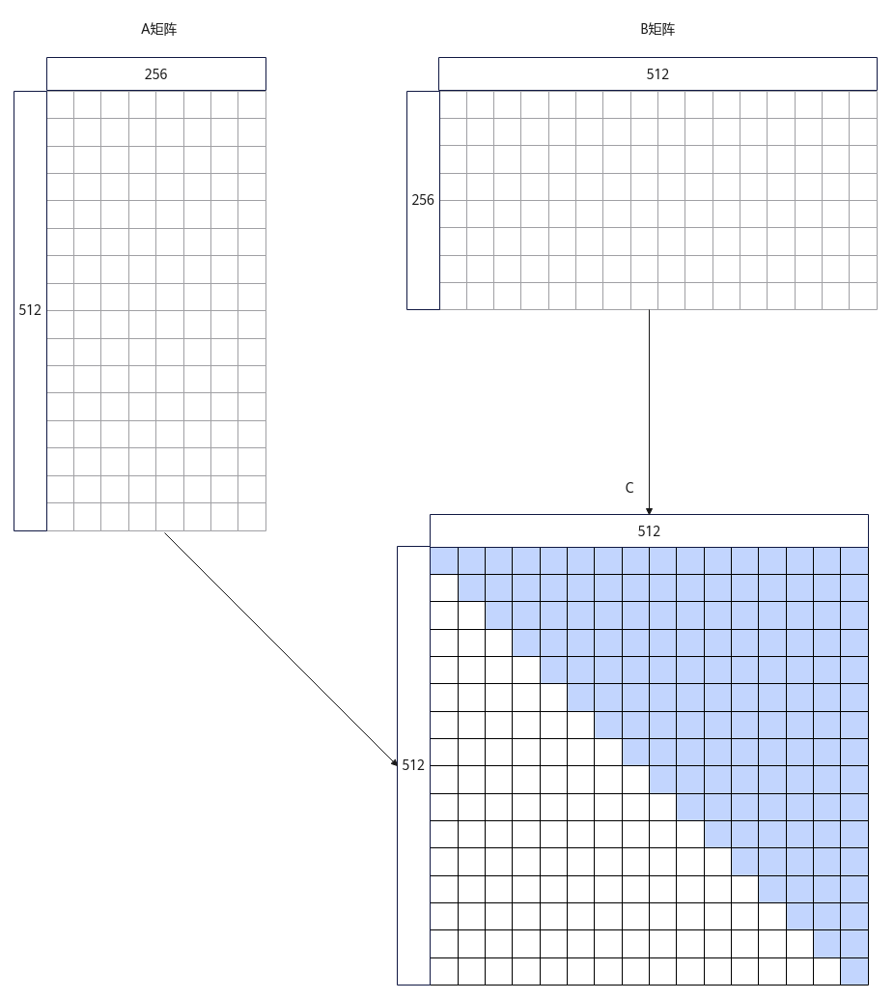
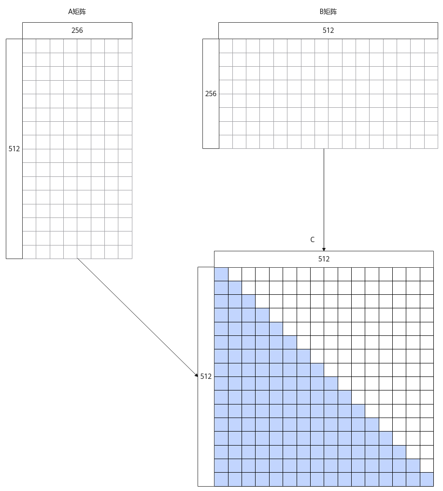
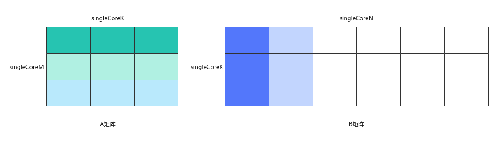

# MatmulPolicy<a name="ZH-CN_TOPIC_0000002070559816"></a>

## 产品支持情况<a name="section1550532418810"></a>

<a name="table1334714391211"></a>
<table><thead align="left"><tr id="row1334743121213"><th class="cellrowborder" valign="top" width="51.35168195718654%" id="mcps1.1.5.1.1"><p id="p834713321216"><a name="p834713321216"></a><a name="p834713321216"></a><span id="ph834783101215"><a name="ph834783101215"></a><a name="ph834783101215"></a>产品</span></p>
</th>
<th class="cellrowborder" valign="top" width="17.60244648318043%" id="mcps1.1.5.1.2"><p id="p9688124518177"><a name="p9688124518177"></a><a name="p9688124518177"></a>MatmulPolicy</p>
</th>
<th class="cellrowborder" valign="top" width="16.048929663608565%" id="mcps1.1.5.1.3"><p id="p134861747161717"><a name="p134861747161717"></a><a name="p134861747161717"></a>TrianUpperMatmulPolicy/TrianLowerMatmulPolicy</p>
</th>
<th class="cellrowborder" valign="top" width="14.996941896024465%" id="mcps1.1.5.1.4"><p id="p888344921719"><a name="p888344921719"></a><a name="p888344921719"></a>NBuffer33MatmulPolicy</p>
</th>
</tr>
</thead>
<tbody><tr id="row1834733191219"><td class="cellrowborder" valign="top" width="51.35168195718654%" headers="mcps1.1.5.1.1 "><p id="p1234716311218"><a name="p1234716311218"></a><a name="p1234716311218"></a><span id="ph434819391213"><a name="ph434819391213"></a><a name="ph434819391213"></a><term id="zh-cn_topic_0000001312391781_term1253731311225"><a name="zh-cn_topic_0000001312391781_term1253731311225"></a><a name="zh-cn_topic_0000001312391781_term1253731311225"></a>Atlas A3 训练系列产品</term>/<term id="zh-cn_topic_0000001312391781_term131434243115"><a name="zh-cn_topic_0000001312391781_term131434243115"></a><a name="zh-cn_topic_0000001312391781_term131434243115"></a>Atlas A3 推理系列产品</term></span></p>
</td>
<td class="cellrowborder" align="center" valign="top" width="17.60244648318043%" headers="mcps1.1.5.1.2 "><p id="p368844581717"><a name="p368844581717"></a><a name="p368844581717"></a>√</p>
</td>
<td class="cellrowborder" align="center" valign="top" width="16.048929663608565%" headers="mcps1.1.5.1.3 "><p id="p1448654713172"><a name="p1448654713172"></a><a name="p1448654713172"></a>√</p>
</td>
<td class="cellrowborder" align="center" valign="top" width="14.996941896024465%" headers="mcps1.1.5.1.4 "><p id="p12883174912174"><a name="p12883174912174"></a><a name="p12883174912174"></a>√</p>
</td>
</tr>
<tr id="row33481333123"><td class="cellrowborder" valign="top" width="51.35168195718654%" headers="mcps1.1.5.1.1 "><p id="p2034813321217"><a name="p2034813321217"></a><a name="p2034813321217"></a><span id="ph334833191213"><a name="ph334833191213"></a><a name="ph334833191213"></a><term id="zh-cn_topic_0000001312391781_term11962195213215"><a name="zh-cn_topic_0000001312391781_term11962195213215"></a><a name="zh-cn_topic_0000001312391781_term11962195213215"></a>Atlas A2 训练系列产品</term>/<term id="zh-cn_topic_0000001312391781_term184716139811"><a name="zh-cn_topic_0000001312391781_term184716139811"></a><a name="zh-cn_topic_0000001312391781_term184716139811"></a>Atlas A2 推理系列产品</term></span></p>
</td>
<td class="cellrowborder" align="center" valign="top" width="17.60244648318043%" headers="mcps1.1.5.1.2 "><p id="p1068894514179"><a name="p1068894514179"></a><a name="p1068894514179"></a>√</p>
</td>
<td class="cellrowborder" align="center" valign="top" width="16.048929663608565%" headers="mcps1.1.5.1.3 "><p id="p15486447171715"><a name="p15486447171715"></a><a name="p15486447171715"></a>√</p>
</td>
<td class="cellrowborder" align="center" valign="top" width="14.996941896024465%" headers="mcps1.1.5.1.4 "><p id="p138831549121712"><a name="p138831549121712"></a><a name="p138831549121712"></a>√</p>
</td>
</tr>
</tbody>
</table>

## 功能说明<a name="section451064612817"></a>

模板参数MatmulPolicy用于定义Matmul可拓展模块策略。目前支持设置以下四种Matmul内置模板策略。

-   MatmulPolicy（默认模板策略）

    使能Matmul API的默认实现策略。

-   TrianUpperMatmulPolicy（上三角模板策略）

    一次矩阵乘指令计算的结果为[baseM \* baseN](TCubeTiling结构体.md#p17899165811566)大小的矩阵块，称该矩阵块为基本块。若Matmul结果矩阵C中的基本块位于下三角位置，则Matmul内部做数据计算和数据搬出时，将忽略该基本块，最后得到的矩阵C为一个上三角矩阵。上三角模板策略如下图所示，图示中矩阵形状的相关大小为M=N=512，K=256，baseM=baseN=baseK=32。

    **图 1**  上三角模板策略示意图<a name="fig981211473248"></a>  
    

-   TrianLowerMatmulPolicy（下三角模板策略）

    一次矩阵乘指令计算的结果为[baseM \* baseN](TCubeTiling结构体.md#p17899165811566)大小的矩阵块，称该矩阵块为基本块。若Matmul结果矩阵C中的基本块位于上三角位置，则Matmul内部做数据计算和数据搬出时，将忽略该基本块，最后得到的矩阵C为一个下三角矩阵。下三角模板策略如下图所示，图示中矩阵形状的相关大小为M=N=512，K=256，baseM=baseN=baseK=32。

    **图 2**  下三角模板策略示意图<a name="fig131201039102716"></a>  
    

-   NBuffer33MatmulPolicy（NBuffer33模板策略）

    一次矩阵乘指令计算的结果为[baseM \* baseN](TCubeTiling结构体.md#p17899165811566)大小的矩阵块，称该矩阵块为基本块。单核计算的A矩阵切分为3x3个基本块，该3x3个A矩阵的基本块全载和保持在L1 Buffer中，每次与3x1个B矩阵的基本块计算矩阵乘，同时DoubleBuffer并行搬入下次计算所需的3x1个B矩阵基本块，直到singleCoreN方向的矩阵乘计算完成。NBuffer33模板策略如下图所示，图中[singleCoreM、singleCoreN、singleCoreK](TCubeTiling结构体.md#p11899125875617)表示单核内A、B矩阵的shape大小，单核计算的A矩阵切分为3x3个基本块，3x3个基本块全载在L1 Buffer上，这些基本块每次与B矩阵的3x1个基本块计算矩阵乘。

    **图 3**  NBuffer33模板策略示意图<a name="fig173669299148"></a>  
    

## 约束说明<a name="section176217152520"></a>

-   TrianUpperMatmulPolicy当前只支持[Norm模板](MatmulConfig.md#p159827389308)和[MDL模板](MatmulConfig.md#p109823386305)。
-   TrianLowerMatmulPolicy当前只支持[Norm模板](MatmulConfig.md#p159827389308)和[MDL模板](MatmulConfig.md#p109823386305)。
-   NBuffer33MatmulPolicy：
    -   当前只支持[MDL模板](MatmulConfig.md#p109823386305)。
    -   A矩阵、B矩阵的内存逻辑位置只支持TPosition::GM。
    -   暂不支持MIX模式（包含矩阵计算和矢量计算），仅支持纯Cube模式（只有矩阵计算）。
    -   只支持通过[IterateAll](IterateAll.md)接口获取Matmul的计算结果C矩阵。
    -   [stepM、stepKa、stepKb](TCubeTiling结构体.md#p139009583566)小于等于3，且满足：stepKa=stepKb=ceil\([singleCoreK](TCubeTiling结构体.md#p11899125875617)/baseK\)。
    -   A矩阵全载的基本块大小与B矩阵载入的基本块大小之和不超过L1 Buffer大小。
    -   在使用[GetTiling](GetTiling.md)接口生成Tiling参数前，必须通过[SetMatmulConfigParams](SetMatmulConfigParams.md)接口将scheduleTypeIn参数设置为ScheduleType::N\_BUFFER\_33，以启用NBuffer33模板策略的Tiling生成逻辑。

## 调用示例<a name="section2366122094418"></a>

默认模板策略MatmulPolicy为模板参数的默认值，下面主要介绍TrianUpperMatmulPolicy（上三角模板策略）和TrianLowerMatmulPolicy（下三角模板策略）的使用方式。

-   上三角模板策略使用示例

    ```
    #include "lib/matmul_intf.h"
    
    typedef AscendC::MatmulType<AscendC::TPosition::GM, CubeFormat::ND, half> aType; 
    typedef AscendC::MatmulType<AscendC::TPosition::GM, CubeFormat::ND, half> bType;
    typedef AscendC::MatmulType<AscendC::TPosition::GM, CubeFormat::ND, float> cType; 
    typedef AscendC::MatmulType<AscendC::TPosition::GM, CubeFormat::ND, float> biasType;
    // Matmul定义时传入TrianUpperMatmulPolicy
    AscendC::Matmul<aType, bType, cType, biasType, CFG_NORM, MatmulCallBackFunc<nullptr, nullptr, nullptr>, AscendC::Impl::Detail::TrianUpperMatmulPolicy> mm; 
    
    // 常规Matmul计算，最后输出上三角形式的结果
    TPipe pipe;
    TCubeTiling tiling;
    REGIST_MATMUL_OBJ(&pipe, GetSysWorkSpacePtr(), mm, &tiling);
    mm.Init(&tiling);
    mm.SetTensorA(gmA, isTransposeA);
    mm.SetTensorB(gmB, isTransposeB);
    if (tiling.isBias) {
        mm.SetBias(gmBias);
    }
    mm.IterateAll(gmC);
    ```

-   下三角模板策略使用示例

    ```
    #include "lib/matmul_intf.h"
    
    typedef AscendC::MatmulType<AscendC::TPosition::GM, CubeFormat::ND, half> aType; 
    typedef AscendC::MatmulType<AscendC::TPosition::GM, CubeFormat::ND, half> bType;
    typedef AscendC::MatmulType<AscendC::TPosition::GM, CubeFormat::ND, float> cType; 
    typedef AscendC::MatmulType<AscendC::TPosition::GM, CubeFormat::ND, float> biasType;
    // Matmul定义时传入TrianLowerMatmulPolicy
    AscendC::Matmul<aType, bType, cType, biasType, CFG_NORM, MatmulCallBackFunc<nullptr, nullptr, nullptr>, AscendC::Impl::Detail::TrianLowerMatmulPolicy> mm; 
    
    // 常规Matmul计算，最后输出下三角形式的结果
    TPipe pipe;
    TCubeTiling tiling;
    REGIST_MATMUL_OBJ(&pipe, GetSysWorkSpacePtr(), mm, &tiling);
    mm.Init(&tiling);
    mm.SetTensorA(gmA, isTransposeA);
    mm.SetTensorB(gmB, isTransposeB);
    if (tiling.isBias) {
        mm.SetBias(gmBias);
    }
    mm.IterateAll(gmC);
    ```

-   NBuffer33模板策略使用示例

    ```
    #include "lib/matmul_intf.h"
    
    typedef AscendC::MatmulType<AscendC::TPosition::GM, CubeFormat::ND, half> aType; 
    typedef AscendC::MatmulType<AscendC::TPosition::GM, CubeFormat::ND, half> bType;
    typedef AscendC::MatmulType<AscendC::TPosition::GM, CubeFormat::ND, float> cType; 
    typedef AscendC::MatmulType<AscendC::TPosition::GM, CubeFormat::ND, float> biasType;
    // Matmul定义时传入NBuffer33MatmulPolicy
    
    AscendC::Matmul<aType, bType, cType, biasType, CFG_NORM, MatmulCallBackFunc<nullptr, nullptr, nullptr>, AscendC::Impl::Detail::NBuffer33MatmulPolicy> mm; 
    
    // 常规Matmul计算，最后输出下三角形式的结果
    TPipe pipe;
    TCubeTiling tiling;
    REGIST_MATMUL_OBJ(&pipe, GetSysWorkSpacePtr(), mm, &tiling);
    mm.Init(&tiling);
    mm.SetTensorA(gmA, isTransposeA);
    mm.SetTensorB(gmB, isTransposeB);
    if (tiling.isBias) {
        mm.SetBias(gmBias);
    }
    mm.IterateAll(gmC);
    ```

