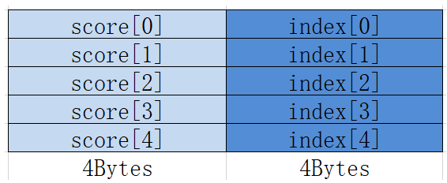
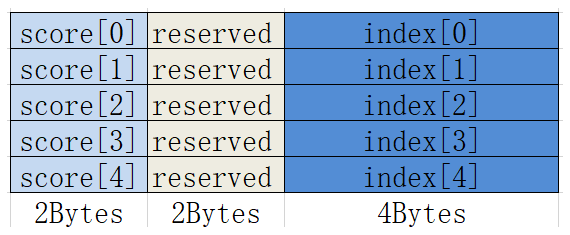

# MrgSort<a name="ZH-CN_TOPIC_0000001538216637"></a>

## 产品支持情况<a name="section1550532418810"></a>

<a name="table38301303189"></a>
<table><thead align="left"><tr id="row20831180131817"><th class="cellrowborder" valign="top" width="57.99999999999999%" id="mcps1.1.3.1.1"><p id="p1883113061818"><a name="p1883113061818"></a><a name="p1883113061818"></a><span id="ph20833205312295"><a name="ph20833205312295"></a><a name="ph20833205312295"></a>产品</span></p>
</th>
<th class="cellrowborder" align="center" valign="top" width="42%" id="mcps1.1.3.1.2"><p id="p783113012187"><a name="p783113012187"></a><a name="p783113012187"></a>是否支持</p>
</th>
</tr>
</thead>
<tbody><tr id="row220181016240"><td class="cellrowborder" valign="top" width="57.99999999999999%" headers="mcps1.1.3.1.1 "><p id="p48327011813"><a name="p48327011813"></a><a name="p48327011813"></a><span id="ph583230201815"><a name="ph583230201815"></a><a name="ph583230201815"></a><term id="zh-cn_topic_0000001312391781_term1253731311225"><a name="zh-cn_topic_0000001312391781_term1253731311225"></a><a name="zh-cn_topic_0000001312391781_term1253731311225"></a>Atlas A3 训练系列产品</term>/<term id="zh-cn_topic_0000001312391781_term12835255145414"><a name="zh-cn_topic_0000001312391781_term12835255145414"></a><a name="zh-cn_topic_0000001312391781_term12835255145414"></a>Atlas A3 推理系列产品</term></span></p>
</td>
<td class="cellrowborder" align="center" valign="top" width="42%" headers="mcps1.1.3.1.2 "><p id="p7948163910184"><a name="p7948163910184"></a><a name="p7948163910184"></a>√</p>
</td>
</tr>
<tr id="row173226882415"><td class="cellrowborder" valign="top" width="57.99999999999999%" headers="mcps1.1.3.1.1 "><p id="p14832120181815"><a name="p14832120181815"></a><a name="p14832120181815"></a><span id="ph1483216010188"><a name="ph1483216010188"></a><a name="ph1483216010188"></a><term id="zh-cn_topic_0000001312391781_term11962195213215"><a name="zh-cn_topic_0000001312391781_term11962195213215"></a><a name="zh-cn_topic_0000001312391781_term11962195213215"></a>Atlas A2 训练系列产品</term>/<term id="zh-cn_topic_0000001312391781_term1551319498507"><a name="zh-cn_topic_0000001312391781_term1551319498507"></a><a name="zh-cn_topic_0000001312391781_term1551319498507"></a>Atlas A2 推理系列产品</term></span></p>
</td>
<td class="cellrowborder" align="center" valign="top" width="42%" headers="mcps1.1.3.1.2 "><p id="p19948143911820"><a name="p19948143911820"></a><a name="p19948143911820"></a>√</p>
</td>
</tr>
</tbody>
</table>

## 功能说明<a name="section618mcpsimp"></a>

将已经排好序的最多4条队列，合并排列成1条队列，结果按照score域由大到小排序。

MrgSort指令处理的数据一般是经过Sort32指令处理后的数据，也就是Sort32指令的输出，队列的结构如下所示：

-   数据类型为float，每个结构占据8Bytes。

    

-   数据类型为half，每个结构也占据8Bytes，中间有2Bytes保留。

    

## 函数原型<a name="section620mcpsimp"></a>

```
template <typename T>
__aicore__ inline void MrgSort(const LocalTensor<T>& dst, const MrgSortSrcList<T>& src, const MrgSort4Info& params)
```

## 参数说明<a name="section622mcpsimp"></a>

**表 1**  模板参数说明

<a name="table4835205712588"></a>
<table><thead align="left"><tr id="zh-cn_topic_0000001429830437_row118356578583"><th class="cellrowborder" valign="top" width="13.780000000000001%" id="mcps1.2.3.1.1"><p id="zh-cn_topic_0000001429830437_p48354572582"><a name="zh-cn_topic_0000001429830437_p48354572582"></a><a name="zh-cn_topic_0000001429830437_p48354572582"></a>参数名</p>
</th>
<th class="cellrowborder" valign="top" width="86.22%" id="mcps1.2.3.1.2"><p id="zh-cn_topic_0000001429830437_p583535795817"><a name="zh-cn_topic_0000001429830437_p583535795817"></a><a name="zh-cn_topic_0000001429830437_p583535795817"></a>描述</p>
</th>
</tr>
</thead>
<tbody><tr id="zh-cn_topic_0000001429830437_row1835857145817"><td class="cellrowborder" valign="top" width="13.780000000000001%" headers="mcps1.2.3.1.1 "><p id="zh-cn_topic_0000001429830437_p5835457165816"><a name="zh-cn_topic_0000001429830437_p5835457165816"></a><a name="zh-cn_topic_0000001429830437_p5835457165816"></a>T</p>
</td>
<td class="cellrowborder" valign="top" width="86.22%" headers="mcps1.2.3.1.2 "><p id="p995263114816"><a name="p995263114816"></a><a name="p995263114816"></a><span id="ph179520311784"><a name="ph179520311784"></a><a name="ph179520311784"></a><term id="zh-cn_topic_0000001312391781_term11962195213215_1"><a name="zh-cn_topic_0000001312391781_term11962195213215_1"></a><a name="zh-cn_topic_0000001312391781_term11962195213215_1"></a>Atlas A2 训练系列产品</term>/<term id="zh-cn_topic_0000001312391781_term1551319498507_1"><a name="zh-cn_topic_0000001312391781_term1551319498507_1"></a><a name="zh-cn_topic_0000001312391781_term1551319498507_1"></a>Atlas A2 推理系列产品</term></span>，支持的数据类型为：half/float</p>
<p id="p1795263117815"><a name="p1795263117815"></a><a name="p1795263117815"></a><span id="ph1295210310810"><a name="ph1295210310810"></a><a name="ph1295210310810"></a><term id="zh-cn_topic_0000001312391781_term1253731311225_1"><a name="zh-cn_topic_0000001312391781_term1253731311225_1"></a><a name="zh-cn_topic_0000001312391781_term1253731311225_1"></a>Atlas A3 训练系列产品</term>/<term id="zh-cn_topic_0000001312391781_term12835255145414_1"><a name="zh-cn_topic_0000001312391781_term12835255145414_1"></a><a name="zh-cn_topic_0000001312391781_term12835255145414_1"></a>Atlas A3 推理系列产品</term></span>，支持的数据类型为：half/float</p>
</td>
</tr>
</tbody>
</table>

**表 2**  接口参数说明

<a name="table1196021819497"></a>
<table><thead align="left"><tr id="row19606188492"><th class="cellrowborder" valign="top" width="13.631363136313631%" id="mcps1.2.4.1.1"><p id="p5960318164918"><a name="p5960318164918"></a><a name="p5960318164918"></a>参数名称</p>
</th>
<th class="cellrowborder" valign="top" width="12.61126112611261%" id="mcps1.2.4.1.2"><p id="p129609185493"><a name="p129609185493"></a><a name="p129609185493"></a>输入/输出</p>
</th>
<th class="cellrowborder" valign="top" width="73.75737573757377%" id="mcps1.2.4.1.3"><p id="p149601218134915"><a name="p149601218134915"></a><a name="p149601218134915"></a>含义</p>
</th>
</tr>
</thead>
<tbody><tr id="row1496012182493"><td class="cellrowborder" valign="top" width="13.631363136313631%" headers="mcps1.2.4.1.1 "><p id="p39605185493"><a name="p39605185493"></a><a name="p39605185493"></a>dst</p>
</td>
<td class="cellrowborder" valign="top" width="12.61126112611261%" headers="mcps1.2.4.1.2 "><p id="p179601218134912"><a name="p179601218134912"></a><a name="p179601218134912"></a>输出</p>
</td>
<td class="cellrowborder" valign="top" width="73.75737573757377%" headers="mcps1.2.4.1.3 "><p id="p11806624101513"><a name="p11806624101513"></a><a name="p11806624101513"></a>目的操作数，存储经过排序后的数据。</p>
<p id="p16703131355116"><a name="p16703131355116"></a><a name="p16703131355116"></a><span id="zh-cn_topic_0000001530181537_ph173308471594"><a name="zh-cn_topic_0000001530181537_ph173308471594"></a><a name="zh-cn_topic_0000001530181537_ph173308471594"></a><span id="zh-cn_topic_0000001530181537_ph9902231466"><a name="zh-cn_topic_0000001530181537_ph9902231466"></a><a name="zh-cn_topic_0000001530181537_ph9902231466"></a><span id="zh-cn_topic_0000001530181537_ph1782115034816"><a name="zh-cn_topic_0000001530181537_ph1782115034816"></a><a name="zh-cn_topic_0000001530181537_ph1782115034816"></a>类型为<a href="LocalTensor.md">LocalTensor</a>，支持的TPosition为VECIN/VECCALC/VECOUT。</span></span></span></p>
<p id="p194546161418"><a name="p194546161418"></a><a name="p194546161418"></a><span id="ph443416246237"><a name="ph443416246237"></a><a name="ph443416246237"></a>LocalTensor的起始地址需要32字节对齐。</span></p>
</td>
</tr>
<tr id="row796116186493"><td class="cellrowborder" valign="top" width="13.631363136313631%" headers="mcps1.2.4.1.1 "><p id="p29611818154918"><a name="p29611818154918"></a><a name="p29611818154918"></a>src</p>
</td>
<td class="cellrowborder" valign="top" width="12.61126112611261%" headers="mcps1.2.4.1.2 "><p id="p396121816492"><a name="p396121816492"></a><a name="p396121816492"></a>输入</p>
</td>
<td class="cellrowborder" valign="top" width="73.75737573757377%" headers="mcps1.2.4.1.3 "><p id="p571917113912"><a name="p571917113912"></a><a name="p571917113912"></a>源操作数，4个队列，并且每个队列都已经排好序，类型为MrgSortSrcList结构体，定义如下：</p>
<a name="screen1546714181992"></a><a name="screen1546714181992"></a><pre class="screen" codetype="Cpp" id="screen1546714181992">template &lt;typename T&gt; struct MrgSortSrcList {
    __aicore__ MrgSortSrcList() {}
    __aicore__ MrgSortSrcList(const LocalTensor&lt;T&gt;&amp; src1In, const LocalTensor&lt;T&gt;&amp; src2In, const LocalTensor&lt;T&gt;&amp; src3In,
        const LocalTensor&lt;T&gt;&amp; src4In)
    {
        src1 = src1In[0];
        src2 = src2In[0];
        src3 = src3In[0];
        src4 = src4In[0];
    }
    LocalTensor&lt;T&gt; src1; // 第一个已经排好序的队列
    LocalTensor&lt;T&gt; src2; // 第二个已经排好序的队列
    LocalTensor&lt;T&gt; src3; // 第三个已经排好序的队列
    LocalTensor&lt;T&gt; src4; // 第四个已经排好序的队列
};</pre>
<p id="p8114998103"><a name="p8114998103"></a><a name="p8114998103"></a>源操作数的数据类型与目的操作数保持一致。src1、src2、src3、src4类型为<a href="LocalTensor.md">LocalTensor</a>，支持的TPosition为VECIN/VECCALC/VECOUT。<span id="ph441646171420"><a name="ph441646171420"></a><a name="ph441646171420"></a>LocalTensor的起始地址需要8字节对齐。</span></p>
</td>
</tr>
<tr id="row1096110183494"><td class="cellrowborder" valign="top" width="13.631363136313631%" headers="mcps1.2.4.1.1 "><p id="p139612184497"><a name="p139612184497"></a><a name="p139612184497"></a>params</p>
</td>
<td class="cellrowborder" valign="top" width="12.61126112611261%" headers="mcps1.2.4.1.2 "><p id="p8961141811498"><a name="p8961141811498"></a><a name="p8961141811498"></a>输入</p>
</td>
<td class="cellrowborder" valign="top" width="73.75737573757377%" headers="mcps1.2.4.1.3 "><p id="p11323173012104"><a name="p11323173012104"></a><a name="p11323173012104"></a>排序所需参数，类型为MrgSort4Info结构体。</p>
<p id="p18834113201011"><a name="p18834113201011"></a><a name="p18834113201011"></a>具体定义请参考<span id="ph10562197165916"><a name="ph10562197165916"></a><a name="ph10562197165916"></a>${INSTALL_DIR}</span>/include/ascendc/basic_api/interface/kernel_struct_proposal.h，<span id="ph14322531015"><a name="ph14322531015"></a><a name="ph14322531015"></a>${INSTALL_DIR}</span>请替换为CANN软件安装后文件存储路径。</p>
<p id="p4961151813492"><a name="p4961151813492"></a><a name="p4961151813492"></a>参数说明请参考<a href="#table7515358184615">表3</a>。</p>
</td>
</tr>
</tbody>
</table>

**表 3**  MrgSort4Info参数说明

<a name="table7515358184615"></a>
<table><thead align="left"><tr id="row1951513585460"><th class="cellrowborder" valign="top" width="14.360000000000001%" id="mcps1.2.3.1.1"><p id="p195151858154612"><a name="p195151858154612"></a><a name="p195151858154612"></a>参数名称</p>
</th>
<th class="cellrowborder" valign="top" width="85.64%" id="mcps1.2.3.1.2"><p id="p1151555820466"><a name="p1151555820466"></a><a name="p1151555820466"></a>含义</p>
</th>
</tr>
</thead>
<tbody><tr id="row25157580465"><td class="cellrowborder" valign="top" width="14.360000000000001%" headers="mcps1.2.3.1.1 "><p id="p05156585462"><a name="p05156585462"></a><a name="p05156585462"></a>elementLengths</p>
</td>
<td class="cellrowborder" valign="top" width="85.64%" headers="mcps1.2.3.1.2 "><p id="p1751545874619"><a name="p1751545874619"></a><a name="p1751545874619"></a>四个源队列的长度（8Bytes结构的数目），类型为长度为4的uint16_t数据类型的数组，理论上每个元素取值范围[0, 4095]，但不能超出UB的存储空间。</p>
</td>
</tr>
<tr id="row1515155817465"><td class="cellrowborder" valign="top" width="14.360000000000001%" headers="mcps1.2.3.1.1 "><p id="p55154583465"><a name="p55154583465"></a><a name="p55154583465"></a>ifExhaustedSuspension</p>
</td>
<td class="cellrowborder" valign="top" width="85.64%" headers="mcps1.2.3.1.2 "><p id="p135151558194611"><a name="p135151558194611"></a><a name="p135151558194611"></a>某条队列耗尽后，指令是否需要停止，类型为bool，默认false。</p>
</td>
</tr>
<tr id="row1234542411541"><td class="cellrowborder" valign="top" width="14.360000000000001%" headers="mcps1.2.3.1.1 "><p id="p143461024185414"><a name="p143461024185414"></a><a name="p143461024185414"></a>validBit</p>
</td>
<td class="cellrowborder" valign="top" width="85.64%" headers="mcps1.2.3.1.2 "><div class="p" id="p4633153935413"><a name="p4633153935413"></a><a name="p4633153935413"></a>有效队列个数，取值如下：<a name="ul47411933141413"></a><a name="ul47411933141413"></a><ul id="ul47411933141413"><li>3：前两条队列有效</li><li>7：前三条队列有效</li><li>15：四条队列全部有效</li></ul>
</div>
</td>
</tr>
<tr id="row59828263546"><td class="cellrowborder" valign="top" width="14.360000000000001%" headers="mcps1.2.3.1.1 "><p id="p898232615410"><a name="p898232615410"></a><a name="p898232615410"></a>repeatTimes</p>
</td>
<td class="cellrowborder" valign="top" width="85.64%" headers="mcps1.2.3.1.2 "><p id="p330857175415"><a name="p330857175415"></a><a name="p330857175415"></a>迭代次数，每一次源操作数和目的操作数跳过四个队列总长度。取值范围：repeatTimes∈[1,255]。</p>
<div class="p" id="p1212745155714"><a name="p1212745155714"></a><a name="p1212745155714"></a>repeatTimes参数生效是有条件的，需要同时满足以下四个条件：<a name="ul2212945195714"></a><a name="ul2212945195714"></a><ul id="ul2212945195714"><li>src包含四条队列并且validBit=15</li><li>四个源队列的长度一致</li><li>四个源队列连续存储</li><li>ifExhaustedSuspension = False</li></ul>
</div>
</td>
</tr>
</tbody>
</table>

## 返回值说明<a name="section91032023123812"></a>

无

## 约束说明<a name="section633mcpsimp"></a>

-   当存在score\[i\]与score\[j\]相同时，如果i\>j，则score\[j\]将首先被选出来，排在前面。
-   每次迭代内的数据会进行排序，不同迭代间的数据不会进行排序。
-   需要注意此函数排序的队列非region proposal结构。
-   操作数地址对齐要求请参见[通用地址对齐约束](通用说明和约束.md#section796754519912)。

## 调用示例<a name="section642mcpsimp"></a>

-   接口使用样例

    ```
    // 对8个已排好序的队列进行合并排序，repeatTimes = 2，数据连续存放
    // 每个队列包含32个(score,index)的8Bytes结构
    // 最后输出对score域的256个数完成排序后的结果
    AscendC::MrgSort4Info params;
    params.elementLengths[0] = 32;
    params.elementLengths[1] = 32;
    params.elementLengths[2] = 32;
    params.elementLengths[3] = 32;
    params.ifExhaustedSuspension = false;
    params.validBit = 0b1111;
    params.repeatTimes = 2;
    
    AscendC::MrgSortSrcList<float> srcList;
    srcList.src1 = workLocal[0];
    srcList.src2 = workLocal[64]; // workLocal为float类型，每个队列占据256Bytes空间
    srcList.src3 = workLocal[128];
    srcList.src4 = workLocal[192];
    
    AscendC::MrgSort<float>(dstLocal, srcList, params);
    ```

-   完整样例

    ```
    #include "kernel_operator.h"
    
    class KernelMrgSort {
    public:
        __aicore__ inline KernelMrgSort() {}
        __aicore__ inline void Init(__gm__ uint8_t* src0Gm, __gm__ uint8_t* src1Gm, __gm__ uint8_t* dstGm)
        {
            srcGlobal0.SetGlobalBuffer((__gm__ float*)src0Gm);
            srcGlobal1.SetGlobalBuffer((__gm__ uint32_t*)src1Gm);
            dstGlobal.SetGlobalBuffer((__gm__ float*)dstGm);
    
            repeat = srcDataSize / 32;
            pipe.InitBuffer(inQueueSrc0, 1, srcDataSize * sizeof(float));
            pipe.InitBuffer(inQueueSrc1, 1, srcDataSize * sizeof(uint32_t));
            pipe.InitBuffer(workQueue, 1, dstDataSize * sizeof(float));
            pipe.InitBuffer(outQueueDst, 1, dstDataSize * sizeof(float));
        }
        __aicore__ inline void Process()
        {
            CopyIn();
            Compute();
            CopyOut();
        }
    
    private:
        __aicore__ inline void CopyIn()
        {
            AscendC::LocalTensor<float> srcLocal0 = inQueueSrc0.AllocTensor<float>();
            AscendC::DataCopy(srcLocal0, srcGlobal0, srcDataSize);
            inQueueSrc0.EnQue(srcLocal0);
            AscendC::LocalTensor<uint32_t> srcLocal1 = inQueueSrc1.AllocTensor<uint32_t>();
            AscendC::DataCopy(srcLocal1, srcGlobal1, srcDataSize);
            inQueueSrc1.EnQue(srcLocal1);
        }
        __aicore__ inline void Compute()
        {
            AscendC::LocalTensor<float> srcLocal0 = inQueueSrc0.DeQue<float>();
            AscendC::LocalTensor<uint32_t> srcLocal1 = inQueueSrc1.DeQue<uint32_t>();
            AscendC::LocalTensor<float> workLocal = workQueue.AllocTensor<float>();
            AscendC::LocalTensor<float> dstLocal = outQueueDst.AllocTensor<float>();
    
            AscendC::Sort32<float>(workLocal, srcLocal0, srcLocal1, repeat); // 先构造4个排好序的队列
            
            AscendC::MrgSort4Info params;
            params.elementLengths[0] = 32;
            params.elementLengths[1] = 32;
            params.elementLengths[2] = 32;
            params.elementLengths[3] = 32;
            params.ifExhaustedSuspension = false;
            params.validBit = 0b1111;
            params.repeatTimes = 1;
    
            AscendC::MrgSortSrcList<float> srcList;
            srcList.src1 = workLocal[0];
            srcList.src2 = workLocal[32 * 1 * 2];
            srcList.src3 = workLocal[32 * 2 * 2];
            srcList.src4 = workLocal[32 * 3 * 2];
    
            AscendC::MrgSort<float>(dstLocal, srcList, params);
    
            outQueueDst.EnQue<float>(dstLocal);
            inQueueSrc0.FreeTensor(srcLocal0);
            inQueueSrc1.FreeTensor(srcLocal1);
            workQueue.FreeTensor(workLocal);
        }
        __aicore__ inline void CopyOut()
        {
            AscendC::LocalTensor<float> dstLocal = outQueueDst.DeQue<float>();
            AscendC::DataCopy(dstGlobal, dstLocal, dstDataSize);
            outQueueDst.FreeTensor(dstLocal);
        }
    
    private:
        AscendC::TPipe pipe;
        AscendC::TQue<AscendC::TPosition::VECIN, 1> inQueueSrc0;
        AscendC::TQue<AscendC::TPosition::VECIN, 1> inQueueSrc1;
        AscendC::TQue<AscendC::TPosition::VECIN, 1> workQueue;
        AscendC::TQue<AscendC::TPosition::VECOUT, 1> outQueueDst;
        AscendC::GlobalTensor<float> srcGlobal0, dstGlobal;
        AscendC::GlobalTensor<uint32_t> srcGlobal1;
        int srcDataSize = 128;
        int dstDataSize = 256;
        int repeat = 0;
    };
    
    extern "C" __global__ __aicore__ void vec_mrgsort_kernel(__gm__ uint8_t* src0Gm, __gm__ uint8_t* src1Gm,
        __gm__ uint8_t* dstGm)
    {
        KernelMrgSort op;
        op.Init(src0Gm, src1Gm, dstGm);
        op.Process();
    }
    ```

    ```
    示例结果
    输入数据src0Gm：128个float类型数据
    [2.9447467 7.546607  5.083544  1.6373866 3.4730997 5.488915  6.2410192
     6.5340915 9.534971  8.217815  7.922645  9.9135275 9.34575   8.0759535
     6.40329   7.2240252 8.792965  4.9348564 7.726399  2.3075738 5.8587966
     3.3077633 1.5605974 5.582237  9.38379   8.583278  3.2116296 7.5197206
     1.3169404 9.355466  3.6663866 6.3373866 4.188842  1.1831555 6.3235407
     7.0127134 1.9593428 9.316625  5.7821383 4.980949  4.4211564 1.0478534
     9.626102  4.52559   5.151449  3.4274218 9.874416  8.040044  5.049376
     3.8079789 9.16666   7.803004  9.288373  5.497965  2.2784562 8.752271
     1.2586805 7.161625  5.807935  2.9983459 4.980592  1.1796398 8.89327
     9.35524   5.0074706 2.108345  8.4992285 2.7219095 9.544726  4.4516068
     6.940215  1.424632  5.473264  7.7971754 6.730119  3.3760135 1.3578739
     8.965629  5.5441265 1.9234481 6.1590824 3.62707   8.257497  6.5762696
     3.6241028 1.870233  8.303693  7.5986104 7.211784  9.259263  2.9631793
     5.9183855 1.911052  8.445708  3.1592433 5.434683  5.2764387 2.013458
     2.5766358 1.3793333 6.4866495 6.957988  8.711433  4.1000323 1.973415
     1.5109203 6.830736  7.871973  6.130566  2.5669708 9.317494  4.4140983
     8.086401  3.1740563 9.000416  6.2852535 2.170213  4.6842256 5.939913
     1.3967329 9.959876  7.9772205 5.874416  4.4834223 3.6719642 8.462775
     2.3629668 2.886413 ]
    输入数据src1Gm：
    [0,0,0,0,...,0]
    输出数据dstGm：
    [9.959876  0.        9.9135275 0.        9.874416  0.        9.626102
     0.        9.544726  0.        9.534971  0.        9.38379   0.
     9.355466  0.        9.35524   0.        9.34575   0.        9.317494
     0.        9.316625  0.        9.288373  0.        9.259263  0.
     9.16666   0.        9.000416  0.        8.965629  0.        8.89327
     0.        8.792965  0.        8.752271  0.        8.711433  0.
     8.583278  0.        8.4992285 0.        8.462775  0.        8.445708
     0.        8.303693  0.        8.257497  0.        8.217815  0.
     8.086401  0.        8.0759535 0.        8.040044  0.        7.9772205
     0.        7.922645  0.        7.871973  0.        7.803004  0.
     7.7971754 0.        7.726399  0.        7.5986104 0.        7.546607
     0.        7.5197206 0.        7.2240252 0.        7.211784  0.
     7.161625  0.        7.0127134 0.        6.957988  0.        6.940215
     0.        6.830736  0.        6.730119  0.        6.5762696 0.
     6.5340915 0.        6.4866495 0.        6.40329   0.        6.3373866
     0.        6.3235407 0.        6.2852535 0.        6.2410192 0.
     6.1590824 0.        6.130566  0.        5.939913  0.        5.9183855
     0.        5.874416  0.        5.8587966 0.        5.807935  0.
     5.7821383 0.        5.582237  0.        5.5441265 0.        5.497965
     0.        5.488915  0.        5.473264  0.        5.434683  0.
     5.2764387 0.        5.151449  0.        5.083544  0.        5.049376
     0.        5.0074706 0.        4.980949  0.        4.980592  0.
     4.9348564 0.        4.6842256 0.        4.52559   0.        4.4834223
     0.        4.4516068 0.        4.4211564 0.        4.4140983 0.
     4.188842  0.        4.1000323 0.        3.8079789 0.        3.6719642
     0.        3.6663866 0.        3.62707   0.        3.6241028 0.
     3.4730997 0.        3.4274218 0.        3.3760135 0.        3.3077633
     0.        3.2116296 0.        3.1740563 0.        3.1592433 0.
     2.9983459 0.        2.9631793 0.        2.9447467 0.        2.886413
     0.        2.7219095 0.        2.5766358 0.        2.5669708 0.
     2.3629668 0.        2.3075738 0.        2.2784562 0.        2.170213
     0.        2.108345  0.        2.013458  0.        1.973415  0.
     1.9593428 0.        1.9234481 0.        1.911052  0.        1.870233
     0.        1.6373866 0.        1.5605974 0.        1.5109203 0.
     1.424632  0.        1.3967329 0.        1.3793333 0.        1.3578739
     0.        1.3169404 0.        1.2586805 0.        1.1831555 0.
     1.1796398 0.        1.0478534 0.       ]
    ```

