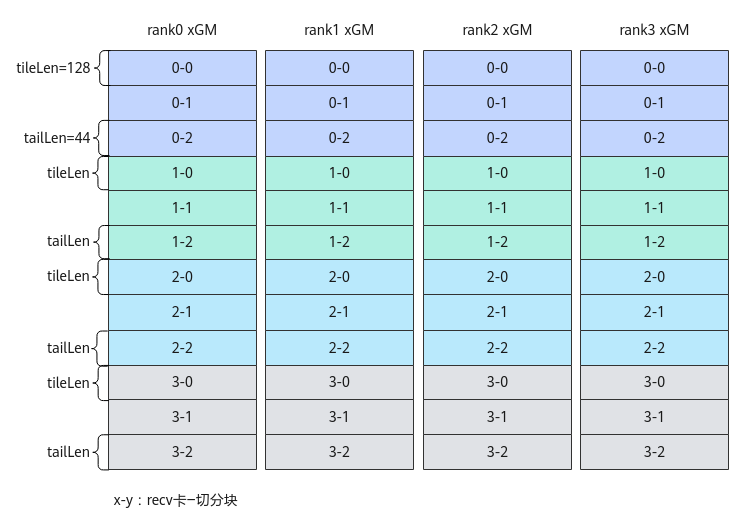
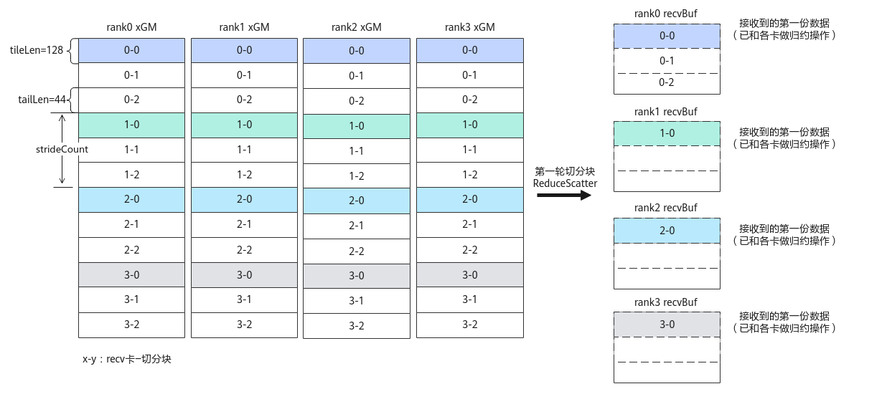

# ReduceScatter<a name="ZH-CN_TOPIC_0000001925171482"></a>

## 产品支持情况<a name="section1586581915393"></a>

<a name="table169596713360"></a>
<table><thead align="left"><tr id="row129590715369"><th class="cellrowborder" valign="top" width="57.99999999999999%" id="mcps1.1.3.1.1"><p id="p17959971362"><a name="p17959971362"></a><a name="p17959971362"></a><span id="ph895914718367"><a name="ph895914718367"></a><a name="ph895914718367"></a>产品</span></p>
</th>
<th class="cellrowborder" align="center" valign="top" width="42%" id="mcps1.1.3.1.2"><p id="p89594763612"><a name="p89594763612"></a><a name="p89594763612"></a>是否支持</p>
</th>
</tr>
</thead>
<tbody><tr id="row18959157103612"><td class="cellrowborder" valign="top" width="57.99999999999999%" headers="mcps1.1.3.1.1 "><p id="p13959117193618"><a name="p13959117193618"></a><a name="p13959117193618"></a><span id="ph9959117173614"><a name="ph9959117173614"></a><a name="ph9959117173614"></a><term id="zh-cn_topic_0000001312391781_term1253731311225"><a name="zh-cn_topic_0000001312391781_term1253731311225"></a><a name="zh-cn_topic_0000001312391781_term1253731311225"></a>Atlas A3 训练系列产品</term>/<term id="zh-cn_topic_0000001312391781_term12835255145414"><a name="zh-cn_topic_0000001312391781_term12835255145414"></a><a name="zh-cn_topic_0000001312391781_term12835255145414"></a>Atlas A3 推理系列产品</term></span></p>
</td>
<td class="cellrowborder" align="center" valign="top" width="42%" headers="mcps1.1.3.1.2 "><p id="p1095914793613"><a name="p1095914793613"></a><a name="p1095914793613"></a>√</p>
</td>
</tr>
<tr id="row89591478362"><td class="cellrowborder" valign="top" width="57.99999999999999%" headers="mcps1.1.3.1.1 "><p id="p7959157163619"><a name="p7959157163619"></a><a name="p7959157163619"></a><span id="ph1995997193619"><a name="ph1995997193619"></a><a name="ph1995997193619"></a><term id="zh-cn_topic_0000001312391781_term11962195213215"><a name="zh-cn_topic_0000001312391781_term11962195213215"></a><a name="zh-cn_topic_0000001312391781_term11962195213215"></a>Atlas A2 训练系列产品</term>/<term id="zh-cn_topic_0000001312391781_term1551319498507"><a name="zh-cn_topic_0000001312391781_term1551319498507"></a><a name="zh-cn_topic_0000001312391781_term1551319498507"></a>Atlas A2 推理系列产品</term></span></p>
</td>
<td class="cellrowborder" align="center" valign="top" width="42%" headers="mcps1.1.3.1.2 "><p id="p149598793615"><a name="p149598793615"></a><a name="p149598793615"></a>√</p>
</td>
</tr>
</tbody>
</table>

## 功能说明<a name="section618mcpsimp"></a>

集合通信算子ReduceScatter的任务下发接口，返回该任务的标识handleId给用户。ReduceScatter的功能为：将所有rank的输入相加（或其他归约操作）后，再把结果按照rank编号均匀分散到各个rank的输出buffer，每个进程拿到其他进程1/ranksize份的数据进行归约操作。


## 函数原型<a name="section620mcpsimp"></a>

```
template <bool commit = false>
__aicore__ inline HcclHandle ReduceScatter(GM_ADDR sendBuf, GM_ADDR recvBuf, uint64_t recvCount, HcclDataType dataType, HcclReduceOp op, uint64_t strideCount, uint8_t repeat = 1)
```

## 参数说明<a name="section622mcpsimp"></a>

**表 1**  模板参数说明

<a name="table149053404318"></a>
<table><thead align="left"><tr id="zh-cn_topic_0000001952285369_zh-cn_topic_0235751031_row27598891"><th class="cellrowborder" valign="top" width="17.77%" id="mcps1.2.4.1.1"><p id="zh-cn_topic_0000001952285369_zh-cn_topic_0235751031_p20917673"><a name="zh-cn_topic_0000001952285369_zh-cn_topic_0235751031_p20917673"></a><a name="zh-cn_topic_0000001952285369_zh-cn_topic_0235751031_p20917673"></a>参数名</p>
</th>
<th class="cellrowborder" valign="top" width="11.799999999999999%" id="mcps1.2.4.1.2"><p id="zh-cn_topic_0000001952285369_zh-cn_topic_0235751031_p16609919"><a name="zh-cn_topic_0000001952285369_zh-cn_topic_0235751031_p16609919"></a><a name="zh-cn_topic_0000001952285369_zh-cn_topic_0235751031_p16609919"></a>输入/输出</p>
</th>
<th class="cellrowborder" valign="top" width="70.43%" id="mcps1.2.4.1.3"><p id="zh-cn_topic_0000001952285369_zh-cn_topic_0235751031_p59995477"><a name="zh-cn_topic_0000001952285369_zh-cn_topic_0235751031_p59995477"></a><a name="zh-cn_topic_0000001952285369_zh-cn_topic_0235751031_p59995477"></a>描述</p>
</th>
</tr>
</thead>
<tbody><tr id="zh-cn_topic_0000001952285369_row42461942101815"><td class="cellrowborder" valign="top" width="17.77%" headers="mcps1.2.4.1.1 "><p id="zh-cn_topic_0000001952285369_p163481714145518"><a name="zh-cn_topic_0000001952285369_p163481714145518"></a><a name="zh-cn_topic_0000001952285369_p163481714145518"></a>commit</p>
</td>
<td class="cellrowborder" valign="top" width="11.799999999999999%" headers="mcps1.2.4.1.2 "><p id="zh-cn_topic_0000001952285369_p33487148556"><a name="zh-cn_topic_0000001952285369_p33487148556"></a><a name="zh-cn_topic_0000001952285369_p33487148556"></a>输入</p>
</td>
<td class="cellrowborder" valign="top" width="70.43%" headers="mcps1.2.4.1.3 "><p id="zh-cn_topic_0000001952285369_p186182538493"><a name="zh-cn_topic_0000001952285369_p186182538493"></a><a name="zh-cn_topic_0000001952285369_p186182538493"></a>bool类型。参数取值如下：</p>
<a name="zh-cn_topic_0000001952285369_ul77246714401"></a><a name="zh-cn_topic_0000001952285369_ul77246714401"></a><ul id="zh-cn_topic_0000001952285369_ul77246714401"><li>true：在调用Prepare接口时，Commit同步通知服务端可以执行该通信任务。</li><li>false：在调用Prepare接口时，不通知服务端执行该通信任务。</li></ul>
</td>
</tr>
</tbody>
</table>

**表 2**  接口参数说明

<a name="table180119381514"></a>
<table><thead align="left"><tr id="row148011835158"><th class="cellrowborder" valign="top" width="17.77%" id="mcps1.2.4.1.1"><p id="p1280114381517"><a name="p1280114381517"></a><a name="p1280114381517"></a>参数名</p>
</th>
<th class="cellrowborder" valign="top" width="11.799999999999999%" id="mcps1.2.4.1.2"><p id="p380111321517"><a name="p380111321517"></a><a name="p380111321517"></a>输入/输出</p>
</th>
<th class="cellrowborder" valign="top" width="70.43%" id="mcps1.2.4.1.3"><p id="p28014351520"><a name="p28014351520"></a><a name="p28014351520"></a>描述</p>
</th>
</tr>
</thead>
<tbody><tr id="row17761811191614"><td class="cellrowborder" valign="top" width="17.77%" headers="mcps1.2.4.1.1 "><p id="p167771011181619"><a name="p167771011181619"></a><a name="p167771011181619"></a>sendBuf</p>
</td>
<td class="cellrowborder" valign="top" width="11.799999999999999%" headers="mcps1.2.4.1.2 "><p id="p377721181614"><a name="p377721181614"></a><a name="p377721181614"></a>输入</p>
</td>
<td class="cellrowborder" valign="top" width="70.43%" headers="mcps1.2.4.1.3 "><p id="p1477711161611"><a name="p1477711161611"></a><a name="p1477711161611"></a>源数据buffer地址。</p>
</td>
</tr>
<tr id="row131931448115213"><td class="cellrowborder" valign="top" width="17.77%" headers="mcps1.2.4.1.1 "><p id="p108351551175216"><a name="p108351551175216"></a><a name="p108351551175216"></a>recvBuf</p>
</td>
<td class="cellrowborder" valign="top" width="11.799999999999999%" headers="mcps1.2.4.1.2 "><p id="p168351351175216"><a name="p168351351175216"></a><a name="p168351351175216"></a>输出</p>
</td>
<td class="cellrowborder" valign="top" width="70.43%" headers="mcps1.2.4.1.3 "><p id="p118351751115215"><a name="p118351751115215"></a><a name="p118351751115215"></a>目的数据buffer地址，集合通信结果输出到此buffer中。</p>
</td>
</tr>
<tr id="row17902814191610"><td class="cellrowborder" valign="top" width="17.77%" headers="mcps1.2.4.1.1 "><p id="p2090218149169"><a name="p2090218149169"></a><a name="p2090218149169"></a>recvCount</p>
</td>
<td class="cellrowborder" valign="top" width="11.799999999999999%" headers="mcps1.2.4.1.2 "><p id="p0902714111616"><a name="p0902714111616"></a><a name="p0902714111616"></a>输入</p>
</td>
<td class="cellrowborder" valign="top" width="70.43%" headers="mcps1.2.4.1.3 "><p id="p10483133811344"><a name="p10483133811344"></a><a name="p10483133811344"></a>参与ReduceScatter操作的recvBuf的数据个数；sendBuf的数据个数等于recvCount * rank size。</p>
</td>
</tr>
<tr id="row48213177160"><td class="cellrowborder" valign="top" width="17.77%" headers="mcps1.2.4.1.1 "><p id="p158219172167"><a name="p158219172167"></a><a name="p158219172167"></a>dataType</p>
</td>
<td class="cellrowborder" valign="top" width="11.799999999999999%" headers="mcps1.2.4.1.2 "><p id="p118152714175"><a name="p118152714175"></a><a name="p118152714175"></a>输入</p>
</td>
<td class="cellrowborder" valign="top" width="70.43%" headers="mcps1.2.4.1.3 "><p id="p9657152819599"><a name="p9657152819599"></a><a name="p9657152819599"></a>ReduceScatter操作的数据类型，目前支持float、half、int8_t、int16_t、int32_t、bfloat16_t数据类型，即支持取值为HCCL_DATA_TYPE_FP32、HCCL_DATA_TYPE_FP16、HCCL_DATA_TYPE_INT8、HCCL_DATA_TYPE_INT16、HCCL_DATA_TYPE_INT32、HCCL_DATA_TYPE_BFP16。HcclDataType数据类型的介绍请参考<a href="HCCL使用说明.md#table116710585514">表1</a>。</p>
</td>
</tr>
<tr id="row1481814577161"><td class="cellrowborder" valign="top" width="17.77%" headers="mcps1.2.4.1.1 "><p id="p3818657171610"><a name="p3818657171610"></a><a name="p3818657171610"></a>op</p>
</td>
<td class="cellrowborder" valign="top" width="11.799999999999999%" headers="mcps1.2.4.1.2 "><p id="p11490527181714"><a name="p11490527181714"></a><a name="p11490527181714"></a>输入</p>
</td>
<td class="cellrowborder" valign="top" width="70.43%" headers="mcps1.2.4.1.3 "><p id="p527731612151"><a name="p527731612151"></a><a name="p527731612151"></a>ReduceScatter的操作类型，目前支持sum、max、min操作类型，即支持取值为HCCL_REDUCE_SUM、HCCL_REDUCE_MAX、HCCL_REDUCE_MIN。HcclReduceOp数据类型的介绍请参考<a href="HCCL使用说明.md#table2469980529">表2</a>。</p>
</td>
</tr>
<tr id="row131614543510"><td class="cellrowborder" valign="top" width="17.77%" headers="mcps1.2.4.1.1 "><p id="p1431610541359"><a name="p1431610541359"></a><a name="p1431610541359"></a>strideCount</p>
</td>
<td class="cellrowborder" valign="top" width="11.799999999999999%" headers="mcps1.2.4.1.2 "><p id="p1431695411517"><a name="p1431695411517"></a><a name="p1431695411517"></a>输入</p>
</td>
<td class="cellrowborder" valign="top" width="70.43%" headers="mcps1.2.4.1.3 "><p id="p33168541955"><a name="p33168541955"></a><a name="p33168541955"></a>当将一张卡上sendBuf中的数据scatter到多张卡的recvBuf时，需要用strideCount参数表示sendBuf上相邻数据块间的起始地址的偏移量。</p>
<a name="ul10121151214328"></a><a name="ul10121151214328"></a><ul id="ul10121151214328"><li>strideCount=0，表示从当前卡发送数据给其它卡时，相邻数据块保持地址连续。本卡发送数据到卡rank[i]，且本卡数据块在sendBuf中的偏移为i*recvCount。非多轮切分场景下，推荐用户设置该参数为0。</li><li>strideCount&gt;0，表示从当前卡发送数据给其它卡时，相邻数据块在sendBuf中起始地址的偏移数据量为strideCount。本卡发送数据到卡rank[i]，且本卡数据块在SendBuf中的偏移为i*strideCount。</li></ul>
<p id="p19358115315411"><a name="p19358115315411"></a><a name="p19358115315411"></a>注意：上述的偏移数据量为数据个数，单位为sizeof(dataType)。</p>
</td>
</tr>
<tr id="row165671519176"><td class="cellrowborder" valign="top" width="17.77%" headers="mcps1.2.4.1.1 "><p id="p17656215111710"><a name="p17656215111710"></a><a name="p17656215111710"></a>repeat</p>
</td>
<td class="cellrowborder" valign="top" width="11.799999999999999%" headers="mcps1.2.4.1.2 "><p id="p38942811174"><a name="p38942811174"></a><a name="p38942811174"></a>输入</p>
</td>
<td class="cellrowborder" valign="top" width="70.43%" headers="mcps1.2.4.1.3 "><p id="p1966044792914"><a name="p1966044792914"></a><a name="p1966044792914"></a>一次下发的ReduceScatter通信任务个数。repeat取值≥1，默认值为1。当repeat&gt;1时，每个ReduceScatter任务的sendBuf和recvBuf地址由服务端自动算出，计算公式如下：</p>
<p id="p91522315916"><a name="p91522315916"></a><a name="p91522315916"></a>sendBuf[i] = sendBuf + recvCount * sizeof(datatype) * i, i∈[0, repeat)</p>
<p id="p19310955081"><a name="p19310955081"></a><a name="p19310955081"></a>recvBuf[i] = recvBuf + recvCount * sizeof(datatype) * i, i∈[0, repeat)</p>
<p id="p777292611013"><a name="p777292611013"></a><a name="p777292611013"></a>注意：当设置repeat&gt;1时，须与strideCount参数配合使用，规划通信数据地址。</p>
</td>
</tr>
</tbody>
</table>

**图 1**  ReduceScatter通信示例<a name="fig11679133914387"></a>  


以上图为例，假设4张卡的场景，每份数据被切分为3块（TileCnt为3），每张卡上的0-0、0-1、0-2数据最终reduce+scatter到卡rank0的recvBuf上，其余的每块1-y、2-y、3-y数据类似，最终分别reduce+scatter到卡rank1、rank2和rank3的recvBuf上。因此，对一张卡上的数据需要调用3次ReduceScatter接口，完成每份数据的3块切分数据的通信。对于每一份数据，本接口中参数recvCount为TileLen，strideCount为TileLen\*TileCnt（即数据块0-0和1-0间隔的数据个数）。由于本例为内存连续场景，因此也可以只调用1次ReduceScatter接口，并将repeat参数设置为3。

## 返回值说明<a name="section640mcpsimp"></a>

返回该任务的标识handleId，handleId大于等于0。调用失败时，返回 -1。

## 约束说明<a name="section633mcpsimp"></a>

-   调用本接口前确保已调用过[InitV2](InitV2.md)和[SetCcTilingV2](SetCcTilingV2.md)接口。
-   若HCCL对象的[config模板参数](HCCL模板参数.md#table884518212555)未指定下发通信任务的核，该接口只能在AI Cube核或者AI Vector核两者之一上调用。若HCCL对象的[config模板参数](HCCL模板参数.md#table884518212555)中指定了下发通信任务的核，则该接口可以在AI Cube核和AI Vector核上同时调用，接口内部会根据指定的核的类型，只在AI Cube核、AI Vector核二者之一下发该通信任务。
-   对于Atlas A2 训练系列产品/Atlas A2 推理系列产品，一个通信域内，所有Prepare接口的总调用次数不能超过63。
-   对于Atlas A3 训练系列产品/Atlas A3 推理系列产品，一个通信域内，所有Prepare接口和InterHcclGroupSync接口的总调用次数不能超过63。

## 调用示例<a name="section1665082013318"></a>

-   非多轮切分场景

    如下图所示，4张卡上均有300 \* 4=1200个float16数据，每张卡从xGM内存中获取到本卡数据，对各卡数据完成reduce sum计算后的结果数据，进行scatter处理，最终每张卡都得到300个reduce sum后的float16数据。

    **图 2**  非多轮切分场景下4卡ReduceScatter通信<a name="fig29206620378"></a>  
    
    

    ```
    extern "C" __global__ __aicore__ void reduce_scatter_custom(GM_ADDR xGM, GM_ADDR yGM, GM_ADDR workspaceGM, GM_ADDR tilingGM) {
        auto sendBuf = xGM;  // xGM为ReduceScatter的输入GM地址
        auto recvBuf = yGM;  // yGM为ReduceScatter的输出GM地址
        uint64_t recvCount = 300;  // 每张卡的通信结果数据个数
        uint64_t strideCount = 0;  // 非切分场景strideCount可设置为0
        HcclReduceOp reduceOp = HcclReduceOp::HCCL_REDUCE_SUM;
        REGISTER_TILING_DEFAULT(ReduceScatterCustomTilingData); //ReduceScatterCustomTilingData为对应算子头文件定义的结构体
        GET_TILING_DATA_WITH_STRUCT(ReduceScatterCustomTilingData, tilingData, tilingGM);
    
        Hccl hccl;
        GM_ADDR contextGM = AscendC::GetHcclContext<0>();  // AscendC自定义算子kernel中，通过此方式获取HCCL context
        if (AscendC::g_coreType == AIV) {  // 指定AIV核通信   
            hccl.InitV2(contextGM, &tilingData);
            auto ret = hccl.SetCcTilingV2(offsetof(ReduceScatterCustomTilingData, reduceScatterCcTiling));
            if (ret != HCCL_SUCCESS) {
              return;
            }
            HcclHandle handleId1 = hccl.ReduceScatter<true>(sendBuf, recvBuf, recvCount, HcclDataType::HCCL_DATA_TYPE_FP16, reduceOp, strideCount);
            hccl.Wait(handleId1);    
            AscendC::SyncAll<true>();  // 全AIV核同步，防止0核执行过快，提前调用hccl.Finalize()接口，导致其他核Wait卡死   
            hccl.Finalize();
        }
    }
    ```

-   多轮切分场景

    使能多轮切分，等效处理上述非多轮切分示例的通信。如下图所示，每张卡的每份300个float16数据，被切分为2个首块，1个尾块。每个首块的数据量tileLen为128个float16数据，尾块的数据量tailLen为44个float16数据。在算子内部实现时，需要对切分后的数据分3轮进行ReduceScatter通信任务，将等效上述非多轮切分的通信结果。

    **图 3**  各卡数据切分示意图<a name="fig26821908496"></a>  
    

    具体实现为，第1轮通信，每个rank上的0-0\\1-0\\2-0\\3-0数据块进行ReduceScatter处理。第2轮通信，每个rank上0-1\\1-1\\2-1\\3-1数据块进行ReduceScatter处理。第3轮通信，每个rank上0-2\\1-2\\2-2\\3-2数据块进行ReduceScatter处理。每一轮通信的输入数据中，各卡上相邻数据块的起始地址间隔的数据个数为strideCount，以第一轮通信结果为例，rank0的0-0数据块和1-0数据块，或者1-0数据块和2-0数据块，两个相邻数据块起始地址间隔的数据量strideCount = 2\*tileLen+1\*tailLen=300。

    **图 4**  第一轮4卡ReduceScatter示意图<a name="fig1662341913515"></a>  
    

    ```
    extern "C" __global__ __aicore__ void reduce_scatter_custom(GM_ADDR xGM, GM_ADDR yGM, GM_ADDR workspaceGM, GM_ADDR tilingGM) {
        constexpr uint32_t tileNum = 2U;   // 首块数量
        constexpr uint64_t tileLen = 128U; // 首块数据个数
        constexpr uint32_t tailNum = 1U;   // 尾块数量
        constexpr uint64_t tailLen = 44U;  // 尾块数据个数
        auto sendBuf = xGM;  // xGM为ReduceScatter的输入GM地址
        auto recvBuf = yGM;  // yGM为ReduceScatter的输出GM地址
        HcclReduceOp reduceOp = HcclReduceOp::HCCL_REDUCE_SUM;
        uint64_t strideCount = tileLen * tileNum + tailLen * tailNum;
        REGISTER_TILING_DEFAULT(ReduceScatterCustomTilingData); //ReduceScatterCustomTilingData为对应算子头文件定义的结构体
        GET_TILING_DATA_WITH_STRUCT(ReduceScatterCustomTilingData, tilingData, tilingGM);
    
        Hccl hccl;
        GM_ADDR contextGM = AscendC::GetHcclContext<0>();  // AscendC自定义算子kernel中，通过此方式获取HCCL context
        if (AscendC::g_coreType == AIV) {  // 指定AIV核通信   
            hccl.InitV2(contextGM, &tilingData);
            auto ret = hccl.SetCcTilingV2(offsetof(ReduceScatterCustomTilingData, reduceScatterCcTiling));
            if (ret != HCCL_SUCCESS) {
              return;
            }
            // 2个首块处理
            constexpr uint32_t tileRepeat = tileNum; 
            // 除了sendBuf和recvBuf入参不同，处理2个首块的其余参数相同。故使用repaet=2，第2个首块ReduceScatter任务的sendBuf、recvBuf将由API内部自行更新
            HcclHandle handleId1 = hccl.ReduceScatter<true>(sendBuf, recvBuf, tileLen, HcclDataType::HCCL_DATA_TYPE_FP16, reduceOp, strideCount, tileRepeat); 
            // 1个尾块处理
            constexpr uint32_t kSizeOfFloat16 = 2U;
            sendBuf += tileLen * tileNum * kSizeOfFloat16;
            recvBuf += tileLen * tileNum * kSizeOfFloat16;
            constexpr uint32_t tailRepeat = tailNum; 
            HcclHandle handleId2 = hccl.ReduceScatter<true>(sendBuf, recvBuf, tailLen, HcclDataType::HCCL_DATA_TYPE_FP16, reduceOp, strideCount, tailRepeat);
            
            for (uint8_t i=0; i<tileRepeat; i++) {
                hccl.Wait(handleId1);
            }
            hccl.Wait(handleId2);  
            AscendC::SyncAll<true>();  // 全AIV核同步，防止0核执行过快，提前调用hccl.Finalize()接口，导致其他核Wait卡死   
            hccl.Finalize();
        }
    }
    ```

