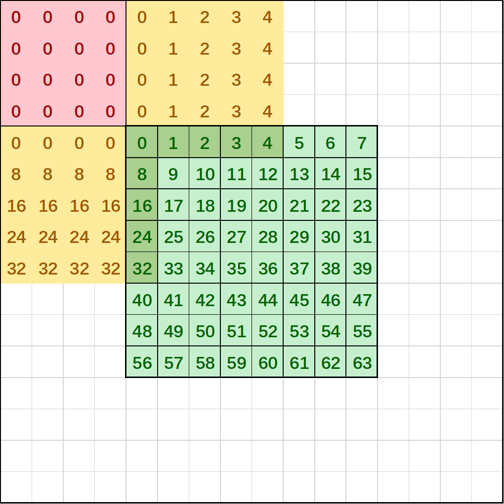
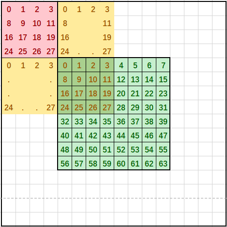
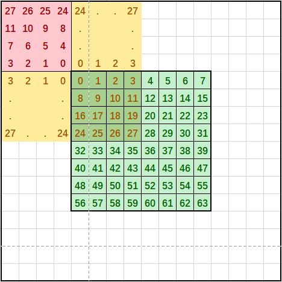

# SetAippFunctions<a name="ZH-CN_TOPIC_0000001913015092"></a>

## 产品支持情况<a name="section1550532418810"></a>

<a name="table38301303189"></a>
<table><thead align="left"><tr id="row20831180131817"><th class="cellrowborder" valign="top" width="57.99999999999999%" id="mcps1.1.3.1.1"><p id="p1883113061818"><a name="p1883113061818"></a><a name="p1883113061818"></a><span id="ph20833205312295"><a name="ph20833205312295"></a><a name="ph20833205312295"></a>产品</span></p>
</th>
<th class="cellrowborder" align="center" valign="top" width="42%" id="mcps1.1.3.1.2"><p id="p783113012187"><a name="p783113012187"></a><a name="p783113012187"></a>是否支持</p>
</th>
</tr>
</thead>
<tbody><tr id="row220181016240"><td class="cellrowborder" valign="top" width="57.99999999999999%" headers="mcps1.1.3.1.1 "><p id="p48327011813"><a name="p48327011813"></a><a name="p48327011813"></a><span id="ph583230201815"><a name="ph583230201815"></a><a name="ph583230201815"></a><term id="zh-cn_topic_0000001312391781_term1253731311225"><a name="zh-cn_topic_0000001312391781_term1253731311225"></a><a name="zh-cn_topic_0000001312391781_term1253731311225"></a>Atlas A3 训练系列产品</term>/<term id="zh-cn_topic_0000001312391781_term12835255145414"><a name="zh-cn_topic_0000001312391781_term12835255145414"></a><a name="zh-cn_topic_0000001312391781_term12835255145414"></a>Atlas A3 推理系列产品</term></span></p>
</td>
<td class="cellrowborder" align="center" valign="top" width="42%" headers="mcps1.1.3.1.2 "><p id="p7948163910184"><a name="p7948163910184"></a><a name="p7948163910184"></a>√</p>
</td>
</tr>
<tr id="row173226882415"><td class="cellrowborder" valign="top" width="57.99999999999999%" headers="mcps1.1.3.1.1 "><p id="p14832120181815"><a name="p14832120181815"></a><a name="p14832120181815"></a><span id="ph1483216010188"><a name="ph1483216010188"></a><a name="ph1483216010188"></a><term id="zh-cn_topic_0000001312391781_term11962195213215"><a name="zh-cn_topic_0000001312391781_term11962195213215"></a><a name="zh-cn_topic_0000001312391781_term11962195213215"></a>Atlas A2 训练系列产品</term>/<term id="zh-cn_topic_0000001312391781_term1551319498507"><a name="zh-cn_topic_0000001312391781_term1551319498507"></a><a name="zh-cn_topic_0000001312391781_term1551319498507"></a>Atlas A2 推理系列产品</term></span></p>
</td>
<td class="cellrowborder" align="center" valign="top" width="42%" headers="mcps1.1.3.1.2 "><p id="p19948143911820"><a name="p19948143911820"></a><a name="p19948143911820"></a>√</p>
</td>
</tr>
</tbody>
</table>

## 功能说明<a name="section618mcpsimp"></a>

设置图片预处理（AIPP，AI core pre-process）相关参数。和[LoadImageToLocal](LoadImageToLocal.md)接口配合使用。设置后，调用[LoadImageToLocal](LoadImageToLocal.md)接口可在搬运过程中完成图像预处理操作：包括数据填充，通道交换，单行读取、数据类型转换、通道填充、色域转换。调用SetAippFunctions接口时需传入源图片在Global Memory上的矩阵、源图片的图片格式。

-   **数据填充**：在图片HW方向上padding。分为如下几种模式：
    -   模式0：常量填充模式，padding区域各位置填充为常数，支持设置每个通道填充的常数。该模式下仅支持左右padding，不支持上下padding。

        **图 1**  常量填充模式（图片中间的绿色区域表示原始数据，其他为padding数据）<a name="fig56681157121916"></a>  
        

    -   模式1：行列填充模式，padding区域各位置填充行/列上最邻近源图片位置的数据。

        **图 2**  行列填充模式（图片中间的绿色区域表示原始数据，其他为padding数据）<a name="fig4239143712713"></a>  
        

    -   模式2：块填充模式，按照padding的宽高，从源图片拷贝数据块进行padding区域填充。

        **图 3**  块填充模式（图片中间的绿色区域表示原始数据，其他为padding数据）<a name="fig38821202817"></a>  
        

    -   模式3：镜像块填充模式，按照padding的宽高，从源图片拷贝数据块的镜像进行padding区域填充。

        **图 4**  镜像块填充模式（图片中间的绿色区域表示原始数据，其他为padding数据）<a name="fig14371141920261"></a>  
        

-   **通道交换**：将图片通道进行交换。

    对于RGB888格式，支持交换R和B通道。

    对于YUV420SP格式，支持交换U和V通道。

    对于XRGB8888格式，支持X通道后移（XRGB-\>RGBX）、支持交换R和B通道。

-   **单行读取**：源图片中仅读取一行。

    > **说明：** 
    >调用数据搬运接口时，开启单行读取后设置的目的图片高度参数无效，如[LoadImageToLocal](LoadImageToLocal.md)接口的loadImageToLocalParams.vertSize。

-   **数据类型转换**：转换像素的数据类型，支持uint8\_t转换为int8\_t或half。当uint8\_t转换成int8\_t的时候，输出数据范围限制在\[-128， 127\]。

    ```
    // 例1：实现uint8_t ->int8_t 的类型转换，同时实现零均值化：设置每个通道mean值为该通道所有数据的平均值（min和var值无效，不用设置）。
    output[i][j][k] = input[i][j][k] - mean[k]
    // 例2：实现uint8_t -> fp16 的类型转换，同时实现归一化：设置每个通道mean值为该通道所有数据的平均值，min值为该通道所有数据零均值化后的最小值，var值为该通道所有数据的最大值减最小值的倒数。
    uint8_t -> fp16:  output[i][j][k] = (input[i][j][k] - mean[k] - min[k]) * var[k]
    ```

    > **说明：** 
    >转换后的数据类型是由模板参数U配置，U为uint8\_t时数据类型转换功能不生效。
    >调用数据搬运接口时，目的Tensor的数据类型需要与本接口输出数据类型保持一致，如[LoadImageToLocal](LoadImageToLocal.md)的dstLocal参数的数据类型。

-   **通道填充**：在图片通道方向上padding。默认为模式0。

    模式0：将通道padding至32Bytes。即输出数据类型为uint8\_t/int8\_t时，padding至32通道；输出数据类型为fp16时，padding至16通道。

    模式1：将通道padding至4通道。

-   **色域转换**：RGB格式转换为YUV格式，或YUV模式转换为RGB格式。

    

    

## 函数原型<a name="section620mcpsimp"></a>

-   输入图片格式为YUV400、RGB888、XRGB8888

    ```
    template<typename T, typename U>
    void SetAippFunctions(const GlobalTensor<T>& src0, AippInputFormat format, AippParams<U> config)
    ```

-   输入图片格式为YUV420 Semi-Planar

    ```
    template<typename T, typename U>
    void SetAippFunctions(const GlobalTensor<T>& src0, const GlobalTensor<T>& src1, AippInputFormat format, AippParams<U> config)
    ```

## 参数说明<a name="section622mcpsimp"></a>

**表 1**  模板参数说明

<a name="table07381635103112"></a>
<table><thead align="left"><tr id="row117393350314"><th class="cellrowborder" valign="top" width="16.580000000000002%" id="mcps1.2.3.1.1"><p id="p14739335193119"><a name="p14739335193119"></a><a name="p14739335193119"></a>参数名称</p>
</th>
<th class="cellrowborder" valign="top" width="83.42%" id="mcps1.2.3.1.2"><p id="p8739203514314"><a name="p8739203514314"></a><a name="p8739203514314"></a>含义</p>
</th>
</tr>
</thead>
<tbody><tr id="row18739935193119"><td class="cellrowborder" valign="top" width="16.580000000000002%" headers="mcps1.2.3.1.1 "><p id="p173953516310"><a name="p173953516310"></a><a name="p173953516310"></a>T</p>
</td>
<td class="cellrowborder" valign="top" width="83.42%" headers="mcps1.2.3.1.2 "><p id="p12739193516313"><a name="p12739193516313"></a><a name="p12739193516313"></a>输入的数据类型，需要与format中设置的数据类型保持一致。</p>
</td>
</tr>
<tr id="row157395356314"><td class="cellrowborder" valign="top" width="16.580000000000002%" headers="mcps1.2.3.1.1 "><p id="p67393352310"><a name="p67393352310"></a><a name="p67393352310"></a>U</p>
</td>
<td class="cellrowborder" valign="top" width="83.42%" headers="mcps1.2.3.1.2 "><p id="p824034219439"><a name="p824034219439"></a><a name="p824034219439"></a>输出的数据类型，需要在搬运接口配置同样的数据类型，如<a href="LoadImageToLocal.md">LoadImageToLocal</a>的dstLocal参数数据类型。</p>
<a name="ul19236182417132"></a><a name="ul19236182417132"></a><ul id="ul19236182417132"><li>如果不使能数据类型转换功能，需要与输入类型保持一致；</li><li>如果使能数据类型转换功能，需要与期望转换后的类型保持一致。</li></ul>
</td>
</tr>
</tbody>
</table>

**表 2**  参数说明

<a name="table18368155193919"></a>
<table><thead align="left"><tr id="row1036805543911"><th class="cellrowborder" valign="top" width="16.371637163716375%" id="mcps1.2.4.1.1"><p id="p1836835511393"><a name="p1836835511393"></a><a name="p1836835511393"></a>参数名称</p>
</th>
<th class="cellrowborder" valign="top" width="11.311131113111312%" id="mcps1.2.4.1.2"><p id="p10368255163915"><a name="p10368255163915"></a><a name="p10368255163915"></a>输入/输出</p>
</th>
<th class="cellrowborder" valign="top" width="72.31723172317231%" id="mcps1.2.4.1.3"><p id="p436875573911"><a name="p436875573911"></a><a name="p436875573911"></a>含义</p>
</th>
</tr>
</thead>
<tbody><tr id="row1436825518395"><td class="cellrowborder" valign="top" width="16.371637163716375%" headers="mcps1.2.4.1.1 "><p id="p9649151061720"><a name="p9649151061720"></a><a name="p9649151061720"></a>src0</p>
</td>
<td class="cellrowborder" valign="top" width="11.311131113111312%" headers="mcps1.2.4.1.2 "><p id="p1649121041718"><a name="p1649121041718"></a><a name="p1649121041718"></a>输入</p>
</td>
<td class="cellrowborder" valign="top" width="72.31723172317231%" headers="mcps1.2.4.1.3 "><p id="p1922356104517"><a name="p1922356104517"></a><a name="p1922356104517"></a>源图片在Global Memory上的矩阵。</p>
<p id="p143854516578"><a name="p143854516578"></a><a name="p143854516578"></a>源图片格式为YUV420SP时，表示Y维度在Global Memory上的矩阵。</p>
</td>
</tr>
<tr id="row1836875519393"><td class="cellrowborder" valign="top" width="16.371637163716375%" headers="mcps1.2.4.1.1 "><p id="p7650141019171"><a name="p7650141019171"></a><a name="p7650141019171"></a>src1</p>
</td>
<td class="cellrowborder" valign="top" width="11.311131113111312%" headers="mcps1.2.4.1.2 "><p id="p4650610141715"><a name="p4650610141715"></a><a name="p4650610141715"></a>输入</p>
</td>
<td class="cellrowborder" valign="top" width="72.31723172317231%" headers="mcps1.2.4.1.3 "><p id="p17434825204519"><a name="p17434825204519"></a><a name="p17434825204519"></a>源图片格式为YUV420SP时，表示UV维度在Global Memory上的矩阵。</p>
<p id="p1932022015453"><a name="p1932022015453"></a><a name="p1932022015453"></a>源图片格式为其他格式时，该参数无效。</p>
</td>
</tr>
<tr id="row1767431631917"><td class="cellrowborder" valign="top" width="16.371637163716375%" headers="mcps1.2.4.1.1 "><p id="p667418162198"><a name="p667418162198"></a><a name="p667418162198"></a>format</p>
</td>
<td class="cellrowborder" valign="top" width="11.311131113111312%" headers="mcps1.2.4.1.2 "><p id="p11675191610195"><a name="p11675191610195"></a><a name="p11675191610195"></a>输入</p>
</td>
<td class="cellrowborder" valign="top" width="72.31723172317231%" headers="mcps1.2.4.1.3 "><p id="p1538121416464"><a name="p1538121416464"></a><a name="p1538121416464"></a>源图片的图片格式。AippInputFormat为枚举类型，取值为：</p>
<p id="p164443593517"><a name="p164443593517"></a><a name="p164443593517"></a>AippInputFormat::YUV420SP_U8：图片格式为YUV420 Semi-Planar，数据类型为uint8_t</p>
<p id="p13644113513520"><a name="p13644113513520"></a><a name="p13644113513520"></a>AippInputFormat::XRGB8888_U8：图片格式为XRGB8888，数据类型为uint8_t</p>
<p id="p0644635163513"><a name="p0644635163513"></a><a name="p0644635163513"></a>AippInputFormat::RGB888_U8：图片格式为RGB888，数据类型为uint8_t</p>
<p id="p1164553510351"><a name="p1164553510351"></a><a name="p1164553510351"></a>AippInputFormat::YUV400_U8：图片格式为YUV400，数据类型为uint8_t</p>
<pre class="screen" id="screen197391367335"><a name="screen197391367335"></a><a name="screen197391367335"></a>enum class AippInputFormat : uint8_t {
    YUV420SP_U8 = 0,
    XRGB8888_U8 = 1,
    RGB888_U8 = 4,
    YUV400_U8 = 9,
};</pre>
</td>
</tr>
<tr id="row1118718139487"><td class="cellrowborder" valign="top" width="16.371637163716375%" headers="mcps1.2.4.1.1 "><p id="p13187181320485"><a name="p13187181320485"></a><a name="p13187181320485"></a>config</p>
</td>
<td class="cellrowborder" valign="top" width="11.311131113111312%" headers="mcps1.2.4.1.2 "><p id="p18188101334816"><a name="p18188101334816"></a><a name="p18188101334816"></a>输入</p>
</td>
<td class="cellrowborder" valign="top" width="72.31723172317231%" headers="mcps1.2.4.1.3 "><p id="p761611174543"><a name="p761611174543"></a><a name="p761611174543"></a>图片预处理的相关参数，类型为AippParams，结构体具体定义为：</p>
<a name="screen14291456104811"></a><a name="screen14291456104811"></a><pre class="screen" codetype="Cpp" id="screen14291456104811">template &lt;typename T&gt;
struct AippParams {
    AippPaddingParams&lt;T&gt; paddingParams;
    AippSwapParams swapParams;
    AippSingleLineParams singleLineParams;
    AippDataTypeConvParams dtcParams;
    AippChannelPaddingParams&lt;T&gt; cPaddingParams;
    AippColorSpaceConvParams cscParams;
};</pre>
<p id="p129814574819"><a name="p129814574819"></a><a name="p129814574819"></a>AippParams结构体内各子结构体定义如下：</p>
<a name="ul737810412144"></a><a name="ul737810412144"></a><ul id="ul737810412144"><li>数据填充功能相关参数，说明见<a href="#table8955841508">表3</a>。<a name="screen117911942165117"></a><a name="screen117911942165117"></a><pre class="screen" codetype="Cpp" id="screen117911942165117">template &lt;typename T&gt;
struct AippPaddingParams {
    uint32_t paddingMode;
    T paddingValueCh0;
    T paddingValueCh1;
    T paddingValueCh2;
    T paddingValueCh3;
};</pre>
</li><li>通道交换功能相关参数，说明见<a href="#table679014222918">表4</a>。<a name="screen10865103665215"></a><a name="screen10865103665215"></a><pre class="screen" codetype="Cpp" id="screen10865103665215">struct AippSwapParams {
    bool isSwapRB;
    bool isSwapUV;
    bool isSwapAX;
};</pre>
</li><li>单行读取功能相关参数，说明见<a href="#table193501032193419">表5</a>。<a name="screen1187335714526"></a><a name="screen1187335714526"></a><pre class="screen" codetype="Cpp" id="screen1187335714526">struct AippSingleLineParams {
    bool isSingleLineCopy;
};</pre>
</li></ul>
<a name="ul45916270146"></a><a name="ul45916270146"></a><ul id="ul45916270146"><li>数据类型转换功能相关参数，说明见<a href="#table14611192613519">表6</a>。<a name="screen11371618165312"></a><a name="screen11371618165312"></a><pre class="screen" codetype="Cpp" id="screen11371618165312">struct AippDataTypeConvParams {
    uint8_t dtcMeanCh0{ 0 };
    uint8_t dtcMeanCh1{ 0 };
    uint8_t dtcMeanCh2{ 0 };
    half dtcMinCh0{ 0 };
    half dtcMinCh1{ 0 };
    half dtcMinCh2{ 0 };
    half dtcVarCh0{ 1.0 };
    half dtcVarCh1{ 1.0 };
    half dtcVarCh2{ 1.0 };
    uint32_t dtcRoundMode{ 0 };
};</pre>
</li></ul>
<a name="ul713283961411"></a><a name="ul713283961411"></a><ul id="ul713283961411"><li>通道填充功能相关参数，说明见<a href="#table163681812917">表7</a>。<a name="screen1319711065418"></a><a name="screen1319711065418"></a><pre class="screen" codetype="Cpp" id="screen1319711065418">template &lt;typename T&gt;
struct AippChannelPaddingParams {
    uint32_t cPaddingMode;
    T cPaddingValue;
};</pre>
</li><li>色域转换功能相关参数，说明见<a href="#table7858175271018">表8</a>。<a name="screen873561816545"></a><a name="screen873561816545"></a><pre class="screen" codetype="Cpp" id="screen873561816545">struct AippColorSpaceConvParams {
    bool isEnableCsc;
    int16_t cscMatrixR0C0;
    int16_t cscMatrixR0C1;
    int16_t cscMatrixR0C2;
    int16_t cscMatrixR1C0;
    int16_t cscMatrixR1C1;
    int16_t cscMatrixR1C2;
    int16_t cscMatrixR2C0;
    int16_t cscMatrixR2C1;
    int16_t cscMatrixR2C2;
    uint8_t cscBiasIn0;
    uint8_t cscBiasIn1;
    uint8_t cscBiasIn2;
    uint8_t cscBiasOut0;
    uint8_t cscBiasOut1;
    uint8_t cscBiasOut2;
};</pre>
</li></ul>
</td>
</tr>
</tbody>
</table>

**表 3**  AippPaddingParams结构体内参数说明

<a name="table8955841508"></a>
<table><thead align="left"><tr id="row15956194105014"><th class="cellrowborder" valign="top" width="17.94179417941794%" id="mcps1.2.4.1.1"><p id="p7956144195014"><a name="p7956144195014"></a><a name="p7956144195014"></a>参数名称</p>
</th>
<th class="cellrowborder" valign="top" width="9.82098209820982%" id="mcps1.2.4.1.2"><p id="p1295624145013"><a name="p1295624145013"></a><a name="p1295624145013"></a>输入/输出</p>
</th>
<th class="cellrowborder" valign="top" width="72.23722372237225%" id="mcps1.2.4.1.3"><p id="p16956144145011"><a name="p16956144145011"></a><a name="p16956144145011"></a>含义</p>
</th>
</tr>
</thead>
<tbody><tr id="row5956546509"><td class="cellrowborder" valign="top" width="17.94179417941794%" headers="mcps1.2.4.1.1 "><p id="p1855384918180"><a name="p1855384918180"></a><a name="p1855384918180"></a>paddingMode</p>
</td>
<td class="cellrowborder" valign="top" width="9.82098209820982%" headers="mcps1.2.4.1.2 "><p id="p75532491189"><a name="p75532491189"></a><a name="p75532491189"></a>输入</p>
</td>
<td class="cellrowborder" valign="top" width="72.23722372237225%" headers="mcps1.2.4.1.3 "><p id="p723515224566"><a name="p723515224566"></a><a name="p723515224566"></a>padding的模式，取值范围[0, 3]，默认值为0。</p>
<p id="p62364227565"><a name="p62364227565"></a><a name="p62364227565"></a>0：常数填充模式，此模式仅支持左右填充。</p>
<p id="p82361722155614"><a name="p82361722155614"></a><a name="p82361722155614"></a>1：行列拷贝模式。</p>
<p id="p223618229560"><a name="p223618229560"></a><a name="p223618229560"></a>2：块拷贝模式。</p>
<p id="p12236622205610"><a name="p12236622205610"></a><a name="p12236622205610"></a>3：镜像块拷贝模式。</p>
</td>
</tr>
<tr id="row4956154125018"><td class="cellrowborder" valign="top" width="17.94179417941794%" headers="mcps1.2.4.1.1 "><p id="p955315493182"><a name="p955315493182"></a><a name="p955315493182"></a>paddingValueCh0</p>
</td>
<td class="cellrowborder" valign="top" width="9.82098209820982%" headers="mcps1.2.4.1.2 "><p id="p755314991818"><a name="p755314991818"></a><a name="p755314991818"></a>输入</p>
</td>
<td class="cellrowborder" valign="top" width="72.23722372237225%" headers="mcps1.2.4.1.3 "><p id="p15553949101816"><a name="p15553949101816"></a><a name="p15553949101816"></a>padding区域中channel0填充的数据，仅常数填充模式有效，数据类型为T，默认值为0。</p>
</td>
</tr>
<tr id="row11771625161812"><td class="cellrowborder" valign="top" width="17.94179417941794%" headers="mcps1.2.4.1.1 "><p id="p055374920185"><a name="p055374920185"></a><a name="p055374920185"></a>paddingValueCh1</p>
</td>
<td class="cellrowborder" valign="top" width="9.82098209820982%" headers="mcps1.2.4.1.2 "><p id="p6553449121814"><a name="p6553449121814"></a><a name="p6553449121814"></a>输入</p>
</td>
<td class="cellrowborder" valign="top" width="72.23722372237225%" headers="mcps1.2.4.1.3 "><p id="p18553154931812"><a name="p18553154931812"></a><a name="p18553154931812"></a>padding区域中channel1填充的数据，仅常数填充模式有效，数据类型为T，默认值为0。</p>
</td>
</tr>
<tr id="row93311227171815"><td class="cellrowborder" valign="top" width="17.94179417941794%" headers="mcps1.2.4.1.1 "><p id="p1555320499185"><a name="p1555320499185"></a><a name="p1555320499185"></a>paddingValueCh2</p>
</td>
<td class="cellrowborder" valign="top" width="9.82098209820982%" headers="mcps1.2.4.1.2 "><p id="p1355314971811"><a name="p1355314971811"></a><a name="p1355314971811"></a>输入</p>
</td>
<td class="cellrowborder" valign="top" width="72.23722372237225%" headers="mcps1.2.4.1.3 "><p id="p1755334901812"><a name="p1755334901812"></a><a name="p1755334901812"></a>padding区域中channel2填充的数据，仅常数填充模式有效，数据类型为T，默认值为0。</p>
</td>
</tr>
<tr id="row1321772919185"><td class="cellrowborder" valign="top" width="17.94179417941794%" headers="mcps1.2.4.1.1 "><p id="p125531449181816"><a name="p125531449181816"></a><a name="p125531449181816"></a>paddingValueCh3</p>
</td>
<td class="cellrowborder" valign="top" width="9.82098209820982%" headers="mcps1.2.4.1.2 "><p id="p105545496187"><a name="p105545496187"></a><a name="p105545496187"></a>输入</p>
</td>
<td class="cellrowborder" valign="top" width="72.23722372237225%" headers="mcps1.2.4.1.3 "><p id="p1755412492183"><a name="p1755412492183"></a><a name="p1755412492183"></a>padding区域中channel3填充的数据，仅常数填充模式有效，数据类型为T，默认值为0。</p>
</td>
</tr>
</tbody>
</table>

**表 4**  AippSwapParams结构体内参数说明

<a name="table679014222918"></a>
<table><thead align="left"><tr id="row67907213292"><th class="cellrowborder" valign="top" width="16.46164616461646%" id="mcps1.2.4.1.1"><p id="p7790192122918"><a name="p7790192122918"></a><a name="p7790192122918"></a>参数名称</p>
</th>
<th class="cellrowborder" valign="top" width="11.311131113111312%" id="mcps1.2.4.1.2"><p id="p18790122112918"><a name="p18790122112918"></a><a name="p18790122112918"></a>输入/输出</p>
</th>
<th class="cellrowborder" valign="top" width="72.22722272227222%" id="mcps1.2.4.1.3"><p id="p5790826291"><a name="p5790826291"></a><a name="p5790826291"></a>含义</p>
</th>
</tr>
</thead>
<tbody><tr id="row15790223298"><td class="cellrowborder" valign="top" width="16.46164616461646%" headers="mcps1.2.4.1.1 "><p id="p127861037163218"><a name="p127861037163218"></a><a name="p127861037163218"></a>isSwapRB</p>
</td>
<td class="cellrowborder" valign="top" width="11.311131113111312%" headers="mcps1.2.4.1.2 "><p id="p187861837203220"><a name="p187861837203220"></a><a name="p187861837203220"></a>输入</p>
</td>
<td class="cellrowborder" valign="top" width="72.22722272227222%" headers="mcps1.2.4.1.3 "><p id="p8786437143220"><a name="p8786437143220"></a><a name="p8786437143220"></a>对于RGB888、XRGB8888格式，是否交换R和B通道。默认值为false。</p>
</td>
</tr>
<tr id="row177900242919"><td class="cellrowborder" valign="top" width="16.46164616461646%" headers="mcps1.2.4.1.1 "><p id="p87867378329"><a name="p87867378329"></a><a name="p87867378329"></a>isSwapUV</p>
</td>
<td class="cellrowborder" valign="top" width="11.311131113111312%" headers="mcps1.2.4.1.2 "><p id="p278614375328"><a name="p278614375328"></a><a name="p278614375328"></a>输入</p>
</td>
<td class="cellrowborder" valign="top" width="72.22722272227222%" headers="mcps1.2.4.1.3 "><p id="p57861537163215"><a name="p57861537163215"></a><a name="p57861537163215"></a>对于YUV420SP格式，是否交换U和V通道。默认值为false。</p>
</td>
</tr>
<tr id="row179172192915"><td class="cellrowborder" valign="top" width="16.46164616461646%" headers="mcps1.2.4.1.1 "><p id="p8786537113210"><a name="p8786537113210"></a><a name="p8786537113210"></a>isSwapAX</p>
</td>
<td class="cellrowborder" valign="top" width="11.311131113111312%" headers="mcps1.2.4.1.2 "><p id="p147865375326"><a name="p147865375326"></a><a name="p147865375326"></a>输入</p>
</td>
<td class="cellrowborder" valign="top" width="72.22722272227222%" headers="mcps1.2.4.1.3 "><p id="p978603711329"><a name="p978603711329"></a><a name="p978603711329"></a>对于XRGB8888格式，是否将X通道后移，即XRGB-&gt;RGBX。默认值为false。</p>
</td>
</tr>
</tbody>
</table>

**表 5**  AippSingleLineParams结构体内参数说明

<a name="table193501032193419"></a>
<table><thead align="left"><tr id="row235043213342"><th class="cellrowborder" valign="top" width="16.46164616461646%" id="mcps1.2.4.1.1"><p id="p18350163220344"><a name="p18350163220344"></a><a name="p18350163220344"></a>参数名称</p>
</th>
<th class="cellrowborder" valign="top" width="11.311131113111312%" id="mcps1.2.4.1.2"><p id="p1635063215345"><a name="p1635063215345"></a><a name="p1635063215345"></a>输入/输出</p>
</th>
<th class="cellrowborder" valign="top" width="72.22722272227222%" id="mcps1.2.4.1.3"><p id="p10350163223414"><a name="p10350163223414"></a><a name="p10350163223414"></a>含义</p>
</th>
</tr>
</thead>
<tbody><tr id="row9351132173415"><td class="cellrowborder" valign="top" width="16.46164616461646%" headers="mcps1.2.4.1.1 "><p id="p2442124310351"><a name="p2442124310351"></a><a name="p2442124310351"></a>isSingleLineCopy</p>
</td>
<td class="cellrowborder" valign="top" width="11.311131113111312%" headers="mcps1.2.4.1.2 "><p id="p544210437352"><a name="p544210437352"></a><a name="p544210437352"></a>输入</p>
</td>
<td class="cellrowborder" valign="top" width="72.22722272227222%" headers="mcps1.2.4.1.3 "><p id="p944284318351"><a name="p944284318351"></a><a name="p944284318351"></a>是否开启单行读取模式。开启后，仅从源图片读取一行。默认值为false。</p>
</td>
</tr>
</tbody>
</table>

**表 6**  AippDataTypeConvParams结构体内参数说明

<a name="table14611192613519"></a>
<table><thead align="left"><tr id="row136113261355"><th class="cellrowborder" valign="top" width="16.46164616461646%" id="mcps1.2.4.1.1"><p id="p96111426756"><a name="p96111426756"></a><a name="p96111426756"></a>参数名称</p>
</th>
<th class="cellrowborder" valign="top" width="11.311131113111312%" id="mcps1.2.4.1.2"><p id="p14611162619519"><a name="p14611162619519"></a><a name="p14611162619519"></a>输入/输出</p>
</th>
<th class="cellrowborder" valign="top" width="72.22722272227222%" id="mcps1.2.4.1.3"><p id="p0611112619517"><a name="p0611112619517"></a><a name="p0611112619517"></a>含义</p>
</th>
</tr>
</thead>
<tbody><tr id="row1611102610518"><td class="cellrowborder" valign="top" width="16.46164616461646%" headers="mcps1.2.4.1.1 "><p id="p163519262620"><a name="p163519262620"></a><a name="p163519262620"></a>dtcMeanCh0</p>
</td>
<td class="cellrowborder" valign="top" width="11.311131113111312%" headers="mcps1.2.4.1.2 "><p id="p113511926361"><a name="p113511926361"></a><a name="p113511926361"></a>输入</p>
</td>
<td class="cellrowborder" valign="top" width="72.22722272227222%" headers="mcps1.2.4.1.3 "><p id="p835122610614"><a name="p835122610614"></a><a name="p835122610614"></a>计算公式内的mean值，channel0，数据类型为uint8_t，默认值为0。</p>
</td>
</tr>
<tr id="row79441758459"><td class="cellrowborder" valign="top" width="16.46164616461646%" headers="mcps1.2.4.1.1 "><p id="p173517261468"><a name="p173517261468"></a><a name="p173517261468"></a>dtcMeanCh1</p>
</td>
<td class="cellrowborder" valign="top" width="11.311131113111312%" headers="mcps1.2.4.1.2 "><p id="p63511926063"><a name="p63511926063"></a><a name="p63511926063"></a>输入</p>
</td>
<td class="cellrowborder" valign="top" width="72.22722272227222%" headers="mcps1.2.4.1.3 "><p id="p1335120266617"><a name="p1335120266617"></a><a name="p1335120266617"></a>计算公式内的mean值，channel1，数据类型为uint8_t，默认值为0。</p>
</td>
</tr>
<tr id="row941141919612"><td class="cellrowborder" valign="top" width="16.46164616461646%" headers="mcps1.2.4.1.1 "><p id="p1635218265615"><a name="p1635218265615"></a><a name="p1635218265615"></a>dtcMeanCh2</p>
</td>
<td class="cellrowborder" valign="top" width="11.311131113111312%" headers="mcps1.2.4.1.2 "><p id="p203521326667"><a name="p203521326667"></a><a name="p203521326667"></a>输入</p>
</td>
<td class="cellrowborder" valign="top" width="72.22722272227222%" headers="mcps1.2.4.1.3 "><p id="p1635218261364"><a name="p1635218261364"></a><a name="p1635218261364"></a>计算公式内的mean值，channel2，数据类型为uint8_t，默认值为0。</p>
</td>
</tr>
<tr id="row1069314211368"><td class="cellrowborder" valign="top" width="16.46164616461646%" headers="mcps1.2.4.1.1 "><p id="p5352826164"><a name="p5352826164"></a><a name="p5352826164"></a>dtcMinCh0</p>
</td>
<td class="cellrowborder" valign="top" width="11.311131113111312%" headers="mcps1.2.4.1.2 "><p id="p11352426266"><a name="p11352426266"></a><a name="p11352426266"></a>输入</p>
</td>
<td class="cellrowborder" valign="top" width="72.22722272227222%" headers="mcps1.2.4.1.3 "><p id="p342725414619"><a name="p342725414619"></a><a name="p342725414619"></a>计算公式内的min值，channel0，数据类型为half，默认值为0。</p>
</td>
</tr>
<tr id="row1497319171967"><td class="cellrowborder" valign="top" width="16.46164616461646%" headers="mcps1.2.4.1.1 "><p id="p163527261569"><a name="p163527261569"></a><a name="p163527261569"></a>dtcMinCh1</p>
</td>
<td class="cellrowborder" valign="top" width="11.311131113111312%" headers="mcps1.2.4.1.2 "><p id="p93526263617"><a name="p93526263617"></a><a name="p93526263617"></a>输入</p>
</td>
<td class="cellrowborder" valign="top" width="72.22722272227222%" headers="mcps1.2.4.1.3 "><p id="p1435218261864"><a name="p1435218261864"></a><a name="p1435218261864"></a>计算公式内的min值，channel1，数据类型为half，默认值为0。</p>
</td>
</tr>
<tr id="row35628414610"><td class="cellrowborder" valign="top" width="16.46164616461646%" headers="mcps1.2.4.1.1 "><p id="p15352826961"><a name="p15352826961"></a><a name="p15352826961"></a>dtcMinCh2</p>
</td>
<td class="cellrowborder" valign="top" width="11.311131113111312%" headers="mcps1.2.4.1.2 "><p id="p133524261766"><a name="p133524261766"></a><a name="p133524261766"></a>输入</p>
</td>
<td class="cellrowborder" valign="top" width="72.22722272227222%" headers="mcps1.2.4.1.3 "><p id="p13522262618"><a name="p13522262618"></a><a name="p13522262618"></a>计算公式内的min值，channel2，数据类型为half，默认值为0。</p>
<p id="p681484824216"><a name="p681484824216"></a><a name="p681484824216"></a></p>
</td>
</tr>
<tr id="row119731121610"><td class="cellrowborder" valign="top" width="16.46164616461646%" headers="mcps1.2.4.1.1 "><p id="p535213263618"><a name="p535213263618"></a><a name="p535213263618"></a>dtcVarCh0</p>
</td>
<td class="cellrowborder" valign="top" width="11.311131113111312%" headers="mcps1.2.4.1.2 "><p id="p103520261068"><a name="p103520261068"></a><a name="p103520261068"></a>输入</p>
</td>
<td class="cellrowborder" valign="top" width="72.22722272227222%" headers="mcps1.2.4.1.3 "><p id="p1593118441084"><a name="p1593118441084"></a><a name="p1593118441084"></a>计算公式内的var值，channel0，数据类型为half，默认值为1.0。</p>
</td>
</tr>
<tr id="row2039311161865"><td class="cellrowborder" valign="top" width="16.46164616461646%" headers="mcps1.2.4.1.1 "><p id="p3352192619618"><a name="p3352192619618"></a><a name="p3352192619618"></a>dtcVarCh1</p>
</td>
<td class="cellrowborder" valign="top" width="11.311131113111312%" headers="mcps1.2.4.1.2 "><p id="p143527260613"><a name="p143527260613"></a><a name="p143527260613"></a>输入</p>
</td>
<td class="cellrowborder" valign="top" width="72.22722272227222%" headers="mcps1.2.4.1.3 "><p id="p15911656888"><a name="p15911656888"></a><a name="p15911656888"></a>计算公式内的var值，channel1，数据类型为half，默认值为1.0。</p>
</td>
</tr>
<tr id="row93521618611"><td class="cellrowborder" valign="top" width="16.46164616461646%" headers="mcps1.2.4.1.1 "><p id="p103522263614"><a name="p103522263614"></a><a name="p103522263614"></a>dtcVarCh2</p>
</td>
<td class="cellrowborder" valign="top" width="11.311131113111312%" headers="mcps1.2.4.1.2 "><p id="p113521426163"><a name="p113521426163"></a><a name="p113521426163"></a>输入</p>
</td>
<td class="cellrowborder" valign="top" width="72.22722272227222%" headers="mcps1.2.4.1.3 "><p id="p9701458885"><a name="p9701458885"></a><a name="p9701458885"></a>计算公式内的var值，channel2，数据类型为half，默认值为1.0。</p>
</td>
</tr>
</tbody>
</table>

**表 7**  AippChannelPaddingParams结构体内参数说明

<a name="table163681812917"></a>
<table><thead align="left"><tr id="row10363182091"><th class="cellrowborder" valign="top" width="16.46164616461646%" id="mcps1.2.4.1.1"><p id="p536101810917"><a name="p536101810917"></a><a name="p536101810917"></a>参数名称</p>
</th>
<th class="cellrowborder" valign="top" width="11.311131113111312%" id="mcps1.2.4.1.2"><p id="p4361618993"><a name="p4361618993"></a><a name="p4361618993"></a>输入/输出</p>
</th>
<th class="cellrowborder" valign="top" width="72.22722272227222%" id="mcps1.2.4.1.3"><p id="p15364181693"><a name="p15364181693"></a><a name="p15364181693"></a>含义</p>
</th>
</tr>
</thead>
<tbody><tr id="row11362018296"><td class="cellrowborder" valign="top" width="16.46164616461646%" headers="mcps1.2.4.1.1 "><p id="p378514341193"><a name="p378514341193"></a><a name="p378514341193"></a>cPaddingMode</p>
</td>
<td class="cellrowborder" valign="top" width="11.311131113111312%" headers="mcps1.2.4.1.2 "><p id="p1078617348913"><a name="p1078617348913"></a><a name="p1078617348913"></a>输入</p>
</td>
<td class="cellrowborder" valign="top" width="72.22722272227222%" headers="mcps1.2.4.1.3 "><p id="p1078617341690"><a name="p1078617341690"></a><a name="p1078617341690"></a>channel padding的类型，取值范围为[0, 1]，默认值为0。</p>
<p id="p178693412915"><a name="p178693412915"></a><a name="p178693412915"></a>0：填充到32B。即输出数据类型U为uint8_t/int8_t时填充到32通道，为half时填充到16通道。</p>
<p id="p178673416916"><a name="p178673416916"></a><a name="p178673416916"></a>1：填充到4通道。</p>
</td>
</tr>
<tr id="row63661811919"><td class="cellrowborder" valign="top" width="16.46164616461646%" headers="mcps1.2.4.1.1 "><p id="p19786133415911"><a name="p19786133415911"></a><a name="p19786133415911"></a>cPaddingValue</p>
</td>
<td class="cellrowborder" valign="top" width="11.311131113111312%" headers="mcps1.2.4.1.2 "><p id="p207863341899"><a name="p207863341899"></a><a name="p207863341899"></a>输入</p>
</td>
<td class="cellrowborder" valign="top" width="72.22722272227222%" headers="mcps1.2.4.1.3 "><p id="p17861034598"><a name="p17861034598"></a><a name="p17861034598"></a>channel padding填充的值，数据类型为T，默认值为0。</p>
</td>
</tr>
</tbody>
</table>

**表 8**  AippColorSpaceConvParams结构体内参数说明

<a name="table7858175271018"></a>
<table><thead align="left"><tr id="row2859252151016"><th class="cellrowborder" valign="top" width="16.46164616461646%" id="mcps1.2.4.1.1"><p id="p485917525104"><a name="p485917525104"></a><a name="p485917525104"></a>参数名称</p>
</th>
<th class="cellrowborder" valign="top" width="11.311131113111312%" id="mcps1.2.4.1.2"><p id="p1185975271016"><a name="p1185975271016"></a><a name="p1185975271016"></a>输入/输出</p>
</th>
<th class="cellrowborder" valign="top" width="72.22722272227222%" id="mcps1.2.4.1.3"><p id="p585911526103"><a name="p585911526103"></a><a name="p585911526103"></a>含义</p>
</th>
</tr>
</thead>
<tbody><tr id="row158592052181016"><td class="cellrowborder" valign="top" width="16.46164616461646%" headers="mcps1.2.4.1.1 "><p id="p1252161921112"><a name="p1252161921112"></a><a name="p1252161921112"></a>isEnableCsc</p>
</td>
<td class="cellrowborder" valign="top" width="11.311131113111312%" headers="mcps1.2.4.1.2 "><p id="p05211719111119"><a name="p05211719111119"></a><a name="p05211719111119"></a>输入</p>
</td>
<td class="cellrowborder" valign="top" width="72.22722272227222%" headers="mcps1.2.4.1.3 "><p id="p8521819201117"><a name="p8521819201117"></a><a name="p8521819201117"></a>是否开启色域转换功能，默认值为false。</p>
</td>
</tr>
<tr id="row16859652181014"><td class="cellrowborder" valign="top" width="16.46164616461646%" headers="mcps1.2.4.1.1 "><p id="p19521171915116"><a name="p19521171915116"></a><a name="p19521171915116"></a>cscMatrixR0C0</p>
</td>
<td class="cellrowborder" valign="top" width="11.311131113111312%" headers="mcps1.2.4.1.2 "><p id="p1152121913112"><a name="p1152121913112"></a><a name="p1152121913112"></a>输入</p>
</td>
<td class="cellrowborder" valign="top" width="72.22722272227222%" headers="mcps1.2.4.1.3 "><p id="p155217194112"><a name="p155217194112"></a><a name="p155217194112"></a>色域转换矩阵cscMatrix[0][0]。</p>
</td>
</tr>
<tr id="row5859852171014"><td class="cellrowborder" valign="top" width="16.46164616461646%" headers="mcps1.2.4.1.1 "><p id="p155213196111"><a name="p155213196111"></a><a name="p155213196111"></a>cscMatrixR0C1</p>
</td>
<td class="cellrowborder" valign="top" width="11.311131113111312%" headers="mcps1.2.4.1.2 "><p id="p2052171918113"><a name="p2052171918113"></a><a name="p2052171918113"></a>输入</p>
</td>
<td class="cellrowborder" valign="top" width="72.22722272227222%" headers="mcps1.2.4.1.3 "><p id="p175217198114"><a name="p175217198114"></a><a name="p175217198114"></a>色域转换矩阵cscMatrix[0][1]。</p>
</td>
</tr>
<tr id="row18859175261012"><td class="cellrowborder" valign="top" width="16.46164616461646%" headers="mcps1.2.4.1.1 "><p id="p152111191116"><a name="p152111191116"></a><a name="p152111191116"></a>cscMatrixR0C2</p>
</td>
<td class="cellrowborder" valign="top" width="11.311131113111312%" headers="mcps1.2.4.1.2 "><p id="p252111991115"><a name="p252111991115"></a><a name="p252111991115"></a>输入</p>
</td>
<td class="cellrowborder" valign="top" width="72.22722272227222%" headers="mcps1.2.4.1.3 "><p id="p1352116198113"><a name="p1352116198113"></a><a name="p1352116198113"></a>色域转换矩阵cscMatrix[0][2]。</p>
</td>
</tr>
<tr id="row11859115271018"><td class="cellrowborder" valign="top" width="16.46164616461646%" headers="mcps1.2.4.1.1 "><p id="p185211319121114"><a name="p185211319121114"></a><a name="p185211319121114"></a>cscMatrixR1C0</p>
</td>
<td class="cellrowborder" valign="top" width="11.311131113111312%" headers="mcps1.2.4.1.2 "><p id="p152119192117"><a name="p152119192117"></a><a name="p152119192117"></a>输入</p>
</td>
<td class="cellrowborder" valign="top" width="72.22722272227222%" headers="mcps1.2.4.1.3 "><p id="p18522191918111"><a name="p18522191918111"></a><a name="p18522191918111"></a>色域转换矩阵cscMatrix[1][0]。</p>
</td>
</tr>
<tr id="row38591752151018"><td class="cellrowborder" valign="top" width="16.46164616461646%" headers="mcps1.2.4.1.1 "><p id="p0522101915113"><a name="p0522101915113"></a><a name="p0522101915113"></a>cscMatrixR1C1</p>
</td>
<td class="cellrowborder" valign="top" width="11.311131113111312%" headers="mcps1.2.4.1.2 "><p id="p1352291901118"><a name="p1352291901118"></a><a name="p1352291901118"></a>输入</p>
</td>
<td class="cellrowborder" valign="top" width="72.22722272227222%" headers="mcps1.2.4.1.3 "><p id="p10522619191119"><a name="p10522619191119"></a><a name="p10522619191119"></a>色域转换矩阵cscMatrix[1][1]。</p>
</td>
</tr>
<tr id="row14860205213106"><td class="cellrowborder" valign="top" width="16.46164616461646%" headers="mcps1.2.4.1.1 "><p id="p0522181917116"><a name="p0522181917116"></a><a name="p0522181917116"></a>cscMatrixR1C2</p>
</td>
<td class="cellrowborder" valign="top" width="11.311131113111312%" headers="mcps1.2.4.1.2 "><p id="p852201917117"><a name="p852201917117"></a><a name="p852201917117"></a>输入</p>
</td>
<td class="cellrowborder" valign="top" width="72.22722272227222%" headers="mcps1.2.4.1.3 "><p id="p1852251912112"><a name="p1852251912112"></a><a name="p1852251912112"></a>色域转换矩阵cscMatrix[1][2]。</p>
</td>
</tr>
<tr id="row138601052171015"><td class="cellrowborder" valign="top" width="16.46164616461646%" headers="mcps1.2.4.1.1 "><p id="p1352211917110"><a name="p1352211917110"></a><a name="p1352211917110"></a>cscMatrixR2C0</p>
</td>
<td class="cellrowborder" valign="top" width="11.311131113111312%" headers="mcps1.2.4.1.2 "><p id="p7522819131110"><a name="p7522819131110"></a><a name="p7522819131110"></a>输入</p>
</td>
<td class="cellrowborder" valign="top" width="72.22722272227222%" headers="mcps1.2.4.1.3 "><p id="p1352217192111"><a name="p1352217192111"></a><a name="p1352217192111"></a>色域转换矩阵cscMatrix[2][0]。</p>
</td>
</tr>
<tr id="row168608526103"><td class="cellrowborder" valign="top" width="16.46164616461646%" headers="mcps1.2.4.1.1 "><p id="p25228197118"><a name="p25228197118"></a><a name="p25228197118"></a>cscMatrixR2C1</p>
</td>
<td class="cellrowborder" valign="top" width="11.311131113111312%" headers="mcps1.2.4.1.2 "><p id="p15522191941113"><a name="p15522191941113"></a><a name="p15522191941113"></a>输入</p>
</td>
<td class="cellrowborder" valign="top" width="72.22722272227222%" headers="mcps1.2.4.1.3 "><p id="p25225198114"><a name="p25225198114"></a><a name="p25225198114"></a>色域转换矩阵cscMatrix[2][1]。</p>
</td>
</tr>
<tr id="row204928124111"><td class="cellrowborder" valign="top" width="16.46164616461646%" headers="mcps1.2.4.1.1 "><p id="p1652271917118"><a name="p1652271917118"></a><a name="p1652271917118"></a>cscMatrixR2C2</p>
</td>
<td class="cellrowborder" valign="top" width="11.311131113111312%" headers="mcps1.2.4.1.2 "><p id="p352211981115"><a name="p352211981115"></a><a name="p352211981115"></a>输入</p>
</td>
<td class="cellrowborder" valign="top" width="72.22722272227222%" headers="mcps1.2.4.1.3 "><p id="p65224192117"><a name="p65224192117"></a><a name="p65224192117"></a>色域转换矩阵cscMatrix[2][2]。</p>
</td>
</tr>
<tr id="row1960715016122"><td class="cellrowborder" valign="top" width="16.46164616461646%" headers="mcps1.2.4.1.1 "><p id="p7194101351214"><a name="p7194101351214"></a><a name="p7194101351214"></a>cscBiasIn0</p>
</td>
<td class="cellrowborder" valign="top" width="11.311131113111312%" headers="mcps1.2.4.1.2 "><p id="p161941713121215"><a name="p161941713121215"></a><a name="p161941713121215"></a>输入</p>
</td>
<td class="cellrowborder" valign="top" width="72.22722272227222%" headers="mcps1.2.4.1.3 "><p id="p18194813191211"><a name="p18194813191211"></a><a name="p18194813191211"></a>RGB转YUV偏置cscBiasIn[0]。YUV转RGB时无效。</p>
</td>
</tr>
<tr id="row1252412611127"><td class="cellrowborder" valign="top" width="16.46164616461646%" headers="mcps1.2.4.1.1 "><p id="p2194111311120"><a name="p2194111311120"></a><a name="p2194111311120"></a>cscBiasIn1</p>
</td>
<td class="cellrowborder" valign="top" width="11.311131113111312%" headers="mcps1.2.4.1.2 "><p id="p119591311128"><a name="p119591311128"></a><a name="p119591311128"></a>输入</p>
</td>
<td class="cellrowborder" valign="top" width="72.22722272227222%" headers="mcps1.2.4.1.3 "><p id="p1819511313123"><a name="p1819511313123"></a><a name="p1819511313123"></a>RGB转YUV偏置cscBiasIn[1]。YUV转RGB时无效。</p>
</td>
</tr>
<tr id="row13234152131214"><td class="cellrowborder" valign="top" width="16.46164616461646%" headers="mcps1.2.4.1.1 "><p id="p18195171361214"><a name="p18195171361214"></a><a name="p18195171361214"></a>cscBiasIn2</p>
</td>
<td class="cellrowborder" valign="top" width="11.311131113111312%" headers="mcps1.2.4.1.2 "><p id="p1819531381217"><a name="p1819531381217"></a><a name="p1819531381217"></a>输入</p>
</td>
<td class="cellrowborder" valign="top" width="72.22722272227222%" headers="mcps1.2.4.1.3 "><p id="p11951113161211"><a name="p11951113161211"></a><a name="p11951113161211"></a>RGB转YUV偏置cscBiasIn[2]。YUV转RGB时无效。</p>
</td>
</tr>
<tr id="row68118581116"><td class="cellrowborder" valign="top" width="16.46164616461646%" headers="mcps1.2.4.1.1 "><p id="p11195181361218"><a name="p11195181361218"></a><a name="p11195181361218"></a>cscBiasOut0</p>
</td>
<td class="cellrowborder" valign="top" width="11.311131113111312%" headers="mcps1.2.4.1.2 "><p id="p019561313128"><a name="p019561313128"></a><a name="p019561313128"></a>输入</p>
</td>
<td class="cellrowborder" valign="top" width="72.22722272227222%" headers="mcps1.2.4.1.3 "><p id="p2019521391216"><a name="p2019521391216"></a><a name="p2019521391216"></a>YUV转RGB偏置cscBiasOut0[0]。RGB转YUV时无效。</p>
</td>
</tr>
<tr id="row1558165611119"><td class="cellrowborder" valign="top" width="16.46164616461646%" headers="mcps1.2.4.1.1 "><p id="p11953131129"><a name="p11953131129"></a><a name="p11953131129"></a>cscBiasOut1</p>
</td>
<td class="cellrowborder" valign="top" width="11.311131113111312%" headers="mcps1.2.4.1.2 "><p id="p1219571314128"><a name="p1219571314128"></a><a name="p1219571314128"></a>输入</p>
</td>
<td class="cellrowborder" valign="top" width="72.22722272227222%" headers="mcps1.2.4.1.3 "><p id="p9195171321214"><a name="p9195171321214"></a><a name="p9195171321214"></a>YUV转RGB偏置cscBiasOut1[1]。RGB转YUV时无效。</p>
</td>
</tr>
<tr id="row136834810112"><td class="cellrowborder" valign="top" width="16.46164616461646%" headers="mcps1.2.4.1.1 "><p id="p1119571319128"><a name="p1119571319128"></a><a name="p1119571319128"></a>cscBiasOut2</p>
</td>
<td class="cellrowborder" valign="top" width="11.311131113111312%" headers="mcps1.2.4.1.2 "><p id="p1419581381219"><a name="p1419581381219"></a><a name="p1419581381219"></a>输入</p>
</td>
<td class="cellrowborder" valign="top" width="72.22722272227222%" headers="mcps1.2.4.1.3 "><p id="p419511311210"><a name="p419511311210"></a><a name="p419511311210"></a>YUV转RGB偏置cscBiasOut2[2]。RGB转YUV时无效。</p>
</td>
</tr>
</tbody>
</table>

## 约束说明<a name="section633mcpsimp"></a>

-   src0、src1在Global Memory上的地址对齐要求如下：

    <a name="table9587253131611"></a>
    <table><thead align="left"><tr id="row1561715538162"><th class="cellrowborder" valign="top" width="33.333333333333336%" id="mcps1.1.4.1.1"><p id="p1261775310165"><a name="p1261775310165"></a><a name="p1261775310165"></a>图片格式</p>
    </th>
    <th class="cellrowborder" valign="top" width="33.333333333333336%" id="mcps1.1.4.1.2"><p id="p661712536161"><a name="p661712536161"></a><a name="p661712536161"></a>src0</p>
    </th>
    <th class="cellrowborder" valign="top" width="33.333333333333336%" id="mcps1.1.4.1.3"><p id="p1761717531165"><a name="p1761717531165"></a><a name="p1761717531165"></a>src1</p>
    </th>
    </tr>
    </thead>
    <tbody><tr id="row19617185310169"><td class="cellrowborder" valign="top" width="33.333333333333336%" headers="mcps1.1.4.1.1 "><p id="p961755361617"><a name="p961755361617"></a><a name="p961755361617"></a>YUV420SP</p>
    </td>
    <td class="cellrowborder" valign="top" width="33.333333333333336%" headers="mcps1.1.4.1.2 "><p id="p19617185331613"><a name="p19617185331613"></a><a name="p19617185331613"></a>必须2Bytes对齐</p>
    </td>
    <td class="cellrowborder" valign="top" width="33.333333333333336%" headers="mcps1.1.4.1.3 "><p id="p17617125381616"><a name="p17617125381616"></a><a name="p17617125381616"></a>必须2Bytes对齐</p>
    </td>
    </tr>
    <tr id="row2061715535169"><td class="cellrowborder" valign="top" width="33.333333333333336%" headers="mcps1.1.4.1.1 "><p id="p19617135310165"><a name="p19617135310165"></a><a name="p19617135310165"></a>XRGB8888</p>
    </td>
    <td class="cellrowborder" valign="top" width="33.333333333333336%" headers="mcps1.1.4.1.2 "><p id="p19617175312163"><a name="p19617175312163"></a><a name="p19617175312163"></a>必须4Bytes对齐</p>
    </td>
    <td class="cellrowborder" valign="top" width="33.333333333333336%" headers="mcps1.1.4.1.3 "><p id="p1061715381614"><a name="p1061715381614"></a><a name="p1061715381614"></a>-</p>
    </td>
    </tr>
    <tr id="row16617053161618"><td class="cellrowborder" valign="top" width="33.333333333333336%" headers="mcps1.1.4.1.1 "><p id="p16884184461718"><a name="p16884184461718"></a><a name="p16884184461718"></a>RGB888</p>
    </td>
    <td class="cellrowborder" valign="top" width="33.333333333333336%" headers="mcps1.1.4.1.2 "><p id="p88849442174"><a name="p88849442174"></a><a name="p88849442174"></a>无对齐要求</p>
    </td>
    <td class="cellrowborder" valign="top" width="33.333333333333336%" headers="mcps1.1.4.1.3 "><p id="p1353642202118"><a name="p1353642202118"></a><a name="p1353642202118"></a>-</p>
    </td>
    </tr>
    <tr id="row2061810536169"><td class="cellrowborder" valign="top" width="33.333333333333336%" headers="mcps1.1.4.1.1 "><p id="p188412444171"><a name="p188412444171"></a><a name="p188412444171"></a>YUV400</p>
    </td>
    <td class="cellrowborder" valign="top" width="33.333333333333336%" headers="mcps1.1.4.1.2 "><p id="p148841944201716"><a name="p148841944201716"></a><a name="p148841944201716"></a>无对齐要求</p>
    </td>
    <td class="cellrowborder" valign="top" width="33.333333333333336%" headers="mcps1.1.4.1.3 "><p id="p6504174392110"><a name="p6504174392110"></a><a name="p6504174392110"></a>-</p>
    </td>
    </tr>
    </tbody>
    </table>

-   对于XRGB输入格式的数据，芯片在处理的时候会默认丢弃掉第四个通道的数据输出RGB格式的数据，所以如果是X在channel0的场景下，为了达成上述目的，X通道后移的功能必须使能，将输入的通道转换为RGBX；反之如果是X在channel3的场景下，X通道后移的功能必须不使能以输出RGB格式的数据。

## 返回值说明<a name="section640mcpsimp"></a>

无

