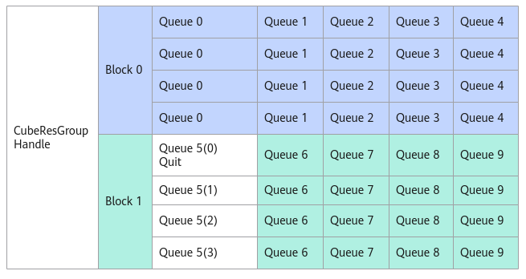

# SetQuit<a name="ZH-CN_TOPIC_0000001996865757"></a>

## 产品支持情况<a name="section1550532418810"></a>

<a name="zh-cn_topic_0000001965821852_table38301303189"></a>
<table><thead align="left"><tr id="zh-cn_topic_0000001965821852_row20831180131817"><th class="cellrowborder" valign="top" width="57.95%" id="mcps1.1.3.1.1"><p id="zh-cn_topic_0000001965821852_p1883113061818"><a name="zh-cn_topic_0000001965821852_p1883113061818"></a><a name="zh-cn_topic_0000001965821852_p1883113061818"></a><span id="zh-cn_topic_0000001965821852_ph20833205312295"><a name="zh-cn_topic_0000001965821852_ph20833205312295"></a><a name="zh-cn_topic_0000001965821852_ph20833205312295"></a>产品</span></p>
</th>
<th class="cellrowborder" align="center" valign="top" width="42.05%" id="mcps1.1.3.1.2"><p id="zh-cn_topic_0000001965821852_p783113012187"><a name="zh-cn_topic_0000001965821852_p783113012187"></a><a name="zh-cn_topic_0000001965821852_p783113012187"></a>是否支持</p>
</th>
</tr>
</thead>
<tbody><tr id="zh-cn_topic_0000001965821852_row1272474920205"><td class="cellrowborder" valign="top" width="57.95%" headers="mcps1.1.3.1.1 "><p id="zh-cn_topic_0000001965821852_p12300735171314"><a name="zh-cn_topic_0000001965821852_p12300735171314"></a><a name="zh-cn_topic_0000001965821852_p12300735171314"></a><span id="zh-cn_topic_0000001965821852_ph730011352138"><a name="zh-cn_topic_0000001965821852_ph730011352138"></a><a name="zh-cn_topic_0000001965821852_ph730011352138"></a>Ascend 950PR/Ascend 950DT</span></p>
</td>
<td class="cellrowborder" align="center" valign="top" width="42.05%" headers="mcps1.1.3.1.2 "><p id="zh-cn_topic_0000001965821852_p37256491200"><a name="zh-cn_topic_0000001965821852_p37256491200"></a><a name="zh-cn_topic_0000001965821852_p37256491200"></a>√</p>
</td>
</tr>
<tr id="zh-cn_topic_0000001965821852_row220181016240"><td class="cellrowborder" valign="top" width="57.95%" headers="mcps1.1.3.1.1 "><p id="zh-cn_topic_0000001965821852_p48327011813"><a name="zh-cn_topic_0000001965821852_p48327011813"></a><a name="zh-cn_topic_0000001965821852_p48327011813"></a><span id="zh-cn_topic_0000001965821852_ph583230201815"><a name="zh-cn_topic_0000001965821852_ph583230201815"></a><a name="zh-cn_topic_0000001965821852_ph583230201815"></a><term id="zh-cn_topic_0000001965821852_zh-cn_topic_0000001312391781_term1253731311225"><a name="zh-cn_topic_0000001965821852_zh-cn_topic_0000001312391781_term1253731311225"></a><a name="zh-cn_topic_0000001965821852_zh-cn_topic_0000001312391781_term1253731311225"></a>Atlas A3 训练系列产品</term>/<term id="zh-cn_topic_0000001965821852_zh-cn_topic_0000001312391781_term131434243115"><a name="zh-cn_topic_0000001965821852_zh-cn_topic_0000001312391781_term131434243115"></a><a name="zh-cn_topic_0000001965821852_zh-cn_topic_0000001312391781_term131434243115"></a>Atlas A3 推理系列产品</term></span></p>
</td>
<td class="cellrowborder" align="center" valign="top" width="42.05%" headers="mcps1.1.3.1.2 "><p id="zh-cn_topic_0000001965821852_p7948163910184"><a name="zh-cn_topic_0000001965821852_p7948163910184"></a><a name="zh-cn_topic_0000001965821852_p7948163910184"></a>x</p>
</td>
</tr>
<tr id="zh-cn_topic_0000001965821852_row173226882415"><td class="cellrowborder" valign="top" width="57.95%" headers="mcps1.1.3.1.1 "><p id="zh-cn_topic_0000001965821852_p14832120181815"><a name="zh-cn_topic_0000001965821852_p14832120181815"></a><a name="zh-cn_topic_0000001965821852_p14832120181815"></a><span id="zh-cn_topic_0000001965821852_ph1483216010188"><a name="zh-cn_topic_0000001965821852_ph1483216010188"></a><a name="zh-cn_topic_0000001965821852_ph1483216010188"></a><term id="zh-cn_topic_0000001965821852_zh-cn_topic_0000001312391781_term11962195213215"><a name="zh-cn_topic_0000001965821852_zh-cn_topic_0000001312391781_term11962195213215"></a><a name="zh-cn_topic_0000001965821852_zh-cn_topic_0000001312391781_term11962195213215"></a>Atlas A2 训练系列产品</term>/<term id="zh-cn_topic_0000001965821852_zh-cn_topic_0000001312391781_term184716139811"><a name="zh-cn_topic_0000001965821852_zh-cn_topic_0000001312391781_term184716139811"></a><a name="zh-cn_topic_0000001965821852_zh-cn_topic_0000001312391781_term184716139811"></a>Atlas A2 推理系列产品</term></span></p>
</td>
<td class="cellrowborder" align="center" valign="top" width="42.05%" headers="mcps1.1.3.1.2 "><p id="zh-cn_topic_0000001965821852_p19948143911820"><a name="zh-cn_topic_0000001965821852_p19948143911820"></a><a name="zh-cn_topic_0000001965821852_p19948143911820"></a>√</p>
</td>
</tr>
</tbody>
</table>

## 功能说明<a name="zh-cn_topic_0000001526206862_section212607105720"></a>

通过AllocMessage接口获取到消息空间地址后，发送退出消息，告知该消息队列对应的AIC无需处理该队列的消息。如下图，Queue5对应的AIV发了退出消息后，Block1将不再处理Queue5的任何消息。

**图 1**  消息队列退出示意图<a name="fig915491163918"></a>  


## 函数原型<a name="section765814724715"></a>

```
__aicore__ inline void SetQuit(__gm__ CubeMsgType* msg)
```

## 参数说明<a name="zh-cn_topic_0000001526206862_section129451113125413"></a>

**表 1**  接口参数说明

<a name="zh-cn_topic_0000001526206862_zh-cn_topic_0000001389783361_table111938719446"></a>
<table><thead align="left"><tr id="zh-cn_topic_0000001526206862_zh-cn_topic_0000001389783361_row6223476444"><th class="cellrowborder" valign="top" width="9.09%" id="mcps1.2.4.1.1"><p id="zh-cn_topic_0000001526206862_zh-cn_topic_0000001389783361_p10223674448"><a name="zh-cn_topic_0000001526206862_zh-cn_topic_0000001389783361_p10223674448"></a><a name="zh-cn_topic_0000001526206862_zh-cn_topic_0000001389783361_p10223674448"></a>参数</p>
</th>
<th class="cellrowborder" valign="top" width="9.01%" id="mcps1.2.4.1.2"><p id="zh-cn_topic_0000001526206862_zh-cn_topic_0000001389783361_p645511218169"><a name="zh-cn_topic_0000001526206862_zh-cn_topic_0000001389783361_p645511218169"></a><a name="zh-cn_topic_0000001526206862_zh-cn_topic_0000001389783361_p645511218169"></a>输入/输出</p>
</th>
<th class="cellrowborder" valign="top" width="81.89999999999999%" id="mcps1.2.4.1.3"><p id="zh-cn_topic_0000001526206862_zh-cn_topic_0000001389783361_p1922337124411"><a name="zh-cn_topic_0000001526206862_zh-cn_topic_0000001389783361_p1922337124411"></a><a name="zh-cn_topic_0000001526206862_zh-cn_topic_0000001389783361_p1922337124411"></a>说明</p>
</th>
</tr>
</thead>
<tbody><tr id="zh-cn_topic_0000001526206862_zh-cn_topic_0000001389783361_row152234713443"><td class="cellrowborder" valign="top" width="9.09%" headers="mcps1.2.4.1.1 "><p id="p153103773911"><a name="p153103773911"></a><a name="p153103773911"></a>msg</p>
</td>
<td class="cellrowborder" valign="top" width="9.01%" headers="mcps1.2.4.1.2 "><p id="p1831010712394"><a name="p1831010712394"></a><a name="p1831010712394"></a>输入</p>
</td>
<td class="cellrowborder" valign="top" width="81.89999999999999%" headers="mcps1.2.4.1.3 "><p id="p203101270393"><a name="p203101270393"></a><a name="p203101270393"></a>该CubeResGroupHandle中的消息空间地址。</p>
</td>
</tr>
</tbody>
</table>

## 返回值说明<a name="section640mcpsimp"></a>

无。

## 约束说明<a name="zh-cn_topic_0000001526206862_section65498832"></a>

无

## 调用示例<a name="zh-cn_topic_0000001526206862_section97001499599"></a>

```
handle.AssignQueue(queIdx);  
auto msgPtr = a.AllocMessage();        // 获取消息空间指针msgPtr
handle.SetQuit(msgPtr);              // 发送退出消息
```

