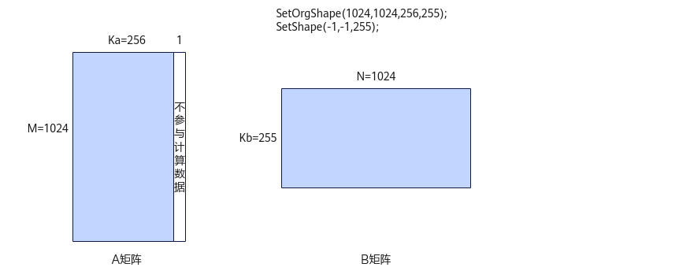

# SetShape<a name="ZH-CN_TOPIC_0000001624913513"></a>

## 功能说明<a name="section618mcpsimp"></a>

设置Matmul计算的形状m、n、k，该形状可以为原始完整矩阵或其局部矩阵，单位为元素。该形状的矩阵乘可以由单核或多核计算完成。

使用本接口时，有两种参数传入方式：

-   传入Matmul计算的形状m、n、k，调用[GetTiling](GetTiling.md)接口时，按照m、n、k计算并返回Tiling参数。
-   m、n、k中任意一个或多个参数位置传入-1，调用[GetTiling](GetTiling.md)接口时，该位置取[SetOrgShape](SetOrgShape-32.md)接口中设置的原始形状M、N、K或Ka/Kb，然后由接口内部计算最优Tiling参数。如下图所示，原始A矩阵的K方向最后一列为不参与计算的脏数据，在[SetOrgShape](SetOrgShape-32.md)接口中设置包含该列数据的原始形状，在本接口中设置Matmul计算的K方向大小，同时参数m、n设置为-1表示按照原始形状M、N计算Tiling。

**图 1**  参数传入-1的场景示意图<a name="fig10993133118309"></a>  


## 函数原型<a name="section620mcpsimp"></a>

```
int32_t SetShape(int32_t m, int32_t n, int32_t k)
```

## 参数说明<a name="section622mcpsimp"></a>

**表 1**  参数说明

<a name="table9646134355611"></a>
<table><thead align="left"><tr id="row964714433565"><th class="cellrowborder" valign="top" width="14.99%" id="mcps1.2.4.1.1"><p id="zh-cn_topic_0235751031_p20917673"><a name="zh-cn_topic_0235751031_p20917673"></a><a name="zh-cn_topic_0235751031_p20917673"></a>参数名</p>
</th>
<th class="cellrowborder" valign="top" width="12.02%" id="mcps1.2.4.1.2"><p id="zh-cn_topic_0235751031_p16609919"><a name="zh-cn_topic_0235751031_p16609919"></a><a name="zh-cn_topic_0235751031_p16609919"></a>输入/输出</p>
</th>
<th class="cellrowborder" valign="top" width="72.99%" id="mcps1.2.4.1.3"><p id="zh-cn_topic_0235751031_p59995477"><a name="zh-cn_topic_0235751031_p59995477"></a><a name="zh-cn_topic_0235751031_p59995477"></a>描述</p>
</th>
</tr>
</thead>
<tbody><tr id="row106481443135617"><td class="cellrowborder" valign="top" width="14.99%" headers="mcps1.2.4.1.1 "><p id="p13101125318816"><a name="p13101125318816"></a><a name="p13101125318816"></a>m</p>
</td>
<td class="cellrowborder" valign="top" width="12.02%" headers="mcps1.2.4.1.2 "><p id="p7101195316815"><a name="p7101195316815"></a><a name="p7101195316815"></a>输入</p>
</td>
<td class="cellrowborder" valign="top" width="72.99%" headers="mcps1.2.4.1.3 "><p id="p210118531786"><a name="p210118531786"></a><a name="p210118531786"></a>设置Matmul计算的M方向大小，单位为元素。</p>
</td>
</tr>
<tr id="row36481043185619"><td class="cellrowborder" valign="top" width="14.99%" headers="mcps1.2.4.1.1 "><p id="p1510114531681"><a name="p1510114531681"></a><a name="p1510114531681"></a>n</p>
</td>
<td class="cellrowborder" valign="top" width="12.02%" headers="mcps1.2.4.1.2 "><p id="p9101145313811"><a name="p9101145313811"></a><a name="p9101145313811"></a>输入</p>
</td>
<td class="cellrowborder" valign="top" width="72.99%" headers="mcps1.2.4.1.3 "><p id="p1510219534819"><a name="p1510219534819"></a><a name="p1510219534819"></a>设置Matmul计算的N方向大小，单位为元素。</p>
</td>
</tr>
<tr id="row16491543185617"><td class="cellrowborder" valign="top" width="14.99%" headers="mcps1.2.4.1.1 "><p id="p121021353385"><a name="p121021353385"></a><a name="p121021353385"></a>k</p>
</td>
<td class="cellrowborder" valign="top" width="12.02%" headers="mcps1.2.4.1.2 "><p id="p121028531183"><a name="p121028531183"></a><a name="p121028531183"></a>输入</p>
</td>
<td class="cellrowborder" valign="top" width="72.99%" headers="mcps1.2.4.1.3 "><p id="p610210531811"><a name="p610210531811"></a><a name="p610210531811"></a>设置Matmul计算的K方向大小，单位为元素。</p>
</td>
</tr>
</tbody>
</table>

## 返回值说明<a name="section640mcpsimp"></a>

-1表示设置失败；0表示设置成功。

## 约束说明<a name="section633mcpsimp"></a>

无

## 调用示例<a name="section1665082013318"></a>

```
auto ascendcPlatform = platform_ascendc::PlatformAscendC(context->GetPlatformInfo());
matmul_tiling::MatmulApiTiling tiling(ascendcPlatform); 
tiling.SetAType(matmul_tiling::TPosition::GM, matmul_tiling::CubeFormat::ND, matmul_tiling::DataType::DT_FLOAT16); 
tiling.SetBType(matmul_tiling::TPosition::GM, matmul_tiling::CubeFormat::ND, matmul_tiling::DataType::DT_FLOAT16);  
tiling.SetCType(matmul_tiling::TPosition::GM, matmul_tiling::CubeFormat::ND, matmul_tiling::DataType::DT_FLOAT);
tiling.SetBiasType(matmul_tiling::TPosition::GM, matmul_tiling::CubeFormat::ND, matmul_tiling::DataType::DT_FLOAT);   
tiling.SetShape(1024, 1024, 1024);  // 设置Matmul计算的形状
tiling.SetOrgShape(1024, 1024, 1024);   
tiling.SetBias(true);   
tiling.SetBufferSpace(-1, -1, -1);
optiling::TCubeTiling tilingData;   
int ret = tiling.GetTiling(tilingData);
```

