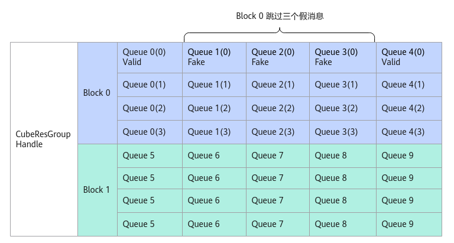

# SetSkipMsg<a name="ZH-CN_TOPIC_0000001960384808"></a>

## 产品支持情况<a name="section1550532418810"></a>

<a name="zh-cn_topic_0000001965821852_table38301303189"></a>
<table><thead align="left"><tr id="zh-cn_topic_0000001965821852_row20831180131817"><th class="cellrowborder" valign="top" width="57.95%" id="mcps1.1.3.1.1"><p id="zh-cn_topic_0000001965821852_p1883113061818"><a name="zh-cn_topic_0000001965821852_p1883113061818"></a><a name="zh-cn_topic_0000001965821852_p1883113061818"></a><span id="zh-cn_topic_0000001965821852_ph20833205312295"><a name="zh-cn_topic_0000001965821852_ph20833205312295"></a><a name="zh-cn_topic_0000001965821852_ph20833205312295"></a>产品</span></p>
</th>
<th class="cellrowborder" align="center" valign="top" width="42.05%" id="mcps1.1.3.1.2"><p id="zh-cn_topic_0000001965821852_p783113012187"><a name="zh-cn_topic_0000001965821852_p783113012187"></a><a name="zh-cn_topic_0000001965821852_p783113012187"></a>是否支持</p>
</th>
</tr>
</thead>
<tbody><tr id="zh-cn_topic_0000001965821852_row220181016240"><td class="cellrowborder" valign="top" width="57.95%" headers="mcps1.1.3.1.1 "><p id="zh-cn_topic_0000001965821852_p48327011813"><a name="zh-cn_topic_0000001965821852_p48327011813"></a><a name="zh-cn_topic_0000001965821852_p48327011813"></a><span id="zh-cn_topic_0000001965821852_ph583230201815"><a name="zh-cn_topic_0000001965821852_ph583230201815"></a><a name="zh-cn_topic_0000001965821852_ph583230201815"></a><term id="zh-cn_topic_0000001965821852_zh-cn_topic_0000001312391781_term1253731311225"><a name="zh-cn_topic_0000001965821852_zh-cn_topic_0000001312391781_term1253731311225"></a><a name="zh-cn_topic_0000001965821852_zh-cn_topic_0000001312391781_term1253731311225"></a>Atlas A3 训练系列产品</term>/<term id="zh-cn_topic_0000001965821852_zh-cn_topic_0000001312391781_term131434243115"><a name="zh-cn_topic_0000001965821852_zh-cn_topic_0000001312391781_term131434243115"></a><a name="zh-cn_topic_0000001965821852_zh-cn_topic_0000001312391781_term131434243115"></a>Atlas A3 推理系列产品</term></span></p>
</td>
<td class="cellrowborder" align="center" valign="top" width="42.05%" headers="mcps1.1.3.1.2 "><p id="zh-cn_topic_0000001965821852_p7948163910184"><a name="zh-cn_topic_0000001965821852_p7948163910184"></a><a name="zh-cn_topic_0000001965821852_p7948163910184"></a>x</p>
</td>
</tr>
<tr id="zh-cn_topic_0000001965821852_row173226882415"><td class="cellrowborder" valign="top" width="57.95%" headers="mcps1.1.3.1.1 "><p id="zh-cn_topic_0000001965821852_p14832120181815"><a name="zh-cn_topic_0000001965821852_p14832120181815"></a><a name="zh-cn_topic_0000001965821852_p14832120181815"></a><span id="zh-cn_topic_0000001965821852_ph1483216010188"><a name="zh-cn_topic_0000001965821852_ph1483216010188"></a><a name="zh-cn_topic_0000001965821852_ph1483216010188"></a><term id="zh-cn_topic_0000001965821852_zh-cn_topic_0000001312391781_term11962195213215"><a name="zh-cn_topic_0000001965821852_zh-cn_topic_0000001312391781_term11962195213215"></a><a name="zh-cn_topic_0000001965821852_zh-cn_topic_0000001312391781_term11962195213215"></a>Atlas A2 训练系列产品</term>/<term id="zh-cn_topic_0000001965821852_zh-cn_topic_0000001312391781_term184716139811"><a name="zh-cn_topic_0000001965821852_zh-cn_topic_0000001312391781_term184716139811"></a><a name="zh-cn_topic_0000001965821852_zh-cn_topic_0000001312391781_term184716139811"></a>Atlas A2 推理系列产品</term></span></p>
</td>
<td class="cellrowborder" align="center" valign="top" width="42.05%" headers="mcps1.1.3.1.2 "><p id="zh-cn_topic_0000001965821852_p19948143911820"><a name="zh-cn_topic_0000001965821852_p19948143911820"></a><a name="zh-cn_topic_0000001965821852_p19948143911820"></a>√</p>
</td>
</tr>
</tbody>
</table>

## 功能说明<a name="zh-cn_topic_0000001526206862_section212607105720"></a>

AIC跳过指定个数假消息的处理，仅在回调函数中调用。下图中Block0通过调用SetSkipMsg跳过三个假消息。

**图 1**  SetSkipMsg示意图<a name="fig1732521102711"></a>  


## 函数原型<a name="section765814724715"></a>

```
 __aicore__ inline void SetSkipMsg(uint8_t skipCnt)
```

## 参数说明<a name="zh-cn_topic_0000001526206862_section129451113125413"></a>

**表 1**  接口参数说明

<a name="zh-cn_topic_0000001526206862_zh-cn_topic_0000001389783361_table111938719446"></a>
<table><thead align="left"><tr id="zh-cn_topic_0000001526206862_zh-cn_topic_0000001389783361_row6223476444"><th class="cellrowborder" valign="top" width="9.09%" id="mcps1.2.4.1.1"><p id="zh-cn_topic_0000001526206862_zh-cn_topic_0000001389783361_p10223674448"><a name="zh-cn_topic_0000001526206862_zh-cn_topic_0000001389783361_p10223674448"></a><a name="zh-cn_topic_0000001526206862_zh-cn_topic_0000001389783361_p10223674448"></a>参数</p>
</th>
<th class="cellrowborder" valign="top" width="7.93%" id="mcps1.2.4.1.2"><p id="zh-cn_topic_0000001526206862_zh-cn_topic_0000001389783361_p645511218169"><a name="zh-cn_topic_0000001526206862_zh-cn_topic_0000001389783361_p645511218169"></a><a name="zh-cn_topic_0000001526206862_zh-cn_topic_0000001389783361_p645511218169"></a>输入/输出</p>
</th>
<th class="cellrowborder" valign="top" width="82.98%" id="mcps1.2.4.1.3"><p id="zh-cn_topic_0000001526206862_zh-cn_topic_0000001389783361_p1922337124411"><a name="zh-cn_topic_0000001526206862_zh-cn_topic_0000001389783361_p1922337124411"></a><a name="zh-cn_topic_0000001526206862_zh-cn_topic_0000001389783361_p1922337124411"></a>说明</p>
</th>
</tr>
</thead>
<tbody><tr id="zh-cn_topic_0000001526206862_zh-cn_topic_0000001389783361_row152234713443"><td class="cellrowborder" valign="top" width="9.09%" headers="mcps1.2.4.1.1 "><p id="p0731542025"><a name="p0731542025"></a><a name="p0731542025"></a>skipCnt</p>
</td>
<td class="cellrowborder" valign="top" width="7.93%" headers="mcps1.2.4.1.2 "><p id="p10731044217"><a name="p10731044217"></a><a name="p10731044217"></a>输入</p>
</td>
<td class="cellrowborder" valign="top" width="82.98%" headers="mcps1.2.4.1.3 "><p id="p373442029"><a name="p373442029"></a><a name="p373442029"></a>AIC需要跳过的消息数。</p>
</td>
</tr>
</tbody>
</table>

## 返回值说明<a name="section640mcpsimp"></a>

无。

## 约束说明<a name="zh-cn_topic_0000001526206862_section65498832"></a>

该任务的消息空间后skipCnt个消息队列需要发送FAKE消息。

## 调用示例<a name="zh-cn_topic_0000001526206862_section97001499599"></a>

```
 __aicore__ inline static void Call(
    MatmulApiCfg &mm, __gm__ CubeMsgBody *rcvMsg, CubeResGroupHandle<CubeMsgBody> &handle)
{
    //  AIC上计算逻辑，用户自行实现
    auto skipNum = 3;//(rcvMsg->head).skipCnt，假消息个数可由用户在回调计算结构体中定义，也可以通过自定义消息结构体传递。
    auto tmpId = handle.FreeMessage(rcvMsg, AscendC::CubeMsgState::VALID);    // 当前消息处理完，调用FreeMessage，代表rcvMsg已处理完
    for (int i = 1; i < skipNum + 1; i++) {  
         // 由于后续发了三个假消息，也需要调用FreeMessage，代表假消息处理完毕。                              
         auto tmpId = handle.FreeMessage(rcvMsg + i, AscendC::CubeMsgState::FAKE);
    }
    // 当假消息存在，需要调用SetSkipMsg，通知Cube核不去处理后面三个假消息。
    handle.SetSkipMsg(skipNum);
};
```

