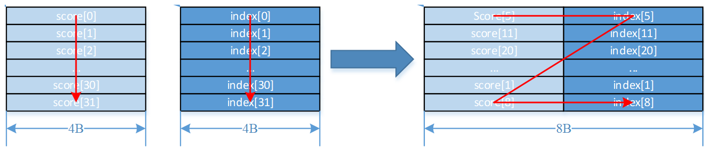

# Sort<a name="ZH-CN_TOPIC_0000001691898680"></a>

## 产品支持情况<a name="section1586581915393"></a>

<a name="table169596713360"></a>
<table><thead align="left"><tr id="row129590715369"><th class="cellrowborder" valign="top" width="57.99999999999999%" id="mcps1.1.3.1.1"><p id="p17959971362"><a name="p17959971362"></a><a name="p17959971362"></a><span id="ph895914718367"><a name="ph895914718367"></a><a name="ph895914718367"></a>产品</span></p>
</th>
<th class="cellrowborder" align="center" valign="top" width="42%" id="mcps1.1.3.1.2"><p id="p89594763612"><a name="p89594763612"></a><a name="p89594763612"></a>是否支持</p>
</th>
</tr>
</thead>
<tbody><tr id="row18959157103612"><td class="cellrowborder" valign="top" width="57.99999999999999%" headers="mcps1.1.3.1.1 "><p id="p13959117193618"><a name="p13959117193618"></a><a name="p13959117193618"></a><span id="ph9959117173614"><a name="ph9959117173614"></a><a name="ph9959117173614"></a><term id="zh-cn_topic_0000001312391781_term1253731311225"><a name="zh-cn_topic_0000001312391781_term1253731311225"></a><a name="zh-cn_topic_0000001312391781_term1253731311225"></a>Atlas A3 训练系列产品</term>/<term id="zh-cn_topic_0000001312391781_term131434243115"><a name="zh-cn_topic_0000001312391781_term131434243115"></a><a name="zh-cn_topic_0000001312391781_term131434243115"></a>Atlas A3 推理系列产品</term></span></p>
</td>
<td class="cellrowborder" align="center" valign="top" width="42%" headers="mcps1.1.3.1.2 "><p id="p1095914793613"><a name="p1095914793613"></a><a name="p1095914793613"></a>√</p>
</td>
</tr>
<tr id="row89591478362"><td class="cellrowborder" valign="top" width="57.99999999999999%" headers="mcps1.1.3.1.1 "><p id="p7959157163619"><a name="p7959157163619"></a><a name="p7959157163619"></a><span id="ph1995997193619"><a name="ph1995997193619"></a><a name="ph1995997193619"></a><term id="zh-cn_topic_0000001312391781_term11962195213215"><a name="zh-cn_topic_0000001312391781_term11962195213215"></a><a name="zh-cn_topic_0000001312391781_term11962195213215"></a>Atlas A2 训练系列产品</term>/<term id="zh-cn_topic_0000001312391781_term184716139811"><a name="zh-cn_topic_0000001312391781_term184716139811"></a><a name="zh-cn_topic_0000001312391781_term184716139811"></a>Atlas A2 推理系列产品</term></span></p>
</td>
<td class="cellrowborder" align="center" valign="top" width="42%" headers="mcps1.1.3.1.2 "><p id="p149598793615"><a name="p149598793615"></a><a name="p149598793615"></a>√</p>
</td>
</tr>
<tr id="row2064043572015"><td class="cellrowborder" valign="top" width="57.99999999999999%" headers="mcps1.1.3.1.1 "><p id="p171071651104613"><a name="p171071651104613"></a><a name="p171071651104613"></a><span id="ph1181723016471"><a name="ph1181723016471"></a><a name="ph1181723016471"></a>Kirin X90</span></p>
</td>
<td class="cellrowborder" align="center" valign="top" width="42%" headers="mcps1.1.3.1.2 "><p id="p141071451154617"><a name="p141071451154617"></a><a name="p141071451154617"></a>√</p>
</td>
</tr>
<tr id="row167601735152013"><td class="cellrowborder" valign="top" width="57.99999999999999%" headers="mcps1.1.3.1.1 "><p id="p18587175114614"><a name="p18587175114614"></a><a name="p18587175114614"></a><span id="ph5776533104711"><a name="ph5776533104711"></a><a name="ph5776533104711"></a>Kirin 9030</span></p>
</td>
<td class="cellrowborder" align="center" valign="top" width="42%" headers="mcps1.1.3.1.2 "><p id="p2058745154620"><a name="p2058745154620"></a><a name="p2058745154620"></a>√</p>
</td>
</tr>
</tbody>
</table>

## 功能说明<a name="section618mcpsimp"></a>

排序函数，按照数值大小进行降序排序。排序后的数据按照如下排布方式进行保存：

Atlas A3 训练系列产品/Atlas A3 推理系列产品采用方式一。

Atlas A2 训练系列产品/Atlas A2 推理系列产品采用方式一。

Kirin X90采用方式一。

Kirin 9030采用方式一。

Kirin X90采用方式一。

Kirin 9030采用方式一。

-   排布方式一：

    一次迭代可以完成32个数的排序，排序好的score与其对应的index一起以（score, index）的结构存储在dst中。不论score为half还是float类型，dst中的（score, index）结构总是占据8Bytes空间。如下所示：

    -   当score为float，index为uint32类型时，计算结果中index存储在高4Bytes，score存储在低4Bytes。

        

    -   当score为half，index为uint32类型时，计算结果中index存储在高4Bytes，score存储在低2Bytes， 中间的2Bytes保留。

        

-   排布方式二：Region Proposal排布

    输入输出数据均为Region Proposal，一次迭代可以完成16个region proposal的排序。每个Region Proposal占用连续8个half/float类型的元素，约定其格式：

    ```
    [x1, y1, x2, y2, score, label, reserved_0, reserved_1]
    ```

    对于数据类型half，每一个Region Proposal占16Bytes，Byte\[15:12\]是无效数据，Byte\[11:0\]包含6个half类型的元素，其中Byte\[11:10\]定义为label，Byte\[9:8\]定义为score，Byte\[7:6\]定义为y2，Byte\[5:4\]定义为x2，Byte\[3:2\]定义为y1，Byte\[1:0\]定义为x1。

    如下图所示，总共包含16个Region Proposals。

    

    对于数据类型float，每一个Region Proposal占32Bytes，Byte\[31:24\]是无效数据，Byte\[23:0\]包含6个float类型的元素，其中Byte\[23:20\]定义为label，Byte\[19:16\]定义为score，Byte\[15:12\]定义为y2，Byte\[11:8\]定义为x2，Byte\[7:4\]定义为y1，Byte\[3:0\]定义为x1。

    如下图所示，总共包含16个Region Proposals。

    

## 函数原型<a name="section620mcpsimp"></a>

```
template <typename T, bool isFullSort>
__aicore__ inline void Sort(const LocalTensor<T>& dst, const LocalTensor<T>& concat, const LocalTensor<uint32_t>& index, LocalTensor<T>& tmp, const int32_t repeatTime)
```

## 参数说明<a name="section622mcpsimp"></a>

**表 1**  模板参数说明

<a name="table729818506422"></a>
<table><thead align="left"><tr id="row11299950204217"><th class="cellrowborder" valign="top" width="19.18%" id="mcps1.2.3.1.1"><p id="p1029955044218"><a name="p1029955044218"></a><a name="p1029955044218"></a>参数名</p>
</th>
<th class="cellrowborder" valign="top" width="80.82000000000001%" id="mcps1.2.3.1.2"><p id="p1629911506421"><a name="p1629911506421"></a><a name="p1629911506421"></a>含义</p>
</th>
</tr>
</thead>
<tbody><tr id="row12299165018421"><td class="cellrowborder" valign="top" width="19.18%" headers="mcps1.2.3.1.1 "><p id="p1329915004219"><a name="p1329915004219"></a><a name="p1329915004219"></a>T</p>
</td>
<td class="cellrowborder" valign="top" width="80.82000000000001%" headers="mcps1.2.3.1.2 "><p id="p8299155010420"><a name="p8299155010420"></a><a name="p8299155010420"></a>操作数的数据类型。</p>
<p id="p120314548496"><a name="p120314548496"></a><a name="p120314548496"></a><span id="ph10203145494919"><a name="ph10203145494919"></a><a name="ph10203145494919"></a><term id="zh-cn_topic_0000001312391781_term1253731311225_2"><a name="zh-cn_topic_0000001312391781_term1253731311225_2"></a><a name="zh-cn_topic_0000001312391781_term1253731311225_2"></a>Atlas A3 训练系列产品</term>/<term id="zh-cn_topic_0000001312391781_term131434243115_2"><a name="zh-cn_topic_0000001312391781_term131434243115_2"></a><a name="zh-cn_topic_0000001312391781_term131434243115_2"></a>Atlas A3 推理系列产品</term></span>，支持的数据类型为：half、float。</p>
<p id="p7265124521915"><a name="p7265124521915"></a><a name="p7265124521915"></a><span id="ph4684166535"><a name="ph4684166535"></a><a name="ph4684166535"></a><term id="zh-cn_topic_0000001312391781_term11962195213215_2"><a name="zh-cn_topic_0000001312391781_term11962195213215_2"></a><a name="zh-cn_topic_0000001312391781_term11962195213215_2"></a>Atlas A2 训练系列产品</term>/<term id="zh-cn_topic_0000001312391781_term184716139811_2"><a name="zh-cn_topic_0000001312391781_term184716139811_2"></a><a name="zh-cn_topic_0000001312391781_term184716139811_2"></a>Atlas A2 推理系列产品</term></span>，支持的数据类型为：half、float。</p>
<p id="p184962505471"><a name="p184962505471"></a><a name="p184962505471"></a><span id="ph9713141120484"><a name="ph9713141120484"></a><a name="ph9713141120484"></a>Kirin X90</span>，支持的数据类型为：half。</p>
<p id="p8588195884716"><a name="p8588195884716"></a><a name="p8588195884716"></a><span id="ph1601215144817"><a name="ph1601215144817"></a><a name="ph1601215144817"></a>Kirin 9030</span>，支持的数据类型为：half。</p>
</td>
</tr>
<tr id="row1623812985111"><td class="cellrowborder" valign="top" width="19.18%" headers="mcps1.2.3.1.1 "><p id="p152385297515"><a name="p152385297515"></a><a name="p152385297515"></a>isFullSort</p>
</td>
<td class="cellrowborder" valign="top" width="80.82000000000001%" headers="mcps1.2.3.1.2 "><p id="p5238529195117"><a name="p5238529195117"></a><a name="p5238529195117"></a>是否开启全排序模式。全排序模式指将全部输入降序排序，非全排序模式下，排序方式请参考<a href="#table62161631132810">表2</a>中的repeatTime说明。</p>
</td>
</tr>
</tbody>
</table>

**表 2**  参数说明

<a name="table62161631132810"></a>
<table><thead align="left"><tr id="row12216103118284"><th class="cellrowborder" valign="top" width="13.661366136613662%" id="mcps1.2.4.1.1"><p id="p1421643114288"><a name="p1421643114288"></a><a name="p1421643114288"></a>参数名称</p>
</th>
<th class="cellrowborder" valign="top" width="12.591259125912593%" id="mcps1.2.4.1.2"><p id="p82165310285"><a name="p82165310285"></a><a name="p82165310285"></a>输入/输出</p>
</th>
<th class="cellrowborder" valign="top" width="73.74737473747375%" id="mcps1.2.4.1.3"><p id="p1121663111288"><a name="p1121663111288"></a><a name="p1121663111288"></a>含义</p>
</th>
</tr>
</thead>
<tbody><tr id="row82161131182810"><td class="cellrowborder" valign="top" width="13.661366136613662%" headers="mcps1.2.4.1.1 "><p id="p62165318282"><a name="p62165318282"></a><a name="p62165318282"></a>dst</p>
</td>
<td class="cellrowborder" valign="top" width="12.591259125912593%" headers="mcps1.2.4.1.2 "><p id="p102161931162814"><a name="p102161931162814"></a><a name="p102161931162814"></a>输出</p>
</td>
<td class="cellrowborder" valign="top" width="73.74737473747375%" headers="mcps1.2.4.1.3 "><p id="p3944122817141"><a name="p3944122817141"></a><a name="p3944122817141"></a>目的操作数，shape为[2n]。</p>
<p id="p16703131355116"><a name="p16703131355116"></a><a name="p16703131355116"></a><span id="zh-cn_topic_0000001530181537_ph173308471594"><a name="zh-cn_topic_0000001530181537_ph173308471594"></a><a name="zh-cn_topic_0000001530181537_ph173308471594"></a><span id="zh-cn_topic_0000001530181537_ph9902231466"><a name="zh-cn_topic_0000001530181537_ph9902231466"></a><a name="zh-cn_topic_0000001530181537_ph9902231466"></a><span id="zh-cn_topic_0000001530181537_ph1782115034816"><a name="zh-cn_topic_0000001530181537_ph1782115034816"></a><a name="zh-cn_topic_0000001530181537_ph1782115034816"></a>类型为<a href="LocalTensor.md">LocalTensor</a>，支持的TPosition为VECIN/VECCALC/VECOUT。</span></span></span></p>
<p id="p7198164815418"><a name="p7198164815418"></a><a name="p7198164815418"></a><span id="ph1119894813419"><a name="ph1119894813419"></a><a name="ph1119894813419"></a>LocalTensor的起始地址需要32字节对齐。</span></p>
</td>
</tr>
<tr id="row5216163192815"><td class="cellrowborder" valign="top" width="13.661366136613662%" headers="mcps1.2.4.1.1 "><p id="p13216193192813"><a name="p13216193192813"></a><a name="p13216193192813"></a>concat</p>
</td>
<td class="cellrowborder" valign="top" width="12.591259125912593%" headers="mcps1.2.4.1.2 "><p id="p7217031182818"><a name="p7217031182818"></a><a name="p7217031182818"></a>输入</p>
</td>
<td class="cellrowborder" valign="top" width="73.74737473747375%" headers="mcps1.2.4.1.3 "><p id="p185486379149"><a name="p185486379149"></a><a name="p185486379149"></a>源操作数，即接口功能说明中的score，shape为[n]。</p>
<p id="p5449124113142"><a name="p5449124113142"></a><a name="p5449124113142"></a><span id="zh-cn_topic_0000001530181537_ph173308471594_1"><a name="zh-cn_topic_0000001530181537_ph173308471594_1"></a><a name="zh-cn_topic_0000001530181537_ph173308471594_1"></a><span id="zh-cn_topic_0000001530181537_ph9902231466_1"><a name="zh-cn_topic_0000001530181537_ph9902231466_1"></a><a name="zh-cn_topic_0000001530181537_ph9902231466_1"></a><span id="zh-cn_topic_0000001530181537_ph1782115034816_1"><a name="zh-cn_topic_0000001530181537_ph1782115034816_1"></a><a name="zh-cn_topic_0000001530181537_ph1782115034816_1"></a>类型为<a href="LocalTensor.md">LocalTensor</a>，支持的TPosition为VECIN/VECCALC/VECOUT。</span></span></span></p>
<p id="p3123599392"><a name="p3123599392"></a><a name="p3123599392"></a><span id="ph71345919395"><a name="ph71345919395"></a><a name="ph71345919395"></a>LocalTensor的起始地址需要32字节对齐。</span></p>
<p id="p1521763119281"><a name="p1521763119281"></a><a name="p1521763119281"></a>此源操作数的数据类型需要与目的操作数保持一致。</p>
</td>
</tr>
<tr id="row88875522820"><td class="cellrowborder" valign="top" width="13.661366136613662%" headers="mcps1.2.4.1.1 "><p id="p141252118106"><a name="p141252118106"></a><a name="p141252118106"></a>index</p>
</td>
<td class="cellrowborder" valign="top" width="12.591259125912593%" headers="mcps1.2.4.1.2 "><p id="p105185518102"><a name="p105185518102"></a><a name="p105185518102"></a>输入</p>
</td>
<td class="cellrowborder" valign="top" width="73.74737473747375%" headers="mcps1.2.4.1.3 "><p id="p683812512153"><a name="p683812512153"></a><a name="p683812512153"></a>源操作数，shape为[n]。</p>
<p id="p577151261519"><a name="p577151261519"></a><a name="p577151261519"></a><span id="zh-cn_topic_0000001530181537_ph173308471594_2"><a name="zh-cn_topic_0000001530181537_ph173308471594_2"></a><a name="zh-cn_topic_0000001530181537_ph173308471594_2"></a><span id="zh-cn_topic_0000001530181537_ph9902231466_2"><a name="zh-cn_topic_0000001530181537_ph9902231466_2"></a><a name="zh-cn_topic_0000001530181537_ph9902231466_2"></a><span id="zh-cn_topic_0000001530181537_ph1782115034816_2"><a name="zh-cn_topic_0000001530181537_ph1782115034816_2"></a><a name="zh-cn_topic_0000001530181537_ph1782115034816_2"></a>类型为<a href="LocalTensor.md">LocalTensor</a>，支持的TPosition为VECIN/VECCALC/VECOUT。</span></span></span></p>
<p id="p174753218408"><a name="p174753218408"></a><a name="p174753218408"></a><span id="ph247515212407"><a name="ph247515212407"></a><a name="ph247515212407"></a>LocalTensor的起始地址需要32字节对齐。</span></p>
<p id="p178873523815"><a name="p178873523815"></a><a name="p178873523815"></a>此源操作数固定为uint32_t数据类型。</p>
</td>
</tr>
<tr id="row4809141122410"><td class="cellrowborder" valign="top" width="13.661366136613662%" headers="mcps1.2.4.1.1 "><p id="p1880964192411"><a name="p1880964192411"></a><a name="p1880964192411"></a>tmp</p>
</td>
<td class="cellrowborder" valign="top" width="12.591259125912593%" headers="mcps1.2.4.1.2 "><p id="p9912194814245"><a name="p9912194814245"></a><a name="p9912194814245"></a>输入</p>
</td>
<td class="cellrowborder" valign="top" width="73.74737473747375%" headers="mcps1.2.4.1.3 "><p id="p3809641112411"><a name="p3809641112411"></a><a name="p3809641112411"></a>临时空间。接口内部复杂计算时用于存储中间变量，由开发者提供，临时空间大小BufferSize的获取方式请参考<a href="GetSortTmpSize.md">GetSortTmpSize</a>。数据类型与源操作数保持一致。</p>
<p id="p12523190131819"><a name="p12523190131819"></a><a name="p12523190131819"></a><span id="zh-cn_topic_0000001530181537_ph173308471594_3"><a name="zh-cn_topic_0000001530181537_ph173308471594_3"></a><a name="zh-cn_topic_0000001530181537_ph173308471594_3"></a><span id="zh-cn_topic_0000001530181537_ph9902231466_3"><a name="zh-cn_topic_0000001530181537_ph9902231466_3"></a><a name="zh-cn_topic_0000001530181537_ph9902231466_3"></a><span id="zh-cn_topic_0000001530181537_ph1782115034816_3"><a name="zh-cn_topic_0000001530181537_ph1782115034816_3"></a><a name="zh-cn_topic_0000001530181537_ph1782115034816_3"></a>类型为<a href="LocalTensor.md">LocalTensor</a>，支持的TPosition为VECIN/VECCALC/VECOUT。</span></span></span></p>
<p id="p1025555124018"><a name="p1025555124018"></a><a name="p1025555124018"></a><span id="ph72551050408"><a name="ph72551050408"></a><a name="ph72551050408"></a>LocalTensor的起始地址需要32字节对齐。</span></p>
</td>
</tr>
<tr id="row521753120287"><td class="cellrowborder" valign="top" width="13.661366136613662%" headers="mcps1.2.4.1.1 "><p id="p1336715511855"><a name="p1336715511855"></a><a name="p1336715511855"></a>repeatTime</p>
</td>
<td class="cellrowborder" valign="top" width="12.591259125912593%" headers="mcps1.2.4.1.2 "><p id="p63676515516"><a name="p63676515516"></a><a name="p63676515516"></a>输入</p>
</td>
<td class="cellrowborder" valign="top" width="73.74737473747375%" headers="mcps1.2.4.1.3 "><p id="p636715110511"><a name="p636715110511"></a><a name="p636715110511"></a>重复迭代次数，int32_t类型。</p>
<a name="ul1879420254213"></a><a name="ul1879420254213"></a><ul id="ul1879420254213"><li><span id="ph13349111912302"><a name="ph13349111912302"></a><a name="ph13349111912302"></a><term id="zh-cn_topic_0000001312391781_term1253731311225_3"><a name="zh-cn_topic_0000001312391781_term1253731311225_3"></a><a name="zh-cn_topic_0000001312391781_term1253731311225_3"></a>Atlas A3 训练系列产品</term>/<term id="zh-cn_topic_0000001312391781_term131434243115_3"><a name="zh-cn_topic_0000001312391781_term131434243115_3"></a><a name="zh-cn_topic_0000001312391781_term131434243115_3"></a>Atlas A3 推理系列产品</term></span>：每次迭代完成32个元素的排序，下次迭代concat和index各跳过32个elements，dst跳过32*8 Byte空间。取值范围：repeatTime∈[0,255]。</li><li><span id="ph128215620306"><a name="ph128215620306"></a><a name="ph128215620306"></a><term id="zh-cn_topic_0000001312391781_term11962195213215_3"><a name="zh-cn_topic_0000001312391781_term11962195213215_3"></a><a name="zh-cn_topic_0000001312391781_term11962195213215_3"></a>Atlas A2 训练系列产品</term>/<term id="zh-cn_topic_0000001312391781_term184716139811_3"><a name="zh-cn_topic_0000001312391781_term184716139811_3"></a><a name="zh-cn_topic_0000001312391781_term184716139811_3"></a>Atlas A2 推理系列产品</term></span>：每次迭代完成32个元素的排序，下次迭代concat和index各跳过32个elements，dst跳过32*8 Byte空间。取值范围：repeatTime∈[0,255]。</li><li><span id="ph79109544438"><a name="ph79109544438"></a><a name="ph79109544438"></a>Kirin X90</span>：每次迭代完成32个元素的排序，下次迭代concat和index各跳过32个elements，dst跳过32*8 Byte空间。取值范围：repeatTime∈[0,255]。</li><li><span id="ph8910155454315"><a name="ph8910155454315"></a><a name="ph8910155454315"></a>Kirin 9030</span>：每次迭代完成32个元素的排序，下次迭代concat和index各跳过32个elements，dst跳过32*8 Byte空间。取值范围：repeatTime∈[0,255]。</li></ul>
</td>
</tr>
</tbody>
</table>

## 返回值说明<a name="section91032023123812"></a>

无

## 约束说明<a name="section633mcpsimp"></a>

-   当存在score\[i\]与score\[j\]相同时，如果i\>j，则score\[j\]将首先被选出来，排在前面，即index的顺序与输入顺序一致。
-   非全排序模式下，每次迭代内的数据会进行排序，不同迭代间的数据不会进行排序。
-   操作数地址对齐要求请参见[通用地址对齐约束](通用说明和约束.md#section796754519912)。

## 调用示例<a name="section642mcpsimp"></a>

-   处理128个half类型数据。

    该样例适用于：

    Atlas A2 训练系列产品/Atlas A2 推理系列产品

    Atlas A3 训练系列产品/Atlas A3 推理系列产品

    Kirin X90

    Kirin 9030

    Kirin X90

    Kirin 9030

    ```
    uint32_t elementCount = 128;
    uint32_t m_sortRepeatTimes = m_elementCount / 32;
    uint32_t m_extractRepeatTimes = m_elementCount / 32;
    AscendC::Concat(concatLocal, valueLocal, concatTmpLocal, m_concatRepeatTimes);
    AscendC::Sort<T, isFullSort>(sortedLocal, concatLocal, indexLocal, sortTmpLocal, m_sortRepeatTimes);
    AscendC::Extract(dstValueLocal, dstIndexLocal, sortedLocal, m_extractRepeatTimes);
    ```

    ```
    示例结果
    输入数据（srcValueGm）: 128个half类型数据
    [31 30 29 ... 2 1 0
     63 62 61 ... 34 33 32
     95 94 93 ... 66 65 64
     127 126 125 ... 98 97 96]
    输入数据（srcIndexGm）:
    [31 30 29 ... 2 1 0
     63 62 61 ... 34 33 32
     95 94 93 ... 66 65 64
     127 126 125 ... 98 97 96]
    输出数据（dstValueGm）:
    [127 126 125 ... 2 1 0]
    输出数据（dstIndexGm）:
    [127 126 125 ... 2 1 0]
    ```

