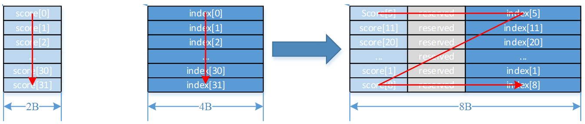

# Sort32<a name="ZH-CN_TOPIC_0000001487536634"></a>

## AI处理器支持情况<a name="section1550532418810"></a>

<a name="table38301303189"></a>
<table><thead align="left"><tr id="row20831180131817"><th class="cellrowborder" valign="top" width="57.99999999999999%" id="mcps1.1.3.1.1"><p id="p1883113061818"><a name="p1883113061818"></a><a name="p1883113061818"></a><span id="ph20833205312295"><a name="ph20833205312295"></a><a name="ph20833205312295"></a>AI处理器类型</span></p>
</th>
<th class="cellrowborder" align="center" valign="top" width="42%" id="mcps1.1.3.1.2"><p id="p783113012187"><a name="p783113012187"></a><a name="p783113012187"></a>是否支持</p>
</th>
</tr>
</thead>
<tbody><tr id="row220181016240"><td class="cellrowborder" valign="top" width="57.99999999999999%" headers="mcps1.1.3.1.1 "><p id="p48327011813"><a name="p48327011813"></a><a name="p48327011813"></a><span id="ph583230201815"><a name="ph583230201815"></a><a name="ph583230201815"></a><term id="zh-cn_topic_0000001312391781_term1253731311225"><a name="zh-cn_topic_0000001312391781_term1253731311225"></a><a name="zh-cn_topic_0000001312391781_term1253731311225"></a>Ascend 910C</term></span></p>
</td>
<td class="cellrowborder" align="center" valign="top" width="42%" headers="mcps1.1.3.1.2 "><p id="p7948163910184"><a name="p7948163910184"></a><a name="p7948163910184"></a>√</p>
</td>
</tr>
<tr id="row173226882415"><td class="cellrowborder" valign="top" width="57.99999999999999%" headers="mcps1.1.3.1.1 "><p id="p14832120181815"><a name="p14832120181815"></a><a name="p14832120181815"></a><span id="ph1483216010188"><a name="ph1483216010188"></a><a name="ph1483216010188"></a><term id="zh-cn_topic_0000001312391781_term11962195213215"><a name="zh-cn_topic_0000001312391781_term11962195213215"></a><a name="zh-cn_topic_0000001312391781_term11962195213215"></a>Ascend 910B</term></span></p>
</td>
<td class="cellrowborder" align="center" valign="top" width="42%" headers="mcps1.1.3.1.2 "><p id="p19948143911820"><a name="p19948143911820"></a><a name="p19948143911820"></a>√</p>
</td>
</tr>
</tbody>
</table>

## 功能说明<a name="section618mcpsimp"></a>

排序函数，一次迭代可以完成32个数的排序，数据需要按如下描述结构进行保存：

score和index分别存储在src0和src1中，按score进行排序（score大的排前面），排序好的score与其对应的index一起以（score, index）的结构存储在dst中。不论score为half还是float类型，dst中的（score, index）结构总是占据8Bytes空间。

如下所示：

-   当score为float，index为uint32\_t类型时，计算结果中index存储在高4Bytes，score存储在低4Bytes。

    

-   当score为half，index为uint32\_t类型时，计算结果中index存储在高4Bytes，score存储在低2Bytes， 中间的2Bytes保留。

    

## 函数原型<a name="section620mcpsimp"></a>

```
template <typename T>
__aicore__ inline void Sort32(const LocalTensor<T>& dst, const LocalTensor<T>& src0, const LocalTensor<uint32_t>& src1, const int32_t repeatTime)
```

## 参数说明<a name="section622mcpsimp"></a>

**表 1**  模板参数说明

<a name="table4835205712588"></a>
<table><thead align="left"><tr id="zh-cn_topic_0000001429830437_row118356578583"><th class="cellrowborder" valign="top" width="13.58%" id="mcps1.2.3.1.1"><p id="zh-cn_topic_0000001429830437_p48354572582"><a name="zh-cn_topic_0000001429830437_p48354572582"></a><a name="zh-cn_topic_0000001429830437_p48354572582"></a>参数名</p>
</th>
<th class="cellrowborder" valign="top" width="86.42%" id="mcps1.2.3.1.2"><p id="zh-cn_topic_0000001429830437_p583535795817"><a name="zh-cn_topic_0000001429830437_p583535795817"></a><a name="zh-cn_topic_0000001429830437_p583535795817"></a>描述</p>
</th>
</tr>
</thead>
<tbody><tr id="zh-cn_topic_0000001429830437_row1835857145817"><td class="cellrowborder" valign="top" width="13.58%" headers="mcps1.2.3.1.1 "><p id="zh-cn_topic_0000001429830437_p5835457165816"><a name="zh-cn_topic_0000001429830437_p5835457165816"></a><a name="zh-cn_topic_0000001429830437_p5835457165816"></a>T</p>
</td>
<td class="cellrowborder" valign="top" width="86.42%" headers="mcps1.2.3.1.2 "><p id="zh-cn_topic_0000001429830437_p168351657155818"><a name="zh-cn_topic_0000001429830437_p168351657155818"></a><a name="zh-cn_topic_0000001429830437_p168351657155818"></a>操作数数据类型。</p>
<p id="p523904010149"><a name="p523904010149"></a><a name="p523904010149"></a><span id="ph16239174011416"><a name="ph16239174011416"></a><a name="ph16239174011416"></a><term id="zh-cn_topic_0000001312391781_term1253731311225_1"><a name="zh-cn_topic_0000001312391781_term1253731311225_1"></a><a name="zh-cn_topic_0000001312391781_term1253731311225_1"></a>Ascend 910C</term></span>，支持的数据类型为：half/float</p>
<p id="p58811040121710"><a name="p58811040121710"></a><a name="p58811040121710"></a><span id="ph14504143371016"><a name="ph14504143371016"></a><a name="ph14504143371016"></a><term id="zh-cn_topic_0000001312391781_term11962195213215_1"><a name="zh-cn_topic_0000001312391781_term11962195213215_1"></a><a name="zh-cn_topic_0000001312391781_term11962195213215_1"></a>Ascend 910B</term></span>，支持的数据类型为：half/float</p>
</td>
</tr>
</tbody>
</table>

**表 2**  参数说明

<a name="table62161631132810"></a>
<table><thead align="left"><tr id="row12216103118284"><th class="cellrowborder" valign="top" width="13.661366136613662%" id="mcps1.2.4.1.1"><p id="p1421643114288"><a name="p1421643114288"></a><a name="p1421643114288"></a>参数名称</p>
</th>
<th class="cellrowborder" valign="top" width="12.591259125912593%" id="mcps1.2.4.1.2"><p id="p82165310285"><a name="p82165310285"></a><a name="p82165310285"></a>输入/输出</p>
</th>
<th class="cellrowborder" valign="top" width="73.74737473747375%" id="mcps1.2.4.1.3"><p id="p1121663111288"><a name="p1121663111288"></a><a name="p1121663111288"></a>含义</p>
</th>
</tr>
</thead>
<tbody><tr id="row82161131182810"><td class="cellrowborder" valign="top" width="13.661366136613662%" headers="mcps1.2.4.1.1 "><p id="p62165318282"><a name="p62165318282"></a><a name="p62165318282"></a>dst</p>
</td>
<td class="cellrowborder" valign="top" width="12.591259125912593%" headers="mcps1.2.4.1.2 "><p id="p102161931162814"><a name="p102161931162814"></a><a name="p102161931162814"></a>输出</p>
</td>
<td class="cellrowborder" valign="top" width="73.74737473747375%" headers="mcps1.2.4.1.3 "><p id="p3944122817141"><a name="p3944122817141"></a><a name="p3944122817141"></a>目的操作数。</p>
<p id="p16703131355116"><a name="p16703131355116"></a><a name="p16703131355116"></a><span id="zh-cn_topic_0000001530181537_ph173308471594"><a name="zh-cn_topic_0000001530181537_ph173308471594"></a><a name="zh-cn_topic_0000001530181537_ph173308471594"></a><span id="zh-cn_topic_0000001530181537_ph9902231466"><a name="zh-cn_topic_0000001530181537_ph9902231466"></a><a name="zh-cn_topic_0000001530181537_ph9902231466"></a><span id="zh-cn_topic_0000001530181537_ph1782115034816"><a name="zh-cn_topic_0000001530181537_ph1782115034816"></a><a name="zh-cn_topic_0000001530181537_ph1782115034816"></a>类型为<a href="LocalTensor.md">LocalTensor</a>，支持的TPosition为VECIN/VECCALC/VECOUT。</span></span></span></p>
<p id="p16168483301"><a name="p16168483301"></a><a name="p16168483301"></a><span id="ph1479701815419"><a name="ph1479701815419"></a><a name="ph1479701815419"></a>LocalTensor的起始地址需要32字节对齐。</span></p>
</td>
</tr>
<tr id="row5216163192815"><td class="cellrowborder" valign="top" width="13.661366136613662%" headers="mcps1.2.4.1.1 "><p id="p13216193192813"><a name="p13216193192813"></a><a name="p13216193192813"></a>src0</p>
</td>
<td class="cellrowborder" valign="top" width="12.591259125912593%" headers="mcps1.2.4.1.2 "><p id="p7217031182818"><a name="p7217031182818"></a><a name="p7217031182818"></a>输入</p>
</td>
<td class="cellrowborder" valign="top" width="73.74737473747375%" headers="mcps1.2.4.1.3 "><p id="p185486379149"><a name="p185486379149"></a><a name="p185486379149"></a>源操作数。</p>
<p id="p5449124113142"><a name="p5449124113142"></a><a name="p5449124113142"></a><span id="zh-cn_topic_0000001530181537_ph173308471594_1"><a name="zh-cn_topic_0000001530181537_ph173308471594_1"></a><a name="zh-cn_topic_0000001530181537_ph173308471594_1"></a><span id="zh-cn_topic_0000001530181537_ph9902231466_1"><a name="zh-cn_topic_0000001530181537_ph9902231466_1"></a><a name="zh-cn_topic_0000001530181537_ph9902231466_1"></a><span id="zh-cn_topic_0000001530181537_ph1782115034816_1"><a name="zh-cn_topic_0000001530181537_ph1782115034816_1"></a><a name="zh-cn_topic_0000001530181537_ph1782115034816_1"></a>类型为<a href="LocalTensor.md">LocalTensor</a>，支持的TPosition为VECIN/VECCALC/VECOUT。</span></span></span></p>
<p id="p1315655114301"><a name="p1315655114301"></a><a name="p1315655114301"></a><span id="ph6621175133017"><a name="ph6621175133017"></a><a name="ph6621175133017"></a>LocalTensor的起始地址需要32字节对齐。</span></p>
<p id="p1521763119281"><a name="p1521763119281"></a><a name="p1521763119281"></a>此源操作数的数据类型需要与目的操作数保持一致。</p>
</td>
</tr>
<tr id="row88875522820"><td class="cellrowborder" valign="top" width="13.661366136613662%" headers="mcps1.2.4.1.1 "><p id="p141252118106"><a name="p141252118106"></a><a name="p141252118106"></a>src1</p>
</td>
<td class="cellrowborder" valign="top" width="12.591259125912593%" headers="mcps1.2.4.1.2 "><p id="p105185518102"><a name="p105185518102"></a><a name="p105185518102"></a>输入</p>
</td>
<td class="cellrowborder" valign="top" width="73.74737473747375%" headers="mcps1.2.4.1.3 "><p id="p683812512153"><a name="p683812512153"></a><a name="p683812512153"></a>源操作数。</p>
<p id="p577151261519"><a name="p577151261519"></a><a name="p577151261519"></a><span id="zh-cn_topic_0000001530181537_ph173308471594_2"><a name="zh-cn_topic_0000001530181537_ph173308471594_2"></a><a name="zh-cn_topic_0000001530181537_ph173308471594_2"></a><span id="zh-cn_topic_0000001530181537_ph9902231466_2"><a name="zh-cn_topic_0000001530181537_ph9902231466_2"></a><a name="zh-cn_topic_0000001530181537_ph9902231466_2"></a><span id="zh-cn_topic_0000001530181537_ph1782115034816_2"><a name="zh-cn_topic_0000001530181537_ph1782115034816_2"></a><a name="zh-cn_topic_0000001530181537_ph1782115034816_2"></a>类型为<a href="LocalTensor.md">LocalTensor</a>，支持的TPosition为VECIN/VECCALC/VECOUT。</span></span></span></p>
<p id="p653611582304"><a name="p653611582304"></a><a name="p653611582304"></a><span id="ph9865155873012"><a name="ph9865155873012"></a><a name="ph9865155873012"></a>LocalTensor的起始地址需要32字节对齐。</span></p>
<p id="p178873523815"><a name="p178873523815"></a><a name="p178873523815"></a>此源操作数固定为uint32_t数据类型。</p>
</td>
</tr>
<tr id="row521753120287"><td class="cellrowborder" valign="top" width="13.661366136613662%" headers="mcps1.2.4.1.1 "><p id="p1336715511855"><a name="p1336715511855"></a><a name="p1336715511855"></a>repeatTime</p>
</td>
<td class="cellrowborder" valign="top" width="12.591259125912593%" headers="mcps1.2.4.1.2 "><p id="p63676515516"><a name="p63676515516"></a><a name="p63676515516"></a>输入</p>
</td>
<td class="cellrowborder" valign="top" width="73.74737473747375%" headers="mcps1.2.4.1.3 "><p id="p636715110511"><a name="p636715110511"></a><a name="p636715110511"></a>重复迭代次数，int32_t类型，每次迭代完成32个元素的排序，下次迭代src0和src1各跳过32个elements，dst跳过32*8 Byte空间。取值范围：repeatTime∈[0,255]。</p>
</td>
</tr>
</tbody>
</table>

## 返回值说明<a name="section91032023123812"></a>

无

## 约束说明<a name="section633mcpsimp"></a>

-   当存在score\[i\]与score\[j\]相同时，如果i\>j，则score\[j\]将首先被选出来，排在前面。
-   每次迭代内的数据会进行排序，不同迭代间的数据不会进行排序。
-   操作数地址对齐要求请参见[通用地址对齐约束](通用说明和约束.md#section796754519912)。

## 调用示例<a name="section642mcpsimp"></a>

-   接口使用样例

    ```
    // repeatTime = 4, 对128个数分成4组进行排序，每次完成1组32个数的排序
    AscendC::Sort32<float>(dstLocal, srcLocal0, srcLocal1, 4);
    ```

-   完整样例

    ```
    #include "kernel_operator.h"
    
    class KernelSort32 {
    public:
        __aicore__ inline KernelSort32() {}
        __aicore__ inline void Init(__gm__ uint8_t* src0Gm, __gm__ uint8_t* src1Gm, __gm__ uint8_t* dstGm)
        {
            srcGlobal0.SetGlobalBuffer((__gm__ float*)src0Gm);
            srcGlobal1.SetGlobalBuffer((__gm__ uint32_t*)src1Gm);
            dstGlobal.SetGlobalBuffer((__gm__ float*)dstGm);
    
            repeat = srcDataSize / 32;
            pipe.InitBuffer(inQueueSrc0, 1, srcDataSize * sizeof(float));
            pipe.InitBuffer(inQueueSrc1, 1, srcDataSize * sizeof(uint32_t));
            pipe.InitBuffer(outQueueDst, 1, dstDataSize * sizeof(float));
        }
        __aicore__ inline void Process()
        {
            CopyIn();
            Compute();
            CopyOut();
        }
    
    private:
        __aicore__ inline void CopyIn()
        {
            AscendC::LocalTensor<float> srcLocal0 = inQueueSrc0.AllocTensor<float>();
            AscendC::DataCopy(srcLocal0, srcGlobal0, srcDataSize);
            inQueueSrc0.EnQue(srcLocal0);
            AscendC::LocalTensor<uint32_t> srcLocal1 = inQueueSrc1.AllocTensor<uint32_t>();
            AscendC::DataCopy(srcLocal1, srcGlobal1, srcDataSize);
            inQueueSrc1.EnQue(srcLocal1);
        }
        __aicore__ inline void Compute()
        {
            AscendC::LocalTensor<float> srcLocal0 = inQueueSrc0.DeQue<float>();
            AscendC::LocalTensor<uint32_t> srcLocal1 = inQueueSrc1.DeQue<uint32_t>();
            AscendC::LocalTensor<float> dstLocal = outQueueDst.AllocTensor<float>();
    
            AscendC::Sort32<float>(dstLocal, srcLocal0, srcLocal1, repeat);
    
            outQueueDst.EnQue<float>(dstLocal);
            inQueueSrc0.FreeTensor(srcLocal0);
            inQueueSrc1.FreeTensor(srcLocal1);
        }
        __aicore__ inline void CopyOut()
        {
            AscendC::LocalTensor<float> dstLocal = outQueueDst.DeQue<float>();
            AscendC::DataCopy(dstGlobal, dstLocal, dstDataSize);
            outQueueDst.FreeTensor(dstLocal);
        }
    
    private:
        AscendC::TPipe pipe;
        AscendC::TQue<AscendC::TPosition::VECIN, 1> inQueueSrc0;
        AscendC::TQue<AscendC::TPosition::VECIN, 1> inQueueSrc1;
        AscendC::TQue<AscendC::TPosition::VECOUT, 1> outQueueDst;
        AscendC::GlobalTensor<float> srcGlobal0, dstGlobal;
        AscendC::GlobalTensor<uint32_t> srcGlobal1;
        int srcDataSize = 128;
        int dstDataSize = 256;
        int repeat = 0;
    };
    
    extern "C" __global__ __aicore__ void vec_sort32_kernel(__gm__ uint8_t* src0Gm, __gm__ uint8_t* src1Gm,
        __gm__ uint8_t* dstGm)
    {
        KernelSort32 op;
        op.Init(src0Gm, src1Gm, dstGm);
        op.Process();
    }
    ```

    ```
    示例结果
    输入数据src0Gm：128个float类型数据
    [7.867878  9.065992  9.374247  1.0911566 9.262053  2.035779  3.747487
     2.9315646 5.237765  5.176559  7.965426  3.2341435 7.203623  1.5736973
     3.386001  5.077001  4.593656  1.8485032 7.8554387 5.1269145 7.223478
     8.259627  5.5502934 8.795028  9.626377  7.7227993 9.505127  6.683293
     6.232041  2.1760664 4.504409  2.906819  9.425597  9.467169  4.990563
     4.609341  1.8662999 3.6319377 3.5542917 8.382838  5.133566  3.1391478
     5.244712  9.330158  2.0394793 5.9761605 4.937267  6.076068  7.5449195
     6.5085726 1.8132887 2.5047603 3.3350103 2.7831945 3.0417829 5.0608244
     3.4855423 2.8485715 4.853921  6.364753  3.1402998 6.052516  3.6143537
     4.0714087 6.8068676 8.625871  8.040528  1.9881475 4.618402  7.0302424
     6.0751796 5.877218  9.256125  4.193431  5.2048235 6.9774013 2.8765092
     5.8294353 8.618196  8.619784  3.9252923 4.491909  6.0063663 2.3781579
     5.8828945 7.269731  6.1864734 8.32413   5.2518435 9.184813  7.9312286
     3.8841062 8.540505  7.611145  8.204335  2.110103  4.1796618 7.2383223
     3.9992998 4.750733  8.650443  7.6469994 6.6126637 8.993322  8.920976
     7.143699  7.0797443 3.3189814 7.3707795 3.26992   8.58087   5.6882014
     2.0333889 6.711474  4.353861  7.946233  4.5678067 6.3354545 4.092168
     2.416961  3.6823056 4.6000533 2.4727547 4.7993317 1.159995  8.025275
     3.3826146 3.8543346]
    输入数据src1Gm：
    [0,0,0,0,0...0]
    输出数据dstGm：
    [9.626377  0.        9.505127  0.        9.374247  0.        9.262053
     0.        9.065992  0.        8.795028  0.        8.259627  0.
     7.965426  0.        7.867878  0.        7.8554387 0.        7.7227993
     0.        7.223478  0.        7.203623  0.        6.683293  0.
     6.232041  0.        5.5502934 0.        5.237765  0.        5.176559
     0.        5.1269145 0.        5.077001  0.        4.593656  0.
     4.504409  0.        3.747487  0.        3.386001  0.        3.2341435
     0.        2.9315646 0.        2.906819  0.        2.1760664 0.
     2.035779  0.        1.8485032 0.        1.5736973 0.        1.0911566
     0.        9.467169  0.        9.425597  0.        9.330158  0.
     8.382838  0.        7.5449195 0.        6.5085726 0.        6.364753
     0.        6.076068  0.        6.052516  0.        5.9761605 0.
     5.244712  0.        5.133566  0.        5.0608244 0.        4.990563
     0.        4.937267  0.        4.853921  0.        4.609341  0.
     4.0714087 0.        3.6319377 0.        3.6143537 0.        3.5542917
     0.        3.4855423 0.        3.3350103 0.        3.1402998 0.
     3.1391478 0.        3.0417829 0.        2.8485715 0.        2.7831945
     0.        2.5047603 0.        2.0394793 0.        1.8662999 0.
     1.8132887 0.        9.256125  0.        9.184813  0.        8.625871
     0.        8.619784  0.        8.618196  0.        8.540505  0.
     8.32413   0.        8.204335  0.        8.040528  0.        7.9312286
     0.        7.611145  0.        7.269731  0.        7.0302424 0.
     6.9774013 0.        6.8068676 0.        6.1864734 0.        6.0751796
     0.        6.0063663 0.        5.8828945 0.        5.877218  0.
     5.8294353 0.        5.2518435 0.        5.2048235 0.        4.618402
     0.        4.491909  0.        4.193431  0.        3.9252923 0.
     3.8841062 0.        2.8765092 0.        2.3781579 0.        2.110103
     0.        1.9881475 0.        8.993322  0.        8.920976  0.
     8.650443  0.        8.58087   0.        8.025275  0.        7.946233
     0.        7.6469994 0.        7.3707795 0.        7.2383223 0.
     7.143699  0.        7.0797443 0.        6.711474  0.        6.6126637
     0.        6.3354545 0.        5.6882014 0.        4.7993317 0.
     4.750733  0.        4.6000533 0.        4.5678067 0.        4.353861
     0.        4.1796618 0.        4.092168  0.        3.9992998 0.
     3.8543346 0.        3.6823056 0.        3.3826146 0.        3.3189814
     0.        3.26992   0.        2.4727547 0.        2.416961  0.
     2.0333889 0.        1.159995  0.       ]
    ```

