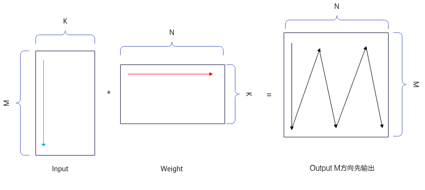
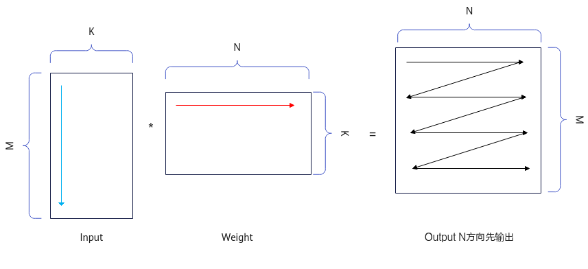

# TConv3DApiTiling结构体

TConv3DApiTiling结构体包含Conv3D算子规格信息及Tiling切分算法的相关参数，被传递给Conv3D Kernel侧，用于数据切分、数据搬运和计算等。TConv3DApiTiling结构体的参数说明见[表1](#table18244199192620)。

用户通过调用[GetTiling](GetTiling-48.md)接口获取TConv3DApiTiling结构体，具体流程请参考[Conv3D Tiling使用说明](Conv3D-Tiling使用说明.md)。当前暂不支持用户自定义配置TConv3DApiTiling结构体中的参数。

**表 1**  TConv3DApiTiling结构说明

<table><thead align="left"><tr id="row1232218913265"><th class="cellrowborder" valign="top" width="32.65%" id="mcps1.2.4.1.1">
<strong id="b10322109152611">参数名称</strong>

</th>
<th class="cellrowborder" valign="top" width="14.29%" id="mcps1.2.4.1.2">
<strong id="b032217932617">数据类型</strong>

</th>
<th class="cellrowborder" valign="top" width="53.059999999999995%" id="mcps1.2.4.1.3">
<strong id="b14322149112619">说明</strong>

</th>
</tr>
</thead>
<tbody><tr id="row1332211911262"><td class="cellrowborder" valign="top" width="32.65%" headers="mcps1.2.4.1.1 ">
groups

</td>
<td class="cellrowborder" valign="top" width="14.29%" headers="mcps1.2.4.1.2 ">
uint32_t

</td>
<td class="cellrowborder" valign="top" width="53.059999999999995%" headers="mcps1.2.4.1.3 ">
预留参数，当前仅支持为1。

</td>
</tr>
<tr id="row432212911261"><td class="cellrowborder" valign="top" width="32.65%" headers="mcps1.2.4.1.1 ">
singleCoreDo

</td>
<td class="cellrowborder" valign="top" width="14.29%" headers="mcps1.2.4.1.2 ">
uint64_t

</td>
<td class="cellrowborder" valign="top" width="53.059999999999995%" headers="mcps1.2.4.1.3 ">
单核上处理的Dout大小。

</td>
</tr>
<tr id="row1532310992614"><td class="cellrowborder" valign="top" width="32.65%" headers="mcps1.2.4.1.1 ">
singleCoreCo

</td>
<td class="cellrowborder" valign="top" width="14.29%" headers="mcps1.2.4.1.2 ">
uint32_t

</td>
<td class="cellrowborder" valign="top" width="53.059999999999995%" headers="mcps1.2.4.1.3 ">
单核上处理的Cout大小。

</td>
</tr>
<tr id="row73238992615"><td class="cellrowborder" valign="top" width="32.65%" headers="mcps1.2.4.1.1 ">
singleCoreM

</td>
<td class="cellrowborder" valign="top" width="14.29%" headers="mcps1.2.4.1.2 ">
uint64_t

</td>
<td class="cellrowborder" valign="top" width="53.059999999999995%" headers="mcps1.2.4.1.3 ">
单核上处理的M大小。

</td>
</tr>
<tr id="row113232982611"><td class="cellrowborder" valign="top" width="32.65%" headers="mcps1.2.4.1.1 ">
orgDo

</td>
<td class="cellrowborder" valign="top" width="14.29%" headers="mcps1.2.4.1.2 ">
uint64_t

</td>
<td class="cellrowborder" valign="top" width="53.059999999999995%" headers="mcps1.2.4.1.3 ">
Conv3D计算中原始Dout大小。

</td>
</tr>
<tr id="row1132319992616"><td class="cellrowborder" valign="top" width="32.65%" headers="mcps1.2.4.1.1 ">
orgCo

</td>
<td class="cellrowborder" valign="top" width="14.29%" headers="mcps1.2.4.1.2 ">
uint32_t

</td>
<td class="cellrowborder" valign="top" width="53.059999999999995%" headers="mcps1.2.4.1.3 ">
Conv3D计算中原始Cout大小。

</td>
</tr>
<tr id="row13231994267"><td class="cellrowborder" valign="top" width="32.65%" headers="mcps1.2.4.1.1 ">
orgHo

</td>
<td class="cellrowborder" valign="top" width="14.29%" headers="mcps1.2.4.1.2 ">
uint64_t

</td>
<td class="cellrowborder" valign="top" width="53.059999999999995%" headers="mcps1.2.4.1.3 ">
Conv3D计算中原始Hout大小。

</td>
</tr>
<tr id="row133233916267"><td class="cellrowborder" valign="top" width="32.65%" headers="mcps1.2.4.1.1 ">
orgWo

</td>
<td class="cellrowborder" valign="top" width="14.29%" headers="mcps1.2.4.1.2 ">
uint64_t

</td>
<td class="cellrowborder" valign="top" width="53.059999999999995%" headers="mcps1.2.4.1.3 ">
Conv3D计算中原始Wout大小。

</td>
</tr>
<tr id="row33237922613"><td class="cellrowborder" valign="top" width="32.65%" headers="mcps1.2.4.1.1 ">
orgCi

</td>
<td class="cellrowborder" valign="top" width="14.29%" headers="mcps1.2.4.1.2 ">
uint32_t

</td>
<td class="cellrowborder" valign="top" width="53.059999999999995%" headers="mcps1.2.4.1.3 ">
Conv3D计算中原始Cin大小。

</td>
</tr>
<tr id="row03239912264"><td class="cellrowborder" valign="top" width="32.65%" headers="mcps1.2.4.1.1 ">
orgDi

</td>
<td class="cellrowborder" valign="top" width="14.29%" headers="mcps1.2.4.1.2 ">
uint64_t

</td>
<td class="cellrowborder" valign="top" width="53.059999999999995%" headers="mcps1.2.4.1.3 ">
Conv3D计算中原始Din大小。

</td>
</tr>
<tr id="row1432317932615"><td class="cellrowborder" valign="top" width="32.65%" headers="mcps1.2.4.1.1 ">
orgHi

</td>
<td class="cellrowborder" valign="top" width="14.29%" headers="mcps1.2.4.1.2 ">
uint64_t

</td>
<td class="cellrowborder" valign="top" width="53.059999999999995%" headers="mcps1.2.4.1.3 ">
Conv3D计算中原始Hin大小。

</td>
</tr>
<tr id="row123238992612"><td class="cellrowborder" valign="top" width="32.65%" headers="mcps1.2.4.1.1 ">
orgWi

</td>
<td class="cellrowborder" valign="top" width="14.29%" headers="mcps1.2.4.1.2 ">
uint64_t

</td>
<td class="cellrowborder" valign="top" width="53.059999999999995%" headers="mcps1.2.4.1.3 ">
Conv3D计算中原始Win大小。

</td>
</tr>
<tr id="row832369112618"><td class="cellrowborder" valign="top" width="32.65%" headers="mcps1.2.4.1.1 ">
kernelD

</td>
<td class="cellrowborder" valign="top" width="14.29%" headers="mcps1.2.4.1.2 ">
uint32_t

</td>
<td class="cellrowborder" valign="top" width="53.059999999999995%" headers="mcps1.2.4.1.3 ">
Conv3D计算中卷积核原始kernel D维度大小。

</td>
</tr>
<tr id="row332399102611"><td class="cellrowborder" valign="top" width="32.65%" headers="mcps1.2.4.1.1 ">
kernelH

</td>
<td class="cellrowborder" valign="top" width="14.29%" headers="mcps1.2.4.1.2 ">
uint32_t

</td>
<td class="cellrowborder" valign="top" width="53.059999999999995%" headers="mcps1.2.4.1.3 ">
Conv3D计算中卷积核原始kernel H维度大小。

</td>
</tr>
<tr id="row1932349142616"><td class="cellrowborder" valign="top" width="32.65%" headers="mcps1.2.4.1.1 ">
kernelW

</td>
<td class="cellrowborder" valign="top" width="14.29%" headers="mcps1.2.4.1.2 ">
uint32_t

</td>
<td class="cellrowborder" valign="top" width="53.059999999999995%" headers="mcps1.2.4.1.3 ">
Conv3D计算中卷积核原始kernel W维度大小。

</td>
</tr>
<tr id="row103234918265"><td class="cellrowborder" valign="top" width="32.65%" headers="mcps1.2.4.1.1 ">
strideD

</td>
<td class="cellrowborder" valign="top" width="14.29%" headers="mcps1.2.4.1.2 ">
uint32_t

</td>
<td class="cellrowborder" valign="top" width="53.059999999999995%" headers="mcps1.2.4.1.3 ">
Conv3D计算中Stride D维度大小。

</td>
</tr>
<tr id="row1232439132617"><td class="cellrowborder" valign="top" width="32.65%" headers="mcps1.2.4.1.1 ">
strideH

</td>
<td class="cellrowborder" valign="top" width="14.29%" headers="mcps1.2.4.1.2 ">
uint32_t

</td>
<td class="cellrowborder" valign="top" width="53.059999999999995%" headers="mcps1.2.4.1.3 ">
Conv3D计算中Stride H维度大小。

</td>
</tr>
<tr id="row17324293269"><td class="cellrowborder" valign="top" width="32.65%" headers="mcps1.2.4.1.1 ">
strideW

</td>
<td class="cellrowborder" valign="top" width="14.29%" headers="mcps1.2.4.1.2 ">
uint32_t

</td>
<td class="cellrowborder" valign="top" width="53.059999999999995%" headers="mcps1.2.4.1.3 ">
Conv3D计算中Stride W维度大小。

</td>
</tr>
<tr id="row19324179102620"><td class="cellrowborder" valign="top" width="32.65%" headers="mcps1.2.4.1.1 ">
dilationD

</td>
<td class="cellrowborder" valign="top" width="14.29%" headers="mcps1.2.4.1.2 ">
uint32_t

</td>
<td class="cellrowborder" valign="top" width="53.059999999999995%" headers="mcps1.2.4.1.3 ">
Conv3D计算中Dilation D维度大小。

</td>
</tr>
<tr id="row153241193262"><td class="cellrowborder" valign="top" width="32.65%" headers="mcps1.2.4.1.1 ">
dilationH

</td>
<td class="cellrowborder" valign="top" width="14.29%" headers="mcps1.2.4.1.2 ">
uint32_t

</td>
<td class="cellrowborder" valign="top" width="53.059999999999995%" headers="mcps1.2.4.1.3 ">
Conv3D计算中Dilation H维度大小。

</td>
</tr>
<tr id="row163245962613"><td class="cellrowborder" valign="top" width="32.65%" headers="mcps1.2.4.1.1 ">
dilationW

</td>
<td class="cellrowborder" valign="top" width="14.29%" headers="mcps1.2.4.1.2 ">
uint32_t

</td>
<td class="cellrowborder" valign="top" width="53.059999999999995%" headers="mcps1.2.4.1.3 ">
Conv3D计算中Dilation W维度大小。

</td>
</tr>
<tr id="row532414911264"><td class="cellrowborder" valign="top" width="32.65%" headers="mcps1.2.4.1.1 ">
padHead

</td>
<td class="cellrowborder" valign="top" width="14.29%" headers="mcps1.2.4.1.2 ">
uint32_t

</td>
<td class="cellrowborder" valign="top" width="53.059999999999995%" headers="mcps1.2.4.1.3 ">
Conv3D计算中Padding D维度Head方向大小。

</td>
</tr>
<tr id="row33241918268"><td class="cellrowborder" valign="top" width="32.65%" headers="mcps1.2.4.1.1 ">
padTail

</td>
<td class="cellrowborder" valign="top" width="14.29%" headers="mcps1.2.4.1.2 ">
uint32_t

</td>
<td class="cellrowborder" valign="top" width="53.059999999999995%" headers="mcps1.2.4.1.3 ">
Conv3D计算中Padding D维度Tail方向大小。

</td>
</tr>
<tr id="row53249942614"><td class="cellrowborder" valign="top" width="32.65%" headers="mcps1.2.4.1.1 ">
padUp

</td>
<td class="cellrowborder" valign="top" width="14.29%" headers="mcps1.2.4.1.2 ">
uint32_t

</td>
<td class="cellrowborder" valign="top" width="53.059999999999995%" headers="mcps1.2.4.1.3 ">
Conv3D计算中Padding H维度Up方向大小。

</td>
</tr>
<tr id="row732420972611"><td class="cellrowborder" valign="top" width="32.65%" headers="mcps1.2.4.1.1 ">
padDown

</td>
<td class="cellrowborder" valign="top" width="14.29%" headers="mcps1.2.4.1.2 ">
uint32_t

</td>
<td class="cellrowborder" valign="top" width="53.059999999999995%" headers="mcps1.2.4.1.3 ">
Conv3D计算中Padding H维度Down方向大小。

</td>
</tr>
<tr id="row143241798260"><td class="cellrowborder" valign="top" width="32.65%" headers="mcps1.2.4.1.1 ">
padLeft

</td>
<td class="cellrowborder" valign="top" width="14.29%" headers="mcps1.2.4.1.2 ">
uint32_t

</td>
<td class="cellrowborder" valign="top" width="53.059999999999995%" headers="mcps1.2.4.1.3 ">
Conv3D计算中Padding W维度Left方向大小。

</td>
</tr>
<tr id="row16324898260"><td class="cellrowborder" valign="top" width="32.65%" headers="mcps1.2.4.1.1 ">
padRight

</td>
<td class="cellrowborder" valign="top" width="14.29%" headers="mcps1.2.4.1.2 ">
uint32_t

</td>
<td class="cellrowborder" valign="top" width="53.059999999999995%" headers="mcps1.2.4.1.3 ">
Conv3D计算中Padding W维度Right方向大小。

</td>
</tr>
<tr id="row11324898261"><td class="cellrowborder" valign="top" width="32.65%" headers="mcps1.2.4.1.1 ">
mL0

</td>
<td class="cellrowborder" valign="top" width="14.29%" headers="mcps1.2.4.1.2 ">
uint32_t

</td>
<td class="cellrowborder" valign="top" width="53.059999999999995%" headers="mcps1.2.4.1.3 ">
L0上单次处理的M大小。

</td>
</tr>
<tr id="row532419932616"><td class="cellrowborder" valign="top" width="32.65%" headers="mcps1.2.4.1.1 ">
kL0

</td>
<td class="cellrowborder" valign="top" width="14.29%" headers="mcps1.2.4.1.2 ">
uint32_t

</td>
<td class="cellrowborder" valign="top" width="53.059999999999995%" headers="mcps1.2.4.1.3 ">
L0上单次处理的K大小。

</td>
</tr>
<tr id="row1232414918268"><td class="cellrowborder" valign="top" width="32.65%" headers="mcps1.2.4.1.1 ">
nL0

</td>
<td class="cellrowborder" valign="top" width="14.29%" headers="mcps1.2.4.1.2 ">
uint32_t

</td>
<td class="cellrowborder" valign="top" width="53.059999999999995%" headers="mcps1.2.4.1.3 ">
L0上单次处理的N大小。

</td>
</tr>
<tr id="row183241798263"><td class="cellrowborder" valign="top" width="32.65%" headers="mcps1.2.4.1.1 ">
kAL1

</td>
<td class="cellrowborder" valign="top" width="14.29%" headers="mcps1.2.4.1.2 ">
uint32_t

</td>
<td class="cellrowborder" valign="top" width="53.059999999999995%" headers="mcps1.2.4.1.3 ">
L1上Input K的实际大小，等于Cin1InL1 * KH *  KW * C0，Cin1InL1是KD * Cin1合轴之后Tiling切分的大小。

</td>
</tr>
<tr id="row103252902617"><td class="cellrowborder" valign="top" width="32.65%" headers="mcps1.2.4.1.1 ">
kBL1

</td>
<td class="cellrowborder" valign="top" width="14.29%" headers="mcps1.2.4.1.2 ">
uint32_t

</td>
<td class="cellrowborder" valign="top" width="53.059999999999995%" headers="mcps1.2.4.1.3 ">
L1上Weight K的实际大小，等于Cin1InL1 * KH *  KW * C0，Cin1InL1是KD * Cin1合轴之后Tiling切分的大小。

</td>
</tr>
<tr id="row8325494265"><td class="cellrowborder" valign="top" width="32.65%" headers="mcps1.2.4.1.1 ">
nBL1

</td>
<td class="cellrowborder" valign="top" width="14.29%" headers="mcps1.2.4.1.2 ">
uint32_t

</td>
<td class="cellrowborder" valign="top" width="53.059999999999995%" headers="mcps1.2.4.1.3 ">
L1上Weight载入Cout维度的实际数据大小。

</td>
</tr>
<tr id="row43253922616"><td class="cellrowborder" valign="top" width="32.65%" headers="mcps1.2.4.1.1 ">
mAL1

</td>
<td class="cellrowborder" valign="top" width="14.29%" headers="mcps1.2.4.1.2 ">
uint32_t

</td>
<td class="cellrowborder" valign="top" width="53.059999999999995%" headers="mcps1.2.4.1.3 ">
L1上Input载入M的实际数据大小。

</td>
</tr>
<tr id="row732514972615"><td class="cellrowborder" valign="top" width="32.65%" headers="mcps1.2.4.1.1 ">
al1FullLoad

</td>
<td class="cellrowborder" valign="top" width="14.29%" headers="mcps1.2.4.1.2 ">
uint8_t

</td>
<td class="cellrowborder" valign="top" width="53.059999999999995%" headers="mcps1.2.4.1.3 ">
Input数据在L1 Buffer是否全载。

0：Input数据在L1 Buffer上不全载。

1：Input数据在L1 Buffer上全载。

</td>
</tr>
<tr id="row123257992611"><td class="cellrowborder" valign="top" width="32.65%" headers="mcps1.2.4.1.1 ">
bl1FullLoad

</td>
<td class="cellrowborder" valign="top" width="14.29%" headers="mcps1.2.4.1.2 ">
uint8_t

</td>
<td class="cellrowborder" valign="top" width="53.059999999999995%" headers="mcps1.2.4.1.3 ">
Weight数据在L1 Buffer是否全载。

0：Weight数据在L1 Buffer上不全载。

1：Weight数据在L1 Buffer上全载。

</td>
</tr>
<tr id="row1132519917265"><td class="cellrowborder" valign="top" width="32.65%" headers="mcps1.2.4.1.1 ">
iterateMNOrder

</td>
<td class="cellrowborder" valign="top" width="14.29%" headers="mcps1.2.4.1.2 ">
uint8_t

</td>
<td class="cellrowborder" valign="top" width="53.059999999999995%" headers="mcps1.2.4.1.3 ">
输出结果矩阵Output时，M轴和N轴的输出顺序。

0：优先输出M方向。先输出M方向，再输出N方向，<a href="#fig2054162614714">图2</a>。

1：优先输出N方向。先输出N方向，再输出M方向，<a href="#fig1788889124818">图3</a>。

M由Hout和Wout组成，M方向的输出顺序为，先输出Wout方向，再输出Hout方向。

</td>
</tr>
<tr id="row183257914264"><td class="cellrowborder" valign="top" width="32.65%" headers="mcps1.2.4.1.1 ">
biasFullLoadFlag

</td>
<td class="cellrowborder" valign="top" width="14.29%" headers="mcps1.2.4.1.2 ">
uint8_t

</td>
<td class="cellrowborder" valign="top" width="53.059999999999995%" headers="mcps1.2.4.1.3 ">
Bias是否全载进L1 Buffer。

0：否，单核内单次载入Bias大小等于单次矩阵乘N方向的大小nL0。

1：是，单核内的Bias一次全载。

</td>
</tr>
<tr id="row6190142593516"><td class="cellrowborder" colspan="3" valign="top" headers="mcps1.2.4.1.1 mcps1.2.4.1.2 mcps1.2.4.1.3 ">
注：上述的M轴为卷积正向操作过程中的输入Input在img2col展开后的纵轴，数值上等于Hout * Wout；K为输入Input在img2col展开后的横轴，数值上等于KD*C1*KH*KW*C0；KD/KH/KW为Weight的Depth、Height、Width，即kernelD/kernelH/kernelW的简写；N为Weight的Cout，具体请见<a href="#fig1053275794620">图1</a>。

</td>
</tr>
</tbody>
</table>

**图 1**  卷积3D正向MKN示意图  

**图 2**  卷积3D正向MFirst示意图  

**图 3**  卷积3D正向NFirst示意图  

