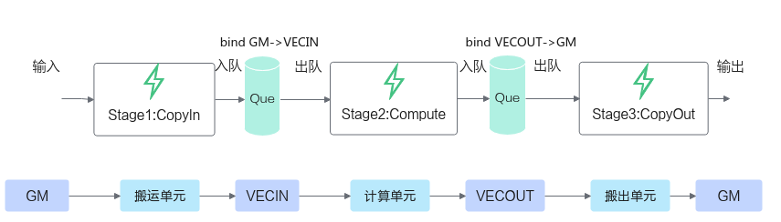
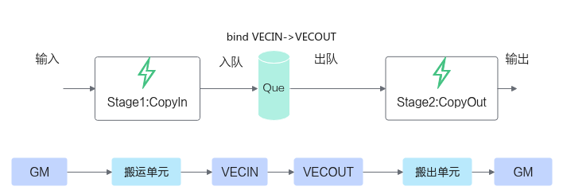

# TQueBind简介<a name="ZH-CN_TOPIC_0000001857592857"></a>

TQueBind绑定源逻辑位置和目的逻辑位置，根据源位置和目的位置，来确定内存分配的位置 、插入对应的同步事件，帮助开发者解决内存分配和管理、同步等问题。Tque是TQueBind的简化模式。通常情况下开发者使用TQue进行编程，TQueBind对外提供一些特殊数据通路的内存管理和同步控制，涉及这些通路时可以直接使用TQueBind。

如下图的数据通路示意图所示，红色线条和蓝色线条的通路可通过TQueBind定义表达，蓝色线条的通路可通过TQue进行简化表达。


**表 1**  TQueBind和TQue对于数据通路的表达

<a name="table171821134125613"></a>
<table><thead align="left"><tr id="row218203418566"><th class="cellrowborder" valign="top" width="22.71%" id="mcps1.2.4.1.1"><p id="p6182183411565"><a name="p6182183411565"></a><a name="p6182183411565"></a>数据通路</p>
</th>
<th class="cellrowborder" valign="top" width="44.42%" id="mcps1.2.4.1.2"><p id="p191821734105615"><a name="p191821734105615"></a><a name="p191821734105615"></a>TQueBind定义</p>
</th>
<th class="cellrowborder" valign="top" width="32.87%" id="mcps1.2.4.1.3"><p id="p1518233416562"><a name="p1518233416562"></a><a name="p1518233416562"></a>TQue定义</p>
</th>
</tr>
</thead>
<tbody><tr id="row18293184354216"><td class="cellrowborder" valign="top" width="22.71%" headers="mcps1.2.4.1.1 "><p id="p194510267433"><a name="p194510267433"></a><a name="p194510267433"></a>GM-&gt;VECIN</p>
</td>
<td class="cellrowborder" valign="top" width="44.42%" headers="mcps1.2.4.1.2 "><pre class="codeblock" id="codeblock653942891212"><a name="codeblock653942891212"></a><a name="codeblock653942891212"></a>TQueBind&lt;TPosition::GM, TPosition::VECIN, 1&gt;</pre>
</td>
<td class="cellrowborder" valign="top" width="32.87%" headers="mcps1.2.4.1.3 "><pre class="codeblock" id="codeblock149969438127"><a name="codeblock149969438127"></a><a name="codeblock149969438127"></a>TQue&lt;TPosition::VECIN, 1&gt;</pre>
</td>
</tr>
<tr id="row472743920427"><td class="cellrowborder" valign="top" width="22.71%" headers="mcps1.2.4.1.1 "><p id="p16451152684316"><a name="p16451152684316"></a><a name="p16451152684316"></a>VECOUT-&gt;GM</p>
</td>
<td class="cellrowborder" valign="top" width="44.42%" headers="mcps1.2.4.1.2 "><pre class="codeblock" id="codeblock330274851210"><a name="codeblock330274851210"></a><a name="codeblock330274851210"></a>TQueBind&lt;TPosition::VECOUT, TPosition::GM, 1&gt;</pre>
</td>
<td class="cellrowborder" valign="top" width="32.87%" headers="mcps1.2.4.1.3 "><pre class="codeblock" id="codeblock192801353131214"><a name="codeblock192801353131214"></a><a name="codeblock192801353131214"></a>TQue&lt;TPosition::VECOUT, 1&gt;</pre>
</td>
</tr>
<tr id="row18245536114214"><td class="cellrowborder" valign="top" width="22.71%" headers="mcps1.2.4.1.1 "><p id="p182533107434"><a name="p182533107434"></a><a name="p182533107434"></a>VECIN-&gt;VECOUT</p>
</td>
<td class="cellrowborder" valign="top" width="44.42%" headers="mcps1.2.4.1.2 "><pre class="codeblock" id="codeblock563125191319"><a name="codeblock563125191319"></a><a name="codeblock563125191319"></a>TQueBind&lt;TPosition::VECIN, TPosition::VECOUT, 1&gt;</pre>
</td>
<td class="cellrowborder" valign="top" width="32.87%" headers="mcps1.2.4.1.3 "><p id="p11997181214229"><a name="p11997181214229"></a><a name="p11997181214229"></a>-</p>
</td>
</tr>
<tr id="row1118213346566"><td class="cellrowborder" valign="top" width="22.71%" headers="mcps1.2.4.1.1 "><p id="p169524825614"><a name="p169524825614"></a><a name="p169524825614"></a>GM-&gt;A1</p>
</td>
<td class="cellrowborder" valign="top" width="44.42%" headers="mcps1.2.4.1.2 "><pre class="codeblock" id="codeblock19855119151320"><a name="codeblock19855119151320"></a><a name="codeblock19855119151320"></a>TQueBind&lt;TPosition::GM, TPosition::A1, 1&gt;</pre>
</td>
<td class="cellrowborder" valign="top" width="32.87%" headers="mcps1.2.4.1.3 "><pre class="codeblock" id="codeblock1035819162139"><a name="codeblock1035819162139"></a><a name="codeblock1035819162139"></a>TQue&lt;TPosition::A1, 1&gt;</pre>
</td>
</tr>
<tr id="row131824349564"><td class="cellrowborder" valign="top" width="22.71%" headers="mcps1.2.4.1.1 "><p id="p116958483561"><a name="p116958483561"></a><a name="p116958483561"></a>GM-&gt;B1</p>
</td>
<td class="cellrowborder" valign="top" width="44.42%" headers="mcps1.2.4.1.2 "><pre class="codeblock" id="codeblock9773162110138"><a name="codeblock9773162110138"></a><a name="codeblock9773162110138"></a>TQueBind&lt;TPosition::GM, TPosition::B1, 1&gt;</pre>
</td>
<td class="cellrowborder" valign="top" width="32.87%" headers="mcps1.2.4.1.3 "><pre class="codeblock" id="codeblock4847182510138"><a name="codeblock4847182510138"></a><a name="codeblock4847182510138"></a>TQue&lt;TPosition::B1, 1&gt;</pre>
</td>
</tr>
<tr id="row201824342566"><td class="cellrowborder" valign="top" width="22.71%" headers="mcps1.2.4.1.1 "><p id="p186958481569"><a name="p186958481569"></a><a name="p186958481569"></a>GM-&gt;C1</p>
</td>
<td class="cellrowborder" valign="top" width="44.42%" headers="mcps1.2.4.1.2 "><pre class="codeblock" id="codeblock149532378137"><a name="codeblock149532378137"></a><a name="codeblock149532378137"></a>TQueBind&lt;TPosition::GM, TPosition::C1, 1&gt;</pre>
</td>
<td class="cellrowborder" valign="top" width="32.87%" headers="mcps1.2.4.1.3 "><pre class="codeblock" id="codeblock845074318134"><a name="codeblock845074318134"></a><a name="codeblock845074318134"></a>TQue&lt;TPosition::C1, 1&gt;</pre>
</td>
</tr>
<tr id="row17182173435611"><td class="cellrowborder" valign="top" width="22.71%" headers="mcps1.2.4.1.1 "><p id="p86951748105618"><a name="p86951748105618"></a><a name="p86951748105618"></a>A1-&gt;A2</p>
</td>
<td class="cellrowborder" valign="top" width="44.42%" headers="mcps1.2.4.1.2 "><pre class="codeblock" id="codeblock54201349101318"><a name="codeblock54201349101318"></a><a name="codeblock54201349101318"></a>TQueBind&lt;TPosition::A1, TPosition::A2, 1&gt;</pre>
</td>
<td class="cellrowborder" valign="top" width="32.87%" headers="mcps1.2.4.1.3 "><pre class="codeblock" id="codeblock6454195316132"><a name="codeblock6454195316132"></a><a name="codeblock6454195316132"></a>TQue&lt;TPosition::A2, 1&gt;</pre>
</td>
</tr>
<tr id="row3183183425617"><td class="cellrowborder" valign="top" width="22.71%" headers="mcps1.2.4.1.1 "><p id="p106951148165618"><a name="p106951148165618"></a><a name="p106951148165618"></a>B1-&gt;B2</p>
</td>
<td class="cellrowborder" valign="top" width="44.42%" headers="mcps1.2.4.1.2 "><pre class="codeblock" id="codeblock1836165801319"><a name="codeblock1836165801319"></a><a name="codeblock1836165801319"></a>TQueBind&lt;TPosition::B1, TPosition::B2, 1&gt;</pre>
</td>
<td class="cellrowborder" valign="top" width="32.87%" headers="mcps1.2.4.1.3 "><pre class="codeblock" id="codeblock14155220141"><a name="codeblock14155220141"></a><a name="codeblock14155220141"></a>TQue&lt;TPosition::B2, 1&gt;</pre>
</td>
</tr>
<tr id="row171831334165618"><td class="cellrowborder" valign="top" width="22.71%" headers="mcps1.2.4.1.1 "><p id="p14695748145615"><a name="p14695748145615"></a><a name="p14695748145615"></a>C1-&gt;C2</p>
</td>
<td class="cellrowborder" valign="top" width="44.42%" headers="mcps1.2.4.1.2 "><pre class="codeblock" id="codeblock188651767149"><a name="codeblock188651767149"></a><a name="codeblock188651767149"></a>TQueBind&lt;TPosition::C1, TPosition::C2, 1&gt;</pre>
</td>
<td class="cellrowborder" valign="top" width="32.87%" headers="mcps1.2.4.1.3 "><pre class="codeblock" id="codeblock967861221417"><a name="codeblock967861221417"></a><a name="codeblock967861221417"></a>TQue&lt;TPosition::C2, 1&gt;</pre>
</td>
</tr>
<tr id="row1818313413566"><td class="cellrowborder" valign="top" width="22.71%" headers="mcps1.2.4.1.1 "><p id="p116951448125620"><a name="p116951448125620"></a><a name="p116951448125620"></a>CO1-&gt;CO2</p>
</td>
<td class="cellrowborder" valign="top" width="44.42%" headers="mcps1.2.4.1.2 "><pre class="codeblock" id="codeblock19862141621414"><a name="codeblock19862141621414"></a><a name="codeblock19862141621414"></a>TQueBind&lt;TPosition::CO1, TPosition::CO2, 1&gt;</pre>
</td>
<td class="cellrowborder" valign="top" width="32.87%" headers="mcps1.2.4.1.3 "><pre class="codeblock" id="codeblock1388062161412"><a name="codeblock1388062161412"></a><a name="codeblock1388062161412"></a>TQue&lt;TPosition::CO1, 1&gt;</pre>
</td>
</tr>
<tr id="row1282101712571"><td class="cellrowborder" valign="top" width="22.71%" headers="mcps1.2.4.1.1 "><p id="p1043354016144"><a name="p1043354016144"></a><a name="p1043354016144"></a>CO2-&gt;GM</p>
</td>
<td class="cellrowborder" valign="top" width="44.42%" headers="mcps1.2.4.1.2 "><pre class="codeblock" id="codeblock123131826191417"><a name="codeblock123131826191417"></a><a name="codeblock123131826191417"></a>TQueBind&lt;TPosition::CO2, TPosition::GM, 1&gt;</pre>
</td>
<td class="cellrowborder" valign="top" width="32.87%" headers="mcps1.2.4.1.3 "><pre class="codeblock" id="codeblock1437413211410"><a name="codeblock1437413211410"></a><a name="codeblock1437413211410"></a>TQue&lt;TPosition::CO2, 1&gt;</pre>
</td>
</tr>
<tr id="row184915105189"><td class="cellrowborder" valign="top" width="22.71%" headers="mcps1.2.4.1.1 "><p id="p18850171017181"><a name="p18850171017181"></a><a name="p18850171017181"></a>VECOUT-&gt;A1/B1/C1</p>
</td>
<td class="cellrowborder" valign="top" width="44.42%" headers="mcps1.2.4.1.2 "><pre class="codeblock" id="codeblock2976143713148"><a name="codeblock2976143713148"></a><a name="codeblock2976143713148"></a>TQueBind&lt;TPosition::VECOUT, TPosition::A1, 1&gt;
TQueBind&lt;TPosition::VECOUT, TPosition::B1, 1&gt;
TQueBind&lt;TPosition::VECOUT, TPosition::C1, 1&gt;</pre>
</td>
<td class="cellrowborder" valign="top" width="32.87%" headers="mcps1.2.4.1.3 "><p id="p885021011816"><a name="p885021011816"></a><a name="p885021011816"></a>-</p>
</td>
</tr>
<tr id="row5128181314180"><td class="cellrowborder" valign="top" width="22.71%" headers="mcps1.2.4.1.1 "><p id="p13128613121812"><a name="p13128613121812"></a><a name="p13128613121812"></a>CO2-&gt;VECIN</p>
</td>
<td class="cellrowborder" valign="top" width="44.42%" headers="mcps1.2.4.1.2 "><pre class="codeblock" id="codeblock18142184301418"><a name="codeblock18142184301418"></a><a name="codeblock18142184301418"></a>TQueBind&lt;TPosition::CO2, TPosition::VECIN, 1&gt;</pre>
</td>
<td class="cellrowborder" valign="top" width="32.87%" headers="mcps1.2.4.1.3 "><p id="p181291113191814"><a name="p181291113191814"></a><a name="p181291113191814"></a>-</p>
</td>
</tr>
</tbody>
</table>

> **说明：** 
>上述表格中的Cube相关数据通路建议使用Cube高阶API（如Matmul）实现，直接使用TQueBind控制会相对复杂。

下面通过两个具体的示例展示了矢量编程场景下TQueBind的使用方法：

-   如下的编程范式示例，图中的两个队列分别绑定的是GM VECIN和VECOUT GM。

    

-   如果不需要进行Vector计算，比如仅需要做格式随路转换等场景，可对上述流程进行优化，对VECIN和VECOUT进行绑定，绑定的效果可以实现输入输出使用相同buffer，实现double buffer。

    

## 模板参数<a name="section64347108319"></a>

```
template <TPosition src, TPosition dst, int32_t depth, auto mask = 0> class TQueBind {...};
```

**表 2**  模板参数说明

<a name="table1550165916920"></a>
<table><thead align="left"><tr id="row115015591391"><th class="cellrowborder" valign="top" width="14.099999999999998%" id="mcps1.2.3.1.1"><p id="p12501159099"><a name="p12501159099"></a><a name="p12501159099"></a>参数名</p>
</th>
<th class="cellrowborder" valign="top" width="85.9%" id="mcps1.2.3.1.2"><p id="p85019592918"><a name="p85019592918"></a><a name="p85019592918"></a>描述</p>
</th>
</tr>
</thead>
<tbody><tr id="row1550117591914"><td class="cellrowborder" valign="top" width="14.099999999999998%" headers="mcps1.2.3.1.1 "><p id="p185019592913"><a name="p185019592913"></a><a name="p185019592913"></a>src</p>
</td>
<td class="cellrowborder" valign="top" width="85.9%" headers="mcps1.2.3.1.2 "><p id="p35011591693"><a name="p35011591693"></a><a name="p35011591693"></a>源逻辑位置，支持的<span>TPosition</span>可以为<span>VECIN、VECOUT、</span>A1<span>、</span>A2<span>、</span>B1<span>、</span>B2<span>、</span>CO1<span>、</span>CO2。<span>关于TPosition的具体介绍请参考</span><a href="TPosition.md">TPosition</a>。支持的src和dst组合请参考<a href="#table171821134125613">表1</a>。</p>
</td>
</tr>
<tr id="row782262517377"><td class="cellrowborder" valign="top" width="14.099999999999998%" headers="mcps1.2.3.1.1 "><p id="p1499662963717"><a name="p1499662963717"></a><a name="p1499662963717"></a>dst</p>
</td>
<td class="cellrowborder" valign="top" width="85.9%" headers="mcps1.2.3.1.2 "><p id="p189971929103715"><a name="p189971929103715"></a><a name="p189971929103715"></a>目的逻辑位置，<span>TPosition</span>可以为<span>VECIN、VECOUT、</span>A1<span>、</span>A2<span>、</span>B1<span>、</span>B2<span>、</span>CO1<span>、</span>CO2。</p>
</td>
</tr>
<tr id="row12501859799"><td class="cellrowborder" valign="top" width="14.099999999999998%" headers="mcps1.2.3.1.1 "><p id="p1650113599915"><a name="p1650113599915"></a><a name="p1650113599915"></a>depth</p>
</td>
<td class="cellrowborder" valign="top" width="85.9%" headers="mcps1.2.3.1.2 "><p id="p1450175912920"><a name="p1450175912920"></a><a name="p1450175912920"></a>TQue的深度，一般不超过4。</p>
</td>
</tr>
<tr id="row3501135910920"><td class="cellrowborder" valign="top" width="14.099999999999998%" headers="mcps1.2.3.1.1 "><p id="p6501175912914"><a name="p6501175912914"></a><a name="p6501175912914"></a>mask</p>
</td>
<td class="cellrowborder" valign="top" width="85.9%" headers="mcps1.2.3.1.2 "><p id="p185011059995"><a name="p185011059995"></a><a name="p185011059995"></a>如果用户在某一个Que上，数据搬运的时候需要做转换，可以设置为0或1。一般不需要用户配置，默认为0。</p>
<p id="p5200151455019"><a name="p5200151455019"></a><a name="p5200151455019"></a>设置为0，代表数据格式从ND转换为NZ，目前仅支持TPosition为A1或B1。</p>
</td>
</tr>
</tbody>
</table>

