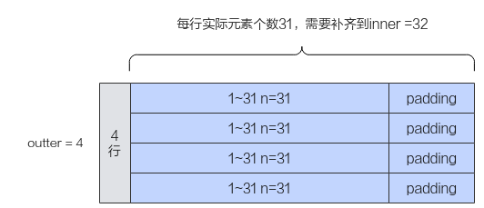
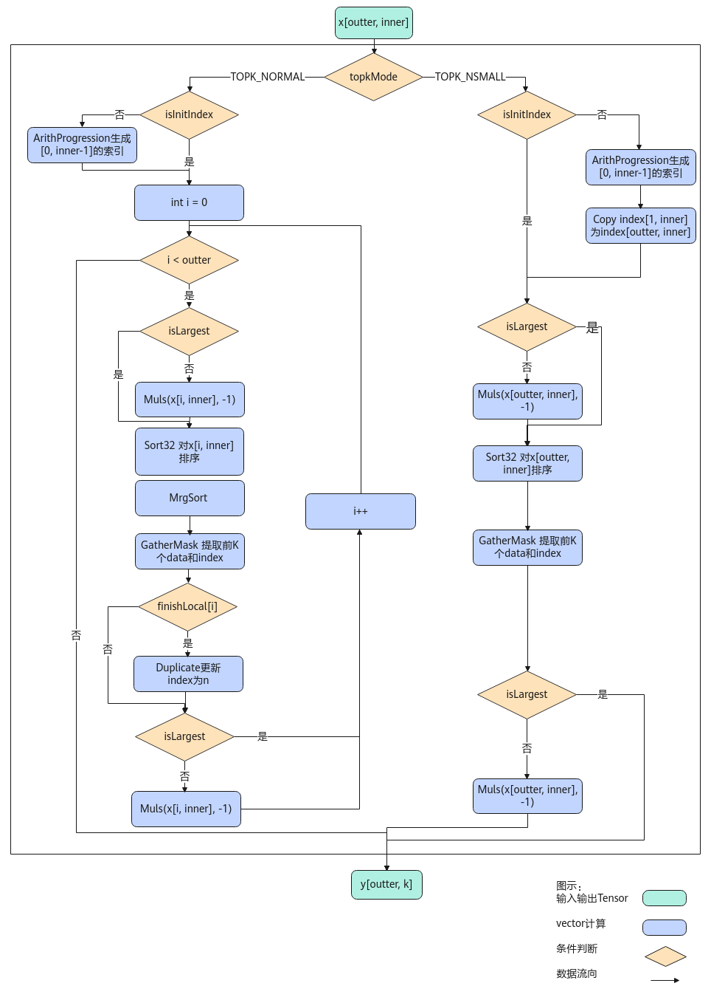

# TopK<a name="ZH-CN_TOPIC_0000001746624125"></a>

## AI处理器支持情况<a name="section1586581915393"></a>

<a name="table169596713360"></a>
<table><thead align="left"><tr id="row129590715369"><th class="cellrowborder" valign="top" width="57.99999999999999%" id="mcps1.1.3.1.1"><p id="p17959971362"><a name="p17959971362"></a><a name="p17959971362"></a><span id="ph895914718367"><a name="ph895914718367"></a><a name="ph895914718367"></a>AI处理器类型</span></p>
</th>
<th class="cellrowborder" align="center" valign="top" width="42%" id="mcps1.1.3.1.2"><p id="p89594763612"><a name="p89594763612"></a><a name="p89594763612"></a>是否支持</p>
</th>
</tr>
</thead>
<tbody><tr id="row18959157103612"><td class="cellrowborder" valign="top" width="57.99999999999999%" headers="mcps1.1.3.1.1 "><p id="p13959117193618"><a name="p13959117193618"></a><a name="p13959117193618"></a><span id="ph9959117173614"><a name="ph9959117173614"></a><a name="ph9959117173614"></a><term id="zh-cn_topic_0000001312391781_term1253731311225"><a name="zh-cn_topic_0000001312391781_term1253731311225"></a><a name="zh-cn_topic_0000001312391781_term1253731311225"></a>Ascend 910C</term></span></p>
</td>
<td class="cellrowborder" align="center" valign="top" width="42%" headers="mcps1.1.3.1.2 "><p id="p1095914793613"><a name="p1095914793613"></a><a name="p1095914793613"></a>√</p>
</td>
</tr>
<tr id="row89591478362"><td class="cellrowborder" valign="top" width="57.99999999999999%" headers="mcps1.1.3.1.1 "><p id="p7959157163619"><a name="p7959157163619"></a><a name="p7959157163619"></a><span id="ph1995997193619"><a name="ph1995997193619"></a><a name="ph1995997193619"></a><term id="zh-cn_topic_0000001312391781_term11962195213215"><a name="zh-cn_topic_0000001312391781_term11962195213215"></a><a name="zh-cn_topic_0000001312391781_term11962195213215"></a>Ascend 910B</term></span></p>
</td>
<td class="cellrowborder" align="center" valign="top" width="42%" headers="mcps1.1.3.1.2 "><p id="p149598793615"><a name="p149598793615"></a><a name="p149598793615"></a>√</p>
</td>
</tr>
</tbody>
</table>

## 功能说明<a name="section618mcpsimp"></a>

获取最后一个维度的前k个最大值或最小值及其对应的索引。

如果输入是向量，则在向量中找到前k个最大值或最小值及其对应的索引；如果输入是矩阵，则沿最后一个维度计算每行中前k个最大值或最小值及其对应的索引。**本接口最多支持输入为二维数据，不支持更高维度的输入。**

如下图所示，对shape为\(4, 32\)的二维矩阵进行排序，k设置为1，输出结果为\[\[32\] \[32\] \[32\] \[32\]\]。


-   **必备概念**

    基于如上样例，我们引入一些必备概念：行数称之为**外轴长度（outter）**，每行实际的元素个数称之为**内轴的实际长度（n）**。本接口要求输入的内轴长度为32的整数倍，所以当n不是32的整数倍时，需要开发者将其向上补齐到32的整数倍，补齐后的长度称之为**内轴长度（inner）**。比如，如下的样例中，每行的实际长度n为31，不是32的整数倍，向上补齐后得到inner为32，图中的padding代表补齐操作。n和inner的关系如下：当n是32的整数倍时，inner=n；否则，inner \> n。

    

-   **接口模式**

    本接口支持两种模式：**Normal模式**和**Small模式**。Normal模式是通用模式；Small模式是为内轴长度固定为32（单位：元素个数）的场景提供的高性能模式。因为Small模式inner固定为32，可以进行更有针对性的处理，所以相关的约束较少，性能较高。内轴长度inner为32时建议使用Small模式。

-   **附加功能**：本接口支持开发者指定某些行的排序是无效排序。通过传入finishLocal参数值来控制，finishLocal对应行的值为true时，表示该行排序无效，此时排序后输出的dstIndexLocal的k个索引值会全部被置为无效索引n。

    

## 实现原理<a name="section13229175017585"></a>

-   **MERGE\_SORT算法**

    以float类型，ND格式，shape为\[outter,  inner\]的输入Tensor为例，描述TopK高阶API内部算法框图，如下图所示。

    **图 1**  TopK算法框图<a name="fig19454111161219"></a>  
    

    根据TopKMode不同的模式选择，可分为两个分支。

    -   计算TopK NORMAL模式，过程如下：
        1.  模板参数isInitIndex为false，需生成0到inner - 1的索引；

            Ascend 910C采用方式二。

            Ascend 910B采用方式二。

            -   方式一：使用CreateVecIndex生成0到inner - 1的索引。
            -   方式二：使用Arange生成0到inner - 1的索引。

        2.  isLargest参数为false，由于Sort32指令默认为降序排序，则给数据乘以-1；
        3.  对输入数据完成全排序。

            Ascend 910C采用方式二。

            Ascend 910B采用方式二。

            方式一：

            使用高阶API Sort对数据完成全排序。

            方式二：

            1.  使用Sort32对数据排序，保证每32个数据是有序的。
            2.  使用MrgSort指令对所有的已排序数据块归并排序。

        4.  使用GatherMask指令提取前k个数据和索引；
        5.  finishLocal\[i\]为true时，则更新该行对应的排序结果为无效索引n；
        6.  isLargest参数为false，则给数据乘以-1还原数据。

    -   计算TopK SMALL模式，过程如下：
        1.  模板参数isInitIndex为false，需生成0到inner - 1的索引，并使用Copy指令将数据复制为outter条；

            Ascend 910C采用方式二。

            Ascend 910B采用方式二。

            -   方式一：使用CreateVecIndex生成0到inner - 1的索引。
            -   方式二：使用Arange生成0到inner - 1的索引。

        2.  isLargest参数为false，由于Sort32指令默认为降序排序，则给输入数据乘以-1；
        3.  使用Sort32对数据排序；
        4.  使用GatherMask指令提取前k个数据和索引；
        5.  isLargest参数为false，则给输入数据乘以-1还原数据。

## 函数原型<a name="section620mcpsimp"></a>

-   API内部申请临时空间

    ```
    template <typename T, bool isInitIndex = false, bool isHasfinish = false, bool isReuseSrc = false, enum TopKMode topkMode = TopKMode::TOPK_NORMAL>
    __aicore__ inline void TopK(const LocalTensor<T> &dstValueLocal, const LocalTensor<int32_t> &dstIndexLocal, const LocalTensor<T> &srcLocal, const LocalTensor<int32_t> &srcIndexLocal, const LocalTensor<bool> &finishLocal, const int32_t k, const TopkTiling &tilling, const TopKInfo &topKInfo, const bool isLargest = true)
    ```

-   通过tmpLocal入参传入临时空间

    ```
    template <typename T, bool isInitIndex = false, bool isHasfinish = false, bool isReuseSrc = false, enum TopKMode topkMode = TopKMode::TOPK_NORMAL>
    __aicore__ inline void TopK(const LocalTensor<T> &dstValueLocal, const LocalTensor<int32_t> &dstIndexLocal, const LocalTensor<T> &srcLocal, const LocalTensor<int32_t> &srcIndexLocal, const LocalTensor<bool> &finishLocal, const LocalTensor<uint8_t> &tmpLocal, const int32_t k, const TopkTiling &tilling, const TopKInfo &topKInfo, const bool isLargest = true)
    ```

由于该接口的内部实现中涉及复杂的逻辑计算，需要额外的临时空间来存储计算过程中的中间变量。临时空间支持**API接口申请**和开发者**通过tmpLocal入参传入**两种方式。

-   API接口内部申请临时空间，开发者无需申请，但是需要预留临时空间的大小。

-   通过tmpLocal入参传入，使用该tensor作为临时空间进行处理，API接口内部不再申请。该方式开发者可以自行管理tmpLocal内存空间，并在接口调用完成后，复用该部分内存，内存不会反复申请释放，灵活性较高，内存利用率也较高。临时空间大小tmpLocal的BufferSize的获取方式如下：通过[TopK Tiling](TopK-Tiling.md)中提供的GetTopKMaxMinTmpSize接口获取所需最大和最小临时空间大小。

## 参数说明<a name="section622mcpsimp"></a>

**表 1**  模板参数说明

<a name="table729818506422"></a>
<table><thead align="left"><tr id="row11299950204217"><th class="cellrowborder" valign="top" width="19.18%" id="mcps1.2.3.1.1"><p id="p1029955044218"><a name="p1029955044218"></a><a name="p1029955044218"></a>参数名</p>
</th>
<th class="cellrowborder" valign="top" width="80.82000000000001%" id="mcps1.2.3.1.2"><p id="p1629911506421"><a name="p1629911506421"></a><a name="p1629911506421"></a>描述</p>
</th>
</tr>
</thead>
<tbody><tr id="row12299165018421"><td class="cellrowborder" valign="top" width="19.18%" headers="mcps1.2.3.1.1 "><p id="p1329915004219"><a name="p1329915004219"></a><a name="p1329915004219"></a>T</p>
</td>
<td class="cellrowborder" valign="top" width="80.82000000000001%" headers="mcps1.2.3.1.2 "><p id="p8299155010420"><a name="p8299155010420"></a><a name="p8299155010420"></a>待排序数据的数据类型。</p>
<p id="p103633814478"><a name="p103633814478"></a><a name="p103633814478"></a><span id="ph183683884711"><a name="ph183683884711"></a><a name="ph183683884711"></a><term id="zh-cn_topic_0000001312391781_term1253731311225_4"><a name="zh-cn_topic_0000001312391781_term1253731311225_4"></a><a name="zh-cn_topic_0000001312391781_term1253731311225_4"></a>Ascend 910C</term></span>，支持的数据类型为：half、float。</p>
<p id="p4369182010169"><a name="p4369182010169"></a><a name="p4369182010169"></a><span id="ph1136972016166"><a name="ph1136972016166"></a><a name="ph1136972016166"></a><term id="zh-cn_topic_0000001312391781_term11962195213215_4"><a name="zh-cn_topic_0000001312391781_term11962195213215_4"></a><a name="zh-cn_topic_0000001312391781_term11962195213215_4"></a>Ascend 910B</term></span>，支持的数据类型为：half、float。</p>
</td>
</tr>
<tr id="row5299125054217"><td class="cellrowborder" valign="top" width="19.18%" headers="mcps1.2.3.1.1 "><p id="p9777142884312"><a name="p9777142884312"></a><a name="p9777142884312"></a>isInitIndex</p>
</td>
<td class="cellrowborder" valign="top" width="80.82000000000001%" headers="mcps1.2.3.1.2 "><p id="p19292175415513"><a name="p19292175415513"></a><a name="p19292175415513"></a>是否传入输入数据的索引。</p>
<a name="ul7915120565"></a><a name="ul7915120565"></a><ul id="ul7915120565"><li>true表示传入，设置为true时，需要通过srcIndexLocal参数传入输入数据的索引，具体规则请参考<a href="#zh-cn_topic_0235751031_table33761356">表2</a>中的srcIndexLocal参数说明。</li><li>false表示不传入，TopK API输出的索引不可用。</li></ul>
</td>
</tr>
<tr id="row6777152811436"><td class="cellrowborder" valign="top" width="19.18%" headers="mcps1.2.3.1.1 "><p id="p23791451102416"><a name="p23791451102416"></a><a name="p23791451102416"></a>isHasfinish</p>
</td>
<td class="cellrowborder" valign="top" width="80.82000000000001%" headers="mcps1.2.3.1.2 "><p id="p161350818582"><a name="p161350818582"></a><a name="p161350818582"></a>Topk接口支持开发者通过finishLocal参数来指定某些行的排序是无效排序。该模板参数用于控制是否启用上述功能，true表示启用，false表示不启用。</p>
<p id="p122985135341"><a name="p122985135341"></a><a name="p122985135341"></a>Normal模式支持的取值：true / false。</p>
<p id="p16298513113415"><a name="p16298513113415"></a><a name="p16298513113415"></a>Small模式支持的取值：false。</p>
<p id="p38511725123711"><a name="p38511725123711"></a><a name="p38511725123711"></a>isHasfinish参数和finishLocal的配套使用方法请参考<a href="#zh-cn_topic_0235751031_table33761356">表2</a>中的finishLocal参数说明。</p>
</td>
</tr>
<tr id="row6563634154317"><td class="cellrowborder" valign="top" width="19.18%" headers="mcps1.2.3.1.1 "><p id="p1838644151511"><a name="p1838644151511"></a><a name="p1838644151511"></a>isReuseSrc</p>
</td>
<td class="cellrowborder" valign="top" width="80.82000000000001%" headers="mcps1.2.3.1.2 "><p id="p29241916122216"><a name="p29241916122216"></a><a name="p29241916122216"></a>是否允许修改源操作数。该参数预留，传入默认值false即可。</p>
</td>
</tr>
<tr id="row879611594513"><td class="cellrowborder" valign="top" width="19.18%" headers="mcps1.2.3.1.1 "><p id="p1575851105415"><a name="p1575851105415"></a><a name="p1575851105415"></a>topkMode</p>
</td>
<td class="cellrowborder" valign="top" width="80.82000000000001%" headers="mcps1.2.3.1.2 "><p id="p8299150154218"><a name="p8299150154218"></a><a name="p8299150154218"></a>Topk的模式选择，数据结构如下：</p>
<a name="screen4446124892020"></a><a name="screen4446124892020"></a><pre class="screen" codetype="Cpp" id="screen4446124892020">enum class TopKMode {
    TOPK_NORMAL, // Normal模式
    TOPK_NSMALL, // Small模式
};</pre>
</td>
</tr>
</tbody>
</table>

**表 2**  接口参数说明

<a name="zh-cn_topic_0235751031_table33761356"></a>
<table><thead align="left"><tr id="zh-cn_topic_0235751031_row27598891"><th class="cellrowborder" valign="top" width="17.77%" id="mcps1.2.4.1.1"><p id="zh-cn_topic_0235751031_p20917673"><a name="zh-cn_topic_0235751031_p20917673"></a><a name="zh-cn_topic_0235751031_p20917673"></a>参数名</p>
</th>
<th class="cellrowborder" valign="top" width="9.69%" id="mcps1.2.4.1.2"><p id="zh-cn_topic_0235751031_p16609919"><a name="zh-cn_topic_0235751031_p16609919"></a><a name="zh-cn_topic_0235751031_p16609919"></a>输入/输出</p>
</th>
<th class="cellrowborder" valign="top" width="72.54%" id="mcps1.2.4.1.3"><p id="zh-cn_topic_0235751031_p59995477"><a name="zh-cn_topic_0235751031_p59995477"></a><a name="zh-cn_topic_0235751031_p59995477"></a>描述</p>
</th>
</tr>
</thead>
<tbody><tr id="row42461942101815"><td class="cellrowborder" valign="top" width="17.77%" headers="mcps1.2.4.1.1 "><p id="p11111361284"><a name="p11111361284"></a><a name="p11111361284"></a>dstValueLocal</p>
</td>
<td class="cellrowborder" valign="top" width="9.69%" headers="mcps1.2.4.1.2 "><p id="p186293346150"><a name="p186293346150"></a><a name="p186293346150"></a>输出</p>
</td>
<td class="cellrowborder" valign="top" width="72.54%" headers="mcps1.2.4.1.3 "><p id="p9255193274511"><a name="p9255193274511"></a><a name="p9255193274511"></a>目的操作数。用于保存排序出的k个值。</p>
<p id="p16703131355116"><a name="p16703131355116"></a><a name="p16703131355116"></a><span id="zh-cn_topic_0000001530181537_ph173308471594"><a name="zh-cn_topic_0000001530181537_ph173308471594"></a><a name="zh-cn_topic_0000001530181537_ph173308471594"></a><span id="zh-cn_topic_0000001530181537_ph9902231466"><a name="zh-cn_topic_0000001530181537_ph9902231466"></a><a name="zh-cn_topic_0000001530181537_ph9902231466"></a><span id="zh-cn_topic_0000001530181537_ph1782115034816"><a name="zh-cn_topic_0000001530181537_ph1782115034816"></a><a name="zh-cn_topic_0000001530181537_ph1782115034816"></a>类型为<a href="LocalTensor.md">LocalTensor</a>，支持的TPosition为VECIN/VECCALC/VECOUT。</span></span></span></p>
<p id="p162253566717"><a name="p162253566717"></a><a name="p162253566717"></a>Normal模式：</p>
<a name="ul13700135912912"></a><a name="ul13700135912912"></a><ul id="ul13700135912912"><li>输出shape为outter * k_pad，即输出outter条数据，每条数据的长度是k_pad。k_pad是根据输入的数据类型将k向上32Byte对齐后的值。</li><li>开发者需要为dstValueLocal开辟k_pad * outter * sizeof(T)大小的空间。</li><li>输出每条数据的前k个值就是该条的前k个最大值/最小值。每条数据的k+1~k_pad个元素不填值，是一些随机值。</li><li>k_pad计算方式如下：<a name="screen10687418308"></a><a name="screen10687418308"></a><pre class="screen" codetype="Cpp" id="screen10687418308">if (sizeof(T) == sizeof(float)) {
    // 当输入的srcLocal和dstValueLocal的类型是float时，float是4字节，因此将k向上取整设置为8的倍数k_pad，即可满足32Byte对齐
    k_pad = (k + 7) / 8 * 8;
} else {
   // 当输入的srcLocal和dstValueLocal的类型是half时，half是2字节，因此将k向上取整设置为16的倍数k_pad，即可满足32Byte对齐
    k_pad = (k + 15) / 16 * 16;
}</pre>
</li></ul>
<p id="p167586433163"><a name="p167586433163"></a><a name="p167586433163"></a>Small模式：</p>
<a name="ul1161420340919"></a><a name="ul1161420340919"></a><ul id="ul1161420340919"><li>输出shape为outter * k，即输出outter条数据，每条数据的长度是k。</li><li>输出值需要k * outter * sizeof(T)大小的空间来进行保存。开发者要根据该大小和框架的对齐要求来为dstValueLocal分配实际的内存空间。<div class="note" id="note1209183922112"><a name="note1209183922112"></a><a name="note1209183922112"></a><span class="notetitle"> 说明： </span><div class="notebody"><p id="p88761455132117"><a name="p88761455132117"></a><a name="p88761455132117"></a><strong id="b13012162110"><a name="b13012162110"></a><a name="b13012162110"></a>此处需要注意：遵循框架对内存申请的要求（开辟内存的大小满足32Byte对齐），即k * outter * sizeof(T)不是32Byte对齐时，需要向上进行32Byte对齐。为了对齐而多开辟的内存空间不填值，为一些随机值。</strong></p>
</div></div>
</li></ul>
</td>
</tr>
<tr id="row35449913103"><td class="cellrowborder" valign="top" width="17.77%" headers="mcps1.2.4.1.1 "><p id="p23761850163013"><a name="p23761850163013"></a><a name="p23761850163013"></a>dstIndexLocal</p>
</td>
<td class="cellrowborder" valign="top" width="9.69%" headers="mcps1.2.4.1.2 "><p id="p13545169101012"><a name="p13545169101012"></a><a name="p13545169101012"></a>输出</p>
</td>
<td class="cellrowborder" valign="top" width="72.54%" headers="mcps1.2.4.1.3 "><p id="p1054516901013"><a name="p1054516901013"></a><a name="p1054516901013"></a>目的操作数。用于保存排序出的k个值对应的索引。</p>
<p id="p86635681012"><a name="p86635681012"></a><a name="p86635681012"></a><span id="zh-cn_topic_0000001530181537_ph173308471594_1"><a name="zh-cn_topic_0000001530181537_ph173308471594_1"></a><a name="zh-cn_topic_0000001530181537_ph173308471594_1"></a><span id="zh-cn_topic_0000001530181537_ph9902231466_1"><a name="zh-cn_topic_0000001530181537_ph9902231466_1"></a><a name="zh-cn_topic_0000001530181537_ph9902231466_1"></a><span id="zh-cn_topic_0000001530181537_ph1782115034816_1"><a name="zh-cn_topic_0000001530181537_ph1782115034816_1"></a><a name="zh-cn_topic_0000001530181537_ph1782115034816_1"></a>类型为<a href="LocalTensor.md">LocalTensor</a>，支持的TPosition为VECIN/VECCALC/VECOUT。</span></span></span></p>
<p id="p151152611193"><a name="p151152611193"></a><a name="p151152611193"></a>Normal模式：</p>
<a name="ul2052944883614"></a><a name="ul2052944883614"></a><ul id="ul2052944883614"><li>输出shape为outter *kpad_index，即输出outter条数据，每条数据的长度是kpad_index。kpad_index是根据输入的索引类型将k向上32Byte对齐后的值。</li><li>开发者需要为dstIndexLocal开辟kpad_index * outter * sizeof(int32_t)大小的空间。</li><li>其中每条数据的前k个值就是该条的前k个最大值/最小值对应的索引。每条数据的k+1~kpad_index个索引不填值，是一些随机值。</li><li>k_pad计算方式如下：<a name="screen377304363917"></a><a name="screen377304363917"></a><pre class="screen" codetype="Cpp" id="screen377304363917">// 由于dstIndexLocal是int32_t类型，是4字节。因此将k向上取整设置为8的倍数kpad_index，即可满足32Byte对齐
kpad_index = (k + 7) / 8 * 8;</pre>
</li></ul>
<p id="p51211853101816"><a name="p51211853101816"></a><a name="p51211853101816"></a>Small模式：</p>
<a name="ul194291017181910"></a><a name="ul194291017181910"></a><ul id="ul194291017181910"><li>输出shape为outter *k，即输出outter条数据，每条数据的长度是k。</li><li>输出索引需要k * outter * sizeof(int32_t)大小的空间来进行保存。开发者要根据该大小和框架的对齐要求来为dstIndexLocal分配实际的内存空间。<div class="note" id="note12620157122515"><a name="note12620157122515"></a><a name="note12620157122515"></a><span class="notetitle"> 说明： </span><div class="notebody"><p id="p1962012573256"><a name="p1962012573256"></a><a name="p1962012573256"></a><strong id="b26211557122513"><a name="b26211557122513"></a><a name="b26211557122513"></a>注意：遵循框架对内存开辟的要求（开辟内存的大小满足32Byte对齐），即k * outter * sizeof(int32_t)不是32Byte对齐时，需要向上进行32Byte对齐。为了对齐而多开辟的内存空间不填值，为一些随机值。</strong></p>
</div></div>
</li></ul>
</td>
</tr>
<tr id="row250163914199"><td class="cellrowborder" valign="top" width="17.77%" headers="mcps1.2.4.1.1 "><p id="p7123131611117"><a name="p7123131611117"></a><a name="p7123131611117"></a>srcLocal</p>
</td>
<td class="cellrowborder" valign="top" width="9.69%" headers="mcps1.2.4.1.2 "><p id="p1662903414157"><a name="p1662903414157"></a><a name="p1662903414157"></a>输入</p>
</td>
<td class="cellrowborder" valign="top" width="72.54%" headers="mcps1.2.4.1.3 "><p id="p963863814519"><a name="p963863814519"></a><a name="p963863814519"></a>源操作数。用于保存待排序的值。</p>
<p id="p15450144034510"><a name="p15450144034510"></a><a name="p15450144034510"></a><span id="zh-cn_topic_0000001530181537_ph173308471594_2"><a name="zh-cn_topic_0000001530181537_ph173308471594_2"></a><a name="zh-cn_topic_0000001530181537_ph173308471594_2"></a><span id="zh-cn_topic_0000001530181537_ph9902231466_2"><a name="zh-cn_topic_0000001530181537_ph9902231466_2"></a><a name="zh-cn_topic_0000001530181537_ph9902231466_2"></a><span id="zh-cn_topic_0000001530181537_ph1782115034816_2"><a name="zh-cn_topic_0000001530181537_ph1782115034816_2"></a><a name="zh-cn_topic_0000001530181537_ph1782115034816_2"></a>类型为<a href="LocalTensor.md">LocalTensor</a>，支持的TPosition为VECIN/VECCALC/VECOUT。</span></span></span></p>
</td>
</tr>
<tr id="row13701180141016"><td class="cellrowborder" valign="top" width="17.77%" headers="mcps1.2.4.1.1 "><p id="p4701100141020"><a name="p4701100141020"></a><a name="p4701100141020"></a>srcIndexLocal</p>
</td>
<td class="cellrowborder" valign="top" width="9.69%" headers="mcps1.2.4.1.2 "><p id="p127013010103"><a name="p127013010103"></a><a name="p127013010103"></a>输入</p>
</td>
<td class="cellrowborder" valign="top" width="72.54%" headers="mcps1.2.4.1.3 "><p id="p7691538141611"><a name="p7691538141611"></a><a name="p7691538141611"></a>源操作数。用于保存待排序的值对应的索引。</p>
<p id="p1069143851618"><a name="p1069143851618"></a><a name="p1069143851618"></a><span id="zh-cn_topic_0000001530181537_ph173308471594_3"><a name="zh-cn_topic_0000001530181537_ph173308471594_3"></a><a name="zh-cn_topic_0000001530181537_ph173308471594_3"></a><span id="zh-cn_topic_0000001530181537_ph9902231466_3"><a name="zh-cn_topic_0000001530181537_ph9902231466_3"></a><a name="zh-cn_topic_0000001530181537_ph9902231466_3"></a><span id="zh-cn_topic_0000001530181537_ph1782115034816_3"><a name="zh-cn_topic_0000001530181537_ph1782115034816_3"></a><a name="zh-cn_topic_0000001530181537_ph1782115034816_3"></a>类型为<a href="LocalTensor.md">LocalTensor</a>，支持的TPosition为VECIN/VECCALC/VECOUT。</span></span></span></p>
<p id="p1359032122115"><a name="p1359032122115"></a><a name="p1359032122115"></a>该参数和模板参数isInitIndex配合使用，isInitIndex为false时，srcIndexLocal只需进行定义，不需要赋值，将定义后的srcIndexLocal传入接口即可；isInitIndex为true时，开发者需要通过srcIndexLocal参数传入索引值。srcIndexLocal参数设置的规则如下：</p>
<p id="p122093436425"><a name="p122093436425"></a><a name="p122093436425"></a>Normal模式：</p>
<a name="ul14106151509"></a><a name="ul14106151509"></a><ul id="ul14106151509"><li>输入索引数据的shape为1 * inner， 此处outter条数据都使用相同的索引。开发者需要为其开辟inner * sizeof(int32_t)大小的空间。</li></ul>
<a name="ul517434416429"></a><a name="ul517434416429"></a><ul id="ul517434416429"><li>当n &lt; inner时，开发者需要对索引数据进行补齐操作，将该条数据从n补齐到inner长度。</li><li>补齐的规则：要求填充的索引不能影响整体排序。建议使用如下的填充方法：填充的值在原始索引的基础上递增。例如，原始索引为0，1，2，...，n-1，填充后的索引为 0，1，2，...， n ，n + 1，...，inner-1。</li></ul>
<p id="p11726193018223"><a name="p11726193018223"></a><a name="p11726193018223"></a>Small模式：</p>
<a name="ul7935134014319"></a><a name="ul7935134014319"></a><ul id="ul7935134014319"><li>输入索引数据的shape为outter * inner。开发者需要为其开辟outter * inner * sizeof(int32_t)大小的空间。</li><li>当n &lt; 32时，开发者需要对outter条数据进行补齐操作，每条数据都需要从n补齐到32的长度。</li><li>补齐的规则：要求填充的数据不能影响整体排序。建议使用如下的填充方法：填充的值在原始索引的基础上递增例如，原始索引为0，1，2，...，n-1，填充后的索引为0， 1，2，...， n ，n + 1，...，inner-1。</li></ul>
</td>
</tr>
<tr id="row041413392198"><td class="cellrowborder" valign="top" width="17.77%" headers="mcps1.2.4.1.1 "><p id="p4630634141515"><a name="p4630634141515"></a><a name="p4630634141515"></a>finishLocal</p>
</td>
<td class="cellrowborder" valign="top" width="9.69%" headers="mcps1.2.4.1.2 "><p id="p263018345154"><a name="p263018345154"></a><a name="p263018345154"></a>输入</p>
</td>
<td class="cellrowborder" valign="top" width="72.54%" headers="mcps1.2.4.1.3 "><p id="p13630123491515"><a name="p13630123491515"></a><a name="p13630123491515"></a>源操作数。用于指定某些行的排序是无效排序，其shape为(outter, 1)。</p>
<p id="p1071842161817"><a name="p1071842161817"></a><a name="p1071842161817"></a>类型为<a href="LocalTensor.md">LocalTensor</a>，支持的TPosition为VECIN/VECCALC/VECOUT。</p>
<p id="p079413256378"><a name="p079413256378"></a><a name="p079413256378"></a>该参数和模板参数isHasfinish配合使用，Normal模式下支持isHasfinish配置为true/false，Small模式下仅支持isHasfinish配置为false。</p>
<a name="ul1221593373814"></a><a name="ul1221593373814"></a><ul id="ul1221593373814"><li>isHasfinish配置为true<a name="ul1195653173913"></a><a name="ul1195653173913"></a><ul id="ul1195653173913"><li>finishLocal对应的outter行的值为true时，该行排序无效，排序后输出的dstIndexLocal的k个索引值会全部被置为n。</li><li>finishLocal对应的outter行的值为false时，该行排序有效。</li></ul>
</li></ul>
<a name="ul1379340302"></a><a name="ul1379340302"></a><ul id="ul1379340302"><li>isHasfinish配置为false时，finishLocal只需进行定义，不需要赋值，将定义后的finishLocal传入接口即可。定义样例如下：<a name="screen1345242211413"></a><a name="screen1345242211413"></a><pre class="screen" codetype="Cpp" id="screen1345242211413">LocalTensor&lt;bool&gt; finishLocal;</pre>
</li></ul>
</td>
</tr>
<tr id="row08222541540"><td class="cellrowborder" valign="top" width="17.77%" headers="mcps1.2.4.1.1 "><p id="p1358462510237"><a name="p1358462510237"></a><a name="p1358462510237"></a>tmpLocal</p>
</td>
<td class="cellrowborder" valign="top" width="9.69%" headers="mcps1.2.4.1.2 "><p id="p15584152512313"><a name="p15584152512313"></a><a name="p15584152512313"></a>输入</p>
</td>
<td class="cellrowborder" valign="top" width="72.54%" headers="mcps1.2.4.1.3 "><p id="p155841325182310"><a name="p155841325182310"></a><a name="p155841325182310"></a>临时空间。接口内部复杂计算时用于存储中间变量，由开发者提供，临时空间大小的获取方式请参考<a href="TopK-Tiling.md">TopK Tiling</a>。数据类型固定uint8_t。</p>
<p id="p5983205412394"><a name="p5983205412394"></a><a name="p5983205412394"></a>类型为<a href="LocalTensor.md">LocalTensor</a>，<strong id="b59111328115018"><a name="b59111328115018"></a><a name="b59111328115018"></a>逻辑位置仅支持VECCALC，不支持其他逻辑位置</strong>。</p>
</td>
</tr>
<tr id="row14529138068"><td class="cellrowborder" valign="top" width="17.77%" headers="mcps1.2.4.1.1 "><p id="p125291038365"><a name="p125291038365"></a><a name="p125291038365"></a>k</p>
</td>
<td class="cellrowborder" valign="top" width="9.69%" headers="mcps1.2.4.1.2 "><p id="p155291338468"><a name="p155291338468"></a><a name="p155291338468"></a>输入</p>
</td>
<td class="cellrowborder" valign="top" width="72.54%" headers="mcps1.2.4.1.3 "><p id="p1852917382617"><a name="p1852917382617"></a><a name="p1852917382617"></a>获取前k个最大值或最小值及其对应的索引。数据类型为int32_t。</p>
<p id="p911317316106"><a name="p911317316106"></a><a name="p911317316106"></a>k的大小应该满足：1 &lt;= k &lt;= n。</p>
</td>
</tr>
<tr id="row78841441613"><td class="cellrowborder" valign="top" width="17.77%" headers="mcps1.2.4.1.1 "><p id="p1718413612419"><a name="p1718413612419"></a><a name="p1718413612419"></a>tilling</p>
</td>
<td class="cellrowborder" valign="top" width="9.69%" headers="mcps1.2.4.1.2 "><p id="p318414366419"><a name="p318414366419"></a><a name="p318414366419"></a>输入</p>
</td>
<td class="cellrowborder" valign="top" width="72.54%" headers="mcps1.2.4.1.3 "><p id="p818410361440"><a name="p818410361440"></a><a name="p818410361440"></a>Topk计算所需Tiling信息，Tiling信息的获取请参考<a href="TopK-Tiling.md">TopK Tiling</a>。</p>
</td>
</tr>
<tr id="row29693321286"><td class="cellrowborder" valign="top" width="17.77%" headers="mcps1.2.4.1.1 "><p id="p952881121013"><a name="p952881121013"></a><a name="p952881121013"></a>topKInfo</p>
</td>
<td class="cellrowborder" valign="top" width="9.69%" headers="mcps1.2.4.1.2 "><p id="p1296933213814"><a name="p1296933213814"></a><a name="p1296933213814"></a>输入</p>
</td>
<td class="cellrowborder" valign="top" width="72.54%" headers="mcps1.2.4.1.3 "><p id="p49691232086"><a name="p49691232086"></a><a name="p49691232086"></a>srcLocal的shape信息。TopKInfo类型，具体定义如下：</p>
<a name="screen641172125916"></a><a name="screen641172125916"></a><pre class="screen" codetype="Cpp" id="screen641172125916">struct TopKInfo {
    int32_t outter = 1;    // 表示输入待排序数据的外轴长度
    int32_t inner;         // 表示输入待排序数据的内轴长度，inner必须是32的整数倍
    int32_t n;             // 表示输入待排序数据的内轴的实际长度
};</pre>
<a name="ul19603810111110"></a><a name="ul19603810111110"></a><ul id="ul19603810111110"><li>topKInfo.inner必须是32的整数倍。</li><li>topKInfo.inner是topKInfo.n进行32的整数倍向上补齐的值，因此topKInfo.n的大小应该满足：1 &lt;= topKInfo.n &lt;= topKInfo.inner。</li><li>Small模式下，topKInfo.inner必须设置为32。</li><li>Normal模式下，topKInfo.inner最大值为4096。</li></ul>
</td>
</tr>
<tr id="row342820503613"><td class="cellrowborder" valign="top" width="17.77%" headers="mcps1.2.4.1.1 "><p id="p9428175013613"><a name="p9428175013613"></a><a name="p9428175013613"></a>isLargest</p>
</td>
<td class="cellrowborder" valign="top" width="9.69%" headers="mcps1.2.4.1.2 "><p id="p114286506619"><a name="p114286506619"></a><a name="p114286506619"></a>输入</p>
</td>
<td class="cellrowborder" valign="top" width="72.54%" headers="mcps1.2.4.1.3 "><p id="p1442814501868"><a name="p1442814501868"></a><a name="p1442814501868"></a>类型为bool。取值为true时默认降序排列，获取前k个最大值；取值为false时进行升序排列，获取前k个最小值。</p>
</td>
</tr>
</tbody>
</table>

## 返回值说明<a name="section640mcpsimp"></a>

无

## 约束说明<a name="section633mcpsimp"></a>

-   操作数地址偏移对齐要求请参见[通用说明和约束](通用说明和约束.md)。
-   **不支持源操作数与目的操作数地址重叠。**
-   当存在srcLocal\[i\]与srcLocal\[j\]相同时，如果i\>j，则srcLocal\[j\]将首先被选出来，排在前面。
-   inf在Topk中被认为是极大值。
-   nan在topk中排序时无论是降序还是升序，均被排在前面。

## 调用示例<a name="section94691236101419"></a>

本样例实现了Normal模式和Small模式的代码逻辑。

```
if (!tmpLocal) {  // 是否通过tmpLocal入参传入临时空间
    if (isSmallMode) { // Small模式
        AscendC::TopK<T, isInitIndex, isHasfinish, isReuseSrc, AscendC::TopKMode::TOPK_NSMALL>(dstLocalValue,
            dstLocalIndex, srcLocalValue, srcLocalIndex, srcLocalFinish, k, topKTilingData, topKInfo, isLargest);
    } else {
        AscendC::TopK<T, isInitIndex, isHasfinish, isReuseSrc, AscendC::TopKMode::TOPK_NORMAL>(dstLocalValue,
            dstLocalIndex, srcLocalValue, srcLocalIndex, srcLocalFinish, k, topKTilingData, topKInfo, isLargest);
    }
} else {
    if (tmplocalBytes % 32 != 0) {
        tmplocalBytes = (tmplocalBytes + 31) / 32 * 32;
    }
    pipe.InitBuffer(tmplocalBuf, tmplocalBytes);
    AscendC::LocalTensor<uint8_t> tmplocalTensor = tmplocalBuf.Get<uint8_t>();
    if (isSmallMode) {
        AscendC::TopK<T, isInitIndex, isHasfinish, isReuseSrc, AscendC::TopKMode::TOPK_NSMALL>(dstLocalValue,
            dstLocalIndex, srcLocalValue, srcLocalIndex, srcLocalFinish, tmplocalTensor, k, topKTilingData, topKInfo, isLargest);
    } else {
        AscendC::TopK<T, isInitIndex, isHasfinish, isReuseSrc, AscendC::TopKMode::TOPK_NORMAL>(dstLocalValue,
            dstLocalIndex, srcLocalValue, srcLocalIndex, srcLocalFinish, tmplocalTensor, k, topKTilingData, topKInfo, isLargest);
    }
}
```

**表 3**  Normal模式的样例解析

<a name="table996924172412"></a>
<table><tbody><tr id="row478291510351"><th class="firstcol" valign="top" width="10.38%" id="mcps1.2.3.1.1"><p id="p6782131518353"><a name="p6782131518353"></a><a name="p6782131518353"></a><strong id="b11781713364"><a name="b11781713364"></a><a name="b11781713364"></a>样例描述</strong></p>
</th>
<td class="cellrowborder" valign="top" width="89.62%" headers="mcps1.2.3.1.1 "><p id="p157834157358"><a name="p157834157358"></a><a name="p157834157358"></a>本样例为对shape为（2，32）、数据类型为float的矩阵进行排序的示例，分别求取每行数据的前5个最小值。</p>
<p id="p2966172853911"><a name="p2966172853911"></a><a name="p2966172853911"></a>使用Normal模式的接口，开发者自行传入输入数据索引，传入finishLocal来指定某些行的排序是无效排序。</p>
</td>
</tr>
<tr id="row696424112416"><th class="firstcol" valign="top" width="10.38%" id="mcps1.2.3.2.1"><p id="p1960247246"><a name="p1960247246"></a><a name="p1960247246"></a><strong id="b17311817183614"><a name="b17311817183614"></a><a name="b17311817183614"></a>输入</strong></p>
</th>
<td class="cellrowborder" valign="top" width="89.62%" headers="mcps1.2.3.2.1 "><a name="ul14397183252617"></a><a name="ul14397183252617"></a><ul id="ul14397183252617"><li>模板参数T：float</li><li>模板参数isInitIndex：true</li><li>模板参数isHasfinish：true</li><li>模板参数topkMode：TopKMode::TOPK_NORMAL</li><li>输入数据finishLocal：<a name="screen113621594218"></a><a name="screen113621594218"></a><pre class="screen" codetype="ColdFusion" id="screen113621594218">[False  True  False  False False False  False False False  False False False 
 False  False False False False False False False False False False False 
 False False False False False False False False]</pre>
<p id="p12166215265"><a name="p12166215265"></a><a name="p12166215265"></a><strong id="b11462131892710"><a name="b11462131892710"></a><a name="b11462131892710"></a>注意：DataCopy的搬运量要求为32byte的倍数，因此此处finishLocal的实际有效输入是前两位False，True，剩余的值都是进行32bytes向上补齐的值，并不实际参与计算。</strong></p>
</li><li>输入数据k：5</li><li>输入数据topKInfo：<a name="screen12873114522818"></a><a name="screen12873114522818"></a><pre class="screen" codetype="Cpp" id="screen12873114522818">struct TopKInfo {
    int32_t outter = 2;
    int32_t inner = 32;
    int32_t n = 32;
};</pre>
</li><li>输入数据isLargest：false</li><li>输入数据srcLocal：<a name="screen4728105019304"></a><a name="screen4728105019304"></a><pre class="screen" codetype="ColdFusion" id="screen4728105019304">[[-18096.555   -11389.83    -43112.895   -21344.77     57755.918
   50911.145    24912.621   -12683.089    45088.004   -39351.043
  -30153.293    11478.329    12069.15     -9215.71     45716.44
  -21472.398   -37372.16    -17460.414    22498.03     21194.838
  -51229.17    -51721.918   -47510.38     47899.11     43008.176
    5495.8975  -24176.97    -14308.27     53950.695     7652.6035
  -45169.168   -26275.518  ]
 [ -9196.681   -31549.518    18589.23    -12427.927    50491.81
  -20078.11    -25606.107   -34466.773   -42512.805    50584.48
   35919.934   -17283.5       6488.137   -12885.134     1942.2147
  -50611.96     52671.477    23179.662    25814.875      -69.73492
   33906.797   -34662.61     46168.71    -52391.258    57435.332
   50269.414    40935.05     21164.176     4028.458   -29022.918
  -46391.133     1971.2042 ]]</pre>
</li><li>输入数据srcIndexLocal：<a name="screen77188293119"></a><a name="screen77188293119"></a><pre class="screen" codetype="ColdFusion" id="screen77188293119">[ 0  1  2  3  4  5  6  7  8  9 10 11 12 13 14 15 16 17 18 19 20 21 22 23
 24 25 26 27 28 29 30 31]</pre>
</li></ul>
</td>
</tr>
<tr id="row49612419241"><th class="firstcol" valign="top" width="10.38%" id="mcps1.2.3.3.1"><p id="p89642418248"><a name="p89642418248"></a><a name="p89642418248"></a><strong id="b184341717362"><a name="b184341717362"></a><a name="b184341717362"></a>输出数据</strong></p>
</th>
<td class="cellrowborder" valign="top" width="89.62%" headers="mcps1.2.3.3.1 "><a name="ul86101536174220"></a><a name="ul86101536174220"></a><ul id="ul86101536174220"><li>输出数据dstValueLocal如下，每行长度是k_pad，其中每条数据的前5个值就是该条的前5个最小值。后面的三个值是随机值。<a name="screen5111458423"></a><a name="screen5111458423"></a><pre class="screen" codetype="ColdFusion" id="screen5111458423">[[-51721.918 -51229.17  -47510.38  -45169.168 -43112.895     0.     0.   0.   ]
 [-52391.258 -50611.96  -46391.133 -42512.805 -34662.61      0.     0.   0.   ]]</pre>
</li><li>输出数据dstIndexLocal如下<a name="ul1535351515413"></a><a name="ul1535351515413"></a><ul id="ul1535351515413"><li>每行长度是kpad_index，其中每条数据的前5个值就是该条的前5个最小值对应的索引。后面的三个值是随机值。</li><li>由于第二行数据对应的finishLocal为true，说明第二行数据的排序是无效的，所以其输出的索引值均为内轴实际长度32。<a name="screen423754717441"></a><a name="screen423754717441"></a><pre class="screen" codetype="ColdFusion" id="screen423754717441">[[21 20 22 30  2  0  0  0]
 [32 32 32 32 32  0  0  0]]</pre>
</li></ul>
</li></ul>
</td>
</tr>
</tbody>
</table>

**表 4**  Small模式的样例解析

<a name="table8987112420471"></a>
<table><tbody><tr id="row19988122414477"><th class="firstcol" valign="top" width="10.38%" id="mcps1.2.3.1.1"><p id="p19988192444719"><a name="p19988192444719"></a><a name="p19988192444719"></a><strong id="b1998892484710"><a name="b1998892484710"></a><a name="b1998892484710"></a>样例描述</strong></p>
</th>
<td class="cellrowborder" valign="top" width="89.62%" headers="mcps1.2.3.1.1 "><p id="p132081971211"><a name="p132081971211"></a><a name="p132081971211"></a>本样例为对shape为(4，17)、类型为float的输入数据进行排序的示例，求取每行数据的前8个最大值。</p>
<p id="p39971436426"><a name="p39971436426"></a><a name="p39971436426"></a>使用Small模式的接口，开发者自行传入输入数据索引。</p>
</td>
</tr>
<tr id="row19881324194716"><th class="firstcol" valign="top" width="10.38%" id="mcps1.2.3.2.1"><p id="p59881724144715"><a name="p59881724144715"></a><a name="p59881724144715"></a><strong id="b4988124174713"><a name="b4988124174713"></a><a name="b4988124174713"></a>输入</strong></p>
</th>
<td class="cellrowborder" valign="top" width="89.62%" headers="mcps1.2.3.2.1 "><a name="ul1621931994818"></a><a name="ul1621931994818"></a><ul id="ul1621931994818"><li>模板参数T：float</li><li>模板参数isInitIndex：true</li><li>模板参数isHasfinish：false</li><li>模板参数topkMode：TopKMode::TOPK_NSMALL</li><li>输入数据finishLocal: LocalTensor&lt;bool&gt; finishLocal，不需要赋值</li><li>输入数据k：8</li><li>输入数据topKInfo：<a name="screen12643120185011"></a><a name="screen12643120185011"></a><pre class="screen" codetype="Cpp" id="screen12643120185011">struct TopKInfo {
    int32_t outter = 4;
    int32_t inner = 32;
    int32_t n = 17;
};</pre>
</li><li>输入数据isLargest：true</li><li>输入数据srcLocal：此处n=17，不是32的整数倍时，将其向上补齐到32，填充内容为-inf。<a name="screen115093914515"></a><a name="screen115093914515"></a><pre class="screen" codetype="ColdFusion" id="screen115093914515">[[ 55492.18     27748.229   -51100.11     19276.926    14828.149
  -20771.824    57553.4     -21504.092   -57423.414      142.36443
   -5223.254    54669.473    54519.184    10165.924     -658.4564
    2264.2397  -52942.883           -inf         -inf         -inf
          -inf         -inf         -inf         -inf         -inf
          -inf         -inf         -inf         -inf         -inf
          -inf         -inf]
 [-52849.074    57778.72     37069.496    16273.109   -25150.637
  -35680.5     -15823.097     4327.308   -35853.86     -7052.2627
   44148.117   -17515.457   -18926.059    -1650.6737   21753.582
   -2589.2822   39390.4             -inf         -inf         -inf
          -inf         -inf         -inf         -inf         -inf
          -inf         -inf         -inf         -inf         -inf
          -inf         -inf]
 [-17539.186   -15220.923    29945.332    -4088.1514   28482.525
   29750.484   -46082.03     31141.16     23140.047     8461.174
   39955.844    29401.35     53757.543    33584.566    -3543.6284
  -38318.344    22212.41            -inf         -inf         -inf
          -inf         -inf         -inf         -inf         -inf
          -inf         -inf         -inf         -inf         -inf
          -inf         -inf]
 [ -9970.768    -9191.963   -17903.045     2211.4912   47037.562
  -41114.824    13305.985    59926.07    -24316.797    -6462.8896
    5699.733    -5873.5015   15695.861   -38492.004    19581.654
  -36877.68     27090.158           -inf         -inf         -inf
          -inf         -inf         -inf         -inf         -inf
          -inf         -inf         -inf         -inf         -inf
          -inf         -inf]]</pre>
</li><li>输入数据srcIndexLocal：<a name="screen977512173523"></a><a name="screen977512173523"></a><pre class="screen" codetype="ColdFusion" id="screen977512173523">[[ 0  1  2  3  4  5  6  7  8  9 10 11 12 13 14 15 16 17 18 19 20 21 22 23
  24 25 26 27 28 29 30 31]
 [ 0  1  2  3  4  5  6  7  8  9 10 11 12 13 14 15 16 17 18 19 20 21 22 23
  24 25 26 27 28 29 30 31]
 [ 0  1  2  3  4  5  6  7  8  9 10 11 12 13 14 15 16 17 18 19 20 21 22 23
  24 25 26 27 28 29 30 31]
 [ 0  1  2  3  4  5  6  7  8  9 10 11 12 13 14 15 16 17 18 19 20 21 22 23
  24 25 26 27 28 29 30 31]]</pre>
</li></ul>
</td>
</tr>
<tr id="row5990924174712"><th class="firstcol" valign="top" width="10.38%" id="mcps1.2.3.3.1"><p id="p2990182414479"><a name="p2990182414479"></a><a name="p2990182414479"></a><strong id="b179901424124714"><a name="b179901424124714"></a><a name="b179901424124714"></a>输出数据</strong></p>
</th>
<td class="cellrowborder" valign="top" width="89.62%" headers="mcps1.2.3.3.1 "><a name="ul169901624114715"></a><a name="ul169901624114715"></a><ul id="ul169901624114715"><li>输出数据dstValueLocal：输出每行数据的前8个最大值。<a name="screen174728945317"></a><a name="screen174728945317"></a><pre class="screen" codetype="ColdFusion" id="screen174728945317">[[57553.4    55492.18   54669.473  54519.184  27748.229  19276.926
  14828.149  10165.924 ]
 [57778.72   44148.117  39390.4    37069.496  21753.582  16273.109
   4327.308  -1650.6737]
 [53757.543  39955.844  33584.566  31141.16   29945.332  29750.484
  29401.35   28482.525 ]
 [59926.07   47037.562  27090.158  19581.654  15695.861  13305.985
   5699.733   2211.4912]]</pre>
</li><li>输出数据dstIndexLocal：输出每行数据的前8个最大值索引。<a name="screen125141225155511"></a><a name="screen125141225155511"></a><pre class="screen" codetype="ColdFusion" id="screen125141225155511">[[ 6  0 11 12  1  3  4 13]
 [ 1 10 16  2 14  3  7 13]
 [12 10 13  7  2  5 11  4]
 [ 7  4 16 14 12  6 10  3]]</pre>
</li></ul>
</td>
</tr>
</tbody>
</table>

