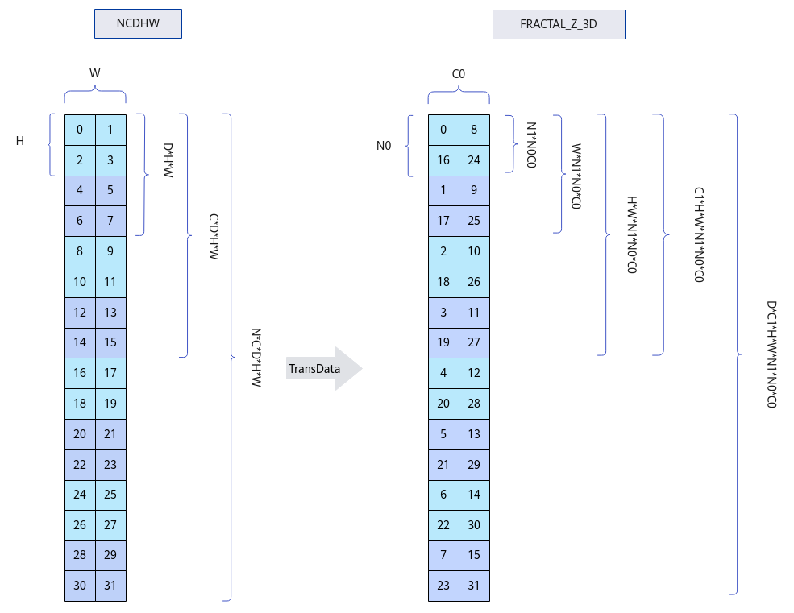
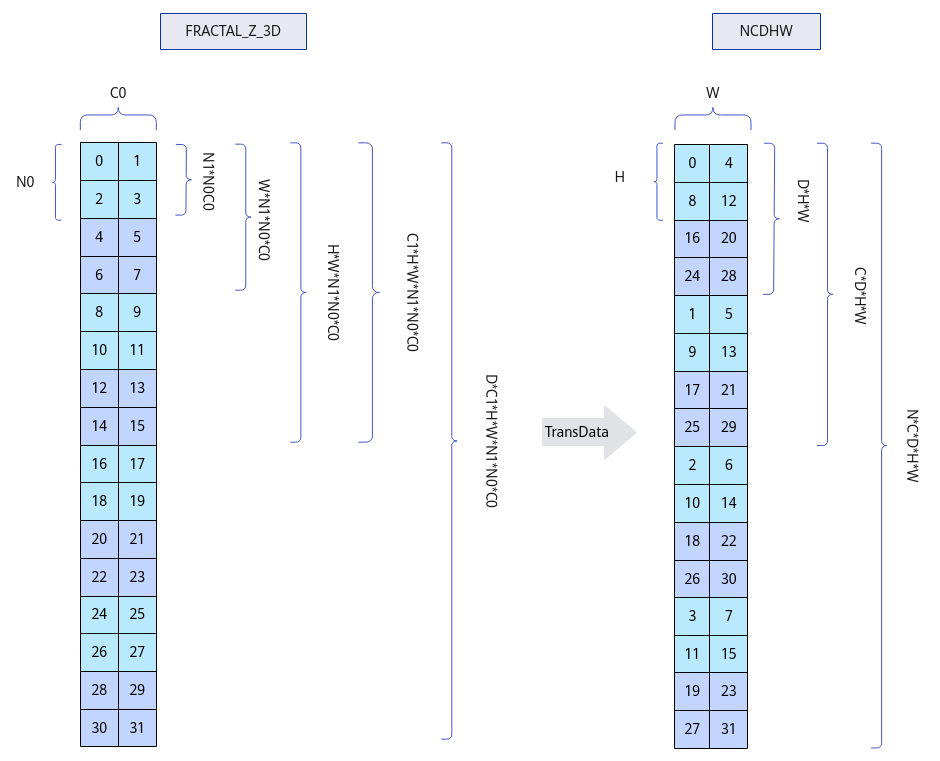

# TransData<a name="ZH-CN_TOPIC_0000002298710212"></a>

## 产品支持情况<a name="section1586581915393"></a>

<a name="table169596713360"></a>
<table><thead align="left"><tr id="row129590715369"><th class="cellrowborder" valign="top" width="57.99999999999999%" id="mcps1.1.3.1.1"><p id="p17959971362"><a name="p17959971362"></a><a name="p17959971362"></a><span id="ph895914718367"><a name="ph895914718367"></a><a name="ph895914718367"></a>产品</span></p>
</th>
<th class="cellrowborder" align="center" valign="top" width="42%" id="mcps1.1.3.1.2"><p id="p89594763612"><a name="p89594763612"></a><a name="p89594763612"></a>是否支持</p>
</th>
</tr>
</thead>
<tbody><tr id="row18959157103612"><td class="cellrowborder" valign="top" width="57.99999999999999%" headers="mcps1.1.3.1.1 "><p id="p13959117193618"><a name="p13959117193618"></a><a name="p13959117193618"></a><span id="ph9959117173614"><a name="ph9959117173614"></a><a name="ph9959117173614"></a><term id="zh-cn_topic_0000001312391781_term1253731311225"><a name="zh-cn_topic_0000001312391781_term1253731311225"></a><a name="zh-cn_topic_0000001312391781_term1253731311225"></a>Atlas A3 训练系列产品</term>/<term id="zh-cn_topic_0000001312391781_term12835255145414"><a name="zh-cn_topic_0000001312391781_term12835255145414"></a><a name="zh-cn_topic_0000001312391781_term12835255145414"></a>Atlas A3 推理系列产品</term></span></p>
</td>
<td class="cellrowborder" align="center" valign="top" width="42%" headers="mcps1.1.3.1.2 "><p id="p1095914793613"><a name="p1095914793613"></a><a name="p1095914793613"></a>√</p>
</td>
</tr>
<tr id="row89591478362"><td class="cellrowborder" valign="top" width="57.99999999999999%" headers="mcps1.1.3.1.1 "><p id="p7959157163619"><a name="p7959157163619"></a><a name="p7959157163619"></a><span id="ph1995997193619"><a name="ph1995997193619"></a><a name="ph1995997193619"></a><term id="zh-cn_topic_0000001312391781_term11962195213215"><a name="zh-cn_topic_0000001312391781_term11962195213215"></a><a name="zh-cn_topic_0000001312391781_term11962195213215"></a>Atlas A2 训练系列产品</term>/<term id="zh-cn_topic_0000001312391781_term1551319498507"><a name="zh-cn_topic_0000001312391781_term1551319498507"></a><a name="zh-cn_topic_0000001312391781_term1551319498507"></a>Atlas A2 推理系列产品</term></span></p>
</td>
<td class="cellrowborder" align="center" valign="top" width="42%" headers="mcps1.1.3.1.2 "><p id="p149598793615"><a name="p149598793615"></a><a name="p149598793615"></a>√</p>
</td>
</tr>
</tbody>
</table>

## 功能说明<a name="section153011250151413"></a>

将输入数据的排布格式转换为目标排布格式。

本接口支持的数据格式转换场景包括以下四种，除维度顺序变换外，其中涉及到C轴和N轴的拆分，具体转换方式为，C轴拆分为C1轴、C0轴，N轴拆分为N1轴、N0轴。对于位宽为16的数据类型的数据，C0和N0固定为16，C1和N1的计算公式如下。


-   场景1：NCDHW -\> NDC1HWC0

    输入Tensor \{shape:\[N, C, D, H, W\]\}，输出Tensor \{shape:\[N, D, C/16, H, W, 16\]\}。请注意，C0实际上等于16，为便于展示，下图中C0被设定为2。

    **图 1**  NCDHW格式转为NDC1HWC0格式示意图<a name="fig128260305283"></a>  
    

-   场景2：NDC1HWC0 -\> NCDHW

    输入Tensor \{shape:\[N, D, C/16, H, W, 16\]\}，输出Tensor \{shape:\[N, C, D, H, W\]\}。请注意，C0实际上等于16，为便于展示，下图中C0被设定为2。

    **图 2**  NDC1HWC0格式转为NCDHW格式示意图<a name="fig881811465288"></a>  
    

-   场景3：NCDHW -\> FRACTAL\_Z\_3D

    输入Tensor \{shape:\[N, C, D, H, W\]\}，输出Tensor \{shape:\[D, C/16, H, W, N/16, 16, 16\]\}。请注意，C0和N0实际上等于16，为便于展示，下图中C0和N0被设定为2。

    **图 3**  NCDHW格式转为FRACTAL\_Z\_3D格式示意图<a name="fig1654210353315"></a>  
    

-   场景4：FRACTAL\_Z\_3D -\> NCDHW

    输入Tensor \{shape:\[D, C/16, H, W, N/16, 16, 16\]\}，输出Tensor \{shape:\[N, C, D, H, W\]\}。请注意，C0和N0实际上等于16，为便于展示，下图中C0和N0被设定为2。

    **图 4**  FRACTAL\_Z\_3D格式转为NCDHW格式示意图<a name="fig11273144613317"></a>  
    

## 函数原型<a name="section620mcpsimp"></a>

-   通过sharedTmpBuffer入参传入临时空间

    ```
    template <const TransDataConfig& config, typename T, typename U, typename S>
    __aicore__ inline void TransData(const LocalTensor<T>& dstTensor, const LocalTensor<T>& srcTensor, const LocalTensor<uint8_t>& sharedTmpBuffer, const TransDataParams<U, S>& params)
    ```

-   接口框架申请临时空间

    ```
    template <const TransDataConfig& config, typename T, typename U, typename S>
    __aicore__ inline void TransData(const LocalTensor<T>& dstTensor, const LocalTensor<T>& srcTensor, const TransDataParams<U, S>& params)
    ```

由于该接口的内部实现中，需要额外的临时空间来存储计算过程中的中间变量。临时空间支持开发者**通过sharedTmpBuffer入参传入**和**接口框架申请**两种方式。

-   通过sharedTmpBuffer入参传入，使用该tensor作为临时空间进行处理，接口框架不再申请。该方式开发者可以自行管理sharedTmpBuffer内存空间，并在接口调用完成后，复用该部分内存，内存不会反复申请释放，灵活性较高，内存利用率也较高。
-   接口框架申请临时空间，开发者无需申请，但是需要预留临时空间的大小。

通过sharedTmpBuffer传入的情况，开发者需要为tensor申请空间；接口框架申请的方式，开发者需要预留临时空间。临时空间大小BufferSize的获取方式如下：通过[GetTransDataMaxMinTmpSize](GetTransDataMaxMinTmpSize.md)中提供的接口获取需要预留空间范围的大小。

## 参数说明<a name="section622mcpsimp"></a>

**表 1**  模板参数说明

<a name="table575571914269"></a>
<table><thead align="left"><tr id="row18755131942614"><th class="cellrowborder" valign="top" width="19.39%" id="mcps1.2.3.1.1"><p id="p675519193268"><a name="p675519193268"></a><a name="p675519193268"></a>参数名</p>
</th>
<th class="cellrowborder" valign="top" width="80.61%" id="mcps1.2.3.1.2"><p id="p375511918267"><a name="p375511918267"></a><a name="p375511918267"></a>描述</p>
</th>
</tr>
</thead>
<tbody><tr id="row14755141911264"><td class="cellrowborder" valign="top" width="19.39%" headers="mcps1.2.3.1.1 "><p id="p56349366135"><a name="p56349366135"></a><a name="p56349366135"></a>config</p>
</td>
<td class="cellrowborder" valign="top" width="80.61%" headers="mcps1.2.3.1.2 "><p id="p206471529436"><a name="p206471529436"></a><a name="p206471529436"></a>指定数据格式转换的场景。当前支持的转换场景有如下四种：NCDHW -&gt; NDC1HWC0、NDC1HWC0 -&gt; NCDHW、NCDHW -&gt; FRACTAL_Z_3D、FRACTAL_Z_3D -&gt; NCDHW。该参数为TransDataConfig类型，具体定义如下。</p>
<a name="screen1119148131414"></a><a name="screen1119148131414"></a><pre class="screen" codetype="Cpp" id="screen1119148131414">struct TransDataConfig {
    DataFormat srcFormat;
    DataFormat dstFormat;
};

enum class DataFormat : uint8_t {
    ND = 0,
    NZ,
    NCHW,
    NC1HWC0,
    NHWC,
    NCDHW,
    NDC1HWC0,
    FRACTAL_Z_3D,
};</pre>
<p id="p179471913103"><a name="p179471913103"></a><a name="p179471913103"></a>配置示例如下。</p>
<a name="screen9584125817019"></a><a name="screen9584125817019"></a><pre class="screen" codetype="Cpp" id="screen9584125817019">constexpr AscendC::TransDataConfig config1 = {AscendC::DataFormat::NCDHW, AscendC::DataFormat::FRACTAL_Z_3D};</pre>
</td>
</tr>
<tr id="row0878818204013"><td class="cellrowborder" valign="top" width="19.39%" headers="mcps1.2.3.1.1 "><p id="p1587851844012"><a name="p1587851844012"></a><a name="p1587851844012"></a>T</p>
</td>
<td class="cellrowborder" valign="top" width="80.61%" headers="mcps1.2.3.1.2 "><p id="p2419165319183"><a name="p2419165319183"></a><a name="p2419165319183"></a>操作数的数据类型。</p>
<p id="p20617184411319"><a name="p20617184411319"></a><a name="p20617184411319"></a><span id="ph07569061010"><a name="ph07569061010"></a><a name="ph07569061010"></a><term id="zh-cn_topic_0000001312391781_term1253731311225_1"><a name="zh-cn_topic_0000001312391781_term1253731311225_1"></a><a name="zh-cn_topic_0000001312391781_term1253731311225_1"></a>Atlas A3 训练系列产品</term>/<term id="zh-cn_topic_0000001312391781_term12835255145414_1"><a name="zh-cn_topic_0000001312391781_term12835255145414_1"></a><a name="zh-cn_topic_0000001312391781_term12835255145414_1"></a>Atlas A3 推理系列产品</term></span>，支持的数据类型为：int16_t、uint16_t、half、bfloat16_t。</p>
<p id="p1475612016105"><a name="p1475612016105"></a><a name="p1475612016105"></a><span id="ph167561705104"><a name="ph167561705104"></a><a name="ph167561705104"></a><term id="zh-cn_topic_0000001312391781_term11962195213215_1"><a name="zh-cn_topic_0000001312391781_term11962195213215_1"></a><a name="zh-cn_topic_0000001312391781_term11962195213215_1"></a>Atlas A2 训练系列产品</term>/<term id="zh-cn_topic_0000001312391781_term1551319498507_1"><a name="zh-cn_topic_0000001312391781_term1551319498507_1"></a><a name="zh-cn_topic_0000001312391781_term1551319498507_1"></a>Atlas A2 推理系列产品</term></span>，支持的数据类型为：int16_t、uint16_t、half、bfloat16_t。</p>
</td>
</tr>
<tr id="row9756719122620"><td class="cellrowborder" valign="top" width="19.39%" headers="mcps1.2.3.1.1 "><p id="p1682112447268"><a name="p1682112447268"></a><a name="p1682112447268"></a>U</p>
</td>
<td class="cellrowborder" valign="top" width="80.61%" headers="mcps1.2.3.1.2 "><p id="p4869143081918"><a name="p4869143081918"></a><a name="p4869143081918"></a>源操作数的Shape信息，<a href="Layout.md">Layout</a>类型。</p>
<a name="screen1124141215213"></a><a name="screen1124141215213"></a><pre class="screen" codetype="Cpp" id="screen1124141215213">AscendC::Layout ncdhwLayout = AscendC::MakeLayout(AscendC::MakeShape(n, c, d, h, w), AscendC::MakeStride());</pre>
</td>
</tr>
<tr id="row73314211619"><td class="cellrowborder" valign="top" width="19.39%" headers="mcps1.2.3.1.1 "><p id="p183315212164"><a name="p183315212164"></a><a name="p183315212164"></a>S</p>
</td>
<td class="cellrowborder" valign="top" width="80.61%" headers="mcps1.2.3.1.2 "><p id="p123321522165"><a name="p123321522165"></a><a name="p123321522165"></a>目的操作数的Shape信息，<a href="Layout.md">Layout</a>类型。</p>
<a name="screen940315320219"></a><a name="screen940315320219"></a><pre class="screen" codetype="Cpp" id="screen940315320219">AscendC::Layout fractalzLayout = AscendC::MakeLayout(AscendC::MakeShape(d, c1, h, w, n1, n0, c0), AscendC::MakeStride());</pre>
</td>
</tr>
</tbody>
</table>

**表 2**  接口参数说明

<a name="table148471830151913"></a>
<table><thead align="left"><tr id="row1984733010194"><th class="cellrowborder" valign="top" width="17.380000000000003%" id="mcps1.2.4.1.1"><p id="p2847730181917"><a name="p2847730181917"></a><a name="p2847730181917"></a>参数名</p>
</th>
<th class="cellrowborder" valign="top" width="10.36%" id="mcps1.2.4.1.2"><p id="p58476303197"><a name="p58476303197"></a><a name="p58476303197"></a>输入/输出</p>
</th>
<th class="cellrowborder" valign="top" width="72.26%" id="mcps1.2.4.1.3"><p id="p10847203021913"><a name="p10847203021913"></a><a name="p10847203021913"></a>描述</p>
</th>
</tr>
</thead>
<tbody><tr id="row98477303196"><td class="cellrowborder" valign="top" width="17.380000000000003%" headers="mcps1.2.4.1.1 "><p id="p15847183018194"><a name="p15847183018194"></a><a name="p15847183018194"></a>dstTensor</p>
</td>
<td class="cellrowborder" valign="top" width="10.36%" headers="mcps1.2.4.1.2 "><p id="p148471930161917"><a name="p148471930161917"></a><a name="p148471930161917"></a>输出</p>
</td>
<td class="cellrowborder" valign="top" width="72.26%" headers="mcps1.2.4.1.3 "><p id="p17444349398"><a name="p17444349398"></a><a name="p17444349398"></a>目的操作数。</p>
<p id="p16703131355116"><a name="p16703131355116"></a><a name="p16703131355116"></a><span id="zh-cn_topic_0000001530181537_ph173308471594"><a name="zh-cn_topic_0000001530181537_ph173308471594"></a><a name="zh-cn_topic_0000001530181537_ph173308471594"></a><span id="zh-cn_topic_0000001530181537_ph9902231466"><a name="zh-cn_topic_0000001530181537_ph9902231466"></a><a name="zh-cn_topic_0000001530181537_ph9902231466"></a><span id="zh-cn_topic_0000001530181537_ph1782115034816"><a name="zh-cn_topic_0000001530181537_ph1782115034816"></a><a name="zh-cn_topic_0000001530181537_ph1782115034816"></a>类型为<a href="LocalTensor.md">LocalTensor</a>，支持的TPosition为VECIN/VECCALC/VECOUT。</span></span></span></p>
</td>
</tr>
<tr id="row11848103091920"><td class="cellrowborder" valign="top" width="17.380000000000003%" headers="mcps1.2.4.1.1 "><p id="p58481330191917"><a name="p58481330191917"></a><a name="p58481330191917"></a>srcTensor</p>
</td>
<td class="cellrowborder" valign="top" width="10.36%" headers="mcps1.2.4.1.2 "><p id="p158485305196"><a name="p158485305196"></a><a name="p158485305196"></a>输入</p>
</td>
<td class="cellrowborder" valign="top" width="72.26%" headers="mcps1.2.4.1.3 "><p id="p3707144233915"><a name="p3707144233915"></a><a name="p3707144233915"></a>源操作数。</p>
<p id="p261714443395"><a name="p261714443395"></a><a name="p261714443395"></a><span id="zh-cn_topic_0000001530181537_ph173308471594_1"><a name="zh-cn_topic_0000001530181537_ph173308471594_1"></a><a name="zh-cn_topic_0000001530181537_ph173308471594_1"></a><span id="zh-cn_topic_0000001530181537_ph9902231466_1"><a name="zh-cn_topic_0000001530181537_ph9902231466_1"></a><a name="zh-cn_topic_0000001530181537_ph9902231466_1"></a><span id="zh-cn_topic_0000001530181537_ph1782115034816_1"><a name="zh-cn_topic_0000001530181537_ph1782115034816_1"></a><a name="zh-cn_topic_0000001530181537_ph1782115034816_1"></a>类型为<a href="LocalTensor.md">LocalTensor</a>，支持的TPosition为VECIN/VECCALC/VECOUT。</span></span></span></p>
<p id="p515144315188"><a name="p515144315188"></a><a name="p515144315188"></a>源操作数的数据类型需要与目的操作数保持一致。</p>
</td>
</tr>
<tr id="row1854110155415"><td class="cellrowborder" valign="top" width="17.380000000000003%" headers="mcps1.2.4.1.1 "><p id="p1313415271911"><a name="p1313415271911"></a><a name="p1313415271911"></a>sharedTmpBuffer</p>
</td>
<td class="cellrowborder" valign="top" width="10.36%" headers="mcps1.2.4.1.2 "><p id="p5133352201914"><a name="p5133352201914"></a><a name="p5133352201914"></a>输入</p>
</td>
<td class="cellrowborder" valign="top" width="72.26%" headers="mcps1.2.4.1.3 "><p id="p0400131017545"><a name="p0400131017545"></a><a name="p0400131017545"></a>临时缓存。</p>
<p id="p11947511105415"><a name="p11947511105415"></a><a name="p11947511105415"></a><span id="zh-cn_topic_0000001530181537_ph173308471594_2"><a name="zh-cn_topic_0000001530181537_ph173308471594_2"></a><a name="zh-cn_topic_0000001530181537_ph173308471594_2"></a><span id="zh-cn_topic_0000001530181537_ph9902231466_2"><a name="zh-cn_topic_0000001530181537_ph9902231466_2"></a><a name="zh-cn_topic_0000001530181537_ph9902231466_2"></a><span id="zh-cn_topic_0000001530181537_ph1782115034816_2"><a name="zh-cn_topic_0000001530181537_ph1782115034816_2"></a><a name="zh-cn_topic_0000001530181537_ph1782115034816_2"></a>类型为<a href="LocalTensor.md">LocalTensor</a>，支持的TPosition为VECIN/VECCALC/VECOUT。</span></span></span></p>
<p id="p104071111204211"><a name="p104071111204211"></a><a name="p104071111204211"></a>用于TransData内部复杂计算时存储中间变量，由开发者提供。</p>
<p id="p5881016172817"><a name="p5881016172817"></a><a name="p5881016172817"></a>临时空间大小BufferSize的获取方式请参考<a href="GetTransDataMaxMinTmpSize.md">GetTransDataMaxMinTmpSize</a>。</p>
</td>
</tr>
<tr id="row15497954143513"><td class="cellrowborder" valign="top" width="17.380000000000003%" headers="mcps1.2.4.1.1 "><p id="p113255792013"><a name="p113255792013"></a><a name="p113255792013"></a>params</p>
</td>
<td class="cellrowborder" valign="top" width="10.36%" headers="mcps1.2.4.1.2 "><p id="p1440319114363"><a name="p1440319114363"></a><a name="p1440319114363"></a>输入</p>
</td>
<td class="cellrowborder" valign="top" width="72.26%" headers="mcps1.2.4.1.3 "><p id="p98048617240"><a name="p98048617240"></a><a name="p98048617240"></a>源操作数和目的操作数的Shape信息。该参数为TransDataParams数据类型，具体定义如下，其中模板参数T、U必须为<a href="Layout.md">Layout</a>类型。该参数指定的Shape维度必须与config中Format对应维度保持一致。</p>
<a name="screen3715198122411"></a><a name="screen3715198122411"></a><pre class="screen" codetype="Cpp" id="screen3715198122411">template &lt;typename T, typename U&gt;
struct TransDataParams {
    T srcLayout;
    U dstLayout;
};</pre>
<p id="p18216192616319"><a name="p18216192616319"></a><a name="p18216192616319"></a>配置示例如下。</p>
<a name="screen97701538438"></a><a name="screen97701538438"></a><pre class="screen" codetype="Cpp" id="screen97701538438">AscendC::Layout ncdhwLayout = AscendC::MakeLayout(AscendC::MakeShape(n, c, d, h, w), AscendC::MakeStride());
AscendC::Layout fractalzLayout = AscendC::MakeLayout(AscendC::MakeShape(d, c1, h, w, n1, n0, c0), AscendC::MakeStride());
AscendC::TransDataParams&lt;decltype(ncdhwLayout), decltype(fractalzLayout)&gt; params = {ncdhwLayout, fractalzLayout};</pre>
</td>
</tr>
</tbody>
</table>

## 返回值说明<a name="section38228281712"></a>

无

## 约束说明<a name="section633mcpsimp"></a>

-   操作数地址对齐要求请参见[通用地址对齐约束](通用说明和约束.md#section796754519912)。
-   不支持源操作数与目的操作数地址重叠。
-   不支持sharedTmpBuffer与源操作数和目的操作数地址重叠。
-   对于NCDHW格式的输入，如果H轴和W轴合并后的轴不是32字节对齐，则在调用此接口前，用户需要在合并后的轴上填充数据，使其达到32字节对齐。调用此接口时，在指定Shape信息的参数处，应传入原始Shape，即合轴前的Shape。例如，如果输入的原始Shape是\[1, 16, 2, 3, 5\]，则用户需要将输入数据填充至Shape \[1, 16, 2, 16\]，填充的数据为无效数据。
-   对于NCDHW格式的输出，接口实现将H轴和W轴合并，并在合并后的轴上填充数据以达到32字节对齐；调用此接口时，在指定Shape信息的参数处，应传入原始Shape，即合并轴前的Shape。例如，如果原始NCDHW格式的目标Shape为\[1, 16, 2, 3, 5\]，则实际输出Shape为\[1, 16, 2, 16\]的数据，其中接口填充的数据为无效数据。

## 调用示例<a name="section642mcpsimp"></a>

```
AscendC::LocalTensor<half> dstLocal = outQueue.AllocTensor<half>();
AscendC::LocalTensor<half> srcLocal = inQueue.DeQue<half>();
AscendC::LocalTensor<uint8_t> tmp = tbuf.Get<uint8_t>();
// 构造Layout方式
AscendC::Layout ncdhwLayout = AscendC::MakeLayout(AscendC::MakeShape(1, 32, 2, 2, 8), AscendC::MakeStride());
AscendC::Layout ndc1hwc0Layout = AscendC::MakeLayout(AscendC::MakeShape(1, 2, 2, 2, 8, 16), AscendC::MakeStride());
static constexpr AscendC::TransDataConfig config = {DataFormat::NCDHW, DataFormat::NDC1HWC0};
AscendC::TransDataParams<decltype(ncdhwLayout), decltype(ndc1hwc0Layout)> params = {ncdhwLayout, ndc1hwc0Layout};
AscendC::TransData<config>(dstLocal, srcLocal, tmp, params);
```

结果示例如下：

```
输入、输出的数据类型为half
输入数据(src): 
[[[[[  0   1   2   3   4   5   6   7]
    [  8   9  10  11  12  13  14  15]]]

  [[[ 16  17  18  19  20  21  22  23]
    [ 24  25  26  27  28  29  30  31]]]

  [[[ 32  33  34  35  36  37  38  39]
    [ 40  41  42  43  44  45  46  47]]]

  [[[ 48  49  50  51  52  53  54  55]
    [ 56  57  58  59  60  61  62  63]]]

  [[[ 64  65  66  67  68  69  70  71]
    [ 72  73  74  75  76  77  78  79]]]

  [[[ 80  81  82  83  84  85  86  87]
    [ 88  89  90  91  92  93  94  95]]]

  [[[ 96  97  98  99 100 101 102 103]
    [104 105 106 107 108 109 110 111]]]

  [[[112 113 114 115 116 117 118 119]
    [120 121 122 123 124 125 126 127]]]

  [[[128 129 130 131 132 133 134 135]
    [136 137 138 139 140 141 142 143]]]

  [[[144 145 146 147 148 149 150 151]
    [152 153 154 155 156 157 158 159]]]

  [[[160 161 162 163 164 165 166 167]
    [168 169 170 171 172 173 174 175]]]

  [[[176 177 178 179 180 181 182 183]
    [184 185 186 187 188 189 190 191]]]

  [[[192 193 194 195 196 197 198 199]
    [200 201 202 203 204 205 206 207]]]

  [[[208 209 210 211 212 213 214 215]
    [216 217 218 219 220 221 222 223]]]

  [[[224 225 226 227 228 229 230 231]
    [232 233 234 235 236 237 238 239]]]

  [[[240 241 242 243 244 245 246 247]
    [248 249 250 251 252 253 254 255]]]

  [[[256 257 258 259 260 261 262 263]
    [264 265 266 267 268 269 270 271]]]

  [[[272 273 274 275 276 277 278 279]
    [280 281 282 283 284 285 286 287]]]

  [[[288 289 290 291 292 293 294 295]
    [296 297 298 299 300 301 302 303]]]

  [[[304 305 306 307 308 309 310 311]
    [312 313 314 315 316 317 318 319]]]

  [[[320 321 322 323 324 325 326 327]
    [328 329 330 331 332 333 334 335]]]

  [[[336 337 338 339 340 341 342 343]
    [344 345 346 347 348 349 350 351]]]

  [[[352 353 354 355 356 357 358 359]
    [360 361 362 363 364 365 366 367]]]

  [[[368 369 370 371 372 373 374 375]
    [376 377 378 379 380 381 382 383]]]

  [[[384 385 386 387 388 389 390 391]
    [392 393 394 395 396 397 398 399]]]

  [[[400 401 402 403 404 405 406 407]
    [408 409 410 411 412 413 414 415]]]

  [[[416 417 418 419 420 421 422 423]
    [424 425 426 427 428 429 430 431]]]

  [[[432 433 434 435 436 437 438 439]
    [440 441 442 443 444 445 446 447]]]

  [[[448 449 450 451 452 453 454 455]
    [456 457 458 459 460 461 462 463]]]

  [[[464 465 466 467 468 469 470 471]
    [472 473 474 475 476 477 478 479]]]

  [[[480 481 482 483 484 485 486 487]
    [488 489 490 491 492 493 494 495]]]

  [[[496 497 498 499 500 501 502 503]
    [504 505 506 507 508 509 510 511]]]]]

输入config：{DataFormat::NCDHW, DataFormat::NDC1HWC0}
输入params：{(1, 32, 2, 2, 8), (1, 2, 2, 2, 8, 16)}

输出数据(dst): 
[[[[[[  0  16  32  48  64  80  96 112 128 144 160 176
      192 208 224 240]
     [  1  17  33  49  65  81  97 113 129 145 161 177
      193 209 225 241]
     [  2  18  34  50  66  82  98 114 130 146 162 178
      194 210 226 242]
     [  3  19  35  51  67  83  99 115 131 147 163 179
      195 211 227 243]]

    [[  4  20  36  52  68  84 100 116 132 148 164 180
      196 212 228 244]
     [  5  21  37  53  69  85 101 117 133 149 165 181
      197 213 229 245]
     [  6  22  38  54  70  86 102 118 134 150 166 182
      198 214 230 246]
     [  7  23  39  55  71  87 103 119 135 151 167 183
      199 215 231 247]]

    [[  8  24  40  56  72  88 104 120 136 152 168 184
      200 216 232 248]
     [  9  25  41  57  73  89 105 121 137 153 169 185
      201 217 233 249]
     [ 10  26  42  58  74  90 106 122 138 154 170 186
      202 218 234 250]
     [ 11  27  43  59  75  91 107 123 139 155 171 187
      203 219 235 251]]

    [[ 12  28  44  60  76  92 108 124 140 156 172 188
      204 220 236 252]
     [ 13  29  45  61  77  93 109 125 141 157 173 189
      205 221 237 253]
     [ 14  30  46  62  78  94 110 126 142 158 174 190
      206 222 238 254]
     [ 15  31  47  63  79  95 111 127 143 159 175 191
      207 223 239 255]]]


   [[[256 272 288 304 320 336 352 368 384 400 416 432
      448 464 480 496]
     [257 273 289 305 321 337 353 369 385 401 417 433
      449 465 481 497]
     [258 274 290 306 322 338 354 370 386 402 418 434
      450 466 482 498]
     [259 275 291 307 323 339 355 371 387 403 419 435
      451 467 483 499]]

    [[260 276 292 308 324 340 356 372 388 404 420 436
      452 468 484 500]
     [261 277 293 309 325 341 357 373 389 405 421 437
      453 469 485 501]
     [262 278 294 310 326 342 358 374 390 406 422 438
      454 470 486 502]
     [263 279 295 311 327 343 359 375 391 407 423 439
      455 471 487 503]]

    [[264 280 296 312 328 344 360 376 392 408 424 440
      456 472 488 504]
     [265 281 297 313 329 345 361 377 393 409 425 441
      457 473 489 505]
     [266 282 298 314 330 346 362 378 394 410 426 442
      458 474 490 506]
     [267 283 299 315 331 347 363 379 395 411 427 443
      459 475 491 507]]

    [[268 284 300 316 332 348 364 380 396 412 428 444
      460 476 492 508]
     [269 285 301 317 333 349 365 381 397 413 429 445
      461 477 493 509]
     [270 286 302 318 334 350 366 382 398 414 430 446
      462 478 494 510]
     [271 287 303 319 335 351 367 383 399 415 431 447
      463 479 495 511]]]]]]

```

