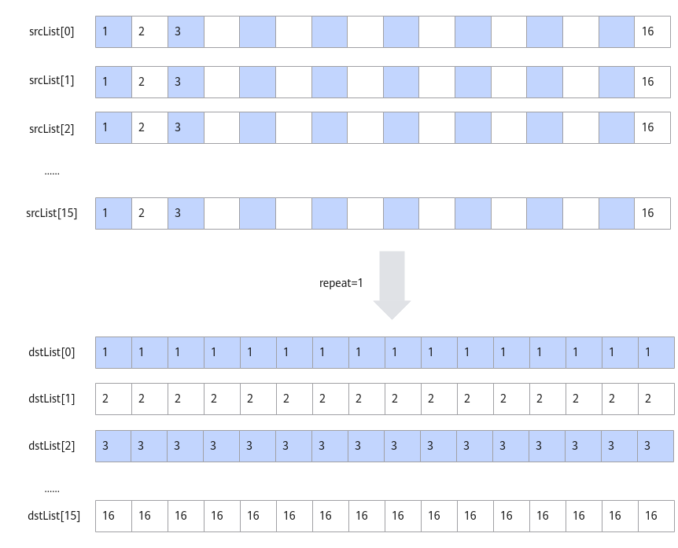
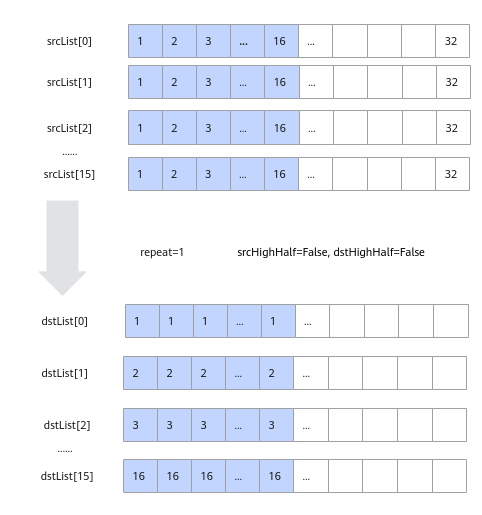

# TransDataTo5HD<a name="ZH-CN_TOPIC_0000001473462212"></a>

## AI处理器支持情况<a name="section1550532418810"></a>

<a name="table38301303189"></a>
<table><thead align="left"><tr id="row20831180131817"><th class="cellrowborder" valign="top" width="57.99999999999999%" id="mcps1.1.3.1.1"><p id="p1883113061818"><a name="p1883113061818"></a><a name="p1883113061818"></a><span id="ph20833205312295"><a name="ph20833205312295"></a><a name="ph20833205312295"></a>AI处理器类型</span></p>
</th>
<th class="cellrowborder" align="center" valign="top" width="42%" id="mcps1.1.3.1.2"><p id="p783113012187"><a name="p783113012187"></a><a name="p783113012187"></a>是否支持</p>
</th>
</tr>
</thead>
<tbody><tr id="row220181016240"><td class="cellrowborder" valign="top" width="57.99999999999999%" headers="mcps1.1.3.1.1 "><p id="p48327011813"><a name="p48327011813"></a><a name="p48327011813"></a><span id="ph583230201815"><a name="ph583230201815"></a><a name="ph583230201815"></a><term id="zh-cn_topic_0000001312391781_term1253731311225"><a name="zh-cn_topic_0000001312391781_term1253731311225"></a><a name="zh-cn_topic_0000001312391781_term1253731311225"></a>Ascend 910C</term></span></p>
</td>
<td class="cellrowborder" align="center" valign="top" width="42%" headers="mcps1.1.3.1.2 "><p id="p7948163910184"><a name="p7948163910184"></a><a name="p7948163910184"></a>√</p>
</td>
</tr>
<tr id="row173226882415"><td class="cellrowborder" valign="top" width="57.99999999999999%" headers="mcps1.1.3.1.1 "><p id="p14832120181815"><a name="p14832120181815"></a><a name="p14832120181815"></a><span id="ph1483216010188"><a name="ph1483216010188"></a><a name="ph1483216010188"></a><term id="zh-cn_topic_0000001312391781_term11962195213215"><a name="zh-cn_topic_0000001312391781_term11962195213215"></a><a name="zh-cn_topic_0000001312391781_term11962195213215"></a>Ascend 910B</term></span></p>
</td>
<td class="cellrowborder" align="center" valign="top" width="42%" headers="mcps1.1.3.1.2 "><p id="p19948143911820"><a name="p19948143911820"></a><a name="p19948143911820"></a>√</p>
</td>
</tr>
<tr id="row15549118175111"><td class="cellrowborder" valign="top" width="57.99999999999999%" headers="mcps1.1.3.1.1 "><p id="p07746191307"><a name="p07746191307"></a><a name="p07746191307"></a><span id="ph880814542020"><a name="ph880814542020"></a><a name="ph880814542020"></a>Kirin X90</span></p>
</td>
<td class="cellrowborder" align="center" valign="top" width="42%" headers="mcps1.1.3.1.2 "><p id="p18774619608"><a name="p18774619608"></a><a name="p18774619608"></a>√</p>
</td>
</tr>
<tr id="row19668158115118"><td class="cellrowborder" valign="top" width="57.99999999999999%" headers="mcps1.1.3.1.1 "><p id="p4336317115"><a name="p4336317115"></a><a name="p4336317115"></a><span id="ph115418716"><a name="ph115418716"></a><a name="ph115418716"></a>Kirin 9030</span></p>
</td>
<td class="cellrowborder" align="center" valign="top" width="42%" headers="mcps1.1.3.1.2 "><p id="p73313312117"><a name="p73313312117"></a><a name="p73313312117"></a>√</p>
</td>
</tr>
</tbody>
</table>

## 功能说明<a name="zh-cn_topic_0000001521260417_section618mcpsimp"></a>

数据格式转换，一般用于将NCHW格式转换成NC1HWC0格式。特别的，也可以用于二维矩阵数据块的转置。完成转置功能时，相比于[Transpose](Transpose.md)接口，Transpose仅支持16\*16大小的矩阵转置；本接口单次repeat内可处理512Byte的数据（16个datablock），根据数据类型不同，支持不同shape的矩阵转置（比如数据类型为half时，单次repeat可完成16\*16大小的矩阵转置），同时还可以支持多次repeat操作。

单次repeat内转换规则如下：

-   当输入数据类型位宽为16位时，每个datablock中包含16个数，指令内部会循环16次，每次循环都会分别从指定的16个datablock中的对应位置取值，组成一个新的datablock单元放入目的地址中。如下图所示，图中的srcList\[0\]-srcList\[15\]代表源操作数的16个datablock。

    **图 1**  输入数据类型位宽为16位时的转换规则<a name="fig1361914810458"></a>  
    

-   当数据类型位宽为32位时，每个datablock包含8个数，指令内部会循环8次，每次循环都会分别从指定的16个datablock中的对应位置取值，组成2个新的datablock放入目的地址中。如下图所示：

    **图 2**  输入数据类型位宽为32位时的转换规则<a name="fig186798494611"></a>  
    

-   当数据类型位宽为8位时，每个datablock包含32个数，指令内部会循环16次，每次循环都会分别从指定的16个datablock中的对应位置取值，组成半个datablock放入目的地址中，读取和存放是在datablock的高半部还是低半部由参数srcHighHalf和dstHighHalf决定。如下图所示：

    **图 3**  输入数据类型位宽为8位时的转换规则<a name="fig29071549185211"></a>  
    

基于以上的转换规则，使用该接口进行NC1HWC0格式转换或者矩阵转置。NC1HWC0格式转换相对复杂，这里给出其具体的转换方法：

NCHW格式转换成NC1HWC0格式时，如果是数据类型的位宽为32位或者16位，则C0=16；如果数据类型的位宽为8位，则C0=32。下图以C0=16为例进行介绍：


## 函数原型<a name="zh-cn_topic_0000001521260417_section620mcpsimp"></a>

-   dstList与srcList类型为LocalTensor的数组。

    ```
    // NCHW_CONV_ADDR_LIST_SIZE值为16
    template <typename T>
    __aicore__ inline void TransDataTo5HD(const LocalTensor<T> (&dstList)[NCHW_CONV_ADDR_LIST_SIZE], const LocalTensor<T> (&srcList)[NCHW_CONV_ADDR_LIST_SIZE], const TransDataTo5HDParams& nchwconvParams)
    ```

-   dstList与srcList类型为uint64\_t的数组，数组元素对应LocaTensor的地址值，该接口性能更优。开发者可以通过LocalTensor的GetPhyAddr接口获取该地址值。

    ```
    // NCHW_CONV_ADDR_LIST_SIZE值为16
    template<typename T>
    __aicore__ inline void TransDataTo5HD(uint64_t dstList[NCHW_CONV_ADDR_LIST_SIZE], uint64_t srcList[NCHW_CONV_ADDR_LIST_SIZE], const TransDataTo5HDParams& nchwconvParams)
    ```

-   dst与src类型为uint64\_t的LocalTensor，连续存储对应LocalTensor的地址值。开发者可以通过LocalTensor的GetPhyAddr接口获取该地址值。

    ```
    template <typename T>
    __aicore__ inline void TransDataTo5HD(const LocalTensor<uint64_t>& dst, const LocalTensor<uint64_t>& src, const TransDataTo5HDParams& nchwconvParams)
    ```

## 参数说明<a name="zh-cn_topic_0000001521260417_section622mcpsimp"></a>

**表 1**  模板参数说明

<a name="table4835205712588"></a>
<table><thead align="left"><tr id="zh-cn_topic_0000001429830437_row118356578583"><th class="cellrowborder" valign="top" width="16.53%" id="mcps1.2.3.1.1"><p id="zh-cn_topic_0000001429830437_p48354572582"><a name="zh-cn_topic_0000001429830437_p48354572582"></a><a name="zh-cn_topic_0000001429830437_p48354572582"></a>参数名</p>
</th>
<th class="cellrowborder" valign="top" width="83.47%" id="mcps1.2.3.1.2"><p id="zh-cn_topic_0000001429830437_p583535795817"><a name="zh-cn_topic_0000001429830437_p583535795817"></a><a name="zh-cn_topic_0000001429830437_p583535795817"></a>描述</p>
</th>
</tr>
</thead>
<tbody><tr id="zh-cn_topic_0000001429830437_row1835857145817"><td class="cellrowborder" valign="top" width="16.53%" headers="mcps1.2.3.1.1 "><p id="zh-cn_topic_0000001429830437_p5835457165816"><a name="zh-cn_topic_0000001429830437_p5835457165816"></a><a name="zh-cn_topic_0000001429830437_p5835457165816"></a>T</p>
</td>
<td class="cellrowborder" valign="top" width="83.47%" headers="mcps1.2.3.1.2 "><p id="zh-cn_topic_0000001429830437_p168351657155818"><a name="zh-cn_topic_0000001429830437_p168351657155818"></a><a name="zh-cn_topic_0000001429830437_p168351657155818"></a>操作数数据类型。</p>
<p id="p1875020154202"><a name="p1875020154202"></a><a name="p1875020154202"></a><span id="ph57501115152015"><a name="ph57501115152015"></a><a name="ph57501115152015"></a><term id="zh-cn_topic_0000001312391781_term1253731311225_1"><a name="zh-cn_topic_0000001312391781_term1253731311225_1"></a><a name="zh-cn_topic_0000001312391781_term1253731311225_1"></a>Ascend 910C</term></span>，支持的数据类型为：int8_t/uint8_t/int16_t/uint16_t/half/int32_t/uint32_t/float</p>
<p id="p15750201518208"><a name="p15750201518208"></a><a name="p15750201518208"></a><span id="ph5750131562017"><a name="ph5750131562017"></a><a name="ph5750131562017"></a><term id="zh-cn_topic_0000001312391781_term11962195213215_1"><a name="zh-cn_topic_0000001312391781_term11962195213215_1"></a><a name="zh-cn_topic_0000001312391781_term11962195213215_1"></a>Ascend 910B</term></span>，支持的数据类型为：int8_t/uint8_t/int16_t/uint16_t/half/int32_t/uint32_t/float</p>
<p id="p065555314"><a name="p065555314"></a><a name="p065555314"></a><span id="ph15441323310"><a name="ph15441323310"></a><a name="ph15441323310"></a>Kirin X90</term></span>，支持的数据类型为：int8_t/uint8_t/int16_t/uint16_t/half/int32_t/uint32_t/float</p>
<p id="p082420411739"><a name="p082420411739"></a><a name="p082420411739"></a><span id="ph25359910414"><a name="ph25359910414"></a><a name="ph25359910414"></a>Kirin 9030</term></span>，支持的数据类型为：int8_t/uint8_t/int16_t/uint16_t/half/int32_t/uint32_t/float</p>
</td>
</tr>
</tbody>
</table>

**表 2**  参数列表

<a name="zh-cn_topic_0000001521260417_table18368155193919"></a>
<table><thead align="left"><tr id="zh-cn_topic_0000001521260417_row1036805543911"><th class="cellrowborder" valign="top" width="16.38163816381638%" id="mcps1.2.4.1.1"><p id="zh-cn_topic_0000001521260417_p1836835511393"><a name="zh-cn_topic_0000001521260417_p1836835511393"></a><a name="zh-cn_topic_0000001521260417_p1836835511393"></a>参数名称</p>
</th>
<th class="cellrowborder" valign="top" width="19.72197219721972%" id="mcps1.2.4.1.2"><p id="zh-cn_topic_0000001521260417_p10368255163915"><a name="zh-cn_topic_0000001521260417_p10368255163915"></a><a name="zh-cn_topic_0000001521260417_p10368255163915"></a>输入/输出</p>
</th>
<th class="cellrowborder" valign="top" width="63.8963896389639%" id="mcps1.2.4.1.3"><p id="zh-cn_topic_0000001521260417_p436875573911"><a name="zh-cn_topic_0000001521260417_p436875573911"></a><a name="zh-cn_topic_0000001521260417_p436875573911"></a>含义</p>
</th>
</tr>
</thead>
<tbody><tr id="zh-cn_topic_0000001521260417_row1436825518395"><td class="cellrowborder" valign="top" width="16.38163816381638%" headers="mcps1.2.4.1.1 "><p id="zh-cn_topic_0000001521260417_p1111152715182"><a name="zh-cn_topic_0000001521260417_p1111152715182"></a><a name="zh-cn_topic_0000001521260417_p1111152715182"></a>dstList</p>
</td>
<td class="cellrowborder" valign="top" width="19.72197219721972%" headers="mcps1.2.4.1.2 "><p id="zh-cn_topic_0000001521260417_p736835513915"><a name="zh-cn_topic_0000001521260417_p736835513915"></a><a name="zh-cn_topic_0000001521260417_p736835513915"></a>输出</p>
</td>
<td class="cellrowborder" valign="top" width="63.8963896389639%" headers="mcps1.2.4.1.3 "><p id="zh-cn_topic_0000001521260417_p193689557393"><a name="zh-cn_topic_0000001521260417_p193689557393"></a><a name="zh-cn_topic_0000001521260417_p193689557393"></a>目的操作数地址序列。</p>
<p id="p16703131355116"><a name="p16703131355116"></a><a name="p16703131355116"></a>类型为<a href="LocalTensor.md">LocalTensor</a>或者LocalTensor的地址值，LocalTensor支持的TPosition为VECIN/VECCALC/VECOUT。LocalTensor的起始地址需要32B对齐。支持的数据类型参考模板参数T说明。</p>
</td>
</tr>
<tr id="zh-cn_topic_0000001521260417_row1836875519393"><td class="cellrowborder" valign="top" width="16.38163816381638%" headers="mcps1.2.4.1.1 "><p id="zh-cn_topic_0000001521260417_p1725974393716"><a name="zh-cn_topic_0000001521260417_p1725974393716"></a><a name="zh-cn_topic_0000001521260417_p1725974393716"></a>srcList</p>
</td>
<td class="cellrowborder" valign="top" width="19.72197219721972%" headers="mcps1.2.4.1.2 "><p id="zh-cn_topic_0000001521260417_p15369205520396"><a name="zh-cn_topic_0000001521260417_p15369205520396"></a><a name="zh-cn_topic_0000001521260417_p15369205520396"></a>输入</p>
</td>
<td class="cellrowborder" valign="top" width="63.8963896389639%" headers="mcps1.2.4.1.3 "><p id="p15373145064814"><a name="p15373145064814"></a><a name="p15373145064814"></a>源操作数地址序列。</p>
<p id="p1863116191547"><a name="p1863116191547"></a><a name="p1863116191547"></a>类型为<a href="LocalTensor.md">LocalTensor</a>或者LocalTensor的地址值，LocalTensor支持的TPosition为VECIN/VECCALC/VECOUT。LocalTensor的起始地址需要32B对齐。支持的数据类型参考模板参数T说明。</p>
<p id="p1040515223286"><a name="p1040515223286"></a><a name="p1040515223286"></a>数据类型需要与dstList保持一致。</p>
</td>
</tr>
<tr id="row1629631143010"><td class="cellrowborder" valign="top" width="16.38163816381638%" headers="mcps1.2.4.1.1 "><p id="p62903163020"><a name="p62903163020"></a><a name="p62903163020"></a>dst</p>
</td>
<td class="cellrowborder" valign="top" width="19.72197219721972%" headers="mcps1.2.4.1.2 "><p id="p122943113302"><a name="p122943113302"></a><a name="p122943113302"></a>输出</p>
</td>
<td class="cellrowborder" valign="top" width="63.8963896389639%" headers="mcps1.2.4.1.3 "><p id="p1629103183010"><a name="p1629103183010"></a><a name="p1629103183010"></a>目的操作数。</p>
<p id="p175901646113019"><a name="p175901646113019"></a><a name="p175901646113019"></a>类型为LocalTensor，连续存储对应LocalTensor的地址值。LocalTensor支持的TPosition为VECIN/VECCALC/VECOUT。LocalTensor的起始地址需要32B对齐。</p>
</td>
</tr>
<tr id="row7147339104214"><td class="cellrowborder" valign="top" width="16.38163816381638%" headers="mcps1.2.4.1.1 "><p id="p1055114594220"><a name="p1055114594220"></a><a name="p1055114594220"></a>src</p>
</td>
<td class="cellrowborder" valign="top" width="19.72197219721972%" headers="mcps1.2.4.1.2 "><p id="p11551144520424"><a name="p11551144520424"></a><a name="p11551144520424"></a>输入</p>
</td>
<td class="cellrowborder" valign="top" width="63.8963896389639%" headers="mcps1.2.4.1.3 "><p id="p14551184544217"><a name="p14551184544217"></a><a name="p14551184544217"></a>源操作数。</p>
<p id="p355184514219"><a name="p355184514219"></a><a name="p355184514219"></a>类型为LocalTensor，连续存储对应LocalTensor的地址值。LocalTensor支持的TPosition为VECIN/VECCALC/VECOUT。LocalTensor的起始地址需要32B对齐。</p>
</td>
</tr>
<tr id="row1129612321559"><td class="cellrowborder" valign="top" width="16.38163816381638%" headers="mcps1.2.4.1.1 "><p id="p18297183218558"><a name="p18297183218558"></a><a name="p18297183218558"></a>nchwconvParams</p>
</td>
<td class="cellrowborder" valign="top" width="19.72197219721972%" headers="mcps1.2.4.1.2 "><p id="p229743211556"><a name="p229743211556"></a><a name="p229743211556"></a>输入</p>
</td>
<td class="cellrowborder" valign="top" width="63.8963896389639%" headers="mcps1.2.4.1.3 "><p id="p55881352103115"><a name="p55881352103115"></a><a name="p55881352103115"></a>控制TransdataTo5HD的数据结构。结构体内包含：读取和写入位置的控制参数，迭代次数，相邻迭代间的地址步长等参数。</p>
<p id="p15191546123214"><a name="p15191546123214"></a><a name="p15191546123214"></a>具体定义请参考<span id="ph10562197165916"><a name="ph10562197165916"></a><a name="ph10562197165916"></a>${INSTALL_DIR}</span>/include/ascendc/basic_api/interface/kernel_struct_transpose.h，<span id="ph14322531015"><a name="ph14322531015"></a><a name="ph14322531015"></a>${INSTALL_DIR}</span>请替换为CANN软件安装后文件存储路径。</p>
<p id="p12596185919348"><a name="p12596185919348"></a><a name="p12596185919348"></a>参数说明请参考<a href="#zh-cn_topic_0000001521260417_table1536613434197">表3</a>。</p>
</td>
</tr>
</tbody>
</table>

**表 3**  TransDataTo5HDParams结构体内参数说明

<a name="zh-cn_topic_0000001521260417_table1536613434197"></a>
<table><thead align="left"><tr id="zh-cn_topic_0000001521260417_row136614341912"><th class="cellrowborder" valign="top" width="16.38163816381638%" id="mcps1.2.4.1.1"><p id="zh-cn_topic_0000001521260417_p784735531915"><a name="zh-cn_topic_0000001521260417_p784735531915"></a><a name="zh-cn_topic_0000001521260417_p784735531915"></a><strong id="zh-cn_topic_0000001521260417_b1184775517193"><a name="zh-cn_topic_0000001521260417_b1184775517193"></a><a name="zh-cn_topic_0000001521260417_b1184775517193"></a>参数名称</strong></p>
</th>
<th class="cellrowborder" valign="top" width="19.731973197319732%" id="mcps1.2.4.1.2"><p id="zh-cn_topic_0000001521260417_p784720557191"><a name="zh-cn_topic_0000001521260417_p784720557191"></a><a name="zh-cn_topic_0000001521260417_p784720557191"></a><strong id="zh-cn_topic_0000001521260417_b1184713553196"><a name="zh-cn_topic_0000001521260417_b1184713553196"></a><a name="zh-cn_topic_0000001521260417_b1184713553196"></a>类型</strong></p>
</th>
<th class="cellrowborder" valign="top" width="63.88638863886389%" id="mcps1.2.4.1.3"><p id="zh-cn_topic_0000001521260417_p8847255191910"><a name="zh-cn_topic_0000001521260417_p8847255191910"></a><a name="zh-cn_topic_0000001521260417_p8847255191910"></a><strong id="zh-cn_topic_0000001521260417_b138479559199"><a name="zh-cn_topic_0000001521260417_b138479559199"></a><a name="zh-cn_topic_0000001521260417_b138479559199"></a>说明</strong></p>
</th>
</tr>
</thead>
<tbody><tr id="zh-cn_topic_0000001521260417_row12366124381914"><td class="cellrowborder" valign="top" width="16.38163816381638%" headers="mcps1.2.4.1.1 "><p id="zh-cn_topic_0000001521260417_p1123715122013"><a name="zh-cn_topic_0000001521260417_p1123715122013"></a><a name="zh-cn_topic_0000001521260417_p1123715122013"></a>dstHighHalf</p>
</td>
<td class="cellrowborder" valign="top" width="19.731973197319732%" headers="mcps1.2.4.1.2 "><p id="zh-cn_topic_0000001521260417_p8237175162010"><a name="zh-cn_topic_0000001521260417_p8237175162010"></a><a name="zh-cn_topic_0000001521260417_p8237175162010"></a>输入</p>
</td>
<td class="cellrowborder" valign="top" width="63.88638863886389%" headers="mcps1.2.4.1.3 "><p id="zh-cn_topic_0000001521260417_p2237125112019"><a name="zh-cn_topic_0000001521260417_p2237125112019"></a><a name="zh-cn_topic_0000001521260417_p2237125112019"></a>指定每个dstList地址中的数据存储到datablock的高半部还是低半部，该配置只支持int8_t/uint8_t的数据类型。</p>
<div class="p" id="zh-cn_topic_0000001521260417_p1023720515201"><a name="zh-cn_topic_0000001521260417_p1023720515201"></a><a name="zh-cn_topic_0000001521260417_p1023720515201"></a>支持的数据类型为bool，有以下两种取值：<a name="ul20121114713613"></a><a name="ul20121114713613"></a><ul id="ul20121114713613"><li>True：表示存储于datablock的高半部</li><li>False：表示存储于datablock的低半部</li></ul>
</div>
</td>
</tr>
<tr id="zh-cn_topic_0000001521260417_row53661243191916"><td class="cellrowborder" valign="top" width="16.38163816381638%" headers="mcps1.2.4.1.1 "><p id="zh-cn_topic_0000001521260417_p19237165118201"><a name="zh-cn_topic_0000001521260417_p19237165118201"></a><a name="zh-cn_topic_0000001521260417_p19237165118201"></a>srcHighHalf</p>
</td>
<td class="cellrowborder" valign="top" width="19.731973197319732%" headers="mcps1.2.4.1.2 "><p id="zh-cn_topic_0000001521260417_p132370516202"><a name="zh-cn_topic_0000001521260417_p132370516202"></a><a name="zh-cn_topic_0000001521260417_p132370516202"></a>输入</p>
</td>
<td class="cellrowborder" valign="top" width="63.88638863886389%" headers="mcps1.2.4.1.3 "><p id="zh-cn_topic_0000001521260417_p18237165113207"><a name="zh-cn_topic_0000001521260417_p18237165113207"></a><a name="zh-cn_topic_0000001521260417_p18237165113207"></a>指定每个srcList地址中的数据从datablock的高半部还是低半部读取，该配置只支持int8_t/uint8_t的数据类型。</p>
<div class="p" id="zh-cn_topic_0000001521260417_p192374511207"><a name="zh-cn_topic_0000001521260417_p192374511207"></a><a name="zh-cn_topic_0000001521260417_p192374511207"></a>支持的数据类型为bool，有以下两种取值：<a name="ul977313213379"></a><a name="ul977313213379"></a><ul id="ul977313213379"><li>True：表示从datablock的高半部读取</li><li>False：表示从datablock的低半部读取</li></ul>
</div>
</td>
</tr>
<tr id="zh-cn_topic_0000001521260417_row1277482918204"><td class="cellrowborder" valign="top" width="16.38163816381638%" headers="mcps1.2.4.1.1 "><p id="zh-cn_topic_0000001521260417_p1123811515206"><a name="zh-cn_topic_0000001521260417_p1123811515206"></a><a name="zh-cn_topic_0000001521260417_p1123811515206"></a>repeatTimes</p>
</td>
<td class="cellrowborder" valign="top" width="19.731973197319732%" headers="mcps1.2.4.1.2 "><p id="zh-cn_topic_0000001521260417_p1723855115208"><a name="zh-cn_topic_0000001521260417_p1723855115208"></a><a name="zh-cn_topic_0000001521260417_p1723855115208"></a>输入</p>
</td>
<td class="cellrowborder" valign="top" width="63.88638863886389%" headers="mcps1.2.4.1.3 "><p id="zh-cn_topic_0000001521260417_p82381151202010"><a name="zh-cn_topic_0000001521260417_p82381151202010"></a><a name="zh-cn_topic_0000001521260417_p82381151202010"></a>重复迭代次数，repeatTimes∈[0,255]。</p>
<div class="p" id="zh-cn_topic_0000001521260417_p023835112015"><a name="zh-cn_topic_0000001521260417_p023835112015"></a><a name="zh-cn_topic_0000001521260417_p023835112015"></a>注意事项：<a name="ul16979183713385"></a><a name="ul16979183713385"></a><ul id="ul16979183713385"><li>当repeatTimes为1时，目的操作数/源操作数的有效起始位置为dstList/srcList序列输入的起始位置加上dstRepStride/srcRepStride；repeatTimes为1，如果要让目的操作数/源操作数的有效起始位置为dstList/srcList序列输入的起始位置，需要将dstRepStride/srcRepStride置为0。</li><li>当repeatTimes大于1时，第一次repeat中目的操作数/源操作数的有效起始位置为dstList/srcList序列输入的起始位置，第二次需要加上dstRepStride/srcRepStride。以此类推。</li></ul>
</div>
</td>
</tr>
<tr id="zh-cn_topic_0000001521260417_row129461242192014"><td class="cellrowborder" valign="top" width="16.38163816381638%" headers="mcps1.2.4.1.1 "><p id="zh-cn_topic_0000001521260417_p72381851102020"><a name="zh-cn_topic_0000001521260417_p72381851102020"></a><a name="zh-cn_topic_0000001521260417_p72381851102020"></a>dstRepStride</p>
</td>
<td class="cellrowborder" valign="top" width="19.731973197319732%" headers="mcps1.2.4.1.2 "><p id="zh-cn_topic_0000001521260417_p5238195119200"><a name="zh-cn_topic_0000001521260417_p5238195119200"></a><a name="zh-cn_topic_0000001521260417_p5238195119200"></a>输入</p>
</td>
<td class="cellrowborder" valign="top" width="63.88638863886389%" headers="mcps1.2.4.1.3 "><p id="zh-cn_topic_0000001521260417_p142385517207"><a name="zh-cn_topic_0000001521260417_p142385517207"></a><a name="zh-cn_topic_0000001521260417_p142385517207"></a>相邻迭代间，目的操作数相同datablock地址stride，单位：datablock。</p>
<p id="p1893233413502"><a name="p1893233413502"></a><a name="p1893233413502"></a>相邻迭代间相同datablock的地址步长参数的详细说明请参考<a href="zh-cn_topic_0000002271261208.md#zh-cn_topic_0000002267504656_zh-cn_topic_0000001764162593_section139459347420">repeatStride</a>。</p>
</td>
</tr>
<tr id="zh-cn_topic_0000001521260417_row14411134012200"><td class="cellrowborder" valign="top" width="16.38163816381638%" headers="mcps1.2.4.1.1 "><p id="zh-cn_topic_0000001521260417_p32381951172015"><a name="zh-cn_topic_0000001521260417_p32381951172015"></a><a name="zh-cn_topic_0000001521260417_p32381951172015"></a>srcRepStride</p>
</td>
<td class="cellrowborder" valign="top" width="19.731973197319732%" headers="mcps1.2.4.1.2 "><p id="zh-cn_topic_0000001521260417_p62381051162015"><a name="zh-cn_topic_0000001521260417_p62381051162015"></a><a name="zh-cn_topic_0000001521260417_p62381051162015"></a>输入</p>
</td>
<td class="cellrowborder" valign="top" width="63.88638863886389%" headers="mcps1.2.4.1.3 "><p id="zh-cn_topic_0000001521260417_p19238185115204"><a name="zh-cn_topic_0000001521260417_p19238185115204"></a><a name="zh-cn_topic_0000001521260417_p19238185115204"></a>相邻迭代间，源操作数相同datablock地址stride，单位：datablock。</p>
<p id="p586705115116"><a name="p586705115116"></a><a name="p586705115116"></a>相邻迭代间相同datablock的地址步长参数的详细说明请参考<a href="zh-cn_topic_0000002271261208.md#zh-cn_topic_0000002267504656_zh-cn_topic_0000001764162593_section139459347420">repeatStride</a>。</p>
</td>
</tr>
</tbody>
</table>

## 约束说明<a name="zh-cn_topic_0000001521260417_section633mcpsimp"></a>

-   操作数地址对齐要求请参见[通用地址对齐约束](通用说明和约束.md#section796754519912)。
-   操作数地址重叠约束请参考[通用地址重叠约束](通用说明和约束.md#section668772811100)。

-   进行NCHW格式到NC1HWC0格式的转换时，一般用法是将srcList/dstList中的每个元素配置为每个HW平面的起点。
-   为了性能更优，数据类型位宽为8位时建议先固定dstHighHalf、srcHighHalf，在HW方向repeat后，再改变dstHighHalf、srcHighHalf。
-   dst与src中的地址需要连续存放，详见调用示例。

## 返回值说明<a name="zh-cn_topic_0000001521260417_section640mcpsimp"></a>

无

## 调用示例<a name="zh-cn_topic_0000001521260417_section19372434133520"></a>

-   NCHW格式转换成NC1HWC0格式调用示例，其中输入数据为half类型，输入NCHW格式为（2，32，16，16），目标格式NC1HWC0为（2，2，16，16，16）。

    ```
    #include "kernel_operator.h"
    
    class KernelTransDataTo5HD {
    public:
        __aicore__ inline KernelTransDataTo5HD() {}
        __aicore__ inline void Init(__gm__ uint8_t *src, __gm__ uint8_t *dstGm)
        {
            srcGlobal.SetGlobalBuffer((__gm__ half *)src);
            dstGlobal.SetGlobalBuffer((__gm__ half *)dstGm);
            pipe.InitBuffer(inQueueSrc, 1, srcDataSize * sizeof(half));
            pipe.InitBuffer(workQueueSrc1, 1, 16 * sizeof(uint64_t));
            pipe.InitBuffer(workQueueSrc2, 1, 16 * sizeof(uint64_t));
            pipe.InitBuffer(outQueueDst, 1, dstDataSize * sizeof(half));
        }
        __aicore__ inline void Process()
        {
            CopyIn();
            Compute();
            CopyOut();
        }
    private:
        __aicore__ inline void CopyIn()
        {
            AscendC::LocalTensor<half> srcLocal = inQueueSrc.AllocTensor<half>();
            AscendC::DataCopy(srcLocal, srcGlobal, srcDataSize);
            inQueueSrc.EnQue(srcLocal);
        }
        __aicore__ inline void Compute()
        {
            AscendC::LocalTensor<half> srcLocal = inQueueSrc.DeQue<half>();
            AscendC::LocalTensor<half> dstLocal = outQueueDst.AllocTensor<half>();
            AscendC::TransDataTo5HDParams transDataParams;
            transDataParams.dstHighHalf = false;
            transDataParams.srcHighHalf = false;
            transDataParams.repeatTimes = 16;
            transDataParams.dstRepStride = 16;
            transDataParams.srcRepStride = 1;
            for(int j = 0; j < 4; j++) {
                // // 入参类型是LocalTensor的调用方式
                // AscendC::LocalTensor<half> dstLocalList[16];
                // for (int i = 0; i < 16; i++) {
                //     dstLocalList[i] = dstLocal[j * c0size * height * width + width * i];
                // }
                // AscendC::LocalTensor<half> srcLocalList[16];
                // for (int i = 0; i < 16; i++) {
                //     srcLocalList[i] = srcLocal[j * c0size * height * width + height * width * i];
                // }
                // AscendC::TransDataTo5HD<half>(dstLocalList, srcLocalList, transDataParams);
                // 入参类型是LocalTensor地址值的调用方式，推荐使用
                uint64_t dstLocalList[16];
                for (int i = 0; i < 16; i++) {
                   dstLocalList[i] = (uint64_t)(dstLocal[j * c0size * height * width + width * i].GetPhyAddr());
                }
                uint64_t srcLocalList[16];
                for (int i = 0; i < 16; i++) {
                   srcLocalList[i] = (uint64_t)(srcLocal[j * c0size * height * width + height * width * i].GetPhyAddr());
                }
                AscendC::TransDataTo5HD<half>(dstLocalList, srcLocalList, transDataParams);
                // // 入参类型是地址LocalTensor的调用方式
                // AscendC::LocalTensor<uint64_t> dst = workQueueSrc1.AllocTensor<uint64_t>();
                // for (int i = 0; i < 16; i++) {
                //     dst.SetValue(i, (uint64_t)(dstLocal[j * c0size * height * width + width * i].GetPhyAddr()));
                // }
                // AscendC::LocalTensor<uint64_t> src = workQueueSrc2.AllocTensor<uint64_t>();
                // for (int i = 0; i < 16; i++) {
                //     src.SetValue(i, (uint64_t)(srcLocal[j * c0size * height * width + height * width * i].GetPhyAddr()));
                // }
                // AscendC::TransDataTo5HD<half>(dst, src, transDataParams);
                // workQueueSrc1.FreeTensor(dst);
                // workQueueSrc2.FreeTensor(src);
            }
            outQueueDst.EnQue<half>(dstLocal);
            inQueueSrc.FreeTensor(srcLocal);
        }
        __aicore__ inline void CopyOut()
        {
            AscendC::LocalTensor<half> dstLocal = outQueueDst.DeQue<half>();
            AscendC::DataCopy(dstGlobal, dstLocal, dstDataSize);
            outQueueDst.FreeTensor(dstLocal);
        }
    private:
        AscendC::TPipe pipe;
        AscendC::TQue<AscendC::TPosition::VECIN, 1> inQueueSrc;
        AscendC::TQue<AscendC::TPosition::VECIN, 1> workQueueSrc1;
        AscendC::TQue<AscendC::TPosition::VECIN, 1> workQueueSrc2;
        AscendC::TQue<AscendC::TPosition::VECOUT, 1> outQueueDst;
        AscendC::GlobalTensor<half> srcGlobal, dstGlobal;
        int srcDataSize = 16384;
        int dstDataSize = 16384;
        int width = 16; // H
        int height = 16; // W
        int c0size = 16; // C0
    };
    
    extern "C" __global__ __aicore__ void vec_transdata5hd_b16_nchw2nc1hwc0(__gm__ uint8_t *src, __gm__ uint8_t *dstGm)
    {
        KernelTransDataTo5HD op;
        op.Init(src, dstGm);
        op.Process();
    }
    ```

    ```
    输入数据：
    [[[[ 0.  0.  0. ...  0.  0.  0.]
       [ 0.  0.  0. ...  0.  0.  0.]
       [ 0.  0.  0. ...  0.  0.  0.]
       ...
       [ 0.  0.  0. ...  0.  0.  0.]
       [ 0.  0.  0. ...  0.  0.  0.]
       [ 0.  0.  0. ...  0.  0.  0.]]
    
      [[ 1.  1.  1. ...  1.  1.  1.]
       [ 1.  1.  1. ...  1.  1.  1.]
       [ 1.  1.  1. ...  1.  1.  1.]
       ...
       [ 1.  1.  1. ...  1.  1.  1.]
       [ 1.  1.  1. ...  1.  1.  1.]
       [ 1.  1.  1. ...  1.  1.  1.]]
    
      [[ 2.  2.  2. ...  2.  2.  2.]
       [ 2.  2.  2. ...  2.  2.  2.]
       [ 2.  2.  2. ...  2.  2.  2.]
       ...
       [ 2.  2.  2. ...  2.  2.  2.]
       [ 2.  2.  2. ...  2.  2.  2.]
       [ 2.  2.  2. ...  2.  2.  2.]]
    
      ...
    
      [[29. 29. 29. ... 29. 29. 29.]
       [29. 29. 29. ... 29. 29. 29.]
       [29. 29. 29. ... 29. 29. 29.]
       ...
       [29. 29. 29. ... 29. 29. 29.]
       [29. 29. 29. ... 29. 29. 29.]
       [29. 29. 29. ... 29. 29. 29.]]
    
      [[30. 30. 30. ... 30. 30. 30.]
       [30. 30. 30. ... 30. 30. 30.]
       [30. 30. 30. ... 30. 30. 30.]
       ...
       [30. 30. 30. ... 30. 30. 30.]
       [30. 30. 30. ... 30. 30. 30.]
       [30. 30. 30. ... 30. 30. 30.]]
    
      [[31. 31. 31. ... 31. 31. 31.]
       [31. 31. 31. ... 31. 31. 31.]
       [31. 31. 31. ... 31. 31. 31.]
       ...
       [31. 31. 31. ... 31. 31. 31.]
       [31. 31. 31. ... 31. 31. 31.]
       [31. 31. 31. ... 31. 31. 31.]]]
    
     [[[32. 32. 32. ... 32. 32. 32.]
       [32. 32. 32. ... 32. 32. 32.]
       [32. 32. 32. ... 32. 32. 32.]
       ...
       [32. 32. 32. ... 32. 32. 32.]
       [32. 32. 32. ... 32. 32. 32.]
       [32. 32. 32. ... 32. 32. 32.]]
    
      [[33. 33. 33. ... 33. 33. 33.]
       [33. 33. 33. ... 33. 33. 33.]
       [33. 33. 33. ... 33. 33. 33.]
       ...
       [33. 33. 33. ... 33. 33. 33.]
       [33. 33. 33. ... 33. 33. 33.]
       [33. 33. 33. ... 33. 33. 33.]]
    
      [[34. 34. 34. ... 34. 34. 34.]
       [34. 34. 34. ... 34. 34. 34.]
       [34. 34. 34. ... 34. 34. 34.]
       ...
       [34. 34. 34. ... 34. 34. 34.]
       [34. 34. 34. ... 34. 34. 34.]
       [34. 34. 34. ... 34. 34. 34.]]
    
      ...
    
      [[61. 61. 61. ... 61. 61. 61.]
       [61. 61. 61. ... 61. 61. 61.]
       [61. 61. 61. ... 61. 61. 61.]
       ...
       [61. 61. 61. ... 61. 61. 61.]
       [61. 61. 61. ... 61. 61. 61.]
       [61. 61. 61. ... 61. 61. 61.]]
    
      [[62. 62. 62. ... 62. 62. 62.]
       [62. 62. 62. ... 62. 62. 62.]
       [62. 62. 62. ... 62. 62. 62.]
       ...
       [62. 62. 62. ... 62. 62. 62.]
       [62. 62. 62. ... 62. 62. 62.]
       [62. 62. 62. ... 62. 62. 62.]]
    
      [[63. 63. 63. ... 63. 63. 63.]
       [63. 63. 63. ... 63. 63. 63.]
       [63. 63. 63. ... 63. 63. 63.]
       ...
       [63. 63. 63. ... 63. 63. 63.]
       [63. 63. 63. ... 63. 63. 63.]
       [63. 63. 63. ... 63. 63. 63.]]]]
    输出数据:
    [[[[[ 0.  1.  2. ... 13. 14. 15.]
        [ 0.  1.  2. ... 13. 14. 15.]
        [ 0.  1.  2. ... 13. 14. 15.]
        ...
        [ 0.  1.  2. ... 13. 14. 15.]
        [ 0.  1.  2. ... 13. 14. 15.]
        [ 0.  1.  2. ... 13. 14. 15.]]
    
       [[ 0.  1.  2. ... 13. 14. 15.]
        [ 0.  1.  2. ... 13. 14. 15.]
        [ 0.  1.  2. ... 13. 14. 15.]
        ...
        [ 0.  1.  2. ... 13. 14. 15.]
        [ 0.  1.  2. ... 13. 14. 15.]
        [ 0.  1.  2. ... 13. 14. 15.]]
    
       [[ 0.  1.  2. ... 13. 14. 15.]
        [ 0.  1.  2. ... 13. 14. 15.]
        [ 0.  1.  2. ... 13. 14. 15.]
        ...
        [ 0.  1.  2. ... 13. 14. 15.]
        [ 0.  1.  2. ... 13. 14. 15.]
        [ 0.  1.  2. ... 13. 14. 15.]]
    
       ...
    
       [[ 0.  1.  2. ... 13. 14. 15.]
        [ 0.  1.  2. ... 13. 14. 15.]
        [ 0.  1.  2. ... 13. 14. 15.]
        ...
        [ 0.  1.  2. ... 13. 14. 15.]
        [ 0.  1.  2. ... 13. 14. 15.]
        [ 0.  1.  2. ... 13. 14. 15.]]
    
       [[ 0.  1.  2. ... 13. 14. 15.]
        [ 0.  1.  2. ... 13. 14. 15.]
        [ 0.  1.  2. ... 13. 14. 15.]
        ...
        [ 0.  1.  2. ... 13. 14. 15.]
        [ 0.  1.  2. ... 13. 14. 15.]
        [ 0.  1.  2. ... 13. 14. 15.]]
    
       [[ 0.  1.  2. ... 13. 14. 15.]
        [ 0.  1.  2. ... 13. 14. 15.]
        [ 0.  1.  2. ... 13. 14. 15.]
        ...
        [ 0.  1.  2. ... 13. 14. 15.]
        [ 0.  1.  2. ... 13. 14. 15.]
        [ 0.  1.  2. ... 13. 14. 15.]]]
    
      [[[16. 17. 18. ... 29. 30. 31.]
        [16. 17. 18. ... 29. 30. 31.]
        [16. 17. 18. ... 29. 30. 31.]
        ...
        [16. 17. 18. ... 29. 30. 31.]
        [16. 17. 18. ... 29. 30. 31.]
        [16. 17. 18. ... 29. 30. 31.]]
    
       [[16. 17. 18. ... 29. 30. 31.]
        [16. 17. 18. ... 29. 30. 31.]
        [16. 17. 18. ... 29. 30. 31.]
        ...
        [16. 17. 18. ... 29. 30. 31.]
        [16. 17. 18. ... 29. 30. 31.]
        [16. 17. 18. ... 29. 30. 31.]]
    
       [[16. 17. 18. ... 29. 30. 31.]
        [16. 17. 18. ... 29. 30. 31.]
        [16. 17. 18. ... 29. 30. 31.]
        ...
        [16. 17. 18. ... 29. 30. 31.]
        [16. 17. 18. ... 29. 30. 31.]
        [16. 17. 18. ... 29. 30. 31.]]
    
       ...
    
       [[16. 17. 18. ... 29. 30. 31.]
        [16. 17. 18. ... 29. 30. 31.]
        [16. 17. 18. ... 29. 30. 31.]
        ...
        [16. 17. 18. ... 29. 30. 31.]
        [16. 17. 18. ... 29. 30. 31.]
        [16. 17. 18. ... 29. 30. 31.]]
    
       [[16. 17. 18. ... 29. 30. 31.]
        [16. 17. 18. ... 29. 30. 31.]
        [16. 17. 18. ... 29. 30. 31.]
        ...
        [16. 17. 18. ... 29. 30. 31.]
        [16. 17. 18. ... 29. 30. 31.]
        [16. 17. 18. ... 29. 30. 31.]]
    
       [[16. 17. 18. ... 29. 30. 31.]
        [16. 17. 18. ... 29. 30. 31.]
        [16. 17. 18. ... 29. 30. 31.]
        ...
        [16. 17. 18. ... 29. 30. 31.]
        [16. 17. 18. ... 29. 30. 31.]
        [16. 17. 18. ... 29. 30. 31.]]]]
    
     [[[[32. 33. 34. ... 45. 46. 47.]
        [32. 33. 34. ... 45. 46. 47.]
        [32. 33. 34. ... 45. 46. 47.]
        ...
        [32. 33. 34. ... 45. 46. 47.]
        [32. 33. 34. ... 45. 46. 47.]
        [32. 33. 34. ... 45. 46. 47.]]
    
       [[32. 33. 34. ... 45. 46. 47.]
        [32. 33. 34. ... 45. 46. 47.]
        [32. 33. 34. ... 45. 46. 47.]
        ...
        [32. 33. 34. ... 45. 46. 47.]
        [32. 33. 34. ... 45. 46. 47.]
        [32. 33. 34. ... 45. 46. 47.]]
    
       [[32. 33. 34. ... 45. 46. 47.]
        [32. 33. 34. ... 45. 46. 47.]
        [32. 33. 34. ... 45. 46. 47.]
        ...
        [32. 33. 34. ... 45. 46. 47.]
        [32. 33. 34. ... 45. 46. 47.]
        [32. 33. 34. ... 45. 46. 47.]]
    
       ...
    
       [[32. 33. 34. ... 45. 46. 47.]
        [32. 33. 34. ... 45. 46. 47.]
        [32. 33. 34. ... 45. 46. 47.]
        ...
        [32. 33. 34. ... 45. 46. 47.]
        [32. 33. 34. ... 45. 46. 47.]
        [32. 33. 34. ... 45. 46. 47.]]
    
       [[32. 33. 34. ... 45. 46. 47.]
        [32. 33. 34. ... 45. 46. 47.]
        [32. 33. 34. ... 45. 46. 47.]
        ...
        [32. 33. 34. ... 45. 46. 47.]
        [32. 33. 34. ... 45. 46. 47.]
        [32. 33. 34. ... 45. 46. 47.]]
    
       [[32. 33. 34. ... 45. 46. 47.]
        [32. 33. 34. ... 45. 46. 47.]
        [32. 33. 34. ... 45. 46. 47.]
        ...
        [32. 33. 34. ... 45. 46. 47.]
        [32. 33. 34. ... 45. 46. 47.]
        [32. 33. 34. ... 45. 46. 47.]]]
    
    
      [[[48. 49. 50. ... 61. 62. 63.]
        [48. 49. 50. ... 61. 62. 63.]
        [48. 49. 50. ... 61. 62. 63.]
        ...
        [48. 49. 50. ... 61. 62. 63.]
        [48. 49. 50. ... 61. 62. 63.]
        [48. 49. 50. ... 61. 62. 63.]]
    
       [[48. 49. 50. ... 61. 62. 63.]
        [48. 49. 50. ... 61. 62. 63.]
        [48. 49. 50. ... 61. 62. 63.]
        ...
        [48. 49. 50. ... 61. 62. 63.]
        [48. 49. 50. ... 61. 62. 63.]
        [48. 49. 50. ... 61. 62. 63.]]
    
       [[48. 49. 50. ... 61. 62. 63.]
        [48. 49. 50. ... 61. 62. 63.]
        [48. 49. 50. ... 61. 62. 63.]
        ...
        [48. 49. 50. ... 61. 62. 63.]
        [48. 49. 50. ... 61. 62. 63.]
        [48. 49. 50. ... 61. 62. 63.]]
    
       ...
    
       [[48. 49. 50. ... 61. 62. 63.]
        [48. 49. 50. ... 61. 62. 63.]
        [48. 49. 50. ... 61. 62. 63.]
        ...
        [48. 49. 50. ... 61. 62. 63.]
        [48. 49. 50. ... 61. 62. 63.]
        [48. 49. 50. ... 61. 62. 63.]]
    
       [[48. 49. 50. ... 61. 62. 63.]
        [48. 49. 50. ... 61. 62. 63.]
        [48. 49. 50. ... 61. 62. 63.]
        ...
        [48. 49. 50. ... 61. 62. 63.]
        [48. 49. 50. ... 61. 62. 63.]
        [48. 49. 50. ... 61. 62. 63.]]
    
       [[48. 49. 50. ... 61. 62. 63.]
        [48. 49. 50. ... 61. 62. 63.]
        [48. 49. 50. ... 61. 62. 63.]
        ...
        [48. 49. 50. ... 61. 62. 63.]
        [48. 49. 50. ... 61. 62. 63.]
        [48. 49. 50. ... 61. 62. 63.]]]]]
    ```

-   用于二维矩阵数据块的转置的int8\_t（8bit位）调用示例。

    ```
    #include "kernel_operator.h"
    
    class KernelTransDataTo5HD {
    public:
        __aicore__ inline KernelTransDataTo5HD() {}
        __aicore__ inline void Init(__gm__ uint8_t *src, __gm__ uint8_t *dstGm)
        {
            srcGlobal.SetGlobalBuffer((__gm__ int8_t *)src);
            dstGlobal.SetGlobalBuffer((__gm__ int8_t *)dstGm);
            pipe.InitBuffer(inQueueSrc, 1, srcDataSize * sizeof(int8_t));
            pipe.InitBuffer(workQueueSrc1, 1, 16 * sizeof(uint64_t));
            pipe.InitBuffer(workQueueSrc2, 1, 16 * sizeof(uint64_t));
            pipe.InitBuffer(outQueueDst, 1, dstDataSize * sizeof(int8_t));
        }
        __aicore__ inline void Process()
        {
            CopyIn();
            Compute();
            CopyOut();
        }
    private:
        __aicore__ inline void CopyIn()
        {
            AscendC::LocalTensor<int8_t> srcLocal = inQueueSrc.AllocTensor<int8_t>();
            AscendC::DataCopy(srcLocal, srcGlobal, srcDataSize);
            inQueueSrc.EnQue(srcLocal);
        }
        __aicore__ inline void Compute()
        {
            AscendC::LocalTensor<int8_t> srcLocal = inQueueSrc.DeQue<int8_t>();
            AscendC::LocalTensor<int8_t> dstLocal = outQueueDst.AllocTensor<int8_t>();
            for(int i = 0;i<dstDataSize; i++){
                dstLocal.SetValue(i,0);
            }
            AscendC::TransDataTo5HDParams transDataParams;
            // 写入dstLocalList的高半位
            transDataParams.dstHighHalf = 1;
            // 从srcLocalList的高半位读取数据
            transDataParams.srcHighHalf = 1;
            transDataParams.repeatTimes = 1;
            transDataParams.dstRepStride = 0;
            transDataParams.srcRepStride = 0;
            // 入参类型是LocalTensor的调用方式
            AscendC::LocalTensor<int8_t> dstLocalList[16];
            for (int i = 0; i < 16; i++) {
                dstLocalList[i] = dstLocal[width * i];
            }
            AscendC::LocalTensor<int8_t> srcLocalList[16];
            for (int i = 0; i < 16; i++) {
                srcLocalList[i] = srcLocal[width * i];
            }
            AscendC::TransDataTo5HD(dstLocalList, srcLocalList, transDataParams);
            // // 入参类型是LocalTensor地址值的调用方式
            // uint64_t dstLocalList[16];
            // for (int i = 0; i < 16; i++) {
            //    dstLocalList[i] = (uint64_t)(dstLocal[width * i].GetPhyAddr());
            // }
            // uint64_t srcLocalList[16];
            // for (int i = 0; i < 16; i++) {
            //    srcLocalList[i] = (uint64_t)(srcLocal[width * i].GetPhyAddr());
            // }
            // AscendC::TransDataTo5HD<int8_t>(dstLocalList, srcLocalList, transDataParams);
            // // 入参类型是地址LocalTensor的调用方式
            // AscendC::LocalTensor<uint64_t> dst = workQueueSrc1.AllocTensor<uint64_t>();
            // for (int i = 0; i < 16; i++) {
            //     dst.SetValue(i, (uint64_t)(dstLocal[width * i].GetPhyAddr()));
            // }
            // AscendC::LocalTensor<uint64_t> src = workQueueSrc2.AllocTensor<uint64_t>();
            // for (int i = 0; i < 16; i++) {
            //     src.SetValue(i, (uint64_t)(srcLocal[width * i].GetPhyAddr()));
            // }
            // AscendC::TransDataTo5HD<int8_t>(dst, src, transDataParams);
            // workQueueSrc1.FreeTensor(dst);
            // workQueueSrc2.FreeTensor(src);
            outQueueDst.EnQue<int8_t>(dstLocal);
            inQueueSrc.FreeTensor(srcLocal);
        }
        __aicore__ inline void CopyOut()
        {
            AscendC::LocalTensor<int8_t> dstLocal = outQueueDst.DeQue<int8_t>();
            AscendC::DataCopy(dstGlobal, dstLocal, dstDataSize);
            outQueueDst.FreeTensor(dstLocal);
        }
    private:
        AscendC::TPipe pipe;
        AscendC::TQue<AscendC::TPosition::VECIN, 1> inQueueSrc;
        AscendC::TQue<AscendC::TPosition::VECIN, 1> workQueueSrc1;
        AscendC::TQue<AscendC::TPosition::VECIN, 1> workQueueSrc2;
        AscendC::TQue<AscendC::TPosition::VECOUT, 1> outQueueDst;
        AscendC::GlobalTensor<int8_t> srcGlobal, dstGlobal;
        int srcDataSize = 512;
        int dstDataSize = 512;
        int width = 32;
    };
    
    extern "C" __global__ __aicore__ void transdata5hd_simple_kernel(__gm__ uint8_t *src, __gm__ uint8_t *dstGm)
    {
        KernelTransDataTo5HD op;
        op.Init(src, dstGm);
        op.Process();
    }
    ```

    ```
    输入数据：
    [[  0   1   2   3   4   5   6   7   8   9  10  11  12  13  14  15  16  17
       18  19  20  21  22  23  24  25  26  27  28  29  30  31]
     [ 32  33  34  35  36  37  38  39  40  41  42  43  44  45  46  47  48  49
       50  51  52  53  54  55  56  57  58  59  60  61  62  63]
     [ 64  65  66  67  68  69  70  71  72  73  74  75  76  77  78  79  80  81
       82  83  84  85  86  87  88  89  90  91  92  93  94  95]
     [ 96  97  98  99 100 101 102 103 104 105 106 107 108 109 110 111 112 113
      114 115 116 117 118 119 120 121 122 123 124 125 126 127]
     [  0   1   2   3   4   5   6   7   8   9  10  11  12  13  14  15  16  17
       18  19  20  21  22  23  24  25  26  27  28  29  30  31]
     [ 32  33  34  35  36  37  38  39  40  41  42  43  44  45  46  47  48  49
       50  51  52  53  54  55  56  57  58  59  60  61  62  63]
     [ 64  65  66  67  68  69  70  71  72  73  74  75  76  77  78  79  80  81
       82  83  84  85  86  87  88  89  90  91  92  93  94  95]
     [ 96  97  98  99 100 101 102 103 104 105 106 107 108 109 110 111 112 113
      114 115 116 117 118 119 120 121 122 123 124 125 126 127]
     [  0   1   2   3   4   5   6   7   8   9  10  11  12  13  14  15  16  17
       18  19  20  21  22  23  24  25  26  27  28  29  30  31]
     [ 32  33  34  35  36  37  38  39  40  41  42  43  44  45  46  47  48  49
       50  51  52  53  54  55  56  57  58  59  60  61  62  63]
     [ 64  65  66  67  68  69  70  71  72  73  74  75  76  77  78  79  80  81
       82  83  84  85  86  87  88  89  90  91  92  93  94  95]
     [ 96  97  98  99 100 101 102 103 104 105 106 107 108 109 110 111 112 113
      114 115 116 117 118 119 120 121 122 123 124 125 126 127]
     [  0   1   2   3   4   5   6   7   8   9  10  11  12  13  14  15  16  17
       18  19  20  21  22  23  24  25  26  27  28  29  30  31]
     [ 32  33  34  35  36  37  38  39  40  41  42  43  44  45  46  47  48  49
       50  51  52  53  54  55  56  57  58  59  60  61  62  63]
     [ 64  65  66  67  68  69  70  71  72  73  74  75  76  77  78  79  80  81
       82  83  84  85  86  87  88  89  90  91  92  93  94  95]
     [ 96  97  98  99 100 101 102 103 104 105 106 107 108 109 110 111 112 113
      114 115 116 117 118 119 120 121 122 123 124 125 126 127]]
    输出数据：
    // 从输入数据的高半位读取数据，写入输出数据的高半位
    [[0 0 0 0 0 0 0 0 0 0 0 0 0 0 0 0 16 48 80 112 16 48 80 112 16 48 80 112 16 48 80 112 ]
    [0 0 0 0 0 0 0 0 0 0 0 0 0 0 0 0 17 49 81 113 17 49 81 113 17 49 81 113 17 49 81 113 ]
    [0 0 0 0 0 0 0 0 0 0 0 0 0 0 0 0 18 50 82 114 18 50 82 114 18 50 82 114 18 50 82 114 ]
    [0 0 0 0 0 0 0 0 0 0 0 0 0 0 0 0 19 51 83 115 19 51 83 115 19 51 83 115 19 51 83 115 ]
    [0 0 0 0 0 0 0 0 0 0 0 0 0 0 0 0 20 52 84 116 20 52 84 116 20 52 84 116 20 52 84 116 ]
    [0 0 0 0 0 0 0 0 0 0 0 0 0 0 0 0 21 53 85 117 21 53 85 117 21 53 85 117 21 53 85 117 ]
    [0 0 0 0 0 0 0 0 0 0 0 0 0 0 0 0 22 54 86 118 22 54 86 118 22 54 86 118 22 54 86 118 ]
    [0 0 0 0 0 0 0 0 0 0 0 0 0 0 0 0 23 55 87 119 23 55 87 119 23 55 87 119 23 55 87 119 ]
    [0 0 0 0 0 0 0 0 0 0 0 0 0 0 0 0 24 56 88 120 24 56 88 120 24 56 88 120 24 56 88 120 ]
    [0 0 0 0 0 0 0 0 0 0 0 0 0 0 0 0 25 57 89 121 25 57 89 121 25 57 89 121 25 57 89 121 ]
    [0 0 0 0 0 0 0 0 0 0 0 0 0 0 0 0 26 58 90 122 26 58 90 122 26 58 90 122 26 58 90 122 ]
    [0 0 0 0 0 0 0 0 0 0 0 0 0 0 0 0 27 59 91 123 27 59 91 123 27 59 91 123 27 59 91 123 ]
    [0 0 0 0 0 0 0 0 0 0 0 0 0 0 0 0 28 60 92 124 28 60 92 124 28 60 92 124 28 60 92 124 ]
    [0 0 0 0 0 0 0 0 0 0 0 0 0 0 0 0 29 61 93 125 29 61 93 125 29 61 93 125 29 61 93 125 ]
    [0 0 0 0 0 0 0 0 0 0 0 0 0 0 0 0 30 62 94 126 30 62 94 126 30 62 94 126 30 62 94 126 ]
    [0 0 0 0 0 0 0 0 0 0 0 0 0 0 0 0 31 63 95 127 31 63 95 127 31 63 95 127 31 63 95 127 ]]
    ```

-   用于二维矩阵数据块的转置的half（16bit位）调用示例。

    ```
    #include "kernel_operator.h"
    
    class KernelTransDataTo5HD {
    public:
        __aicore__ inline KernelTransDataTo5HD() {}
        __aicore__ inline void Init(__gm__ uint8_t *src, __gm__ uint8_t *dstGm)
        {
            srcGlobal.SetGlobalBuffer((__gm__ half *)src);
            dstGlobal.SetGlobalBuffer((__gm__ half *)dstGm);
            pipe.InitBuffer(inQueueSrc, 1, srcDataSize * sizeof(half));
            pipe.InitBuffer(workQueueSrc1, 1, 16 * sizeof(uint64_t));
            pipe.InitBuffer(workQueueSrc2, 1, 16 * sizeof(uint64_t));
            pipe.InitBuffer(outQueueDst, 1, dstDataSize * sizeof(half));
        }
        __aicore__ inline void Process()
        {
            CopyIn();
            Compute();
            CopyOut();
        }
    private:
        __aicore__ inline void CopyIn()
        {
            AscendC::LocalTensor<half> srcLocal = inQueueSrc.AllocTensor<half>();
            AscendC::DataCopy(srcLocal, srcGlobal, srcDataSize);
            inQueueSrc.EnQue(srcLocal);
        }
        __aicore__ inline void Compute()
        {
            AscendC::LocalTensor<half> srcLocal = inQueueSrc.DeQue<half>();
            AscendC::LocalTensor<half> dstLocal = outQueueDst.AllocTensor<half>();
            AscendC::TransDataTo5HDParams transDataParams;
            transDataParams.dstHighHalf = false;
            transDataParams.srcHighHalf = false;
            transDataParams.repeatTimes = 1;
            transDataParams.dstRepStride = 0;
            transDataParams.srcRepStride = 0;
            // 入参类型是LocalTensor的调用方式
            AscendC::LocalTensor<half> dstLocalList[16];
            for (int i = 0; i < 16; i++) {
                dstLocalList[i] = dstLocal[width * i];
            }
            AscendC::LocalTensor<half> srcLocalList[16];
            for (int i = 0; i < 16; i++) {
                srcLocalList[i] = srcLocal[width * i];
            }
            AscendC::TransDataTo5HD(dstLocalList, srcLocalList, transDataParams);
            // // 入参类型是LocalTensor地址值的调用方式
            // uint64_t dstLocalList[16];
            // for (int i = 0; i < 16; i++) {
            //    dstLocalList[i] = (uint64_t)(dstLocal[width * i].GetPhyAddr());
            // }
            // uint64_t srcLocalList[16];
            // for (int i = 0; i < 16; i++) {
            //    srcLocalList[i] = (uint64_t)(srcLocal[width * i].GetPhyAddr());
            // }
            // AscendC::TransDataTo5HD<half>(dstLocalList, srcLocalList, transDataParams);
            // // 入参类型是地址LocalTensor的调用方式
            // AscendC::LocalTensor<uint64_t> dst = workQueueSrc1.AllocTensor<uint64_t>();
            // for (int i = 0; i < 16; i++) {
            //     dst.SetValue(i, (uint64_t)(dstLocal[width * i].GetPhyAddr()));
            // }
            // AscendC::LocalTensor<uint64_t> src = workQueueSrc2.AllocTensor<uint64_t>();
            // for (int i = 0; i < 16; i++) {
            //     src.SetValue(i, (uint64_t)(srcLocal[width * i].GetPhyAddr()));
            // }
            // AscendC::TransDataTo5HD<half>(dst, src, transDataParams);
            // workQueueSrc1.FreeTensor(dst);
            // workQueueSrc2.FreeTensor(src);
            outQueueDst.EnQue<half>(dstLocal);
            inQueueSrc.FreeTensor(srcLocal);
        }
        __aicore__ inline void CopyOut()
        {
            AscendC::LocalTensor<half> dstLocal = outQueueDst.DeQue<half>();
            AscendC::DataCopy(dstGlobal, dstLocal, dstDataSize);
            outQueueDst.FreeTensor(dstLocal);
        }
    private:
        AscendC::TPipe pipe;
        AscendC::TQue<AscendC::TPosition::VECIN, 1> inQueueSrc;
        AscendC::TQue<AscendC::TPosition::VECIN, 1> workQueueSrc1;
        AscendC::TQue<AscendC::TPosition::VECIN, 1> workQueueSrc2;
        AscendC::TQue<AscendC::TPosition::VECOUT, 1> outQueueDst;
        AscendC::GlobalTensor<half> srcGlobal, dstGlobal;
        int srcDataSize = 256;
        int dstDataSize = 256;
        int width = 16;
    };
    
    extern "C" __global__ __aicore__ void nchwconv_demo_first(__gm__ uint8_t *src, __gm__ uint8_t *dstGm)
    {
        KernelTransDataTo5HD op;
        op.Init(src, dstGm);
        op.Process();
    }
    ```

    ```
    输入数据(src):
    [[  0.   1.   2.   3.   4.   5.   6.   7.   8.   9.  10.  11.  12.  13.
       14.  15.]
     [ 16.  17.  18.  19.  20.  21.  22.  23.  24.  25.  26.  27.  28.  29.
       30.  31.]
     [ 32.  33.  34.  35.  36.  37.  38.  39.  40.  41.  42.  43.  44.  45.
       46.  47.]
     [ 48.  49.  50.  51.  52.  53.  54.  55.  56.  57.  58.  59.  60.  61.
       62.  63.]
     [ 64.  65.  66.  67.  68.  69.  70.  71.  72.  73.  74.  75.  76.  77.
       78.  79.]
     [ 80.  81.  82.  83.  84.  85.  86.  87.  88.  89.  90.  91.  92.  93.
       94.  95.]
     [ 96.  97.  98.  99. 100. 101. 102. 103. 104. 105. 106. 107. 108. 109.
      110. 111.]
     [112. 113. 114. 115. 116. 117. 118. 119. 120. 121. 122. 123. 124. 125.
      126. 127.]
     [128. 129. 130. 131. 132. 133. 134. 135. 136. 137. 138. 139. 140. 141.
      142. 143.]
     [144. 145. 146. 147. 148. 149. 150. 151. 152. 153. 154. 155. 156. 157.
      158. 159.]
     [160. 161. 162. 163. 164. 165. 166. 167. 168. 169. 170. 171. 172. 173.
      174. 175.]
     [176. 177. 178. 179. 180. 181. 182. 183. 184. 185. 186. 187. 188. 189.
      190. 191.]
     [192. 193. 194. 195. 196. 197. 198. 199. 200. 201. 202. 203. 204. 205.
      206. 207.]
     [208. 209. 210. 211. 212. 213. 214. 215. 216. 217. 218. 219. 220. 221.
      222. 223.]
     [224. 225. 226. 227. 228. 229. 230. 231. 232. 233. 234. 235. 236. 237.
      238. 239.]
     [240. 241. 242. 243. 244. 245. 246. 247. 248. 249. 250. 251. 252. 253.
      254. 255.]]
    
    输出数据(dstGm):
    [[  0.  16.  32.  48.  64.  80.  96. 112. 128. 144. 160. 176. 192. 208.
      224. 240.]
     [  1.  17.  33.  49.  65.  81.  97. 113. 129. 145. 161. 177. 193. 209.
      225. 241.]
     [  2.  18.  34.  50.  66.  82.  98. 114. 130. 146. 162. 178. 194. 210.
      226. 242.]
     [  3.  19.  35.  51.  67.  83.  99. 115. 131. 147. 163. 179. 195. 211.
      227. 243.]
     [  4.  20.  36.  52.  68.  84. 100. 116. 132. 148. 164. 180. 196. 212.
      228. 244.]
     [  5.  21.  37.  53.  69.  85. 101. 117. 133. 149. 165. 181. 197. 213.
      229. 245.]
     [  6.  22.  38.  54.  70.  86. 102. 118. 134. 150. 166. 182. 198. 214.
      230. 246.]
     [  7.  23.  39.  55.  71.  87. 103. 119. 135. 151. 167. 183. 199. 215.
      231. 247.]
     [  8.  24.  40.  56.  72.  88. 104. 120. 136. 152. 168. 184. 200. 216.
      232. 248.]
     [  9.  25.  41.  57.  73.  89. 105. 121. 137. 153. 169. 185. 201. 217.
      233. 249.]
     [ 10.  26.  42.  58.  74.  90. 106. 122. 138. 154. 170. 186. 202. 218.
      234. 250.]
     [ 11.  27.  43.  59.  75.  91. 107. 123. 139. 155. 171. 187. 203. 219.
      235. 251.]
     [ 12.  28.  44.  60.  76.  92. 108. 124. 140. 156. 172. 188. 204. 220.
      236. 252.]
     [ 13.  29.  45.  61.  77.  93. 109. 125. 141. 157. 173. 189. 205. 221.
      237. 253.]
     [ 14.  30.  46.  62.  78.  94. 110. 126. 142. 158. 174. 190. 206. 222.
      238. 254.]
     [ 15.  31.  47.  63.  79.  95. 111. 127. 143. 159. 175. 191. 207. 223.
      239. 255.]]
    ```

-   用于二维矩阵数据块的转置的int32\_t（32bit位）调用示例。

    ```
    #include "kernel_operator.h"
    
    class KernelTransDataTo5HD {
    public:
        __aicore__ inline KernelTransDataTo5HD() {}
        __aicore__ inline void Init(__gm__ uint8_t *src, __gm__ uint8_t *dstGm)
        {
            srcGlobal.SetGlobalBuffer((__gm__ int32_t *)src);
            dstGlobal.SetGlobalBuffer((__gm__ int32_t *)dstGm);
            pipe.InitBuffer(inQueueSrc, 1, srcDataSize * sizeof(int32_t));
            pipe.InitBuffer(workQueueSrc1, 1, 16 * sizeof(uint64_t));
            pipe.InitBuffer(workQueueSrc2, 1, 16 * sizeof(uint64_t));
            pipe.InitBuffer(outQueueDst, 1, dstDataSize * sizeof(int32_t));
        }
        __aicore__ inline void Process()
        {
            CopyIn();
            Compute();
            CopyOut();
        }
    private:
        __aicore__ inline void CopyIn()
        {
            AscendC::LocalTensor<int32_t> srcLocal = inQueueSrc.AllocTensor<int32_t>();
            AscendC::DataCopy(srcLocal, srcGlobal, srcDataSize);
            inQueueSrc.EnQue(srcLocal);
        }
        __aicore__ inline void Compute()
        {
            AscendC::LocalTensor<int32_t> srcLocal = inQueueSrc.DeQue<int32_t>();
            AscendC::LocalTensor<int32_t> dstLocal = outQueueDst.AllocTensor<int32_t>();
            AscendC::TransDataTo5HDParams transDataParams;
            transDataParams.dstHighHalf = false;
            transDataParams.srcHighHalf = false;
            transDataParams.repeatTimes = 1;
            transDataParams.dstRepStride = 0;
            transDataParams.srcRepStride = 0;
            // 入参类型是LocalTensor的调用方式
            AscendC::LocalTensor<int32_t> dstLocalList[16];
            for (int i = 0; i < 16; i++) {
                dstLocalList[i] = dstLocal[width * i];
            }
            AscendC::LocalTensor<int32_t> srcLocalList[16];
            for (int i = 0; i < 16; i++) {
                srcLocalList[i] = srcLocal[width * i];
            }
            AscendC::TransDataTo5HD(dstLocalList, srcLocalList, transDataParams);
            // // 入参类型是LocalTensor地址值的调用方式
            // uint64_t dstLocalList[16];
            // for (int i = 0; i < 16; i++) {
            //    dstLocalList[i] = (uint64_t)(dstLocal[width * i].GetPhyAddr());
            // }
            // uint64_t srcLocalList[16];
            // for (int i = 0; i < 16; i++) {
            //    srcLocalList[i] = (uint64_t)(srcLocal[width * i].GetPhyAddr());
            // }
            // AscendC::TransDataTo5HD<int32_t>(dstLocalList, srcLocalList, transDataParams);
            // // 入参类型是地址LocalTensor的调用方式
            // AscendC::LocalTensor<uint64_t> dst = workQueueSrc1.AllocTensor<uint64_t>();
            // for (int i = 0; i < 16; i++) {
            //     dst.SetValue(i, (uint64_t)(dstLocal[width * i].GetPhyAddr()));
            // }
            // AscendC::LocalTensor<uint64_t> src = workQueueSrc2.AllocTensor<uint64_t>();
            // for (int i = 0; i < 16; i++) {
            //     src.SetValue(i, (uint64_t)(srcLocal[width * i].GetPhyAddr()));
            // }
            // AscendC::TransDataTo5HD<int32_t>(dst, src, transDataParams);
            // workQueueSrc1.FreeTensor(dst);
            // workQueueSrc2.FreeTensor(src);
            outQueueDst.EnQue<int32_t>(dstLocal);
            inQueueSrc.FreeTensor(srcLocal);
        }
        __aicore__ inline void CopyOut()
        {
            AscendC::LocalTensor<int32_t> dstLocal = outQueueDst.DeQue<int32_t>();
            AscendC::DataCopy(dstGlobal, dstLocal, dstDataSize);
            outQueueDst.FreeTensor(dstLocal);
        }
    private:
        AscendC::TPipe pipe;
        AscendC::TQue<AscendC::TPosition::VECIN, 1> inQueueSrc;
        AscendC::TQue<AscendC::TPosition::VECIN, 1> workQueueSrc1;
        AscendC::TQue<AscendC::TPosition::VECIN, 1> workQueueSrc2;
        AscendC::TQue<AscendC::TPosition::VECOUT, 1> outQueueDst;
        AscendC::GlobalTensor<int32_t> srcGlobal, dstGlobal;
        int srcDataSize = 128;
        int dstDataSize = 128;
        int width = 8;
    };
    
    extern "C" __global__ __aicore__ void trans5hd_simple_kernel(__gm__ uint8_t *src, __gm__ uint8_t *dstGm)
    {
        KernelTransDataTo5HD op;
        op.Init(src, dstGm);
        op.Process();
    }
    ```

    ```
    输入数据（src）：
    [  0   1   2   3   4   5   6   7  
       8   9  10  11  12  13  14  15  
      16  17  18  19  20  21  22  23
      24  25  26  27  28  29  30  31 
      32  33  34  35  36  37  38  39
      40  41  42  43  44  45  46  47  
      48  49  50  51  52  53  54  55
      56  57  58  59  60  61  62  63
      64  65  66  67  68  69  70  71
      72  73  74  75  76  77  78  79  
      80  81  82  83  84  85  86  87
      88  89  90  91  92  93  94  95  
      96  97  98  99  100 101 102 103
      104 105 106 107 108 109 110 111 
      112 113 114 115 116 117 118 119
      120 121 122 123 124 125  126 127]
    输出数据（dstGm）：
     [0 8 16 24 32 40 48 56 64 72 80 88 96 104 112 120
      1 9 17 25 33 41 49 57 65 73 81 89 97 105 113 121 
      2 10 18 26 34 42 50 58 66 74 82 90 98 106 114 122 
      3 11 19 27 35 43 51 59 67 75 83 91 99 107 115 123 
      4 12 20 28 36 44 52 60 68 76 84 92 100 108 116 124 
      5 13 21 29 37 45 53 61 69 77 85 93 101 109 117 125 
      6 14 22 30 38 46 54 62 70 78 86 94 102 110 118 126
      7 15 23 31 39 47 55 63 71 79 87 95 103 111 119 127]
    ```

