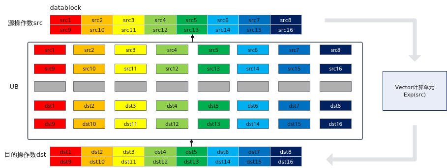
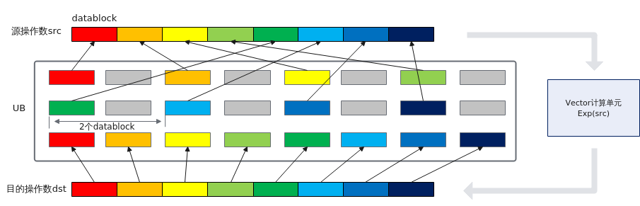
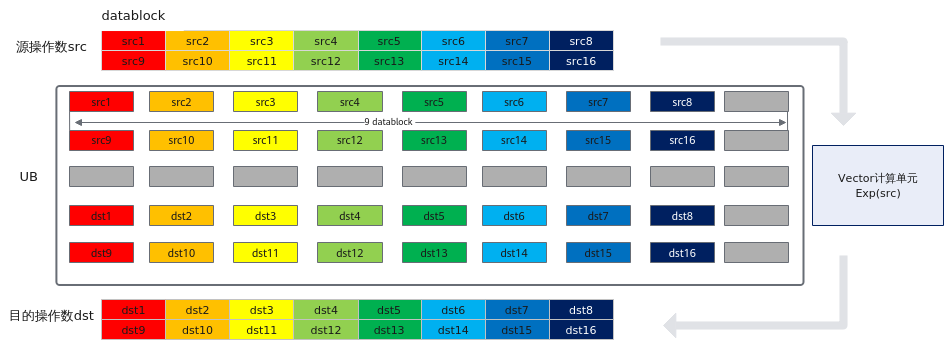
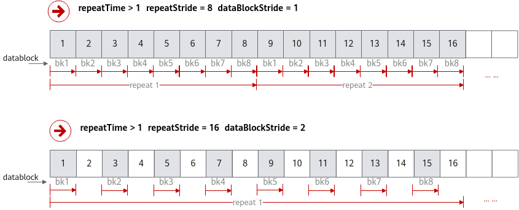
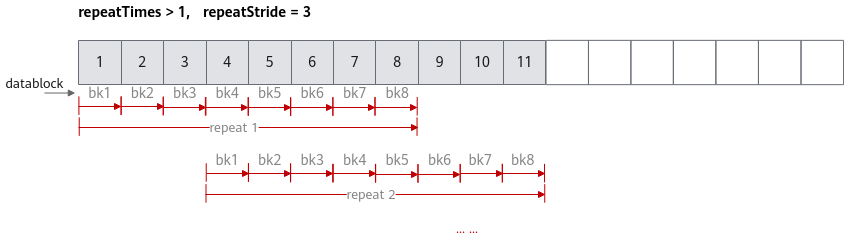
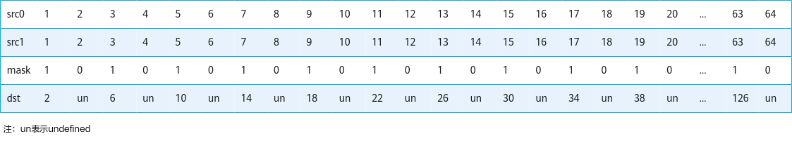

# 通用说明和约束

## 通用地址对齐约束

AI Core上的存储单元用于存储矢量计算、矩阵计算的源操作数和目的操作数，各类存储单元的对齐要求如[表1](#table16278354141117)所示，因此C API操作数的起始地址对齐要求应与这些存储单元的对齐要求保持一致。**需要注意的是，如果接口中已明确说明操作数起始地址对齐要求，则以具体API中的说明为准。**

**表 1**  不同存储单元的对齐要求
|存储单元|对齐要求|
|----------|----------|
|Global Memory|无对齐要求。|
|Unified Buffer|32Byte对齐。|
|L1 Buffer|32Byte对齐。|
|L0A Buffer/L0B Buffer|512Byte对齐。|
|L0C Buffer|64Byte对齐。|
|BiasTable Buffer|64Byte对齐。|
|Fixpipe Buffer|64Byte对齐。|

## 通用地址重叠约束

使用高维切分计算接口时，为了节省地址空间，开发者可以申请一块内存，供源操作数与目的操作数同时使用（即地址重叠）。使用时需要注意以下约束：

- 单次迭代内：源操作数与目的操作数必须100%完全重叠，不支持部分重叠。
- 多次迭代间：不支持前序迭代的目的操作数与后序迭代的源操作数重叠。例如，第N次迭代的目的操作数是第N+1次的源操作数（如下图所示）。在这种情况下，第N次迭代可能会改写覆盖源操作数的数值，导致无法得到预期结果。特别地，对于部分双目计算类的API（asc_add，asc_sub，asc_mul等），当数据类型为half、int32\_t、float时，支持前序迭代的目的操作数与后序迭代的源操作数重叠：仅针对目的操作数和第二个源操作数重叠的情况，且src1RepStride或者dstRepStride必须为0。

**图 1**  地址重叠示例（不支持）

> [!NOTE]说明 
>本节所述地址重叠通用约束适用于一般情况，API参考中如有额外特殊说明的，则以具体API中的说明为准。
>API中没有描述地址重叠约束的，视为不支持高维切分计算的地址重叠，地址重叠时计算结果可能不满足预期。

## 如何使用高维切分计算API

> [!NOTE]说明 
> - 本章节对矢量计算API中的高维切分计算接口做解释说明。
> - 下文中的repeatTime、dataBlockStride、repeatStride为通用描述，其命名不一定与具体指令中的参数命名完全对应。比如，单次迭代内不同DataBlock间地址步长dataBlockStride参数，在单目API中，对应为dst_block_stride，src_block_stride参数；在双目API中，对应为dst_block_stride，src0_block_stride，src1_block_stride参数。您可以在具体接口的参数说明中，找到参数含义的描述。
> - dataBlockStride、repeatStride参数的单位默认为DataBlock（32Byte）。API中有特殊说明的，以API中的说明为准。

使用高维切分计算API可充分发挥硬件优势，支持开发者控制指令的迭代执行和操作数的地址间隔，功能更加灵活。

矢量计算通过Vector计算单元完成，矢量计算的源操作数和目的操作数均通过Unified Buffer（UB）来进行存储。Vector计算单元每个迭代会从UB中取出8个DataBlock（每个DataBlock数据块内部地址连续，长度32Byte），进行计算，并写入对应的8个DataBlock中。下图为单次迭代内的8个DataBlock进行Exp计算的示意图。

**图1** 单次迭代内的8个DataBlock进行Exp计算示意图

- 矢量计算API支持开发者通过repeatTime来配置迭代次数，从而控制指令的多次迭代执行。假设repeatTime设置为2，矢量计算单元会进行2个迭代的计算，可计算出2 * 8（每个迭代8个DataBlock） * 32Byte（每个DataBlock 32Byte） = 512Byte的结果。如果数据类型为half，则计算了256个元素。下图展示了2次迭代Exp计算的示意图。由于硬件限制，repeatTime不能超过255。 
 
**图2** 2次迭代Exp计算

- 针对同一个迭代中的数据，可以通过mask参数进行掩码操作来控制实际参与计算的个数。下图为进行Abs计算时通过mask逐比特模式按位控制哪些元素参与计算的示意图，1表示参与计算，0表示不参与计算。 
 
**图3** 通过mask参数进行掩码操作示意图（以float数据类型为例）

- 矢量计算单元还支持带间隔的向量计算，通过dataBlockStride（单次迭代内不同DataBlock间地址步长）和repeatStride（相邻迭代间相同DataBlock的地址步长）来进行配置。
  - dataBlockStride  
如果需要控制单次迭代内，数据处理的步长，可以通过设置同一迭代内不同DataBlock的地址步长dataBlockStride来实现。下图给出了单次迭代内非连续场景的示意图，示例中源操作数的dataBlockStride配置为2，表示单次迭代内不同DataBlock间地址步长（起始地址之间的间隔）为2个DataBlock。 
**图4** 单次迭代内非连续场景的示意图

  - repeatStride
当repeatTime大于1，需要多次迭代完成矢量计算时，您可以根据不同的使用场景合理设置相邻迭代间相同DataBlock的地址步长repeatStride的值。 
下图给出了多次迭代间非连续场景的示意图，示例中源操作数和目的操作数的repeatStride均配置为9，表示相邻迭代间相同DataBlock起始地址之间的间隔为9个DataBlock。相同DataBlock是指DataBlock在迭代内的位置相同，比如下图中的src1和src9处于相邻迭代，在迭代内都是第一个DataBlock的位置，其间隔即为repeatStride的数值。  
**图5** 多次迭代间非连续场景的示意图

下文中给出了dataBlockStride、repeatStride、mask的详细配置说明和示例。

### dataBlockStride

dataBlockStride是指同一迭代内不同DataBlock的地址步长。
- 连续计算，dataBlockStride设置为1，对同一迭代内的8个DataBlock数据连续进行处理。
- 非连续计算，dataBlockStride值大于1（如取2），同一迭代内不同DataBlock之间在读取数据时出现一个DataBlock的间隔，如下图所示。  
**图6** dataBlockStride不同取值举例

### repeatStride

repeatStride是指相邻迭代间相同DataBlock的地址步长。

- **连续计算场景：** 假设定义一个Tensor供目的操作数和源操作数同时使用（即地址重叠），repeatStride取值为8。此时，矢量计算单元第一次迭代读取连续8个DataBlock，第二轮迭代读取下一个连续的8个DataBlock，通过多次迭代即可完成所有输入数据的计算。

- **非连续计算场景：** repeatStride取值大于8（如取10）时，则相邻迭代间矢量计算单元读取的数据在地址上不连续，出现2个DataBlock的间隔。

- **反复计算场景：** repeatStride取值为0时，矢量计算单元会对首个连续的8个DataBlock进行反复读取和计算。

- **部分重复计算：** repeatStride取值大于0且小于8时，相邻迭代间部分数据会被矢量计算单元重复读取和计算，此种情形一般场景不涉及。

## 掩码操作

mask用于控制每次迭代内参与计算的元素。可以按位控制哪些元素参与计算，bit位的值为1表示参与计算，0表示不参与。
mask实际取值范围和操作数的数据类型有关。当操作数为16位时，mask包含2个uint64_t数据，mask0、mask1∈[0, 2^64-1]并且不同时为0；当操作数为32位时，mask包含1个uint64_t数据，mask0∈(0, 2^64-1]；当操作数为64位时，mask包含1个uint64_t数据，mask0∈(0, 2^32-1]。  

具体样例如下:

~~~cpp
// 数据类型为int16_t
uint64_t mask[2] = {6148914691236517205, 6148914691236517205};
// repeatTime = 1, 共128个元素，单次迭代能处理128个元素，故repeatTime = 1。
// dst_block_stride, src0_block_stride, src1_block_stride = 1, 单次迭代内连续读取和写入数据。
// dst_repeat_stride, src0_repeat_stride, src1_repeat_stride = 8, 迭代间的数据连续读取和写入。
asc_binary_config config;
config.dst_block_stride = 1;
config.src0_block_stride = 1;
config.src1_block_stride = 1;
config.dst_repeat_stride = 8;
config.src0_repeat_stride = 8;
config.src1_repeat_stride = 8;

asc_set_vector_mask(mask[1], mask[0]);
asc_add(dstLocal, src0Local, src1Local, config);
~~~

结果示例如下：

~~~cpp
输入数据(src0Local): [1 2 3 ... 64 ...127 128]
输入数据(src1Local): [1 2 3 ... 64 ...127 128]
输出数据(dstLocal): [2 undefined 6 ... undefined ...254 undefined]
~~~

mask过程如下： 
mask={6148914691236517205, 6148914691236517205}（注：6148914691236517205表示64位二进制数0b010101....01，mask按照低位到高位的顺序排布）

~~~cpp
// 数据类型为int32_t
uint64_t mask[1] = {6148914691236517205};
// repeatTime = 1, 共64个元素，单次迭代能处理64个元素，故repeatTime = 1。
// dst_block_stride, src0_block_stride, src1_block_stride = 1, 单次迭代内连续读取和写入数据。
// dst_repeat_stride, src0_repeat_stride, src1_repeat_stride = 8, 迭代间的数据连续读取和写入。
asc_binary_config config;
config.dst_block_stride = 1;
config.src0_block_stride = 1;
config.src1_block_stride = 1;
config.dst_repeat_stride = 8;
config.src0_repeat_stride = 8;
config.src1_repeat_stride = 8;

asc_set_vector_mask(0, mask[0]);
asc_add(dst, src0, src1, config);
~~~

结果示例如下：

~~~cpp
输入数据(src0): [1 2 3 ... 63 64]
输入数据(src1): [1 2 3 ... 63 64]
输出数据(dst): [2 undefined 6 ... 126 undefined]
~~~

mask过程如下： 
mask={6148914691236517205, 0}（注：6148914691236517205表示64位二进制数0b010101....01）

## 以数组方式申请内存

编译器支持以数组方式申请内存。但需注意以下约束：

- 当前仅支持Ascend 910C和Ascend 910B产品。
- 数组方式的申请方式，和asc_get_phy_buf_addr API接口不能混用。否则可能导致地址重叠。
- 不支持多维数组和嵌套的数组。
- 封装到数据结构中时，不支持隐式构造。
- 不支持动态数组。

基本使用方式如下：

~~~cpp
// 数组长度必须为编译期常量。
constexpr uint32_t src_len = 1024;
constexpr uint32_t dst_len = 128;

// 方式1：直接使用。
__ubuf__ float src[src_len];
__ubuf__ float dst[dst_len];

// 方式2：封装到结构体中使用。
struct UbBuff {
    float src[src_len];
    float dst[dst_len];
}
__ubuf__ UbBuff buff{}; // 必须加{}，不支持隐式构造。

// 不支持的场景举例：
__ubuf__ UbBuff buff[32];  // 不支持数组嵌套，UbBuff中也存在数组。
__ubuf__ float buff[src_len][dst_len]; // 不支持多维数组。
__ubuf__ float buff[result_len]; // 不支持动态数组。result_len为前置操作的计算结果。

// 不支持两种地址申请方式混用。下面的写法获取的src0和src1的起始位置相同：
__ubuf__ float* src0 = (__ubuf__ float*)asc_get_phy_buf_addr(0);
__ubuf__ float src1[src_len];

~~~
