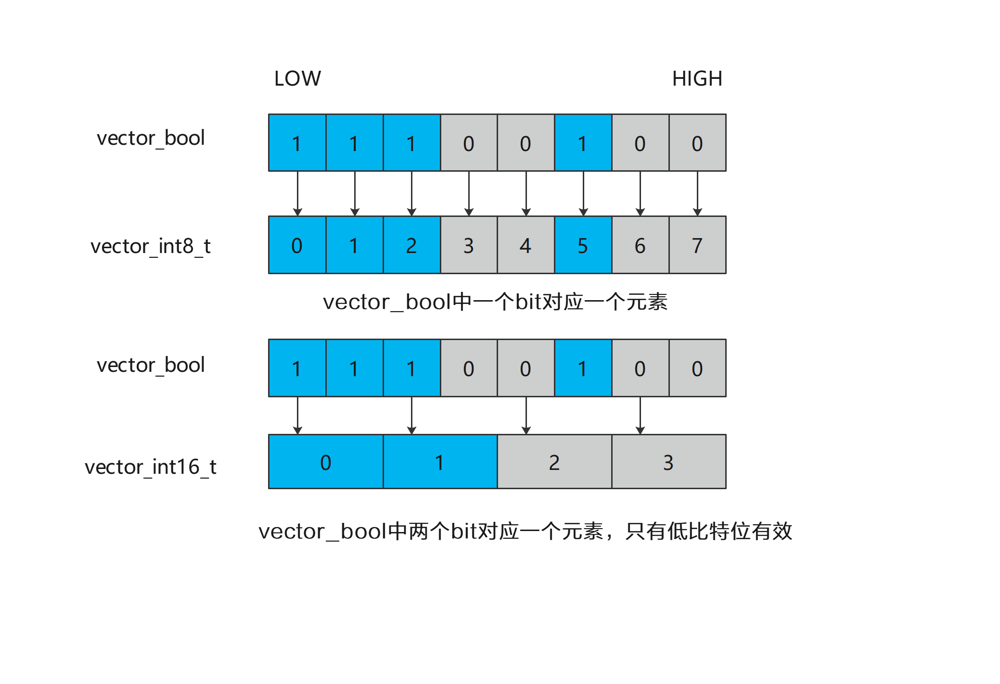

# reg数据类型定义

## 矢量数据寄存器

矢量数据寄存器用于存储矢量数据，其位宽为VL（Vector Length），可存储VL/sizeof(T)的数据（T表示数据类型）。在Ascend 950PR/Ascend 950DT版本中， VL = 256B。例如对于矢量数据类型vector_float，该寄存器可存储的元素数量为256B / sizeof(float) = 64个。

以下是以位宽为分类，列举的所有矢量数据寄存器的数据类型：

| 位宽      | 矢量数据类型|
| --------- | --------- |
| b8        | vector_int8_t/vector_uint8_t/vector_int4x2_t/vector_fp4x2_e2m1_t/vector_fp4x2_e1m2_t/vector_hifloat8_t/vector_fp8_e4m3fn_t/vector_fp8_e5m2_t/vector_fp8_e8m0_t |
| b16       | vector_int16_t/vector_uint16_t/vector_half/vector_bfloat16_t |
| b32       | vector_int32_t/vector_uint32_t/vector_float |
| b64       | vector_int64_t/vector_uint64_t |

**注意：**
vector_int4x2_t、vector_fp4x2_e2m1_t、vector_fp4x2_e1m2_t这三个矢量数据类型在内存中的排布需要将两个元素打包为一个字节的存储单元。

### 调用示例

```cpp
vector_half dst;
half index = 0;
asc_arange(dst, index);
```

## 掩码寄存器

掩码寄存器的数据类型为vector_bool，用于矢量计算中选择参与计算的元素，其位宽为VL/8。



### 调用示例

```cpp
uint32_t length = 255;
vector_bool mask = asc_create_mask_b16(Pat::ALL); // 创建一个所有元素为True的掩码寄存器
vector_bool mask = asc_update_mask_b16(length); // 根据矢量计算需要操作的元素的具体数量，生成对应的掩码寄存器
```

## 非对齐寄存器

非对齐寄存器包括vector_load_align和vector_store_align。这些寄存器作为缓冲区，用于在UB和矢量数据寄存器之间进行连续的非对齐数据搬运，其中非对齐特指数据起始地址未按32字节对齐。在搬运过程中，非对齐数据首先被加载到专用的非对齐寄存器，随后通过相应的搬运接口完成数据的分块读取或写入。

在读非对齐地址前，vector_load_align应该通过asc_loadunalign_pre初始化，然后再使用asc_loadunalign。在写非对齐地址时，应先使用asc_storeunalign，再使用asc_storeunalign_post进行处理。

### 调用示例

```cpp
constexpr uint32_t one_repeat_size = 256 / sizeof(int8_t); // VL / sizeof(T)
uint32_t total_length = 255;
uint32_t repeat_time = (total_length + one_repeat_size - 1) / one_repeat_size;
__simd_vf__ inline void neg_vf(__ubuf__ int8_t* dst_addr, __ubuf__ int8_t* src_addr, uint32_t count,
    uint32_t one_repeat_size, uint16_t repeat_time)
{
    vector_int8_t src;
    vector_int8_t dst;
    vector_load_align ureg0;
    vector_store_align ureg1;
    vector_bool mask;
    for (uint16_t i = 0; i < repeat_time; ++i) {
        mask = asc_update_mask_b8(count);
        asc_loadunalign_pre(ureg0, src_addr + i * one_repeat_size); // 非对齐搬入前的初始化
        asc_loadunalign(src, ureg0, src_addr + i * one_repeat_size); // 配合vector_load_align的使用，非对齐搬入源数据
        asc_neg(dst, src, mask);
        asc_storeunalign(dst_addr + i * one_repeat_size, ureg1, dst, one_repeat_size); // 配合vector_store_align的使用，非对齐搬出目的数据
        asc_storeunalign_post(dst_addr + i * one_repeat_size, ureg1, 0); // 处理非对齐搬出的尾块
    }
}
```

## 地址寄存器

地址寄存器的数据类型为iter_reg，用于存储地址偏移量。iter_reg通过asc_create_vector_address初始化，然后在循环之中使用iter_reg存储地址偏移量。iter_reg在每层循环中根据所设置的步长进行自增。

### 调用示例

```cpp
constexpr uint32_t one_repeat_size = 256 / sizeof(int8_t); // VL / sizeof(T)
uint32_t total_length = 256;
uint32_t repeat_time = total_length / one_repeat_size;
__simd_vf__ inline void add_vf(__ubuf__ int8_t* dst_addr, __ubuf__ int8_t* src0_addr, __ubuf__ int8_t* src1_addr, uint32_t count,
    uint32_t one_repeat_size, uint16_t repeat_time)
{
    vector_int8_t src0;
    vector_int8_t src1;
    vector_int8_t dst;
    vector_bool mask;
    iter_reg addr_reg;
    for (uint16_t i = 0; i < repeat_time; ++i) {
        addr_reg = asc_create_iter_reg_b8(one_repeat_size); // 通过初始化iter_reg，每一次循环，地址偏移one_repeat_size
        mask = asc_update_mask_b8(count);
        asc_loadalign(src0, src0_addr, addr_reg);
        asc_loadalign(src1, src1_addr, addr_reg);
        asc_add(dst, src0, src1, mask);
        asc_storealign(dst_addr, dst, addr_reg, mask);
    }
}
```
