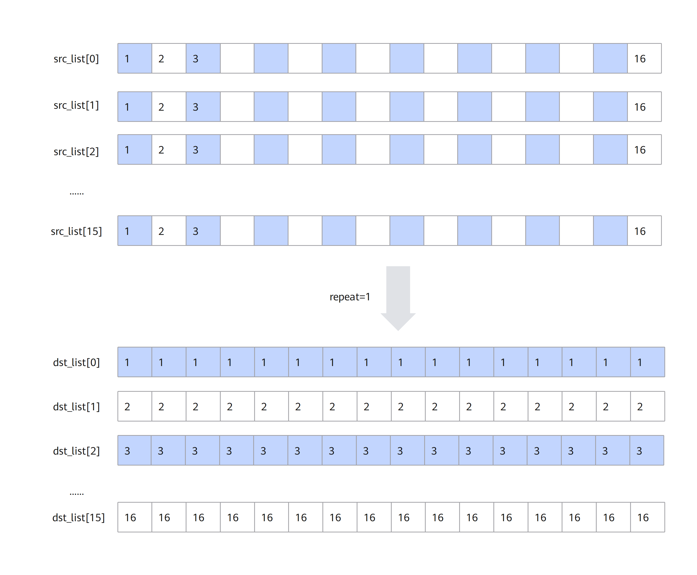
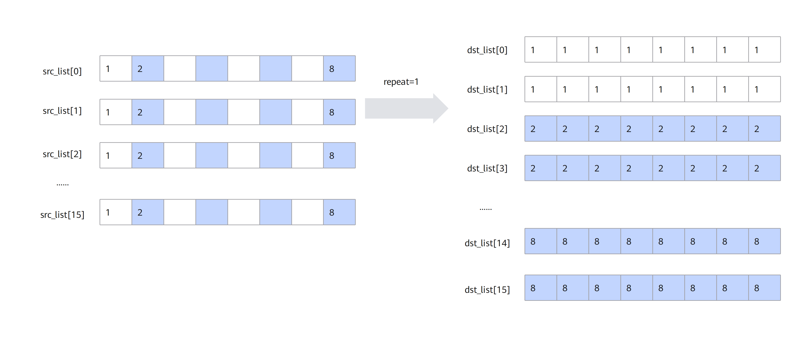
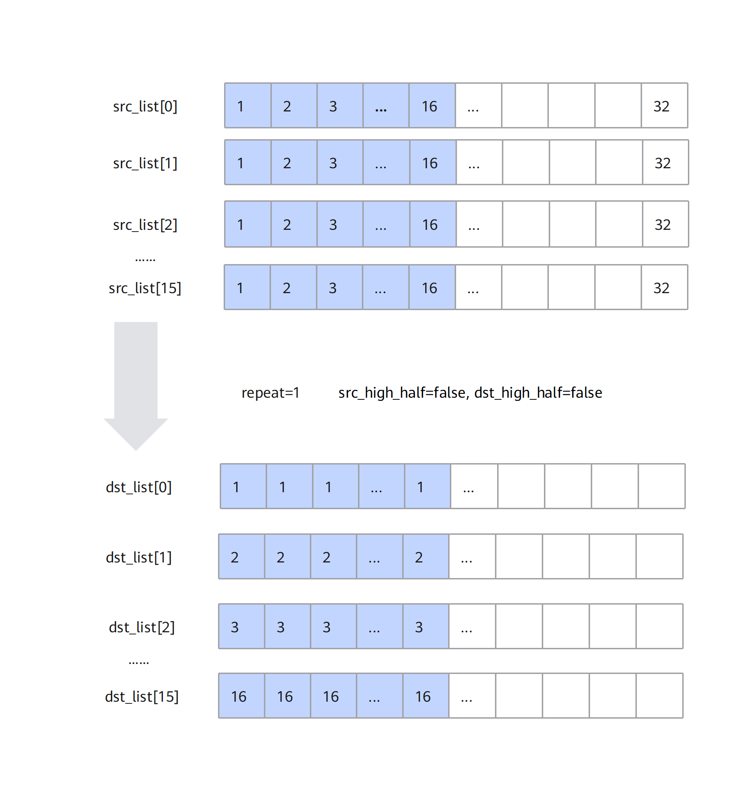
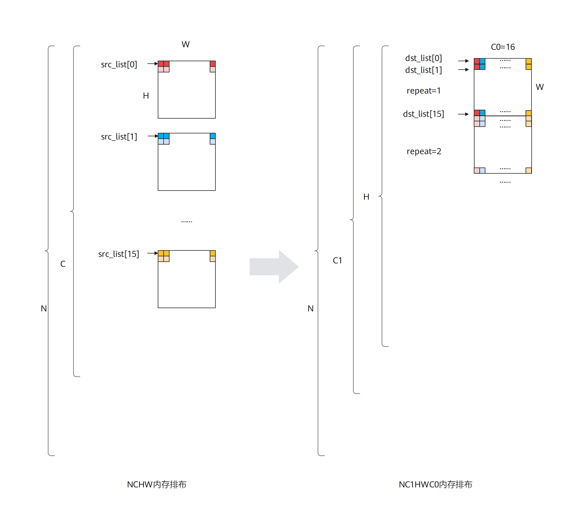

# asc_transto5hd

## 产品支持情况

|产品|是否支持|
| :------------ | :------------: |
| <term>Atlas A3 训练系列产品/Atlas A3 推理系列产品</term> | √ |
| <term>Atlas A2 训练系列产品/Atlas A2 推理系列产品</term> | √ |

## 功能说明

数据格式转换，一般用于将NCHW格式转换成NC1HWC0格式。特别的，也可以用于二维矩阵数据块的转置。本接口单次Repeat内可处理512Byte的数据（16个DataBlock），根据数据类型不同，支持不同shape的矩阵转置（比如数据类型为half时，单次Repeat可完成16*16大小的矩阵转置），同时还可以支持多次Repeat操作。

单次repeat内转换规则如下：

- 当输入数据类型位宽为16位时，每个DataBlock中包含16个数，指令内部会循环16次，每次循环都会分别从指定的16个DataBlock中的对应位置取值，组成一个新的DataBlock单元放入目的地址中。如下图所示，图中的srcList[0]-srcList[15]代表源操作数的16个DataBlock。

- 当数据类型位宽为32位时，每个DataBlock包含8个数，指令内部会循环8次，每次循环都会分别从指定的16个DataBlock中的对应位置取值，组成2个新的DataBlock放入目的地址中。如下图所示：

-当数据类型位宽为8位时，每个DataBlock包含32个数，指令内部会循环16次，每次循环都会分别从指定的16个DataBlock中的对应位置取值，组成半个DataBlock放入目的地址中，读取和存放是在DataBlock的高半部还是低半部由参数srcHighHalf和dstHighHalf决定。如下图所示：

基于以上的转换规则，使用该接口进行NC1HWC0格式转换或者矩阵转置。NC1HWC0格式转换相对复杂，这里给出其具体的转换方法：

NCHW格式转换成NC1HWC0格式时，如果是数据类型的位宽为32位或者16位，则C0=16；如果数据类型的位宽为8位，则C0=32。下图以C0=16为例进行介绍：

## 函数原型

```cpp
__aicore__ inline void asc_transto5hd_b32(ub_addr8_t dst, ub_addr8_t src, uint8_t repeat,
    uint16_t dst_stride, uint16_t src_stride)
__aicore__ inline void asc_transto5hd_b16(ub_addr8_t dst, ub_addr8_t src, uint8_t repeat,
    uint16_t dst_stride, uint16_t src_stride)
__aicore__ inline void asc_transto5hd_b8(ub_addr8_t dst, ub_addr8_t src, uint8_t repeat,
    uint16_t dst_stride, uint16_t src_stride, bool dst_high_half, bool src_high_half)
```

## 参数说明

|参数名|输入/输出|描述|
| ------------ | ------------ | ------------ |
|addr|输出|地址寄存器。|
|src_array|输入|操作数地址序列。|
|dst|输出|目的地址寄存器。|
|src|输入|源地址寄存器。|
|repeat|输入|重复迭代次数， repeat∈[0,255]。<br>注意事项：<br>&bull; 当repeat为1时，目的操作数/源操作数的有效起始位置为dst/src序列输入的起始位置加上dst_stride/src_stride。如果要让目的操作数/源操作数的有效起始位置为dst/src序列输入的起始位置，需要将dst_stride/src_stride置为0。<br>&bull;当repeat大于1时，第一次repeat中目的操作数/源操作数的有效起始位置为dst/src序列输入的起始位置，第二次会加上dst_stride/src_stride。以此类推。|
|dst_stride|输入|相邻迭代间，目的操作数相同DataBlock地址Stride，单位：DataBlock。<br>相邻迭代间相同DataBlock的地址步长参数的详细说明请参考[repeatStride](../general_instruction.md#repeatStride)。|
|src_stride|输入|相邻迭代间，源操作数相同DataBlock地址Stride，单位：DataBlock。<br>相邻迭代间相同DataBlock的地址步长参数的详细说明请参考[repeatStride](../general_instruction.md#repeatStride)。|
|dst_high_half|输入|指定每个dst地址中的数据存储到DataBlock的高半部还是低半部，该配置只配置int8_t/uint8_t的数据类型。<br>支持的数据类型为bool，有以下两种取值：<br>&bull; true:表示存储于DataBlock的高半部。<br>&bull; false:表示存储于DataBlock的低半部。|
|src_high_half|输入|指定每个src地址中的数据存储到DataBlock的高半部还是低半部，该配置只配置int8_t/uint8_t的数据类型。<br>支持的数据类型为bool，有以下两种取值：<br>&bull; true:表示存储于DataBlock的高半部。<br>&bull;false:表示存储于DataBlock的低半部。|

## 返回值说明

无

## 流水类型

PIPE_TYPE_V

## 约束说明

- 操作数地址对齐约束请参考[通用地址对齐约束](../general_instruction.md#通用地址对齐约束)。
- 操作数地址重叠约束请参考[通用地址重叠约束](../general_instruction.md#通用地址重叠约束)。
- 进行NCHW格式到NC1HWC0格式的转换时，一般用法是将src/dst中的每个元素配置为每个HW平面的起点。
- 为了性能更优，数据类型位宽为8位时建议先固定dst_high_half/src_high_half，再HW方向Repeat后，再改变dst_high_half/src_high_half。

## 调用示例

```cpp
constexpr uint64_t total_length = 256;    // total_length指参与计算的数据长度
__ubuf__ half src[total_length];
__ubuf__ half dst[total_length];
const uint32_t STEP = 16;
// src_list和dst_list是16个DataBlock地址的数组
__ubuf__ half* src_list[16] = {
    (__ubuf__ half*)(src + 0 * STEP),
    (__ubuf__ half*)(src + 1 * STEP),
    (__ubuf__ half*)(src + 2 * STEP),
    (__ubuf__ half*)(src + 3 * STEP),
    (__ubuf__ half*)(src + 4 * STEP),
    (__ubuf__ half*)(src + 5 * STEP),
    (__ubuf__ half*)(src + 6 * STEP),
    (__ubuf__ half*)(src + 7 * STEP),
    (__ubuf__ half*)(src + 8 * STEP),
    (__ubuf__ half*)(src + 9 * STEP),
    (__ubuf__ half*)(src + 10 * STEP),
    (__ubuf__ half*)(src + 11 * STEP),
    (__ubuf__ half*)(src + 12 * STEP),
    (__ubuf__ half*)(src + 13 * STEP),
    (__ubuf__ half*)(src + 14 * STEP),
    (__ubuf__ half*)(src + 15 * STEP)
};
__ubuf__ half* dst_list[16] = {
    (__ubuf__ half*)(dst + 0 * STEP),
    (__ubuf__ half*)(dst + 1 * STEP),
    (__ubuf__ half*)(dst + 2 * STEP),
    (__ubuf__ half*)(dst + 3 * STEP),
    (__ubuf__ half*)(dst + 4 * STEP),
    (__ubuf__ half*)(dst + 5 * STEP),
    (__ubuf__ half*)(dst + 6 * STEP),
    (__ubuf__ half*)(dst + 7 * STEP),
    (__ubuf__ half*)(dst + 8 * STEP),
    (__ubuf__ half*)(dst + 9 * STEP),
    (__ubuf__ half*)(dst + 10 * STEP),
    (__ubuf__ half*)(dst + 11 * STEP),
    (__ubuf__ half*)(dst + 12 * STEP),
    (__ubuf__ half*)(dst + 13 * STEP),
    (__ubuf__ half*)(dst + 14 * STEP),
    (__ubuf__ half*)(dst + 15 * STEP)
};
const int32_t VA_REG_ARRAY_LEN = 8;
uint8_t repeat = 16;
uint16_t dst_stride = 16;
uint16_t src_stride = 1;

// asc_set_va_reg接口要求前8个和后8个地址序列与地址寄存器分别关联
asc_set_va_reg(VA0, dst_list);
asc_set_va_reg(VA1, dst_list + VA_REG_ARRAY_LEN);
asc_set_va_reg(VA2, src_list);
asc_set_va_reg(VA3, src_list + VA_REG_ARRAY_LEN);

asc_transto5hd_b16(VA0, VA2, repeat, dst_stride, src_stride);
```