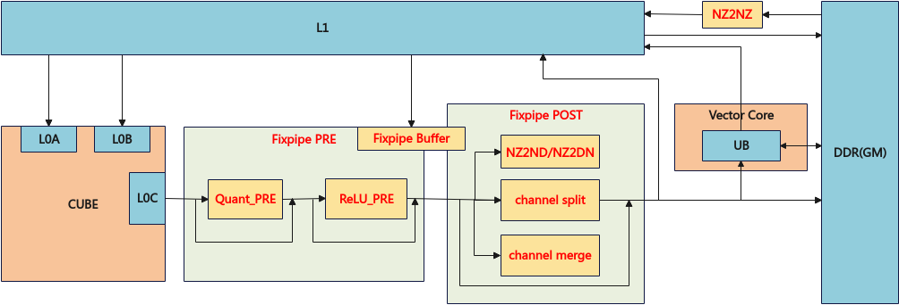

# 矩阵计算的搬出总体说明

矩阵计算的搬出接口主要实现L0C Buffer与Global Memory、Unified Buffer之间的数据高效传输。

针对Ascend 950PR/Ascend 950DT：

**图1** 矩阵计算搬出整体流程图

**表1** **数据通路与存储层级**

|源位置|源地址对齐要求|目的位置|目的地址对齐要求|格式转换|典型应用场景|
|--------|--------|--------|--------|--------|--------|
|L0C Buffer|64字节|Global Memory|1字节/32字节|NZ2ND、NZ2DN、NZ2NZ|从L0C Buffer搬出数据至Global Memory|
|L0C Buffer|64字节|Unified Buffer|32字节|NZ2ND、NZ2DN、NZ2NZ|从L0C Buffer搬出数据至Unified Buffer|
