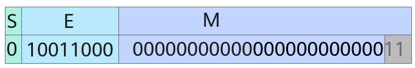

# 内置数据类型<a name="ZH-CN_TOPIC_0000002313437229"></a>

## 数据类型列表<a name="section16395539499"></a>

Ascend C提供b8\~b64（8bit\~64bit）四种不同位宽的数据类型，不同位宽对应的数据类型如下表所示。

**表 1**  不同位宽对应的数据类型

<a name="table7573171913240"></a>
<table><thead align="left"><tr id="row1574151952417"><th class="cellrowborder" valign="top" width="15.260000000000002%" id="mcps1.2.3.1.1"><p id="p18574119122411"><a name="p18574119122411"></a><a name="p18574119122411"></a>位宽</p>
</th>
<th class="cellrowborder" valign="top" width="84.74000000000001%" id="mcps1.2.3.1.2"><p id="p10574171918241"><a name="p10574171918241"></a><a name="p10574171918241"></a>数据类型</p>
</th>
</tr>
</thead>
<tbody><tr id="row257471916249"><td class="cellrowborder" valign="top" width="15.260000000000002%" headers="mcps1.2.3.1.1 "><p id="p0574101902410"><a name="p0574101902410"></a><a name="p0574101902410"></a>b8</p>
</td>
<td class="cellrowborder" valign="top" width="84.74000000000001%" headers="mcps1.2.3.1.2 "><p id="p0574191972415"><a name="p0574191972415"></a><a name="p0574191972415"></a>bool、int8_t、uint8_t、fp4x2_e2m1_t、fp4x2_e1m2_t、hifloat8_t、fp8_e5m2_t、fp8_e4m3fn_t、fp8_e8m0_t、int4x2_t。</p>
</td>
</tr>
<tr id="row1357411902413"><td class="cellrowborder" valign="top" width="15.260000000000002%" headers="mcps1.2.3.1.1 "><p id="p1057471912420"><a name="p1057471912420"></a><a name="p1057471912420"></a>b16</p>
</td>
<td class="cellrowborder" valign="top" width="84.74000000000001%" headers="mcps1.2.3.1.2 "><p id="p1574101915249"><a name="p1574101915249"></a><a name="p1574101915249"></a>int16_t、uint16_t、half、bfloat16_t。</p>
</td>
</tr>
<tr id="row12574171972412"><td class="cellrowborder" valign="top" width="15.260000000000002%" headers="mcps1.2.3.1.1 "><p id="p1057411952416"><a name="p1057411952416"></a><a name="p1057411952416"></a>b32</p>
</td>
<td class="cellrowborder" valign="top" width="84.74000000000001%" headers="mcps1.2.3.1.2 "><p id="p3574101913248"><a name="p3574101913248"></a><a name="p3574101913248"></a>int32_t、uint32_t、float、complex32。</p>
</td>
</tr>
<tr id="row12272125682418"><td class="cellrowborder" valign="top" width="15.260000000000002%" headers="mcps1.2.3.1.1 "><p id="p727395614245"><a name="p727395614245"></a><a name="p727395614245"></a>b64</p>
</td>
<td class="cellrowborder" valign="top" width="84.74000000000001%" headers="mcps1.2.3.1.2 "><p id="p14273165616243"><a name="p14273165616243"></a><a name="p14273165616243"></a>int64_t、uint64_t、double、complex64。</p>
</td>
</tr>
</tbody>
</table>

为了方便描述这些数据类型，提供如下的数据类型简写：

<a name="table1342874793418"></a>
<table><thead align="left"><tr id="row9428174793410"><th class="cellrowborder" valign="top" width="50%" id="mcps1.1.3.1.1"><p id="p16428647203419"><a name="p16428647203419"></a><a name="p16428647203419"></a>数据类型简写（位宽从低到高）</p>
</th>
<th class="cellrowborder" valign="top" width="50%" id="mcps1.1.3.1.2"><p id="p1242824793419"><a name="p1242824793419"></a><a name="p1242824793419"></a>对应数据类型</p>
</th>
</tr>
</thead>
<tbody><tr id="row8428184783415"><td class="cellrowborder" valign="top" width="50%" headers="mcps1.1.3.1.1 "><p id="p950529203517"><a name="p950529203517"></a><a name="p950529203517"></a>S4</p>
</td>
<td class="cellrowborder" valign="top" width="50%" headers="mcps1.1.3.1.2 "><p id="p1942844743411"><a name="p1942844743411"></a><a name="p1942844743411"></a>int4b_t</p>
</td>
</tr>
<tr id="row842814476349"><td class="cellrowborder" valign="top" width="50%" headers="mcps1.1.3.1.1 "><p id="p1342810475345"><a name="p1342810475345"></a><a name="p1342810475345"></a>U8</p>
</td>
<td class="cellrowborder" valign="top" width="50%" headers="mcps1.1.3.1.2 "><p id="p1642864723415"><a name="p1642864723415"></a><a name="p1642864723415"></a>uint8_t</p>
</td>
</tr>
<tr id="row9948161413819"><td class="cellrowborder" valign="top" width="50%" headers="mcps1.1.3.1.1 "><p id="p1394951413382"><a name="p1394951413382"></a><a name="p1394951413382"></a>S8</p>
</td>
<td class="cellrowborder" valign="top" width="50%" headers="mcps1.1.3.1.2 "><p id="p2949111443815"><a name="p2949111443815"></a><a name="p2949111443815"></a>int8_t</p>
</td>
</tr>
<tr id="row1038813425385"><td class="cellrowborder" valign="top" width="50%" headers="mcps1.1.3.1.1 "><p id="p1138813425380"><a name="p1138813425380"></a><a name="p1138813425380"></a>U16</p>
</td>
<td class="cellrowborder" valign="top" width="50%" headers="mcps1.1.3.1.2 "><p id="p538844219387"><a name="p538844219387"></a><a name="p538844219387"></a>uint16_t</p>
</td>
</tr>
<tr id="row172201336164612"><td class="cellrowborder" valign="top" width="50%" headers="mcps1.1.3.1.1 "><p id="p3220136114618"><a name="p3220136114618"></a><a name="p3220136114618"></a>S16</p>
</td>
<td class="cellrowborder" valign="top" width="50%" headers="mcps1.1.3.1.2 "><p id="p2220336154611"><a name="p2220336154611"></a><a name="p2220336154611"></a>int16_t</p>
</td>
</tr>
<tr id="row18870555104617"><td class="cellrowborder" valign="top" width="50%" headers="mcps1.1.3.1.1 "><p id="p68701655134619"><a name="p68701655134619"></a><a name="p68701655134619"></a>U32</p>
</td>
<td class="cellrowborder" valign="top" width="50%" headers="mcps1.1.3.1.2 "><p id="p1587016553469"><a name="p1587016553469"></a><a name="p1587016553469"></a>uint32_t</p>
</td>
</tr>
<tr id="row1215621544717"><td class="cellrowborder" valign="top" width="50%" headers="mcps1.1.3.1.1 "><p id="p715651517473"><a name="p715651517473"></a><a name="p715651517473"></a>S32</p>
</td>
<td class="cellrowborder" valign="top" width="50%" headers="mcps1.1.3.1.2 "><p id="p9156415104711"><a name="p9156415104711"></a><a name="p9156415104711"></a>int32_t</p>
</td>
</tr>
<tr id="row9565156194813"><td class="cellrowborder" valign="top" width="50%" headers="mcps1.1.3.1.1 "><p id="p165651669489"><a name="p165651669489"></a><a name="p165651669489"></a>U64</p>
</td>
<td class="cellrowborder" valign="top" width="50%" headers="mcps1.1.3.1.2 "><p id="p156514614811"><a name="p156514614811"></a><a name="p156514614811"></a>uint64_t</p>
</td>
</tr>
<tr id="row666164715484"><td class="cellrowborder" valign="top" width="50%" headers="mcps1.1.3.1.1 "><p id="p267184724815"><a name="p267184724815"></a><a name="p267184724815"></a>S64</p>
</td>
<td class="cellrowborder" valign="top" width="50%" headers="mcps1.1.3.1.2 "><p id="p16720479486"><a name="p16720479486"></a><a name="p16720479486"></a>int64_t</p>
</td>
</tr>
<tr id="row1826345894813"><td class="cellrowborder" valign="top" width="50%" headers="mcps1.1.3.1.1 "><p id="p172631458134818"><a name="p172631458134818"></a><a name="p172631458134818"></a>FP8_E4M3</p>
</td>
<td class="cellrowborder" valign="top" width="50%" headers="mcps1.1.3.1.2 "><p id="p192631058174810"><a name="p192631058174810"></a><a name="p192631058174810"></a>fp8_e4m3fn_t</p>
</td>
</tr>
<tr id="row22497425111"><td class="cellrowborder" valign="top" width="50%" headers="mcps1.1.3.1.1 "><p id="p22491948517"><a name="p22491948517"></a><a name="p22491948517"></a>HiF8</p>
</td>
<td class="cellrowborder" valign="top" width="50%" headers="mcps1.1.3.1.2 "><p id="p924914420515"><a name="p924914420515"></a><a name="p924914420515"></a>hifloat8_t</p>
</td>
</tr>
<tr id="row250316520518"><td class="cellrowborder" valign="top" width="50%" headers="mcps1.1.3.1.1 "><p id="p2050365219512"><a name="p2050365219512"></a><a name="p2050365219512"></a>FP16</p>
</td>
<td class="cellrowborder" valign="top" width="50%" headers="mcps1.1.3.1.2 "><p id="p155031052195119"><a name="p155031052195119"></a><a name="p155031052195119"></a>half</p>
</td>
</tr>
<tr id="row66783095314"><td class="cellrowborder" valign="top" width="50%" headers="mcps1.1.3.1.1 "><p id="p196786075318"><a name="p196786075318"></a><a name="p196786075318"></a>BF16</p>
</td>
<td class="cellrowborder" valign="top" width="50%" headers="mcps1.1.3.1.2 "><p id="p116787012537"><a name="p116787012537"></a><a name="p116787012537"></a>bfloat16_t</p>
</td>
</tr>
<tr id="row1772712116539"><td class="cellrowborder" valign="top" width="50%" headers="mcps1.1.3.1.1 "><p id="p3727182118536"><a name="p3727182118536"></a><a name="p3727182118536"></a>FP32</p>
</td>
<td class="cellrowborder" valign="top" width="50%" headers="mcps1.1.3.1.2 "><p id="p167271421115319"><a name="p167271421115319"></a><a name="p167271421115319"></a>float</p>
</td>
</tr>
</tbody>
</table>

> [!NOTE]说明 
>其中，只有bool、int8\_t、uint8\_t、int16\_t、uint16\_t、half、int32\_t、uint32\_t、float、int64\_t、uint64\_t这些数据类型支持使用立即数进行赋值和初始化。
>示例：
>```
>int8_t scalar = 1;
>int32_t valueOut = AscendC::Cast<float, int32_t, AscendC::RoundMode::CAST_ROUND>((float)1);
>```

## 数据类型的产品支持情况<a name="section137212564579"></a>

<a name="table38301303189"></a>
<table><thead align="left"><tr id="row20831180131817"><th class="cellrowborder" valign="top" width="50.470000000000006%" id="mcps1.1.3.1.1"><p id="p1883113061818"><a name="p1883113061818"></a><a name="p1883113061818"></a><span id="ph20833205312295"><a name="ph20833205312295"></a><a name="ph20833205312295"></a>产品</span></p>
</th>
<th class="cellrowborder" align="center" valign="top" width="49.53%" id="mcps1.1.3.1.2"><p id="p57812403018"><a name="p57812403018"></a><a name="p57812403018"></a>支持的数据类型</p>
</th>
</tr>
</thead>
<tbody><tr id="row1272474920205"><td class="cellrowborder" valign="top" width="50.470000000000006%" headers="mcps1.1.3.1.1 "><p id="p17301775812"><a name="p17301775812"></a><a name="p17301775812"></a><span id="ph2272194216543"><a name="ph2272194216543"></a><a name="ph2272194216543"></a>Ascend 950PR/Ascend 950DT</span></p>
</td>
<td class="cellrowborder" align="center" valign="top" width="49.53%" headers="mcps1.1.3.1.2 "><p id="p8149205111016"><a name="p8149205111016"></a><a name="p8149205111016"></a>bool、int8_t、uint8_t、fp4x2_e2m1_t、fp4x2_e1m2_t、hifloat8_t、fp8_e5m2_t、fp8_e4m3fn_t、fp8_e8m0_t、int4x2_t、int16_t、uint16_t、half、bfloat16_t、int32_t、uint32_t、float、complex32、int64_t、uint64_t、double、complex64。</p>
</td>
</tr>
<tr id="row220181016240"><td class="cellrowborder" valign="top" width="50.470000000000006%" headers="mcps1.1.3.1.1 "><p id="p48327011813"><a name="p48327011813"></a><a name="p48327011813"></a><span id="ph583230201815"><a name="ph583230201815"></a><a name="ph583230201815"></a><term id="zh-cn_topic_0000001312391781_term1253731311225"><a name="zh-cn_topic_0000001312391781_term1253731311225"></a><a name="zh-cn_topic_0000001312391781_term1253731311225"></a>Atlas A3 训练系列产品</term>/<term id="zh-cn_topic_0000001312391781_term131434243115"><a name="zh-cn_topic_0000001312391781_term131434243115"></a><a name="zh-cn_topic_0000001312391781_term131434243115"></a>Atlas A3 推理系列产品</term></span></p>
</td>
<td class="cellrowborder" align="center" valign="top" width="49.53%" headers="mcps1.1.3.1.2 "><p id="p131491751004"><a name="p131491751004"></a><a name="p131491751004"></a>int8_t、uint8_t、int16_t、uint16_t、int32_t、uint32_t、int64_t、uint64_t、half、bfloat16_t、float、double。</p>
</td>
</tr>
<tr id="row173226882415"><td class="cellrowborder" valign="top" width="50.470000000000006%" headers="mcps1.1.3.1.1 "><p id="p14832120181815"><a name="p14832120181815"></a><a name="p14832120181815"></a><span id="ph1483216010188"><a name="ph1483216010188"></a><a name="ph1483216010188"></a><term id="zh-cn_topic_0000001312391781_term11962195213215"><a name="zh-cn_topic_0000001312391781_term11962195213215"></a><a name="zh-cn_topic_0000001312391781_term11962195213215"></a>Atlas A2 训练系列产品</term>/<term id="zh-cn_topic_0000001312391781_term184716139811"><a name="zh-cn_topic_0000001312391781_term184716139811"></a><a name="zh-cn_topic_0000001312391781_term184716139811"></a>Atlas A2 推理系列产品</term></span></p>
</td>
<td class="cellrowborder" align="center" valign="top" width="49.53%" headers="mcps1.1.3.1.2 "><p id="p141486516016"><a name="p141486516016"></a><a name="p141486516016"></a>int8_t、uint8_t、int16_t、uint16_t、int32_t、uint32_t、int64_t、uint64_t、half、bfloat16_t、float、double。</p>
</td>
</tr>
</tbody>
</table>

## 布尔型<a name="section82692022135113"></a>

bool类型占8比特，全0时代表false，否则代表true。

## 整数<a name="section1529635411502"></a>

整数由符号位（S）和数值部分（M）组成，不同类型的整数在符号位和数值部分的比特分配上有所不同。无符号整数没有符号位，所有比特均用于表示数值。

下图是一个int8\_t类型的示例，其符号位占用1位，数值部分占用7位。S<sub>v</sub>=1，M<sub>v</sub>  = 2<sup>5</sup>  + 2<sup>6</sup>，表示的结果为96。下标v表示符号位和数值部分的具体数值。


整数数据类型取值范围见下表。

**表 2**  整数数据类型取值范围

<a name="table59122111192"></a>
<table><thead align="left"><tr id="row1991210181918"><th class="cellrowborder" valign="top" width="33.879999999999995%" id="mcps1.2.3.1.1"><p id="p1991261191915"><a name="p1991261191915"></a><a name="p1991261191915"></a>类型</p>
</th>
<th class="cellrowborder" valign="top" width="66.12%" id="mcps1.2.3.1.2"><p id="p8325194310200"><a name="p8325194310200"></a><a name="p8325194310200"></a>取值范围</p>
</th>
</tr>
</thead>
<tbody><tr id="row13471617153011"><td class="cellrowborder" valign="top" width="33.879999999999995%" headers="mcps1.2.3.1.1 "><p id="p1147171703016"><a name="p1147171703016"></a><a name="p1147171703016"></a>int4x2_t（int4b_t）</p>
</td>
<td class="cellrowborder" valign="top" width="66.12%" headers="mcps1.2.3.1.2 "><p id="p047017163015"><a name="p047017163015"></a><a name="p047017163015"></a>[-8, 7]</p>
</td>
</tr>
<tr id="row1391210141912"><td class="cellrowborder" valign="top" width="33.879999999999995%" headers="mcps1.2.3.1.1 "><p id="p9913310196"><a name="p9913310196"></a><a name="p9913310196"></a>int8_t</p>
</td>
<td class="cellrowborder" valign="top" width="66.12%" headers="mcps1.2.3.1.2 "><p id="p119136151919"><a name="p119136151919"></a><a name="p119136151919"></a>[-128, 127]</p>
</td>
</tr>
<tr id="row1891310191917"><td class="cellrowborder" valign="top" width="33.879999999999995%" headers="mcps1.2.3.1.1 "><p id="p89137151914"><a name="p89137151914"></a><a name="p89137151914"></a>uint8_t</p>
</td>
<td class="cellrowborder" valign="top" width="66.12%" headers="mcps1.2.3.1.2 "><p id="p1791310191916"><a name="p1791310191916"></a><a name="p1791310191916"></a>[0, 255]</p>
</td>
</tr>
<tr id="row1391316110197"><td class="cellrowborder" valign="top" width="33.879999999999995%" headers="mcps1.2.3.1.1 "><p id="p13913131181912"><a name="p13913131181912"></a><a name="p13913131181912"></a>int16_t</p>
</td>
<td class="cellrowborder" valign="top" width="66.12%" headers="mcps1.2.3.1.2 "><p id="p1791313181918"><a name="p1791313181918"></a><a name="p1791313181918"></a>[-32768, 32767]</p>
</td>
</tr>
<tr id="row832135242812"><td class="cellrowborder" valign="top" width="33.879999999999995%" headers="mcps1.2.3.1.1 "><p id="p332125292820"><a name="p332125292820"></a><a name="p332125292820"></a>uint16_t</p>
</td>
<td class="cellrowborder" valign="top" width="66.12%" headers="mcps1.2.3.1.2 "><p id="p43255252818"><a name="p43255252818"></a><a name="p43255252818"></a>[0, 65535]</p>
</td>
</tr>
<tr id="row841735611288"><td class="cellrowborder" valign="top" width="33.879999999999995%" headers="mcps1.2.3.1.1 "><p id="p12417105613289"><a name="p12417105613289"></a><a name="p12417105613289"></a>int32_t</p>
</td>
<td class="cellrowborder" valign="top" width="66.12%" headers="mcps1.2.3.1.2 "><p id="p104171356152817"><a name="p104171356152817"></a><a name="p104171356152817"></a>[-2147483648, 2147483647]</p>
</td>
</tr>
<tr id="row696784742814"><td class="cellrowborder" valign="top" width="33.879999999999995%" headers="mcps1.2.3.1.1 "><p id="p11968134711285"><a name="p11968134711285"></a><a name="p11968134711285"></a>uint32_t</p>
</td>
<td class="cellrowborder" valign="top" width="66.12%" headers="mcps1.2.3.1.2 "><p id="p199681647132815"><a name="p199681647132815"></a><a name="p199681647132815"></a>[0, 4294967295]</p>
</td>
</tr>
<tr id="row1481314313283"><td class="cellrowborder" valign="top" width="33.879999999999995%" headers="mcps1.2.3.1.1 "><p id="p12813743152811"><a name="p12813743152811"></a><a name="p12813743152811"></a>int64_t</p>
</td>
<td class="cellrowborder" valign="top" width="66.12%" headers="mcps1.2.3.1.2 "><p id="p8813204316281"><a name="p8813204316281"></a><a name="p8813204316281"></a>[-9223372036854775808, 9223372036854775807]</p>
</td>
</tr>
<tr id="row1968436103615"><td class="cellrowborder" valign="top" width="33.879999999999995%" headers="mcps1.2.3.1.1 "><p id="p2068411633620"><a name="p2068411633620"></a><a name="p2068411633620"></a>uint64_t</p>
</td>
<td class="cellrowborder" valign="top" width="66.12%" headers="mcps1.2.3.1.2 "><p id="p1968436163610"><a name="p1968436163610"></a><a name="p1968436163610"></a>[0,18446744073709551615]</p>
</td>
</tr>
</tbody>
</table>

> [!NOTE]说明 
>int4x2\_t数据类型会将两个独立的四位整形数打包为一个8比特存储单元。

## 浮点数<a name="section1330111025115"></a>

浮点数数据类型的取值范围如下表所示。

**表 3**  浮点数据类型

<a name="table1347110513239"></a>
<table><thead align="left"><tr id="row1747155132311"><th class="cellrowborder" valign="top" width="20.327967203279673%" id="mcps1.2.6.1.1"><p id="p747113512239"><a name="p747113512239"></a><a name="p747113512239"></a>类型</p>
</th>
<th class="cellrowborder" valign="top" width="10.958904109589042%" id="mcps1.2.6.1.2"><p id="p1947105122315"><a name="p1947105122315"></a><a name="p1947105122315"></a>符号位宽</p>
</th>
<th class="cellrowborder" valign="top" width="14.51854814518548%" id="mcps1.2.6.1.3"><p id="p1947116552317"><a name="p1947116552317"></a><a name="p1947116552317"></a>指数位宽</p>
</th>
<th class="cellrowborder" valign="top" width="12.778722127787221%" id="mcps1.2.6.1.4"><p id="p1747111518232"><a name="p1747111518232"></a><a name="p1747111518232"></a>尾数位宽</p>
</th>
<th class="cellrowborder" valign="top" width="41.415858414158585%" id="mcps1.2.6.1.5"><p id="p164711354238"><a name="p164711354238"></a><a name="p164711354238"></a>取值范围</p>
</th>
</tr>
</thead>
<tbody><tr id="row154715510231"><td class="cellrowborder" valign="top" width="20.327967203279673%" headers="mcps1.2.6.1.1 "><p id="p647145142313"><a name="p647145142313"></a><a name="p647145142313"></a>fp4x2_e2m1_t</p>
</td>
<td class="cellrowborder" valign="top" width="10.958904109589042%" headers="mcps1.2.6.1.2 "><p id="p0471658239"><a name="p0471658239"></a><a name="p0471658239"></a>1</p>
</td>
<td class="cellrowborder" valign="top" width="14.51854814518548%" headers="mcps1.2.6.1.3 "><p id="p1047115502314"><a name="p1047115502314"></a><a name="p1047115502314"></a>2</p>
</td>
<td class="cellrowborder" valign="top" width="12.778722127787221%" headers="mcps1.2.6.1.4 "><p id="p114711654236"><a name="p114711654236"></a><a name="p114711654236"></a>1</p>
</td>
<td class="cellrowborder" valign="top" width="41.415858414158585%" headers="mcps1.2.6.1.5 "><p id="p1047112510234"><a name="p1047112510234"></a><a name="p1047112510234"></a>[-6, 6]</p>
</td>
</tr>
<tr id="row84717502316"><td class="cellrowborder" valign="top" width="20.327967203279673%" headers="mcps1.2.6.1.1 "><p id="p114716515233"><a name="p114716515233"></a><a name="p114716515233"></a>fp4x2_e1m2_t</p>
</td>
<td class="cellrowborder" valign="top" width="10.958904109589042%" headers="mcps1.2.6.1.2 "><p id="p1247155162310"><a name="p1247155162310"></a><a name="p1247155162310"></a>1</p>
</td>
<td class="cellrowborder" valign="top" width="14.51854814518548%" headers="mcps1.2.6.1.3 "><p id="p1447115513233"><a name="p1447115513233"></a><a name="p1447115513233"></a>1</p>
</td>
<td class="cellrowborder" valign="top" width="12.778722127787221%" headers="mcps1.2.6.1.4 "><p id="p747116518233"><a name="p747116518233"></a><a name="p747116518233"></a>2</p>
</td>
<td class="cellrowborder" valign="top" width="41.415858414158585%" headers="mcps1.2.6.1.5 "><p id="p147117532319"><a name="p147117532319"></a><a name="p147117532319"></a>[-7 * 2<sup id="sup1147145182310"><a name="sup1147145182310"></a><a name="sup1147145182310"></a>-2</sup>, 7 * 2<sup id="sup16471258238"><a name="sup16471258238"></a><a name="sup16471258238"></a>-2</sup>]</p>
</td>
</tr>
<tr id="row39631813203517"><td class="cellrowborder" valign="top" width="20.327967203279673%" headers="mcps1.2.6.1.1 "><p id="p1696310130355"><a name="p1696310130355"></a><a name="p1696310130355"></a>fp8_e8m0_t</p>
</td>
<td class="cellrowborder" valign="top" width="10.958904109589042%" headers="mcps1.2.6.1.2 "><p id="p139631113173511"><a name="p139631113173511"></a><a name="p139631113173511"></a>1</p>
</td>
<td class="cellrowborder" valign="top" width="14.51854814518548%" headers="mcps1.2.6.1.3 "><p id="p1496314137351"><a name="p1496314137351"></a><a name="p1496314137351"></a>8</p>
</td>
<td class="cellrowborder" valign="top" width="12.778722127787221%" headers="mcps1.2.6.1.4 "><p id="p15963113163510"><a name="p15963113163510"></a><a name="p15963113163510"></a>0</p>
</td>
<td class="cellrowborder" valign="top" width="41.415858414158585%" headers="mcps1.2.6.1.5 "><p id="p69631513113516"><a name="p69631513113516"></a><a name="p69631513113516"></a>[2<sup id="sup3335164903012"><a name="sup3335164903012"></a><a name="sup3335164903012"></a>-127</sup>, 2<sup id="sup333517498301"><a name="sup333517498301"></a><a name="sup333517498301"></a>-127</sup>]</p>
</td>
</tr>
<tr id="row247114513237"><td class="cellrowborder" valign="top" width="20.327967203279673%" headers="mcps1.2.6.1.1 "><p id="p2471155152318"><a name="p2471155152318"></a><a name="p2471155152318"></a>fp8_e5m2_t</p>
</td>
<td class="cellrowborder" valign="top" width="10.958904109589042%" headers="mcps1.2.6.1.2 "><p id="p1447175142319"><a name="p1447175142319"></a><a name="p1447175142319"></a>1</p>
</td>
<td class="cellrowborder" valign="top" width="14.51854814518548%" headers="mcps1.2.6.1.3 "><p id="p447115192312"><a name="p447115192312"></a><a name="p447115192312"></a>5</p>
</td>
<td class="cellrowborder" valign="top" width="12.778722127787221%" headers="mcps1.2.6.1.4 "><p id="p1147117512238"><a name="p1147117512238"></a><a name="p1147117512238"></a>2</p>
</td>
<td class="cellrowborder" valign="top" width="41.415858414158585%" headers="mcps1.2.6.1.5 "><p id="p17471357235"><a name="p17471357235"></a><a name="p17471357235"></a>[2<sup id="sup647115572316"><a name="sup647115572316"></a><a name="sup647115572316"></a>13</sup> - 2<sup id="sup04713516232"><a name="sup04713516232"></a><a name="sup04713516232"></a>16</sup>, 2<sup id="sup124711755231"><a name="sup124711755231"></a><a name="sup124711755231"></a>16</sup> - 2<sup id="sup1547111522311"><a name="sup1547111522311"></a><a name="sup1547111522311"></a>13</sup>]</p>
</td>
</tr>
<tr id="row047110515237"><td class="cellrowborder" valign="top" width="20.327967203279673%" headers="mcps1.2.6.1.1 "><p id="p54711512310"><a name="p54711512310"></a><a name="p54711512310"></a>fp8_e4m3fn_t</p>
</td>
<td class="cellrowborder" valign="top" width="10.958904109589042%" headers="mcps1.2.6.1.2 "><p id="p347118552318"><a name="p347118552318"></a><a name="p347118552318"></a>1</p>
</td>
<td class="cellrowborder" valign="top" width="14.51854814518548%" headers="mcps1.2.6.1.3 "><p id="p144728513234"><a name="p144728513234"></a><a name="p144728513234"></a>4</p>
</td>
<td class="cellrowborder" valign="top" width="12.778722127787221%" headers="mcps1.2.6.1.4 "><p id="p14729517236"><a name="p14729517236"></a><a name="p14729517236"></a>3</p>
</td>
<td class="cellrowborder" valign="top" width="41.415858414158585%" headers="mcps1.2.6.1.5 "><p id="p7472125132312"><a name="p7472125132312"></a><a name="p7472125132312"></a>[2<sup id="sup134721452234"><a name="sup134721452234"></a><a name="sup134721452234"></a>6</sup> - 2<sup id="sup947215518239"><a name="sup947215518239"></a><a name="sup947215518239"></a>9</sup>, 2<sup id="sup34721351236"><a name="sup34721351236"></a><a name="sup34721351236"></a>9</sup> - 2<sup id="sup1347285142319"><a name="sup1347285142319"></a><a name="sup1347285142319"></a>6</sup>]</p>
</td>
</tr>
<tr id="row1472145112314"><td class="cellrowborder" valign="top" width="20.327967203279673%" headers="mcps1.2.6.1.1 "><p id="p547214512232"><a name="p547214512232"></a><a name="p547214512232"></a>half</p>
</td>
<td class="cellrowborder" valign="top" width="10.958904109589042%" headers="mcps1.2.6.1.2 "><p id="p114725510233"><a name="p114725510233"></a><a name="p114725510233"></a>1</p>
</td>
<td class="cellrowborder" valign="top" width="14.51854814518548%" headers="mcps1.2.6.1.3 "><p id="p17472185182312"><a name="p17472185182312"></a><a name="p17472185182312"></a>5</p>
</td>
<td class="cellrowborder" valign="top" width="12.778722127787221%" headers="mcps1.2.6.1.4 "><p id="p74721572314"><a name="p74721572314"></a><a name="p74721572314"></a>10</p>
</td>
<td class="cellrowborder" valign="top" width="41.415858414158585%" headers="mcps1.2.6.1.5 "><p id="p847295192317"><a name="p847295192317"></a><a name="p847295192317"></a>[2<sup id="sup1347211532312"><a name="sup1347211532312"></a><a name="sup1347211532312"></a>5</sup> - 2<sup id="sup147210517238"><a name="sup147210517238"></a><a name="sup147210517238"></a>16</sup>, 2<sup id="sup1147235192313"><a name="sup1147235192313"></a><a name="sup1147235192313"></a>16</sup> - 2<sup id="sup147214582314"><a name="sup147214582314"></a><a name="sup147214582314"></a>5</sup>]</p>
</td>
</tr>
<tr id="row347275192319"><td class="cellrowborder" valign="top" width="20.327967203279673%" headers="mcps1.2.6.1.1 "><p id="p174723512313"><a name="p174723512313"></a><a name="p174723512313"></a>bfloat16_t</p>
</td>
<td class="cellrowborder" valign="top" width="10.958904109589042%" headers="mcps1.2.6.1.2 "><p id="p7472458231"><a name="p7472458231"></a><a name="p7472458231"></a>1</p>
</td>
<td class="cellrowborder" valign="top" width="14.51854814518548%" headers="mcps1.2.6.1.3 "><p id="p0472185202310"><a name="p0472185202310"></a><a name="p0472185202310"></a>8</p>
</td>
<td class="cellrowborder" valign="top" width="12.778722127787221%" headers="mcps1.2.6.1.4 "><p id="p18472558230"><a name="p18472558230"></a><a name="p18472558230"></a>7</p>
</td>
<td class="cellrowborder" valign="top" width="41.415858414158585%" headers="mcps1.2.6.1.5 "><p id="p547215517235"><a name="p547215517235"></a><a name="p547215517235"></a>[2<sup id="sup84721956237"><a name="sup84721956237"></a><a name="sup84721956237"></a>120</sup> - 2<sup id="sup1447220519237"><a name="sup1447220519237"></a><a name="sup1447220519237"></a>128</sup>, 2<sup id="sup124721953238"><a name="sup124721953238"></a><a name="sup124721953238"></a>128</sup> - 2<sup id="sup947212522316"><a name="sup947212522316"></a><a name="sup947212522316"></a>120</sup>]</p>
</td>
</tr>
<tr id="row74721752233"><td class="cellrowborder" valign="top" width="20.327967203279673%" headers="mcps1.2.6.1.1 "><p id="p114721154238"><a name="p114721154238"></a><a name="p114721154238"></a>float</p>
</td>
<td class="cellrowborder" valign="top" width="10.958904109589042%" headers="mcps1.2.6.1.2 "><p id="p124729510230"><a name="p124729510230"></a><a name="p124729510230"></a>1</p>
</td>
<td class="cellrowborder" valign="top" width="14.51854814518548%" headers="mcps1.2.6.1.3 "><p id="p54726582320"><a name="p54726582320"></a><a name="p54726582320"></a>8</p>
</td>
<td class="cellrowborder" valign="top" width="12.778722127787221%" headers="mcps1.2.6.1.4 "><p id="p1247215182318"><a name="p1247215182318"></a><a name="p1247215182318"></a>23</p>
</td>
<td class="cellrowborder" valign="top" width="41.415858414158585%" headers="mcps1.2.6.1.5 "><p id="p1547217582316"><a name="p1547217582316"></a><a name="p1547217582316"></a>[2<sup id="sup1047210542315"><a name="sup1047210542315"></a><a name="sup1047210542315"></a>104</sup> - 2<sup id="sup247212517234"><a name="sup247212517234"></a><a name="sup247212517234"></a>128</sup>, 2<sup id="sup1947211562311"><a name="sup1947211562311"></a><a name="sup1947211562311"></a>128</sup> - 2<sup id="sup74721855236"><a name="sup74721855236"></a><a name="sup74721855236"></a>104</sup>]</p>
</td>
</tr>
<tr id="row144725522320"><td class="cellrowborder" valign="top" width="20.327967203279673%" headers="mcps1.2.6.1.1 "><p id="p347215542311"><a name="p347215542311"></a><a name="p347215542311"></a>double</p>
</td>
<td class="cellrowborder" valign="top" width="10.958904109589042%" headers="mcps1.2.6.1.2 "><p id="p104726518233"><a name="p104726518233"></a><a name="p104726518233"></a>1</p>
</td>
<td class="cellrowborder" valign="top" width="14.51854814518548%" headers="mcps1.2.6.1.3 "><p id="p184721657230"><a name="p184721657230"></a><a name="p184721657230"></a>11</p>
</td>
<td class="cellrowborder" valign="top" width="12.778722127787221%" headers="mcps1.2.6.1.4 "><p id="p1347210516235"><a name="p1347210516235"></a><a name="p1347210516235"></a>52</p>
</td>
<td class="cellrowborder" valign="top" width="41.415858414158585%" headers="mcps1.2.6.1.5 "><p id="p134721517236"><a name="p134721517236"></a><a name="p134721517236"></a>[2<sup id="sup94727512319"><a name="sup94727512319"></a><a name="sup94727512319"></a>971</sup> - 2<sup id="sup1947210510237"><a name="sup1947210510237"></a><a name="sup1947210510237"></a>1024</sup>, 2<sup id="sup12472185142320"><a name="sup12472185142320"></a><a name="sup12472185142320"></a>1024</sup> - 2<sup id="sup947255162315"><a name="sup947255162315"></a><a name="sup947255162315"></a>971</sup>]</p>
</td>
</tr>
</tbody>
</table>

> [!NOTE]说明 
>fp4x2\_e2m1\_t和fp4x2\_e1m2\_t数据类型会将两个独立的四位浮点数打包为一个8比特存储单元。

浮点数由符号位（S）、指数（E）、尾数（M）三个部分组成，不同类型的浮点数，三个部分所占的比特数可能不同。

-   fp4x2\_e2m1\_t

    下图是一个fp4x2\_e2m1\_t类型的示例，其符号位占用1位，指数位占用2位，尾数位占用1位。

    

-   fp4x2\_e1m2\_t

    下图是一个fp4x2\_e1m2\_t类型的示例，其符号位占用1位，指数位占用1位，尾数位占用2位。

    

-   fp8\_e8m0\_t（fp8\_e8m0\_t二进制由bfloat16类型舍弃符号位，小数位得到）

    下图是一个fp8\_e8m0\_t类型的示例，其符号位占用1位，指数位占用8位，尾数位占用0位。

    

-   fp8\_e5m2\_t

    下图是一个fp8\_e5m2\_t类型的示例，其符号位占用1位，指数占用5位，尾数占用2位，表示的结果为 \(-1\)^0 × \(2 - 0.25\) × 2^\(30 -15\)=1.75 × 2^15。

    

    fp8\_e5m2\_t的特殊值bit位表示如下：

    

-   fp8\_e4m3fn\_t

    下图是一个fp8\_e4m3fn\_t类型的示例，其符号位占用1位，指数占用4位，尾数占用3位，表示的结果为 \(-1\)^1 × 2^-3 × 2^-6。

    

    fp8\_e4m3fn\_t的特殊值bit位表示如下：

    

-   hifloat8\_t

    hifloat8\_t类型相对其他类型增加了指数位宽控制字段D，用于指示指数位和尾数位的编码方式。

    hifloat8\_t类型根据点域的不同，有不同的编码方式，下面一一列出。符号、指数和尾数分别缩写成‘S’，‘E’和‘M’。

    **图 1**  S、E、M在不同点域D值下的bit位分布<a name="fig261021710100"></a>  
    

    下图示例中，其符号位占用1位，指数占用2位，尾数占用3位，D字段为2比特b01，S<sub>v</sub>=1，E<sub>v</sub>=3，M<sub>v</sub>  = 2<sup>-1</sup>  + 2<sup>-2</sup>，表示的结果为14。下标v表示各部分的具体数值。

    

    hifloat8\_t类型的取值范围如下表所示：

    **表 4**  hifloat8\_t类型取值范围

    <a name="table0308852103016"></a>
    <table><thead align="left"><tr id="row15308952163010"><th class="cellrowborder" valign="top" width="7.839216078392161%" id="mcps1.2.10.1.1"><p id="p530855293018"><a name="p530855293018"></a><a name="p530855293018"></a>符号位宽</p>
    </th>
    <th class="cellrowborder" valign="top" width="7.529247075292471%" id="mcps1.2.10.1.2"><p id="p1630835243012"><a name="p1630835243012"></a><a name="p1630835243012"></a>指数位宽控制字段位宽</p>
    </th>
    <th class="cellrowborder" valign="top" width="8.279172082791721%" id="mcps1.2.10.1.3"><p id="p1330835218303"><a name="p1330835218303"></a><a name="p1330835218303"></a>指数位宽</p>
    </th>
    <th class="cellrowborder" valign="top" width="8.159184081591842%" id="mcps1.2.10.1.4"><p id="p17308752183011"><a name="p17308752183011"></a><a name="p17308752183011"></a>尾数位宽</p>
    </th>
    <th class="cellrowborder" valign="top" width="11.55884411558844%" id="mcps1.2.10.1.5"><p id="p1730855214301"><a name="p1730855214301"></a><a name="p1730855214301"></a>指数位宽控制字段取值</p>
    </th>
    <th class="cellrowborder" valign="top" width="13.338666133386662%" id="mcps1.2.10.1.6"><p id="p530815214302"><a name="p530815214302"></a><a name="p530815214302"></a>符号取值范围（S<sub id="sub93081052113010"><a name="sub93081052113010"></a><a name="sub93081052113010"></a>v</sub>）</p>
    </th>
    <th class="cellrowborder" valign="top" width="13.828617138286173%" id="mcps1.2.10.1.7"><p id="p330816524308"><a name="p330816524308"></a><a name="p330816524308"></a>指数取值范围（E<sub id="sub930812521305"><a name="sub930812521305"></a><a name="sub930812521305"></a>v</sub>）</p>
    </th>
    <th class="cellrowborder" valign="top" width="12.988701129887009%" id="mcps1.2.10.1.8"><p id="p153080527309"><a name="p153080527309"></a><a name="p153080527309"></a>尾数取值范围（M<sub id="sub183087528305"><a name="sub183087528305"></a><a name="sub183087528305"></a>v</sub>）</p>
    </th>
    <th class="cellrowborder" valign="top" width="16.478352164783523%" id="mcps1.2.10.1.9"><p id="p16308135218306"><a name="p16308135218306"></a><a name="p16308135218306"></a>取值范围计算公式</p>
    </th>
    </tr>
    </thead>
    <tbody><tr id="row830812524306"><td class="cellrowborder" valign="top" width="7.839216078392161%" headers="mcps1.2.10.1.1 "><p id="p9308352173013"><a name="p9308352173013"></a><a name="p9308352173013"></a>1</p>
    </td>
    <td class="cellrowborder" valign="top" width="7.529247075292471%" headers="mcps1.2.10.1.2 "><p id="p3308252123011"><a name="p3308252123011"></a><a name="p3308252123011"></a>4</p>
    </td>
    <td class="cellrowborder" valign="top" width="8.279172082791721%" headers="mcps1.2.10.1.3 "><p id="p16308165216307"><a name="p16308165216307"></a><a name="p16308165216307"></a>0</p>
    </td>
    <td class="cellrowborder" valign="top" width="8.159184081591842%" headers="mcps1.2.10.1.4 "><p id="p43081852163010"><a name="p43081852163010"></a><a name="p43081852163010"></a>3</p>
    </td>
    <td class="cellrowborder" valign="top" width="11.55884411558844%" headers="mcps1.2.10.1.5 "><p id="p3308175243019"><a name="p3308175243019"></a><a name="p3308175243019"></a>4'b0000</p>
    </td>
    <td class="cellrowborder" valign="top" width="13.338666133386662%" headers="mcps1.2.10.1.6 "><p id="p1330813526305"><a name="p1330813526305"></a><a name="p1330813526305"></a>&plusmn;1</p>
    </td>
    <td class="cellrowborder" valign="top" width="13.828617138286173%" headers="mcps1.2.10.1.7 "><p id="p1308115213015"><a name="p1308115213015"></a><a name="p1308115213015"></a>-</p>
    </td>
    <td class="cellrowborder" valign="top" width="12.988701129887009%" headers="mcps1.2.10.1.8 "><p id="p330885214306"><a name="p330885214306"></a><a name="p330885214306"></a>[0, 7]</p>
    </td>
    <td class="cellrowborder" valign="top" width="16.478352164783523%" headers="mcps1.2.10.1.9 "><p id="p430895223013"><a name="p430895223013"></a><a name="p430895223013"></a>S<sub id="sub11308155283018"><a name="sub11308155283018"></a><a name="sub11308155283018"></a>v</sub> * 2<sup id="sup123087521309"><a name="sup123087521309"></a><a name="sup123087521309"></a>Mv</sup><sup id="sup1930895214301"><a name="sup1930895214301"></a><a name="sup1930895214301"></a> - 23</sup></p>
    </td>
    </tr>
    <tr id="row173081852163019"><td class="cellrowborder" valign="top" width="7.839216078392161%" headers="mcps1.2.10.1.1 "><p id="p13308155211309"><a name="p13308155211309"></a><a name="p13308155211309"></a>1</p>
    </td>
    <td class="cellrowborder" valign="top" width="7.529247075292471%" headers="mcps1.2.10.1.2 "><p id="p130885213307"><a name="p130885213307"></a><a name="p130885213307"></a>4</p>
    </td>
    <td class="cellrowborder" valign="top" width="8.279172082791721%" headers="mcps1.2.10.1.3 "><p id="p103081352153012"><a name="p103081352153012"></a><a name="p103081352153012"></a>0</p>
    </td>
    <td class="cellrowborder" valign="top" width="8.159184081591842%" headers="mcps1.2.10.1.4 "><p id="p1230805214305"><a name="p1230805214305"></a><a name="p1230805214305"></a>3</p>
    </td>
    <td class="cellrowborder" valign="top" width="11.55884411558844%" headers="mcps1.2.10.1.5 "><p id="p63081452203010"><a name="p63081452203010"></a><a name="p63081452203010"></a>4'b0001</p>
    </td>
    <td class="cellrowborder" valign="top" width="13.338666133386662%" headers="mcps1.2.10.1.6 "><p id="p1030865203015"><a name="p1030865203015"></a><a name="p1030865203015"></a>&plusmn;1</p>
    </td>
    <td class="cellrowborder" valign="top" width="13.828617138286173%" headers="mcps1.2.10.1.7 "><p id="p1330895214305"><a name="p1330895214305"></a><a name="p1330895214305"></a>0</p>
    </td>
    <td class="cellrowborder" valign="top" width="12.988701129887009%" headers="mcps1.2.10.1.8 "><p id="p14309165215304"><a name="p14309165215304"></a><a name="p14309165215304"></a>[0, 7 * 2<sup id="sup6309195213013"><a name="sup6309195213013"></a><a name="sup6309195213013"></a>-3</sup>]</p>
    </td>
    <td class="cellrowborder" rowspan="5" valign="top" width="16.478352164783523%" headers="mcps1.2.10.1.9 "><p id="p3309252103012"><a name="p3309252103012"></a><a name="p3309252103012"></a>S<sub id="sub19309652163017"><a name="sub19309652163017"></a><a name="sub19309652163017"></a>v</sub> * 2<sup id="sup1030918521309"><a name="sup1030918521309"></a><a name="sup1030918521309"></a>E</sup><sup id="sup130925253013"><a name="sup130925253013"></a><a name="sup130925253013"></a>v</sup> * (1 + M<sub id="sub11309135219306"><a name="sub11309135219306"></a><a name="sub11309135219306"></a>v</sub>)</p>
    </td>
    </tr>
    <tr id="row53091852143018"><td class="cellrowborder" valign="top" headers="mcps1.2.10.1.1 "><p id="p63091652163018"><a name="p63091652163018"></a><a name="p63091652163018"></a>1</p>
    </td>
    <td class="cellrowborder" valign="top" headers="mcps1.2.10.1.2 "><p id="p1030995293015"><a name="p1030995293015"></a><a name="p1030995293015"></a>3</p>
    </td>
    <td class="cellrowborder" valign="top" headers="mcps1.2.10.1.3 "><p id="p8309652153015"><a name="p8309652153015"></a><a name="p8309652153015"></a>1</p>
    </td>
    <td class="cellrowborder" valign="top" headers="mcps1.2.10.1.4 "><p id="p230918521302"><a name="p230918521302"></a><a name="p230918521302"></a>3</p>
    </td>
    <td class="cellrowborder" valign="top" headers="mcps1.2.10.1.5 "><p id="p12309125216308"><a name="p12309125216308"></a><a name="p12309125216308"></a>4'b001</p>
    </td>
    <td class="cellrowborder" valign="top" headers="mcps1.2.10.1.6 "><p id="p530915243011"><a name="p530915243011"></a><a name="p530915243011"></a>&plusmn;1</p>
    </td>
    <td class="cellrowborder" valign="top" headers="mcps1.2.10.1.7 "><p id="p13091952163017"><a name="p13091952163017"></a><a name="p13091952163017"></a>&plusmn;1</p>
    </td>
    <td class="cellrowborder" valign="top" headers="mcps1.2.10.1.8 "><p id="p4309155293017"><a name="p4309155293017"></a><a name="p4309155293017"></a>[0, 7 * 2<sup id="sup15309952173018"><a name="sup15309952173018"></a><a name="sup15309952173018"></a>-3</sup>]</p>
    </td>
    </tr>
    <tr id="row1730945223017"><td class="cellrowborder" valign="top" headers="mcps1.2.10.1.1 "><p id="p14309175223013"><a name="p14309175223013"></a><a name="p14309175223013"></a>1</p>
    </td>
    <td class="cellrowborder" valign="top" headers="mcps1.2.10.1.2 "><p id="p4309185273014"><a name="p4309185273014"></a><a name="p4309185273014"></a>2</p>
    </td>
    <td class="cellrowborder" valign="top" headers="mcps1.2.10.1.3 "><p id="p15309165215309"><a name="p15309165215309"></a><a name="p15309165215309"></a>2</p>
    </td>
    <td class="cellrowborder" valign="top" headers="mcps1.2.10.1.4 "><p id="p1309135253016"><a name="p1309135253016"></a><a name="p1309135253016"></a>3</p>
    </td>
    <td class="cellrowborder" valign="top" headers="mcps1.2.10.1.5 "><p id="p153091352203018"><a name="p153091352203018"></a><a name="p153091352203018"></a>2'b01</p>
    </td>
    <td class="cellrowborder" valign="top" headers="mcps1.2.10.1.6 "><p id="p530914529303"><a name="p530914529303"></a><a name="p530914529303"></a>&plusmn;1</p>
    </td>
    <td class="cellrowborder" valign="top" headers="mcps1.2.10.1.7 "><p id="p17309205220304"><a name="p17309205220304"></a><a name="p17309205220304"></a>&plusmn;[2, 3]</p>
    </td>
    <td class="cellrowborder" valign="top" headers="mcps1.2.10.1.8 "><p id="p14309195283013"><a name="p14309195283013"></a><a name="p14309195283013"></a>[0, 7 * 2<sup id="sup33098520303"><a name="sup33098520303"></a><a name="sup33098520303"></a>-3</sup>]</p>
    </td>
    </tr>
    <tr id="row17309105211308"><td class="cellrowborder" valign="top" headers="mcps1.2.10.1.1 "><p id="p6309115263015"><a name="p6309115263015"></a><a name="p6309115263015"></a>1</p>
    </td>
    <td class="cellrowborder" valign="top" headers="mcps1.2.10.1.2 "><p id="p8309175213013"><a name="p8309175213013"></a><a name="p8309175213013"></a>2</p>
    </td>
    <td class="cellrowborder" valign="top" headers="mcps1.2.10.1.3 "><p id="p20309175212305"><a name="p20309175212305"></a><a name="p20309175212305"></a>3</p>
    </td>
    <td class="cellrowborder" valign="top" headers="mcps1.2.10.1.4 "><p id="p33091952123011"><a name="p33091952123011"></a><a name="p33091952123011"></a>2</p>
    </td>
    <td class="cellrowborder" valign="top" headers="mcps1.2.10.1.5 "><p id="p9309135233014"><a name="p9309135233014"></a><a name="p9309135233014"></a>2'b10</p>
    </td>
    <td class="cellrowborder" valign="top" headers="mcps1.2.10.1.6 "><p id="p5309165293010"><a name="p5309165293010"></a><a name="p5309165293010"></a>&plusmn;1</p>
    </td>
    <td class="cellrowborder" valign="top" headers="mcps1.2.10.1.7 "><p id="p1230935211307"><a name="p1230935211307"></a><a name="p1230935211307"></a>&plusmn;[4, 7]</p>
    </td>
    <td class="cellrowborder" valign="top" headers="mcps1.2.10.1.8 "><p id="p63091152183018"><a name="p63091152183018"></a><a name="p63091152183018"></a>[0, 3 * 2<sup id="sup530975215302"><a name="sup530975215302"></a><a name="sup530975215302"></a>-2</sup>]</p>
    </td>
    </tr>
    <tr id="row1430935213019"><td class="cellrowborder" valign="top" headers="mcps1.2.10.1.1 "><p id="p8309252133011"><a name="p8309252133011"></a><a name="p8309252133011"></a>1</p>
    </td>
    <td class="cellrowborder" valign="top" headers="mcps1.2.10.1.2 "><p id="p133099527302"><a name="p133099527302"></a><a name="p133099527302"></a>2</p>
    </td>
    <td class="cellrowborder" valign="top" headers="mcps1.2.10.1.3 "><p id="p1730916528306"><a name="p1730916528306"></a><a name="p1730916528306"></a>4</p>
    </td>
    <td class="cellrowborder" valign="top" headers="mcps1.2.10.1.4 "><p id="p73091552163012"><a name="p73091552163012"></a><a name="p73091552163012"></a>1</p>
    </td>
    <td class="cellrowborder" valign="top" headers="mcps1.2.10.1.5 "><p id="p3309652113020"><a name="p3309652113020"></a><a name="p3309652113020"></a>2'b11</p>
    </td>
    <td class="cellrowborder" valign="top" headers="mcps1.2.10.1.6 "><p id="p19309165233017"><a name="p19309165233017"></a><a name="p19309165233017"></a>&plusmn;1</p>
    </td>
    <td class="cellrowborder" valign="top" headers="mcps1.2.10.1.7 "><p id="p130965243010"><a name="p130965243010"></a><a name="p130965243010"></a>&plusmn;[8, 15]</p>
    </td>
    <td class="cellrowborder" valign="top" headers="mcps1.2.10.1.8 "><p id="p1730919521309"><a name="p1730919521309"></a><a name="p1730919521309"></a>[0,  2<sup id="sup193097526306"><a name="sup193097526306"></a><a name="sup193097526306"></a>-1</sup>]</p>
    </td>
    </tr>
    </tbody>
    </table>

    hifloat8\_t特殊值bit位表示如下：

    

    hifloat8\_t数据类型计算公式如下：

    -   **符号位Sv**

        s\_bit\_val为1表示负数，s\_bit\_val为0表示非负数。

        

    -   **指数位Ev**

        由Es、Em组成。

        **表 5**  不同D域值，Es，Em bit大小不同

        <a name="table15755618132"></a>
        <table><thead align="left"><tr id="row1157516691312"><th class="cellrowborder" valign="top" width="33.33333333333333%" id="mcps1.2.4.1.1"><p id="p25751617136"><a name="p25751617136"></a><a name="p25751617136"></a>D 值</p>
        </th>
        <th class="cellrowborder" valign="top" width="33.33333333333333%" id="mcps1.2.4.1.2"><p id="p1569318471149"><a name="p1569318471149"></a><a name="p1569318471149"></a>Es 值范围</p>
        </th>
        <th class="cellrowborder" valign="top" width="33.33333333333333%" id="mcps1.2.4.1.3"><p id="p557512611320"><a name="p557512611320"></a><a name="p557512611320"></a>Em 值范围</p>
        </th>
        </tr>
        </thead>
        <tbody><tr id="row05751261135"><td class="cellrowborder" valign="top" width="33.33333333333333%" headers="mcps1.2.4.1.1 "><p id="p257512610137"><a name="p257512610137"></a><a name="p257512610137"></a>3b001</p>
        </td>
        <td class="cellrowborder" valign="top" width="33.33333333333333%" headers="mcps1.2.4.1.2 "><p id="p657514613135"><a name="p657514613135"></a><a name="p657514613135"></a>0-1</p>
        </td>
        <td class="cellrowborder" valign="top" width="33.33333333333333%" headers="mcps1.2.4.1.3 "><p id="p3575369137"><a name="p3575369137"></a><a name="p3575369137"></a>-</p>
        </td>
        </tr>
        <tr id="row1057517618135"><td class="cellrowborder" valign="top" width="33.33333333333333%" headers="mcps1.2.4.1.1 "><p id="p1157512661317"><a name="p1157512661317"></a><a name="p1157512661317"></a>2b01</p>
        </td>
        <td class="cellrowborder" valign="top" width="33.33333333333333%" headers="mcps1.2.4.1.2 "><p id="p84847252416"><a name="p84847252416"></a><a name="p84847252416"></a>0-1</p>
        </td>
        <td class="cellrowborder" valign="top" width="33.33333333333333%" headers="mcps1.2.4.1.3 "><p id="p1757511611314"><a name="p1757511611314"></a><a name="p1757511611314"></a>10~11</p>
        </td>
        </tr>
        <tr id="row684583561518"><td class="cellrowborder" valign="top" width="33.33333333333333%" headers="mcps1.2.4.1.1 "><p id="p12845123510150"><a name="p12845123510150"></a><a name="p12845123510150"></a>2b10</p>
        </td>
        <td class="cellrowborder" valign="top" width="33.33333333333333%" headers="mcps1.2.4.1.2 "><p id="p18540105814238"><a name="p18540105814238"></a><a name="p18540105814238"></a>0-1</p>
        </td>
        <td class="cellrowborder" valign="top" width="33.33333333333333%" headers="mcps1.2.4.1.3 "><p id="p084513356155"><a name="p084513356155"></a><a name="p084513356155"></a>100~111</p>
        </td>
        </tr>
        <tr id="row5550145181519"><td class="cellrowborder" valign="top" width="33.33333333333333%" headers="mcps1.2.4.1.1 "><p id="p5550451191514"><a name="p5550451191514"></a><a name="p5550451191514"></a>2b11</p>
        </td>
        <td class="cellrowborder" valign="top" width="33.33333333333333%" headers="mcps1.2.4.1.2 "><p id="p84519122415"><a name="p84519122415"></a><a name="p84519122415"></a>0-1</p>
        </td>
        <td class="cellrowborder" valign="top" width="33.33333333333333%" headers="mcps1.2.4.1.3 "><p id="p1055016514150"><a name="p1055016514150"></a><a name="p1055016514150"></a>1000~1111</p>
        </td>
        </tr>
        </tbody>
        </table>

        es\_bit\_val值表示E的最高位，用于计算Ev的符号值，例如E为0b1100，则es\_bit\_val值为最高位1，例如E为0b011，则es\_bit\_val为最高位0。

        Es计算公式：

        

        Em计算公式如下，Emi表示Em每个bit位的值（0或1），D表示点域值，参考[表5](#table15755618132)。

        

        Ev计算公式：

        

        Mv计算公式，M表示位数值，bitwidth of M表示M的bit宽度大小，参考[表5](#table15755618132)。

        

    -   在Normal和Subnormal模式下，浮点数的取值计算公式不同：

        Normal模式：由Sv、Ev、Mv组成。

        

        Subnormal模式，由Sv、Mv组成。

        

        

-   half

    下图是一个half类型的示例，其符号位占用1位，指数占用5位，尾数占用10位。S<sub>v</sub>=1，E<sub>v</sub>=15，M<sub>v</sub>  = 2<sup>-1</sup>  + 2<sup>-2</sup>，表示的结果为1.75。下标v表示各部分的具体数值。

    

    half特殊值bit位表示如下：

    

-   bfloat16\_t

    下图是一个bfloat16\_t数据类型的示例，其符号位占用1位，指数占用8位，尾数占用7位。

    

    bfloat16\_t特殊值bit位表示如下：

    

-   float

    下图是一个float类型的示例，其符号位占用1位，指数占用8位，尾数占用23位。

    

    float特殊值bit位表示如下：

    

## 复数<a name="section8666633175111"></a>

Ascend C提供了复数数据类型，complex32和complex64。

定义是：

```
using complex32 = AscendC::Complex<half>;
using complex64 = AscendC::Complex<float>;
```

其中Complex定义结构见[complex32/complex64](complex32-complex64.md)。

complex32即实部和虚部都是half类型的复数，

complex64即实部和虚部都是float类型的复数。

示例：

```
complex32 value0(1, 2);
value0将代表实部为1，虚部为2的复数，即1+2j
complex32 value1(3);
value1将代表实部为3，虚部为0的复数，即3+0j
complex64 value2 = 4;
value2将代表实部为4，虚部为0的复数，即4+0j
```

当前仅昇腾910\_95 AI处理器支持。

