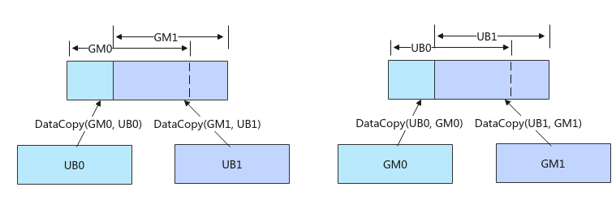

# 基础数据搬运<a name="ZH-CN_TOPIC_0000002382908021"></a>

## AI处理器支持情况<a name="section1550532418810"></a>

<a name="table38301303189"></a>
<table><thead align="left"><tr id="row20831180131817"><th class="cellrowborder" valign="top" width="53.64%" id="mcps1.1.4.1.1"><p id="p1883113061818"><a name="p1883113061818"></a><a name="p1883113061818"></a><span id="ph20833205312295"><a name="ph20833205312295"></a><a name="ph20833205312295"></a>AI处理器类型</span></p>
</th>
<th class="cellrowborder" align="center" valign="top" width="23.49%" id="mcps1.1.4.1.2"><p id="p783113012187"><a name="p783113012187"></a><a name="p783113012187"></a>是否支持</p>
<p id="p44264172453"><a name="p44264172453"></a><a name="p44264172453"></a><strong id="b12426617194517"><a name="b12426617194517"></a><a name="b12426617194517"></a>源操作数和目的操作数</strong></p>
<p id="p119981415104019"><a name="p119981415104019"></a><a name="p119981415104019"></a><strong id="b1057693816427"><a name="b1057693816427"></a><a name="b1057693816427"></a>数据类型一致</strong>的原型</p>
</th>
<th class="cellrowborder" align="center" valign="top" width="22.869999999999997%" id="mcps1.1.4.1.3"><p id="p124241133174419"><a name="p124241133174419"></a><a name="p124241133174419"></a>是否支持</p>
<p id="p183213194459"><a name="p183213194459"></a><a name="p183213194459"></a><strong id="b58321419134518"><a name="b58321419134518"></a><a name="b58321419134518"></a>源操作数和目的操作数</strong></p>
<p id="p942413364418"><a name="p942413364418"></a><a name="p942413364418"></a><strong id="b1942433384411"><a name="b1942433384411"></a><a name="b1942433384411"></a>数据类型不一致</strong>的原型</p>
</th>
</tr>
</thead>
<tbody><tr id="row220181016240"><td class="cellrowborder" valign="top" width="53.64%" headers="mcps1.1.4.1.1 "><p id="p48327011813"><a name="p48327011813"></a><a name="p48327011813"></a><span id="ph583230201815"><a name="ph583230201815"></a><a name="ph583230201815"></a><term id="zh-cn_topic_0000001312391781_term1253731311225"><a name="zh-cn_topic_0000001312391781_term1253731311225"></a><a name="zh-cn_topic_0000001312391781_term1253731311225"></a>Ascend 910C</term></span></p>
</td>
<td class="cellrowborder" align="center" valign="top" width="23.49%" headers="mcps1.1.4.1.2 "><p id="p7948163910184"><a name="p7948163910184"></a><a name="p7948163910184"></a>√</p>
</td>
<td class="cellrowborder" align="center" valign="top" width="22.869999999999997%" headers="mcps1.1.4.1.3 "><p id="p7534341184512"><a name="p7534341184512"></a><a name="p7534341184512"></a>√</p>
</td>
</tr>
<tr id="row173226882415"><td class="cellrowborder" valign="top" width="53.64%" headers="mcps1.1.4.1.1 "><p id="p14832120181815"><a name="p14832120181815"></a><a name="p14832120181815"></a><span id="ph1483216010188"><a name="ph1483216010188"></a><a name="ph1483216010188"></a><term id="zh-cn_topic_0000001312391781_term11962195213215"><a name="zh-cn_topic_0000001312391781_term11962195213215"></a><a name="zh-cn_topic_0000001312391781_term11962195213215"></a>Ascend 910B</term></span></p>
</td>
<td class="cellrowborder" align="center" valign="top" width="23.49%" headers="mcps1.1.4.1.2 "><p id="p19948143911820"><a name="p19948143911820"></a><a name="p19948143911820"></a>√</p>
</td>
<td class="cellrowborder" align="center" valign="top" width="22.869999999999997%" headers="mcps1.1.4.1.3 "><p id="p553474113454"><a name="p553474113454"></a><a name="p553474113454"></a>√</p>
</td>
</tr>
</tbody>
</table>

## 功能说明<a name="section474617392321"></a>

提供基础的数据搬运能力，数据在传输过程中保持原始格式和内容不变，支持连续和非连续的数据搬运。

## 函数原型<a name="section1954364615315"></a>

-   Global Memory -\> Local Memory

    ```
    // 连续搬运
    template <typename T>
    __aicore__ inline void DataCopy(const LocalTensor<T>& dst, const GlobalTensor<T>& src, const uint32_t count)
    
    // 同时支持非连续搬运和连续搬运
    template <typename T>
    __aicore__ inline void DataCopy(const LocalTensor<T>& dst, const GlobalTensor<T>& src, const DataCopyParams& repeatParams)
    ```

-   Local Memory -\> Local Memory

    ```
    // 连续搬运
    template <typename T>
    __aicore__ inline void DataCopy(const LocalTensor<T>& dst, const LocalTensor<T>& src, const uint32_t count)
    
    // 同时支持非连续搬运和连续搬运
    template <typename T>
    __aicore__ inline void DataCopy(const LocalTensor<T>& dst, const LocalTensor<T>& src, const DataCopyParams& repeatParams)
    ```

-   Local Memory -\> Global Memory

    ```
    // 连续搬运
    template <typename T>
    __aicore__ inline void DataCopy(const GlobalTensor<T>& dst, const LocalTensor<T>& src, const uint32_t count)
    
    // 同时支持非连续搬运和连续搬运
    template <typename T>
    __aicore__ inline void DataCopy(const GlobalTensor<T>& dst, const LocalTensor<T>& src, const DataCopyParams& repeatParams)
    ```

-   Local Memory -\> Local Memory，支持源操作数和目的操作数数据类型不一致

    ```
    // 同时支持非连续搬运和连续搬运
    template <typename T, typename U>
    __aicore__ inline void DataCopy(const LocalTensor<T>& dst, const LocalTensor<U>& src, const DataCopyParams& repeatParams)
    ```

> **说明：** 
>各原型支持的具体数据通路和数据类型，请参考[支持的通路和数据类型](#section47283814241)。

## 参数说明<a name="section622mcpsimp"></a>

**表 1**  模板参数说明

<a name="table4835205712588"></a>
<table><thead align="left"><tr id="zh-cn_topic_0000001429830437_row118356578583"><th class="cellrowborder" valign="top" width="14.729999999999999%" id="mcps1.2.3.1.1"><p id="zh-cn_topic_0000001429830437_p48354572582"><a name="zh-cn_topic_0000001429830437_p48354572582"></a><a name="zh-cn_topic_0000001429830437_p48354572582"></a>参数名</p>
</th>
<th class="cellrowborder" valign="top" width="85.27%" id="mcps1.2.3.1.2"><p id="zh-cn_topic_0000001429830437_p583535795817"><a name="zh-cn_topic_0000001429830437_p583535795817"></a><a name="zh-cn_topic_0000001429830437_p583535795817"></a>描述</p>
</th>
</tr>
</thead>
<tbody><tr id="zh-cn_topic_0000001429830437_row1835857145817"><td class="cellrowborder" valign="top" width="14.729999999999999%" headers="mcps1.2.3.1.1 "><p id="zh-cn_topic_0000001429830437_p5835457165816"><a name="zh-cn_topic_0000001429830437_p5835457165816"></a><a name="zh-cn_topic_0000001429830437_p5835457165816"></a>T、U</p>
</td>
<td class="cellrowborder" valign="top" width="85.27%" headers="mcps1.2.3.1.2 "><p id="zh-cn_topic_0000001429830437_p168351657155818"><a name="zh-cn_topic_0000001429830437_p168351657155818"></a><a name="zh-cn_topic_0000001429830437_p168351657155818"></a>操作数的数据类型。支持的数据类型请参考<a href="#section47283814241">支持的通路和数据类型</a>。</p>
</td>
</tr>
</tbody>
</table>

**表 2**  参数说明

<a name="table917mcpsimp"></a>
<table><thead align="left"><tr id="row923mcpsimp"><th class="cellrowborder" valign="top" width="15.02%" id="mcps1.2.4.1.1"><p id="p925mcpsimp"><a name="p925mcpsimp"></a><a name="p925mcpsimp"></a>参数名</p>
</th>
<th class="cellrowborder" valign="top" width="9.86%" id="mcps1.2.4.1.2"><p id="p927mcpsimp"><a name="p927mcpsimp"></a><a name="p927mcpsimp"></a>输入/输出</p>
</th>
<th class="cellrowborder" valign="top" width="75.12%" id="mcps1.2.4.1.3"><p id="p929mcpsimp"><a name="p929mcpsimp"></a><a name="p929mcpsimp"></a>含义</p>
</th>
</tr>
</thead>
<tbody><tr id="row930mcpsimp"><td class="cellrowborder" valign="top" width="15.02%" headers="mcps1.2.4.1.1 "><p id="p2925016172518"><a name="p2925016172518"></a><a name="p2925016172518"></a>dst</p>
</td>
<td class="cellrowborder" valign="top" width="9.86%" headers="mcps1.2.4.1.2 "><p id="p199251416112517"><a name="p199251416112517"></a><a name="p199251416112517"></a>输出</p>
</td>
<td class="cellrowborder" valign="top" width="75.12%" headers="mcps1.2.4.1.3 "><p id="p3130124119547"><a name="p3130124119547"></a><a name="p3130124119547"></a>目的操作数，类型为LocalTensor或GlobalTensor。</p>
<p id="p138269432545"><a name="p138269432545"></a><a name="p138269432545"></a>LocalTensor位于<a href="TPosition.md">C2</a>时，起始地址要求64B对齐；LocalTensor位于<a href="TPosition.md">C2PIPE2GM</a>时，起始地址要求128B对齐；其他情况均要求32字节对齐。</p>
<p id="p19484162614559"><a name="p19484162614559"></a><a name="p19484162614559"></a>GlobalTensor的起始地址要求按照对应数据类型所占字节数对齐。</p>
</td>
</tr>
<tr id="row937mcpsimp"><td class="cellrowborder" valign="top" width="15.02%" headers="mcps1.2.4.1.1 "><p id="p3926171610253"><a name="p3926171610253"></a><a name="p3926171610253"></a>src</p>
</td>
<td class="cellrowborder" valign="top" width="9.86%" headers="mcps1.2.4.1.2 "><p id="p4926121682518"><a name="p4926121682518"></a><a name="p4926121682518"></a>输入</p>
</td>
<td class="cellrowborder" valign="top" width="75.12%" headers="mcps1.2.4.1.3 "><p id="p49261616142516"><a name="p49261616142516"></a><a name="p49261616142516"></a>源操作数，类型为LocalTensor或GlobalTensor。</p>
<p id="p1099634455518"><a name="p1099634455518"></a><a name="p1099634455518"></a>LocalTensor的起始地址要求32字节对齐。</p>
<p id="p399694411550"><a name="p399694411550"></a><a name="p399694411550"></a>GlobalTensor的起始地址要求按照对应数据类型所占字节数对齐。</p>
</td>
</tr>
<tr id="row4726155915388"><td class="cellrowborder" valign="top" width="15.02%" headers="mcps1.2.4.1.1 "><p id="p21111014132612"><a name="p21111014132612"></a><a name="p21111014132612"></a>repeatParams</p>
</td>
<td class="cellrowborder" valign="top" width="9.86%" headers="mcps1.2.4.1.2 "><p id="p71115140262"><a name="p71115140262"></a><a name="p71115140262"></a>输入</p>
</td>
<td class="cellrowborder" valign="top" width="75.12%" headers="mcps1.2.4.1.3 "><p id="p99001053175712"><a name="p99001053175712"></a><a name="p99001053175712"></a>搬运参数，<a href="#table9182515919">DataCopyParams</a>类型。通过该参数可配置搬运的数据块大小、个数、间隔等信息，同时支持非连续和连续搬运。</p>
<p id="p395104375712"><a name="p395104375712"></a><a name="p395104375712"></a>具体定义请参考<span id="ph10562197165916"><a name="ph10562197165916"></a><a name="ph10562197165916"></a>${INSTALL_DIR}</span>/include/ascendc/basic_api/interface/kernel_struct_data_copy.h，<span id="ph14322531015"><a name="ph14322531015"></a><a name="ph14322531015"></a>${INSTALL_DIR}</span>请替换为CANN软件安装后文件存储路径。</p>
</td>
</tr>
<tr id="row4736114341415"><td class="cellrowborder" valign="top" width="15.02%" headers="mcps1.2.4.1.1 "><p id="p47360437147"><a name="p47360437147"></a><a name="p47360437147"></a>count</p>
</td>
<td class="cellrowborder" valign="top" width="9.86%" headers="mcps1.2.4.1.2 "><p id="p773619438142"><a name="p773619438142"></a><a name="p773619438142"></a>输入</p>
</td>
<td class="cellrowborder" valign="top" width="75.12%" headers="mcps1.2.4.1.3 "><p id="p10736174310142"><a name="p10736174310142"></a><a name="p10736174310142"></a>参与搬运的元素个数。</p>
<div class="note" id="note55750395518"><a name="note55750395518"></a><a name="note55750395518"></a><span class="notetitle"> 说明： </span><div class="notebody"><p id="p63361463515"><a name="p63361463515"></a><a name="p63361463515"></a>count * sizeof(T)需要32字节对齐，若不对齐，搬运量将对32字节做向下取整。</p>
</div></div>
</td>
</tr>
</tbody>
</table>

**表 3**  DataCopyParams结构体参数定义

<a name="table9182515919"></a>
<table><thead align="left"><tr id="row151816516917"><th class="cellrowborder" valign="top" width="15%" id="mcps1.2.3.1.1"><p id="p18182513916"><a name="p18182513916"></a><a name="p18182513916"></a>参数名称</p>
</th>
<th class="cellrowborder" valign="top" width="85%" id="mcps1.2.3.1.2"><p id="p41815515920"><a name="p41815515920"></a><a name="p41815515920"></a>含义</p>
</th>
</tr>
</thead>
<tbody><tr id="row1818105113916"><td class="cellrowborder" valign="top" width="15%" headers="mcps1.2.3.1.1 "><p id="p17780347142614"><a name="p17780347142614"></a><a name="p17780347142614"></a>blockCount</p>
</td>
<td class="cellrowborder" valign="top" width="85%" headers="mcps1.2.3.1.2 "><p id="p478014752618"><a name="p478014752618"></a><a name="p478014752618"></a>待搬运的连续传输数据块个数。uint16_t类型，取值范围：blockCount∈[1, 4095]。</p>
</td>
</tr>
<tr id="row2968131992515"><td class="cellrowborder" valign="top" width="15%" headers="mcps1.2.3.1.1 "><p id="p878011470264"><a name="p878011470264"></a><a name="p878011470264"></a>blockLen</p>
</td>
<td class="cellrowborder" valign="top" width="85%" headers="mcps1.2.3.1.2 "><p id="p11780174752617"><a name="p11780174752617"></a><a name="p11780174752617"></a>待搬运的每个连续传输数据块长度，单位为DataBlock（32字节）。uint16_t类型，取值范围：blockLen∈[1, 65535]。</p>
<p id="p4353141191111"><a name="p4353141191111"></a><a name="p4353141191111"></a>特别地，当dst位于C2PIPE2GM时，单位为128B；当dst位于C2时，表示源操作数的连续传输数据块长度，单位为64B。</p>
</td>
</tr>
<tr id="row1589112062510"><td class="cellrowborder" valign="top" width="15%" headers="mcps1.2.3.1.1 "><p id="p378018478265"><a name="p378018478265"></a><a name="p378018478265"></a>srcGap</p>
</td>
<td class="cellrowborder" valign="top" width="85%" headers="mcps1.2.3.1.2 "><p id="p19780547162614"><a name="p19780547162614"></a><a name="p19780547162614"></a>源操作数相邻连续数据块的间隔（前面一个数据块的尾与后面数据块的头的间隔），单位为DataBlock（32字节）。uint16_t类型，srcGap不要超出该数据类型的取值范围。</p>
<p id="p14646122813194"><a name="p14646122813194"></a><a name="p14646122813194"></a>在L1 Buffer -&gt; Fixpipe Buffer场景中，srcGap特指源操作数相邻连续数据块的间隔（前面一个数据块的头与后面数据块的头的间隔），单位为DataBlock（32字节）。uint16_t类型，srcGap不要超出该数据类型的取值范围。</p>
</td>
</tr>
<tr id="row3593192082512"><td class="cellrowborder" valign="top" width="15%" headers="mcps1.2.3.1.1 "><p id="p18780347152610"><a name="p18780347152610"></a><a name="p18780347152610"></a>dstGap</p>
</td>
<td class="cellrowborder" valign="top" width="85%" headers="mcps1.2.3.1.2 "><p id="p18780947162613"><a name="p18780947162613"></a><a name="p18780947162613"></a>目的操作数相邻连续数据块间的间隔（前面一个数据块的尾与后面数据块的头的间隔），单位为DataBlock（32字节）。uint16_t类型，dstGap不要超出该数据类型的取值范围。</p>
<p id="p77262264817"><a name="p77262264817"></a><a name="p77262264817"></a>特别地，当dstLocal位于C2PIPE2GM时，单位为128B；当dstLocal位于C2时，单位为64B。</p>
<p id="p1764792281920"><a name="p1764792281920"></a><a name="p1764792281920"></a>在L1 Buffer -&gt; Fixpipe Buffer场景中，dstGap特指源操作数相邻连续数据块的间隔（前面一个数据块的头与后面数据块的头的间隔），单位为DataBlock（32字节）。uint16_t类型，dstGap不要超出该数据类型的取值范围。</p>
</td>
</tr>
</tbody>
</table>

下面的样例呈现了DataCopyParams结构体参数的使用方法，样例中完成了2个连续传输数据块的搬运，每个数据块含有8个DataBlock，源操作数相邻数据块之间无间隔，目的操作数相邻数据块尾与头之间间隔1个DataBlock。


## 返回值说明<a name="section44801012174220"></a>

无

## 约束说明<a name="section633mcpsimp"></a>

-   如果需要执行多个DataCopy指令，且DataCopy的目的地址存在重叠，需要通过调用[PipeBarrier\(ISASI\)](PipeBarrier(ISASI).md)来插入同步指令，保证多个DataCopy指令的串行化，防止出现异常数据。如下图左侧示意图，执行两个DataCopy指令，搬运的目的GM地址存在重叠，两条搬运指令之间需要通过调用PipeBarrier<PIPE\_MTE3\>\(\)添加MTE3搬出流水的同步；如下图右侧示意图所示，搬运的目的地址Unified Buffer存在重叠，两条搬运指令之间需要调用PipeBarrier<PIPE\_MTE2\>\(\)添加MTE2搬入流水的同步。

    

-   针对如下产品型号：

    Ascend 910B

    Ascend 910C

    在跨卡通信算子开发场景，DataCopy类接口支持跨卡数据搬运，仅支持HCCS物理链路，不支持其他通路；开发者开发过程中，需要关注涉及卡间通信的物理通路，可通过npu-smi  info -t topo命令查询HCCS物理链路。

## 支持的通路和数据类型<a name="section47283814241"></a>

下文的数据通路均通过逻辑位置[TPosition](TPosition.md#table5376122715308)来表达，并注明了对应的物理通路。TPosition与物理内存的映射关系见[表1](通用说明和约束.md#table07372185712)。

**表 4**  Global Memory -\> Local Memory具体通路和支持的数据类型

<a name="table14255161718545"></a>
<table><thead align="left"><tr id="row3255181710543"><th class="cellrowborder" valign="top" width="22.15%" id="mcps1.2.4.1.1"><p id="p52550177546"><a name="p52550177546"></a><a name="p52550177546"></a>产品型号</p>
</th>
<th class="cellrowborder" valign="top" width="27.02%" id="mcps1.2.4.1.2"><p id="p13255191735420"><a name="p13255191735420"></a><a name="p13255191735420"></a>数据通路</p>
</th>
<th class="cellrowborder" valign="top" width="50.83%" id="mcps1.2.4.1.3"><p id="p6255617175419"><a name="p6255617175419"></a><a name="p6255617175419"></a>源操作数和目的操作数的数据类型（两者保持一致）</p>
</th>
</tr>
</thead>
<tbody><tr id="row5426164114556"><td class="cellrowborder" valign="top" width="22.15%" headers="mcps1.2.4.1.1 "><p id="p44261641165518"><a name="p44261641165518"></a><a name="p44261641165518"></a><span id="ph14504143371016"><a name="ph14504143371016"></a><a name="ph14504143371016"></a><term id="zh-cn_topic_0000001312391781_term11962195213215_2"><a name="zh-cn_topic_0000001312391781_term11962195213215_2"></a><a name="zh-cn_topic_0000001312391781_term11962195213215_2"></a>Ascend 910B</term></span></p>
</td>
<td class="cellrowborder" valign="top" width="27.02%" headers="mcps1.2.4.1.2 "><a name="ul19959142064114"></a><a name="ul19959142064114"></a><ul id="ul19959142064114"><li>GM -&gt; VECIN（GM -&gt; UB ）</li><li>GM -&gt; A1、B1、C1（GM -&gt; L1 Buffer ）</li></ul>
</td>
<td class="cellrowborder" valign="top" width="50.83%" headers="mcps1.2.4.1.3 "><p id="p46242288515"><a name="p46242288515"></a><a name="p46242288515"></a>int8_t、uint8_t、int16_t、uint16_t、int32_t、uint32_t、int64_t、 uint64_t、 half、bfloat16_t、float、double</p>
</td>
</tr>
<tr id="row5705133112594"><td class="cellrowborder" valign="top" width="22.15%" headers="mcps1.2.4.1.1 "><p id="p1570516316598"><a name="p1570516316598"></a><a name="p1570516316598"></a><span id="ph16239174011416"><a name="ph16239174011416"></a><a name="ph16239174011416"></a><term id="zh-cn_topic_0000001312391781_term1253731311225_2"><a name="zh-cn_topic_0000001312391781_term1253731311225_2"></a><a name="zh-cn_topic_0000001312391781_term1253731311225_2"></a>Ascend 910C</term></span></p>
</td>
<td class="cellrowborder" valign="top" width="27.02%" headers="mcps1.2.4.1.2 "><a name="ul998352212410"></a><a name="ul998352212410"></a><ul id="ul998352212410"><li>GM -&gt; VECIN（GM -&gt; UB ）</li><li>GM -&gt; A1、B1、C1（GM -&gt; L1 Buffer ）</li></ul>
</td>
<td class="cellrowborder" valign="top" width="50.83%" headers="mcps1.2.4.1.3 "><p id="p7850194820517"><a name="p7850194820517"></a><a name="p7850194820517"></a>int8_t、uint8_t、int16_t、uint16_t、int32_t、uint32_t、int64_t、 uint64_t、 half、bfloat16_t、float、double</p>
</td>
</tr>
</tbody>
</table>

**表 5**  Local Memory -\> Local Memory具体通路和支持的数据类型

<a name="table659692711105"></a>
<table><thead align="left"><tr id="row95971127191012"><th class="cellrowborder" valign="top" width="24.64%" id="mcps1.2.4.1.1"><p id="p4597127121015"><a name="p4597127121015"></a><a name="p4597127121015"></a>产品型号</p>
</th>
<th class="cellrowborder" valign="top" width="24.48%" id="mcps1.2.4.1.2"><p id="p1859712771013"><a name="p1859712771013"></a><a name="p1859712771013"></a>数据通路</p>
</th>
<th class="cellrowborder" valign="top" width="50.88%" id="mcps1.2.4.1.3"><p id="p16597192718105"><a name="p16597192718105"></a><a name="p16597192718105"></a>源操作数和目的操作数的数据类型（两者保持一致）</p>
</th>
</tr>
</thead>
<tbody><tr id="row65971527131010"><td class="cellrowborder" rowspan="2" valign="top" width="24.64%" headers="mcps1.2.4.1.1 "><p id="p105971027161013"><a name="p105971027161013"></a><a name="p105971027161013"></a><span id="ph9597927151015"><a name="ph9597927151015"></a><a name="ph9597927151015"></a><term id="zh-cn_topic_0000001312391781_term11962195213215_3"><a name="zh-cn_topic_0000001312391781_term11962195213215_3"></a><a name="zh-cn_topic_0000001312391781_term11962195213215_3"></a>Ascend 910B</term></span></p>
</td>
<td class="cellrowborder" valign="top" width="24.48%" headers="mcps1.2.4.1.2 "><a name="ul173771257132"></a><a name="ul173771257132"></a><ul id="ul173771257132"><li>VECIN -&gt; VECCALC或VECCALC-&gt; VECOUT（UB -&gt; UB）</li><li>VECIN、VECCALC、VECOUT -&gt; TSCM（UB -&gt; L1 Buffer）</li><li>A1、B1、C1-&gt; C2PIPE2GM（L1 Buffer -&gt; <span>Fixpipe</span><span> Buffer</span>）</li></ul>
</td>
<td class="cellrowborder" valign="top" width="50.88%" headers="mcps1.2.4.1.3 "><p id="p617185610138"><a name="p617185610138"></a><a name="p617185610138"></a>int8_t、uint8_t、int16_t、uint16_t、int32_t、uint32_t、int64_t、 uint64_t、 half、bfloat16_t、float、double</p>
</td>
</tr>
<tr id="row3529121103718"><td class="cellrowborder" valign="top" headers="mcps1.2.4.1.1 "><a name="ul1220164883710"></a><a name="ul1220164883710"></a><ul id="ul1220164883710"><li>C1 -&gt; C2（L1 Buffer -&gt; BiasTable Buffer）</li></ul>
</td>
<td class="cellrowborder" valign="top" headers="mcps1.2.4.1.2 "><p id="p7530121163715"><a name="p7530121163715"></a><a name="p7530121163715"></a>int32_t、float</p>
</td>
</tr>
<tr id="row1659233112715"><td class="cellrowborder" rowspan="2" valign="top" width="24.64%" headers="mcps1.2.4.1.1 "><p id="p959203118713"><a name="p959203118713"></a><a name="p959203118713"></a><span id="ph18237691581"><a name="ph18237691581"></a><a name="ph18237691581"></a><term id="zh-cn_topic_0000001312391781_term1253731311225_3"><a name="zh-cn_topic_0000001312391781_term1253731311225_3"></a><a name="zh-cn_topic_0000001312391781_term1253731311225_3"></a>Ascend 910C</term></span></p>
</td>
<td class="cellrowborder" valign="top" width="24.48%" headers="mcps1.2.4.1.2 "><a name="ul1841001572116"></a><a name="ul1841001572116"></a><ul id="ul1841001572116"><li>VECIN -&gt; VECCALC或VECCALC-&gt; VECOUT（UB -&gt; UB）</li><li>VECIN、VECCALC、VECOUT -&gt; TSCM（UB -&gt; L1 Buffer）</li><li>A1、B1、C1-&gt; C2PIPE2GM（L1 Buffer -&gt; <span>Fixpipe</span><span> Buffer</span>）</li></ul>
</td>
<td class="cellrowborder" valign="top" width="50.88%" headers="mcps1.2.4.1.3 "><p id="p14179131211415"><a name="p14179131211415"></a><a name="p14179131211415"></a>int8_t、uint8_t、int16_t、uint16_t、int32_t、uint32_t、int64_t、 uint64_t、 half、bfloat16_t、float、double</p>
</td>
</tr>
<tr id="row15859121113815"><td class="cellrowborder" valign="top" headers="mcps1.2.4.1.1 "><a name="ul71473943812"></a><a name="ul71473943812"></a><ul id="ul71473943812"><li>C1 -&gt; C2（L1 Buffer -&gt; BiasTable Buffer）</li></ul>
</td>
<td class="cellrowborder" valign="top" headers="mcps1.2.4.1.2 "><p id="p59397477380"><a name="p59397477380"></a><a name="p59397477380"></a>int32_t、float</p>
</td>
</tr>
</tbody>
</table>

**表 6**  Local Memory -\> Global Memory具体通路和支持的数据类型

<a name="table154455318312"></a>
<table><thead align="left"><tr id="row1844653153110"><th class="cellrowborder" valign="top" width="24.529999999999998%" id="mcps1.2.4.1.1"><p id="p44414537318"><a name="p44414537318"></a><a name="p44414537318"></a>产品型号</p>
</th>
<th class="cellrowborder" valign="top" width="24.59%" id="mcps1.2.4.1.2"><p id="p1442539313"><a name="p1442539313"></a><a name="p1442539313"></a>数据通路</p>
</th>
<th class="cellrowborder" valign="top" width="50.88%" id="mcps1.2.4.1.3"><p id="p1744553143113"><a name="p1744553143113"></a><a name="p1744553143113"></a>源操作数和目的操作数的数据类型（两者保持一致）</p>
</th>
</tr>
</thead>
<tbody><tr id="row1544253103113"><td class="cellrowborder" valign="top" width="24.529999999999998%" headers="mcps1.2.4.1.1 "><p id="p3441753143116"><a name="p3441753143116"></a><a name="p3441753143116"></a><span id="ph244115353112"><a name="ph244115353112"></a><a name="ph244115353112"></a><term id="zh-cn_topic_0000001312391781_term11962195213215_4"><a name="zh-cn_topic_0000001312391781_term11962195213215_4"></a><a name="zh-cn_topic_0000001312391781_term11962195213215_4"></a>Ascend 910B</term></span></p>
</td>
<td class="cellrowborder" valign="top" width="24.59%" headers="mcps1.2.4.1.2 "><a name="ul8832194810268"></a><a name="ul8832194810268"></a><ul id="ul8832194810268"><li>VECOUT -&gt; GM（UB -&gt; GM）</li><li>A1、B1 -&gt; GM（L1 Buffer -&gt; GM）</li></ul>
</td>
<td class="cellrowborder" valign="top" width="50.88%" headers="mcps1.2.4.1.3 "><p id="p1541719631616"><a name="p1541719631616"></a><a name="p1541719631616"></a>int8_t、uint8_t、int16_t、uint16_t、int32_t、uint32_t、int64_t、 uint64_t、 half、bfloat16_t、float、double</p>
</td>
</tr>
<tr id="row10867125412814"><td class="cellrowborder" valign="top" width="24.529999999999998%" headers="mcps1.2.4.1.1 "><p id="p1286711549812"><a name="p1286711549812"></a><a name="p1286711549812"></a><span id="ph152781814898"><a name="ph152781814898"></a><a name="ph152781814898"></a><term id="zh-cn_topic_0000001312391781_term1253731311225_4"><a name="zh-cn_topic_0000001312391781_term1253731311225_4"></a><a name="zh-cn_topic_0000001312391781_term1253731311225_4"></a>Ascend 910C</term></span></p>
</td>
<td class="cellrowborder" valign="top" width="24.59%" headers="mcps1.2.4.1.2 "><a name="ul147277032812"></a><a name="ul147277032812"></a><ul id="ul147277032812"><li>VECOUT -&gt; GM（UB -&gt; GM）</li><li>A1、B1 -&gt; GM（L1 Buffer -&gt; GM）</li></ul>
</td>
<td class="cellrowborder" valign="top" width="50.88%" headers="mcps1.2.4.1.3 "><p id="p688019814161"><a name="p688019814161"></a><a name="p688019814161"></a>int8_t、uint8_t、int16_t、uint16_t、int32_t、uint32_t、int64_t、 uint64_t、 half、bfloat16_t、float、double</p>
</td>
</tr>
</tbody>
</table>

**表 7**  Local Memory -\> Local Memory具体通路和支持的数据类型（支持源操作数和目的操作数的数据类型不一致）

<a name="table149951513418"></a>
<table><thead align="left"><tr id="row79951853414"><th class="cellrowborder" valign="top" width="24.41%" id="mcps1.2.5.1.1"><p id="p1899575184111"><a name="p1899575184111"></a><a name="p1899575184111"></a>产品型号</p>
</th>
<th class="cellrowborder" valign="top" width="24.66%" id="mcps1.2.5.1.2"><p id="p189958516415"><a name="p189958516415"></a><a name="p189958516415"></a>数据通路</p>
</th>
<th class="cellrowborder" valign="top" width="20.96%" id="mcps1.2.5.1.3"><p id="p1799565204117"><a name="p1799565204117"></a><a name="p1799565204117"></a>源操作数的数据类型</p>
</th>
<th class="cellrowborder" valign="top" width="29.970000000000002%" id="mcps1.2.5.1.4"><p id="p2109235412"><a name="p2109235412"></a><a name="p2109235412"></a>目的操作数的数据类型</p>
</th>
</tr>
</thead>
<tbody><tr id="row1099625144119"><td class="cellrowborder" valign="top" width="24.41%" headers="mcps1.2.5.1.1 "><p id="p109961757411"><a name="p109961757411"></a><a name="p109961757411"></a><span id="ph683392733713"><a name="ph683392733713"></a><a name="ph683392733713"></a><term id="zh-cn_topic_0000001312391781_term11962195213215_5"><a name="zh-cn_topic_0000001312391781_term11962195213215_5"></a><a name="zh-cn_topic_0000001312391781_term11962195213215_5"></a>Ascend 910B</term></span></p>
</td>
<td class="cellrowborder" valign="top" width="24.66%" headers="mcps1.2.5.1.2 "><p id="p105615515370"><a name="p105615515370"></a><a name="p105615515370"></a>C1 -&gt; C2（L1 Buffer -&gt; BiasTable Buffer）</p>
</td>
<td class="cellrowborder" valign="top" width="20.96%" headers="mcps1.2.5.1.3 "><p id="p199961057413"><a name="p199961057413"></a><a name="p199961057413"></a>half</p>
</td>
<td class="cellrowborder" valign="top" width="29.970000000000002%" headers="mcps1.2.5.1.4 "><p id="p171013234413"><a name="p171013234413"></a><a name="p171013234413"></a>float</p>
</td>
</tr>
<tr id="row1461516421116"><td class="cellrowborder" valign="top" width="24.41%" headers="mcps1.2.5.1.1 "><p id="p76151747118"><a name="p76151747118"></a><a name="p76151747118"></a><span id="ph162264917123"><a name="ph162264917123"></a><a name="ph162264917123"></a><term id="zh-cn_topic_0000001312391781_term1253731311225_5"><a name="zh-cn_topic_0000001312391781_term1253731311225_5"></a><a name="zh-cn_topic_0000001312391781_term1253731311225_5"></a>Ascend 910C</term></span></p>
</td>
<td class="cellrowborder" valign="top" width="24.66%" headers="mcps1.2.5.1.2 "><p id="p1068932701114"><a name="p1068932701114"></a><a name="p1068932701114"></a>C1 -&gt; C2（L1 Buffer -&gt; BiasTable Buffer）</p>
</td>
<td class="cellrowborder" valign="top" width="20.96%" headers="mcps1.2.5.1.3 "><p id="p1062552311112"><a name="p1062552311112"></a><a name="p1062552311112"></a>half</p>
</td>
<td class="cellrowborder" valign="top" width="29.970000000000002%" headers="mcps1.2.5.1.4 "><p id="p12625152321110"><a name="p12625152321110"></a><a name="p12625152321110"></a>float</p>
</td>
</tr>
</tbody>
</table>

## 调用示例<a name="section122101199486"></a>

```
AscendC::TPipe pipe;
AscendC::TQue<AscendC::TPosition::VECIN, 1> inQueueSrc;
AscendC::TQue<AscendC::TPosition::VECOUT, 1> outQueueDst;
AscendC::GlobalTensor<half> srcGlobal, dstGlobal;
pipe.InitBuffer(inQueueSrc, 1, 512 * sizeof(half));
pipe.InitBuffer(outQueueDst, 1, 512 * sizeof(half));
AscendC::LocalTensor<half> srcLocal = inQueueSrc.AllocTensor<half>();
AscendC::LocalTensor<half> dstLocal = outQueueDst.AllocTensor<half>();
// 使用传入count参数的搬运接口，完成连续搬运
AscendC::DataCopy(srcLocal, srcGlobal, 512);
AscendC::DataCopy(dstLocal , srcLocal, 512);
AscendC::DataCopy(dstGlobal, dstLocal, 512);
// 使用传入DataCopyParams参数的搬运接口，支持连续和非连续搬运
// DataCopyParams intriParams;
// AscendC::DataCopy(srcLocal, srcGlobal, intriParams);
// AscendC::DataCopy(dstLocal , srcLocal, intriParams);
// AscendC::DataCopy(dstGlobal, dstLocal, intriParams);
```

结果示例：

```
输入数据srcGlobal：[1 2 3 ... 512]
输出数据dstGlobal：[1 2 3 ... 512]
```

