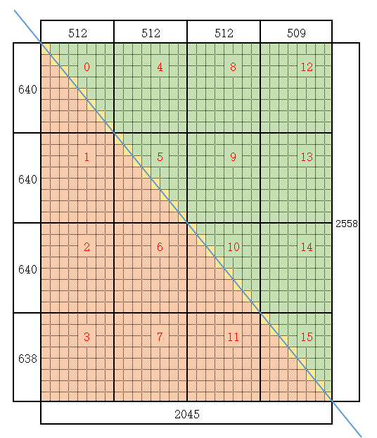

# Matmul Triangle Template Strategy Direct Invocation Sample

## Overview

This is a Matmul sample demonstrating TrianUpperMatmulPolicy (upper triangle template strategy) and TrianLowerMatmulPolicy (lower triangle template strategy).

## Supported Products

- Ascend 950PR/Ascend 950DT
- Atlas A3 Training Series Products/Atlas A3 Inference Series Products
- Atlas A2 Training Series Products/Atlas A2 Inference Series Products

## Directory Structure

```
├── matmul_triangle
│   └── scripts
│       ├── gen_data.py         // Input data and golden data generation script
│       └── verify_result.py    // Golden data verification file
│   ├── CMakeLists.txt          // Build project file
│   ├── data_utils.h            // Data read and write functions
│   └── matmul_triangle.asc     // Ascend C sample implementation & invocation sample
```

## Sample Description

- Sample Function:
  When using the upper triangle template strategy, cores with index 0, 5, 10, and 15 perform triangle matrix computation using the upper triangle template strategy; cores with index 4, 8, 9, 12, 13, and 14 perform regular matrix multiplication; cores with index 1, 2, 3, 6, 7, and 11 do not execute any computation.
  When using the lower triangle template strategy, cores with index 0, 5, 10, and 15 perform triangle matrix computation using the lower triangle template strategy; cores with index 1, 2, 3, 6, 7, and 11 perform regular matrix multiplication; cores with index 4, 8, 9, 12, 13, and 14 do not execute any computation.

  

- Sample Specifications:
  In this sample: M = 2558, N = 2045, K = 128.
  <table>
  <tr><td rowspan="1" align="center">Sample Type (OpType)</td><td colspan="5" align="center">Matmul</td></tr>
  </tr>
  <tr><td rowspan="4" align="center">Sample Input</td><td align="center">name</td><td align="center">shape</td><td align="center">data type</td><td align="center">format</td><td align="center">isTrans</td></tr>
  <tr><td align="center">a</td><td align="center">[M, K]</td><td align="center">half</td><td align="center">ND</td><td align="center">false</td></tr>
  <tr><td align="center">b</td><td align="center">[K, N]</td><td align="center">half</td><td align="center">ND</td><td align="center">false</td></tr>
  <tr><td align="center">bias</td><td align="center">[1, N]</td><td align="center">float</td><td align="center">ND</td><td align="center">-</td></tr>
  </tr>
  </tr>
  <tr><td rowspan="1" align="center">Sample Output</td><td align="center">c</td>
  <td align="center">[M, N]</td><td align="center">float</td><td align="center">ND</td><td align="center">-</td></tr>
  </tr>
  <tr><td rowspan="1" align="center">Kernel Function Name</td><td colspan="5" align="center">matmul_triangle_custom</td></tr>
  </table>

- Sample Implementation:
 
  - Key Kernel Steps
    - Create Matmul objects: create a regular Matmul object mmNormal and a Matmul object mmTriangle using the upper/lower triangle template strategy.
      ```cpp
      // Create regular Matmul object mmNormal
      AscendC::Matmul<AscendC::MatmulType<AscendC::TPosition::GM, CubeFormat::ND, AType>,
      AscendC::MatmulType<AscendC::TPosition::GM, CubeFormat::ND, BType>,
      AscendC::MatmulType<AscendC::TPosition::GM, CubeFormat::ND, CType>,
      AscendC::MatmulType<AscendC::TPosition::GM, CubeFormat::ND, BiasType>, CFG_NORM> mmNormal;
      // Create Matmul object mmTriangle using upper triangle template strategy
      // For lower triangle template strategy, use AscendC::Impl::Detail::TrianLowerMatmulPolicy
      AscendC::Matmul<AscendC::MatmulType<AscendC::TPosition::GM, CubeFormat::ND, AType>,
      AscendC::MatmulType<AscendC::TPosition::GM, CubeFormat::ND, BType>,
      AscendC::MatmulType<AscendC::TPosition::GM, CubeFormat::ND, CType>,
      AscendC::MatmulType<AscendC::TPosition::GM, CubeFormat::ND, BiasType>,
      CFG_NORM, AscendC::MatmulCallBackFunc<nullptr, nullptr, nullptr>,
      AscendC::Impl::Detail::TrianUpperMatmulPolicy> mmTriangle;
      ```
    - Determine whether the current core performs triangle matrix computation or regular matrix multiplication, and use the mmTriangle or mmNormal object to set the left matrix A, right matrix B, and Bias.
      ```cpp
      int32_t blockIdx = AscendC::GetBlockIdx();
      int32_t mSplit = 4;
      int32_t mIdx = blockIdx % mSplit;
      int32_t nIdx = blockIdx / mSplit;
      bool isTriangle = mIdx == nIdx; // 0, 5, 10, 15
      bool isNormal = mIdx > nIdx; // Upper triangle mIdx > nIdx: 1, 2, 3, 6, 7, 11. Lower triangle mIdx < nIdx: 4, 8, 9, 12, 13, 14
      if (isTriangle) {
          mmTriangle.SetTensorA(aGlobal);
          mmTriangle.SetTensorB(bGlobal);
          if (tiling.isBias) {
              mmTriangle.SetBias(biasGlobal);
          }
          mmTriangle.IterateAll(cGlobal);
          mmTriangle.End();
      } else if (isNormal) {
          mmNormal.SetTensorA(aGlobal);
          mmNormal.SetTensorB(bGlobal);
          if (tiling.isBias) {
              mmNormal.SetBias(biasGlobal);
          }
          mmNormal.IterateAll(cGlobal);
          mmNormal.End();
      }
      ```

  - Key Tiling Steps
    - Set the parameter type information for A, B, C, and Bias, as well as SingleShape and baseM, baseN, and baseK information.
      ```cpp
      cubeTiling->SetSingleShape(640, 512, 128);
      cubeTiling->SetFixSplit(80, 64, -1);
      ```

  - Invocation Implementation
    Use the kernel call operator <<<>>> to invoke the kernel function.

## Compilation and Execution

Execute the following steps in the root directory of this sample to compile and run the sample.

- Configure Environment Variables
  Select the corresponding environment variable configuration command based on the [installation method](../../../../../docs/en/quick_start.md#prepare&install) of the CANN development kit on your current environment.
  - Default path, root user installed CANN software package
    ```bash
    source /usr/local/Ascend/cann/set_env.sh
    ```

  - Default path, non-root user installed CANN software package
    ```bash
    source $HOME/Ascend/cann/set_env.sh
    ```
    
  - Specified path install_path, installed CANN software package
    ```bash
    source ${install_path}/cann/set_env.sh
    ```

- Sample Execution

  ```bash
  # -DTRIANGLE_MODE=0: Enable upper triangle template strategy
  # -DTRIANGLE_MODE=1: Enable lower triangle template strategy
  # -m=0: Generate test input data with upper triangle template strategy enabled
  # -m=1: Generate test input data with lower triangle template strategy enabled
  mkdir -p build && cd build;    # Create and enter build directory
  cmake -DTRIANGLE_MODE=0 -DCMAKE_ASC_ARCHITECTURES=dav-2201 ..;make -j;    # Build project, using upper triangle template strategy as example, default npu mode
  python3 ../scripts/gen_data.py -m=0    # Generate test input data, using upper triangle template strategy as example
  ./demo                        # Execute the compiled executable program to run the sample
  python3 ../scripts/verify_result.py output/output.bin output/golden.bin    # Verify output correctness, confirm algorithm logic
  ```

  When using CPU debug or NPU simulation mode, add the `-DCMAKE_ASC_RUN_MODE=cpu` or `-DCMAKE_ASC_RUN_MODE=sim` parameter.

  For example:
  ```bash
  cmake -DTRIANGLE_MODE=0 -DCMAKE_ASC_RUN_MODE=cpu -DCMAKE_ASC_ARCHITECTURES=dav-2201 ..;make -j; # CPU debug mode
  cmake -DTRIANGLE_MODE=0 -DCMAKE_ASC_RUN_MODE=sim -DCMAKE_ASC_ARCHITECTURES=dav-2201 ..;make -j; # NPU simulation mode
  ```

  > **Note:** Before switching compilation modes, clean the cmake cache by running `rm CMakeCache.txt` in the build directory, then re-run cmake.

- Compilation Options Description

  | Parameter | Description | Options | Default |
  |------|------|---------|--------|
  | CMAKE_ASC_RUN_MODE | Run mode | npu, cpu, sim | npu |
  | CMAKE_ASC_ARCHITECTURES | NPU hardware architecture | dav-2201, dav-3510 | dav-2201 |

- Execution Result

  The following execution result indicates successful precision comparison.

  ```bash
  test pass!
  ```