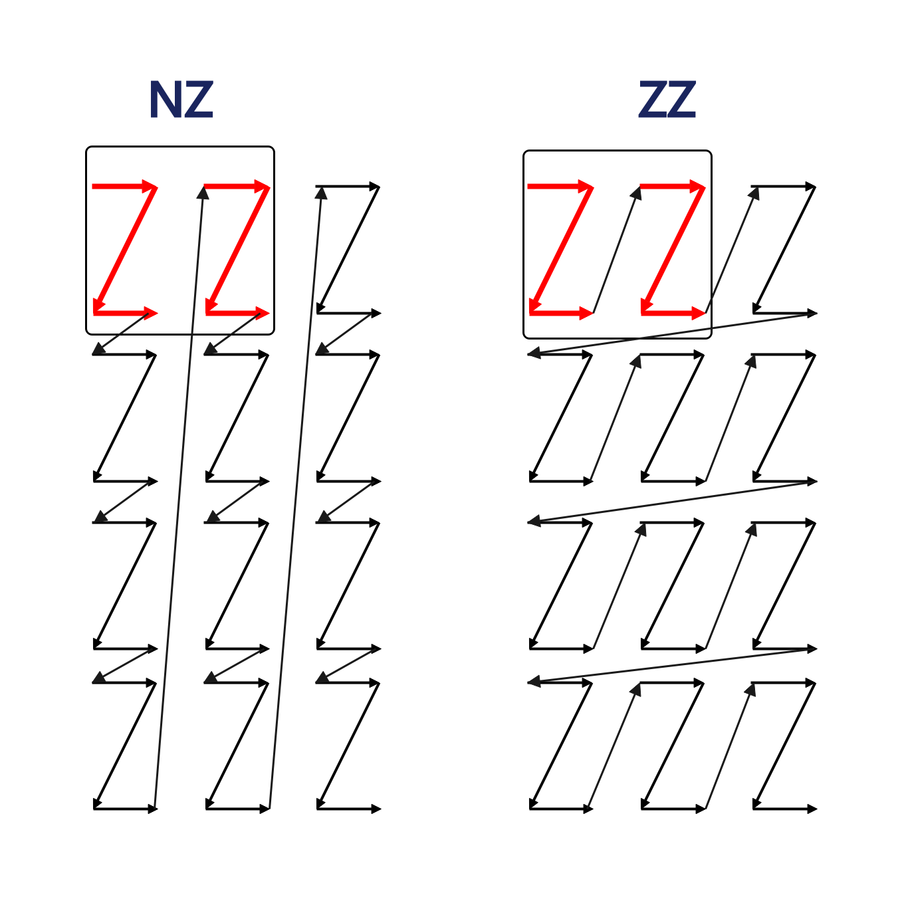
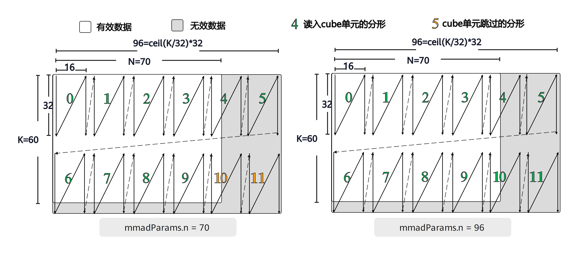
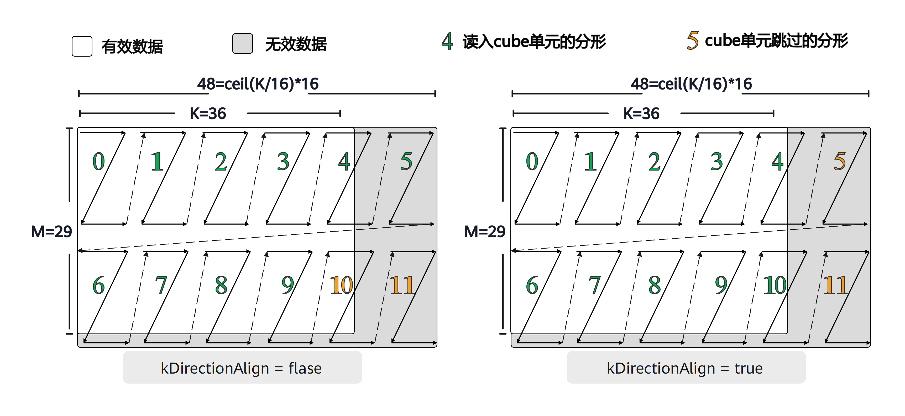

# 支持S8/F16/F32数据类型下，支持配置左右矩阵是否转置的矩阵乘法
## 概述
本样例介绍了在 int8_t / half / float 三种数据类型下，以及左、右矩阵均不转置 / 左矩阵不转置、右矩阵转置 / 左矩阵转置、右矩阵不转置 / 左、右矩阵均转置 共 12 种矩阵乘法场景中，相关指令的使用方法，其中 A 和 B 分别表示矩阵乘法的左右输入矩阵。

首先，说明在将矩阵 A 和 B 从 GM 搬运至 L1 时，如何调用 DataCopyND2NZ 指令；随后，介绍在将矩阵 A 和 B 从 L1 搬运至 L0A / L0B 过程中，如何在 LoadData2D、LoadDataWithTranspose 和 LoadData3DV2 三个指令之间进行选择，以及各指令的具体调用方式。

在完成数据搬运后，进一步说明如何通过 mmad 指令实现矩阵乘法计算（C = A × B），最后介绍如何使用 fixpipe 指令将结果矩阵 C 从 L0C 搬运回 GM。

各指令参数配置及执行指令前后各个矩阵数据排布变化，均配合示意图进行了说明。
## 支持的产品
- Atlas A3 训练系列产品/Atlas A3 推理系列产品
- Atlas A2 训练系列产品/Atlas A2 推理系列产品

## 目录结构介绍
```
├── mmad_s8_f16_f32_with_A_B_transpose_option
│   ├── scripts
│   │   ├── gen_data.py             // 输入数据和真值数据生成脚本
│   │   └── verify_result.py        // 验证输出数据和真值数据是否一致的验证脚本
│   ├── CMakeLists.txt              // 编译工程文件
│   ├── data_utils.h                // 数据读入写出函数
│   └── mmad_s8_f16_f32_with_A_B_transpose_option.asc                    // Ascend C算子实现 & 调用样例
```

## 算子描述
  <!-- 完整的矩阵乘法流程如下：GM上数据排布格式为ND的A矩阵和B矩阵（），调用Datacopy随路转换ND2NZ搬运指令实现数据从GM搬运到L1的同时进行ND到NZ格式的转换。随后，L0A -->
从概述可知一次完整的矩阵乘法涉及的数据搬运过程包括：GM-->L1、L1-->L0A/L0B、L0C-->GM，其中A、B矩阵在不同存储单元的数据排布格式不同：
（1）在GM上，A、B矩阵为ND排列。
（2）在L1上，A、B矩阵为NZ排列。
（3）在L0A上，A矩阵为ZZ排列；在L0B上，B矩阵为ZN排列。


通常的矩阵乘法计算公式：C = A × B，其中A、B、C矩阵的需要满足的shape分别为[M,K]、[K,N]和[M,N]。当A矩阵需要转置才能参与矩阵乘法时，GM上输入的A矩阵shape为[K,M]，同理，当B矩阵需要转置才能参与矩阵乘法时,GM上输入的A矩阵shape为[N,K]。当输入数据类型分别取S8/F16/F32时，若同时通过布尔变量isAtranspose和isBtranspose分别控制A、B矩阵是否转置，组合得到12种场景。


此外，当L1上A矩阵转置、B矩阵不转置时，若L1上A、B矩阵为ZZ排列，则应在L1-->L0通路中调用LoadDataWithTranspose接口；而当排列为通常情况下的NZ排列时，则应调用LoadData3DV2接口。因此，在原有12种场景的基础上，需要新增一种特殊场景：L1上A、B矩阵为ZZ排布,且L1-->L0通路调用LoadDataWithTranspose接口。

下文将介绍上述13种场景下，A、B矩阵在完整矩阵乘法流程的各个阶段前后数据的排布方式、对齐要求、所调用的指令以及如何配置相应的参数。程序中以参数scenarioNum来代表上述13中场景，scenarioNum不同取值对应的含义如下表1所示：

<table border="2" align="center">
<caption>表1：scenarioNum不同取值的含义</caption>
  <tr>
    <td >scenarioNum</td>
    <td>输入数据类型</td>
    <td>输出数据类型</td>
    <td>A矩阵</td>
    <td>B矩阵</td>
  </tr>
  <tr>
    <td>1</td>
    <td rowspan="4" >int8_t</td>
    <td rowspan="4" >int32_t</td>
    <td>不转置</td>
    <td>不转置</td>
  </tr>
  <tr>
    <td>2</td>
    <td>不转置</td>
    <td>转置</td>
  </tr>
  <tr>
    <td>3</td>
    <td>转置</td>
    <td>不转置</td>
  </tr>
  <tr>
    <td>4</td>
    <td>转置</td>
    <td>转置</td>
  </tr>
  <tr>
    <td>5</td>
    <td rowspan="4" >half</td>
    <td rowspan="4" >float</td>
    <td>不转置</td>
    <td>不转置</td>
  </tr>
  <tr>
    <td>6</td>
    <td>不转置</td>
    <td>转置</td>
  </tr>
  <tr>
    <td>7</td>
    <td>转置</td>
    <td>不转置</td>
  </tr>
  <tr>
    <td>8</td>
    <td>转置</td>
    <td>转置</td>
  </tr>
    <tr>
    <td>9</td>
    <td rowspan="5" >float</td>
    <td rowspan="5" >float</td>
    <td>不转置</td>
    <td>不转置</td>
  </tr>
  <tr>
    <td>10</td>
    <td>不转置</td>
    <td>转置</td>
  </tr>
  <tr>
    <td>11</td>
    <td>转置</td>
    <td>不转置</td>
  </tr>
  <tr>
    <td>12</td>
    <td>转置</td>
    <td>转置</td>
  </tr>
    <tr>
    <td>13</td>
    <td>转置</td>
    <td>不转置</td>
  </tr>
</table>

注：scenarioNum取值1到12时，L1上A、B矩阵均为NZ排布；scenarioNum=13时，L1上A、B矩阵均为ZZ排布。

为了方便描述，在此对后续常用概念给出定义：

（1）a矩阵和b矩阵：L1上A、B矩阵都是NZ排布的，其中的分形矩阵分别称为a矩阵和b矩阵。
 
（2）fractalShape(fS):a矩阵和b矩阵的shape为[16, 32/sizeof(T)],其中T表示输入数据类型。

（3）fractalNum(fN):当a或者b矩阵从L1-->L0A/L0B需要转置时，且调用LoadDataWithTranspose接口时，该接口一次只能转置一个方块矩阵，对于S8和F32数据类型fractalShape分别为[16,32]和[16,8]，都需要两个连续的分形合并为一个方块然后转置，因此该参数表示一个方块包含几个分形。对于S8和F32数据类型，；对F16数据类型，fractalNum=1。

（4）fractalSize:a矩阵或b矩阵中包含的元素个数=16 * 32/sizeof(T),当输入数据类型分别为S8/F16/F32时，该变量取值分别为512、256、128。

（5）CeilAlign:向上对齐操作，例如CeilAlign(M=30, 16)=32，表示将M轴向16对齐，对齐后M轴长度为32。


      __aicore__ inline uint16_t CeilAlign(uint16_t size, uint16_t alignValue) {
          return (size + alignValue - 1) / alignValue * alignValue;
      }

（6）CeilDivision:向上取整除法，一般用于求解向上对齐后的循环次数。

（7）mAlignValue:M轴向mAlignValue对齐，例如mAlignValue=32，代表M轴对齐到32，依次类推还有kAlignValue、nAlignValue。

（8）mAlignL0和mAlignL1:A矩阵分别在L1和L0A上时，M轴对齐后的值，虽然这两个值可能相同，但是为了逻辑清晰依然进行区分。依次类推还有kAlignL0、kAlignL1、nAlignL0、nAlignL1。

（9）srcoffset和dstoffset:在L1上，A/B矩阵外轴方向每循环一次时,LocalTensor的地址偏移量；在L0A/L0B上，A/B矩阵外轴方向每循环一次时,LocalTensor的地址偏移量。
。注意，为了方便理解，本次样例全部默认将A矩阵的M轴和B矩阵的K轴作为外轴循环，暂不考虑将M轴与K轴中较长轴作为外轴的场景。

从L1-->L0通路，常用的搬运指令有LoadData2D、LoadDataWithTranspose 和 LoadData3DV2 三个指令，现在将上述13种场景下可以调用指令总结如下表2所示：

<table border="2" align="center">
<caption>表2：L1-->L0,13种场景下可以调用的指令</caption>
  <tr>
    <td></td>
    <td>int8_t</td>
    <td>half</td>
    <td>float</td>
  </tr>
  <tr>
    <td>A矩阵不转置(a不转置)</td>
    <td>LoadData、LoadData3DV2</td>
    <td>LoadData、LoadData3DV2</td>
    <td>LoadData、LoadData3DV2</td>
  </tr>
    <tr>
    <td>A矩阵转置(a转置)</td>
    <td>LoadDataWithTranspose</td>
    <td>LoadData、LoadData3DV2、LoadDataWithTranspose</td>
    <td>LoadData3DV2、LoadDataWithTranspose(L1上数据排布为ZZ)</td>
  </tr>
    <tr>
    <td>B矩阵不转置(b转置)</td>
    <td>LoadDataWithTranspose</td>
    <td>LoadData、LoadData3DV2、LoadDataWithTranspose</td>
    <td>LoadData3DV2、LoadDataWithTranspose(L1上数据排布为ZZ)</td>
  </tr>
    <tr>
    <td>B矩阵转置(b不转置)</td>
    <td>LoadData</td>
    <td>LoadData</td>
    <td>LoadData</td>
  </tr>
</table>

另外，A、B矩阵在L1和L0上在高度和宽度方向上对齐的要求也不相同，现将表1中scenarioNum取1-12对应的12种场景的对齐要求总结得到
如下两个表格：

<table border="2" align="center">
<caption>表3：A、B矩阵在L1上各个轴的对齐要求</caption>
  <tr>
    <td></td>
    <td>int8_t</td>
    <td>half</td>
    <td>float</td>
  </tr>
  <tr>
    <td rowspan="2">A矩阵不转置(a不转置)</td>
    <td colspan="3" align="center">mAlignValue = fS[0]</td>
  </tr>
  <tr>
    <td colspan="3" align="center" >kAlignValue = fS[1]</td>
  </tr>
  <tr>
    <td rowspan="2">A矩阵转置(a转置)</td>
    <td>kAlignValue = fS[0] * fN</td>
    <td colspan="2">kAlignValue = fS[0]</td>
  </tr>
  <tr>
    <td colspan="3" align="center" >mAlignValue = fS[1]</td>
  </tr>
    <tr>
    <td rowspan="2">B矩阵不转置(b转置)</td>
    <td>kAlignValue = fS[0] * fN</td>
    <td colspan="2">kAlignValue = fS[0]</td>
  </tr>
  <tr>
    <td colspan="3" align="center" >nAlignValue = fS[1]</td>
  </tr>
 <tr>
    <td rowspan="2">B矩阵转置(b不转置)</td>
    <td colspan="3" align="center">nAlignValue = fS[0]</td>
  </tr>
  <tr>
    <td colspan="3" align="center" >kAlignValue = fS[1]</td>
  </tr>
  <tr>
</table>


<table border="2" align="center">
<caption>表4：A、B矩阵在L0上各个轴的对齐要求</caption>
  <tr>
    <td></td>
    <td>int8_t</td>
    <td>half</td>
    <td>float</td>
  </tr>
  <tr>
    <td rowspan="2">A矩阵不转置(a不转置)</td>
    <td colspan="3" align="center">mAlignValue = fS[0]</td>
  </tr>
  <tr>
    <td colspan="3" align="center" >kAlignValue = fS[1]</td>
  </tr>
  <tr>
    <td rowspan="2">A矩阵转置(a转置)</td>
    <td colspan="2" align="center">kAlignValue = fS[1]</td>
    <td >kAlignValue = fS[1] * fN</td>
  </tr>
  <tr>
    <td align="center" >mAlignValue = fS[0] * fN</td>
    <td align="center" >mAlignValue = fS[0]</td>
    <td align="center" >mAlignValue = fS[1]</td>
  </tr>
    <tr>
    <td rowspan="2">B矩阵不转置(b转置)</td>
    <td colspan="2" align="center">kAlignValue = fS[1]</td>
      <td align="center">kAlignValue = fS[0]</td>
  </tr>
  <tr>
    <td align="center" >nAlignValue = fS[0] * fN</td>
    <td align="center" >nAlignValue = fS[0]</td>
    <td align="center" >nAlignValue = fS[1]</td>
  </tr>
 <tr>
    <td rowspan="2">B矩阵转置(b不转置)</td>
    <td colspan="3" align="center">nAlignValue = fS[0]</td>
  </tr>
  <tr>
    <td colspan="3" align="center" >kAlignValue = fS[1]</td>
  </tr>
  <tr>
</table>

特别的，当scenarioNum=13时，A、B矩阵在L1和L0上在高度和宽度方向上对齐的要求如下两个表所示：
<table border="2" align="center">
<caption>表5：scenarioNum=13，A、B矩阵在L1上各个轴的对齐要求</caption>
  <tr>
    <td align="center" ></td>
    <td align="center" >float</td>
  </tr>
   <tr>
    <td rowspan="2">A矩阵转置(a转置)</td>
    <td align="center" >kAlignValue = fS[0]</td>
  </tr>
    <tr>
    <td align="center" >mAlignValue = fS[1]*fN</td>
  </tr>
   <tr>
    <td rowspan="2">B矩阵不转置(b转置)</td>
    <td align="center" >kAlignValue = fS[0]</td>
  </tr>
    <tr>
    <td align="center" >nAlignValue = fS[1]*fN</td>
  </tr>
</table>

<table border="2" align="center">
<caption>表6：scenarioNum=13，A、B矩阵在L0上各个轴的对齐要求</caption>
  <tr>
    <td align="center" ></td>
    <td align="center" >float</td>
  </tr>
   <tr>
    <td rowspan="2">A矩阵转置(a转置)</td>
    <td align="center" >mAlignValue = fS[0]</td>
  </tr>
    <tr>
    <td align="center" >kAlignValue = fS[1]*fN</td>
  </tr>
   <tr>
    <td rowspan="2">B矩阵不转置(b转置)</td>
    <td align="center" >kAlignValue = fS[1]*fN</td>
  </tr>
    <tr>
    <td align="center" >nAlignValue = fS[0]</td>
  </tr>
</table>


### 一.A矩阵不转置
#### 1.1. 输入数据类型为half
A矩阵在GM、L1和L0A上的数据排布分别是ND、NZ和ZZ，如下图2所示，当输入数据类型为half类型、A矩阵不转置时,由于A矩阵在L1和L0A上shape都是[M,K]，因此从L1-->L0A过程下图2中红色所示的a矩阵不需要转置。

对齐要求方面，在L1和L0A上A矩阵的M轴都向fS[0]对齐、K轴都向fS[0]对齐。

从图1、图2可以看出，只要是A矩阵不转置，那么GM-->L1、L1-->L0A整个过程的数据搬运方案和对齐要求，可以共用一套配置，因此下面两个小节的描述不仅仅适用于输入为half类型，也适用于输入为int8_t和float类型。


##### 1.1.1 GM到L1

<p align="center">
  
</p>

<p align="center">
图1：A矩阵不转置，half数据类型下，GM-->L1数据排布示意
</p>

下面将介绍如何配置
[DataCopy随路转换ND2NZ搬运](https://www.hiascend.com/document/detail/zh/canncommercial/850/API/ascendcopapi/atlasascendc_api_07_00127.html)指令的Nd2NzParams结构体的成员，各个成员变量的具体含义这里不再赘述。其中需要注意的是，dstNzC0Stride的单位为32B，该参数取值为L1上NZ矩阵的对齐后的行数。

            nd2nzA1Params.ndNum = 1;
            nd2nzA1Params.nValue = m;
            nd2nzA1Params.dValue = k;
            nd2nzA1Params.srcNdMatrixStride = 0;
            nd2nzA1Params.srcDValue = k;

            // 以下这个参数取A矩阵在L1上，高度方向的对齐后的长度
            // 由于A不转置，因此对于三种数据类型该参数均相同
            nd2nzA1Params.dstNzC0Stride = CeilAlign(m, fractalShape[0]);

            nd2nzA1Params.dstNzNStride = 1;
            nd2nzA1Params.dstNzMatrixStride = 0;
##### 1.1.2 L1到L0A

<p align="center">
  
</p>

<p align="center">
图2：A矩阵不转置，half数据类型下，L1-->L0A数据排布示意
</p>

由于A矩阵不转置时，a矩阵也不转置，因此可以调用Load2D接口。下面将介绍如何配置
[Load2D](https://www.hiascend.com/document/detail/zh/canncommercial/850/API/ascendcopapi/atlasascendc_api_07_00169.html)指令的LoadData2DParams结构体的成员，各个成员变量的具体含义这里不再赘述。

如图2所示，以M轴方向作为外轴进行for循环，以K轴方向作为内轴来配置loadDataParams.repeatTimes。如图2所示，srcoffset和dstoffset的含义分别是:在L1上，A矩阵M轴方向每循环一次时,LocalTensor的地址偏移量；在L0A上，A矩阵M轴方向每循环一次时,LocalTensor的地址偏移量。

            uint32_t dstOffset = CeilDivision(k, fractalShape[1]) * fractalSize;
            uint32_t srcOffset = fractalSize;
            // Nz -> Zz
            AscendC::LoadData2DParams loadDataParams;
            loadDataParams.repeatTimes = CeilDivision(k, fractalShape[1]);
            loadDataParams.srcStride = CeilDivision(m, fractalShape[0]);
            // K轴方向相邻迭代间，目的操作数前一个分形结束地址与后一个分形起始地址的间隔
            loadDataParams.dstGap = 0;
            loadDataParams.ifTranspose = false;
            for (int i = 0; i < CeilDivision(m, fractalShape[0]); ++i) {
                AscendC::LoadData(a2Local[i * dstOffset], a1Local[i * srcOffset], loadDataParams);
            }

### 二.A矩阵转置
#### 2.1. 输入数据类型为int8_t
A矩阵在GM、L1和L0A上的数据排布分别是ND、NZ和ZZ。如下图4所示，L1上数据排布为NZ、shape为[K,M]的B矩阵与数据排布为ZN、shape为[M,K]的B矩阵是等价的（内存排布一致），接着调用LoadDataWithTranspose将ZN排布、shape为[M,K]的B矩阵中K轴方向的分形两两合并(图中红色分形)为一个方块矩阵后转置就可以实现L0A上A矩阵为ZZ排布、shape为[M,K]。


对齐要求方面，在L1上A矩阵的K轴向fS[0] * fractalNum对齐、M轴向fS[1]对齐；在L0A上A矩阵的M轴向fS[0] * fractalNum对齐、K轴向fS[1]对齐。
##### 2.1.1 GM到L1

<p align="center">
  
</p>

<p align="center">
图3：A矩阵转置，int8_t数据类型下，GM-->L1数据排布示意
</p>

配置Nd2NzParams结构体的成员时，需要注意，源操作数的shape为[K,M]以及dstNzC0Stride的单位为32B，该参数取值为L1上NZ矩阵的对齐后的行数。


            nd2nzA1Params.ndNum = 1;
            nd2nzA1Params.nValue = k;
            nd2nzA1Params.dValue = m;
            nd2nzA1Params.srcNdMatrixStride = 0;
            nd2nzA1Params.srcDValue = m;

            // 以下这个参数取A矩阵在L1上，高度方向的对齐后的长度
            // 由于A转置，因此三种数据类型下，该参数的配置不相同
            if constexpr (AscendC::IsSameType<T, int8_t>::value && AscendC::IsSameType<U, int32_t>::value) {
                nd2nzA1Params.dstNzC0Stride = CeilAlign(k, fractalShape[0] * fractalNum);
            } 
            nd2nzA1Params.dstNzNStride = 1;
            nd2nzA1Params.dstNzMatrixStride = 0;

##### 2.1.2 L1到L0A
<p align="center">
  
</p>

<p align="center">
图4：A矩阵转置，int8_t数据类型下，L1-->L0B数据排布示意
</p>

由于A矩阵转置时，a矩阵也转置，因此可以调用LoadDataWithTranspose接口。下面将介绍如何配置
[LoadDataWithTranspose](https://www.hiascend.com/document/detail/zh/canncommercial/850/API/ascendcopapi/atlasascendc_api_07_0239.html)指令的LoadData2dTransposeParams结构体的成员，各个成员变量的具体含义这里不再赘述。

如图4所示，以M轴方向作为外轴进行for循环，以K轴方向作为内轴来配置loadDataParams.repeatTimes。需要特别注意的是，由于转置时连续两个分形合并为一个方块，因此loadDataParams.repeatTimes=CeilDivision(k, fractalShape[0] * fractalNum)。另外，如图4所示，L0A中转置前处于同一方块中的两个分形在L1中是连续的，转置后前一个分形结束地址与后一个分形起始地址的间隔为CeilDivision(k, fractalShape[1]) - 1，单位是512B。

           // dstoffset要根据A矩阵在L0上，宽度方向的对齐来求解
            uint32_t dstOffset = CeilDivision(k, fractalShape[1]) * fractalSize * fractalNum;
            // srcoffset要根据A矩阵在L1上，高度方向的对齐来求解
            uint32_t srcOffset = CeilDivision(k, fractalShape[0] * fractalNum) * fractalSize * fractalNum;

            // Nz -> Zz
            AscendC::LoadData2dTransposeParams loadDataParams;
            loadDataParams.startIndex = 0;
            loadDataParams.repeatTimes = CeilDivision(k, fractalShape[0] * fractalNum);
            loadDataParams.srcStride = 1;
            loadDataParams.dstGap = 0;
            // 每个迭代内目的操作数转置前一个分形结束地址与后一个分形起始地址的间隔，单位为512B
            loadDataParams.dstFracGap = CeilDivision(k, fractalShape[1]) - 1;
            for (int i = 0; i < CeilDivision(m, fractalShape[1]); ++i) {
                AscendC::LoadDataWithTranspose(a2Local[i * dstOffset], a1Local[i * srcOffset], loadDataParams);
            }

#### 2.2 输入数据类型为half

A矩阵在GM、L1和L0A上的数据排布分别是ND、NZ和ZZ。如下图6所示，L1上数据排布为NZ、shape为[K,M]的B矩阵与数据排布为ZN、shape为[M,K]的B矩阵是等价的（内存排布一致），接着调用LoadData指令将ZN排布、shape为[M,K]的B矩阵中的分形(图中红色分形)转置就可以实现L0A上A矩阵为ZZ排布、shape为[M,K]。


对齐要求方面，在L1上A矩阵的K轴向fS[0]对齐、M轴向fS[1]对齐；在L0A上A矩阵的M轴向fS[0]对齐、K轴向fS[1]对齐。

##### 2.2.1 GM到L1

<p align="center">
  
</p>

<p align="center">
图5：A矩阵转置，half数据类型下，GM-->L1 数据排布示意
</p>

配置Nd2NzParams结构体的成员时，需要注意，源操作数的shape为[K,M]以及dstNzC0Stride的单位为32B，该参数取值为L1上NZ矩阵的对齐后的行数,也就是K轴对齐到fractalShape[0]后的长度。


            nd2nzA1Params.ndNum = 1;
            nd2nzA1Params.nValue = k;
            nd2nzA1Params.dValue = m;
            nd2nzA1Params.srcNdMatrixStride = 0;
            nd2nzA1Params.srcDValue = m;
            // 以下这个参数取A矩阵在L1上，高度方向的对齐后的长度
            // 由于A转置，因此三种数据类型下，该参数的配置不相同
            if constexpr (AscendC::IsSameType<T, half>::value && AscendC::IsSameType<U, float>::value) {
                nd2nzA1Params.dstNzC0Stride = CeilAlign(k, fractalShape[0]);
            }


##### 2.2.2 L1到L0A

<p align="center">
  
</p>

<p align="center">
图6：A矩阵转置，half数据类型下，L1-->L0A 数据排布示意
</p>

根据表2可知，当A矩阵转置时，a矩阵也转置，当且仅当输入数据类型为half时，可以调用LoadData指令完成转置。

如图6所示，以M轴方向作为外轴进行for循环，以K轴方向作为内轴来配置loadDataParams.repeatTimes。结合图示3，并根据前述srcoffset和dstoffset的定义，可以得出两者的取值均为：CeilDivision(k, fractalShape[0]) * fractalSize。  

            uint32_t dstOffset = CeilDivision(k, fractalShape[0]) * fractalSize;
            uint32_t srcOffset = CeilDivision(k, fractalShape[0]) * fractalSize;
            // Nz -> Zz
            AscendC::LoadData2DParams loadDataParams;
            loadDataParams.repeatTimes = CeilDivision(k, fractalShape[0]);
            //源操作数，内轴，相邻迭代间
            loadDataParams.srcStride = 1;
            loadDataParams.dstGap = 0;
            loadDataParams.ifTranspose = true;
            for (int i = 0; i < CeilDivision(m, fractalShape[1]); ++i) {
            AscendC::LoadData(a2Local[i * dstOffset], a1Local[i * srcOffset], loadDataParams);
            }

#### 2.3. 输入数据类型为float
A矩阵在GM、L1和L0A上的数据排布分别是ND、NZ和ZZ。与2.1和2.2小节中类似，L1上数据排布为NZ、shape为[K,M]的B矩阵与数据排布为ZN、shape为[M,K]的B矩阵是等价的（内存排布一致），然而此时不能像2.1小节中那样调用LoadDataWithTranspose指令进行转置，因为在K轴方向两个连续的分形并不能合并为一个16*16的方块。

如图7所示，当L1上A矩阵为NZ排布时并不满足LoadDataWithTranspose指令要求两个连续分形合并为方块矩阵的要求，如果要调用LoadDataWithTranspose，要求L1上的A矩阵必须满足ZZ排布。通常矩阵乘法要求L1上A、B矩阵排列为NZ，但是在GM-->L1通路调用DataCopyND2NZ 指令时，可以通过对参数特殊设置最终实现ND2ZZ的效果。

<p align="center">
  
</p>

<p align="center">
图7：L1上NZ排布的A矩阵，无法调用LoadDataWithTranspose指令示意图
</p>


##### 2.3.1 L1上数据排布为NZ，L1-->L0A调用Load3DV2
当GM-->L1通路调用DataCopyND2NZ 指令后，L1上数据排布为NZ，此时可以调用LoadData3DV2接口实现a矩阵转置。如图8所示，调用LoadData3DV2指令时，在写入L0A之前会先分别将A矩阵高度和宽度轴向16、8对齐，接着该指令会将整个A矩阵进行转置并且每一个分形也转置，最终写入到L0A的A矩阵是ZZ排布。

对齐要求方面，根据图可知以下对齐要求：在L1上A矩阵的K轴向fS[0] 对齐、M轴向fS[1]对齐；在L0A上A矩阵的M轴向fS[1]对齐、K轴向fS[1]*fractalNum对齐。

###### 2.3.1.1 GM到L1

配置Nd2NzParams结构体的成员时，需要注意，源操作数的shape为[K,M]以及dstNzC0Stride的单位为32B，该参数取值为L1上NZ矩阵的对齐后的行数,也就是K轴对齐到fractalShape[0]后的长度。

            nd2nzA1Params.ndNum = 1;
            nd2nzA1Params.nValue = k;
            nd2nzA1Params.dValue = m;
            nd2nzA1Params.srcNdMatrixStride = 0;
            nd2nzA1Params.srcDValue = m;

            // 以下这个参数取A矩阵在L1上，高度方向的对齐后的长度
            // 由于A转置，因此三种数据类型下，该参数的配置不相同
 			if constexpr (AscendC::IsSameType<T, float>::value && AscendC::IsSameType<U, float>::value) {
                nd2nzA1Params.dstNzC0Stride = CeilAlign(k, fractalShape[0]);
            }

            nd2nzA1Params.dstNzNStride = 1;
            nd2nzA1Params.dstNzMatrixStride = 0;
            
###### 2.3.1.2 L1到L0A
<p align="center">
  
</p>

<p align="center">
图8：A矩阵转置，float数据类型下，Load3DV2指令功能示意
</p>

[Load3Dv2](https://www.hiascend.com/document/detail/zh/canncommercial/850/API/ascendcopapi/atlasascendc_api_07_00170.html)指令的 LoadData3DParamsV2结构体的成员，各个成员变量的具体含义这里不再赘述。根据Load3Dv2指令完成img2col的过程，可知 img2col后A矩阵高度为ho * wo,根据ho和wo的计算公式，代入卷积核宽度、卷积核滑动步长、卷积核膨胀系数等参数可知：A矩阵的高度为 CeilAlign(k, fractalShape[0])；img2col后A矩阵宽度为ho * wo,ci * kh * kw,代入kh=1,kw=1，可知A矩阵的宽度为CeilAlign(m, fractalShape[1])。最后，配置loadDataParams.enTranspose = true，将整个A
矩阵转置并且将其中每一个分形转置。

            // 源操作数height
            loadDataParams.l1H = CeilAlign(k, fractalShape[0]);
            // 源操作数wight
            loadDataParams.l1W = 1;
            // 源操作数的通道数，
            // img2col的结果矩阵高度为ho * wo,根据ho和wo的计算公式，代入卷积核宽度、卷积核滑动步长、卷积核膨胀系数等参数可知：ho * wo = loadDataParams.l1H * loadDataParams.l1w
            // img2col的结果矩阵宽度为ci * kh * kw,代入kh=1,kw=1，可知结果矩阵的宽度为ci=loadDataParams.channelSize = m
            loadDataParams.channelSize = CeilAlign(m, fractalShape[1]);
            // 该指令在目的操作数width维度的传输长度
            loadDataParams.kExtension = CeilAlign(m, fractalShape[1]);
            // 该指令在目的操作数height维度的传输长度
            loadDataParams.mExtension = CeilAlign(k, fractalShape[1] * fractalNum);
            // 卷积核在源操作数width维度滑动的步长
            loadDataParams.strideW = 1;
            // 卷积核在源操作数height维度滑动的步长
            loadDataParams.strideH = 1;
            // 卷积核width
            loadDataParams.filterW = 1;
            // 卷积核height
            loadDataParams.filterH = 1;
            // 卷积核width膨胀系数
            loadDataParams.dilationFilterW = 1;
            // 卷积核height膨胀系数
            loadDataParams.dilationFilterH = 1;
            loadDataParams.enTranspose = true;

##### 2.3.2 L1上数据排布为ZZ，L1-->L0A调用LoadDataWithTranspose
当GM-->L1通路调用DataCopyND2NZ 指令后，L1上数据排布为ZZ，此时可以调用LoadDataWithTranspose接口实现a矩阵转置。

对齐要求方面，根据图2、图3可知以下对齐要求：在L1上A矩阵的K轴向fS[0] 对齐、M轴向fS[1]*fractalNum对齐；在L0A上A矩阵的M轴向fS[0]对齐、K轴向fS[1]*fractalNum对齐。
###### 2.3.2.1 GM到L1

<p align="center">
  
</p>

<p align="center">
图9：A矩阵转置，float数据类型下，GM-->L1过程中ND2ZZ数据排布示意
</p>

如上图9所示，A矩阵转置(a转置)，输入数据类型为float类型时，为了调用LoadDataWithTranspose接口，要求L1上A矩阵的排布必须是ZZ,因此需要在GM-->L1阶段调用DataCopyND2NZ 指令时通过巧妙地配置Nd2NzParams结构体来实现ND2ZZ的效果。
DataCopyND2NZ 指令实现ND2ZZ效果的核心思想：将1个ND矩阵沿着高度轴以步长16进行切分，看作CeilDivision(k, 16)个ND矩阵。由于搬运后CeilDivision(k, 16)个NZ矩阵在高度轴方向有且仅有1个分形，因此最终搬运到L1上的A矩阵等效于ZZ排列。
                    
                    nd2nzA1Params.ndNum = CeilDivision(k, fractalShape[0]);
                    nd2nzA1Params.nValue = fractalShape[0];
                    nd2nzA1Params.dValue = m;
                    nd2nzA1Params.srcNdMatrixStride = fractalShape[0] * m;
                    nd2nzA1Params.srcDValue = m;
                    nd2nzA1Params.dstNzC0Stride = fractalShape[0];
                    nd2nzA1Params.dstNzNStride = 1;
                    nd2nzA1Params.dstNzMatrixStride = fractalShape[0] * CeilAlign(m, fractalShape[1] * fractalNum);
                    
###### 2.3.2.2 L1到L0A

<p align="center">
  
</p>

<p align="center">
图10：A矩阵转置，float数据类型下，L1上数据排布为ZZ,L1-->L0A数据排布示意
</p>

如上图10所示，L1上shape为[K,M]、ZZ排布的A矩阵与shape为[M,K]、NN排布的A矩阵是等价的。L0A上要求A矩阵shape为[M,K]、ZZ排布，因此L1-->L0A通路通过调用LoadDataWithTranspose指令实现a矩阵（上图10中2个红色分形）的转置。

下面将介绍如何配置
[LoadDataWithTranspose](https://www.hiascend.com/document/detail/zh/canncommercial/850/API/ascendcopapi/atlasascendc_api_07_0239.html)指令的LoadData2dTransposeParams结构体的成员，各个成员变量的具体含义这里不再赘述。需要特别注意的是，由于转置时连续两个分形合并为一个方块，因此loadDataParams.repeatTimes=CeilDivision(k, fractalShape[1] * fractalNum)。另外，由于在目的操作数中同属一个方块矩阵的两个分形地址连续，因此参数loadDataParams.dstFracGap = 0。


                // A矩阵在L0A上shape为[M，K]、ZZ排布，因此dstoffset要根据A矩阵在K轴方向的对齐来求解
                uint32_t dstOffset = CeilDivision(k, fractalShape[1] * fractalNum) * fractalSize * fractalNum;
                // A矩阵在L1上shape为[K,M]、ZZ排布，因此srcoffset为1个分形包含的元素个数
                uint32_t srcOffset = fractalSize * fractalNum;

                AscendC::LoadData2dTransposeParams loadDataParams;
                // 搬运起始位置为源操作数中第几个方块矩阵（0 为源操作数中第1个方块矩阵)
                loadDataParams.startIndex = 0;
                // 迭代次数,每次迭代转置一个方块矩阵
                loadDataParams.repeatTimes = CeilDivision(k, fractalShape[1] * fractalNum);
                // 相邻迭代间，源操作数前一个分形与后一个分形起始地址的间隔。单位是方块矩阵的大小
                loadDataParams.srcStride = CeilDivision(m, fractalShape[1] * fractalNum);
                // 相邻迭代间，目的操作数前一个迭代第一个分形的结束地址到下一个迭代第一个分形起始地址的间隔，单位：512B
                loadDataParams.dstGap = 1;
                // 每个迭代内目的操作数转置前一个分形结束地址与后一个分形起始地址的间隔，单位为512B
                loadDataParams.dstFracGap = 0;
                for (int i = 0; i < CeilDivision(m, fractalShape[1] * fractalNum); ++i) {
                    AscendC::LoadDataWithTranspose(a2Local[i * dstOffset], a1Local[i * srcOffset], loadDataParams);
                }


### 三.B矩阵不转置
#### 3.1. 输入数据类型为int8_t

B矩阵在GM、L1和L0B上的数据排布分别是ND、NZ和ZN。如下图12所示，当输入数据类型为int8_t类型、B矩阵不转置时,将L1上数据排布为NZ、shape为[K，N]的B矩阵中分形沿着K轴两两合并为一个方块矩阵后转置，并且调整分形之间的顺序，最终可以得到L0B上数据排布为ZN、shape为[K,N]的B矩阵。

对齐要求方面，在L1上B矩阵的K轴向fS[0] 对齐、N轴向fS[1]对齐；在L0B上B矩阵的K轴向fS[1] 对齐、N轴向fS[0] 对齐。

##### 3.1.1 GM到L1

<p align="center">
  
</p>

<p align="center">
图11：B矩阵不转置，int8_t数据类型下，GM-->L1 数据排布示意
</p>

配置Nd2NzParams结构体的成员时，需要注意，源操作数的shape为[K,N]以及dstNzC0Stride的单位为32B，该参数取值为L1上NZ矩阵的对齐后的行数。

            nd2nzB1Params.ndNum = 1;
            nd2nzB1Params.nValue = k;
            nd2nzB1Params.dValue = n;
            nd2nzB1Params.srcNdMatrixStride = 0;
            nd2nzB1Params.srcDValue = n;
            // 以下这个参数取B矩阵在L1上，高度方向的对齐后的长度
            // 由于A转置，因此三种数据类型下，该参数的配置不相同
            if constexpr (AscendC::IsSameType<T, int8_t>::value && AscendC::IsSameType<U, int32_t>::value) {
                nd2nzB1Params.dstNzC0Stride = CeilAlign(k, fractalShape[0] * fractalNum);
            } 
            nd2nzB1Params.dstNzNStride = 1;
            nd2nzB1Params.dstNzMatrixStride = 0;

##### 3.1.2 L1到L0B

<p align="center">
  
</p>

<p align="center">
图12：B矩阵不转置，int8_t数据类型下，L1-->L0B 数据排布示意
</p>

由于b转置，因此可以调用LoadDataWithTranspose接口。下面将介绍如何配置
[LoadDataWithTranspose](https://www.hiascend.com/document/detail/zh/canncommercial/850/API/ascendcopapi/atlasascendc_api_07_0239.html)指令的LoadData2dTransposeParams结构体的成员，各个成员变量的具体含义这里不再赘述。

如图12所示，以K轴方向作为外轴进行for循环，以N轴方向作为内轴来配置loadDataParams.repeatTimes。需要特别注意的是，由于转置时连续两个分形合并为一个方块，因此loadDataParams.repeatTimes=CeilDivision(k, fractalShape[0] * fractalNum)。另外，如图12所示，L0A中转置前处于同一方块中的两个分形在L1中是连续的，转置后两个分形依然是连续的，因此前一个分形结束地址与后一个分形起始地址的间隔为0。

            uint32_t dstOffset = CeilDivision(n, fractalShape[0] * fractalNum) * fractalSize * fractalNum;
            uint32_t srcOffset = fractalSize * fractalNum;
            AscendC::LoadData2dTransposeParams loadDataParams;
            loadDataParams.startIndex = 0;
            loadDataParams.repeatTimes = CeilDivision(n, fractalShape[1]);
            loadDataParams.srcStride = CeilDivision(k, fractalShape[0] * fractalNum);
            loadDataParams.dstGap = 1;
            loadDataParams.dstFracGap = 0;
            for (int i = 0; i < CeilDivision(k, fractalShape[0] * fractalNum); ++i) {
                AscendC::LoadDataWithTranspose(b2Local[i * dstOffset], b1Local[i * srcOffset], loadDataParams);
            }
#### 3.2 输入数据类型为half
B矩阵在GM、L1和L0B上的数据排布分别是ND、NZ和ZN。如下图14所示，当输入数据类型为half类型、B矩阵不转置时,将L1上数据排布为NZ、shape为[K，N]的B矩阵中每个分形转置，并且调整分形之间的顺序，最终可以得到L0B上数据排布为ZN、shape为[K,N]的B矩阵。

对齐要求方面，在L1上B矩阵的K轴向fS[0] 对齐、N轴向fS[1]对齐；在L0B上B矩阵的K轴向fS[0]对齐、N轴向fS[1]对齐。

##### 3.2.1 GM到L1

<p align="center">
  
</p>

<p align="center">
图13：B矩阵不转置，half数据类型下，GM-->L1 数据排布示意
</p>

配置Nd2NzParams结构体的成员时，需要注意，源操作数的shape为[K,N]以及dstNzC0Stride的单位为32B，该参数取值为L1上NZ矩阵的对齐后的行数。

            nd2nzB1Params.ndNum = 1;
            nd2nzB1Params.nValue = k;
            nd2nzB1Params.dValue = n;
            nd2nzB1Params.srcNdMatrixStride = 0;
            nd2nzB1Params.srcDValue = n;
            // 以下这个参数取B矩阵在L1上，高度方向的对齐后的长度
            // 由于A转置，因此三种数据类型下，该参数的配置不相同
         	if constexpr (AscendC::IsSameType<T, half>::value && AscendC::IsSameType<U, float>::value) {
                nd2nzB1Params.dstNzC0Stride = CeilAlign(k, fractalShape[0]);
            } 
            nd2nzB1Params.dstNzNStride = 1;
            nd2nzB1Params.dstNzMatrixStride = 0;
##### 3.2.2 L1到L0B

<p align="center">
  
</p>

<p align="center">
图14：B矩阵不转置，half数据类型下，L1-->L0B 数据排布示意
</p>

根据表2可知，当B矩阵转置时，b矩阵也转置，当且仅当输入数据类型为half时，可以调用LoadData指令完成转置。

如上图14所示，以K轴方向作为外轴进行for循环，以N轴方向作为内轴来配置loadDataParams.repeatTimes。结合图示，并根据前述srcoffset和dstoffset的定义，可以得出两者的取值。

            uint32_t dstOffset = CeilDivision(n, fractalShape[0] * fractalNum) * fractalSize * fractalNum;
            uint32_t srcOffset = fractalSize * fractalNum;
            // Nz -> Zn
            AscendC::LoadData2DParams loadDataParams;
            loadDataParams.repeatTimes = CeilDivision(n, fractalShape[0] * fractalNum);
            loadDataParams.srcStride = CeilDivision(k, fractalShape[0] * fractalNum);
            loadDataParams.dstGap = 0;
            loadDataParams.ifTranspose = true;
            for (int i = 0; i < CeilDivision(k, fractalShape[0] * fractalNum); ++i) {
                AscendC::LoadData(b2Local[i * dstOffset], b1Local[i * srcOffset], loadDataParams);
            }
#### 3.3. 输入数据类型为float

与 2.3 小节类似，当输入数据类型为 float 且 b 矩阵需要转置时，若 L1 上的数据排布为 NZ 或 ZZ，可调用的指令会有所差异，因此本节也将分为两小节分别介绍。

##### 3.3.1 L1上数据排布为NZ,L1-->L0B调用Load3DV2

如图15所示，调用LoadData3DV2指令时，在写入L0B之前会先分别将B矩阵高度和宽度轴向16、8对齐，接着该指令不会将整个B矩阵进行转置而是将每一个分形转置，最终写入到L0B的B矩阵是ZN排布。

对齐要求方面，在L1上B矩阵的K轴向fS[0] * fractalNum对齐、N轴向fS[1]对齐；在L0B上B矩阵的K轴向fS[0] * fractalNum对齐、N轴向fS[1]对齐。

###### 3.3.1.1 GM到L1
配置Nd2NzParams结构体的成员时，需要注意，源操作数的shape为[K,N]以及dstNzC0Stride的单位为32B，该参数取值为L1上NZ矩阵的对齐后的行数。

            nd2nzB1Params.ndNum = 1;
            nd2nzB1Params.nValue = k;
            nd2nzB1Params.dValue = n;
            nd2nzB1Params.srcNdMatrixStride = 0;
            nd2nzB1Params.srcDValue = n;
            // 以下这个参数取B矩阵在L1上，高度方向的对齐后的长度
            // 由于A转置，因此三种数据类型下，该参数的配置不相同
           if constexpr (AscendC::IsSameType<T, float>::value && AscendC::IsSameType<U, float>::value) {
                nd2nzB1Params.dstNzC0Stride = CeilAlign(k, fractalShape[0]);
            }
            nd2nzB1Params.dstNzNStride = 1;
            nd2nzB1Params.dstNzMatrixStride = 0;
###### 3.3.1.2 L1到L0B

<p align="center">
  
</p>

<p align="center">
图15：B矩阵不转置，float数据类型下，Load3DV2指令功能示意
</p>

下面将介绍如何配置
[Load3Dv2](https://www.hiascend.com/document/detail/zh/canncommercial/850/API/ascendcopapi/atlasascendc_api_07_00170.html)指令的 LoadData3DParamsV2结构体的成员，各个成员变量的具体含义这里不再赘述。

根据Load3Dv2指令完成img2col的过程，可知 img2col后B矩阵高度为ho * wo,根据ho和wo的计算公式，代入卷积核宽度、卷积核滑动步长、卷积核膨胀系数等参数可知：A矩阵的高度为 CeilAlign(k, fractalShape[0])；img2col后A矩阵宽度为ho * wo,ci * kh * kw,代入kh=1,kw=1，可知A矩阵的宽度为CeilAlign(n, fractalShape[1])。需要注意的是 loadDataParams.enTranspose 配置仅仅对A矩阵有效，因此取值为true或者false不会影响功能。

            loadDataParams.l1H = CeilAlign(k, fractalShape[0]);
            loadDataParams.l1W = 1;
            loadDataParams.channelSize = CeilAlign(n, fractalShape[1]);
            loadDataParams.kExtension = CeilAlign(n, fractalShape[1]);
            loadDataParams.mExtension = CeilAlign(k, fractalShape[0]);
            loadDataParams.strideW = 1;
            loadDataParams.strideH = 1;
            loadDataParams.filterW = 1;
            loadDataParams.filterH = 1;
            loadDataParams.dilationFilterW = 1;
            loadDataParams.dilationFilterH = 1;
            loadDataParams.filterSizeW = false;
            loadDataParams.filterSizeH = false;
            loadDataParams.enTranspose = true;
            loadDataParams.fMatrixCtrl = false;

##### 3.3.2 L1上数据排布为ZZ,L1-->L0B调用LoadDataWithTranspose

如图7所示，当L1上的A矩阵或者B矩阵满足ZZ排布才能满足LoadDataWithTranspose指令要求两个连续分形合并为方块矩阵的要求。如下图16所示，为确保L1上的A矩阵或者B矩阵的数据排布为ZZ,在GM-->L1通路调用DataCopyND2NZ 指令时，需要通过对参数特殊设置最终实现ND2ZZ的效果，参数的具体配置方式见下一个小节。
###### 3.3.2.1 GM到L1

<p align="center">
  
</p>
<p align="center">
图16：B矩阵不转置，float数据类型下，GM-->L1过程中ND2ZZ数据排布示意
</p>

 B矩阵不转置(b转置)，输入数据类型为float类型时，为了调用LoadDataWithTranspose接口，要求L1上B矩阵的排布必须是ZZ, 因此需要在GM-->L1阶段调用DataCopyND2NZ 指令时通过巧妙地配置Nd2NzParams结构体来实现ND2ZZ的效果。
                    
如上图16所示，DataCopyND2NZ 指令实现ND2ZZ效果的核心思想在于将1个ND矩阵沿着高度轴以步长16进行切分，看作CeilDivision(k, 16)个ND矩阵。由于搬运后CeilDivision(k, 16)个NZ矩阵在高度轴方向有且仅有1个分形，因此最终搬运到L1上的B矩阵等效于ZZ排列。
                    
                    nd2nzB1Params.ndNum = CeilDivision(k, fractalShape[0]);
                    nd2nzB1Params.nValue = fractalShape[0];
                    nd2nzB1Params.dValue = n;
                    nd2nzB1Params.srcNdMatrixStride = fractalShape[0] * n;
                    nd2nzB1Params.srcDValue = n;
                    nd2nzB1Params.dstNzC0Stride = fractalShape[0];
                    nd2nzB1Params.dstNzNStride = 1;
                    nd2nzB1Params.dstNzMatrixStride = fractalShape[0] * CeilAlign(n, fractalShape[1] * fractalNum);
###### 3.3.2.2 L1到L0B

<p align="center">
  
</p>

<p align="center">
图17：B矩阵不转置，float数据类型下，L1上数据排布为ZZ,L1-->L0B数据排布示意
</p>

配置LoadData2dTransposeParams结构体时，需要特别注意的是，由于转置时连续两个分形合并为一个方块，因此loadDataParams.repeatTimes=CeilDivision(n, fractalShape[1] * fractalNum)。另外，由于在目的操作数中同属一个方块矩阵的两个分形地址不再连续，此时参数loadDataParams.dstFracGap = CeilDivision(n, fractalShape[0]) - 1 =3-1=2。

                // B矩阵在L0B上shape为[K，N]、ZN排布，因此dstoffset要根据B矩阵在N轴方向的对齐来求解
                uint32_t dstOffset = CeilDivision(n, fractalShape[0]) * fractalSize * fractalNum;
                // B矩阵在L1上shape为[K,N]、ZZ排布，因此srcoffset要根据B矩阵在N轴方向的对齐来求解
                uint32_t srcOffset = CeilDivision(n, fractalShape[1] * fractalNum) * fractalSize * fractalNum;

                AscendC::LoadData2dTransposeParams loadDataParams;
                // 搬运起始位置为源操作数中第几个方块矩阵（0 为源操作数中第1个方块矩阵)
                loadDataParams.startIndex = 0;
                // 迭代次数,每次迭代转置一个方块矩阵
                loadDataParams.repeatTimes = CeilDivision(n, fractalShape[1] * fractalNum);
                // 相邻迭代间，源操作数前一个分形与后一个分形起始地址的间隔。单位是方块矩阵的大小
                loadDataParams.srcStride = 1;
                // 相邻迭代间，目的操作数前一个迭代第一个分形的结束地址到下一个迭代第一个分形起始地址的间隔，单位：512B
                loadDataParams.dstGap = 0;
                // 每个迭代内目的操作数转置前一个分形结束地址与后一个分形起始地址的间隔，单位为512B
                loadDataParams.dstFracGap = CeilDivision(n, fractalShape[0]) - 1;
                for (int i = 0; i < CeilDivision(k, fractalShape[0]); ++i) {
                    AscendC::LoadDataWithTranspose(b2Local[i * dstOffset], b1Local[i * srcOffset], loadDataParams);
                }
### 四.B矩阵转置
#### 1.1. 输入数据类型为half
B矩阵在GM、L1和L0B上的数据排布分别是ND、NZ和ZN。如下图19所示，当输入数据类型为half类型、B矩阵转置时,L1上数据排布为NZ、shape为[N,K]的B矩阵与L0B上数据排布为ZN、shape为[K,N]的B矩阵是等价的（内存排布一致），因此从L1-->L0B过程中b矩阵不需要转置。

对齐要求方面，在L1和L0B上B矩阵的N轴都向fS[0]对齐、K轴都向fS[1]对齐。

从图18、图19可以看出，只要是B矩阵不转置，那么GM-->L1、L1-->L0B整个过程的数据搬运方案和对齐要求，可以共用一套配置，因此下面两个小节的描述不仅仅适用于输入为half类型，也适用于输入为int8_t和float类型。
##### 1.1.1 GM到L1
<p align="center">
  
</p>

<p align="center">
图18：B矩阵转置，half数据类型下，GM-->L1 数据排布示意
</p>

下面将介绍如何配置
[DataCopy随路转换ND2NZ搬运](https://www.hiascend.com/document/detail/zh/canncommercial/850/API/ascendcopapi/atlasascendc_api_07_00127.html)指令的Nd2NzParams结构体的成员，各个成员变量的具体含义这里不再赘述。


            nd2nzB1Params.ndNum = 1;
            nd2nzB1Params.nValue = n;
            nd2nzB1Params.dValue = k;
            nd2nzB1Params.srcNdMatrixStride = 0;
            nd2nzB1Params.srcDValue = k;

            // 以下这个参数取B矩阵在L1上，高度方向的对齐后的长度
            // 由于B转置，因此三种数据类型下，该参数的配置相同
            nd2nzB1Params.dstNzC0Stride = CeilAlign(n, fractalShape[0]);
            nd2nzB1Params.dstNzNStride = 1;
            nd2nzB1Params.dstNzMatrixStride = 0;

##### 1.1.2 L1到L0B
<p align="center">
  
</p>

<p align="center">
图19：B矩阵转置，half数据类型下，L1-->L0B 数据排布示意
</p>
由于B矩阵转置时，b矩阵也不转置，因此可以调用Load2D接口。

[Load2D](https://www.hiascend.com/document/detail/zh/canncommercial/850/API/ascendcopapi/atlasascendc_api_07_00169.html)指令的LoadData2DParams结构体的成员，各个成员变量的具体含义这里不再赘述。

如图19所示，以K轴方向作为外轴进行for循环，以N轴方向作为内轴来配置loadDataParams.repeatTimes。如图19所示，srcoffset和dstoffset的含义分别是:在L1上，B矩阵K轴方向每循环一次时,LocalTensor的地址偏移量；在L0B上，B矩阵K轴方向每循环一次时,LocalTensor的地址偏移量。由于L1上的B矩阵与L0B上的B矩阵等价，因此srcOffset和dstOffset相同。

        // srcOffset和dstOffset相同
        // n轴向fractalShape[0]对齐
        uint32_t dstOffset = CeilDivision(n, fractalShape[0]) * fractalSize;
        uint32_t srcOffset = CeilDivision(n, fractalShape[0]) * fractalSize;
        // Nz -> Zz
        AscendC::LoadData2DParams loadDataParams;
        loadDataParams.repeatTimes = CeilDivision(n, fractalShape[0]);
        loadDataParams.srcStride = 1;
        // N轴方向相邻迭代间，目的操作数前一个分形结束地址与后一个分形起始地址的间隔
        loadDataParams.dstGap = 0;
        loadDataParams.ifTranspose = false;
        // k轴向fractalShape[1]对齐
        for (int i = 0; i < CeilDivision(k, fractalShape[1]); ++i) {
            AscendC::LoadData(b2Local[i * dstOffset], b1Local[i * srcOffset], loadDataParams);
        }


### 五.矩阵乘法（Mmad）

下面将介绍如何配置
[Mmad](https://www.hiascend.com/document/detail/zh/canncommercial/850/API/ascendcopapi/atlasascendc_api_07_0249.html)指令的MmadParams结构体的成员，各个成员变量的具体含义这里不再赘述。

需要注意的是当Mmad指令执行时，
矩阵计算单元会从L0A/L0B连续读入多个分形参与矩阵乘计算，读入分形的数量根据MmadParams结构体的成员变量m、n、k的取值以及Mmad指令对L0A/L0B上A矩阵和B矩阵各个轴的对齐要求来计算的。由于Mmad指令，即A矩阵分形为[16,32]、B矩阵分形为[32,16]来连续读入分形的，也就是说矩阵计算单元从L0A/L0B连续读入的分形总数目分别为：CeilDivision(m,16)*CeilDivision(k,32)、CeilDivision(k,32)*CeilDivision(n,16)。


因此当L0A/L0B上对A矩阵和B矩阵在各个轴的实际对齐要求与Mmad指令默认的对齐要求不一致时，就可能导致连续读入分形时，错误读入完全由无效数据填充的分形而忽略了包含有效数据的分形。

如下图20所示，以输入数据类型为int8_t，A、B矩阵均不转置为例，假设A、B矩阵的shape分别为[30,50]、[50,70],根据3.1小节内容可知：L0A在M轴和K轴分别向16、32对齐，L0B在K轴和N轴分别向32、16 * 2对齐，而Mmad指令默认在M、K、N三个轴的对齐要求分别是向16、32、16对齐，因此此时n轴实际对齐要求与Mmad指令默认的对齐要求不一致。

如图20左边子图所示，如果设置mmadParams.n = n = 70,就会导致读入编号为5的分形，同时没能将包含有效数据的编号为10的分形。

如图20右边子图所示，如果设置mmadParams.n = CeilAlign(n, fractalShape[0] * fractalNum) = 96,此时会读入全部分形，虽然矩阵计算结果中包含了无效数据参与计算的结果，但是在Fixpipe指令搬出数据时通过设置fixpipeParams.nSize = n来保证无效数据参与计算的结果不会被搬出。

<p align="center">
  
</p>

<p align="center">
图20：B矩阵不转置，int8_t数据类型下，n轴实际对齐要求与Mmad指令默认的对齐要求不一致
</p>


上述场景类似，当输入数据类型为float、A矩阵转置时，K轴实际对齐要求与Mmad指令默认的对齐要求也不一致，但是此种场景下的解决方法与上述场景有所不同，需要单独引入mmadParams.kDirectionAlign参数来解决，下面说明原因。

根据矩阵乘法的计算公式可知，K轴作为A、B矩阵公共的维度，此时如果像上述场景那样设置mmadParams.k = CeilAlign(k, fractalShape[1] * fractalNum)会导致C矩阵中每个元素的数值都受到多读入的无效数据的影响，并且也不能通过设置fixpipeParams的参数来保证无效数据参与计算的结果不会被搬出。

如下图21所示，mmadParams.kDirectionAlign仅在输入数据类型为float时生效。当A矩阵转置时，该参数需要设置为真，此时L0A上A矩阵在K方向向16对齐，矩阵计算单元从L0A读取数据会跳过填充的无效数据，其余场景下该参数取默认值为假，此时L0A上A矩阵在K方向向8对齐。


<p align="center">
  
</p>

<p align="center">
图21：A矩阵转置，float数据类型下，K轴实际对齐要求与Mmad指令默认的对齐要求不一致
</p>

        AscendC::MmadParams mmadParams;
        // 左矩阵Height
        mmadParams.m = m;
        // 右矩阵width
        mmadParams.n = n;
        if constexpr (AscendC::IsSameType<T, int8_t>::value && AscendC::IsSameType<U, int32_t>::value) {
            if constexpr (!isBtranspose) {
                // mmad默认n轴向16对齐，但是由于b转置过程n轴向2 * 16对齐，填充了一个全部由无效数据的32 * 16的分形，
                // 如果仍然设置mmadParams.n = n，cube单元会多读入无效数据的分形同时有效数据的分形也未被读入。
                // 此时可以通过设置n向32对齐，让此分形参与计算，搬出时跳过无效分形参与计算的得到的分形即可
                mmadParams.n = CeilAlign(n, fractalShape[0] * fractalNum);
            }
        }
        // 左矩阵Width、右矩阵Height
        mmadParams.k = k;
        if constexpr (AscendC::IsSameType<T, float>::value && AscendC::IsSameType<U, float>::value) {
            if constexpr (isAtranspose) {
                mmadParams.kDirectionAlign = true;
            }
        }

### 六.L0C到GM(Fixpipe)
下面将介绍如何配置
[Fixpipe](https://www.hiascend.com/document/detail/zh/canncommercial/850/API/ascendcopapi/atlasascendc_api_07_0251.html)指令的MmadParams结构体的成员，各个成员变量的具体含义这里不再赘述。其中，fixpipeParams.srcStride的单位是32/sizeof(T)个元素，其含义是源NZ矩阵中相邻Z排布的起始地址偏移（ND矩阵中同一行的元素在源NZ矩阵中处于相邻的Z排布
），该参数的取值是L0C上C矩阵M轴向16对齐后的长度。

        AscendC::FixpipeParamsV220 fixpipeParams;
        fixpipeParams.nSize = n;
        fixpipeParams.mSize = m;

        // 源操作数来源于L0c，因此m只需要向16对齐，与数据类型无关
        // 源NZ矩阵中相邻Z排布的起始地址偏移
        fixpipeParams.srcStride = CeilAlign(m, fractalShape[0]);
        fixpipeParams.dstStride = n;

        fixpipeParams.ndNum = 1;
        fixpipeParams.srcNdStride = 0;
        fixpipeParams.dstNdStride = 0;


## 编译运行
在本样例根目录下执行如下步骤，编译并执行算子。
- 配置环境变量  
  请根据当前环境上CANN开发套件包的[安装方式](../../../../docs/quick_start.md#prepare&install)，选择对应配置环境变量的命令。
  - 默认路径，root用户安装CANN软件包
    ```bash
    source /usr/local/Ascend/cann/set_env.sh
    ```

  - 默认路径，非root用户安装CANN软件包
    ```bash
    source $HOME/Ascend/cann/set_env.sh
    ```

  - 指定路径install_path，安装CANN软件包
    ```bash
    source ${install_path}/cann/set_env.sh
    ```

- 样例执行
  ```bash
  SCENARIO=12 M=30 K=70 N=50
  mkdir -p build && cd build;      # 创建并进入build目录
  cmake .. -DSCENARIO_NUM=$SCENARIO -DM_SIZE=$M -DK_SIZE=$K -DN_SIZE=$N;make -j;    # 编译工程
  python3 ../scripts/gen_data.py -scenarioNum=$SCENARIO -m=$M -k=$K -n=$N   # 生成测试输入数据
  ./demo                           # 执行编译生成的可执行程序，执行样例
  python3 ../scripts/verify_result.py -scenarioNum=$SCENARIO output/output.bin output/golden.bin   # 验证输出结果是否正确，确认算法逻辑正确
  ```
  执行结果如下，说明精度对比成功。
  ```bash
  test pass!
  ```