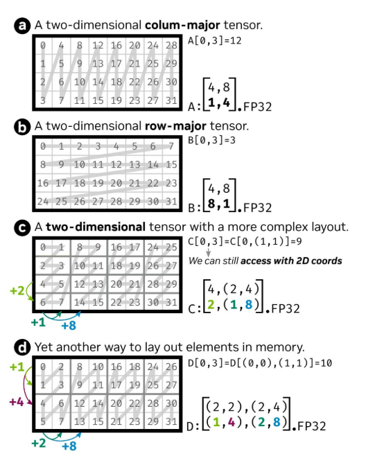

# Layout
## 概述
Layout是一个数据排列的描述体系，可以实现将逻辑坐标映射到索引坐标（offset表示）。简单地讲，Layout提供了多维坐标与内存的映射关系。

Layout为多维数组的访问提供了一个通用接口，它将数组元素在内存中的组织细节抽象化，这使得用户能够编写通用的多维数组访问算法。

## 基础类型与概念

- **Int**

  ACT进一步封装了`AscendC::Std::integral_constant`，作为编译期整数使用：

  - int{2}：运行时整数，或者称为动态整数，是c++ 的正常整数类型，如`int, uint64_t, size_t`等所有满足`std::is_integral`的类型；
  - Int<2>{}：编译期整数，或者称为静态整数，ACT中使用`Int<i>`类型定义，同时通过重载基础一元和二元操作符，使得这些整数计算可以在编译期内完成，且编译期整数和运行时整数之间可以直接进行运算。ACT中将别名`_1, _2, _4, ...`等定义为`Int<1>, Int<2>, Int<4>, ...`等类型，更多定义请参考[`integral_constant.h`](../include/utils/integral_constant.h)。

  ```cpp
  template <int t>
  using Int = AscendC::Std::integral_constant<int, t>;
  using _0 = Int<0>;
  using _1 = Int<1>;
  using _2 = Int<2>;
  using _4 = Int<4>;
  using _8 = Int<8>;
  ...
  ```
- **tuple**

  在Ascend C中，封装了基础数据类型tuple，使其可以更好适配昇腾硬件，具体的原型和使用说明详见[《Ascend C算子开发接口》](https://www.hiascend.com/document/redirect/CannCommunityAscendCApi)中的“高阶API > C++标准库 > 容器函数 > tuple”章节。

- **IntTuple**

  IntTuple并非实际的数据类型，它表示整数和tuple的嵌套定义，一个IntTuple类型，既可以是动态整数，也可以是静态整数或者tuple。这种递归定义的方式允许我们构建任意嵌套的IntTuple，例如：`tuple<tuple<_16, int64_t>, tuple<_1, _128>>`。

  IntTuple不仅用在Layout上，还会用在Shape、Stride和Coord等其他类型中，它们的本质都是IntTuple。

  为了更方便的使用IntTuple，我们定义了一些基础操作，详见[`tuple_utils.h`](../include/utils/tuple_utils.h)：

  - `Get<I>(IntTuple)`：返回IntTuple的第I个元素，支持嵌套使用，如 `Get<I,J>(IntTuple)` 表示返回IntTuple的第I个元素的第J个元素。
  - `GetIntegralConstant<I, IntTuple>()`：编译期函数，针对静态整数组成的IntTuple，返回第I个元素的值。

## Layout的概念

### Layout

`Layout<Shape, Stride>`数据结构是描述多维张量内存布局的基础模板类，通过编译时的形状（`Shape`）和步长（`Stride`）信息，实现逻辑坐标空间到一维内存地址空间的映射，为复杂张量操作和硬件优化提供基础支持。借助模板元编程技术，该类在编译时完成计算和代码生成，从而降低运行时开销。

Layout包含两个核心组成部分，本质都是IntTuple：

- Shape：定义数据的逻辑形状，例如二维矩阵的行数和列数或多维张量的各维度大小。
- Stride：定义各维度在内存中的步长，即同维度相邻元素在内存中的间隔，间隔的单位为元素，与Shape的维度信息一一对应。

Layout原型定义如下，更多内容介绍请参考[《Ascend C算子开发接口》](https://www.hiascend.com/document/redirect/CannCommunityAscendCApi)中的“数据类型定义 > Layout”章节。

```cpp
template <typename ShapeType, typename StrideType>
struct Layout : private Std::tuple<ShapeType, StrideType> {
    __aicore__ inline constexpr Layout(const ShapeType& shape  = {}, const StrideType& stride = {}) : Std::tuple<ShapeType, StrideType>(shape, stride) {}

    __aicore__ inline constexpr decltype(auto) layout() {}
    __aicore__ inline constexpr decltype(auto) layout() const {}

    __aicore__ inline constexpr decltype(auto) GetShape() {}
    __aicore__ inline constexpr decltype(auto) GetShape() const {}

    __aicore__ inline constexpr decltype(auto) GetStride() {}
    __aicore__ inline constexpr decltype(auto) GetStride() const {}
}
```

引入Layout表达，可以简化不同层次矩阵分块参数，以一维和二维的数据排布格式为例，下图展示了Layout如何定义不同的数据排布：



- **ⓐ**：一维Layout，列优先；Shape是`(4, 8)`，表示行方向元素个数为4，列方向元素个数为8；Stride是`(1, 4)`，表示行方向相邻元素在内存上的距离是1，列方向相邻元素在内存上的距离是4。
- **ⓑ**：一维Layout，行优先；Shape是`(4, 8)`，表示行方向元素个数为4，列方向元素个数为8；Stride是`(8, 1)`，表示行方向相邻元素在内存上的距离是8，列方向相邻元素在内存上的距离是1。
- **ⓒ**：二维Layout，可以看作由`1 * 4`个`4 * 2`的小矩阵组成；Shape是`(4, (2, 4))`，表示行方向元素个数为4；内部小矩阵列方向元素个数为2，列方向总共有4个小矩阵；Stride是`(2, (1, 8))`，表示行方向相邻元素在内存上的距离是2；内部小矩阵列方向相邻元素在内存上的距离是1，列方向两个小矩阵之间在内存上的距离是8。

- **ⓓ**：二维Layout，可以看作由`2 * 4`个`2 * 2`的小矩阵组成；Shape是`((2, 2), (2, 4))`，表示内部行方向元素个数为2，行方向一共有2个小矩阵；内部小矩阵列方向元素个数为2，列方向共有4个小矩阵；Stride是`((1, 4), (2, 8))`，表示内部小矩阵行方向相邻元素在内存上的距离是1，行方向上两个小矩阵之间在内存上的距离是4；内部小矩阵列方向相邻元素在内存上的距离是2，列方向上两个小矩阵之间在内存上的距离是8。

通过以上方式Layout可以表达任意维度的内存布局。

### Coordinate

Coordinate本质上是一个tuple，用于表示在不同维度上的坐标值，它和Layout共同用于描述和操作Tensor数据在内存中的组织方式。在ACT中，提供了将多维坐标（coordinate）通过Layout转换为线性索引（index）的方法。

给定一个Layout，其Shape为$(d_0, d_1, d_2, ..., d_n)$，Stride为$(s_0, s_1, s_2, ..., s_n)$，坐标$(c_0, c_1, c_2, ..., c_n)$到线性索引 idx的转换公式为：
$$ idx = c_0 \times s_0 + c_1 \times s_1 + ... + c_n \times s_n $$

Layout通过重载operator()，支持用`layout(coord)`的方式直接计算index：

```cpp
auto shape = MakeShape(3, 4, 5);
auto stride = MakeStride(20, 5, 1);
auto layout = MakeLayout(shape, stride);

auto coord = MakeCoord(1, 2, 3);
auto index = layout(coord);              // index is 1 * 20 + 2 * 5 + 3 * 1 = 33
```

### TensorTrait

在Ascend C编程体系中，Layout数据结构附着在TensorTrait结构体内。TensorTrait是描述Tensor相关信息的基础模板类，其定义如下。关于TensorTrait的更多内容介绍请参考[《Ascend C算子开发接口》](https://www.hiascend.com/document/redirect/CannCommunityAscendCApi)中的“数据类型定义 > TensorTrait”章节。

```cpp
template <typename T, TPosition pos = TPosition::GM, typename LayoutType = Layout<Shape<>, Stride<>>>
struct TensorTrait {
    using LiteType = T;
    using LiteLayoutType = LayoutType;
    static constexpr const TPosition tPos = pos;
public:
    __aicore__ inline TensorTrait(const LayoutType& t = {});
    __aicore__ inline const LayoutType& GetLayout() const;
    __aicore__ inline void SetLayout(const LayoutType& t);
};
```

## Layout的使用

### 定义Layout对象

Layout有多种构造方式，可以是静态整数和动态整数的任意结合，可以定义任意维度：

```cpp
Layout w2h4 = MakeLayout(MakeShape(Int<2>{}, 4), MakeStride(Int<12>{}, Int<1>{}));
Layout w32h48 = MakeLayout(MakeShape(MakeShape(16, 2), MakeShape(16, 3)),
                           MakeStride(MakeStride(16, 256), MakeStride(1, 512)));
```

ACT也提供了从CubeFormat直接转换到Layout的方法，目前支持ND、ND_ALIGN、NZ、ZN、ZZ几种CubeFormat的转换：

```cpp
int32_t row = 256;
int32_t col = 512;
auto layoutND = MakeLayoutByFormat<int8_t, CubeFormat::ND>(row, col);
auto layoutNz = MakeLayoutByFormat<half, CubeFormat::NZ>(row, col);
auto layoutZn = MakeLayoutByFormat<bfloat16_t, CubeFormat::ZN>(row, col);
auto layoutZz = MakeLayoutByFormat<float, CubeFormat::ZZ>(row, col);
```

### 创建带Layout的Tensor对象

创建带Layout的Tensor有如下两种方式。

方式一：

调用MakeLayout接口，指定Shape和Stride，定义Layout对象，从而使用该Layout对象创建Tensor对象。

```cpp
auto layout = MakeLayout(...);
auto trait = MakeTensorTrait<half, TPosition::GM>(layout);
AscendC::GlobalTensor<decltype(trait)> tensorWithLayout;
tensorWithLayout.SetTensorTrait(trait);
```

方式二：

调用MakeLayoutByFormat接口，传入CubeFormat、行列大小等，定义Layout对象，从而使用该Layout对象创建Tensor对象。
```cpp
using LayoutA = FormatToLayoutT<half, CubeFormat::ND>;
using TensorTraitA = TensorTrait<half, TPosition::GM, LayoutA>;

auto layout = MakeLayoutByFormat<half, CubeFormat::ND>(row, col);
AscendC::GlobalTensor<TensorTraitA> tensorWithLayout;
tensorWithLayout.SetTensorTrait(TensorTraitA(layout));
```
