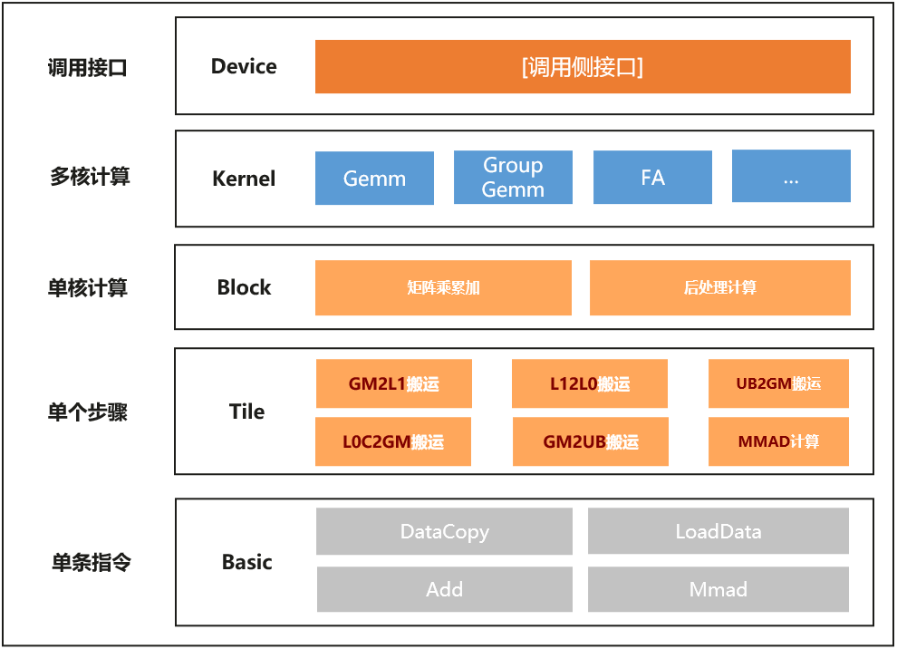

# ACT分层结构
## 概述

ACT针对昇腾AI处理器不同层级上执行的矩阵乘累加操作，提供了一套统一的编程模型。编程模型包含如下分层，由高到低分别是：

- Device层：Host侧调用总入口，包含参数校验、Tiling计算、Workspace管理、Kernel调用等逻辑。
- Kernel层：Kernel函数总入口，通过不同`BlockSchedule`策略控制多核对Block切块的处理顺序。
- Block层：对Matmul搬运、计算数据流进行流水编排处理。
- Tile层：对Ascend C基础API进行封装，提供更大Tile块的搬运能力。
- Basic层：使用Ascend C基础API能力完成数据搬运等基础操作。

<br>

## ACT Gemm（General Matrix Multiplication）模型

ACT基于上述分层结构，实现了经典的多层嵌套循环的矩阵乘运算，相应伪代码展示如下：

```cpp
for (int64_t tileIdx = blockIdx; tileIdx < tileNum; tileIdx += blockNum) {
    for (int kTileIdx = 0; kTileIdx < l1kTileNum; kTileIdx++) {
        for (int l0mTileIdx = 0; l0mTileIdx < l0mTileNum; l0mTileIdx++) {
            for (int l0nTileIdx = 0; l0nTileIdx < l0nTileNum; l0nTileIdx++) {
                for (int l0kTileIdx = 0; l0kTileIdx < l0kTileNum; l0kTileIdx++) {
                    Mmad(c, a, b);
                } // for l0 tile mma_k
            } // for l0 tile mma_n
        } // for l0 tile mma_m
    } // for l1 tile mma_k
} // for l1 tile mma_mn
```

- 第一层嵌套循环`tileIdx < tileNum`，对应`(m, n)`与`(l1m, l1n)`之间的切块。
- 第二层嵌套循环`kTileIdx < l1kTileNum`，对应`k`与`l1k`之间的切块。
- 第三到五层嵌套循环，对应`(l1m, l1n, l1k)`与`(l0m, l0n, l0k)`之间的切块。

模型的关键思想为如何将一个大数据量的矩阵乘计算，按照硬件内部不同的缓存层级，DDR->L1 Buffer->L0 Buffer，分别进行不同的切块处理。各个数据通路的详细描述请参考[《Ascend C算子开发》](https://hiascend.com/document/redirect/CannCommunityOpdevAscendC)中的“编程模型 > 编程范式 > Cube编程范式”。

## ACT Gemm组件

ACT使用各个层级中的组件（类/函数）表达上述循环嵌套，这些组件对数据类型、数据排布、流水排布等进行特化。

<table>
    <tr>
        <th>层级</th>
        <th>API类/函数名称</th>
    </tr>
    <tr>
        <td>Device</td>
        <td>Act::Gemm::Device::DeviceMatmul</td>
    </tr>
    <tr>
        <td>Kernel</td>
        <td>Act::Gemm::Kernel::KernelMatmul</td>
    </tr>
    <tr>
        <td>Block</td>
        <td>Act::Gemm::Block::BlockMmad  <br />Act::Gemm::Block::BlockEpilogue <br /> Act::Gemm::Block::BlockScheduler</td>
    </tr>
    <tr>
        <td>Tile</td>
        <td>Act::Gemm::Tile::Copy</td>
    </tr>
    <tr>
        <td>Basic</td>
        <td>AscendC::DataCopy<br>AscendC::LoadData<br>AscendC::Fixpipe<br>...</td>
    </tr>
</table>

在ACT程序中，首先在Kernel层组合Block主循环和Block后处理，然后用Device层的适配器包装它们组成Kernel，具体包括如下步骤。这个顺序也体现在示例[examples/00_basic_matmul](../examples/00_basic_matmul/main.cpp)中。

1. 组装所需的Block主循环和Block后处理；
2. 将其组合在一起构建成Kernel；
3. 用DeviceMatmul包装Kernel。

### Device层

Device层是Host侧调用的入口，在这一层屏蔽调用Device侧函数的差异。用户定义完Kernel结构之后放入Device层模板，便可以执行算子。

```cpp
// Block
using BlockMmad = Block::BlockMmadBuilder<AType, LayoutA, BType, LayoutB, CType, LayoutC, CType, LayoutC, L1TileShape,
                                          L0TileShape, BlockScheduler, MatmulMultiBlockWithLayout<>>;
using BlockEpilogue = Block::BlockEpilogueEmpty;
using BlockScheduler = IterateKScheduler;

// Kernel
using MatmulKernel = Kernel::KernelMatmul<ProblemShape, BlockMmad, BlockEpilogue, BlockScheduler>;

// Device
using DeviceMatmul = Device::DeviceMatmul<MatmulKernel>;
Device::DeviceMatmul deviceMatmul;
Device::DeviceMatmul::Arguments args = {
    {m, n, k, batch},  // problem shape
    {x1, x2, y, bias}, // Matmul input and output
    {}                 // Epilogue args
};
deviceMatmul.InitParams(args,
                        workspaceDevice); // workspaceDevice is device workspace memory allocated based on computed size
deviceMatmul();                           // Overload operator() to perform execution
```

## Kernel层

Kernel层对应了所有Block在AI处理器上执行逻辑的集合，承担以下功能：

- 对包含的不同Block逻辑进行组合，加入必要的同步逻辑；
- 处理不同Block和全局内存上数据的对应关系（Swizzling）；
- 将输入数据在Block粒度分片。

Kernel层是Device侧调用的入口，也是融合连续矩阵乘、后处理等其他操作的组合点。Kernel层入口定义在[Act::Gemm::Kernel::KernelMatmul](../include/matmul/kernel/kernel_matmul.h)：

```cpp
namespace Act::Gemm::Kernel {
template <class ProblemShape, class BlockMmadBuilder, class BlockEpilogue, class BlockScheduler, typename Enable = void>
class KernelMatmul;
} // namespace Act::Gemm::Kernel
```

KernelMatmul实现的矩阵乘运算由两部分组成：`BlockMmad`和`BlockEpilogue`，其中`BlockMmad`为局部数据块上的矩阵乘加运算，`BlockEpilogue`为`Mmad`之后的运算，如 $\mathbf{C} := \beta \cdot \mathbf{C} + \alpha \cdot \mathbf{A} \mathbf{B}$ 中的 $\beta \cdot \mathbf{C}$。

KernelMatmul组合`BlockMmad`和`BlockEpilogue`的伪代码如下，具体实现见[kernel_matmul_mix_workspace.h](../include/kernel/kernel_matmul_mix_workspace.h)：

```cpp
// BlockMmad blockMmadOp;
// BlockEpilogue epilogueOp;
// BlockScheduler schedulerOp;
int64_t loopIdx = 0;
for (int64_t tileIdx = curBlockIdx; tileIdx < tileNum; tileIdx += blockNum) {
    auto blockCoord = schedulerOp.GetBlockCoord(tileIdx);
    auto blockShape = schedulerOp.GetBlockShape(tileIdx);

    // calculate block-level offset

    if ASCEND_IS_AIC { // Perform Mmad in AIC
        // Synchronize with aiv
        if (loopIdx >= FIRST_PINGPONG) {
            AicWaitAiv<BlockEpilogue>(loopIdx);
        }
        blockMmadOp.IterateAll(workspaceGlobal[workspaceOffset], aGlobal[aOffset], bGlobal[bOffset], blockShape);
        // Notify aiv
        AicNotifyAiv<BlockEpilogue>(loopIdx);
    }
    if ASCEND_IS_AIV { // Perform epilogue operations in AIV
        // Synchronize with aic
        AivWaitAic<BlockEpilogue>(loopIdx);
        // Calulate epilogue
        epilogueOp(blockShape, blockCoord, cOffset, workspaceOffset);
        // Notify aic
        AivNotifyAic<BlockEpilogue>(loopIdx);
    }
    loopIdx += 1;
}
// Match extra event after aic process finished
if ASCEND_IS_AIC {
    AicWaitEvent<BlockEpilogue>(loopIdx);
}
```

## Block层

### BlockMmad

`Act::Gemm::Block::BlockMmad`是矩阵乘累加（`Mmad`）主循环的主要接口，类定义在[`block_mmad.h`](../include/matmul/block/block_mmad.h)中。

```cpp
namespace Act::Gemm::Block {
template <class DispatchPolicy, class L1TileShape, class L0TileShape, class AType, class BType, class CType,
          class BiasType = CType, class TileCopy = void,
          typename = void // Supports specialization via DispatchPolicy type
          >
class BlockMmad {};
} // namespace Act::Gemm::Block
```

- `DispatchPolicy`：流水策略，Block层重要参数之一，使`BlockMmad`可以根据不同的流水策略进行特化；
- `L1TileShape`和`L0TileShape`：对应L1 Buffer和L0 Buffer上使用的基本块大小，由`(L1M, L1N, L0K)`和`(L0M, L0N, L0K)`表示；

  模板参数`L1TileShape`和`L0TileShape`的限制如下：

  <table>
      <tr>
          <th>模板参数</th>
          <th>限制</th>
      </tr>
      <tr>
          <td rowspan="4"><code>L1TileShape</code></td>
          <td><code>L1M % 16 = 0</code> 且 <code>L1M &lt;= 128</code></td>
      </tr>
      <tr>
          <td><code>L1N % 16 = 0</code> 且 <code>L1N &lt;= 256</code> </td>
      </tr>
      <tr>
          <td><code>L1K % 16 = 0</code></td>
      </tr>
      <tr>
          <td><code>(L1M * L1K * sizeof(AType) + L1K * L1N * sizeof(BType)) * 2 &lt;= L1Size</code></td>
      </tr>
      <tr>
          <td rowspan="6"><code>L0TileShape</code></td>
          <td><code>L0M = L1M</code></td>
      </tr>
      <tr>
          <td><code>L0N = L1N</code></td>
      </tr>
      <tr>
          <td><code>L0K % 16 = 0</code> 且 <code>L1K % L0K = 0</code></td>
      </tr>
      <tr>
          <td><code>L0M * L0K * sizeof(AType) &lt;= L0ASize</code></td>
      </tr>
      <tr>
          <td><code>L0K * L0N * sizeof(BType) &lt;= L0BSize</code></td>
      </tr>
      <tr>
          <td><code>L0M * L0N * sizeof(CType) &lt;= L0CSize</code></td>
      </tr>
  </table>

- `AType`、`BType`、`CType`、`BiasType`：支持以下两种实例，但是不可混用；
  - MatmulType的实例，其中包含了A、B、C矩阵和Bias向量的内存逻辑位置、物理排布格式、数据类型和是否转置等信息；MatmulType的说明详见[《Ascend C算子开发接口》](https://www.hiascend.com/document/redirect/CannCommunityAscendCApi)中的“高阶API > Matmul > Matmul Kernel侧接口 > 使用说明 > MatmulType参数说明  ”；
  - MatmulLayoutType的实例，MatmulLayoutType的参数说明如下：

    <table>
        <tr>
            <th>参数</th>
            <th>说明</th>
        </tr>
        <tr>
            <td>LAYOUT</td>
            <td>
            矩阵的数据排布格式，具体为：<br>
            行优先（RowMajor）：矩阵的每一行数据在内存中是连续存储的。<br>
            列优先（ColMajor）：矩阵的每一列数据在内存中是连续存储的。<br>
            行优先对齐（RowMajorAlign）：矩阵的每一行数据在内存中是连续存储的，每行数据不足32字节时，将行方向上补齐数据至32字节。<br>
            列优先对齐（ColumnMajorAlign）：矩阵的每一列数据在内存中是连续存储的，每列数据不足32字节时，将列方向上补齐数据至32字节。<br>
            FRACTAL_NZ（Nz）：FRACTAL_NZ数据排布格式。<br>
            FRACTAL_ZN（Zn）：FRACTAL_ZN数据排布格式。<br>
            </td>
        </tr>
        <tr>
            <td>TYPE</td>
            <td>
            数据类型。支持的范围与MatmulType中的TYPE参数相同。
            </td>
        </tr>
        <tr>
            <td>POSITION</td>
            <td>
            内存逻辑位置。支持的范围与MatmulType中的POSITION参数相同。
            </td>
        </tr>
    </table>

- `TileCopy`: Tile层`TileCopy`的实例，包含了不同访存层级间的数据拷贝，如GlobalMemory到L1 Buffer，L1 Buffer到L0 Buffer，L0 Buffer到GlobalMemory等。
- `typename = void`：支持利用[`SFINAE`](https://en.cppreference.com/w/cpp/language/sfinae.html)机制实现不同的模板特化。

### DispatchPolicy

BlockMmad的实现不是通用的，相反，它们必须针对每个算法和AI处理器的架构特例化；用户可以通过选择与该特例化匹配的模板参数来调度到BlockMmad的特例化。ACT采用基于标签的调度策略类型来特例化BlockMmad，并为其提供调优能力。

以下给出了一个DispatchPolicy的示例，DispatchPolicy结构体定义详见[dispatch_policy.h](../include/matmul/policy/dispatch_policy.h)。

```cpp
template <class SingleCoreShape = AscendC::Shape<_0, _0, _0>>
struct MatmulMultiBlockWithLayout {
    using ScheduleType = KernelMultiBlock;
    using SingleShape = SingleCoreShape;
    constexpr static bool enableInputDataLenCheck = false;
};
```

- ScheduleType：调度策略，不同策略对应不同的调度策略结构体，如KernelMultiBlock表明使能了MDL特性，以支持L1缓存多个基本块，从GlobalMemory到L1进行一次性“大包”搬运；MDL的介绍详见[《Ascend C算子开发接口》](https://www.hiascend.com/document/redirect/CannCommunityAscendCApi)中的“高阶API > Matmul > Matmul > MatmulConfig”章节。
- SingleShape：单核内shape大小，单位为元素，默认为0，表示后续动态设置；更多介绍详见[《Ascend C算子开发接口》](https://www.hiascend.com/document/redirect/CannCommunityAscendCApi)的“高阶API > Matmul > Matmul Tiling > Matmul Tiling类 > TCubeTiling结构体”章节中的singleCoreM, singleCoreN, singleCoreK。
- enableInputDataLenCheck：默认为false，表明不使能循环执行数据搬入，详见[《Ascend C算子开发接口》](https://www.hiascend.com/document/redirect/CannCommunityAscendCApi)的“高阶API > Matmul > Matmul > GetMDLConfig”章节中的intrinsicsLimit参数。

采用DispatchPolicy设计避免了代码重复，主循环可以被多个不同的Kernel使用；同时提供了一个清晰、单一的扩展点，方便用户定制拓展。目前支持的DispatchPolicy及其对应的功能、使用限制见[Block Dispatch Policies说明](./05_dispatch_policies.md)。

### BlockEpilogue

BlockEpilogue实现了涉及输出矩阵的逐元素操作。用户可以提供自定义的后处理，或者使用标准后处理之一。这些后处理位于目录`include/epilogue`中，包括[`Act::Gemm::Block::BlockEpilogueQuant`](../include/epilogue/block_epilogue_quant.h)这样的类，具体细节请参阅源码实现。

### BlockScheduler

BlockScheduler定义矩阵计算中循环处理数据时的方向顺序，并提供offset的计算方法，当前提供了如下功能的`BlockScheduler`：

- [基础切块](../include/matmul/block/block_scheduler_iterateK.h)：切块后依次分配给不同的核按照行优先的顺序进行处理。
- [错位分核切块](../include/matmul/block/block_scheduler_misplace_core.h)：切块后依次沿对角线分配给不同的核处理，可以有效减少AB矩阵读读冲突问题。
- [带L2切分的错位分核切块](../include/matmul/block/block_scheduler_l2_misplace_core.h)：将数据在M和N方向，切成大的L2块， 然后在每块内部，使能错位分核切块，可以有效减少L2cache miss情况。

## Tile层

Tile层接口主要是基于基础API进行逻辑封装, 这一层的目的是构建可组合的硬件微内核，这些微内核由硬件加速的数据拷贝操作组成。Tile层的Copy方法提供了不同硬件上完成相同数据拷贝语义的统一API。

用户表达搬运过程时，只需要表达矩阵源Tensor和目的Tensor的Layout信息，以及源Tessor或目的Tensor的起始点坐标信息Coord，接口会根据Shape、Stride和Coord等信息萃取出来基础API所需的blockLen、srcStride等参数信息进行填充，用户无需感知具体基础API指令和参数。

### TileCopy

TileCopy的定义如下，更多TileCopy的实现详见 [`tile_copy.h`](../include/matmul/tile/tile_copy.h)。

```cpp
template <class ArchTag, class CopyPolicy>
struct TileCopy<ArchTag, CopyPolicy> {
    template <class InputType, class DstTrait, class SrcTrait>
    using CopyGmToA1 = Copy<ArchTag, CopyPolicy, InputType, DstTrait, SrcTrait>;

    template <class InputType, class DstTrait, class SrcTrait>
    using CopyGmToB1 = Copy<ArchTag, CopyPolicy, InputType, DstTrait, SrcTrait>;

    template <class OutputType, class DstTrait, class SrcTrait>
    using CopyCo1ToOut = Copy<ArchTag, CopyPolicy, OutputType, DstTrait, SrcTrait>;

    template <class AType, class DstTrait, class SrcTrait>
    using CopyA1ToA2 = Copy<ArchTag, CopyPolicy, AType, DstTrait, SrcTrait>;

    template <class BType, class DstTrait, class SrcTrait>
    using CopyB1ToB2 = Copy<ArchTag, CopyPolicy, BType, DstTrait, SrcTrait>;
};
```

- [ArchTag](../include/utils/arch.h)：硬件平台tag；
- [CopyPolicy](../include/matmul/tile/tile_copy_policy.h)：拷贝策略，支持通过不同拷贝策略进行特化`Copy`，并在`TileCopy`中替换不同访存层级的拷贝操作，以实现自定义拓展，当前支持的拷贝策略见[Copy Policies说明](./06_copy_policies.md)。
- CopyGmToA1：将A矩阵从GlobalMemory搬运到L1 Buffer，支持使用特化的`Copy`结构体替换；
- CopyGmToB1：将B矩阵从GlobalMemory搬运到L1 Buffer，支持使用特化的`Copy`结构体替换；
- CopyCo1ToOut：将Mmad计算结果从L0C Buffer搬运到指定输出访存，支持使用特化的`Copy`结构体替换；
- CopyA1ToA2：将A矩阵从L1 Buffer搬运到L0A Buffer，支持使用特化的`Copy`结构体替换；
- CopyB1ToB2：将B矩阵从L1 Buffer搬运到L0B Buffer，支持使用特化的`Copy`结构体替换。

### Copy结构体

所有Tile层的数据拷贝操作均为Copy结构体的特化，通过`ArchTag`和`CopyPolicy`以及[`SFINAE`](https://en.cppreference.com/w/cpp/language/sfinae.html)机制进行特化，可以实现任意访存层级的自定义拷贝操作。Copy结构体的定义如下：

```cpp
template <class ArchTag, class CopyPolicy, class DataType, class DstTrait, class SrcTrait, typename T = void,
          const auto& cfg = CFG_NORM>
struct Copy {
    template <class Coord>
    __aicore__ inline void operator()(DstTensor& dst, SrcTensor& src, const Coord& coord);
};
```

- ArchTag：同[`TileCopy`](#tilecopy)中的定义；
- CopyPolicy：拷贝策略，详见[`TileCopy`](#tilecopy)；
- DataType：输入或输出的数据类型，对GlobalMemory->L1 Buffer和L1 Buffer->L0A Buffer/L0B Buffer，表示输入的数据类型；对L0C Buffer->output，表示输出的数据类型；
- DstTrait：目的Tensor的TensorTrait 表达，包含了Layout等信息，具体数据类型详见[ACT Layout概念](./03_layout.md)中的TensorTrait章节；
- SrcTrait：源Tensor的TensorTrait表达；
- typename T = void：支持利用[`SFINAE`](https://en.cppreference.com/w/cpp/language/sfinae.html)机制实现不同的模板特化，如针对排布类型（如NZ）或物理位置（如UB）进行定制拷贝操作；
- cfg：预留参数，当前未使用；
- Coord：源或目的Tensor中的坐标，对GlobalMemory->L1 Buffer和L1 Buffer->L0A Buffer/L0B Buffer，表示源Tensor中的坐标；对L0C Buffer->output，表示目的Tensor中的坐标。

## Basic层

Basic层直接调用基础API能力完成基础操作，基础API具体可以参考[《Ascend C算子开发接口》](https://www.hiascend.com/document/redirect/CannCommunityAscendCApi)中的“基础API”章节。
